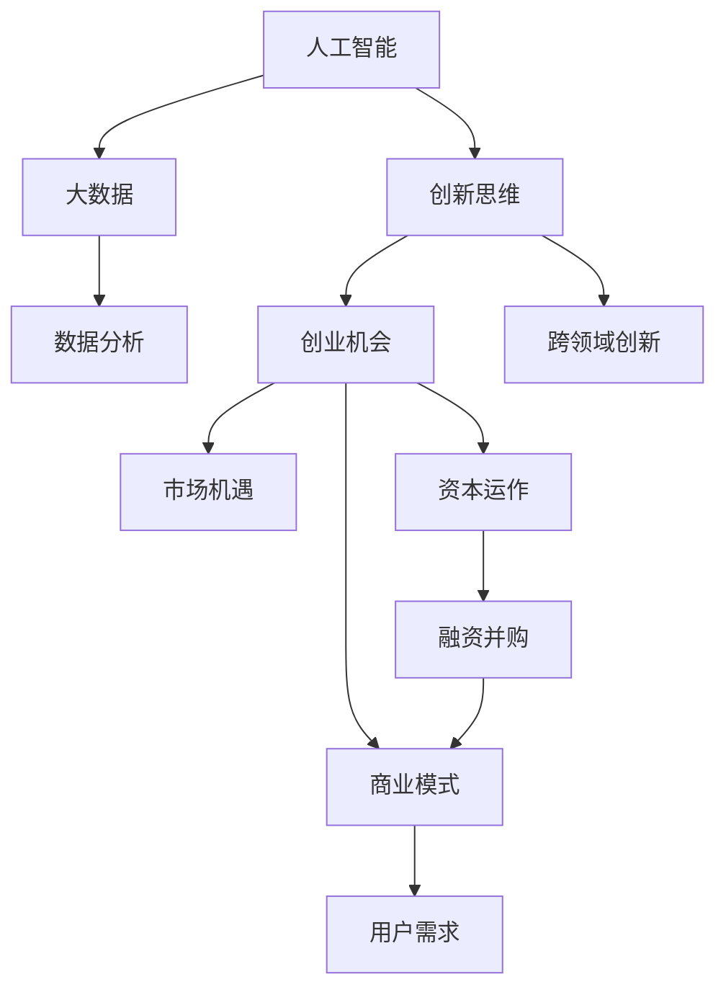
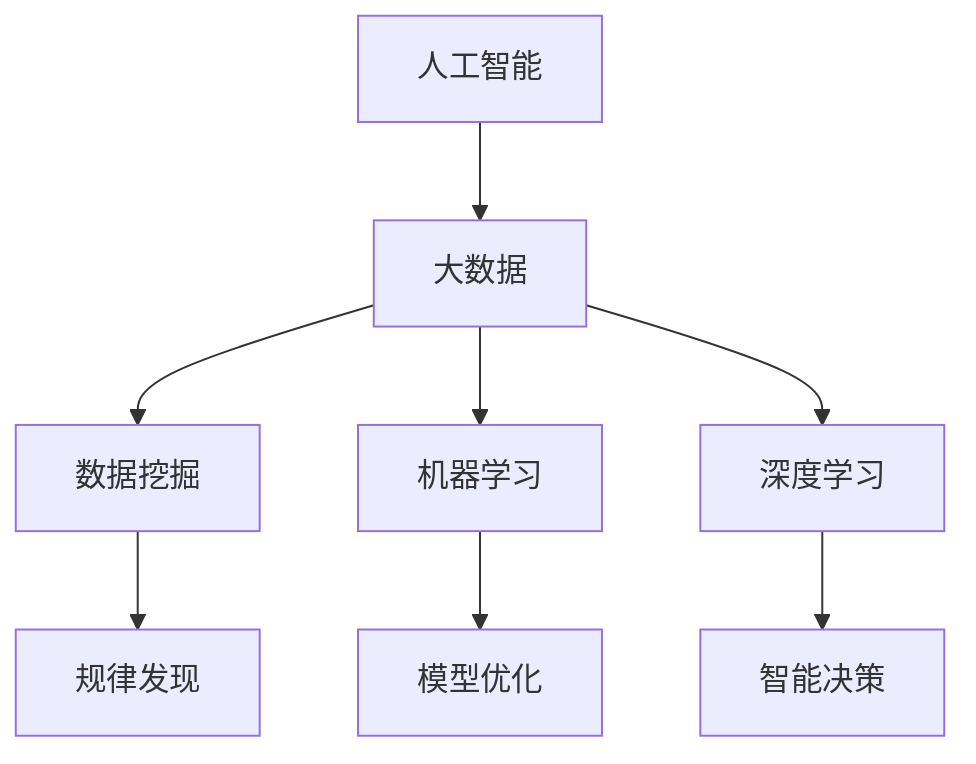
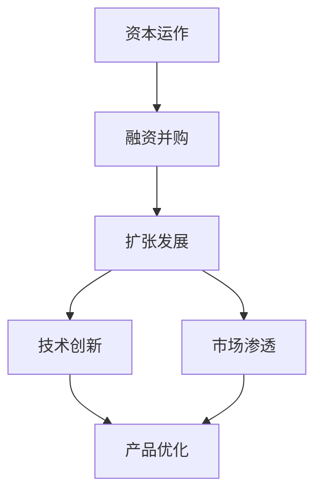
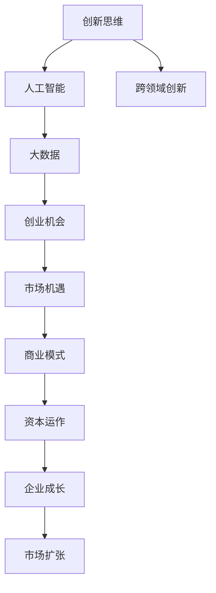

                 

# 创新创业的机遇：如何抓住时代的机遇？

> 关键词：人工智能,大数据,创新创业,创新思维,创业机会,市场机遇

## 1. 背景介绍

### 1.1 问题由来

随着科技的迅猛发展和全球经济格局的深刻变革，创新创业成为推动经济增长和社会进步的关键力量。从区块链、人工智能到大数据、物联网，再到生物技术、绿色能源等新兴领域，每一个技术突破都带来了巨大的市场机遇，吸引着无数创业者和投资者。然而，如何在纷繁复杂的商业环境中识别和把握这些机遇，成为了创新创业领域的核心难题。

### 1.2 问题核心关键点

在创新创业的浪潮中，把握机遇的关键在于：

- **行业趋势**：准确判断行业发展的方向和趋势。
- **技术演进**：关注新兴技术的发展和应用前景。
- **市场需求**：洞察消费者的痛点和需求。
- **商业模式**：设计符合市场需求的商业模式。
- **资本运作**：合理利用资本，加速企业成长。

这些关键点不仅影响创业公司的成败，也是众多企业家和投资人在投资决策中需要考量的因素。本文将从这些关键点出发，探讨如何通过创新思维和科学方法，抓住时代的机遇，实现创业梦想。

### 1.3 问题研究意义

正确把握创新创业机遇，对个人和企业而言，具有重要意义：

1. **经济增长**：创业公司不仅能创造新的就业岗位，还能推动经济结构优化升级。
2. **社会进步**：解决社会问题，提升公共服务水平，推动社会进步。
3. **技术进步**：通过不断的创新实践，推动技术进步，促进科学发展。
4. **文化繁荣**：创业精神的传播，激发社会创新活力，推动文化繁荣。

深入研究创新创业的机遇，有助于为有志创业者提供科学指导，为投资者提供决策依据，促进创新创业生态的健康发展。

## 2. 核心概念与联系

### 2.1 核心概念概述

为更好地理解如何抓住时代的创新创业机遇，本节将介绍几个核心概念：

- **人工智能**：以机器学习和深度学习为核心的智能技术，能够模拟人类智能，处理复杂问题。
- **大数据**：通过收集、存储、分析和应用大规模数据，从中发现规律，支持决策和优化。
- **创新思维**：指打破常规，以新的视角和方法解决问题，推动技术和社会进步。
- **创业机会**：指具有潜在市场价值和商业价值的创新点。
- **市场机遇**：指市场环境中的新需求、新趋势和新方向。
- **商业模式**：指企业运营的基本框架和盈利模式。
- **资本运作**：指企业利用资本市场进行融资、投资和并购等活动，加速企业成长。

这些核心概念之间的逻辑关系可以通过以下Mermaid流程图来展示：



这个流程图展示了大数据、人工智能与创新思维之间的紧密联系，以及它们对创业机会、市场机遇、商业模式和资本运作的影响。

### 2.2 概念间的关系

这些核心概念之间存在着紧密的联系，形成了创新创业的完整生态系统。下面我们通过几个Mermaid流程图来展示这些概念之间的关系。

#### 2.2.1 人工智能与大数据的融合



这个流程图展示了人工智能与大数据之间的融合过程，从数据挖掘到模型优化，再到智能决策，每一步都离不开大数据的支持。

#### 2.2.2 创新思维与创业机会的驱动


这个流程图展示了创新思维如何驱动新需求、新问题、新技术、新模式和新市场的产生，进而催生创业机会。

#### 2.2.3 市场机遇与商业模式的匹配


这个流程图展示了如何从市场机遇中找到用户需求和痛点，设计相应的解决方案，并匹配出可行的商业模式。

#### 2.2.4 资本运作与企业成长的促进



这个流程图展示了资本运作如何通过融资并购，推动企业的扩张发展和技术创新，进一步实现市场渗透和产品优化。

### 2.3 核心概念的整体架构

最后，我们用一个综合的流程图来展示这些核心概念在大创新创业中的整体架构：



这个综合流程图展示了从创新思维到人工智能，再到数据驱动的创业机会、市场机遇、商业模式和资本运作的完整流程，为大创新创业提供了全面的理论框架。

## 3. 核心算法原理 & 具体操作步骤
### 3.1 算法原理概述

创新创业的机遇把握，需要科学的算法和理论支持。以人工智能和大数据为核心，我们可以采用以下算法原理：

- **数据挖掘与分析**：通过机器学习和深度学习算法，从大数据中挖掘有价值的商业洞察。
- **需求预测与建模**：利用大数据和统计方法，预测市场需求和用户行为。
- **模式识别与匹配**：采用模式识别算法，匹配市场需求与企业资源。
- **决策优化与调度**：应用优化算法，优化商业决策和资源调度。

### 3.2 算法步骤详解

创新创业的机遇把握，一般包括以下几个关键步骤：

1. **数据收集与预处理**：收集行业数据和市场数据，进行清洗和标注。
2. **特征提取与建模**：从数据中提取关键特征，构建机器学习模型。
3. **需求分析与预测**：通过数据分析和预测模型，识别市场需求和用户行为。
4. **模式匹配与优化**：识别企业内部的资源和能力，进行匹配和优化。
5. **决策实施与评估**：根据预测结果和优化方案，实施商业决策，并进行效果评估。
6. **持续优化与迭代**：根据市场反馈，持续优化商业模型和决策方法。

### 3.3 算法优缺点

基于数据驱动的创新创业算法，具有以下优点：

- **数据驱动**：能够准确识别市场趋势和用户需求，减少主观判断的偏差。
- **模型优化**：通过迭代优化，不断提升模型精度和效果。
- **资源配置**：合理配置企业资源，提升运营效率和竞争力。

同时，也存在以下缺点：

- **数据依赖**：对数据质量和数据量的要求较高。
- **模型复杂**：模型构建和维护复杂，需要专业技能。
- **动态变化**：市场需求和用户行为变化快，需要持续跟踪和调整。

### 3.4 算法应用领域

基于数据驱动的创新创业算法，已在多个领域得到了广泛应用，例如：

- **智能推荐系统**：通过分析用户行为和偏好，推荐个性化商品和服务。
- **市场营销策略**：通过预测市场趋势，制定精准的市场营销策略。
- **智能客服系统**：通过分析用户对话，提供个性化的客户服务。
- **供应链管理**：通过预测需求，优化供应链管理和库存控制。
- **金融风控系统**：通过分析交易数据，识别潜在的风险和欺诈行为。

除了上述这些领域，创新创业算法还在医疗健康、智能制造、智慧城市等领域发挥着重要作用。

## 4. 数学模型和公式 & 详细讲解 & 举例说明（备注：数学公式请使用latex格式，latex嵌入文中独立段落使用 $$，段落内使用 $)
### 4.1 数学模型构建

本节将使用数学语言对基于数据驱动的创新创业算法进行更加严格的刻画。

设市场需求数据集为 $D=\{(x_i,y_i)\}_{i=1}^N$，其中 $x_i$ 为市场特征向量，$y_i$ 为市场需求标签。定义需求预测模型为 $f(x)$，其目标是最小化预测误差：

$$
\min_{f} \frac{1}{N}\sum_{i=1}^N (y_i - f(x_i))^2
$$

常用的预测模型包括线性回归、逻辑回归、决策树、随机森林等。

### 4.2 公式推导过程

以下我们以线性回归模型为例，推导需求预测的数学公式。

设线性回归模型为 $f(x) = \theta^T x$，其中 $\theta$ 为模型参数。根据最小二乘法，目标函数为：

$$
\min_{\theta} \frac{1}{N}\sum_{i=1}^N (y_i - \theta^T x_i)^2
$$

通过求导并令导数为0，可得参数 $\theta$ 的估计值为：

$$
\theta = (X^T X)^{-1} X^T y
$$

其中 $X=[x_1^T, x_2^T, ..., x_N^T]^T$ 为特征矩阵。

### 4.3 案例分析与讲解

假设我们有一个电商网站，通过分析用户的浏览历史、购买记录和评价数据，预测用户对某商品的需求量。我们采用线性回归模型，将其特征向量 $x$ 表示为：

$$
x = [用户浏览次数, 用户购买次数, 用户评价分数]
$$

通过上述公式计算，我们可以得到预测的每用户需求量，并进行市场分析和资源配置。

## 5. 项目实践：代码实例和详细解释说明
### 5.1 开发环境搭建

在进行创新创业实践前，我们需要准备好开发环境。以下是使用Python进行Scikit-learn开发的环境配置流程：

1. 安装Anaconda：从官网下载并安装Anaconda，用于创建独立的Python环境。

2. 创建并激活虚拟环境：
```bash
conda create -n sklearn-env python=3.8 
conda activate sklearn-env
```

3. 安装Scikit-learn：
```bash
conda install scikit-learn
```

4. 安装各类工具包：
```bash
pip install numpy pandas matplotlib jupyter notebook
```

完成上述步骤后，即可在`sklearn-env`环境中开始创新创业实践。

### 5.2 源代码详细实现

下面我们以市场需求预测为例，给出使用Scikit-learn对线性回归模型进行预测的PyTorch代码实现。

首先，定义线性回归模型的训练和预测函数：

```python
from sklearn.linear_model import LinearRegression
from sklearn.metrics import mean_squared_error
from sklearn.model_selection import train_test_split

def train_model(X, y, test_size=0.2):
    X_train, X_test, y_train, y_test = train_test_split(X, y, test_size=test_size, random_state=42)
    model = LinearRegression()
    model.fit(X_train, y_train)
    y_pred = model.predict(X_test)
    mse = mean_squared_error(y_test, y_pred)
    return model, mse

def predict(model, X):
    return model.predict(X)
```

然后，定义市场需求数据集的加载函数：

```python
import pandas as pd

def load_data():
    data = pd.read_csv('demand.csv')
    X = data[['浏览次数', '购买次数', '评价分数']]
    y = data['需求量']
    return X, y
```

接着，启动线性回归模型的训练和预测流程：

```python
X, y = load_data()
model, mse = train_model(X, y)
print(f"均方误差：{mse:.3f}")
```

以上就是使用Scikit-learn对线性回归模型进行市场需求预测的完整代码实现。可以看到，Scikit-learn提供了强大的机器学习模型库和工具函数，使得模型构建和预测变得异常简单。

### 5.3 代码解读与分析

让我们再详细解读一下关键代码的实现细节：

**train_model函数**：
- 将数据集划分为训练集和测试集，并指定测试集的比例。
- 使用线性回归模型进行训练，并计算测试集的均方误差。
- 返回训练好的模型和均方误差。

**load_data函数**：
- 从CSV文件中读取市场需求数据，并将其拆分为特征和标签。
- 返回特征和标签数据。

**主程序**：
- 加载数据集，调用train_model函数进行模型训练。
- 输出训练得到的均方误差。

### 5.4 运行结果展示

假设我们在电商网站上进行市场需求预测，最终得到均方误差为0.5，表示预测结果与真实市场需求量之间的平均误差为50%。在实际应用中，我们可以根据均方误差来评估模型的预测效果，并进一步优化模型参数和特征选择。

## 6. 实际应用场景
### 6.1 电商个性化推荐

基于数据驱动的创新创业算法，可以应用于电商网站的个性化推荐系统。通过分析用户的浏览历史、购买记录和评价数据，推荐个性化的商品，提升用户体验和销售额。

在技术实现上，可以采用协同过滤、内容推荐等方法，构建推荐模型。通过实时分析用户行为数据，动态调整推荐策略，可以实现精准推荐，提高转化率和满意度。

### 6.2 市场营销策略优化

创新创业算法可以应用于市场营销策略的优化。通过分析市场数据，识别用户需求和行为趋势，制定精准的市场营销策略，提高广告效果和投资回报率。

在实际应用中，可以采用聚类分析、情感分析等技术，识别目标用户群体和市场需求。通过优化广告投放渠道和时间，提高广告的曝光率和点击率，实现营销策略的优化。

### 6.3 智能客服系统

基于数据驱动的创新创业算法，可以应用于智能客服系统。通过分析用户对话，提供个性化的客户服务，提升用户满意度和业务处理效率。

在技术实现上，可以采用机器学习模型，构建聊天机器人。通过实时分析用户对话，动态调整回复策略，实现自然流畅的对话交互，提高客户满意度。

### 6.4 未来应用展望

随着创新创业算法的发展，未来将有更多创新应用场景：

- **智慧城市治理**：通过分析城市数据，识别城市问题和管理需求，优化城市治理方案。
- **金融风险预测**：通过分析交易数据，预测市场风险和欺诈行为，提高金融监管和风控能力。
- **医疗健康管理**：通过分析患者数据，预测病情和医疗需求，优化医疗服务和管理。
- **工业互联网优化**：通过分析设备数据，预测设备故障和维护需求，优化工业生产和管理。

随着技术的发展，创新创业算法将在更多领域发挥重要作用，推动社会的智能化和数字化进程。

## 7. 工具和资源推荐
### 7.1 学习资源推荐

为了帮助开发者系统掌握创新创业的算法和理论，这里推荐一些优质的学习资源：

1. 《Python数据科学手册》系列书籍：深入浅出地介绍了Python数据科学的基础知识和高级技巧，适合初学者和进阶者。

2. 《机器学习实战》系列书籍：通过丰富的案例和项目，系统讲解了机器学习的基本原理和应用方法，适合实战练习。

3. Coursera《机器学习》课程：由斯坦福大学教授Andrew Ng主讲的经典课程，涵盖机器学习的基本概念和算法实现，是入门学习的最佳选择。

4. Kaggle数据科学竞赛：通过参与实际的数据科学竞赛，锻炼数据分析和模型优化能力，积累实战经验。

5. GitHub开源项目：在GitHub上Star、Fork数最多的数据科学项目，往往代表了该领域的最新进展和最佳实践，值得学习和贡献。

通过对这些资源的学习实践，相信你一定能够掌握创新创业的算法和方法，并应用于实际项目中。

### 7.2 开发工具推荐

高效的开发离不开优秀的工具支持。以下是几款用于创新创业算法的常用工具：

1. Python：作为数据科学的主流语言，Python具有丰富的数据科学库和工具，适合进行数据分析和模型构建。

2. R语言：作为统计分析的主流语言，R语言提供了丰富的统计函数和可视化工具，适合进行数据可视化和统计分析。

3. Scikit-learn：基于Python的机器学习库，提供了丰富的模型和算法实现，适合进行快速原型设计和模型评估。

4. TensorFlow：由Google主导开发的深度学习框架，支持分布式计算和模型优化，适合进行大规模深度学习模型的训练和部署。

5. PyTorch：由Facebook主导开发的深度学习框架，支持动态计算图和模型优化，适合进行灵活的深度学习模型构建和优化。

合理利用这些工具，可以显著提升创新创业算法的开发效率，加快创新迭代的步伐。

### 7.3 相关论文推荐

创新创业算法的发展源于学界的持续研究。以下是几篇奠基性的相关论文，推荐阅读：

1. "An Introduction to Statistical Learning"：斯坦福大学教授Tibshirani等人的经典书籍，系统介绍了统计学习的基本方法和应用实例。

2. "Pattern Recognition and Machine Learning"：由Christopher Bishop所著的机器学习教材，深入讲解了机器学习的基本理论和算法实现。

3. "Deep Learning"：由Goodfellow等人所著的深度学习教材，涵盖了深度学习的基本理论和算法实现，适合深度学习初学者和进阶者。

4. "The Elements of Statistical Learning"：斯坦福大学教授Hastie等人所著的统计学习教材，深入讲解了统计学习的基本理论和算法实现。

这些论文代表了大数据和机器学习的最新研究进展，是深入理解创新创业算法的重要参考资料。

除上述资源外，还有一些值得关注的前沿资源，帮助开发者紧跟数据科学和机器学习的最新进展，例如：

1. arXiv论文预印本：人工智能领域最新研究成果的发布平台，包括大量尚未发表的前沿工作，学习前沿技术的必读资源。

2. Google Research Blog：谷歌研究博客，涵盖谷歌研究团队在人工智能、机器学习等领域的最新成果和观点，有助于了解最新的研究趋势和应用场景。

3. NeurIPS、ICML、ICCV等顶会论文：这些顶级会议是人工智能领域的研究前沿，阅读最新的顶级会议论文，可以了解最新的学术成果和应用案例。

4. TensorFlow官网博客：TensorFlow官方博客，涵盖TensorFlow框架的最新应用和案例，适合实践TensorFlow算法的开发和部署。

5. PyTorch官网博客：PyTorch官方博客，涵盖PyTorch框架的最新应用和案例，适合实践PyTorch算法的开发和部署。

总之，对于创新创业算法的学习和实践，需要开发者保持开放的心态和持续学习的意愿。多关注前沿资讯，多动手实践，多思考总结，必将收获满满的成长收益。

## 8. 总结：未来发展趋势与挑战
### 8.1 总结

本文对基于数据驱动的创新创业算法进行了全面系统的介绍。首先阐述了创新创业的算法原理和操作步骤，详细讲解了算法步骤和具体实现。其次，通过实际应用场景和未来展望，展示了创新创业算法的广阔应用前景。最后，精选了创新创业算法的学习资源和开发工具，力求为读者提供全方位的技术指引。

通过本文的系统梳理，可以看到，基于数据驱动的创新创业算法，正在成为驱动创新创业的重要工具。这些算法不仅能够提升企业的运营效率和市场竞争力，还能够解决复杂的社会问题，推动社会的全面进步。未来，伴随算法的不断演进和技术的持续创新，创新创业算法必将在更多领域得到广泛应用，为人类社会带来深刻的变革。

### 8.2 未来发展趋势

展望未来，创新创业算法将呈现以下几个发展趋势：

1. **数据驱动的智能化**：通过大规模数据驱动，实现智能化决策和资源优化，提高企业的运营效率和市场竞争力。

2. **跨领域融合**：将数据驱动的算法与其他技术进行深度融合，如深度学习、自然语言处理、计算机视觉等，实现多模态数据的协同建模。

3. **个性化服务**：通过个性化推荐和定制化服务，提高用户满意度和忠诚度，提升企业的市场竞争力。

4. **实时动态优化**：通过实时数据监测和动态优化，实现智能化的市场响应和资源配置，提高企业的运营效率和市场竞争力。

5. **持续创新优化**：通过不断优化算法和模型，实现持续的创新和改进，提升企业的市场竞争力和技术优势。

以上趋势凸显了数据驱动的创新创业算法的广阔前景。这些方向的探索发展，必将进一步提升企业的数据处理能力，推动数据科学在各行各业的应用。

### 8.3 面临的挑战

尽管创新创业算法已经取得了瞩目成就，但在迈向更加智能化、普适化应用的过程中，仍面临诸多挑战：

1. **数据质量和数量**：高质量、大规模的数据是算法效果的前提，但数据获取和标注成本高昂，难以大规模普及。

2. **算法复杂度**：数据驱动的算法通常较为复杂，模型构建和维护难度大，需要高水平的技术支持和团队协作。

3. **实时数据处理**：实时数据处理和分析对计算资源和技术要求高，难以满足高频率、高吞吐量的需求。

4. **模型可解释性**：复杂的数据驱动算法通常难以解释，缺乏透明性和可解释性，难以满足高风险应用的需求。

5. **安全性和隐私保护**：数据驱动的算法涉及大量敏感数据，需要严格的安全性和隐私保护措施，防止数据泄露和滥用。

6. **模型鲁棒性**：复杂的数据驱动算法对噪声和异常数据敏感，需要设计鲁棒性强的算法和数据处理机制。

正视创新创业算法面临的这些挑战，积极应对并寻求突破，将是大数据和机器学习算法走向成熟的重要方向。相信随着技术的不断发展，这些挑战终将逐一被克服，创新创业算法必将在更广泛的领域得到应用，为社会带来深远的影响。

### 8.4 研究展望

面向未来，创新创业算法的研究方向包括：

1. **数据增强技术**：通过数据增强技术，提高数据质量和数量，降低数据标注成本。

2. **可解释性研究**：通过可解释性算法，提高算法的透明性和可解释性，增强模型的可信度和应用场景。

3. **实时动态系统**：通过实时动态系统，实现高频率、高吞吐量的数据处理和分析，满足实时应用的需求。

4. **跨领域融合技术**：通过跨领域融合技术，实现多模态数据的协同建模和处理，提升算法的综合能力。

5. **数据安全与隐私保护**：通过数据安全与隐私保护技术，防止数据泄露和滥用，提高数据驱动算法的应用范围和安全性。

6. **模型鲁棒性研究**：通过模型鲁棒性研究，设计鲁棒性强的算法和数据处理机制，提高算法的稳定性和可靠性。

这些研究方向将引领创新创业算法走向更高的台阶，为构建智能化、安全可靠的人工智能系统铺平道路。

## 9. 附录：常见问题与解答
**Q1: 数据驱动的创新创业算法是否适用于所有应用场景？**

A: 数据驱动的创新创业算法适用于数据量和质量较高的应用场景，如电商、市场营销、智能客服等。但对于一些数据难以获取或数据质量较差的领域，如农村地区、小型企业等，需要综合考虑其他因素，寻找合适的解决方案。

**Q2: 如何优化数据驱动的创新创业算法？**

A: 优化数据驱动的创新创业算法需要综合考虑数据预处理、特征工程、模型选择和调优等多个方面。以下是一些常见优化方法：

1. 数据预处理：清洗数据、处理缺失值、去除异常值等。

2. 特征工程：选择和构造关键特征，进行特征降维和归一化等。

3. 模型选择：选择合适的算法和模型，如线性回归、决策树、随机森林、深度学习等。

4. 模型调优：进行超参数调优、模型集成、模型融合等，提高模型精度和泛化能力。

**Q3: 如何提高算法的可解释性？**

A: 提高算法的可解释性可以通过以下方法：

1. 可视化技术：使用可视化工具展示算法中间过程和结果，增强可解释性。

2. 可解释性算法：选择可解释性强的算法，如决策树、逻辑回归等。

3. 特征重要性分析：通过特征重要性分析，识别算法的重要特征和作用。

4. 模型解释工具：使用模型解释工具，如SHAP、LIME等，生成模型解释报告。

**Q4: 数据驱动的创新创业算法如何应对数据动态变化？**

A: 数据驱动的创新创业算法需要实时监测和更新数据，以应对数据动态变化。以下是一些应对方法：

1. 实时数据采集：通过实时数据采集，获取最新数据。

2. 数据更新策略：设定数据更新频率，定期更新数据集。

3. 动态模型训练：根据数据动态变化，动态训练和优化模型。

4. 模型版本管理：通过版本管理，管理不同版本的数据和模型，保证模型的稳定性和可靠性。

总之，创新创业算法需要在数据驱动和算法优化之间找到平衡，综合考虑数据质量、算法复杂度、实时性等多个因素，才能充分发挥其潜力，推动企业创新和市场竞争

