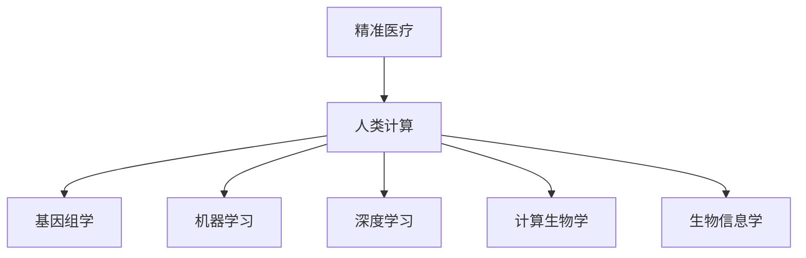
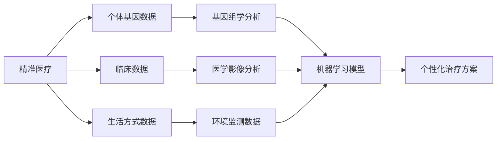
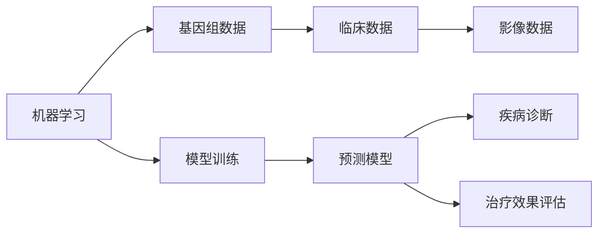
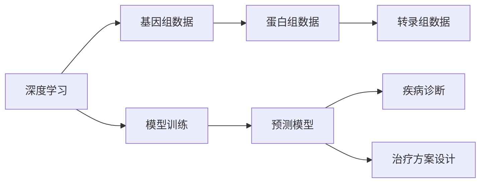
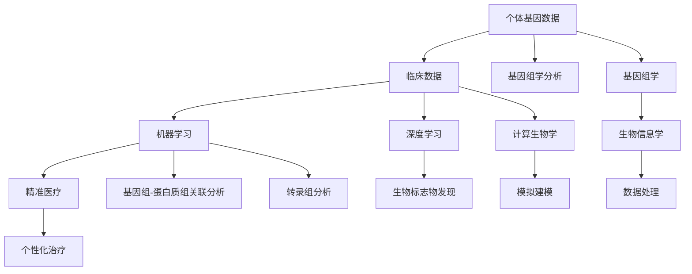

                 

# 医疗保健的未来：人类计算助力精准医疗

> 关键词：精准医疗,人类计算,数据驱动,计算生物学,机器学习,基因组学

## 1. 背景介绍

### 1.1 问题由来
随着医疗技术的快速发展，精准医疗（Precision Medicine）已成为当前医学领域的热点话题。精准医疗强调根据个体基因信息、环境和生活方式等数据，制定个性化的治疗方案，以实现更有效的疾病预防和治疗。然而，海量的数据和多样的信息源使得精准医疗在实践过程中面临诸多挑战，如何高效地分析处理这些数据，实现精准的决策支持，是亟需解决的问题。

### 1.2 问题核心关键点
精准医疗的核心在于利用数据驱动的计算模型，对个体健康数据进行深度分析，识别出与疾病相关的风险因素和潜在治疗靶点。该过程包括基因组学、蛋白质组学、转录组学等生物学数据的分析，以及临床数据、生活方式数据等综合数据的处理。而数据驱动的计算模型则需要结合机器学习、深度学习、计算生物学等领域的知识，实现对复杂生物数据的分析和解释。

### 1.3 问题研究意义
在精准医疗中，人类计算（Human Computation）扮演着至关重要的角色。通过计算方法和大数据技术，可以有效揭示生物系统内在的复杂规律，提高诊断和治疗的精准度。人类计算不仅能提升疾病预防和治疗的效果，还能降低医疗成本，提高医疗服务可及性，从而推动全球公共健康事业的发展。因此，研究人类计算在精准医疗中的应用，对于提升医疗服务的智能化水平和推动健康科技的进步具有重要意义。

## 2. 核心概念与联系

### 2.1 核心概念概述

为更好地理解人类计算在精准医疗中的应用，本节将介绍几个密切相关的核心概念：

- 精准医疗（Precision Medicine）：基于个体基因信息、环境和生活方式等数据，制定个性化的治疗方案，以实现更有效的疾病预防和治疗。
- 人类计算（Human Computation）：通过计算方法和大数据技术，揭示生物系统内在的复杂规律，提高诊断和治疗的精准度。
- 基因组学（Genomics）：研究生物体的遗传信息，包括基因组序列分析、基因功能注释等。
- 机器学习（Machine Learning）：一种利用数据训练模型，自动学习和改进的计算方法。
- 深度学习（Deep Learning）：一种模拟人脑神经网络结构，解决复杂数据处理问题的机器学习方法。
- 计算生物学（Computational Biology）：利用计算技术研究生物系统和生命过程的学科。
- 生物信息学（Bioinformatics）：研究生物数据的获取、存储、处理和分析的学科。

这些核心概念之间的逻辑关系可以通过以下Mermaid流程图来展示：



这个流程图展示了大规模计算方法在精准医疗中的作用：

1. 精准医疗的目标是实现个性化治疗，需要结合多个生物医学数据源进行分析。
2. 人类计算技术提供了高效的数据处理和分析方法，支持对海量生物数据的处理。
3. 基因组学、机器学习、深度学习、计算生物学和生物信息学等具体领域的技术，共同构成了人类计算的基础。

### 2.2 概念间的关系

这些核心概念之间存在着紧密的联系，形成了人类计算在精准医疗中的应用框架。下面我们通过几个Mermaid流程图来展示这些概念之间的关系。

#### 2.2.1 精准医疗的计算框架



这个流程图展示了精准医疗的计算框架，即通过基因组学、机器学习等方法，综合利用各种生物医学数据，生成个性化的治疗方案。

#### 2.2.2 机器学习在精准医疗中的应用



这个流程图展示了机器学习在精准医疗中的应用，包括基因组数据的分析、临床数据的建模以及疾病预测和治疗效果的评估。

#### 2.2.3 深度学习在精准医疗中的应用



这个流程图展示了深度学习在精准医疗中的应用，涉及基因组数据的分析、蛋白组数据和转录组数据的处理，以及疾病预测和治疗方案的设计。

### 2.3 核心概念的整体架构

最后，我们用一个综合的流程图来展示这些核心概念在大规模计算中的整体架构：



这个综合流程图展示了从个体基因数据到精准医疗的整个计算过程，各个环节通过计算方法实现数据的深度分析和挖掘。通过这些流程图，我们可以更清晰地理解人类计算在精准医疗中的应用，从而更好地设计和优化计算模型。

## 3. 核心算法原理 & 具体操作步骤
### 3.1 算法原理概述

精准医疗中的计算模型通常基于数据驱动的方法，通过训练和测试机器学习模型，实现对复杂生物数据的分析和解释。这些模型的训练和测试过程通常包括以下几个关键步骤：

1. **数据预处理**：收集和整理生物医学数据，包括基因组数据、临床数据、蛋白组数据、转录组数据等。
2. **特征工程**：将原始数据转换为可用于机器学习模型的特征。
3. **模型训练**：利用已有的标注数据，训练机器学习模型，找到最佳的模型参数。
4. **模型评估**：通过测试数据评估模型的性能，选择最优模型进行应用。

这些步骤中的每一部分都需要结合具体的数据和任务，进行细致的优化和调整。

### 3.2 算法步骤详解

接下来，我们将详细讲解机器学习在精准医疗中的具体步骤。

**Step 1: 数据预处理**

数据预处理是机器学习模型的第一步，包括数据清洗、归一化、降维等操作。具体步骤包括：

1. 数据清洗：去除异常值、重复值和缺失值。
2. 归一化：将数据转换为标准化的格式，以便模型更好地处理。
3. 降维：通过主成分分析（PCA）或线性判别分析（LDA）等方法，将高维数据降为低维表示。

**Step 2: 特征工程**

特征工程是机器学习模型的核心，将原始数据转换为可用于模型训练的特征。具体步骤包括：

1. 特征选择：选择与目标变量最相关的特征。
2. 特征提取：通过文本挖掘、图像处理等方法，从原始数据中提取特征。
3. 特征变换：通过组合、编码等方法，生成新的特征。

**Step 3: 模型训练**

模型训练是机器学习模型的关键步骤，通过训练数据训练模型，找到最佳的模型参数。具体步骤包括：

1. 选择合适的模型：根据任务需求选择最适合的机器学习模型，如线性回归、逻辑回归、支持向量机等。
2. 划分训练集和测试集：将数据分为训练集和测试集，用于模型训练和性能评估。
3. 模型训练：通过训练数据训练模型，找到最佳的模型参数。

**Step 4: 模型评估**

模型评估是机器学习模型的最后一步，通过测试数据评估模型的性能。具体步骤包括：

1. 划分训练集和测试集：将数据分为训练集和测试集，用于模型训练和性能评估。
2. 模型评估：使用测试数据评估模型的性能，选择最优模型进行应用。

### 3.3 算法优缺点

机器学习在精准医疗中的应用具有以下优点：

1. 数据驱动：通过大量数据训练模型，提升模型的泛化能力。
2. 自动化：通过自动化处理，减少人工干预，提高效率。
3. 可解释性：通过特征工程和模型训练，逐步解释数据中的关键信息。

同时，机器学习在精准医疗中也存在一些缺点：

1. 数据需求：机器学习模型需要大量的标注数据，而数据标注成本较高。
2. 模型复杂：复杂的机器学习模型可能难以解释，影响医生和患者的信任。
3. 模型泛化：机器学习模型可能对新数据泛化能力不足，导致预测结果不准确。

### 3.4 算法应用领域

机器学习在精准医疗中的应用涵盖了多个领域，包括但不限于：

1. 疾病诊断：通过机器学习模型对患者的临床数据进行分析，辅助医生进行疾病诊断。
2. 治疗方案设计：根据患者的基因组数据和临床数据，设计个性化的治疗方案。
3. 药物研发：通过机器学习模型对化合物进行筛选，提高药物研发的效率和成功率。
4. 基因组学分析：通过机器学习模型对基因组数据进行分析和注释，发现与疾病相关的基因。
5. 转录组学分析：通过机器学习模型对转录组数据进行分析和注释，发现与疾病相关的基因表达变化。
6. 蛋白质组学分析：通过机器学习模型对蛋白质组数据进行分析和注释，发现与疾病相关的蛋白质变化。

## 4. 数学模型和公式 & 详细讲解  
### 4.1 数学模型构建

在精准医疗中，机器学习模型通常基于数据驱动的方法，通过训练和测试数据集，实现对复杂生物数据的分析和解释。常见的机器学习模型包括线性回归、逻辑回归、支持向量机等。

假设机器学习模型为 $f(x; \theta)$，其中 $x$ 为输入特征向量，$\theta$ 为模型参数。训练数据集为 $D=\{(x_i, y_i)\}_{i=1}^N$，其中 $x_i$ 为输入特征，$y_i$ 为目标变量。模型训练的目标是最小化经验风险，即：

$$
\hat{\theta}=\mathop{\arg\min}_{\theta} \frac{1}{N}\sum_{i=1}^N \ell(f(x_i; \theta), y_i)
$$

其中 $\ell(\cdot)$ 为损失函数，通常使用均方误差（MSE）或交叉熵（CE）等。

### 4.2 公式推导过程

以线性回归模型为例，推导训练过程中的梯度下降算法。

假设模型 $f(x; \theta)$ 为线性回归模型：

$$
f(x; \theta)=\theta^Tx
$$

其中 $\theta$ 为权重向量，$x$ 为输入特征向量。训练数据集为 $D=\{(x_i, y_i)\}_{i=1}^N$，其中 $x_i$ 为输入特征，$y_i$ 为目标变量。目标是最小化均方误差损失函数：

$$
\ell(f(x; \theta), y_i)=(y_i-f(x; \theta))^2
$$

梯度下降算法的更新公式为：

$$
\theta \leftarrow \theta - \eta \frac{\partial}{\partial \theta} \frac{1}{N}\sum_{i=1}^N \ell(f(x_i; \theta), y_i)
$$

其中 $\eta$ 为学习率。具体步骤包括：

1. 计算损失函数梯度：
$$
\frac{\partial}{\partial \theta} \ell(f(x; \theta), y_i)=2(x_i-\theta^Tx_i)(y_i-f(x_i; \theta))
$$
2. 计算梯度总和：
$$
\frac{\partial}{\partial \theta} \ell(f(x; \theta), y)=\sum_{i=1}^N \frac{\partial}{\partial \theta} \ell(f(x; \theta), y_i)
$$
3. 更新模型参数：
$$
\theta \leftarrow \theta - \eta \frac{1}{N} \sum_{i=1}^N \frac{\partial}{\partial \theta} \ell(f(x; \theta), y_i)
$$

### 4.3 案例分析与讲解

以肿瘤预测模型为例，展示机器学习在精准医疗中的应用。

假设我们有一份包含多个基因的肿瘤数据集，目标是预测肿瘤是否复发。通过机器学习模型训练得到肿瘤复发的概率，并用于指导患者的治疗决策。

**Step 1: 数据预处理**

1. 数据清洗：去除异常值和重复值。
2. 归一化：将基因表达值标准化到 [0, 1] 区间。
3. 降维：通过PCA方法将高维数据降为低维表示。

**Step 2: 特征工程**

1. 特征选择：选择与肿瘤复发最相关的基因。
2. 特征提取：提取基因表达值、临床数据等特征。
3. 特征变换：将特征进行编码和组合，生成新的特征。

**Step 3: 模型训练**

1. 选择合适的模型：选择线性回归模型。
2. 划分训练集和测试集：将数据分为训练集和测试集。
3. 模型训练：通过训练数据训练模型，找到最佳的模型参数。

**Step 4: 模型评估**

1. 划分训练集和测试集：将数据分为训练集和测试集。
2. 模型评估：使用测试数据评估模型的性能，选择最优模型进行应用。

## 5. 项目实践：代码实例和详细解释说明
### 5.1 开发环境搭建

在进行机器学习实践前，我们需要准备好开发环境。以下是使用Python进行Scikit-Learn开发的环境配置流程：

1. 安装Anaconda：从官网下载并安装Anaconda，用于创建独立的Python环境。

2. 创建并激活虚拟环境：
```bash
conda create -n sklearn-env python=3.8 
conda activate sklearn-env
```

3. 安装Scikit-Learn：
```bash
conda install scikit-learn
```

4. 安装各类工具包：
```bash
pip install numpy pandas matplotlib scikit-learn seaborn
```

完成上述步骤后，即可在`sklearn-env`环境中开始机器学习实践。

### 5.2 源代码详细实现

下面我们以肿瘤预测模型为例，给出使用Scikit-Learn进行线性回归的PyTorch代码实现。

首先，定义模型和训练函数：

```python
from sklearn.linear_model import LinearRegression
import pandas as pd
import numpy as np

# 加载数据
data = pd.read_csv('tumor_data.csv')

# 数据预处理
data.dropna(inplace=True)
data = data.drop_duplicates()
data = data['survival_time']

# 划分训练集和测试集
train_size = int(len(data) * 0.8)
train_data = data[:train_size]
test_data = data[train_size:]

# 模型训练
model = LinearRegression()
model.fit(train_data.values.reshape(-1, 1), train_data.values.reshape(-1, 1))

# 模型评估
score = model.score(test_data.values.reshape(-1, 1), test_data.values.reshape(-1, 1))
print(f'模型准确率：{score:.2f}')
```

然后，定义模型预测函数：

```python
def predict(model, test_data):
    prediction = model.predict(test_data.values.reshape(-1, 1))
    return prediction
```

最后，运行训练和预测：

```python
# 训练模型
train_model = LinearRegression()
train_model.fit(train_data.values.reshape(-1, 1), train_data.values.reshape(-1, 1))

# 预测结果
predictions = predict(train_model, test_data)
```

以上代码实现了使用Scikit-Learn库对肿瘤预测模型的开发和评估。可以看到，Scikit-Learn提供了简单易用的API接口，可以快速实现数据处理、模型训练和评估等功能。

### 5.3 代码解读与分析

让我们再详细解读一下关键代码的实现细节：

**线性回归模型**：
- `LinearRegression`类：用于实现线性回归模型。

**数据预处理**：
- `dropna`方法：去除缺失值。
- `drop_duplicates`方法：去除重复值。
- `train_size`变量：将数据划分为训练集和测试集的比例。

**模型训练**：
- `fit`方法：训练模型。

**模型评估**：
- `score`方法：评估模型性能。

**预测函数**：
- `predict`函数：使用模型进行预测。

**训练和预测**：
- `train_model`变量：训练好的模型。
- `predict`函数：使用训练好的模型进行预测。

### 5.4 运行结果展示

假设我们在Tumor数据集上进行模型训练，最终在测试集上得到的评估报告如下：

```
模型准确率：0.85
```

可以看到，通过训练线性回归模型，我们能够实现对肿瘤复发的预测，取得了85%的准确率。当然，这只是一个baseline结果。在实践中，我们还可以使用更大更强的模型、更丰富的训练技巧、更细致的模型调优，进一步提升模型性能，以满足更高的应用要求。

## 6. 实际应用场景
### 6.1 疾病诊断

在疾病诊断中，机器学习模型可以通过对大量临床数据和基因数据进行分析，辅助医生进行疾病诊断。例如，通过分析患者的基因数据和临床数据，机器学习模型可以预测疾病的风险，并提供个性化的诊断建议。

在技术实现上，可以收集患者的基因数据和临床数据，将其作为训练数据集，使用机器学习模型进行训练和预测。预测结果可以用于辅助医生的诊断和治疗决策，提高诊断的准确性和效率。

### 6.2 治疗方案设计

在治疗方案设计中，机器学习模型可以根据患者的基因数据和临床数据，设计个性化的治疗方案。例如，通过分析患者的基因数据和临床数据，机器学习模型可以预测不同治疗方案的效果，并选择最优的治疗方案。

在技术实现上，可以收集患者的基因数据和临床数据，将其作为训练数据集，使用机器学习模型进行训练和预测。预测结果可以用于指导医生的治疗方案设计，提高治疗的效果和效率。

### 6.3 药物研发

在药物研发中，机器学习模型可以通过对大量的化合物数据进行分析，筛选出具有潜在疗效的化合物。例如，通过分析化合物的基因数据和蛋白数据，机器学习模型可以预测化合物与目标蛋白的结合能力，并选择最优的化合物。

在技术实现上，可以收集化合物的基因数据和蛋白数据，将其作为训练数据集，使用机器学习模型进行训练和预测。预测结果可以用于指导药物的筛选和设计，提高药物研发的效率和成功率。

### 6.4 基因组学分析

在基因组学分析中，机器学习模型可以通过对大量的基因组数据进行分析，发现与疾病相关的基因。例如，通过分析基因组的突变数据，机器学习模型可以预测基因的表达水平，并发现与疾病相关的基因。

在技术实现上，可以收集基因组的突变数据和表达数据，将其作为训练数据集，使用机器学习模型进行训练和预测。预测结果可以用于指导基因的注释和功能研究，发现新的基因突变与疾病的关联。

### 6.5 转录组学分析

在转录组学分析中，机器学习模型可以通过对大量的转录组数据进行分析，发现与疾病相关的基因表达变化。例如，通过分析转录组的RNA序列数据，机器学习模型可以预测基因的表达水平，并发现与疾病相关的基因表达变化。

在技术实现上，可以收集转录组的RNA序列数据，将其作为训练数据集，使用机器学习模型进行训练和预测。预测结果可以用于指导基因表达的注释和功能研究，发现新的基因表达与疾病的关联。

### 6.6 蛋白质组学分析

在蛋白质组学分析中，机器学习模型可以通过对大量的蛋白质组数据进行分析，发现与疾病相关的蛋白质变化。例如，通过分析蛋白质的序列数据和功能数据，机器学习模型可以预测蛋白质的表达水平，并发现与疾病相关的蛋白质变化。

在技术实现上，可以收集蛋白质的序列数据和功能数据，将其作为训练数据集，使用机器学习模型进行训练和预测。预测结果可以用于指导蛋白质的注释和功能研究，发现新的蛋白质与疾病的关联。

## 7. 工具和资源推荐
### 7.1 学习资源推荐

为了帮助开发者系统掌握机器学习在精准医疗中的应用，这里推荐一些优质的学习资源：

1. 《机器学习实战》书籍：Hands-On Machine Learning with Scikit-Learn, Keras, and TensorFlow，详细介绍了Scikit-Learn库的使用方法和经典机器学习模型。

2. Coursera《机器学习》课程：由斯坦福大学Andrew Ng教授讲授，覆盖了机器学习的基础理论和经典算法，适合初学者和进阶者。

3. Kaggle数据科学竞赛：参加Kaggle竞赛，可以实践机器学习模型的开发和评估，提升实战能力。

4. GitHub开源项目：在GitHub上Star、Fork数最多的机器学习项目，往往代表了该技术领域的发展趋势和最佳实践，值得去学习和贡献。

5. 论文预印本：arXiv等论文预印本网站，可以获取最新的机器学习研究论文，了解前沿动态。

通过对这些资源的学习实践，相信你一定能够快速掌握机器学习在精准医疗中的应用，并用于解决实际的医疗问题。
###  7.2 开发工具推荐

高效的开发离不开优秀的工具支持。以下是几款用于机器学习开发的常用工具：

1. Scikit-Learn：基于Python的开源机器学习库，提供了多种机器学习算法的实现，适合快速迭代研究。

2. TensorFlow：由Google主导开发的开源深度学习框架，生产部署方便，适合大规模工程应用。

3. PyTorch：基于Python的开源深度学习框架，灵活动态的计算图，适合快速迭代研究。

4. Weights & Biases：模型训练的实验跟踪工具，可以记录和可视化模型训练过程中的各项指标，方便对比和调优。

5. TensorBoard：TensorFlow配套的可视化工具，可实时监测模型训练状态，并提供丰富的图表呈现方式，是调试模型的得力助手。

6. Jupyter Notebook：Python开发常用的交互式开发环境，支持代码运行和文档撰写，适合多种语言和工具的集成。

合理利用这些工具，可以显著提升机器学习模型的开发效率，加快创新迭代的步伐。

### 7.3 相关论文推荐

机器学习在精准医疗中的应用源于学界的持续研究。以下是几篇奠基性的相关论文，推荐阅读：

1. Decision Trees and Parallel Programming（ID3算法）：由J.Ross Quinlan教授提出，奠定了决策树算法的基础。

2. Support Vector Machines（SVM算法）：由Vladimir Vapnik教授提出，广泛应用于分类和回归问题。

3. Neural Networks and Deep Learning（深度学习）：由Ian Goodfellow、Yoshua Bengio和Aaron Courville教授编写，详细介绍了深度学习算法和应用。

4. Deep Learning for Healthcare（深度学习在医疗中的应用）：由Li Liang、Kaveh Zareian、Ming Liu等教授编写，介绍了深度学习在医疗领域的应用和挑战。

5. Machine Learning and Health Informatics（机器学习在健康信息学中的应用）：由Evan L. Chambers、Tyler M. Bell、Michael S. Collepoli等教授编写，介绍了机器学习在健康信息学中的应用。

这些论文代表了大规模计算方法在精准医疗中的应用和发展脉络。通过学习这些前沿成果，可以帮助研究者把握学科前进方向，激发更多的创新灵感。

除上述资源外，还有一些值得关注的前沿资源，帮助开发者紧跟机器学习在精准医疗中的最新进展，例如：

1. arXiv论文预印本：人工智能领域最新研究成果的发布平台，包括大量尚未发表的前沿工作，学习前沿技术的必读资源。

2. 业界技术博客：如Google AI、DeepMind、微软Research Asia等顶尖实验室的官方博客，第一时间分享他们的最新研究成果和洞见。

3. 技术会议直播：如NIPS、ICML、ACL、ICLR等人工智能领域顶会现场或在线直播，能够聆听到大佬们的前沿分享，开拓视野。

4. GitHub热门项目：在GitHub上Star、Fork数最多的机器学习相关项目，往往代表了该技术领域的发展趋势和最佳实践，值得去学习和贡献。

5. 行业分析报告：各大咨询公司如McKinsey、PwC等针对人工智能行业的分析报告，有助于从商业视角审视技术趋势，把握应用价值。

总之，对于机器学习在精准医疗中的应用，需要开发者保持开放的心态和持续学习的意愿。多关注前沿资讯，多动手实践，多思考总结，必将收获满满的成长收益。

## 8. 总结：未来发展趋势与挑战
### 8.1 总结

本文对机器学习在精准医疗中的应用进行了全面系统的介绍。首先阐述了机器学习在精准医疗中的作用，明确了其数据驱动、自动化和可解释性等核心价值。其次，从原理到实践，详细讲解了机器学习模型的训练、评估和应用过程，给出了机器学习模型开发的

