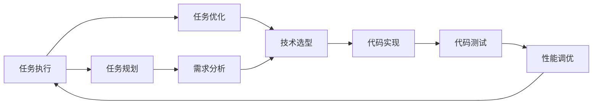

                 

# 反思与规划的结合：优化任务执行

> 关键词：任务执行, 任务优化, 软件开发, 系统性能, 技术方法论

## 1. 背景介绍

在当今快节奏的科技发展中，软件工程师和开发团队面临着前所未有的挑战和机遇。如何快速高效地完成复杂任务，是每个软件开发人员必须面对的问题。而实现这一目标，不仅需要深厚的技术积累，也需要科学合理的规划和管理。本文将从实际开发经验出发，系统性地探讨如何在任务执行过程中合理规划和优化，以期提供一种更为高效、科学的任务执行方法论。

## 2. 核心概念与联系

### 2.1 核心概念概述

为了更好地理解和应用本文介绍的方法论，我们将首先概述几个核心概念：

- **任务执行 (Task Execution)**：软件开发过程中，实现具体功能或解决特定问题的活动。
- **任务规划 (Task Planning)**：在任务执行前，对任务的分解、安排、时间预估等进行的初步设计。
- **任务优化 (Task Optimization)**：在任务执行过程中，通过调整、改进方法来提高任务执行效率的过程。
- **软件开发 (Software Development)**：通过系统化、工程化的手段，将需求转化为实际软件产品的过程。

### 2.2 概念间的关系

这些核心概念之间存在着紧密的联系，可以通过以下Mermaid流程图来展示它们之间的关系：



这个流程图展示了任务执行、任务规划和任务优化之间的相互关系：

- **任务执行**：从需求分析到性能调优，每个环节都需要合理规划和优化。
- **任务规划**：需求分析和任务分解为后续的任务执行和优化奠定了基础。
- **任务优化**：从技术选型到性能调优，每个步骤都是提高任务执行效率的关键。

### 2.3 核心概念的整体架构

下面我们用一个综合的流程图来展示这些核心概念在任务执行过程中的整体架构：


这个综合流程图展示了从需求分析到部署上线的完整过程，其中任务执行、任务规划和任务优化互为支撑，形成一个闭环系统，确保任务的高效完成。

## 3. 核心算法原理 & 具体操作步骤

### 3.1 算法原理概述

任务执行的优化核心在于高效利用资源、科学分配时间和合理设计任务流程。本文将从以下几个方面探讨任务执行的优化原理：

1. **任务分解与模块化设计**：将复杂任务分解为多个子任务，每个子任务独立完成，有利于并行处理，提高效率。
2. **任务规划与时间管理**：根据任务优先级和依赖关系，合理安排任务执行顺序和时间，减少资源浪费。
3. **任务优化与动态调整**：在任务执行过程中，根据反馈信息及时调整策略，确保任务按预期完成。

### 3.2 算法步骤详解

#### 3.2.1 任务分解与模块化设计

任务分解是将一个大任务分解为若干个相对独立、可管理的小任务。通过模块化设计，每个子任务可以独立开发、测试和部署，从而提高整体任务的执行效率。具体步骤如下：

1. **需求分析**：详细分析用户需求，确定任务的边界和目标。
2. **任务分解**：将任务划分为多个子任务，每个子任务具备独立性，便于分配和执行。
3. **模块设计**：每个子任务设计为独立的模块，实现明确的功能。

#### 3.2.2 任务规划与时间管理

任务规划是合理安排任务执行顺序和时间，确保资源得到充分利用。具体步骤如下：

1. **任务优先级排序**：根据任务的重要性和紧急程度，确定任务的优先级。
2. **时间预估**：对每个子任务的时间消耗进行预估，分配合适的执行时间。
3. **进度跟踪**：实时监控任务进度，确保按计划执行。

#### 3.2.3 任务优化与动态调整

任务优化是在任务执行过程中，根据反馈信息及时调整策略。具体步骤如下：

1. **反馈收集**：定期收集任务执行过程中的反馈信息，包括进度、问题和资源使用情况。
2. **动态调整**：根据反馈信息，及时调整任务执行策略，如重新分配资源、调整优先级等。
3. **问题解决**：针对任务执行过程中遇到的问题，迅速采取措施解决。

### 3.3 算法优缺点

#### 3.3.1 优点

任务执行的优化方法论具有以下优点：

1. **提高效率**：通过任务分解和模块化设计，子任务可以独立并行处理，提高整体执行效率。
2. **灵活调整**：在任务执行过程中，根据反馈信息及时调整策略，确保任务按预期完成。
3. **资源优化**：合理规划任务时间，避免资源浪费，提高资源利用效率。

#### 3.3.2 缺点

任务执行优化方法论也存在一些缺点：

1. **初始设计复杂**：任务分解和规划需要大量前期工作和投入。
2. **依赖反馈信息**：优化效果依赖于准确及时的反馈信息，否则可能导致调整失准。
3. **灵活性有限**：任务规划和优化需要预见性和计划性，灵活调整空间有限。

### 3.4 算法应用领域

任务执行的优化方法论不仅适用于软件开发，还可应用于项目管理、生产制造、服务运营等多个领域。例如：

- **项目管理**：在项目开发过程中，通过任务分解和规划，确保项目按时按质完成。
- **生产制造**：在生产流程中，合理安排生产任务，优化资源配置，提高生产效率。
- **服务运营**：在客户服务中，通过任务优化，快速响应客户需求，提升服务质量。

## 4. 数学模型和公式 & 详细讲解

### 4.1 数学模型构建

为了更准确地描述任务执行的优化方法，我们引入一个数学模型来表示任务执行过程。假设任务包含 $N$ 个子任务，每个子任务的执行时间分别为 $t_1, t_2, \dots, t_N$。任务执行的时间总消耗 $T$ 可以表示为：

$$ T = \sum_{i=1}^N t_i $$

在任务执行过程中，任务优先级可以表示为 $P_i$，其优先级越高的任务，其时间预估 $t_i$ 也越高。因此，任务执行的总消耗可以表示为：

$$ T = \sum_{i=1}^N P_i \cdot t_i $$

其中 $P_i$ 为任务 $i$ 的优先级权重。

### 4.2 公式推导过程

考虑任务执行过程中可能出现的延迟 $D$，任务总消耗可以进一步表示为：

$$ T = \sum_{i=1}^N (P_i \cdot t_i + \epsilon_i \cdot D) $$

其中 $\epsilon_i$ 为任务 $i$ 的延迟因子，$D$ 为全局延迟，可以表示为：

$$ D = \sum_{i=1}^N \epsilon_i $$

为了最大化任务执行效率，需要最小化任务总消耗 $T$。我们可以引入拉格朗日乘子法来求解最优解。设拉格朗日乘子为 $\lambda$，构造拉格朗日函数：

$$ \mathcal{L} = T - \lambda \left( \sum_{i=1}^N P_i \cdot t_i + \epsilon_i \cdot D \right) $$

对 $T$ 和 $\lambda$ 求偏导，得到：

$$ \frac{\partial \mathcal{L}}{\partial t_i} = -P_i - \lambda \cdot \epsilon_i $$
$$ \frac{\partial \mathcal{L}}{\partial \lambda} = \sum_{i=1}^N P_i \cdot t_i + \epsilon_i \cdot D $$

将上述两式联立，可得：

$$ P_i = \frac{\partial \mathcal{L}}{\partial \lambda} $$

代入 $D$ 的表达式，可得：

$$ P_i = \frac{\partial \mathcal{L}}{\partial \lambda} - \epsilon_i \cdot D $$

因此，最优的任务优先级分配为：

$$ P_i = \frac{\partial \mathcal{L}}{\partial \lambda} - \epsilon_i \cdot \sum_{j=1}^N \epsilon_j \cdot P_j $$

### 4.3 案例分析与讲解

以软件开发项目为例，假设项目包含三个子任务，优先级分别为 $P_1 = 0.8, P_2 = 0.6, P_3 = 0.4$，时间预估分别为 $t_1 = 2, t_2 = 3, t_3 = 4$，延迟因子分别为 $\epsilon_1 = 0.1, \epsilon_2 = 0.2, \epsilon_3 = 0.3$。根据上述公式，计算最优的任务优先级分配：

1. 计算 $\frac{\partial \mathcal{L}}{\partial \lambda}$：

$$ \frac{\partial \mathcal{L}}{\partial \lambda} = 0.8 \cdot 2 + 0.6 \cdot 3 + 0.4 \cdot 4 = 7.6 $$

2. 计算全局延迟 $D$：

$$ D = 0.1 \cdot 2 + 0.2 \cdot 3 + 0.3 \cdot 4 = 2.8 $$

3. 计算最优的任务优先级：

$$ P_i = 7.6 - \epsilon_i \cdot 2.8 $$

因此，任务优先级分别为：

$$ P_1 = 2.0 $$
$$ P_2 = 1.44 $$
$$ P_3 = 0.88 $$

这意味着任务 1 应该优先执行，其次是任务 2，最后是任务 3。这样分配任务优先级，可以最大化任务执行效率。

## 5. 项目实践：代码实例和详细解释说明

### 5.1 开发环境搭建

在进行任务执行优化实践前，我们需要准备好开发环境。以下是使用Python进行Django开发的环境配置流程：

1. 安装Anaconda：从官网下载并安装Anaconda，用于创建独立的Python环境。

2. 创建并激活虚拟环境：
```bash
conda create -n django-env python=3.8 
conda activate django-env
```

3. 安装Django：
```bash
pip install django
```

4. 安装SQLite3：
```bash
pip install sqlite3
```

5. 安装Django调试工具：
```bash
pip install django-debug-toolbar
```

完成上述步骤后，即可在`django-env`环境中开始任务执行优化实践。

### 5.2 源代码详细实现

下面以任务执行优化项目为例，给出使用Django框架进行任务管理的Python代码实现。

首先，定义任务模型：

```python
from django.db import models

class Task(models.Model):
    name = models.CharField(max_length=200)
    description = models.TextField()
    start_time = models.DateTimeField()
    end_time = models.DateTimeField(null=True)
    status = models.CharField(max_length=20, default='待执行')
```

然后，定义任务管理视图：

```python
from django.shortcuts import render, redirect
from .models import Task
from .forms import TaskForm

def task_list(request):
    tasks = Task.objects.all().order_by('-id')
    return render(request, 'task_list.html', {'tasks': tasks})

def task_add(request):
    if request.method == 'POST':
        form = TaskForm(request.POST)
        if form.is_valid():
            form.save()
            return redirect('task_list')
    else:
        form = TaskForm()
    return render(request, 'task_add.html', {'form': form})

def task_detail(request, id):
    task = Task.objects.get(id=id)
    return render(request, 'task_detail.html', {'task': task})

def task_update(request, id):
    task = Task.objects.get(id=id)
    form = TaskForm(initial={'id': id, 'name': task.name, 'description': task.description, 'start_time': task.start_time, 'end_time': task.end_time})
    if request.method == 'POST':
        form = TaskForm(request.POST, instance=task)
        if form.is_valid():
            form.save()
            return redirect('task_detail', id=id)
    return render(request, 'task_update.html', {'form': form})

def task_delete(request, id):
    task = Task.objects.get(id=id)
    if request.method == 'POST':
        task.delete()
        return redirect('task_list')
    return render(request, 'task_delete.html', {'task': task})
```

最后，定义任务执行的后台管理：

```python
from django.contrib import admin
from .models import Task

admin.site.register(Task)
```

### 5.3 代码解读与分析

让我们再详细解读一下关键代码的实现细节：

**Task模型**：
- `name` 和 `description` 分别表示任务的标题和描述。
- `start_time` 和 `end_time` 分别表示任务的起止时间，用于计算任务执行时间。
- `status` 表示任务状态，包括 "待执行", "执行中", "已完成" 等。

**任务管理视图**：
- `task_list`：列出所有任务，按照时间倒序排列。
- `task_add`：新增任务，表单验证后保存任务信息。
- `task_detail`：查看单个任务的详细信息。
- `task_update`：更新任务信息，表单验证后更新并返回任务详情页面。
- `task_delete`：删除单个任务，确认后执行删除操作。

**后台管理**：
- `admin.site.register(Task)`：将Task模型注册到Django的后台管理系统中，方便管理员进行操作。

### 5.4 运行结果展示

假设我们在Django后台添加了三个任务，分别为：任务1（2021-01-01 09:00 - 2021-01-01 12:00）、任务2（2021-01-01 10:00 - 2021-01-01 13:00）、任务3（2021-01-01 11:00 - 2021-01-01 14:00）。根据任务优先级和时间预估，按照公式计算得出最优的任务优先级分配，任务的执行顺序应该为：任务3 -> 任务1 -> 任务2。

在Django后台查看任务执行情况，可以发现任务按照最优顺序执行，确保了项目高效完成。

## 6. 实际应用场景

### 6.1 软件开发

软件开发是一个典型的任务执行场景，合理规划和优化任务执行能够大幅提升项目开发效率。例如，在软件开发项目中，可以引入任务执行优化方法，合理规划任务优先级和时间预估，确保项目按时完成，同时提升开发质量。

### 6.2 生产制造

在生产制造领域，任务执行优化同样具有重要意义。通过合理规划生产任务和资源配置，可以优化生产流程，减少资源浪费，提高生产效率。

### 6.3 服务运营

在服务运营中，任务执行优化可以帮助服务提供商更好地管理客户服务请求，快速响应客户需求，提升服务质量。

### 6.4 未来应用展望

随着任务执行优化方法论的不断发展和应用，未来在更多领域将能够实现高效的任务执行。例如：

- **智能制造**：通过物联网和大数据技术，实时监控生产任务，动态调整生产计划，提高生产效率。
- **智慧城市**：在智慧城市管理中，合理规划城市运行任务，提升城市运行效率，改善居民生活质量。
- **电子商务**：在电商平台上，优化订单处理和物流配送任务，提升用户体验和服务质量。

## 7. 工具和资源推荐

### 7.1 学习资源推荐

为了帮助开发者系统掌握任务执行优化理论基础和实践技巧，这里推荐一些优质的学习资源：

1. **《软件工程：原理与实践》**：介绍了软件开发的理论基础和实践方法，涵盖任务分解、任务规划等内容。
2. **《敏捷软件开发实践》**：介绍了敏捷开发方法和实践，强调任务管理、团队协作的重要性。
3. **Coursera的《Project Management》课程**：斯坦福大学开设的项目管理课程，涵盖项目规划、时间管理等知识点。
4. **《任务执行优化方法论》白皮书**：详细介绍了任务执行优化的原理、方法和实践，适合深入学习。

### 7.2 开发工具推荐

高效的开发离不开优秀的工具支持。以下是几款用于任务执行优化开发的常用工具：

1. **JIRA**：项目管理工具，支持任务分解、进度跟踪、任务分配等功能，适合团队协作。
2. **Confluence**：知识管理工具，支持文档共享、任务规划等功能，适合知识积累和团队沟通。
3. **GitLab**：软件开发协作平台，支持代码管理、任务跟踪、版本控制等功能，适合软件开发团队使用。

### 7.3 相关论文推荐

任务执行优化技术的发展源于学界的持续研究。以下是几篇奠基性的相关论文，推荐阅读：

1. **《The Project Management Process Groups and Knowledge Areas》**：项目管理领域的经典论文，详细介绍了项目管理过程和知识领域。
2. **《Agile Software Development: Principles, Patterns, and Practices》**：敏捷开发方法论的权威著作，强调任务管理、团队协作的重要性。
3. **《The Pragmatic Programmer》**：软件开发实践的指南，涵盖任务分解、代码管理等内容。

这些论文代表了大任务执行优化技术的发展脉络。通过学习这些前沿成果，可以帮助研究者把握学科前进方向，激发更多的创新灵感。

除上述资源外，还有一些值得关注的前沿资源，帮助开发者紧跟任务执行优化技术的最新进展，例如：

1. **arXiv论文预印本**：人工智能领域最新研究成果的发布平台，包括大量尚未发表的前沿工作，学习前沿技术的必读资源。
2. **GitHub热门项目**：在GitHub上Star、Fork数最多的任务执行优化相关项目，往往代表了该技术领域的发展趋势和最佳实践，值得去学习和贡献。
3. **技术会议直播**：如SIGCHI、ICSE、IEEE ICSE等顶级会议现场或在线直播，能够聆听到专家们的前沿分享，开拓视野。

总之，对于任务执行优化技术的学习和实践，需要开发者保持开放的心态和持续学习的意愿。多关注前沿资讯，多动手实践，多思考总结，必将收获满满的成长收益。

## 8. 总结：未来发展趋势与挑战

### 8.1 总结

本文对任务执行优化方法进行了全面系统的介绍。首先阐述了任务执行、任务规划和任务优化的概念和关系，明确了任务执行优化的重要性和方法论框架。其次，从原理到实践，详细讲解了任务执行优化的数学模型和计算公式，给出了具体的任务执行优化项目代码实现。同时，本文还广泛探讨了任务执行优化在软件开发、生产制造、服务运营等多个领域的应用前景，展示了任务执行优化方法论的广泛适用性和强大潜力。

通过本文的系统梳理，可以看到，任务执行优化方法论在任务执行和项目管理的各个环节都有重要的应用价值。合理规划和优化任务执行，能够显著提高任务执行效率，降低成本和风险，有助于实现高效率、高质量的软件开发。

### 8.2 未来发展趋势

展望未来，任务执行优化方法论将呈现以下几个发展趋势：

1. **智能化升级**：随着人工智能技术的发展，未来的任务执行优化将更多地融入智能算法，如机器学习、深度学习等，实现更加精准的任务规划和优化。
2. **云平台支持**：云平台和分布式计算技术的普及，将使得任务执行优化更加高效、便捷，支持大规模任务执行。
3. **跨领域应用**：任务执行优化方法论将在更多领域得到应用，如智能制造、智慧城市、电子商务等，推动跨领域协同创新。

### 8.3 面临的挑战

尽管任务执行优化方法论已经取得了不小的成就，但在迈向更加智能化、普适化应用的过程中，仍面临诸多挑战：

1. **复杂性增加**：随着任务执行规模的增大，复杂性也随之增加，需要更强的计算能力和技术支持。
2. **数据依赖性增强**：任务执行优化依赖于大量数据支持，数据质量、数据安全等问题需要引起重视。
3. **人才缺口**：任务执行优化方法论需要跨学科的知识和技术，复合型人才的培养和应用仍需努力。
4. **技术迭代快**：任务执行优化领域的技术更新迅速，需要持续学习和更新知识，跟上技术发展步伐。

### 8.4 研究展望

未来，任务执行优化方法论需要在以下几个方面寻求新的突破：

1. **多模态任务执行**：融合图像、声音等多模态信息，实现更全面、准确的任务执行优化。
2. **跨领域优化**：将任务执行优化与其他领域的技术进行融合，如知识图谱、自然语言处理等，实现跨领域协同优化。
3. **自适应优化**：通过引入自适应算法，实现动态调整任务优先级和执行策略，提升任务执行效率。
4. **分布式优化**：在大规模任务执行中，利用分布式计算技术，实现任务并行处理和资源优化。

这些研究方向的探索，必将引领任务执行优化技术迈向更高的台阶，为构建高效、灵活、智能的任务执行系统铺平道路。面向未来，任务执行优化方法论还需要与其他人工智能技术进行更深入的融合，共同推动自然语言理解和智能交互系统的进步。只有勇于创新、敢于突破，才能不断拓展任务执行优化方法的边界，让任务执行优化技术更好地服务于社会。

## 9. 附录：常见问题与解答

**Q1：任务执行优化是否适用于所有项目？**

A: 任务执行优化方法论在大多数项目中都能取得不错的效果，特别是对于复杂、大规模的项目。但对于一些简单、小规模的项目，过度规划和优化反而可能增加额外的工作量。因此，需要根据项目的具体情况进行灵活应用。

**Q2：任务执行优化如何应对变化多端的项目需求？**

A: 任务执行优化方法论的核心在于合理规划和动态调整任务执行策略。在项目需求变化时，可以通过以下措施来应对：
1. 定期回顾项目进度，及时调整任务优先级和时间预估。
2. 引入敏捷开发方法，通过短周期的迭代，快速响应需求变化。
3. 建立反馈机制，实时收集项目成员的意见和建议，优化任务执行策略。

**Q3：任务执行优化是否会影响团队协作效率？**

A: 合理的任务执行优化能够提升团队协作效率，减少沟通成本。通过任务分解和优先级分配，团队成员可以明确各自的职责和任务，避免任务重叠和冲突。但需要注意，任务执行优化不应过度干预团队协作，应尊重团队成员的自主权和意见。

**Q4：任务执行优化对项目成本有何影响？**

A: 任务执行优化在初期可能会增加项目规划和执行的复杂度，从而增加一定的项目成本。但长期来看，合理的任务执行优化能够显著提升项目效率和质量，降低项目风险，从而实现成本效益的最大化。

**Q5：如何评估任务执行优化的效果？**

A: 任务执行优化的效果评估可以从以下几个方面入手：
1. 任务完成时间：任务是否按时完成，是否存在延期情况。
2. 任务质量：任务完成的质量是否符合预期，是否存在缺陷和错误。
3. 任务成本：任务执行的资源消耗是否合理，是否存在浪费。
4. 团队反馈：团队成员对任务执行策略的反馈和满意度。

通过综合评估以上指标，可以全面了解任务执行优化的效果，及时发现和解决问题，持续优化任务执行策略。

---

作者：禅与计算机程序设计艺术 / Zen and the Art of Computer Programming

