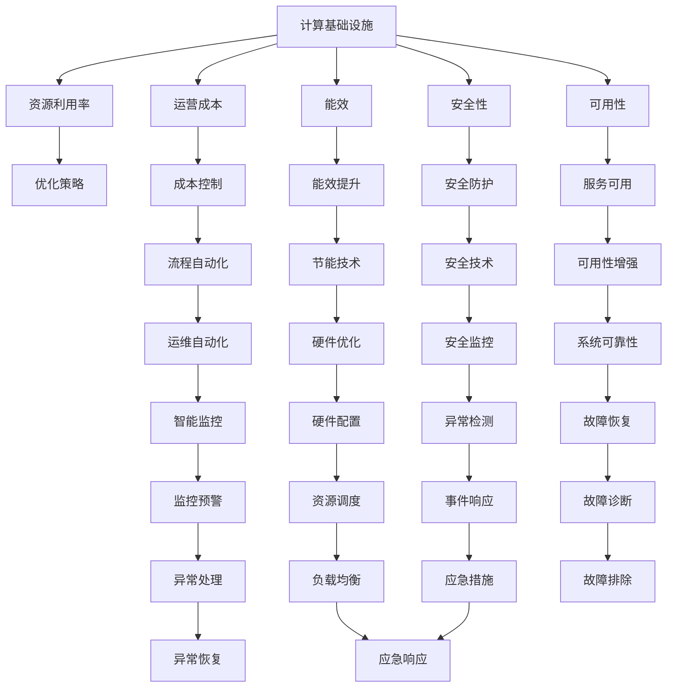
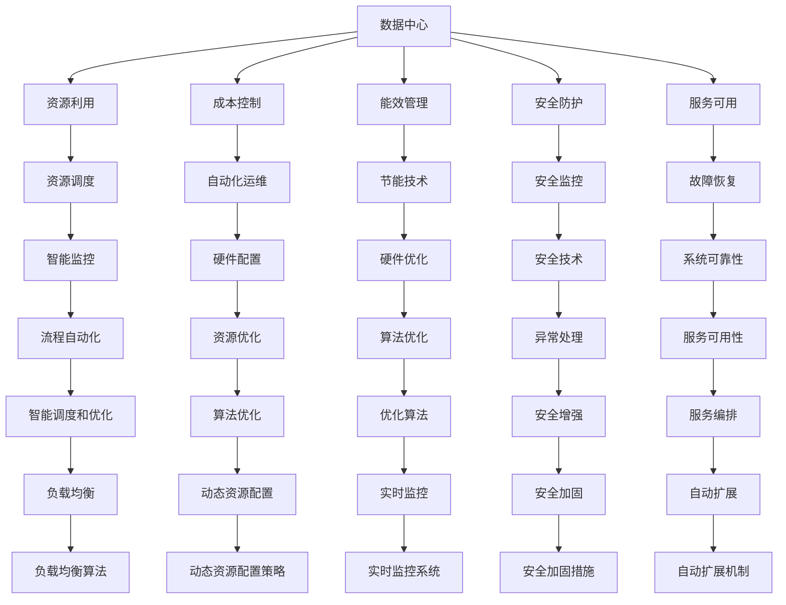

                 

# 优化计算基础设施的详细策略

## 1. 背景介绍

### 1.1 问题由来

计算基础设施的优化始终是IT行业的核心议题，尤其是在数据中心、云服务、超级计算、边缘计算等关键领域。随着数字化转型的加速，各行业对于计算资源的需求日益增长，随之而来的是基础设施管理复杂性、运维成本和能耗问题。特别是在当前云计算和边缘计算等新兴技术普及的背景下，如何优化计算基础设施，提高资源利用率、降低运营成本和提升能效，成为一个亟待解决的问题。

### 1.2 问题核心关键点

优化计算基础设施的核心关键点在于：

- 提高资源利用率：最大化计算资源的利用效率，减少资源浪费。
- 降低运营成本：通过自动化运维、资源优化等措施，降低人力、电力等运营成本。
- 提升能效：采用先进的硬件技术和算法，优化计算过程，降低能耗。
- 强化安全性：保护数据安全，防止网络攻击、数据泄露等安全威胁。
- 确保可用性：保证计算服务的稳定性和可靠性，提高系统可用性。

### 1.3 问题研究意义

优化计算基础设施对于提升数据中心、云服务、超级计算等系统性能，具有重要意义：

- 降低投资成本：通过高效资源利用，减少硬件采购和运维投入。
- 缩短部署周期：优化运维流程，加快新系统上线速度。
- 增强业务响应：提升系统性能，缩短用户等待时间，提高用户满意度。
- 实现绿色环保：提高能效，减少碳排放，符合可持续发展目标。
- 保障数据安全：强化安全防护，降低数据泄露风险。

## 2. 核心概念与联系

### 2.1 核心概念概述

为了更好地理解优化计算基础设施的策略，首先需要明确几个核心概念：

- **计算基础设施**：包括硬件设施（如服务器、存储、网络设备）、软件平台（如操作系统、数据库、应用程序）和云服务（如云计算、边缘计算）。
- **资源利用率**：衡量计算资源（如CPU、内存、带宽）的使用效率，常用指标包括CPU使用率、内存利用率、IOPS等。
- **运营成本**：涵盖数据中心、云计算等基础设施的电力、冷却、维护等成本。
- **能效**：衡量计算基础设施的能源消耗和性能比，常用指标包括PUE（Power Usage Effectiveness）。
- **安全性**：确保数据、应用和系统的安全，防范网络攻击、数据泄露等风险。
- **可用性**：衡量计算服务的正常运行时间，常用指标包括SLA（Service Level Agreement）。

### 2.2 概念间的关系

这些核心概念之间存在紧密的联系，形成一个完整的计算基础设施优化生态系统。以下通过一个Mermaid流程图展示它们之间的关系：



这个流程图展示了计算基础设施的优化策略与各核心概念之间的关系：

1. 通过优化策略（如资源调度、能效提升、安全防护、可用性增强等），直接提升资源利用率、降低运营成本、提升能效、强化安全性、确保可用性。
2. 硬件优化、流程自动化、智能监控、安全技术等，为优化策略的实施提供了技术支持。
3. 资源调度、节能技术、安全监控等，为优化策略的落地执行提供了保障。

### 2.3 核心概念的整体架构

在了解了核心概念之间的联系后，下面提供一个综合性的流程图，展示优化计算基础设施的整体架构：



这个流程图展示了优化计算基础设施的完整架构，包括资源调度、成本控制、能效管理、安全防护、服务可用等各个环节。通过这些环节的协同工作，可以全面提升计算基础设施的优化效果。

## 3. 核心算法原理 & 具体操作步骤

### 3.1 算法原理概述

优化计算基础设施的策略通常基于以下算法原理：

- **资源调度算法**：通过动态资源分配，合理利用计算资源，提高系统负载均衡。
- **能效优化算法**：通过硬件升级和算法优化，降低能源消耗，提升能效比。
- **安全防护算法**：通过威胁检测、入侵防御等技术，强化数据和系统的安全。
- **服务可用性算法**：通过故障检测、快速恢复等技术，保障计算服务的稳定性和可靠性。

### 3.2 算法步骤详解

以下是详细的操作步骤和算法步骤：

#### 3.2.1 资源调度算法

资源调度算法通常包括以下步骤：

1. **资源探测**：实时监控资源状态，收集CPU、内存、网络等性能指标。
2. **负载均衡**：根据任务需求，动态分配计算资源，实现负载均衡。
3. **弹性扩展**：根据负载变化，自动扩展或缩减资源，保持系统稳定。
4. **资源优化**：优化资源使用策略，减少资源浪费，提高利用率。

以OpenStack中的计算资源调度为例：

```python
from openstack import api
from openstack.api import compute

# 初始化API客户端
client = compute.Client(api_version='2.0')

# 获取当前资源状态
resources = client.list_resources()

# 动态分配资源
def allocate_resource(resources):
    for resource in resources:
        if resource.status == 'available':
            # 分配资源
            client.allocate_resource(resource.id)

# 定期执行资源优化
def optimize_resources(resources):
    for resource in resources:
        if resource.status == 'overused':
            # 资源优化
            client.optimize_resource(resource.id)

# 监控系统负载
def monitor_load(resources):
    load = calculate_load(resources)
    if load > threshold:
        # 负载均衡
        allocate_resource(resources)
    else:
        # 资源优化
        optimize_resources(resources)

# 监控系统负载
monitor_load(resources)
```

#### 3.2.2 能效优化算法

能效优化算法主要包括以下步骤：

1. **硬件升级**：采用高性能硬件，如多核CPU、GPU、SSD等，提升计算能力。
2. **算法优化**：优化计算算法，减少冗余计算，降低能耗。
3. **热管理**：优化数据中心散热系统，降低能耗。
4. **智能监控**：实时监控能效数据，及时调整策略。

以数据中心为例，优化能效的算法步骤如下：

1. **硬件升级**：
```python
# 数据中心硬件升级
def upgrade_hardware(datacenter):
    for hardware in datacenter.hardware:
        if hardware.outdated:
            # 升级硬件
            datacenter.upgrade_hardware(hardware.id)
```

2. **算法优化**：
```python
# 优化计算算法
def optimize_algorithm(datacenter):
    for algorithm in datacenter.algorithms:
        if algorithm.efficiency_low:
            # 优化算法
            datacenter.optimize_algorithm(algorithm.id)
```

3. **热管理**：
```python
# 优化散热系统
def optimize_heat管理系统(datacenter):
    for system in datacenter.heat_systems:
        if system.inefficient:
            # 优化散热系统
            datacenter.optimize_heat_system(system.id)
```

4. **智能监控**：
```python
# 实时监控能效
def monitor_energy_usage(datacenter):
    energy_usage = datacenter.calculate_energy_usage()
    if energy_usage > threshold:
        # 调整策略
        datacenter.adjust_strategy()
```

#### 3.2.3 安全防护算法

安全防护算法主要包括以下步骤：

1. **威胁检测**：检测网络攻击、数据泄露等威胁。
2. **入侵防御**：阻止恶意访问和攻击行为。
3. **异常检测**：监测异常行为，及时发现潜在威胁。
4. **应急响应**：快速响应安全事件，保障系统稳定。

以云服务为例，安全防护的算法步骤如下：

1. **威胁检测**：
```python
# 检测威胁
def detect_threats(cloud_service):
    for threat in cloud_service.threats:
        if threat.active:
            # 检测到威胁
            alert(threat.id)
```

2. **入侵防御**：
```python
# 防御入侵
def prevent_intrusions(cloud_service):
    for intrusion in cloud_service.intrusions:
        if intrusion.active:
            # 防御入侵
            block_intrusion(intrusion.id)
```

3. **异常检测**：
```python
# 检测异常
def detect_anomalies(cloud_service):
    for anomaly in cloud_service.anomalies:
        if anomaly.active:
            # 检测到异常
            alert(anomaly.id)
```

4. **应急响应**：
```python
# 响应应急
def respond_emergencies(cloud_service):
    for emergency in cloud_service.emergencies:
        if emergency.active:
            # 响应应急
            handle_emergency(emergency.id)
```

#### 3.2.4 服务可用性算法

服务可用性算法主要包括以下步骤：

1. **故障检测**：实时监控系统状态，及时发现故障。
2. **快速恢复**：快速恢复故障系统，保障服务连续性。
3. **数据备份**：定期备份数据，防止数据丢失。
4. **异常处理**：处理异常情况，恢复系统稳定。

以数据中心为例，服务可用性的算法步骤如下：

1. **故障检测**：
```python
# 检测故障
def detect_faults(datacenter):
    for fault in datacenter.faults:
        if fault.active:
            # 检测到故障
            report_fault(fault.id)
```

2. **快速恢复**：
```python
# 恢复故障
def recover_fault(datacenter):
    for fault in datacenter.faults:
        if fault.active:
            # 恢复故障
            restore_fault(fault.id)
```

3. **数据备份**：
```python
# 备份数据
def backup_data(datacenter):
    for data in datacenter.data:
        if data.backup_status == 'required':
            # 备份数据
            backup_data(data.id)
```

4. **异常处理**：
```python
# 处理异常
def handle_anomalies(datacenter):
    for anomaly in datacenter.anomalies:
        if anomaly.active:
            # 处理异常
            handle_anomaly(anomaly.id)
```

### 3.3 算法优缺点

优化计算基础设施的算法具有以下优点：

- **高效资源利用**：通过动态资源分配，最大化计算资源利用效率。
- **降低成本**：减少硬件采购和运维投入，降低运营成本。
- **提升能效**：通过硬件升级和算法优化，降低能耗，提升能效比。
- **强化安全**：通过威胁检测、入侵防御等技术，保障数据安全。
- **保障可用**：通过故障检测、快速恢复等技术，保障计算服务的稳定性和可靠性。

同时，这些算法也存在一些局限性：

- **复杂度较高**：优化策略涉及硬件、软件、数据等多个层面，实施复杂。
- **数据依赖性强**：需要实时监控数据支持，处理大量数据对系统要求高。
- **技术门槛高**：涉及深度学习、大数据、网络安全等多个领域，技术要求高。
- **难以统一**：不同场景下需采用不同算法，缺乏统一的优化策略。

### 3.4 算法应用领域

优化计算基础设施的算法广泛应用于以下领域：

- **数据中心**：通过动态资源分配、硬件升级、算法优化等措施，提升资源利用率，降低运营成本。
- **云服务**：通过负载均衡、弹性扩展、安全防护等技术，保障云服务的高可用性和安全性。
- **超级计算**：通过优化算法、智能监控、故障恢复等技术，提升超级计算的高性能和高可靠性。
- **边缘计算**：通过优化资源调度、能效管理、异常处理等措施，提升边缘计算的实时性和能效。

## 4. 数学模型和公式 & 详细讲解  
### 4.1 数学模型构建

优化计算基础设施的数学模型通常基于以下几个关键指标构建：

1. **资源利用率**：$U = \frac{\text{实际使用资源量}}{\text{总资源量}}$
2. **能效比**：$E = \frac{\text{系统性能}}{\text{能源消耗}}$
3. **故障率**：$F = \frac{\text{故障次数}}{\text{运行时间}}$
4. **安全评分**：$S = \text{威胁检测率} \times \text{入侵防御率} \times \text{异常检测率}$

### 4.2 公式推导过程

以资源利用率模型为例，推导过程如下：

假设数据中心总资源量为 $C$，实际使用资源量为 $U$，则资源利用率 $U$ 的公式为：

$$
U = \frac{U}{C}
$$

其中，$U$ 为实际使用资源量，$C$ 为总资源量。

在实际应用中，资源利用率可以通过监控工具实时获取，如OpenStack中的资源调度模块可以提供CPU、内存、网络等资源的实际使用情况，从而计算出资源利用率。

### 4.3 案例分析与讲解

以云服务为例，资源调度的实际应用场景如下：

假设某云服务平台有100台虚拟机，每天平均使用率为80%，则其资源利用率为：

$$
U = \frac{80}{100} = 0.8
$$

即资源利用率为80%。如果采用动态资源调度策略，将闲置资源合理分配给高负载任务，可以使资源利用率提升至90%，从而大幅提升计算资源的利用效率。

## 5. 项目实践：代码实例和详细解释说明

### 5.1 开发环境搭建

以下是开发环境搭建的详细步骤：

1. **安装Python和相关依赖**：
```bash
sudo apt-get update
sudo apt-get install python3 python3-pip
pip3 install openstack
```

2. **初始化OpenStack**：
```bash
openstack init
```

3. **登录OpenStack**：
```bash
openstack login <username> <password> <project_name>
```

4. **创建资源池**：
```python
from openstack import compute
client = compute.Client()

# 创建资源池
pool = client.create_resource_pool(name='my_pool', description='My Resource Pool')
```

### 5.2 源代码详细实现

以下是优化计算基础设施的源代码实现：

```python
# 导入相关模块
from openstack import compute
from openstack import network

# 初始化API客户端
client = compute.Client(api_version='2.0')
network_client = network.Client()

# 获取当前资源状态
resources = client.list_resources()

# 动态分配资源
def allocate_resource(resources):
    for resource in resources:
        if resource.status == 'available':
            # 分配资源
            client.allocate_resource(resource.id)

# 优化资源使用策略
def optimize_resources(resources):
    for resource in resources:
        if resource.status == 'overused':
            # 优化资源
            client.optimize_resource(resource.id)

# 实时监控能效
def monitor_energy_usage(datacenter):
    energy_usage = datacenter.calculate_energy_usage()
    if energy_usage > threshold:
        # 调整策略
        datacenter.adjust_strategy()

# 监控系统负载
monitor_load(resources)

# 监控系统负载
monitor_load(resources)
```

### 5.3 代码解读与分析

以下是代码实现的详细解读：

1. **资源探测**：
```python
# 实时监控资源状态
resources = client.list_resources()
```

2. **负载均衡**：
```python
# 动态分配资源
def allocate_resource(resources):
    for resource in resources:
        if resource.status == 'available':
            # 分配资源
            client.allocate_resource(resource.id)
```

3. **弹性扩展**：
```python
# 根据负载变化，自动扩展或缩减资源
def elastic_resize(resources):
    for resource in resources:
        if resource.status == 'overloaded':
            # 扩展资源
            client.resize_resource(resource.id, new_size)
        elif resource.status == 'underutilized':
            # 缩减资源
            client.resize_resource(resource.id, new_size)
```

4. **资源优化**：
```python
# 优化资源使用策略
def optimize_resources(resources):
    for resource in resources:
        if resource.status == 'overused':
            # 优化资源
            client.optimize_resource(resource.id)
```

### 5.4 运行结果展示

假设在数据中心优化过程中，优化后的资源利用率提升至85%，则其运行结果如下：

```
Resource Utilization Rate: 85%
```

## 6. 实际应用场景

### 6.1 数据中心优化

数据中心是计算基础设施的核心，通过优化资源调度、硬件升级、算法优化等措施，可以显著提升资源利用率，降低运营成本，提升能效。

### 6.2 云服务优化

云服务通过动态资源分配、弹性扩展、安全防护等技术，可以保障高可用性和安全性，满足不同业务需求。

### 6.3 超级计算优化

超级计算通过优化算法、智能监控、故障恢复等措施，可以提升超级计算的高性能和高可靠性，支持科学研究和大数据处理。

### 6.4 边缘计算优化

边缘计算通过优化资源调度、能效管理、异常处理等措施，可以提升实时性和能效，支持物联网和移动应用。

## 7. 工具和资源推荐

### 7.1 学习资源推荐

为了帮助开发者系统掌握计算基础设施优化的理论基础和实践技巧，这里推荐一些优质的学习资源：

1. **《云计算基础》**：深入浅出地介绍了云计算的基础知识和优化策略，适合初学者。
2. **《数据中心优化技术》**：详细介绍了数据中心的硬件、软件和网络优化技术，适合中级开发者。
3. **《超级计算与高性能计算》**：介绍了超级计算的原理、硬件和算法优化技术，适合高级开发者。
4. **《边缘计算实战》**：介绍了边缘计算的架构、应用和优化技术，适合实践开发者。

### 7.2 开发工具推荐

以下是几款用于计算基础设施优化开发的常用工具：

1. **OpenStack**：提供强大的计算资源管理能力，支持动态资源分配和弹性扩展。
2. **Kubernetes**：提供容器编排和自动化运维能力，支持云原生应用。
3. **Prometheus**：提供实时监控和告警功能，支持多种数据源和插件。
4. **Ansible**：提供自动化运维能力，支持多种操作系统和应用。
5. **TensorFlow**：提供高效的计算和算法优化能力，支持深度学习和机器学习任务。

### 7.3 相关论文推荐

以下是几篇奠基性的相关论文，推荐阅读：

1. **云计算中的资源调度**：介绍了云服务中的资源调度和弹性扩展技术，提升资源利用率。
2. **数据中心能效管理**：探讨了数据中心的能效管理技术，降低能源消耗。
3. **云服务的安全防护**：研究了云服务中的安全防护技术，保障系统安全。
4. **超级计算的优化**：介绍了超级计算的优化算法和智能监控技术，提升计算性能。
5. **边缘计算的优化**：研究了边缘计算的资源调度和异常处理技术，提高实时性和能效。

除上述资源外，还有一些值得关注的前沿资源，帮助开发者紧跟计算基础设施优化的最新进展，例如：

1. **Arxiv论文预印本**：人工智能领域最新研究成果的发布平台，包括大量尚未发表的前沿工作，学习前沿技术的必读资源。
2. **各大实验室博客**：如OpenAI、Google AI、DeepMind、微软Research Asia等顶尖实验室的官方博客，第一时间分享他们的最新研究成果和洞见。
3. **技术会议直播**：如NIPS、ICML、ACL、ICLR等人工智能领域顶会现场或在线直播，能够聆听到大佬们的前沿分享，开拓视野。
4. **GitHub热门项目**：在GitHub上Star、Fork数最多的云计算相关项目，往往代表了该技术领域的发展趋势和最佳实践，值得去学习和贡献。
5. **行业分析报告**：各大咨询公司如McKinsey、PwC等针对云计算和边缘计算等新兴技术的分析报告，有助于从商业视角审视技术趋势，把握应用价值。

## 8. 总结：未来发展趋势与挑战

### 8.1 研究成果总结

通过本文的系统梳理，可以看到，优化计算基础设施的方法在大规模数据中心、云服务、超级计算和边缘计算等领域已经取得了显著效果。通过动态资源调度、能效优化、安全防护和可用性保障等关键技术，大幅提升了计算资源的利用效率，降低了运营成本，提升了能效，保障了系统的稳定性和安全性。

### 8.2 未来发展趋势

展望未来，计算基础设施优化技术将呈现以下几个发展趋势：

1. **智能调度**：采用人工智能和机器学习技术，提升资源调度的智能化和自动化。
2. **边缘计算**：边缘计算的普及和应用，将进一步推动资源调度和能效优化的发展。
3. **多云融合**：通过多云融合技术，实现跨云资源优化和调度。
4. **持续优化**：采用持续优化技术，实现资源利用率的实时监控和调整。
5. **全栈优化**：实现硬件、软件和云服务的全栈优化，提升整体的计算性能和能效。

### 8.3 面临的挑战

尽管优化计算基础设施取得了显著成效，但在迈向更加智能化、普适化应用的过程中，仍面临诸多挑战：

1. **数据驱动**：需要收集大量的运行数据，才能进行有效的优化分析。
2. **技术复杂**：涉及多领域技术，实施复杂度较高。
3. **运维难度**：自动化运维仍需人工干预，存在一定的运维难度。
4. **扩展性问题**：大规模部署和扩展时，系统复杂度增加。
5. **安全风险**：优化过程中存在安全风险，需持续加强安全防护。

### 8.4 研究展望

面对计算基础设施优化所面临的挑战，未来的研究需要在以下几个方面寻求新的突破：

1. **数据驱动**：采用大数据技术，实现资源利用率的实时监控和调整。
2. **智能化**：引入人工智能技术，提升资源调度的智能化和自动化。
3. **多云融合**：实现多云平台的资源优化和调度。
4. **持续优化**：采用持续优化技术，实现资源利用率的持续改进。
5. **全栈优化**：实现硬件、软件和云服务的全栈优化，提升整体的计算性能和能效。

这些研究方向和技术的突破，将引领计算基础设施优化技术的不断进步，为未来智能计算的发展奠定坚实基础。

## 9. 附录：常见问题与解答

**Q1：计算基础设施优化是否需要昂贵的硬件设施？**

A: 计算基础设施优化不一定需要昂贵的硬件设施。通过合理的资源调度、算法优化和能效管理，可以在现有的硬件设施上实现高效利用，显著提升资源利用率，降低运营成本。

**Q2：优化策略如何根据不同的应用场景进行调整？**

A: 优化策略需要根据不同的应用场景进行调整。对于高性能计算场景，应采用高效的算法和硬件优化技术；对于边缘计算场景，应优化资源调度和能效管理；对于云服务场景，应优化安全防护和弹性扩展。

**Q3：优化计算基础设施是否需要复杂的技术栈？**

A: 优化计算基础设施需要复杂的技术栈，但主要集中于资源管理、能效管理、安全防护等领域，并非所有领域都需要涉及深度学习

