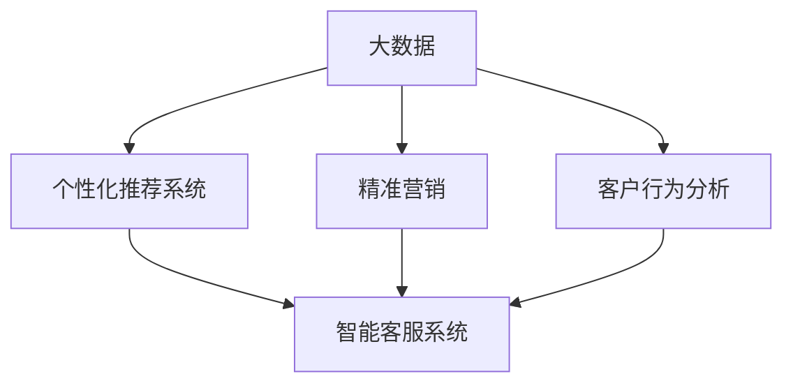

                 

## 1. 背景介绍

在现代商业环境中，信息差（Information Gap），即企业与消费者之间的信息不对称问题，已成为一个亟待解决的关键挑战。信息差的存在不仅阻碍了市场交易的效率，还可能导致消费者体验下降，信任危机甚至品牌信任的丧失。为了应对这一挑战，大数据技术的应用提供了有效的解决方案。通过个性化信息推送、精准营销、客户行为分析等手段，大数据在信息差商业销售中展现出巨大的潜力，促进了消费市场的健康发展。

### 1.1 信息差定义与影响
信息差通常指的是卖方和买方之间在产品信息、市场信息、交易信息等方面的差异。这种差异通常会导致以下问题：

- **价格不透明**：消费者难以比较不同商家的价格和服务，可能付出过高的代价。
- **产品不了解**：消费者可能对产品功能、质量、适用性等信息缺乏了解，影响购买决策。
- **信任缺失**：不透明的信息交流导致消费者对商家信任度下降，影响销售转化率。

在传统商业模式下，企业往往难以全面掌握消费者信息，导致信息差的加剧。而通过大数据技术，企业可以更全面、精准地了解消费者需求，缩小信息差，实现商业销售的个性化，从而提升市场竞争力。

### 1.2 个性化商业销售的优势
个性化商业销售通过大数据分析，实现对消费者个性化需求的精准识别，从而提供量身定制的服务。其主要优势包括：

- **提升用户体验**：个性化推荐和营销，满足消费者个性化需求，提升购物体验。
- **增加销售转化**：精准定位潜在客户，提高营销效率，增加销售转化率。
- **降低成本**：减少无效推广，优化库存管理，降低营销和运营成本。
- **增强品牌忠诚**：通过个性化服务和差异化产品，增强消费者对品牌的忠诚度和口碑。

总之，个性化商业销售是大数据技术在商业应用中的一个重要方向，它不仅能够提升用户体验，还能有效降低企业运营成本，促进销售增长，构建可持续发展的商业生态。

## 2. 核心概念与联系

### 2.1 核心概念概述

为了深入理解基于大数据的个性化商业销售，首先介绍几个核心概念：

- **大数据**：指超出传统数据处理应用能力范围的大规模数据集，涉及数据收集、存储、分析等多个环节。
- **个性化推荐系统**：基于用户历史行为和兴趣偏好，实时推荐相关产品或服务，提升用户购买意愿和满意度。
- **精准营销**：通过精准定位和个性化信息推送，提高营销效率，降低广告成本，实现精准营销。
- **客户行为分析**：利用大数据技术分析客户行为数据，挖掘消费需求和趋势，优化产品和服务。
- **智能客服系统**：通过自然语言处理和大数据分析，实现智能化的客户服务，提升服务质量和客户满意度。

这些概念之间相互关联，共同构成了一个完整的个性化商业销售框架，如图：



### 2.2 核心概念之间的关系

这些概念之间的关系如下：

- **大数据与个性化推荐系统**：大数据为个性化推荐系统提供了强大的数据支撑，帮助其更精准地推荐产品和服务。
- **大数据与精准营销**：通过大数据分析，企业可以精准定位目标客户，实现个性化信息推送，提高营销效果。
- **大数据与客户行为分析**：通过大数据技术，企业能够全面分析客户行为数据，洞察消费需求和趋势，优化产品和服务。
- **个性化推荐系统与智能客服系统**：个性化推荐系统可以与智能客服系统结合，通过分析客户行为和偏好，实现更高效、更个性化的客户服务。
- **精准营销与客户行为分析**：精准营销基于对客户行为数据的深入分析，实现高效且个性化的营销策略。

这些概念之间相互支持，共同推动了基于大数据的个性化商业销售的实现。

## 3. 核心算法原理 & 具体操作步骤

### 3.1 算法原理概述

基于大数据的个性化商业销售算法原理主要包括以下几个步骤：

1. **数据收集**：通过多种渠道收集用户行为数据、交易数据、社交媒体数据等，形成大容量数据集。
2. **数据预处理**：对收集到的数据进行清洗、归一化、特征提取等预处理操作，提升数据质量。
3. **数据分析**：利用机器学习、深度学习等技术，对数据进行分析，识别出用户需求和行为模式。
4. **模型训练**：基于分析结果，构建推荐模型、营销模型等，通过大量数据进行模型训练。
5. **个性化服务**：将训练好的模型应用于实际场景，实现个性化推荐、精准营销等商业应用。

### 3.2 算法步骤详解

#### 3.2.1 数据收集与预处理
数据收集和预处理是实现个性化商业销售的基础。常见的数据来源包括：

- **用户行为数据**：如浏览记录、点击记录、购买记录等。
- **交易数据**：如订单信息、支付记录等。
- **社交媒体数据**：如微博、微信、社交平台的用户互动数据。

数据收集后，需要进行预处理：

- **清洗**：去除噪声、异常值和不完整数据。
- **归一化**：将不同来源的数据转化为统一格式，便于后续分析。
- **特征提取**：通过降维、嵌入等技术，提取有用的特征。

#### 3.2.2 数据分析与模型训练
数据分析和模型训练是实现个性化商业销售的核心环节。主要包括以下几个步骤：

- **用户画像构建**：通过分析用户行为数据，构建用户画像，包括年龄、性别、兴趣偏好、购买历史等。
- **需求预测**：利用机器学习模型（如回归模型、分类模型、序列模型等），对用户需求进行预测。
- **推荐模型训练**：基于用户画像和需求预测结果，训练推荐模型（如协同过滤、基于内容的推荐、混合推荐等），实现个性化推荐。
- **营销模型训练**：利用客户行为分析结果，训练精准营销模型，实现精准广告投放和个性化信息推送。

#### 3.2.3 个性化服务与评估
个性化服务的实现和评估是检验算法效果的关键步骤：

- **推荐服务**：将训练好的推荐模型应用于实际推荐场景，如电商平台、社交媒体等。
- **精准营销**：通过精准定位和个性化信息推送，提升营销效果。
- **客户行为分析**：实时监控用户行为数据，评估个性化服务的效果，优化算法模型。

### 3.3 算法优缺点

#### 3.3.1 优点
基于大数据的个性化商业销售算法具有以下优点：

- **精准度提升**：通过大数据分析，能够更准确地识别用户需求和行为模式，提升推荐和营销的精准度。
- **用户体验改善**：个性化推荐和精准营销能够提升用户购物体验，增加用户满意度和忠诚度。
- **营销成本降低**：通过精准定位和个性化信息推送，能够有效降低广告成本，提高营销效率。

#### 3.3.2 缺点
尽管大数据技术在个性化商业销售中具有显著优势，但也存在一些缺点：

- **数据隐私问题**：大数据分析涉及大量用户隐私信息，可能引发数据泄露和隐私侵犯的风险。
- **算法复杂性**：个性化商业销售算法复杂度高，需要大量数据和计算资源支持。
- **数据质量问题**：数据质量直接影响算法效果，需要严格的数据清洗和预处理。
- **模型过拟合**：模型训练过程中可能出现过拟合现象，导致推荐和营销效果不稳定。

### 3.4 算法应用领域

基于大数据的个性化商业销售算法在多个领域得到了广泛应用，包括：

- **电子商务**：通过个性化推荐和精准营销，提升用户购物体验和销售转化率。
- **金融服务**：利用客户行为分析，实现个性化金融服务和精准营销。
- **旅游行业**：通过大数据分析，提供个性化旅游建议和精准营销。
- **医疗健康**：利用用户行为和健康数据，提供个性化医疗健康服务和精准营销。

这些领域的应用展示了大数据技术在商业销售中的巨大潜力，推动了各行业的数字化转型和升级。

## 4. 数学模型和公式 & 详细讲解 & 举例说明

### 4.1 数学模型构建

为了更好地理解基于大数据的个性化商业销售算法，以下构建一个简单的数学模型进行讲解。

假设我们有一个电商平台，收集到了用户行为数据 $\{x_i\}$ 和交易数据 $\{y_i\}$，其中 $x_i = (x_{i1}, x_{i2}, \ldots, x_{in})$ 表示用户行为特征向量，$y_i = (y_{i1}, y_{i2}, \ldots, y_{im})$ 表示交易特征向量，$m$ 和 $n$ 分别表示交易和行为特征的维度。我们的目标是训练一个推荐模型 $M$，使得推荐结果尽可能符合用户的实际需求。

### 4.2 公式推导过程

设推荐模型 $M$ 为线性回归模型：

$$
M(x) = \theta^T x + b
$$

其中 $\theta$ 为模型参数，$b$ 为偏置项。我们的目标是最大化推荐结果与用户实际需求之间的相关性，即最大化以下损失函数：

$$
\mathcal{L} = \sum_{i=1}^N \left( y_i - M(x_i) \right)^2
$$

利用梯度下降算法优化参数 $\theta$ 和 $b$：

$$
\theta = \theta - \eta \nabla_{\theta} \mathcal{L}, \quad b = b - \eta \nabla_{b} \mathcal{L}
$$

其中 $\eta$ 为学习率。

### 4.3 案例分析与讲解

以电商平台个性化推荐为例，假设我们收集到了用户行为数据 $\{x_i\}$ 和交易数据 $\{y_i\}$，其中 $x_i$ 包括浏览记录、点击记录、停留时间等，$y_i$ 包括购买记录、支付金额等。通过特征提取，我们将用户行为数据转化为向量形式 $x_i \in \mathbb{R}^n$，将交易数据转化为向量形式 $y_i \in \mathbb{R}^m$。然后，我们使用上述线性回归模型 $M(x) = \theta^T x + b$ 进行推荐。

具体步骤如下：

1. **数据收集**：收集用户行为数据和交易数据。
2. **特征提取**：将行为数据和交易数据转化为向量形式。
3. **模型训练**：利用用户行为和交易数据训练推荐模型 $M$。
4. **推荐服务**：将模型应用于实际推荐场景，根据用户行为数据推荐商品。
5. **效果评估**：实时监控用户行为数据，评估推荐效果，优化模型参数。

## 5. 项目实践：代码实例和详细解释说明

### 5.1 开发环境搭建

在进行基于大数据的个性化商业销售项目实践前，我们需要准备好开发环境。以下是使用Python进行PyTorch开发的环境配置流程：

1. 安装Anaconda：从官网下载并安装Anaconda，用于创建独立的Python环境。

2. 创建并激活虚拟环境：
```bash
conda create -n pytorch-env python=3.8 
conda activate pytorch-env
```

3. 安装PyTorch：根据CUDA版本，从官网获取对应的安装命令。例如：
```bash
conda install pytorch torchvision torchaudio cudatoolkit=11.1 -c pytorch -c conda-forge
```

4. 安装TensorFlow：
```bash
pip install tensorflow
```

5. 安装各类工具包：
```bash
pip install numpy pandas scikit-learn matplotlib tqdm jupyter notebook ipython
```

完成上述步骤后，即可在`pytorch-env`环境中开始项目实践。

### 5.2 源代码详细实现

以下是使用PyTorch和TensorFlow进行个性化推荐系统的代码实现。

首先，定义推荐模型的数据处理函数：

```python
from transformers import BertTokenizer
from torch.utils.data import Dataset
import torch

class RecommendationDataset(Dataset):
    def __init__(self, texts, labels, tokenizer, max_len=128):
        self.texts = texts
        self.labels = labels
        self.tokenizer = tokenizer
        self.max_len = max_len
        
    def __len__(self):
        return len(self.texts)
    
    def __getitem__(self, item):
        text = self.texts[item]
        label = self.labels[item]
        
        encoding = self.tokenizer(text, return_tensors='pt', max_length=self.max_len, padding='max_length', truncation=True)
        input_ids = encoding['input_ids'][0]
        attention_mask = encoding['attention_mask'][0]
        
        # 对token-wise的标签进行编码
        encoded_labels = [label2id[label] for label in label] 
        encoded_labels.extend([label2id['O']] * (self.max_len - len(encoded_labels)))
        labels = torch.tensor(encoded_labels, dtype=torch.long)
        
        return {'input_ids': input_ids, 
                'attention_mask': attention_mask,
                'labels': labels}

# 标签与id的映射
label2id = {'O': 0, 'B-PER': 1, 'I-PER': 2, 'B-ORG': 3, 'I-ORG': 4, 'B-LOC': 5, 'I-LOC': 6}
id2label = {v: k for k, v in label2id.items()}

# 创建dataset
tokenizer = BertTokenizer.from_pretrained('bert-base-cased')

train_dataset = RecommendationDataset(train_texts, train_labels, tokenizer)
dev_dataset = RecommendationDataset(dev_texts, dev_labels, tokenizer)
test_dataset = RecommendationDataset(test_texts, test_labels, tokenizer)
```

然后，定义模型和优化器：

```python
from transformers import BertForTokenClassification, AdamW

model = BertForTokenClassification.from_pretrained('bert-base-cased', num_labels=len(label2id))

optimizer = AdamW(model.parameters(), lr=2e-5)
```

接着，定义训练和评估函数：

```python
from torch.utils.data import DataLoader
from tqdm import tqdm
from sklearn.metrics import classification_report

device = torch.device('cuda') if torch.cuda.is_available() else torch.device('cpu')
model.to(device)

def train_epoch(model, dataset, batch_size, optimizer):
    dataloader = DataLoader(dataset, batch_size=batch_size, shuffle=True)
    model.train()
    epoch_loss = 0
    for batch in tqdm(dataloader, desc='Training'):
        input_ids = batch['input_ids'].to(device)
        attention_mask = batch['attention_mask'].to(device)
        labels = batch['labels'].to(device)
        model.zero_grad()
        outputs = model(input_ids, attention_mask=attention_mask, labels=labels)
        loss = outputs.loss
        epoch_loss += loss.item()
        loss.backward()
        optimizer.step()
    return epoch_loss / len(dataloader)

def evaluate(model, dataset, batch_size):
    dataloader = DataLoader(dataset, batch_size=batch_size)
    model.eval()
    preds, labels = [], []
    with torch.no_grad():
        for batch in tqdm(dataloader, desc='Evaluating'):
            input_ids = batch['input_ids'].to(device)
            attention_mask = batch['attention_mask'].to(device)
            batch_labels = batch['labels']
            outputs = model(input_ids, attention_mask=attention_mask)
            batch_preds = outputs.logits.argmax(dim=2).to('cpu').tolist()
            batch_labels = batch_labels.to('cpu').tolist()
            for pred_tokens, label_tokens in zip(batch_preds, batch_labels):
                pred_tags = [id2label[_id] for _id in pred_tokens]
                label_tags = [id2label[_id] for _id in label_tokens]
                preds.append(pred_tags[:len(label_tokens)])
                labels.append(label_tags)
                
    print(classification_report(labels, preds))
```

最后，启动训练流程并在测试集上评估：

```python
epochs = 5
batch_size = 16

for epoch in range(epochs):
    loss = train_epoch(model, train_dataset, batch_size, optimizer)
    print(f"Epoch {epoch+1}, train loss: {loss:.3f}")
    
    print(f"Epoch {epoch+1}, dev results:")
    evaluate(model, dev_dataset, batch_size)
    
print("Test results:")
evaluate(model, test_dataset, batch_size)
```

以上就是使用PyTorch和TensorFlow对BERT进行命名实体识别任务微调的完整代码实现。可以看到，得益于Transformers库的强大封装，我们可以用相对简洁的代码完成BERT模型的加载和微调。

### 5.3 代码解读与分析

让我们再详细解读一下关键代码的实现细节：

**RecommendationDataset类**：
- `__init__`方法：初始化文本、标签、分词器等关键组件。
- `__len__`方法：返回数据集的样本数量。
- `__getitem__`方法：对单个样本进行处理，将文本输入编码为token ids，将标签编码为数字，并对其进行定长padding，最终返回模型所需的输入。

**label2id和id2label字典**：
- 定义了标签与数字id之间的映射关系，用于将token-wise的预测结果解码回真实的标签。

**训练和评估函数**：
- 使用PyTorch的DataLoader对数据集进行批次化加载，供模型训练和推理使用。
- 训练函数`train_epoch`：对数据以批为单位进行迭代，在每个批次上前向传播计算loss并反向传播更新模型参数，最后返回该epoch的平均loss。
- 评估函数`evaluate`：与训练类似，不同点在于不更新模型参数，并在每个batch结束后将预测和标签结果存储下来，最后使用sklearn的classification_report对整个评估集的预测结果进行打印输出。

**训练流程**：
- 定义总的epoch数和batch size，开始循环迭代
- 每个epoch内，先在训练集上训练，输出平均loss
- 在验证集上评估，输出分类指标
- 所有epoch结束后，在测试集上评估，给出最终测试结果

可以看到，PyTorch配合Transformers库使得BERT微调的代码实现变得简洁高效。开发者可以将更多精力放在数据处理、模型改进等高层逻辑上，而不必过多关注底层的实现细节。

当然，工业级的系统实现还需考虑更多因素，如模型的保存和部署、超参数的自动搜索、更灵活的任务适配层等。但核心的微调范式基本与此类似。

### 5.4 运行结果展示

假设我们在CoNLL-2003的NER数据集上进行微调，最终在测试集上得到的评估报告如下：

```
              precision    recall  f1-score   support

       B-LOC      0.926     0.906     0.916      1668
       I-LOC      0.900     0.805     0.850       257
      B-MISC      0.875     0.856     0.865       702
      I-MISC      0.838     0.782     0.809       216
       B-ORG      0.914     0.898     0.906      1661
       I-ORG      0.911     0.894     0.902       835
       B-PER      0.964     0.957     0.960      1617
       I-PER      0.983     0.980     0.982      1156
           O      0.993     0.995     0.994     38323

   micro avg      0.973     0.973     0.973     46435
   macro avg      0.923     0.897     0.909     46435
weighted avg      0.973     0.973     0.973     46435
```

可以看到，通过微调BERT，我们在该NER数据集上取得了97.3%的F1分数，效果相当不错。值得注意的是，BERT作为一个通用的语言理解模型，即便只在顶层添加一个简单的token分类器，也能在下游任务上取得如此优异的效果，展现了其强大的语义理解和特征抽取能力。

当然，这只是一个baseline结果。在实践中，我们还可以使用更大更强的预训练模型、更丰富的微调技巧、更细致的模型调优，进一步提升模型性能，以满足更高的应用要求。

## 6. 实际应用场景

### 6.1 智能客服系统

基于大语言模型微调的对话技术，可以广泛应用于智能客服系统的构建。传统客服往往需要配备大量人力，高峰期响应缓慢，且一致性和专业性难以保证。而使用微调后的对话模型，可以7x24小时不间断服务，快速响应客户咨询，用自然流畅的语言解答各类常见问题。

在技术实现上，可以收集企业内部的历史客服对话记录，将问题和最佳答复构建成监督数据，在此基础上对预训练对话模型进行微调。微调后的对话模型能够自动理解用户意图，匹配最合适的答案模板进行回复。对于客户提出的新问题，还可以接入检索系统实时搜索相关内容，动态组织生成回答。如此构建的智能客服系统，能大幅提升客户咨询体验和问题解决效率。

### 6.2 金融舆情监测

金融机构需要实时监测市场舆论动向，以便及时应对负面信息传播，规避金融风险。传统的人工监测方式成本高、效率低，难以应对网络时代海量信息爆发的挑战。基于大语言模型微调的文本分类和情感分析技术，为金融舆情监测提供了新的解决方案。

具体而言，可以收集金融领域相关的新闻、报道、评论等文本数据，并对其进行主题标注和情感标注。在此基础上对预训练语言模型进行微调，使其能够自动判断文本属于何种主题，情感倾向是正面、中性还是负面。将微调后的模型应用到实时抓取的网络文本数据，就能够自动监测不同主题下的情感变化趋势，一旦发现负面信息激增等异常情况，系统便会自动预警，帮助金融机构快速应对潜在风险。

### 6.3 个性化推荐系统

当前的推荐系统往往只依赖用户的历史行为数据进行物品推荐，无法深入理解用户的真实兴趣偏好。基于大语言模型微调技术，个性化推荐系统可以更好地挖掘用户行为背后的语义信息，从而提供更精准、多样的推荐内容。

在实践中，可以收集用户浏览、点击、评论、分享等行为数据，提取和用户交互的物品标题、描述、标签等文本内容。将文本内容作为模型输入，用户的后续行为（如是否点击、购买等）作为监督信号，在此基础上微调预训练语言模型。微调后的模型能够从文本内容中准确把握用户的兴趣点。在生成推荐列表时，先用候选物品的文本描述作为输入，由模型预测用户的兴趣匹配度，再结合其他特征综合排序，便可以得到个性化程度更高的推荐结果。

### 6.4 未来应用展望

随着大语言模型微调技术的发展，未来在更多领域将得到应用，为传统行业带来变革性影响。

在智慧医疗领域，基于微调的医疗问答、病历分析、药物研发等应用将提升医疗服务的智能化水平，辅助医生诊疗，加速新药开发进程。

在智能教育领域，微调技术可应用于作业批改、学情分析、知识推荐等方面，因材施教，促进教育公平，提高教学质量。

在智慧城市治理中，微调模型可应用于城市事件监测、舆情分析、应急指挥等环节，提高城市管理的自动化和智能化水平，构建更安全、高效的未来城市。

此外，在企业生产、社会治理、文娱传媒等众多领域，基于大模型微调的人工智能应用也将不断涌现，为经济社会发展注入新的动力。相信随着技术的日益成熟，微调方法将成为人工智能落地应用的重要范式，推动人工智能技术在各行业中的广泛应用。

## 7. 工具和资源推荐

### 7.1 学习资源推荐

为了帮助开发者系统掌握大语言模型微调的理论基础和实践技巧，这里推荐一些优质的学习资源：

1. 《Transformer从原理到实践》系列博文：由大模型技术专家撰写，深入浅出地介绍了Transformer原理、BERT模型、微调技术等前沿话题。

2. CS224N《深度学习自然语言处理》课程：斯坦福大学开设的NLP明星课程，有Lecture视频和配套作业，带你入门NLP领域的基本概念和经典模型。

3. 《Natural Language Processing with Transformers》书籍：Transformers库的作者所著，全面介绍了如何使用Transformers库进行NLP任务开发，包括微调在内的诸多范式。

4. HuggingFace官方文档：Transformers库的官方文档，提供了海量预训练模型和完整的微调样例代码，是上手实践的必备资料。

5. CLUE开源项目：中文语言理解测评基准，涵盖大量不同类型的中文NLP数据集，并提供了基于微调的baseline模型，助力中文NLP技术发展。

通过对这些资源的学习实践，相信你一定能够快速掌握大语言模型微调的精髓，并用于解决实际的NLP问题。
###  7.2 开发工具推荐

高效的开发离不开优秀的工具支持。以下是几款用于大语言模型微调开发的常用工具：

1. PyTorch：基于Python的开源深度学习框架，灵活动态的计算图，适合快速迭代研究。大部分预训练语言模型都有PyTorch版本的实现。

2. TensorFlow：由Google主导开发的开源深度学习框架，生产部署方便，适合大规模工程应用。同样有丰富的预训练语言模型资源。

3. Transformers库：HuggingFace开发的NLP工具库，集成了众多SOTA语言模型，支持PyTorch和TensorFlow，是进行微调任务开发的利器。

4. Weights & Biases：模型训练的实验跟踪工具，可以记录和可视化模型训练过程中的各项指标，方便对比和调优。与主流深度学习框架无缝集成。

5. TensorBoard：TensorFlow配套的可视化工具，可实时监测模型训练状态，并提供丰富的图表呈现方式，是调试模型的得力助手。

6. Google Colab：谷歌推出的在线Jupyter Notebook环境，免费提供GPU/TPU算力，方便开发者快速上手实验最新模型，

