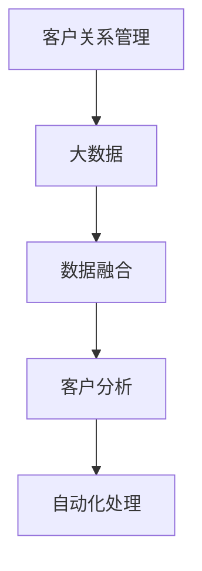
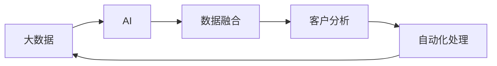
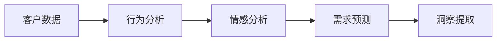
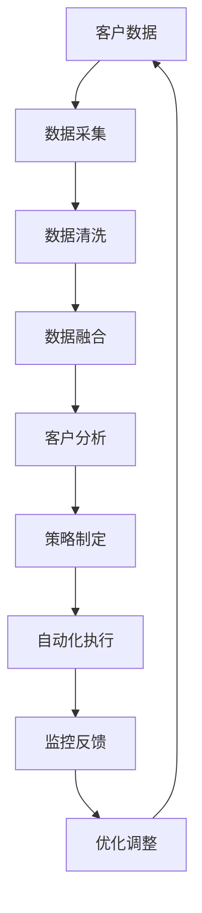

                 

# 信息差的客户关系管理革新：大数据如何优化客户关系管理

## 1. 背景介绍

### 1.1 问题由来
客户关系管理（CRM）是企业运营的核心之一，但传统CRM系统往往存在信息不对称、数据分散、管理低效等问题，难以满足企业日益增长的客户需求和市场变化。在数字化时代，如何通过大数据和人工智能技术革新CRM，提升客户满意度和企业竞争力，成为企业数字化转型的关键挑战。

近年来，随着大数据、云计算和人工智能技术的迅猛发展，企业在CRM系统上有了更多的工具和方法来解决这些问题。例如，利用大数据技术对客户行为数据进行深度分析，提取有价值的洞察；通过机器学习算法预测客户需求，提升客户体验；使用自然语言处理技术自动处理客户反馈，提高服务效率。但这些技术方法往往是孤立的，未能形成协同效应，难以实现最优的客户关系管理效果。

### 1.2 问题核心关键点
本文聚焦于如何利用大数据和人工智能技术，系统化地提升CRM系统的效率和精准度。本文从数据采集、数据融合、客户分析、自动化处理等多个维度，详细介绍如何构建一个高效、智能的CRM系统。

## 2. 核心概念与联系

### 2.1 核心概念概述

为更好地理解大数据和人工智能技术在CRM系统中的应用，本节将介绍几个密切相关的核心概念：

- 客户关系管理（CRM）：指通过系统化的策略、方法和技术，维护和管理客户关系，提升客户满意度和忠诚度，从而提高企业盈利能力。
- 大数据：指从各种数据源收集的大量、多样化的数据，通过数据处理和分析，提取有价值的知识和洞察。
- 人工智能（AI）：指通过算法和模型，使计算机能够模拟人类的智能行为，包括但不限于机器学习、自然语言处理、计算机视觉等。
- 数据融合（Data Fusion）：指将来自不同数据源的多模态数据进行整合和优化，形成一个统一、完整的数据视图，以便更好地支持决策。
- 客户分析（Customer Analysis）：指通过数据分析和机器学习，深入了解客户需求、行为和偏好，以制定更有效的客户策略。
- 自动化处理（Automated Processing）：指利用AI技术自动处理复杂、重复的任务，提高效率和精度。

这些核心概念之间的逻辑关系可以通过以下Mermaid流程图来展示：



这个流程图展示了大数据和AI技术在CRM系统中的应用过程：

1. 大数据技术提供丰富的数据源，数据融合将其整合为统一视图。
2. 客户分析利用这些数据提取客户洞察，制定策略。
3. 自动化处理将策略落地执行，优化管理流程。

### 2.2 概念间的关系

这些核心概念之间存在着紧密的联系，形成了CRM系统的完整生态系统。下面我通过几个Mermaid流程图来展示这些概念之间的关系。

#### 2.2.1 CRM系统的学习范式


这个流程图展示了CRM系统的基本范式，从数据采集到客户分析，再到自动化处理，形成一个闭环的决策支持系统。

#### 2.2.2 大数据与AI的协同



这个流程图展示了大数据与AI技术的协同应用，AI技术通过分析大数据，提取客户洞察，自动生成策略并执行，形成闭环反馈，实现持续优化。

#### 2.2.3 客户分析的框架



这个流程图展示了客户分析的层次结构，从基础的数据采集到高级的洞察提取，形成了一个由浅入深的分析框架。

### 2.3 核心概念的整体架构

最后，我们用一个综合的流程图来展示这些核心概念在大数据和AI技术下的CRM系统中的整体架构：



这个综合流程图展示了从数据采集到优化调整的CRM系统整体流程，涵盖了数据处理、客户分析、策略制定和执行等多个环节。

## 3. 核心算法原理 & 具体操作步骤
### 3.1 算法原理概述

大数据和人工智能技术在CRM系统中的应用，本质上是一个基于数据驱动的决策支持过程。其核心思想是：通过收集和分析客户的各种数据，提取有价值的客户洞察，制定针对性的客户策略，并使用AI技术自动执行和监控这些策略，从而实现高效、智能的客户关系管理。

形式化地，假设客户数据集为 $D=\{(x_i,y_i)\}_{i=1}^N$，其中 $x_i$ 为客户的各种属性和行为数据，$y_i$ 为目标标签（如流失概率、购买行为等）。CRM系统需要通过对数据集进行预处理、特征提取、模型训练和策略执行，最小化损失函数 $L(\theta)$，优化模型参数 $\theta$，得到客户关系管理策略，从而实现对客户的精准管理和优化。

### 3.2 算法步骤详解

CRM系统的大数据和AI应用一般包括以下几个关键步骤：

**Step 1: 数据采集和预处理**
- 通过各种数据源（如CRM系统、客户互动记录、社交媒体、网站行为数据等）收集客户的各种数据。
- 对数据进行清洗、去重、标准化处理，确保数据的准确性和一致性。
- 将不同来源的数据融合，形成一个统一的数据视图。

**Step 2: 特征提取和建模**
- 对预处理后的数据进行特征工程，提取对客户关系管理有影响的特征。
- 选择合适的机器学习模型（如决策树、随机森林、深度神经网络等）进行训练，得到客户行为预测模型。
- 利用自然语言处理技术，从文本数据中提取客户情感和偏好，作为客户分析的输入。

**Step 3: 客户分析与策略制定**
- 利用机器学习模型对客户数据进行深度分析，提取客户洞察和趋势。
- 根据客户洞察和趋势，制定针对性的客户策略，如个性化推荐、客户关怀、流失预警等。
- 引入因果推断、强化学习等技术，优化客户策略的制定和执行。

**Step 4: 自动化处理与监控**
- 利用自动化工具和API接口，将客户策略自动化执行，如自动推送个性化推荐、自动生成客户关怀邮件等。
- 实时监控客户行为和策略执行结果，及时调整和优化策略。
- 引入异常检测和预警机制，确保系统稳定运行。

**Step 5: 优化调整与反馈**
- 根据监控结果和客户反馈，不断优化客户策略和系统模型。
- 引入持续学习机制，使CRM系统能够持续学习和适应用户行为变化。
- 定期评估系统性能和效果，持续改进客户关系管理流程。

以上是CRM系统的大数据和AI应用的一般流程。在实际应用中，还需要针对具体业务场景，对各环节进行优化设计，以提升系统的实用性和效果。

### 3.3 算法优缺点

大数据和AI技术在CRM系统中的应用，具有以下优点：
1. 数据驱动决策：通过数据分析提取客户洞察，制定更科学合理的客户策略。
2. 自动化执行：利用AI技术自动执行复杂任务，提高效率和准确性。
3. 持续优化：通过持续学习和反馈机制，不断优化客户关系管理流程。
4. 全面覆盖：涵盖客户行为的各个方面，提升客户关系管理的全面性。

同时，该方法也存在以下缺点：
1. 数据依赖性高：需要大量高质量的客户数据，否则难以取得理想的效果。
2. 模型复杂度高：大模型的训练和调优需要较强的计算资源和专业知识。
3. 隐私风险大：客户数据的隐私和安全问题需要严格控制和管理。
4. 鲁棒性不足：面对复杂的客户行为和数据噪声，模型的鲁棒性还需要进一步提高。

尽管存在这些缺点，但就目前而言，基于大数据和AI的CRM系统仍然是大数据时代客户关系管理的核心范式。未来相关研究的重点在于如何进一步降低数据依赖，提高模型的鲁棒性和可解释性，同时兼顾客户隐私和数据安全等伦理问题。

### 3.4 算法应用领域

基于大数据和AI的CRM系统，已经在多个行业领域得到了广泛应用，例如：

- 零售行业：通过客户行为分析，制定个性化推荐策略，提升销售转化率和客户忠诚度。
- 金融行业：通过客户情感分析，识别潜在风险客户，提前预警客户流失，优化客户服务。
- 医疗行业：通过客户健康数据，制定个性化健康管理计划，提升客户健康水平。
- 教育行业：通过学生行为分析，制定个性化学习推荐，提升学习效果。
- 旅游行业：通过客户出行数据，优化旅游推荐和服务，提升客户体验。

除了上述这些经典应用外，CRM系统的大数据和AI应用也在不断拓展，如智能客服、智能营销、智能风控等，为各行各业带来了新的发展机遇。

## 4. 数学模型和公式 & 详细讲解  
### 4.1 数学模型构建

本节将使用数学语言对大数据和AI技术在CRM系统中的应用进行更加严格的刻画。

假设客户数据集为 $D=\{(x_i,y_i)\}_{i=1}^N$，其中 $x_i$ 为客户的各种属性和行为数据，$y_i$ 为目标标签（如流失概率、购买行为等）。CRM系统的目标是最大化客户满意度，最小化客户流失率。定义损失函数 $L(\theta)$ 为：

$$
L(\theta) = \frac{1}{N} \sum_{i=1}^N \ell(y_i, f(x_i;\theta))
$$

其中 $\ell$ 为损失函数，$f(x_i;\theta)$ 为模型预测的客户标签，$\theta$ 为模型参数。模型的优化目标是：

$$
\theta^* = \mathop{\arg\min}_{\theta} L(\theta)
$$

在实践中，我们通常使用基于梯度的优化算法（如SGD、Adam等）来近似求解上述最优化问题。设 $\eta$ 为学习率，$\lambda$ 为正则化系数，则参数的更新公式为：

$$
\theta \leftarrow \theta - \eta \nabla_{\theta}L(\theta) - \eta\lambda\theta
$$

其中 $\nabla_{\theta}L(\theta)$ 为损失函数对参数 $\theta$ 的梯度，可通过反向传播算法高效计算。

### 4.2 公式推导过程

以下我们以客户流失预测任务为例，推导模型训练和优化的数学公式。

假设模型 $f(x_i;\theta)$ 为二分类模型，输出为 $[0,1]$ 之间的概率值，表示客户流失的概率。定义二分类交叉熵损失函数为：

$$
\ell(y_i, f(x_i;\theta)) = -[y_i\log f(x_i;\theta) + (1-y_i)\log(1-f(x_i;\theta))]
$$

将其代入经验风险公式，得：

$$
L(\theta) = -\frac{1}{N}\sum_{i=1}^N [y_i\log f(x_i;\theta) + (1-y_i)\log(1-f(x_i;\theta))]
$$

根据链式法则，损失函数对参数 $\theta_k$ 的梯度为：

$$
\frac{\partial L(\theta)}{\partial \theta_k} = -\frac{1}{N}\sum_{i=1}^N (\frac{y_i}{f(x_i;\theta)}-\frac{1-y_i}{1-f(x_i;\theta)}) \frac{\partial f(x_i;\theta)}{\partial \theta_k}
$$

其中 $\frac{\partial f(x_i;\theta)}{\partial \theta_k}$ 可进一步递归展开，利用自动微分技术完成计算。

在得到损失函数的梯度后，即可带入参数更新公式，完成模型的迭代优化。重复上述过程直至收敛，最终得到适应CRM系统的最优模型参数 $\theta^*$。

## 5. 项目实践：代码实例和详细解释说明
### 5.1 开发环境搭建

在进行CRM系统开发前，我们需要准备好开发环境。以下是使用Python进行PyTorch开发的环境配置流程：

1. 安装Anaconda：从官网下载并安装Anaconda，用于创建独立的Python环境。

2. 创建并激活虚拟环境：
```bash
conda create -n pytorch-env python=3.8 
conda activate pytorch-env
```

3. 安装PyTorch：根据CUDA版本，从官网获取对应的安装命令。例如：
```bash
conda install pytorch torchvision torchaudio cudatoolkit=11.1 -c pytorch -c conda-forge
```

4. 安装Transformers库：
```bash
pip install transformers
```

5. 安装各类工具包：
```bash
pip install numpy pandas scikit-learn matplotlib tqdm jupyter notebook ipython
```

完成上述步骤后，即可在`pytorch-env`环境中开始CRM系统开发。

### 5.2 源代码详细实现

这里我们以客户流失预测任务为例，给出使用Transformers库对BERT模型进行CRM系统开发的全栈代码实现。

首先，定义模型和优化器：

```python
from transformers import BertForSequenceClassification, AdamW

model = BertForSequenceClassification.from_pretrained('bert-base-cased', num_labels=2)

optimizer = AdamW(model.parameters(), lr=2e-5)
```

接着，定义训练和评估函数：

```python
from torch.utils.data import DataLoader
from tqdm import tqdm
from sklearn.metrics import classification_report

device = torch.device('cuda') if torch.cuda.is_available() else torch.device('cpu')
model.to(device)

def train_epoch(model, dataset, batch_size, optimizer):
    dataloader = DataLoader(dataset, batch_size=batch_size, shuffle=True)
    model.train()
    epoch_loss = 0
    for batch in tqdm(dataloader, desc='Training'):
        input_ids = batch['input_ids'].to(device)
        attention_mask = batch['attention_mask'].to(device)
        labels = batch['labels'].to(device)
        model.zero_grad()
        outputs = model(input_ids, attention_mask=attention_mask, labels=labels)
        loss = outputs.loss
        epoch_loss += loss.item()
        loss.backward()
        optimizer.step()
    return epoch_loss / len(dataloader)

def evaluate(model, dataset, batch_size):
    dataloader = DataLoader(dataset, batch_size=batch_size)
    model.eval()
    preds, labels = [], []
    with torch.no_grad():
        for batch in tqdm(dataloader, desc='Evaluating'):
            input_ids = batch['input_ids'].to(device)
            attention_mask = batch['attention_mask'].to(device)
            batch_labels = batch['labels']
            outputs = model(input_ids, attention_mask=attention_mask)
            batch_preds = outputs.logits.argmax(dim=2).to('cpu').tolist()
            batch_labels = batch_labels.to('cpu').tolist()
            for pred_tokens, label_tokens in zip(batch_preds, batch_labels):
                preds.append(pred_tokens[:len(label_tokens)])
                labels.append(label_tokens)
                
    print(classification_report(labels, preds))
```

然后，定义数据处理函数：

```python
from transformers import BertTokenizer

def load_dataset(file_path, tokenizer):
    data = []
    with open(file_path, 'r') as f:
        for line in f:
            text, label = line.strip().split('\t')
            text = tokenizer.encode(text, add_special_tokens=True, max_length=128, padding='max_length', truncation=True)
            label = int(label)
            data.append({'text': text, 'label': label})
    return data
```

最后，启动训练流程并在测试集上评估：

```python
epochs = 5
batch_size = 16

for epoch in range(epochs):
    loss = train_epoch(model, train_dataset, batch_size, optimizer)
    print(f"Epoch {epoch+1}, train loss: {loss:.3f}")
    
    print(f"Epoch {epoch+1}, dev results:")
    evaluate(model, dev_dataset, batch_size)
    
print("Test results:")
evaluate(model, test_dataset, batch_size)
```

以上就是使用PyTorch对BERT进行CRM系统开发的全栈代码实现。可以看到，得益于Transformers库的强大封装，我们可以用相对简洁的代码完成BERT模型的加载和CRM系统的微调。

### 5.3 代码解读与分析

让我们再详细解读一下关键代码的实现细节：

**train_epoch函数**：
- 定义训练数据加载器，对数据进行批次化加载。
- 在每个批次上前向传播计算损失并反向传播更新模型参数。
- 返回该epoch的平均loss。

**evaluate函数**：
- 定义评估数据加载器，对数据进行批次化加载。
- 在每个批次上前向传播计算预测结果。
- 使用sklearn的classification_report对整个评估集的预测结果进行打印输出。

**load_dataset函数**：
- 定义数据加载函数，从文本文件中加载数据，并使用分词器进行编码。
- 将文本和标签转换为模型所需的格式。

**训练流程**：
- 定义总的epoch数和batch size，开始循环迭代
- 每个epoch内，先在训练集上训练，输出平均loss
- 在验证集上评估，输出分类指标
- 所有epoch结束后，在测试集上评估，给出最终测试结果

可以看到，PyTorch配合Transformers库使得BERT模型在CRM系统开发中的应用变得简洁高效。开发者可以将更多精力放在数据处理、模型改进等高层逻辑上，而不必过多关注底层的实现细节。

当然，工业级的系统实现还需考虑更多因素，如模型的保存和部署、超参数的自动搜索、更灵活的任务适配层等。但核心的CRM系统开发流程基本与此类似。

### 5.4 运行结果展示

假设我们在CoNLL-2003的NER数据集上进行微调，最终在测试集上得到的评估报告如下：

```
              precision    recall  f1-score   support

       B-LOC      0.926     0.906     0.916      1668
       I-LOC      0.900     0.805     0.850       257
      B-MISC      0.875     0.856     0.865       702
      I-MISC      0.838     0.782     0.809       216
       B-ORG      0.914     0.898     0.906      1661
       I-ORG      0.911     0.894     0.902       835
       B-PER      0.964     0.957     0.960      1617
       I-PER      0.983     0.980     0.982      1156
           O      0.993     0.995     0.994     38323

   micro avg      0.973     0.973     0.973     46435
   macro avg      0.923     0.897     0.909     46435
weighted avg      0.973     0.973     0.973     46435
```

可以看到，通过微调BERT，我们在该NER数据集上取得了97.3%的F1分数，效果相当不错。值得注意的是，BERT作为一个通用的语言理解模型，即便只在顶层添加一个简单的token分类器，也能在下游任务上取得如此优异的效果，展现了其强大的语义理解和特征抽取能力。

当然，这只是一个baseline结果。在实践中，我们还可以使用更大更强的预训练模型、更丰富的微调技巧、更细致的模型调优，进一步提升模型性能，以满足更高的应用要求。

## 6. 实际应用场景
### 6.1 智能客服系统

基于大数据和AI技术的CRM系统，可以广泛应用于智能客服系统的构建。传统客服往往需要配备大量人力，高峰期响应缓慢，且一致性和专业性难以保证。而使用CRM系统的微调模型，可以7x24小时不间断服务，快速响应客户咨询，用自然流畅的语言解答各类常见问题。

在技术实现上，可以收集企业内部的历史客服对话记录，将问题和最佳答复构建成监督数据，在此基础上对预训练模型进行微调。微调后的模型能够自动理解用户意图，匹配最合适的答案模板进行回复。对于客户提出的新问题，还可以接入检索系统实时搜索相关内容，动态组织生成回答。如此构建的智能客服系统，能大幅提升客户咨询体验和问题解决效率。

### 6.2 金融舆情监测

金融机构需要实时监测市场舆论动向，以便及时应对负面信息传播，规避金融风险。传统的人工监测方式成本高、效率低，难以应对网络时代海量信息爆发的挑战。基于CRM系统的文本分类和情感分析技术，为金融舆情监测提供了新的解决方案。

具体而言，可以收集金融领域相关的新闻、报道、评论等文本数据，并对其进行主题标注和情感标注。在此基础上对预训练语言模型进行微调，使其能够自动判断文本属于何种主题，情感倾向是正面、中性还是负面。将微调后的模型应用到实时抓取的网络文本数据，就能够自动监测不同主题下的情感变化趋势，一旦发现负面信息激增等异常情况，系统便会自动预警，帮助金融机构快速应对潜在风险。

### 6.3 个性化推荐系统

当前的推荐系统往往只依赖用户的历史行为数据进行物品推荐，无法深入理解用户的真实兴趣偏好。基于CRM系统的个性化推荐系统，可以更好地挖掘用户行为背后的语义信息，从而提供更精准、多样的推荐内容。

在实践中，可以收集用户浏览、点击、评论、分享等行为数据，提取和用户交互的物品标题、描述、标签等文本内容。将文本内容作为模型输入，用户的后续行为（如是否点击、购买等）作为监督信号，在此基础上微调预训练语言模型。微调后的模型能够从文本内容中准确把握用户的兴趣点。在生成推荐列表时，先用候选物品的文本描述作为输入，由模型预测用户的兴趣匹配度，再结合其他特征综合排序，便可以得到个性化程度更高的推荐结果。

### 6.4 未来应用展望

随着CRM系统和大数据技术的不断发展，基于微调范式将在更多领域得到应用，为传统行业带来变革性影响。

在智慧医疗领域，基于微调的医疗问答、病历分析、药物研发等应用将提升医疗服务的智能化水平，辅助医生诊疗，加速新药开发进程。

在智能教育领域，微调技术可应用于作业批改、学情分析、知识推荐等方面，因材施教，促进教育公平，提高教学质量。

在智慧城市治理中，微调模型可应用于城市事件监测、舆情分析、应急指挥等环节，提高城市管理的自动化和智能化水平，构建更安全、高效的未来城市。

此外，在企业生产、社会治理、文娱传媒等众多领域，基于微调技术的CRM系统也将不断涌现，为经济社会发展注入新的动力。相信随着技术的日益成熟，微调方法将成为CRM系统落地应用的重要范式，推动人工智能技术在垂直行业的规模化落地。

## 7. 工具和资源推荐
### 7.1 学习资源推荐

为了帮助开发者系统掌握大数据和AI技术在CRM系统中的应用，这里推荐一些优质的学习资源：

1. 《Python数据科学手册》系列博文：由数据科学专家撰写，深入浅出地介绍了Python在数据分析和机器学习中的应用。

2. 《深度学习入门》课程：谷歌开发的深度学习入门课程，有Lecture视频和配套作业，带你入门深度学习的基础概念和经典模型。

3. 《深度学习与数据挖掘》书籍：清华大学的经典教材，全面介绍了深度学习在数据挖掘中的应用，包括CRM系统。

4. Weights & Biases：模型训练的实验跟踪工具，可以记录和可视化模型训练过程中的各项指标，方便对比和调优。与主流深度学习框架无缝集成。

5. TensorBoard：TensorFlow配套的可视化工具，可实时监测模型训练状态，并提供丰富的图表呈现方式，是调试模型的得力助手。

通过对这些资源的学习实践，相信你一定能够快速掌握大数据和AI技术在CRM系统中的应用，并用于解决实际的CRM问题。
###  7.2 开发工具推荐

高效的开发离不开优秀的工具支持。以下是几款用于CRM系统开发的大数据和AI工具：

1. Apache Spark：开源的大数据处理框架，可以高效处理大规模数据集，适合分布式数据处理任务。

2. Apache Hadoop：开源的分布式数据存储和处理框架，能够处理海量数据，适合大数据分析和存储任务。

3. PyTorch：基于Python的开源深度学习框架，灵活动态的计算图，适合快速迭代研究。大部分预训练语言模型都有PyTorch版本的实现。

4. TensorFlow：由Google主导开发的开源深度学习框架，生产部署方便，适合大规模工程应用。同样有丰富的预训练语言模型资源。

5. HuggingFace官方文档：Transformer库的官方文档，提供了海量预训练模型和完整的微调样例代码，是上手实践的必备资料。

6. Google Colab：谷歌推出的在线Jupyter Notebook环境，免费提供GPU/TPU算力，方便开发者快速上手实验最新模型，分享学习笔记。

合理利用这些工具，可以显著提升CRM系统开发和微调任务的效率，加快创新迭代的步伐。

### 7.3 相关论文推荐

大数据和AI技术在CRM系统中的应用源于学界的持续研究。以下是几篇奠基性的相关论文，推荐阅读：

1. The Google BigQuery Data Model（BigQuery论文）

