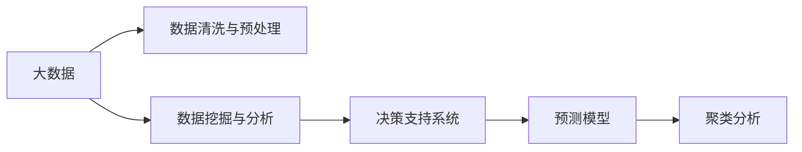
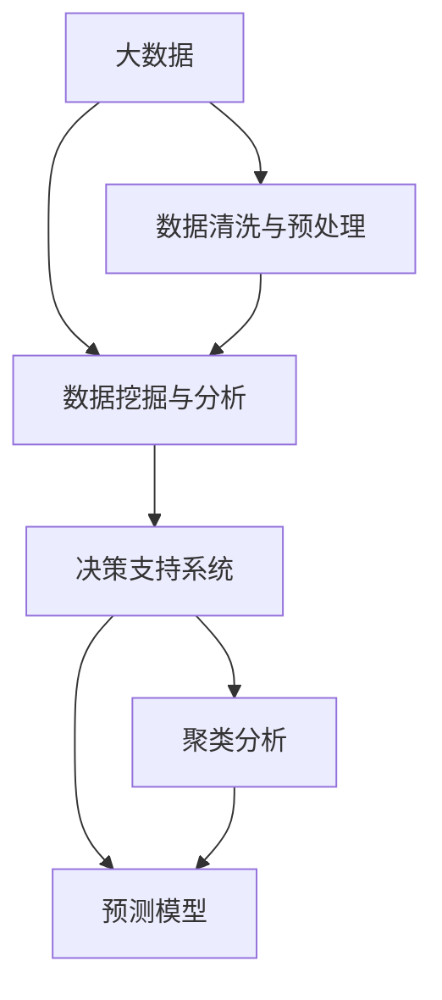

                 

# 信息差的市场研究支持：大数据如何支持市场研究

## 1. 背景介绍

### 1.1 问题由来
在信息爆炸的时代，企业的决策过程中充满了不确定性和复杂性。如何利用大数据手段，帮助企业获取、整合、分析市场信息，提升决策效率，成为当前市场研究领域的一项重要任务。传统的市场研究往往依赖于人工调查和统计分析，成本高、周期长，且难以捕捉动态变化的市场趋势。

近年来，大数据技术迅猛发展，为企业提供了更加全面、实时、高效的决策支持手段。大数据不仅能够提供海量的市场信息，还能通过先进的数据分析技术，揭示市场行为的深层次特征，帮助企业洞察潜在的市场机会。

### 1.2 问题核心关键点
大数据在市场研究中的应用，主要体现在以下几个方面：

- **数据采集与存储**：利用网络爬虫、传感器、社交媒体等手段，收集广泛的市场信息，包括消费者行为、市场趋势、竞争对手动态等。
- **数据清洗与预处理**：清洗数据中的噪声、缺失值，进行标准化和归一化处理，构建高效的数据模型。
- **数据挖掘与分析**：应用机器学习和统计学方法，挖掘数据中的模式和规律，生成深入的市场洞察。
- **决策支持与优化**：利用数据分析结果，支持企业制定更加精准的市场策略和决策方案。

本文将详细探讨大数据在市场研究中的应用，包括数据采集与存储、数据清洗与预处理、数据挖掘与分析、决策支持与优化等关键环节，揭示大数据如何为市场研究提供坚实的数据支撑和分析基础。

### 1.3 问题研究意义
大数据在市场研究中的应用，不仅能够提升数据处理的效率和精度，还能揭示市场行为的深层次特征，帮助企业做出更加科学、精准的决策。具体而言，研究大数据市场研究技术具有以下重要意义：

- **降低成本与时间**：大数据自动化的数据采集和分析，减少了人工调查和统计分析的时间和成本。
- **提升数据质量**：大数据技术能够处理海量、异构的数据源，提高数据的准确性和完整性。
- **捕捉动态变化**：大数据能够实时监测市场动态，帮助企业快速适应市场变化。
- **优化决策过程**：大数据分析提供深入的市场洞察，帮助企业制定更加科学、精准的市场策略。

## 2. 核心概念与联系

### 2.1 核心概念概述

为更好地理解大数据在市场研究中的应用，本节将介绍几个密切相关的核心概念：

- **大数据**：指的是规模巨大、类型繁多、速度极快的数据集合，包括结构化数据、非结构化数据、半结构化数据等。
- **数据清洗与预处理**：指通过数据清洗、标准化、归一化等方法，提高数据的质量和一致性，为后续分析奠定基础。
- **数据挖掘与分析**：指从大规模数据中提取有价值的信息和知识，包括分类、聚类、关联规则挖掘等技术。
- **决策支持系统**：指通过数据分析结果，辅助企业制定决策，优化业务流程的系统。
- **预测模型**：指利用历史数据，构建数学模型，预测未来趋势，如时间序列模型、回归模型、神经网络模型等。
- **聚类分析**：指将数据分为若干组，使得组内数据相似度高，组间差异大。

这些核心概念之间的逻辑关系可以通过以下Mermaid流程图来展示：



这个流程图展示了大数据市场研究中的关键环节和相关技术，帮助读者理解数据从采集到分析的全流程。

### 2.2 概念间的关系

这些核心概念之间存在着紧密的联系，形成了大数据市场研究的基本框架。下面我们通过几个Mermaid流程图来展示这些概念之间的关系。

#### 2.2.1 大数据与数据清洗预处理的关系


这个流程图展示了大数据和数据清洗预处理之间的关系，数据清洗预处理是大数据分析的前置环节，确保数据的质量和一致性。

#### 2.2.2 数据挖掘与分析与决策支持的关系


这个流程图展示了数据挖掘与分析和决策支持系统之间的关系，数据挖掘与分析是大数据的核心环节，通过分析得到的市场洞察支持决策支持系统优化业务流程。

#### 2.2.3 聚类分析与预测模型的关系


这个流程图展示了聚类分析和预测模型之间的关系，聚类分析可以用于预测模型的特征选择和模型优化。

### 2.3 核心概念的整体架构

最后，我们用一个综合的流程图来展示这些核心概念在大数据市场研究中的整体架构：



这个综合流程图展示了从大数据采集到决策支持的全流程，涵盖了数据清洗预处理、数据挖掘分析、决策支持优化、预测模型应用、聚类分析等多方面的内容，为大数据在市场研究中的应用提供了完整的技术架构。

## 3. 核心算法原理 & 具体操作步骤
### 3.1 算法原理概述

大数据在市场研究中的应用，主要基于以下算法原理：

1. **数据采集与存储**：利用网络爬虫、传感器、社交媒体等手段，采集海量市场数据，存储在分布式数据库中。

2. **数据清洗与预处理**：通过数据清洗、标准化、归一化等方法，去除数据中的噪声、缺失值，构建高效的数据模型。

3. **数据挖掘与分析**：应用机器学习和统计学方法，挖掘数据中的模式和规律，生成深入的市场洞察。

4. **决策支持与优化**：利用数据分析结果，支持企业制定更加精准的市场策略和决策方案。

5. **预测模型**：利用历史数据，构建数学模型，预测未来趋势，如时间序列模型、回归模型、神经网络模型等。

6. **聚类分析**：将数据分为若干组，使得组内数据相似度高，组间差异大，揭示市场行为的特征。

这些算法原理共同构成了大数据市场研究的基础，为大数据分析和决策支持提供了坚实的技术保障。

### 3.2 算法步骤详解

大数据在市场研究中的应用，通常分为以下步骤：

**Step 1: 数据采集与存储**

1. **网络爬虫**：利用网络爬虫技术，自动化地从各类网站抓取市场数据，如新闻、社交媒体评论、电商数据等。
2. **传感器数据**：利用物联网传感器，采集用户的地理位置、行为数据等。
3. **社交媒体数据**：利用API接口，从Twitter、Facebook、LinkedIn等社交平台获取用户数据。

**Step 2: 数据清洗与预处理**

1. **数据清洗**：去除数据中的噪声、缺失值，处理异常值，确保数据的质量。
2. **标准化和归一化**：将数据转换为标准格式，归一化处理，便于后续分析。
3. **数据整合**：将来自不同数据源的数据进行整合，构建统一的数据模型。

**Step 3: 数据挖掘与分析**

1. **特征提取**：从数据中提取有价值的信息和特征，如用户行为、市场趋势等。
2. **分类与聚类**：应用分类、聚类等算法，对数据进行分类和聚类分析。
3. **关联规则挖掘**：发现数据之间的关联关系，生成市场洞察。

**Step 4: 决策支持与优化**

1. **决策支持**：利用数据分析结果，辅助企业制定决策，优化业务流程。
2. **预测模型应用**：构建时间序列、回归、神经网络等预测模型，预测市场趋势。
3. **模型评估与优化**：评估预测模型的性能，优化模型参数，提高预测精度。

**Step 5: 聚类分析**

1. **数据分组**：将数据分为若干组，使得组内数据相似度高，组间差异大。
2. **特征选择**：选择对聚类结果有重要影响的特征，进行模型优化。
3. **聚类结果分析**：分析聚类结果，揭示市场行为的特征。

通过以上步骤，企业可以充分利用大数据技术，获取、整合、分析市场信息，支持决策优化。

### 3.3 算法优缺点

大数据在市场研究中的应用，具有以下优缺点：

**优点：**

1. **数据丰富多样**：大数据能够提供海量的市场信息，覆盖广泛的市场行为。
2. **实时性强**：大数据能够实时监测市场动态，快速响应市场变化。
3. **分析精度高**：大数据利用先进的数据分析技术，揭示市场行为的深层次特征，提高决策的准确性。

**缺点：**

1. **数据量大**：大数据需要处理海量数据，计算资源需求高。
2. **数据噪声多**：大数据中存在大量的噪声数据，需要复杂的清洗和预处理。
3. **隐私问题**：大数据涉及用户的隐私信息，需要严格的隐私保护措施。

尽管存在这些缺点，但大数据在市场研究中的应用，能够显著提升决策的科学性和准确性，为企业带来巨大的价值。

### 3.4 算法应用领域

大数据在市场研究中的应用，已经覆盖了金融、零售、医疗、电信等多个领域。具体而言：

- **金融行业**：利用大数据分析股票市场趋势、客户行为等，辅助风险控制和投资决策。
- **零售行业**：通过分析消费者行为和购买历史，优化库存管理和推荐系统。
- **医疗行业**：利用大数据分析病患数据，提高诊断和治疗的精准性。
- **电信行业**：利用大数据分析用户行为和网络流量，优化网络资源分配和服务质量。

## 4. 数学模型和公式 & 详细讲解 & 举例说明

### 4.1 数学模型构建

本节将使用数学语言对大数据在市场研究中的应用进行更加严格的刻画。

假设市场数据为 $D = \{(x_i, y_i)\}_{i=1}^N$，其中 $x_i$ 为市场特征向量，$y_i$ 为市场行为标签。

定义市场特征向量为 $x_i = [x_{i1}, x_{i2}, ..., x_{ik}]^T$，其中 $x_{ij}$ 为特征项。

定义市场行为标签为 $y_i \in \{0, 1\}$，表示市场行为是否发生。

### 4.2 公式推导过程

以下我们以分类问题为例，推导数据挖掘与分析中的常见算法公式。

假设利用逻辑回归模型对市场行为进行分类，则模型的预测结果为：

$$
P(y_i|x_i; \theta) = \frac{1}{1 + e^{-\theta^T x_i}}
$$

其中 $\theta$ 为模型参数，$x_i$ 为输入的市场特征向量。

给定训练集 $D = \{(x_i, y_i)\}_{i=1}^N$，逻辑回归模型的损失函数为：

$$
\mathcal{L}(\theta) = -\frac{1}{N} \sum_{i=1}^N [y_i \log P(y_i|x_i; \theta) + (1 - y_i) \log (1 - P(y_i|x_i; \theta))]
$$

其中，$P(y_i|x_i; \theta)$ 为模型对市场行为的预测概率，$y_i$ 为真实市场行为标签。

模型的优化目标是最小化损失函数，即：

$$
\hat{\theta} = \mathop{\arg\min}_{\theta} \mathcal{L}(\theta)
$$

通过梯度下降等优化算法，最小化损失函数，即可得到最优模型参数 $\hat{\theta}$。

### 4.3 案例分析与讲解

以零售行业的消费者行为分析为例，假设零售商收集了用户的购买记录、浏览记录、社交媒体评论等数据。利用大数据技术，可以构建以下模型：

1. **数据清洗与预处理**：去除数据中的噪声、缺失值，进行标准化和归一化处理，构建高效的数据模型。

2. **特征提取**：从数据中提取有价值的信息和特征，如用户购买频率、浏览时间、评论情绪等。

3. **分类与聚类**：应用分类、聚类等算法，对数据进行分类和聚类分析。例如，利用K-means算法将用户分为不同群体，分析不同群体的购买偏好和行为模式。

4. **关联规则挖掘**：发现数据之间的关联关系，生成市场洞察。例如，利用Apriori算法发现用户购买行为的关联规则，推荐相关商品。

5. **预测模型应用**：构建时间序列、回归、神经网络等预测模型，预测市场趋势。例如，利用LSTM模型预测用户未来的购买行为，优化库存管理。

通过以上分析，零售商可以更好地理解消费者行为，优化商品推荐和库存管理，提高销售额和客户满意度。

## 5. 项目实践：代码实例和详细解释说明

### 5.1 开发环境搭建

在进行市场研究的大数据实践前，我们需要准备好开发环境。以下是使用Python进行Pandas和Scikit-learn开发的Python环境配置流程：

1. 安装Anaconda：从官网下载并安装Anaconda，用于创建独立的Python环境。

2. 创建并激活虚拟环境：
```bash
conda create -n market-research python=3.8 
conda activate market-research
```

3. 安装Pandas和Scikit-learn：
```bash
pip install pandas scikit-learn
```

4. 安装各类工具包：
```bash
pip install numpy matplotlib jupyter notebook ipython
```

完成上述步骤后，即可在`market-research`环境中开始大数据市场研究的实践。

### 5.2 源代码详细实现

这里我们以金融行业的大数据分析为例，展示如何使用Pandas和Scikit-learn进行大数据市场研究。

首先，导入必要的库和数据集：

```python
import pandas as pd
from sklearn.model_selection import train_test_split
from sklearn.linear_model import LogisticRegression
from sklearn.metrics import accuracy_score

# 加载金融市场数据
data = pd.read_csv('financial_data.csv')
```

然后，定义数据清洗与预处理函数：

```python
def clean_data(data):
    # 去除缺失值
    data = data.dropna()
    # 标准化数据
    data = (data - data.mean()) / data.std()
    return data
```

接下来，定义特征提取与模型训练函数：

```python
def extract_features(data):
    # 提取特征
    features = data[['open', 'high', 'low', 'volume']]
    labels = data['sentiment']
    return features, labels

def train_model(features, labels):
    # 划分训练集和测试集
    features_train, features_test, labels_train, labels_test = train_test_split(features, labels, test_size=0.2)
    # 训练模型
    model = LogisticRegression()
    model.fit(features_train, labels_train)
    # 测试模型
    labels_pred = model.predict(features_test)
    return accuracy_score(labels_test, labels_pred)
```

最后，启动数据分析流程：

```python
# 清洗数据
data_clean = clean_data(data)

# 提取特征和标签
features, labels = extract_features(data_clean)

# 训练模型并测试
accuracy = train_model(features, labels)
print(f"模型准确率为：{accuracy:.2f}")
```

以上就是使用Python对金融行业大数据市场研究进行初步实践的完整代码实现。可以看到，通过Pandas和Scikit-learn，大数据市场研究可以变得更加简洁高效。

### 5.3 代码解读与分析

让我们再详细解读一下关键代码的实现细节：

**clean_data函数**：
- 去除数据中的缺失值，通过`dropna`函数删除缺失值。
- 标准化数据，通过`(z - mean) / std`进行标准化处理。

**extract_features函数**：
- 从数据中提取有价值的信息和特征，如市场数据中的开盘价、最高价、最低价和成交量等。

**train_model函数**：
- 划分训练集和测试集，通过`train_test_split`函数将数据集划分为训练集和测试集。
- 训练模型，使用逻辑回归模型进行分类预测。
- 测试模型，计算模型的准确率。

**数据分析流程**：
- 清洗数据，去除缺失值和噪声。
- 提取特征和标签，准备训练数据。
- 训练模型，得到训练结果。

以上代码展示了如何使用Pandas和Scikit-learn进行金融行业大数据市场研究的简单实践。通过更复杂的特征工程和模型选择，可以得到更准确的市场洞察和决策支持。

## 6. 实际应用场景

### 6.1 智能客服系统

大数据在智能客服系统中的应用，能够帮助企业更好地理解客户需求，优化客户服务。智能客服系统通过分析客户的历史通话记录、问题类型、反馈等数据，提供个性化的客户服务方案。

例如，零售行业的智能客服系统可以分析客户的购买记录、询问类型、满意度等数据，生成客户画像，提供个性化的产品推荐和问题解答。

### 6.2 金融舆情监测

金融行业利用大数据技术，可以实时监测金融舆情，识别市场风险，优化投资决策。金融舆情监测系统通过分析社交媒体、新闻、论坛等数据，生成舆情报告，预测市场趋势。

例如，金融行业的舆情监测系统可以分析新闻报道、社交媒体评论、财经博客等数据，识别市场热点和风险事件，辅助投资决策。

### 6.3 个性化推荐系统

个性化推荐系统利用大数据技术，可以根据用户的历史行为数据，推荐用户可能感兴趣的商品、服务或内容。推荐系统的核心在于用户行为数据的分析和建模。

例如，零售行业的推荐系统可以分析用户的购买记录、浏览记录、评论等数据，生成用户画像，提供个性化的商品推荐。

### 6.4 未来应用展望

随着大数据技术的不断进步，其在市场研究中的应用将更加广泛和深入。未来，大数据将在以下几个方面取得突破：

1. **实时数据处理**：利用流式数据处理技术，实时分析市场动态，快速响应市场变化。

2. **跨领域数据融合**：利用多源数据融合技术，整合不同领域的数据，生成更全面的市场洞察。

3. **智能决策支持**：利用机器学习和深度学习技术，提供更加精准的市场预测和决策支持。

4. **个性化推荐优化**：利用大数据分析用户行为，提供更加个性化的推荐结果，提升用户体验。

5. **隐私保护与合规**：利用数据匿名化和加密技术，保护用户隐私，符合合规要求。

6. **跨模态数据分析**：利用多模态数据分析技术，整合图像、视频、语音等数据，提升市场分析的深度和广度。

这些应用方向的探索，将进一步提升大数据市场研究的价值和应用范围，为各行业提供更加智能化、高效化的决策支持。

## 7. 工具和资源推荐
### 7.1 学习资源推荐

为了帮助开发者系统掌握大数据市场研究技术，这里推荐一些优质的学习资源：

1. 《Python数据分析与可视化》系列书籍：详细介绍Python在数据分析中的应用，涵盖Pandas、NumPy、Matplotlib等工具的使用。

2. 《大数据分析与处理》课程：由知名大学开设的线上课程，详细讲解大数据技术在市场研究中的应用。

3. 《机器学习实战》书籍：介绍机器学习和统计学方法在数据分析中的应用，涵盖回归、分类、聚类等算法。

4. 《深度学习与人工智能》课程：由斯坦福大学开设的深度学习课程，涵盖神经网络、卷积神经网络等深度学习技术。

5. Kaggle竞赛平台：全球最大的数据科学竞赛平台，提供丰富的数据集和开源代码，帮助开发者提升实践能力。

通过对这些资源的学习实践，相信你一定能够快速掌握大数据市场研究的精髓，并用于解决实际的决策支持问题。

### 7.2 开发工具推荐

高效的工具支持是大数据市场研究开发的重要保障。以下是几款用于大数据市场研究开发的常用工具：

1. Python：Python是数据科学领域的主流编程语言，易于学习，具备丰富的数据处理和分析库。

2. Pandas：Python的数据分析库，提供高效的数据处理和分析功能。

3. Scikit-learn：Python的机器学习库，提供丰富的算法和工具，支持分类、聚类、回归等任务。

4. TensorFlow：Google开发的深度学习框架，支持大规模数据处理和复杂模型的训练。

5. Hadoop：Apache开发的分布式计算框架，支持大数据的存储和处理。

6. Spark：Apache开发的分布式计算框架，支持大数据的分布式处理和分析。

合理利用这些工具，可以显著提升大数据市场研究开发效率，加速技术创新。

### 7.3 相关论文推荐

大数据在市场研究中的应用，需要理论和技术的双重支持。以下是几篇奠基性的相关论文，推荐阅读：

1. "Big Data: A Revolution That Will Transform How We Live, Work, and Think"：Big Data之父Viktor Mayer-Schönberger和Kenneth Cukier合著的书籍，详细介绍Big Data技术及其应用前景。

2. "The Promise and Peril of Big Data"：Viktor Mayer-Schönberger在Harvard Business Review上发表的文章，探讨大数据技术的优势和风险。

3. "Big Data Challenges: New Techniques and Approaches"：一篇关于大数据挑战和解决方案的综述性论文，涵盖数据采集、存储、分析等关键环节。

4. "Data Mining: Concepts and Techniques"：MIT教授Michael Steinbach等人合著的教材，系统讲解数据挖掘与分析技术。

5. "Big Data Mining: Clustering, Classification, and Prediction"：一本关于大数据挖掘与分析的书籍，涵盖数据清洗、特征工程、模型训练等内容。

这些论文代表了大数据市场研究技术的发展脉络，通过学习这些前沿成果，可以帮助研究者把握学科前进方向，激发更多的创新灵感。

除上述资源外，还有一些值得关注的前沿资源，帮助开发者紧跟大数据市场研究技术的最新进展，例如：

1. arXiv论文预印本：人工智能领域最新研究成果的发布平台，包括大量尚未发表的前沿工作，学习前沿技术的必读资源。

2. 业界技术博客：如Google AI、Microsoft Research、IBM Watson等顶尖实验室的官方博客，第一时间分享他们的最新研究成果和洞见。

3. 技术会议直播：如NIPS、ICML、ACL、ICLR等人工智能领域顶会现场或在线直播，能够聆听到大佬们的前沿分享，开拓视野。

4. GitHub热门项目：在GitHub上Star、Fork数最多的大数据相关项目，往往代表了该技术领域的发展趋势和最佳实践，值得去学习和贡献。

5. 行业分析报告：各大咨询公司如McKinsey、PwC等针对大数据行业的分析报告，有助于从商业视角审视技术趋势，把握应用价值。

总之，对于大数据市场研究技术的学习和实践，需要开发者保持开放的心态和持续学习的意愿。多关注前沿资讯，多动手实践，多思考总结，必将收获满满的成长收益。

## 8. 总结：未来发展趋势与挑战

### 8.1 总结

本文对大数据在市场研究中的应用进行了全面系统的介绍。首先阐述了大数据市场研究的研究背景和意义，明确了大数据在市场研究中的重要地位和作用。其次，从原理到实践，详细讲解了大数据市场研究中的关键技术和操作步骤，展示了大数据如何为市场研究提供坚实的数据支撑和分析基础。最后，通过实际应用场景和未来展望，揭示了大数据在市场研究中的广阔前景和潜在挑战。

通过本文的系统梳理，可以看到，大数据在市场研究中的应用不仅能够提升数据处理的效率和精度，还能揭示市场行为的深层次特征，帮助企业做出更加科学、精准的决策。未来，随着大数据技术的不断进步，其在市场研究中的应用将更加广泛和深入。

### 8.2 未来发展趋势

展望未来，大数据在市场研究中的应用将呈现以下几个发展趋势：

1. **数据质量提升**：随着数据采集和处理技术的进步，大数据的质量将不断提高，数据的准确性和完整性将得到进一步保障。

2. **跨领域数据融合**：大数据将更加注重跨领域数据的整合，整合不同领域的数据，生成更全面的市场洞察。

3. **实时数据处理**：利用流式数据处理技术，实时分析市场动态，快速响应市场变化。

4. **多模态数据融合**：利用多模态数据分析技术，整合图像、视频、语音等数据，提升市场分析的深度和广度。

5. **深度学习应用**：利用深度学习技术，提高数据挖掘和分析的精度和效果。

6. **智能决策支持**：利用机器学习和深度学习技术，提供更加精准的市场预测和决策支持。

以上趋势凸显了大数据在市场研究中的广阔前景，大数据技术将为市场研究带来更科学、更高效的决策支持。

### 8.3 面临的挑战

尽管大数据在市场研究中的应用取得了显著进展，但在迈向更加智能化、普适化应用的过程中，仍面临诸多挑战：

1. **数据隐私问题**：大数据涉及用户的隐私信息，数据隐私和安全保护是重要问题。

2. **数据质量问题**：大数据中的噪声、缺失值等问题，仍需进一步解决，确保数据的质量和一致性。

3. **计算资源需求高**：大数据需要处理海量数据，对计算资源和存储空间提出了更高的要求。

4. **算法复杂性高**：大数据处理需要复杂的算法支持，对算法的选择和优化提出了更高的要求。

5. **结果可解释性**：大数据分析结果的解释性问题，仍需进一步解决，提高模型的可解释性。

6. **系统稳定性**：大数据系统需要高稳定性，避免系统崩溃或数据丢失等问题。

这些挑战需要进一步研究和解决，以确保大数据在市场

