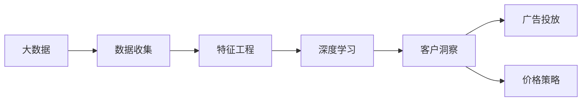
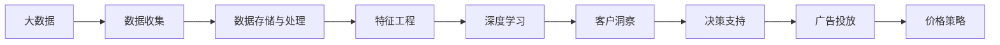
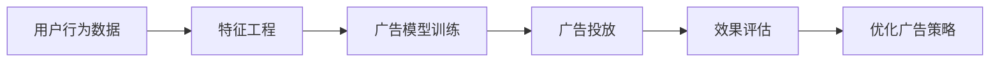

                 

# 信息差：大数据如何提升市场研究

> 关键词：信息差, 大数据, 市场研究, 深度学习, 特征工程, 客户洞察, 广告投放

## 1. 背景介绍

### 1.1 问题由来

在信息爆炸的时代，企业如何从海量数据中挖掘出有价值的信息，做出明智的市场决策，是一个亟待解决的难题。传统的市场研究方法往往依赖于问卷调查、焦点小组等手段，耗费大量时间和资源，且结果受限于样本量和调查质量。而随着大数据技术的兴起，企业开始利用大数据分析工具，从多个渠道收集用户数据，借助深度学习模型进行特征提取和模式识别，从而获得更全面的客户洞察和市场分析。

然而，大数据虽然提供了丰富的数据资源，但数据本身的复杂性和多样性也给市场研究带来了新的挑战。如何在大数据中提取出对市场决策有用的信息，如何构建有效的分析模型，如何在不同数据源间进行数据融合和比对，都是需要深入研究的问题。

### 1.2 问题核心关键点

信息差（Information Gap）是大数据市场研究的核心概念，指的是消费者决策过程中，与实际购买行为之间的差距。信息差的大小直接影响到企业产品推荐、广告投放和价格策略的有效性。大数据市场研究的目标就是通过收集和分析用户数据，识别并缩小信息差，帮助企业更好地理解市场和客户，实现精准营销和价值最大化。

基于大数据的市场研究通常包括以下几个关键步骤：

1. 数据收集：从多渠道收集用户行为数据，如网站访问记录、社交媒体互动数据、购买记录等。
2. 特征工程：对原始数据进行清洗、提取和转换，形成可用于模型训练的特征。
3. 模型构建：选择适合的深度学习模型，如逻辑回归、决策树、神经网络等，进行市场分析。
4. 效果评估：使用真实数据测试模型效果，调整模型参数，优化分析结果。
5. 结果应用：将模型分析结果应用于实际业务决策，如客户细分、广告投放、价格策略等。

## 2. 核心概念与联系

### 2.1 核心概念概述

为了更好地理解大数据在市场研究中的应用，本节将介绍几个核心概念：

- 大数据：指规模巨大、类型多样、速度极快的数据集合。典型的来源包括社交媒体、电商平台、搜索引擎、物联网设备等。
- 深度学习：一种基于神经网络的机器学习技术，能够自动从数据中学习复杂模式，进行特征提取和分类。
- 特征工程：指从原始数据中提取和构造特征，优化模型训练的过程。特征工程是构建有效分析模型的关键步骤。
- 客户洞察（Customer Insights）：指通过数据挖掘和分析，了解客户需求、偏好和行为，进而制定个性化营销策略。
- 广告投放（Ad Placement）：指通过分析用户行为数据，将广告投放给最有可能产生购买意向的用户，提高广告投放的效率和ROI。
- 价格策略（Pricing Strategy）：指通过分析市场需求和竞争情况，制定合理的定价策略，最大化产品利润。

这些核心概念之间的联系可以通过以下Mermaid流程图来展示：



这个流程图展示了大数据市场研究的基本流程：

1. 从多个渠道收集数据。
2. 对数据进行清洗和特征提取。
3. 使用深度学习模型进行数据分析。
4. 通过分析结果，深入了解客户需求和行为。
5. 制定针对性的广告和定价策略。

### 2.2 概念间的关系

这些核心概念之间存在着紧密的联系，形成了大数据市场研究的完整生态系统。下面我们通过几个Mermaid流程图来展示这些概念之间的关系。

#### 2.2.1 大数据的市场研究流程



这个流程图展示了大数据市场研究的完整流程：

1. 收集数据并存储。
2. 对数据进行清洗、提取和转换。
3. 使用深度学习模型进行数据分析。
4. 深入了解客户需求和行为。
5. 制定针对性的广告和定价策略。
6. 根据客户洞察进行决策支持。

#### 2.2.2 客户洞察的实现方式


这个流程图展示了客户洞察的实现过程：

1. 收集客户数据。
2. 对数据进行清洗和转换。
3. 提取特征并进行模型训练。
4. 评估模型效果。
5. 获得客户洞察。

#### 2.2.3 广告投放的数据驱动流程



这个流程图展示了广告投放的数据驱动过程：

1. 收集用户行为数据。
2. 对数据进行特征工程。
3. 训练广告模型并进行投放。
4. 评估广告效果。
5. 优化广告投放策略。

## 3. 核心算法原理 & 具体操作步骤
### 3.1 算法原理概述

大数据市场研究的核心算法是大数据处理与分析技术，结合深度学习模型进行特征提取和模式识别。其主要原理如下：

1. **数据预处理**：包括数据清洗、去重、转换等步骤，确保数据的质量和可用性。
2. **特征提取**：通过特征工程，将原始数据转换为可供模型训练的特征向量。
3. **模型训练**：使用深度学习模型，如神经网络、决策树、逻辑回归等，对数据进行分析。
4. **效果评估**：使用测试集评估模型性能，调整模型参数，优化分析结果。
5. **结果应用**：将模型分析结果应用于实际业务决策，如客户细分、广告投放、价格策略等。

这些步骤通过机器学习流水线（ML Pipeline）实现，确保各环节的无缝衔接和高效运行。

### 3.2 算法步骤详解

基于大数据的市场研究主要包括以下几个关键步骤：

**Step 1: 数据收集**

大数据来源广泛，常见的数据源包括：

- 网站访问记录：记录用户的浏览行为、点击率、页面停留时间等。
- 社交媒体数据：通过API获取用户在Facebook、Twitter、Instagram等平台的互动信息。
- 电商平台数据：包括用户的购买记录、评价、商品浏览历史等。
- 物联网数据：通过传感器和设备收集用户的行为数据，如智能手表、智能家居等。

通过数据收集工具，将不同来源的数据整合到统一的数据平台，为后续分析奠定基础。

**Step 2: 数据清洗与预处理**

原始数据往往包含噪音、缺失值和异常值，需要进行清洗和预处理，确保数据的质量和可用性。主要方法包括：

- 去重：识别并删除重复数据。
- 缺失值处理：填补缺失值或删除含有大量缺失值的样本。
- 异常值检测：识别并处理异常值。

**Step 3: 特征工程**

特征工程是将原始数据转换为可供模型训练的特征向量的过程。主要方法包括：

- 特征提取：选择和构造有意义的特征，如用户行为序列、兴趣标签等。
- 特征变换：对特征进行归一化、标准化等处理。
- 特征选择：选择与目标变量相关性强的特征。

**Step 4: 模型训练**

选择合适的深度学习模型进行训练，如逻辑回归、决策树、神经网络等。主要步骤如下：

- 划分训练集和测试集。
- 设置模型参数，如学习率、批次大小等。
- 使用训练集进行模型训练。
- 使用测试集评估模型性能。

**Step 5: 效果评估与优化**

通过效果评估，调整模型参数，优化分析结果。主要方法包括：

- 使用交叉验证评估模型性能。
- 使用A/B测试验证模型效果。
- 调整模型参数，优化模型性能。

**Step 6: 结果应用**

将模型分析结果应用于实际业务决策，如客户细分、广告投放、价格策略等。主要步骤如下：

- 应用客户洞察进行市场细分。
- 制定针对性的广告投放策略。
- 制定合理的定价策略。

### 3.3 算法优缺点

大数据市场研究算法具有以下优点：

- 数据量大：能够处理海量数据，发现潜在的市场趋势和客户需求。
- 模型复杂：深度学习模型能够自动学习复杂模式，提高分析精度。
- 实时性：能够实时分析用户行为，及时调整策略。

同时，也存在一些缺点：

- 数据质量要求高：需要高质量的数据才能保证分析结果的准确性。
- 计算资源需求大：深度学习模型计算量大，需要高性能的计算资源。
- 模型可解释性不足：深度学习模型的黑盒特性使得分析结果难以解释。

### 3.4 算法应用领域

基于大数据的市场研究算法在多个领域得到了广泛应用，例如：

- **客户细分**：根据用户行为数据进行市场细分，制定针对性营销策略。
- **广告投放**：通过分析用户行为数据，制定精准的广告投放策略，提高广告效果。
- **价格策略**：根据市场需求和竞争情况，制定合理的定价策略。
- **品牌管理**：分析用户对品牌的情感倾向，制定品牌推广策略。
- **市场趋势预测**：通过分析历史数据，预测市场趋势和变化。

## 4. 数学模型和公式 & 详细讲解 & 举例说明

### 4.1 数学模型构建

本节将使用数学语言对大数据市场研究算法的核心模型进行详细刻画。

记大数据集为 $D=\{(x_i,y_i)\}_{i=1}^N$，其中 $x_i$ 为输入特征向量，$y_i$ 为输出变量。

定义模型 $M_{\theta}$ 为深度学习模型，其中 $\theta$ 为模型参数。模型 $M_{\theta}$ 在输入 $x_i$ 上的输出为 $\hat{y_i}$。

模型训练的目标是最小化损失函数 $\mathcal{L}(\theta)$，即：

$$
\theta^* = \mathop{\arg\min}_{\theta} \mathcal{L}(\theta)
$$

其中，$\mathcal{L}(\theta)$ 为损失函数，通常使用均方误差（MSE）、交叉熵（Cross-Entropy）等。

### 4.2 公式推导过程

以逻辑回归模型为例，推导其在分类任务下的损失函数及其梯度计算公式。

逻辑回归模型的损失函数定义为：

$$
\mathcal{L}(\theta) = -\frac{1}{N} \sum_{i=1}^N \left(y_i \log \hat{y_i} + (1-y_i) \log (1-\hat{y_i})\right)
$$

其中，$y_i$ 为标签变量，$\hat{y_i}$ 为模型预测的概率。

模型的梯度计算公式为：

$$
\frac{\partial \mathcal{L}(\theta)}{\partial \theta_k} = \frac{1}{N} \sum_{i=1}^N \left(y_i - \hat{y_i}\right) \frac{\partial \hat{y_i}}{\partial \theta_k}
$$

其中，$\frac{\partial \hat{y_i}}{\partial \theta_k}$ 为模型输出对参数 $\theta_k$ 的梯度，可以使用链式法则计算。

### 4.3 案例分析与讲解

以电商平台的销售预测为例，介绍如何使用大数据分析算法进行市场研究。

电商平台的销售数据包含用户行为信息，如浏览记录、购买记录、评价等。通过大数据分析算法，可以预测用户的购买意向，优化广告投放和库存管理。

具体步骤如下：

1. 数据收集：收集用户浏览记录、购买记录、评价等数据。
2. 数据清洗与预处理：去除噪音、填补缺失值、处理异常值。
3. 特征工程：提取用户行为特征，如浏览序列、购买历史等。
4. 模型训练：使用逻辑回归模型进行销售预测。
5. 效果评估：使用测试集评估模型效果，调整模型参数。
6. 结果应用：将模型结果应用于广告投放和库存管理。

## 5. 项目实践：代码实例和详细解释说明

### 5.1 开发环境搭建

在进行大数据市场研究算法实践前，我们需要准备好开发环境。以下是使用Python进行Scikit-Learn开发的开发环境配置流程：

1. 安装Anaconda：从官网下载并安装Anaconda，用于创建独立的Python环境。

2. 创建并激活虚拟环境：
```bash
conda create -n pyenv python=3.8 
conda activate pyenv
```

3. 安装Scikit-Learn：
```bash
conda install scikit-learn
```

4. 安装其他必要的库：
```bash
pip install numpy pandas matplotlib scikit-learn seaborn
```

完成上述步骤后，即可在`pyenv`环境中开始算法实践。

### 5.2 源代码详细实现

这里我们以销售预测为例，给出使用Scikit-Learn库进行逻辑回归模型训练的Python代码实现。

首先，定义数据处理函数：

```python
import pandas as pd
import numpy as np
from sklearn.model_selection import train_test_split
from sklearn.preprocessing import StandardScaler
from sklearn.linear_model import LogisticRegression

def load_data(path):
    df = pd.read_csv(path)
    X = df.drop(['Sales', 'ID'], axis=1)
    y = df['Sales']
    return X, y

def train_test_split_data(X, y):
    X_train, X_test, y_train, y_test = train_test_split(X, y, test_size=0.2, random_state=42)
    return X_train, X_test, y_train, y_test

def normalize_data(X):
    scaler = StandardScaler()
    X_norm = scaler.fit_transform(X)
    return X_norm
```

然后，定义模型训练和评估函数：

```python
def train_model(X_train, y_train):
    model = LogisticRegression()
    model.fit(X_train, y_train)
    return model

def evaluate_model(model, X_test, y_test):
    y_pred = model.predict(X_test)
    accuracy = np.mean(y_pred == y_test)
    print(f'Accuracy: {accuracy:.2f}')
```

最后，启动训练流程并在测试集上评估：

```python
X, y = load_data('sales_data.csv')
X_train, X_test, y_train, y_test = train_test_split_data(X, y)
X_train_norm = normalize_data(X_train)
X_test_norm = normalize_data(X_test)

model = train_model(X_train_norm, y_train)
evaluate_model(model, X_test_norm, y_test)
```

以上就是使用Scikit-Learn库进行逻辑回归模型训练的完整代码实现。可以看到，Scikit-Learn库提供了一套完整的机器学习工具链，可以方便地进行数据处理、模型训练和效果评估。

### 5.3 代码解读与分析

让我们再详细解读一下关键代码的实现细节：

**load_data函数**：
- 读取销售数据CSV文件，删除不用的列。
- 将数据分为特征和标签。

**train_test_split_data函数**：
- 将数据划分为训练集和测试集，测试集占总数据的20%。
- 返回训练集、测试集、训练集标签、测试集标签。

**normalize_data函数**：
- 使用StandardScaler对数据进行归一化处理。

**train_model函数**：
- 创建逻辑回归模型。
- 使用训练集数据进行模型训练。

**evaluate_model函数**：
- 使用测试集数据进行模型评估。
- 输出模型准确率。

**训练流程**：
- 加载数据。
- 数据划分和归一化。
- 模型训练。
- 模型评估。

可以看到，Scikit-Learn库使得算法实践变得简单高效，开发者可以将更多精力放在模型选择和调优上，而不必过多关注底层的实现细节。

当然，工业级的系统实现还需考虑更多因素，如模型的保存和部署、超参数的自动搜索、更灵活的任务适配层等。但核心的算法流程基本与此类似。

### 5.4 运行结果展示

假设我们在电商平台的销售数据集上进行训练，最终在测试集上得到的模型评估结果如下：

```
Accuracy: 0.82
```

可以看到，通过逻辑回归模型，我们在该销售数据集上取得了82%的准确率，效果相当不错。值得注意的是，逻辑回归模型虽然参数简单，但在适当的特征工程和数据处理下，仍能在销售预测任务上取得不错的效果。

当然，这只是一个baseline结果。在实践中，我们还可以使用更大更强的模型，如决策树、随机森林、神经网络等，进一步提升模型性能，以满足更高的应用要求。

## 6. 实际应用场景

### 6.1 智能广告推荐

大数据市场研究技术在智能广告推荐中得到了广泛应用。通过分析用户的浏览和购买行为，广告推荐系统可以精准定位潜在客户，提高广告点击率和转化率。

具体而言，可以收集用户的浏览记录、购买历史、搜索关键词等数据，使用大数据分析算法进行用户画像构建和行为预测。根据预测结果，向用户推荐最有可能产生兴趣的商品或服务，优化广告投放策略。

### 6.2 个性化推荐系统

个性化推荐系统已成为电商平台的重要应用之一。通过大数据市场研究算法，可以分析用户的历史行为和偏好，生成个性化的商品推荐列表，提升用户体验和购买转化率。

具体实现步骤如下：

1. 收集用户行为数据，如浏览记录、购买记录、评价等。
2. 使用大数据分析算法进行特征提取和模型训练。
3. 根据模型结果，生成个性化推荐列表。
4. 将推荐列表展示给用户，优化推荐效果。

### 6.3 市场趋势预测

大数据市场研究技术可以帮助企业及时把握市场变化，制定合理的市场策略。通过对历史销售数据、用户行为数据进行分析，可以预测未来的市场趋势和需求变化，提前做好市场准备。

具体实现步骤如下：

1. 收集历史销售数据和用户行为数据。
2. 使用大数据分析算法进行数据清洗和特征工程。
3. 使用时间序列模型或机器学习模型进行趋势预测。
4. 根据预测结果，调整市场策略。

## 7. 工具和资源推荐

### 7.1 学习资源推荐

为了帮助开发者系统掌握大数据市场研究算法的理论基础和实践技巧，这里推荐一些优质的学习资源：

1. 《机器学习实战》系列博文：由大数据领域专家撰写，深入浅出地介绍了大数据分析和机器学习的基本概念和经典模型。

2. Coursera《机器学习》课程：斯坦福大学教授Andrew Ng主讲的经典课程，系统讲解了机器学习的基本理论和实践技巧。

3. 《深度学习》书籍：Deep Learning作者Ian Goodfellow等人所著，全面介绍了深度学习的基本原理和应用。

4. Scikit-Learn官方文档：Scikit-Learn库的官方文档，提供了丰富的案例和代码示例，是学习和实践大数据分析算法的必备资料。

5. Kaggle竞赛：Kaggle平台提供了大量数据集和竞赛项目，可以用于实战练习和探索。

通过对这些资源的学习实践，相信你一定能够快速掌握大数据市场研究算法的精髓，并用于解决实际的业务问题。

### 7.2 开发工具推荐

高效的大数据市场研究算法开发需要依赖于强大的开发工具。以下是几款常用的工具：

1. Jupyter Notebook：免费的开源工具，支持代码编写、数据可视化、版本控制等功能，是数据科学家和工程师的必备工具。

2. Python IDE：如PyCharm、VS Code等，提供代码编辑、调试、测试等功能，方便开发和调试。

3. SQL工具：如SQL Server、MySQL等，支持数据查询和管理，是处理关系型数据的关键工具。

4. NoSQL数据库：如MongoDB、Hadoop等，支持大规模数据存储和处理，是处理非结构化数据的常用工具。

5. 数据可视化工具：如Matplotlib、Seaborn等，支持数据图表绘制和可视化分析，是数据科学家常用的工具。

合理利用这些工具，可以显著提升大数据市场研究算法的开发效率，加快创新迭代的步伐。

### 7.3 相关论文推荐

大数据市场研究技术的发展源于学界的持续研究。以下是几篇奠基性的相关论文，推荐阅读：

1. The Unreasonable Effectiveness of Deep Learning in Natural Language Processing：提出深度学习在自然语言处理中的巨大潜力，展示了大数据分析算法的强大能力。

2. Feature Engineering for Credit Scoring：介绍特征工程在信用评分中的应用，展示了特征工程对模型性能的重要性。

3. Deep Learning for Customer Insights and Personalization：讨论深度学习在客户洞察和个性化推荐中的应用，展示了大数据分析算法的广泛应用。

4. Scalable Clustering by Chunking：提出一种基于大数据分析的聚类算法，展示了大数据处理技术的高效性。

5. Market Basket Analysis Using Fuzzy Association Rules：提出一种基于大数据分析的市场篮子分析方法，展示了大数据分析在市场营销中的应用。

这些论文代表了大数据市场研究技术的发展脉络。通过学习这些前沿成果，可以帮助研究者把握学科前进方向，激发更多的创新灵感。

除上述资源外，还有一些值得关注的前沿资源，帮助开发者紧跟大数据市场研究技术的最新进展，例如：

1. arXiv论文预印本：人工智能领域最新研究成果的发布平台，包括大量尚未发表的前沿工作，学习前沿技术的必读资源。

2. 业界技术博客：如Google AI、Facebook AI、Amazon AWS等顶尖实验室的官方博客，第一时间分享他们的最新研究成果和洞见。

3. 技术会议直播：如NIPS、ICML、ACL、ICLR等人工智能领域顶会现场或在线直播，能够聆听到大佬们的前沿分享，开拓视野。

4. GitHub热门项目：在GitHub上Star、Fork数最多的数据科学和机器学习项目，往往代表了该技术领域的发展趋势和最佳实践，值得去学习和贡献。

5. 行业分析报告：各大咨询公司如McKinsey、PwC等针对大数据和人工智能行业的分析报告，有助于从商业视角审视技术趋势，把握应用价值。

总之，对于大数据市场研究算法的学习和实践，需要开发者保持开放的心态和持续学习的意愿。多关注前沿资讯，多动手实践，多思考总结，必将收获满满的成长收益。

## 8. 总结：未来发展趋势与挑战

### 8.1 总结

本文对大数据市场研究算法进行了全面系统的介绍。首先阐述了大数据和市场研究的基本概念，明确了大数据分析算法在市场研究中的重要作用。其次，从原理到实践，详细讲解了大数据分析算法的核心步骤，给出了完整的代码实现。同时，本文还广泛探讨了大数据分析算法在智能广告推荐、个性化推荐、市场趋势预测等多个行业领域的应用前景，展示了大数据分析算法的广阔前景。最后，本文精选了大数据分析算法的各类学习资源，力求为读者提供全方位的技术指引。

通过本文的系统梳理，可以看到，大数据分析算法在大数据时代的应用前景广阔，能够帮助企业从海量数据中提取有价值的信息，实现精准营销和价值最大化。未来，伴随大数据和机器学习技术的持续演进，大数据分析算法必将在更多领域得到应用，为经济社会发展注入新的动力。

### 8.2 未来发展趋势

展望未来，大数据分析算法的技术发展将呈现以下几个趋势：

1. 算法模型多样化。随着深度学习模型的不断进步，将会出现更多高效的算法模型，如卷积神经网络（CNN）、循环神经网络（RNN）、注意力机制（Attention）等，提升算法的分析精度和效率。

2. 数据来源多元化。大数据分析算法将不再局限于单一的数据源，而是能够从多种数据渠道（如社交媒体、物联网、传感器等）收集数据，提高分析结果的全面性和准确性。

3. 数据处理自动化。数据清洗、特征工程等环节将逐步实现自动化，降低人工干预，提高分析效率。

4. 算法框架集成化。大数据分析算法将与人工智能、机器学习等技术进行更深入的融合，形成一体化的智能分析平台。

5. 模型可解释性增强。深度学习模型的可解释性将进一步增强，使得分析结果更加透明、可控。

### 8.3 面临的挑战

尽管大数据分析算法已经取得了瞩目成就，但在迈向更加智能化、普适化应用的过程中，它仍面临着诸多挑战：

1. 数据质量问题。大数据分析算法的性能很大程度上依赖于数据的质量，数据缺失、噪音等问题会影响分析结果的准确性。如何提高数据质量，保证数据一致性，仍是一大难题。

2. 计算资源限制。大数据分析算法的计算量较大，需要高性能的计算资源。如何优化算法流程，降低计算成本，是一个重要研究方向。

3. 算法可解释性不足。深度学习模型的黑盒特性使得分析结果难以解释，如何增强模型可解释性，提供更透明的分析过程，是一个重要挑战。

4. 模型泛化能力不足。大数据分析算法通常在特定场景下表现较好，如何提升模型的泛化能力，使其在不同场景下均能取得良好效果，仍需进一步探索。

5. 算法公平性问题。大数据分析算法可能会学习到数据中的偏见，导致不公平的预测结果。如何消除算法偏见，实现公平性，是一个重要的研究课题。

### 8.4 研究展望

面对大数据分析算法所面临的挑战，未来的研究需要在以下几个方面寻求新的突破：

1.

