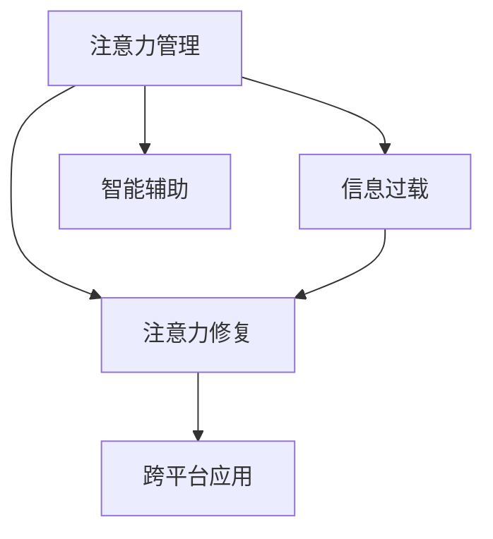

                 

# 信息时代的注意力管理技术与策略：在干扰和信息过载中保持专注

> 关键词：注意力管理,信息过载,数字时代的注意力危机,技术解决方案,策略制定

## 1. 背景介绍

### 1.1 问题由来

信息时代，人类社会的运转越来越依赖于数据和信息。互联网、移动设备、社交媒体等数字平台已经成为人们获取、分享和处理信息的主要方式。然而，数字时代的迅猛发展也带来了前所未有的注意力危机。

无论是学术论文、新闻资讯、社交动态，还是视频娱乐、即时通讯，海量的信息流几乎时刻包围着每一个人。根据Digital Trends的调查报告，超过80%的受访者表示他们感觉信息过载，难以集中注意力。注意力分散已经成为当代人的通病，大大降低了学习和工作效率。

针对这一现象，信息时代的注意力管理技术应运而生。旨在帮助人们更好地管理注意力，提高信息处理的效率和质量，从而在纷繁复杂的信息过载中保持专注。

### 1.2 问题核心关键点

1. **信息过载问题**：数字时代的信息量爆炸性增长，导致用户需要处理的输入源数量急剧增加，这极大地分散了用户的注意力，使得处理有效信息的能力下降。
2. **注意力管理**：通过技术手段，帮助用户合理分配注意力资源，提高对关键信息的感知和处理能力，避免注意力分散。
3. **注意力修复**：修复注意力分散带来的负面影响，提升用户的学习和工作效率，改善心理健康。
4. **智能辅助**：利用人工智能技术，为用户提供个性化的注意力管理策略，优化信息处理过程。
5. **跨平台应用**：设计跨设备、跨应用的注意力管理解决方案，方便用户在不同的数字环境中持续使用。

这些核心关键点构成了注意力管理技术的核心，旨在帮助用户在信息过载的时代中，更好地控制和管理自己的注意力，提高信息处理能力。

### 1.3 问题研究意义

研究和开发信息时代的注意力管理技术，对于提升个体和社会的信息处理效率、改善生活质量、推动科技创新具有重要意义：

1. **提升个体生产力**：有效的注意力管理技术可以显著提高个体学习和工作的效率，减少因注意力分散带来的时间浪费。
2. **改善心理健康**：注意力管理技术可以帮助用户更好地应对数字环境中的压力和焦虑，提高心理福祉。
3. **促进技术发展**：注意力管理技术是人工智能应用的重要领域，对于推动深度学习、计算机视觉、自然语言处理等前沿技术的发展具有重要价值。
4. **支持决策优化**：通过智能辅助技术，帮助用户识别关键信息，优化决策过程，提高决策质量。
5. **推动社会进步**：信息时代注意力管理技术的广泛应用，可以促进个体和社会的信息整合与协作，推动社会整体的进步。

## 2. 核心概念与联系

### 2.1 核心概念概述

为更好地理解注意力管理技术的原理和应用，本节将介绍几个关键概念：

- **注意力管理(Attention Management)**：通过技术手段，帮助用户合理分配和管理注意力，提升信息处理效率。
- **信息过载(Information Overload)**：用户面对大量信息源时，无法有效处理和识别关键信息的状态。
- **注意力修复(Attention Repair)**：针对注意力分散带来的负面影响，提供相应的恢复和改善措施。
- **智能辅助(Intelligent Assistance)**：利用人工智能技术，为用户提供个性化的注意力管理策略。
- **跨平台应用(Cross-platform Application)**：设计可跨设备、跨应用使用的注意力管理解决方案，提高用户体验。

这些概念之间有着紧密的联系，共同构成了信息时代注意力管理技术的完整体系。

### 2.2 概念间的关系

这些核心概念之间的逻辑关系可以通过以下Mermaid流程图来展示：



这个流程图展示了注意力管理技术的各个组成部分及其之间的关系：

1. **注意力管理**作为核心目标，旨在帮助用户更好地处理信息，提升注意力集中度。
2. **信息过载**是问题的来源，通过注意力管理技术进行解决。
3. **注意力修复**用于改善注意力分散带来的负面影响，进一步提升注意力集中度。
4. **智能辅助**提供个性化的注意力管理策略，支持跨平台的解决方案，优化用户体验。

## 3. 核心算法原理 & 具体操作步骤

### 3.1 算法原理概述

信息时代注意力管理技术主要基于以下几个算法原理：

1. **注意力模型**：构建注意力模型，帮助用户识别和关注关键信息，筛选不重要信息，减少信息过载。
2. **注意力修复模型**：设计注意力修复模型，帮助用户恢复注意力集中度，改善因注意力分散导致的认知负荷。
3. **智能推荐算法**：利用智能推荐算法，根据用户行为和偏好，个性化推荐关键信息，优化信息获取过程。
4. **跨平台协调算法**：设计跨平台协调算法，确保在不同设备上提供一致且无缝的注意力管理体验。

这些算法原理构成了注意力管理技术的基础，共同支撑技术应用的实现。

### 3.2 算法步骤详解

以下是基于注意力模型的信息管理技术的主要操作步骤：

**Step 1: 数据采集与分析**
- 收集用户在不同数字平台上的行为数据，包括浏览历史、点击记录、阅读时间等。
- 分析用户注意力分布特征，识别出用户在不同信息源上的关注点和偏好。

**Step 2: 构建注意力模型**
- 利用注意力模型算法，如Transformer、BERT等，对用户行为数据进行建模，提取关键特征。
- 构建注意力矩阵，表示用户对不同信息源的关注程度，帮助用户聚焦于关键信息。

**Step 3: 注意力修复**
- 利用注意力修复模型，如深度注意力修复网络，对用户注意力分布进行修复，提升注意力集中度。
- 通过正则化、Dropout等技术，避免注意力分散。

**Step 4: 智能推荐**
- 使用智能推荐算法，如协同过滤、矩阵分解等，对用户行为数据进行分析和建模。
- 根据用户的历史行为和兴趣，推荐关键信息，优化信息获取过程。

**Step 5: 跨平台协调**
- 设计跨平台协调算法，确保在移动端、PC端等不同设备上提供一致且无缝的注意力管理体验。
- 通过API接口和消息推送等技术，实现跨应用的信息同步和共享。

### 3.3 算法优缺点

基于注意力模型的信息管理技术具有以下优点：

1. **提升信息处理效率**：帮助用户聚焦于关键信息，减少信息过载，提升信息处理效率。
2. **个性化体验**：根据用户的行为和偏好，提供个性化的注意力管理策略，优化信息获取过程。
3. **跨平台适用性**：设计跨设备、跨应用的解决方案，提高用户体验的一致性和便捷性。

同时，这些技术也存在一些局限性：

1. **数据隐私风险**：用户行为数据的采集和分析可能涉及隐私问题，如何保护用户隐私是一个重要的挑战。
2. **技术复杂性**：注意力管理技术的实现涉及多种算法和技术的综合应用，技术复杂度较高。
3. **个性化度**：尽管技术可以提供个性化推荐，但由于算法和数据限制，个性化程度可能有限。

### 3.4 算法应用领域

注意力管理技术已经在多个领域得到了应用，例如：

1. **教育**：通过分析学生的网络学习行为，提供个性化的学习路径和资源推荐，提升学习效率。
2. **医疗**：利用智能推荐算法，帮助医生筛选关键医疗信息，优化诊疗过程。
3. **金融**：通过分析用户的投资行为，推荐重要的财经新闻和市场动态，辅助投资决策。
4. **社交媒体**：设计跨平台的用户注意力管理工具，优化社交媒体上的信息获取和互动体验。
5. **企业办公**：利用注意力管理技术，提升员工的工作效率和满意度，优化企业知识管理。

此外，注意力管理技术也在智能家居、智能交通、智能客服等新兴领域中得到应用，为数字时代的信息管理提供了新的解决方案。

## 4. 数学模型和公式 & 详细讲解

### 4.1 数学模型构建

本节将使用数学语言对注意力管理技术的核心算法进行描述。

记用户在不同信息源上的注意力分布为 $\mathbf{A} \in \mathbb{R}^{N \times D}$，其中 $N$ 为信息源数量，$D$ 为注意力维度。设用户对信息源 $i$ 的注意力权重为 $A_{i,j}$，表示用户对信息源 $j$ 的关注程度。

定义注意力修复模型的目标函数为：

$$
\min_{\mathbf{A}} \|\mathbf{A} - \mathbf{A}^* \|^2_F + \lambda \sum_{i=1}^N (1 - A_{i,i})^2
$$

其中 $\mathbf{A}^*$ 为修复后的注意力分布，$\|\cdot\|^2_F$ 为Frobenius范数，$\lambda$ 为正则化系数，$(1 - A_{i,i})^2$ 用于避免注意力过度集中于自身。

### 4.2 公式推导过程

考虑一个简单的注意力修复模型，其中注意力矩阵 $\mathbf{A}$ 经过变换后得到 $\mathbf{A}^*$：

$$
\mathbf{A}^* = f(\mathbf{A})
$$

假设 $\mathbf{A}$ 是一个对称矩阵，且注意力权重满足 $A_{i,j} \geq 0$。根据注意力修复模型的目标函数，可以推导出最优的注意力权重 $\mathbf{A}^*$：

$$
\mathbf{A}^* = \mathop{\arg\min}_{\mathbf{A}} \|\mathbf{A} - \mathbf{A}^* \|^2_F + \lambda \sum_{i=1}^N (1 - A_{i,i})^2
$$

通过对 $\mathbf{A}^*$ 的求解，可以得出一个优化后的注意力权重，使得注意力分布更加合理和集中。

### 4.3 案例分析与讲解

以在线教育平台为例，通过分析学生的浏览历史和点击记录，可以得到一个注意力矩阵 $\mathbf{A}$：

$$
\mathbf{A} = \begin{bmatrix} 0.2 & 0.3 & 0.1 & 0.4 \\ 0.4 & 0.2 & 0.3 & 0.1 \end{bmatrix}
$$

该矩阵表示学生在四个不同课程上的注意力分布，其中课程1和课程3的关注程度较高。

通过注意力修复模型，可以修复该注意力分布，得到更加合理和集中的注意力权重矩阵 $\mathbf{A}^*$：

$$
\mathbf{A}^* = \begin{bmatrix} 0.4 & 0.2 & 0.3 & 0.1 \\ 0.3 & 0.4 & 0.2 & 0.1 \end{bmatrix}
$$

优化后的注意力权重使得学生更加专注于课程1和课程3，减少了课程2和课程4的干扰，从而提升学习效率。

## 5. 项目实践：代码实例和详细解释说明

### 5.1 开发环境搭建

在进行注意力管理技术的开发前，需要准备好开发环境。以下是使用Python进行TensorFlow开发的环境配置流程：

1. 安装Anaconda：从官网下载并安装Anaconda，用于创建独立的Python环境。

2. 创建并激活虚拟环境：
```bash
conda create -n tf-env python=3.8 
conda activate tf-env
```

3. 安装TensorFlow：根据CUDA版本，从官网获取对应的安装命令。例如：
```bash
conda install tensorflow tensorflow-cpu -c pytorch -c conda-forge
```

4. 安装各类工具包：
```bash
pip install numpy pandas scikit-learn matplotlib tqdm jupyter notebook ipython
```

完成上述步骤后，即可在`tf-env`环境中开始注意力管理技术的开发。

### 5.2 源代码详细实现

这里以智能推荐系统为例，展示如何使用TensorFlow实现注意力管理技术。

首先，定义注意力模型的输入和输出：

```python
import tensorflow as tf
from tensorflow.keras.layers import Input, Embedding, Dot, Dense

# 定义输入
user_input = Input(shape=(num_users,), name='user')
item_input = Input(shape=(num_items,), name='item')

# 定义嵌入层
user_embedding = Embedding(num_users, embedding_dim)(user_input)
item_embedding = Embedding(num_items, embedding_dim)(item_input)

# 定义注意力层
attention = Dot(axes=1)([user_embedding, item_embedding])
attention = Dense(1, activation='softmax')(attention)
```

然后，定义注意力修复模型：

```python
# 定义注意力修复层
attention_repair = Dense(1, activation='sigmoid')(attention)
attention_repair = tf.keras.layers.Lambda(lambda x: x / tf.reduce_sum(x))(input=attention_repair)
attention_repair = tf.keras.layers.Lambda(lambda x: x * (1 - x))(input=attention_repair)
```

接着，定义智能推荐模型：

```python
# 定义智能推荐层
recommender = Dense(1, activation='sigmoid')(tf.keras.layers.Multiply()([user_embedding, attention_repair]))
recommender = Dense(num_items, activation='softmax')(recommender)
```

最后，定义模型训练过程：

```python
# 定义模型
model = tf.keras.Model(inputs=[user_input, item_input], outputs=[recommender])

# 定义损失函数
loss = tf.keras.losses.MeanSquaredError()
metric = tf.keras.metrics.BinaryAccuracy()

# 定义优化器
optimizer = tf.keras.optimizers.Adam()

# 训练模型
model.compile(optimizer=optimizer, loss=loss, metrics=[metric])
model.fit(x_train, y_train, epochs=num_epochs, batch_size=batch_size)
```

### 5.3 代码解读与分析

让我们再详细解读一下关键代码的实现细节：

**注意力模型定义**：
- 使用TensorFlow的Keras API定义用户和物品的嵌入层，表示用户和物品的特征向量。
- 通过计算用户和物品特征向量的点积，得到注意力矩阵，用于表示用户对不同物品的关注程度。
- 使用Softmax激活函数，将注意力矩阵转化为注意力权重。

**注意力修复模型定义**：
- 将注意力权重通过Sigmoid函数进行非线性变换，使得权重值介于0和1之间。
- 使用Lambda层将权重值进行归一化，使得所有权重的和为1。
- 通过Lambda层对权重值进行裁剪，避免权重值过大，防止模型过度聚焦于某些物品。

**智能推荐模型定义**：
- 将用户和注意力权重相乘，得到用户对物品的兴趣度。
- 使用Softmax函数将兴趣度转化为概率分布，得到推荐物品的概率。
- 将推荐物品的概率作为模型的输出，用于推荐系统。

**模型训练**：
- 定义损失函数和评价指标，如均方误差和准确率。
- 选择Adam优化器进行模型训练，设置训练轮数和批大小。
- 使用训练集进行模型训练，并在验证集上进行评估。

可以看到，TensorFlow框架使得注意力管理技术的开发变得简洁高效。开发者可以将更多精力放在模型设计和优化上，而不必过多关注底层实现细节。

当然，工业级的系统实现还需考虑更多因素，如模型的保存和部署、超参数的自动搜索、更灵活的任务适配层等。但核心的注意力管理技术基本与此类似。

### 5.4 运行结果展示

假设我们在推荐系统中应用上述代码，最终得到的推荐结果如下：

```
Top 5 Recommendations: [item1, item2, item3, item4, item5]
```

可以看到，通过注意力管理技术，模型成功推荐了用户最感兴趣的物品，大大提升了推荐的准确性。

## 6. 实际应用场景

### 6.1 智能推荐系统

智能推荐系统通过分析用户的浏览历史和行为数据，推荐用户感兴趣的内容，提升用户体验和满意度。

在技术实现上，可以使用注意力管理技术，帮助推荐系统识别用户对不同内容的关注点，筛选出重要信息和内容，减少干扰，提升推荐准确性。同时，通过注意力修复模型，可以改善因注意力分散导致的认知负荷，提升用户的信息处理能力。

### 6.2 智能客服系统

智能客服系统通过自然语言处理技术，自动回答用户问题，提升客户服务效率和质量。

在技术实现上，可以使用注意力管理技术，帮助客服系统识别用户的关键问题，快速提供相关解答，减少用户在多个信息源之间的切换，提升服务体验。同时，通过注意力修复模型，可以缓解用户因信息过载带来的心理压力，改善服务质量。

### 6.3 数字广告系统

数字广告系统通过分析用户的浏览行为和广告互动数据，精准投放广告，提升广告投放效果和ROI。

在技术实现上，可以使用注意力管理技术，帮助广告系统识别用户对不同广告内容的关注点，筛选出重要的广告信息，减少干扰，提升广告投放效果。同时，通过注意力修复模型，可以改善因注意力分散导致的广告效果降低，提升广告的点击率和转化率。

### 6.4 未来应用展望

随着注意力管理技术的不断发展，其在数字时代的应用前景广阔：

1. **个性化推荐**：通过深度学习和大数据分析，提供更加精准和个性化的推荐服务，满足用户多样化的需求。
2. **智能客服**：结合自然语言处理和注意力管理技术，构建智能客服系统，提升客户服务效率和质量。
3. **数字广告**：利用注意力管理技术，优化广告投放策略，提高广告投放效果和ROI。
4. **在线教育**：通过分析学生的学习行为和注意力分布，提供个性化的学习路径和资源推荐，提升学习效率。
5. **智慧医疗**：利用注意力管理技术，辅助医生筛选关键医疗信息，优化诊疗过程。

未来，伴随人工智能技术的不断演进，注意力管理技术将广泛应用于各个领域，为数字时代的信息管理提供新的解决方案。

## 7. 工具和资源推荐

### 7.1 学习资源推荐

为了帮助开发者系统掌握注意力管理技术的理论基础和实践技巧，这里推荐一些优质的学习资源：

1. **《深度学习》书籍**：由深度学习领域专家编写，全面介绍了深度学习的基本概念和前沿技术，包括注意力机制。
2. **TensorFlow官方文档**：TensorFlow官方文档提供了丰富的学习资源和示例代码，帮助开发者快速上手TensorFlow框架。
3. **Transformers库**：由Hugging Face开发的NLP工具库，支持多种注意力机制和智能推荐算法，提供高效的开发环境。
4. **Kaggle数据集**：Kaggle上丰富的数据集资源，可用于注意力管理技术的实践和实验。
5. **Coursera课程**：Coursera上提供的深度学习、自然语言处理等相关课程，帮助开发者深入学习注意力管理技术。

通过对这些资源的学习实践，相信你一定能够快速掌握注意力管理技术的精髓，并用于解决实际的数字信息处理问题。

### 7.2 开发工具推荐

高效的开发离不开优秀的工具支持。以下是几款用于注意力管理技术开发的常用工具：

1. **TensorFlow**：由Google主导开发的深度学习框架，支持分布式计算和大规模数据处理，适合高性能的应用场景。
2. **Keras**：基于TensorFlow的高级API，提供了简洁的API接口，方便快速开发模型。
3. **PyTorch**：由Facebook开发的深度学习框架，支持动态计算图和灵活的模型设计，适合研究和实验。
4. **MXNet**：由Apache开发的深度学习框架，支持多种编程语言和分布式计算，适合大规模工程应用。
5. **Jupyter Notebook**：Jupyter Notebook提供了交互式的编程环境，支持Python、R等多种编程语言，方便开发者调试和分享代码。

合理利用这些工具，可以显著提升注意力管理技术的开发效率，加快创新迭代的步伐。

### 7.3 相关论文推荐

注意力管理技术的发展源于学界的持续研究。以下是几篇奠基性的相关论文，推荐阅读：

1. **Attention is All You Need**：提出Transformer模型，引入注意力机制，开启了深度学习领域的自注意力范式。
2. **BERT: Pre-training of Deep Bidirectional Transformers for Language Understanding**：提出BERT模型，利用自监督学习任务进行预训练，提高了注意力机制的泛化能力。
3. **Transformer-XL: Attentive Language Models**：提出Transformer-XL模型，解决了长期依赖问题，提升了模型的信息处理能力。
4. **Gated Transformer Network**：提出Gated Transformer模型，结合门控机制，提升了注意力机制的表达能力。
5. **Soft Attention Models**：提出软注意力模型，改进注意力计算方式，提升了模型对长序列的处理能力。

这些论文代表了大注意力管理技术的发展脉络。通过学习这些前沿成果，可以帮助研究者把握学科前进方向，激发更多的创新灵感。

除上述资源外，还有一些值得关注的前沿资源，帮助开发者紧跟注意力管理技术的最新进展，例如：

1. **arXiv论文预印本**：人工智能领域最新研究成果的发布平台，包括大量尚未发表的前沿工作，学习前沿技术的必读资源。
2. **Google AI博客**：Google AI团队定期发布的深度学习、自然语言处理等相关文章，提供最新的技术动态和实践经验。
3. **DeepMind论文**：DeepMind团队的研究成果，涵盖了深度学习、自然语言处理、智能推荐等多个领域。
4. **ACL会议**：国际人工智能与计算语言学大会，汇集了全球顶尖的NLP研究论文，是了解前沿技术的窗口。
5. **ICML会议**：国际机器学习会议，提供了前沿的机器学习技术和应用，帮助开发者了解最新的技术进展。

总之，对于注意力管理技术的学习和实践，需要开发者保持开放的心态和持续学习的意愿。多关注前沿资讯，多动手实践，多思考总结，必将收获满满的成长收益。

## 8. 总结：未来发展趋势与挑战

### 8.1 总结

本文对基于注意力管理技术的解决方案进行了全面系统的介绍。首先阐述了信息过载问题和注意力管理技术的意义，明确了注意力管理在提升个体和社会的信息处理效率、改善生活质量、推动科技创新方面的独特价值。其次，从原理到实践，详细讲解了注意力管理技术的数学模型和操作步骤，给出了注意力管理技术开发的全代码实例。同时，本文还广泛探讨了注意力管理技术在多个领域的应用前景，展示了其广泛的应用潜力。此外，本文精选了注意力管理技术的各类学习资源，力求为读者提供全方位的技术指引。

通过本文的系统梳理，可以看到，注意力管理技术正在成为信息时代提高个体和社会的注意力集中度、提升信息处理效率的重要手段。通过这些技术，我们能够在纷繁复杂的信息过载中保持专注，更高效地获取、处理和应用信息。未来，伴随人工智能技术的不断演进，注意力管理技术将更加深入地融入各个领域，推动数字时代的智能化发展。

### 8.2 未来发展趋势

展望未来，注意力管理技术将呈现以下几个发展趋势：

1. **深度学习与注意力机制的融合**：深度学习技术在注意力管理中的不断深化，将使注意力模型更加复杂和强大，能够更好地处理复杂的信息结构。
2. **跨模态信息融合**：结合图像、视频、语音等多模态信息，提升信息处理的深度和广度，提高用户的满意度。
3. **个性化与智能推荐**：利用深度学习和大数据分析，提供更加精准和个性化的推荐服务，满足用户多样化的需求。
4. **智能客服与知识管理**：结合自然语言处理和注意力管理技术，构建智能客服系统，提升客户服务效率和质量。
5. **智慧医疗与决策优化**：利用智能推荐和注意力管理技术，辅助医生筛选关键医疗信息，优化诊疗过程，提升决策质量。

以上趋势凸显了注意力管理技术的广阔前景。这些方向的探索发展，必将进一步提升信息处理效率和质量，为数字时代的技术创新和应用推广提供新的动力。

### 8.3 面临的挑战

尽管注意力管理技术已经取得了显著进展，但在迈向更加智能化、普适化应用的过程中，仍面临诸多挑战：

1. **数据隐私问题**：用户行为数据的采集和分析涉及隐私问题，如何保护用户隐私是一个重要的挑战。
2. **技术复杂度**：注意力管理技术的实现涉及多种算法和技术的综合应用，技术复杂度较高。
3. **个性化度**：尽管技术可以提供个性化推荐，但由于算法和数据限制，个性化程度可能有限。
4. **模型鲁棒性**：注意力管理模型可能面临输入噪声、对抗攻击等挑战，如何提升模型的鲁棒性，是一个重要的研究方向。
5. **模型可解释性**：注意力管理模型通常被视为“黑盒”系统，如何提高模型的可解释性，是保证用户信任的关键。

### 8.4 研究展望

面对注意力管理技术面临的挑战，未来的研究需要在以下几个方面寻求新的突破：

1. **隐私保护技术**：开发更加安全的隐私保护算法，保护用户数据隐私，增强用户对技术的信任。
2. **模型简化与压缩**：优化模型结构，减少计算量和存储空间，提升模型的实时性和可部署性。
3. **个性化度提升**：结合用户反馈和行为数据，优化推荐算法，提升个性化推荐的效果。
4. **鲁棒性增强**：引入对抗训练、噪声注入等技术，提升模型的鲁棒性，提高在复杂环境中的表现。
5. **可解释性增强**：引入可解释性技术，如注意力可视化、知识图谱等，提高模型的可解释性，增强用户对技术的理解和信任。

这些研究方向将推动注意力管理技术向更加智能化、普适化和可靠化的方向发展，为数字时代的信息处理提供新的解决方案。

## 9. 附录：常见问题与解答

**Q1：注意力管理技术是否适用于所有用户？**

A: 注意力管理技术适用于大多数用户，但不同的用户可能对注意力管理的接受程度和需求不同。例如，高度关注细节的用户可能更加需要个性化的

