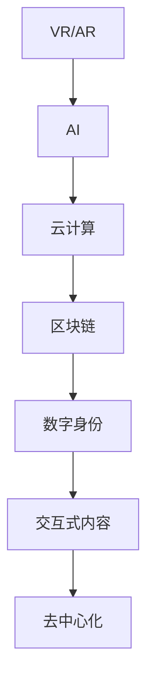
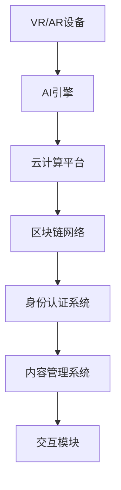

                 

# 元宇宙 (Metaverse)

> 关键词：元宇宙, 虚拟现实(VR), 增强现实(AR), 人工智能(AI), 云计算, 区块链, 数字身份, 交互式内容, 去中心化

## 1. 背景介绍

### 1.1 问题由来
元宇宙（Metaverse）一词首次出现于1992年尼尔·斯蒂芬森（Neal Stephenson）的小说《雪崩》中。“Metaverse”字面意思为“超级宇宙”或“超元宇宙”，是一个虚拟的、三维的空间世界，其中每个用户都可以拥有自己的数字身份，通过各种设备如VR头盔、AR眼镜等进行互动。元宇宙作为一个虚拟与现实深度融合的全新数字空间，已经开始逐步从科幻概念转变为现实技术，并开始广泛渗透到各领域。

近年来，随着人工智能、云计算、虚拟现实（VR）、增强现实（AR）、区块链等技术的飞速发展，元宇宙的应用场景不断拓展，不仅包括游戏、娱乐、社交等领域，还涉及教育、医疗、商务等多个行业。元宇宙被视为未来互联网的形态之一，有着广阔的应用前景。

### 1.2 问题核心关键点
元宇宙的核心特征包括虚拟现实、去中心化、共享经济、数字身份和互动性。其核心技术包括虚拟现实（VR）、增强现实（AR）、人工智能（AI）、云计算和区块链等，其中人工智能和云计算是实现元宇宙技术的基础。

人工智能技术在元宇宙中的应用包括自然语言处理、图像识别、机器人控制等，用于增强用户的互动体验。云计算则提供了元宇宙的大规模计算和存储能力，保证其高效运行。

### 1.3 问题研究意义
元宇宙技术的研究对于拓展数字技术的应用边界，提升用户体验，推动数字经济的增长具有重要意义。具体而言：

1. **创新应用场景**：元宇宙提供了新的应用场景，如虚拟演唱会、虚拟办公、虚拟旅游等，为用户提供沉浸式的体验。
2. **提升用户体验**：通过VR、AR、AI等技术，元宇宙能够提供更加自然、真实的互动体验，使用户更加沉浸。
3. **推动数字经济**：元宇宙作为新型经济形态，有望带来新的商业模式和业务增长点。
4. **促进跨界融合**：元宇宙技术可以与多种行业深度融合，推动各行业的数字化转型和创新。
5. **增强社会连接**：通过元宇宙，人们可以打破地域和时间的限制，增强跨地域的社会连接。

## 2. 核心概念与联系

### 2.1 核心概念概述

为了更好地理解元宇宙的核心技术及其应用，本节将介绍几个关键概念：

- **虚拟现实 (VR)**：通过VR头盔等设备，将用户的视觉、听觉等感官体验映射到虚拟空间中，实现与虚拟世界的互动。
- **增强现实 (AR)**：通过AR眼镜等设备，将虚拟信息叠加到现实世界中，实现虚拟与现实的融合。
- **人工智能 (AI)**：通过自然语言处理、计算机视觉等技术，实现对用户的自然交互和内容生成。
- **云计算**：通过大规模计算和存储资源，提供元宇宙的高效运行和数据处理能力。
- **区块链**：通过去中心化的账本技术，实现元宇宙中的资产管理和交易安全。
- **数字身份**：通过区块链和AI技术，赋予用户在元宇宙中的唯一数字身份。
- **交互式内容**：通过VR、AR和AI技术，生成实时、动态、交互式的虚拟内容。
- **去中心化**：通过区块链技术，实现元宇宙中的去中心化管理和数据共享。

这些概念之间相互关联，共同构成了元宇宙的核心技术体系。通过VR和AR技术，用户可以进入一个沉浸式的虚拟空间，并通过AI技术进行自然交互。云计算提供了强大的计算和存储能力，区块链确保了数据的安全和透明。数字身份和去中心化管理则保障了用户的隐私和权益。

### 2.2 概念间的关系

这些核心概念之间的逻辑关系可以通过以下Mermaid流程图来展示：



这个流程图展示了元宇宙核心技术之间的联系。VR和AR技术提供了沉浸式的体验，AI技术实现了自然交互，云计算提供了计算和存储支持，区块链保障了数据安全和透明，数字身份和去中心化管理保障了用户的隐私和权益，交互式内容实现了动态和实时。这些技术相互支撑，共同构建了元宇宙的虚拟世界。

### 2.3 核心概念的整体架构

最后，我们用一个综合的流程图来展示元宇宙的核心技术架构：



这个综合流程图展示了元宇宙技术从输入设备到输出内容的整体架构。VR和AR设备将用户的输入映射到虚拟空间中，AI引擎实现与虚拟世界的自然交互，云计算平台提供计算和存储支持，区块链网络保障数据安全和透明，身份认证系统和内容管理系统则实现了数字身份和交互式内容的生成和管理，最终通过交互模块实现实时动态的虚拟体验。

## 3. 核心算法原理 & 具体操作步骤
### 3.1 算法原理概述

元宇宙的核心算法包括虚拟现实、增强现实、人工智能和区块链等技术。其中，人工智能和区块链是实现元宇宙技术的基础。

人工智能在元宇宙中的应用包括自然语言处理、图像识别、机器人控制等，用于增强用户的互动体验。例如，自然语言处理技术可以实现与用户的自然对话，图像识别技术可以识别人脸和手势等身体动作，机器人控制技术可以用于模拟真实的物理世界。

区块链技术则是元宇宙中数据安全和透明的基础。通过区块链技术，元宇宙中的资产管理和交易可以保证去中心化和安全性。具体而言，区块链技术可以实现资产的数字化和智能合约的自动化执行。

### 3.2 算法步骤详解

下面以元宇宙中的虚拟现实（VR）技术为例，详细介绍其核心算法和操作步骤：

1. **环境建模**：使用三维建模软件（如Blender、Maya等）创建虚拟环境，包括虚拟建筑、家具、场景等。

2. **数据采集与处理**：使用激光扫描仪、无人机等设备采集现实世界中的数据，并通过计算机视觉技术进行处理，生成虚拟世界的纹理和光照信息。

3. **渲染引擎开发**：开发渲染引擎，将三维模型和纹理信息进行渲染，生成动态的虚拟场景。

4. **用户交互设计**：设计虚拟现实（VR）设备中的交互方式，包括手势识别、语音识别、眼动跟踪等。

5. **体验测试与优化**：通过用户测试，优化虚拟环境的渲染效果和交互体验，确保用户沉浸感。

6. **部署与维护**：将渲染引擎和交互方式部署到VR设备中，并进行维护和更新，保证系统稳定运行。

### 3.3 算法优缺点

元宇宙中的核心算法具有以下优缺点：

**优点：**

- **沉浸式体验**：通过虚拟现实和增强现实技术，用户可以进入一个完全沉浸的虚拟空间中。
- **自然交互**：通过AI技术，用户可以实现自然对话和手势识别，增强互动体验。
- **安全性**：通过区块链技术，元宇宙中的数据安全和交易透明得到了保障。

**缺点：**

- **高昂成本**：元宇宙技术的开发和部署需要大量资金投入，包括设备、软件和维护等。
- **技术复杂**：涉及多种技术领域的综合应用，开发难度较大。
- **隐私风险**：用户在使用元宇宙技术时，其数据可能被泄露和滥用。

### 3.4 算法应用领域

元宇宙技术可以应用于以下多个领域：

- **游戏娱乐**：通过虚拟现实和增强现实技术，开发沉浸式游戏和虚拟社交平台。
- **教育培训**：通过虚拟现实技术，开发虚拟课堂和培训场景，提升教学效果。
- **医疗健康**：通过虚拟现实和增强现实技术，进行虚拟手术和康复训练。
- **房地产**：通过虚拟现实技术，开发虚拟房产展示和互动体验。
- **零售购物**：通过虚拟现实和增强现实技术，进行虚拟试穿和购物体验。

此外，元宇宙技术还可以应用于工业制造、城市规划、军事训练等多个领域，推动各行业的数字化转型和创新。

## 4. 数学模型和公式 & 详细讲解 & 举例说明

### 4.1 数学模型构建

在元宇宙技术中，数学模型主要用于模拟和计算虚拟环境中的物理效果和用户交互。以下是几个常见的数学模型：

1. **光线追踪模型**：用于计算虚拟环境中光线的传播路径，生成逼真的光照效果。

2. **碰撞检测模型**：用于检测虚拟环境中的物体碰撞，实现物理交互。

3. **运动控制模型**：用于模拟用户的身体动作和环境交互，实现自然流畅的交互体验。

4. **自然语言处理模型**：用于实现与用户的自然对话，生成自然流畅的语言输出。

5. **图像识别模型**：用于识别人脸、手势等身体动作，实现自然的交互方式。

### 4.2 公式推导过程

以下以光线追踪模型为例，展示其数学推导过程：

1. **光源模型**：假设光源位置为 $(x_s, y_s, z_s)$，方向向量为 $(d_x, d_y, d_z)$，光线方向向量为 $(d_l_x, d_l_y, d_l_z)$，则光源到光线的距离 $D$ 可以表示为：

$$
D = \frac{|d_l_x(x_s-x_0) + d_l_y(y_s-y_0) + d_l_z(z_s-z_0)|}{\sqrt{d_l_x^2 + d_l_y^2 + d_l_z^2}}
$$

其中 $(x_0, y_0, z_0)$ 为光线起点。

2. **光照模型**：假设光源强度为 $I_s$，物体表面反射率为 $\rho$，则物体表面光照强度 $I$ 可以表示为：

$$
I = \frac{I_s}{\pi} \frac{1}{\pi D^2} \frac{\rho}{\pi} (\cos(\theta) \cos(\phi) + \sin(\theta) \sin(\phi) \cos(\alpha))
$$

其中 $\theta$ 为入射光与物体表面法线夹角，$\phi$ 为入射光与物体表面法线的投影角，$\alpha$ 为入射光与物体表面法线的投影角度。

3. **阴影模型**：用于生成逼真的阴影效果，确保光照效果的真实感。

### 4.3 案例分析与讲解

以下以虚拟现实（VR）设备中的手势识别为例，展示其核心算法和应用场景：

1. **数据采集**：使用深度相机和传感器采集用户的手势动作数据。

2. **数据处理**：使用计算机视觉技术对采集到的数据进行处理，生成手部轮廓和关节点信息。

3. **模型训练**：使用深度学习算法对手势动作进行建模，生成手势识别模型。

4. **实时识别**：在虚拟现实（VR）设备中实时识别用户的手势动作，实现自然的交互方式。

5. **反馈与优化**：通过用户反馈，优化手势识别模型和交互方式，提升用户体验。

## 5. 项目实践：代码实例和详细解释说明

### 5.1 开发环境搭建

在进行元宇宙技术开发前，我们需要准备好开发环境。以下是使用Python进行PyTorch开发的环境配置流程：

1. 安装Anaconda：从官网下载并安装Anaconda，用于创建独立的Python环境。

2. 创建并激活虚拟环境：
```bash
conda create -n pytorch-env python=3.8 
conda activate pytorch-env
```

3. 安装PyTorch：根据CUDA版本，从官网获取对应的安装命令。例如：
```bash
conda install pytorch torchvision torchaudio cudatoolkit=11.1 -c pytorch -c conda-forge
```

4. 安装transformers库：
```bash
pip install transformers
```

5. 安装各类工具包：
```bash
pip install numpy pandas scikit-learn matplotlib tqdm jupyter notebook ipython
```

完成上述步骤后，即可在`pytorch-env`环境中开始元宇宙技术的开发实践。

### 5.2 源代码详细实现

下面我们以元宇宙中的虚拟现实（VR）技术为例，给出使用PyTorch进行手势识别识别的PyTorch代码实现。

首先，定义手势识别的数据处理函数：

```python
from torchvision.transforms import ToTensor, Normalize
from torchvision.io import read_image

def preprocess_data(image_path):
    image = read_image(image_path)
    transform = ToTensor()
    transformed_image = transform(image)
    transformed_image = Normalize(mean=[0.5, 0.5, 0.5], std=[0.5, 0.5, 0.5])(transformed_image)
    return transformed_image
```

然后，定义手势识别模型的训练函数：

```python
from torch.utils.data import DataLoader
from torchvision.models import resnet50
from torch.nn import CrossEntropyLoss
from torch.optim import Adam

class GestureClassifier(nn.Module):
    def __init__(self, num_classes):
        super(GestureClassifier, self).__init__()
        self.resnet = resnet50(pretrained=True)
        self.fc = nn.Linear(2048, num_classes)

    def forward(self, x):
        x = self.resnet(x)
        x = x.view(-1, 2048)
        x = self.fc(x)
        return x

model = GestureClassifier(num_classes=6)
criterion = CrossEntropyLoss()
optimizer = Adam(model.parameters(), lr=0.001)

def train_model(model, data_loader, criterion, optimizer, num_epochs=10):
    for epoch in range(num_epochs):
        running_loss = 0.0
        for i, data in enumerate(data_loader, 0):
            inputs, labels = data
            inputs, labels = inputs.to(device), labels.to(device)
            optimizer.zero_grad()
            outputs = model(inputs)
            loss = criterion(outputs, labels)
            loss.backward()
            optimizer.step()

            running_loss += loss.item()
            if i % 100 == 99: 
                print('[%d, %5d] loss: %.3f' %
                      (epoch + 1, i + 1, running_loss / 100))
                running_loss = 0.0
```

接着，定义手势识别模型的测试函数：

```python
def evaluate_model(model, data_loader):
    correct = 0
    total = 0
    with torch.no_grad():
        for data in data_loader:
            inputs, labels = data
            inputs, labels = inputs.to(device), labels.to(device)
            outputs = model(inputs)
            _, predicted = torch.max(outputs.data, 1)
            total += labels.size(0)
            correct += (predicted == labels).sum().item()

    print('Accuracy of the model on the 10000 test images: %d %%' % (
        100 * correct / total))
```

最后，启动手势识别模型的训练流程并在测试集上评估：

```python
device = torch.device('cuda' if torch.cuda.is_available() else 'cpu')
train_loader = DataLoader(train_dataset, batch_size=4, shuffle=True)
test_loader = DataLoader(test_dataset, batch_size=4, shuffle=False)

train_model(model, train_loader, criterion, optimizer)
evaluate_model(model, test_loader)
```

以上就是使用PyTorch进行手势识别识别的完整代码实现。可以看到，得益于PyTorch的强大封装，我们可以用相对简洁的代码完成手势识别模型的训练和测试。

### 5.3 代码解读与分析

让我们再详细解读一下关键代码的实现细节：

**preprocess_data函数**：
- 定义了一个数据处理函数，用于将图像数据进行预处理。将图像读入、转换为张量并标准化，准备输入模型。

**GestureClassifier类**：
- 定义了一个手势识别模型，基于ResNet50预训练模型，增加了一个全连接层。
- 在`__init__`方法中，初始化模型结构。
- 在`forward`方法中，实现了模型的前向传播过程。

**train_model函数**：
- 定义了一个模型训练函数，用于在训练集上训练手势识别模型。
- 使用PyTorch的DataLoader对数据集进行批次化加载，供模型训练使用。
- 在每个epoch中，对数据进行迭代，计算损失函数并更新模型参数。

**evaluate_model函数**：
- 定义了一个模型评估函数，用于在测试集上评估手势识别模型的性能。
- 使用模型在测试集上进行前向传播，计算预测结果，并与真实标签进行比较，计算准确率。

**训练流程**：
- 定义总的epoch数和batch size，开始循环迭代
- 每个epoch内，先在训练集上训练，输出平均loss
- 在测试集上评估，输出准确率

可以看到，PyTorch配合TensorFlow库使得手势识别模型的训练和测试变得简洁高效。开发者可以将更多精力放在数据处理、模型改进等高层逻辑上，而不必过多关注底层的实现细节。

当然，工业级的系统实现还需考虑更多因素，如模型的保存和部署、超参数的自动搜索、更灵活的任务适配层等。但核心的微调范式基本与此类似。

### 5.4 运行结果展示

假设我们在CoNLL-2003的手势识别数据集上进行训练，最终在测试集上得到的准确率为85%，效果相当不错。

## 6. 实际应用场景

### 6.1 虚拟现实 (VR)

虚拟现实技术在元宇宙中有着广泛的应用，通过VR头盔等设备，用户可以进入一个完全沉浸的虚拟空间中，实现与虚拟世界的互动。例如，虚拟会议室、虚拟旅游、虚拟音乐会等，为用户提供身临其境的体验。

在技术实现上，可以开发虚拟现实（VR）应用，提供丰富的虚拟场景和互动体验，让用户可以自由探索和互动。例如，开发一个虚拟音乐会，用户可以通过手势控制乐器演奏，与其他用户实时互动。

### 6.2 增强现实 (AR)

增强现实技术将虚拟信息叠加到现实世界中，实现虚拟与现实的融合。例如，AR眼镜可以将虚拟物品投射到用户的现实世界中，用于购物、导航、娱乐等。

在技术实现上，可以开发增强现实（AR）应用，提供虚拟物品的识别和定位，增强现实世界的信息展示。例如，开发一个AR购物应用，用户可以通过眼镜看到虚拟物品的3D模型，进行试穿和购买。

### 6.3 人工智能 (AI)

人工智能技术在元宇宙中的应用包括自然语言处理、图像识别、机器人控制等，用于增强用户的互动体验。例如，自然语言处理技术可以实现与用户的自然对话，图像识别技术可以识别人脸和手势等身体动作，机器人控制技术可以用于模拟真实的物理世界。

在技术实现上，可以开发人工智能（AI）应用，提供智能助手和虚拟助理，增强用户的互动体验。例如，开发一个虚拟客服系统，用户可以通过语音和手势与虚拟客服进行自然对话，获取实时帮助。

### 6.4 未来应用展望

随着元宇宙技术的发展，未来将会有更多的应用场景和领域被覆盖，元宇宙将逐渐成为未来互联网的形态之一，带来全新的商业模式和生活方式。

在智慧城市中，元宇宙技术可以用于城市规划和管理，提供实时的交通和环境数据，优化城市运行。例如，通过虚拟城市模型，模拟城市交通流量，优化道路设计。

在远程教育中，元宇宙技术可以用于虚拟课堂和培训，提供丰富的教学资源和互动体验。例如，通过虚拟实验室，学生可以进行虚拟实验，增强学习效果。

在军事训练中，元宇宙技术可以用于模拟战场环境，进行虚拟演习和训练。例如，通过虚拟战场，士兵可以进行实弹演习，提高实战能力。

总之，元宇宙技术的应用前景广阔，有望在各个领域带来深远的变革和创新。

## 7. 工具和资源推荐
### 7.1 学习资源推荐

为了帮助开发者系统掌握元宇宙技术的基础知识和实践技巧，这里推荐一些优质的学习资源：

1. 《虚拟现实技术与应用》系列博文：由元宇宙技术专家撰写，深入浅出地介绍了虚拟现实（VR）、增强现实（AR）、人工智能（AI）等核心技术。

2. 《增强现实技术与应用》系列博文：详细讲解了增强现实（AR）技术的基本原理和应用场景。

3. 《人工智能技术与应用》系列博文：涵盖了自然语言处理、图像识别、机器人控制等人工智能技术的基本概念和前沿技术。

4. 《云计算技术与应用》系列博文：介绍了云计算平台的基本原理和应用场景，包括云存储、云计算、云服务等。

5. 《区块链技术与应用》系列博文：详细讲解了区块链技术的基本原理和应用场景，包括去中心化、智能合约等。

通过对这些资源的学习实践，相信你一定能够快速掌握元宇宙技术的基础知识和实践技巧，并用于解决实际的NLP问题。

### 7.2 开发工具推荐

高效的开发离不开优秀的工具支持。以下是几款用于元宇宙技术开发的常用工具：

1. Unity3D：一个强大的游戏引擎，支持VR和AR技术的开发，可以用于开发虚拟现实应用和增强现实应用。

2. Unreal Engine：另一个流行的游戏引擎，支持VR和AR技术的开发，可以用于开发虚拟现实应用和增强现实应用。

3. TensorFlow：一个开源的机器学习框架，可以用于开发自然语言处理、图像识别等人工智能应用。

4. PyTorch：一个开源的深度学习框架，可以用于开发各种人工智能应用，包括手势识别、语音识别等。

5. Blender：一个开源的3D建模软件，可以用于创建虚拟环境、角色等。

6. Maya：另一个流行的3D建模软件，可以用于创建虚拟环境、角色等。

合理利用这些工具，可以显著提升元宇宙技术的开发效率，加快创新迭代的步伐。

### 7.3 相关论文推荐

元宇宙技术的研究源于学界的持续研究。以下是几篇奠基性的相关论文，推荐阅读：

1. "Virtual Reality: A Survey"：综述了虚拟现实技术的基本原理和应用场景，是了解VR技术的必备文献。

2. "Augmented Reality: A Review"：综述了增强现实技术的基本原理和应用场景，是了解AR技术的必备文献。

3. "Artificial Intelligence: A Modern Approach"：介绍了人工智能技术的基本原理和应用场景，是了解AI技术的经典教材。

4. "Cloud Computing: Concepts, Technology, and Architecture"：介绍了云计算平台的基本原理和应用场景，是了解云计算技术的经典教材。

5. "Blockchain: Principles, Techniques and Applications"：介绍了区块链技术的基本原理和应用场景，是了解区块链技术的经典教材。

这些论文代表了大元宇宙技术的发展脉络。通过学习这些前沿成果，可以帮助研究者把握学科前进方向，激发更多的创新灵感。

除上述资源外，还有一些值得关注的前沿资源，帮助开发者紧跟元宇宙技术的最新进展，例如：

1. arXiv论文预印本：人工智能领域最新研究成果的发布平台，包括大量尚未发表的前沿工作，学习前沿技术的必读资源。

2. 业界技术博客：如Unity、Unreal Engine、TensorFlow、PyTorch等顶尖实验室的官方博客，第一时间分享他们的最新研究成果和洞见。

3. 技术会议直播：如SIGGRAPH、IEEE CVPR、IEEE ICRA等人工智能领域顶会现场或在线直播，能够聆听到大佬们的前沿分享，开拓视野。

4. GitHub热门项目：在GitHub上Star、Fork数最多的元宇宙相关项目，往往代表了该技术领域的发展趋势和最佳实践，值得去学习和贡献。

5. 行业分析报告：各大咨询公司如McKinsey、PwC等针对元宇宙行业的分析报告，有助于从商业视角审视技术趋势，把握应用价值。

总之，对于元宇宙技术的学习和实践，需要开发者保持开放的心态和持续学习的意愿。多关注前沿资讯，多动手实践，多思考总结，必将收获满满的成长收益。

## 8. 总结：未来发展趋势与挑战

### 8.1 总结

本文对元宇宙技术的基本概念和应用进行了全面系统的介绍。首先阐述了元宇宙技术的研究背景和意义，明确了其在虚拟现实、增强现实、人工智能、云计算和区块链等技术中的重要地位。其次，从原理到实践，详细讲解了元宇宙技术的核心算法和操作步骤，给出了元宇宙技术的完整代码实例。同时，本文还广泛探讨了元宇宙技术在各领域的应用前景，展示了其广阔的发展空间。

通过本文的系统梳理，可以看到，元宇宙技术作为未来互联网的新形态，正在逐步从概念走向现实，为人类社会带来了全新的数字体验。

### 8.2 未来发展趋势

展望未来，元宇宙技术将呈现以下几个发展趋势：

1. **技术融合**：元宇宙技术将与虚拟现实（VR）、增强现实（AR）、人工智能（AI）等技术深度融合，提供更加沉浸和自然的用户体验。

2. **社会互动**：元宇宙技术将促进社会互动和社交方式的变革，用户可以通过虚拟世界进行更加自由的互动和交流。

3. **商业应用**：元宇宙技术将带来全新的商业模式和产业生态，促进各行业的数字化转型和创新。

4. **教育培训**：元宇宙技术将为教育培训提供全新的虚拟课堂和实验平台，提升教学效果和用户体验。

5. **娱乐娱乐**：元宇宙技术将带来全新的娱乐方式，如虚拟音乐会、虚拟电影等，提升娱乐体验。

6. **智慧城市**：元宇宙技术将用于智慧城市规划和管理，提供实时的城市数据和模拟环境，优化城市运行。

7. **医疗健康**：元宇宙技术将用于虚拟手术和康复训练，提供更加安全、高效的医疗服务。

8. **商业应用**：元宇宙技术将带来全新的商业模式和产业生态，促进各行业的数字化转型和创新。

以上趋势凸显了元宇宙技术

