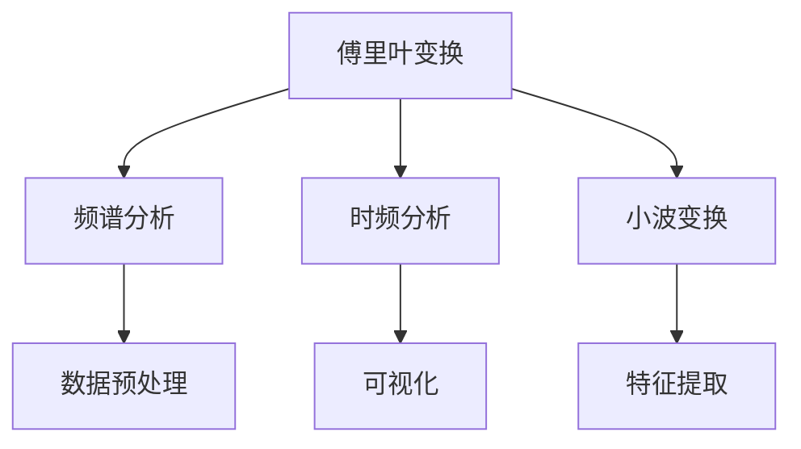
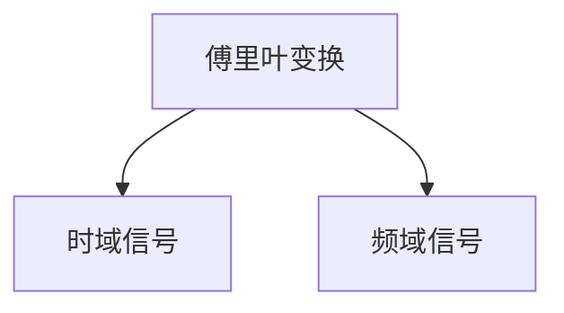
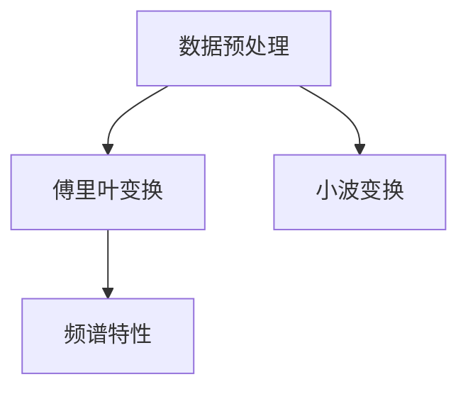
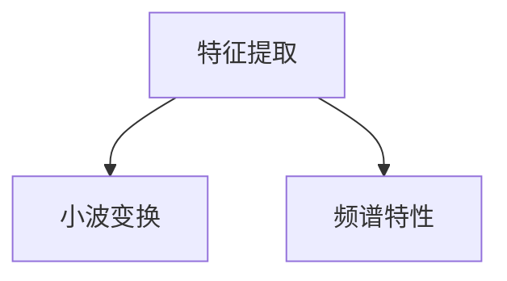
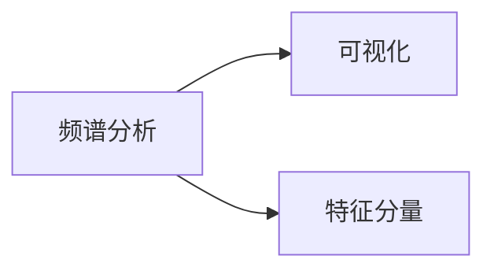
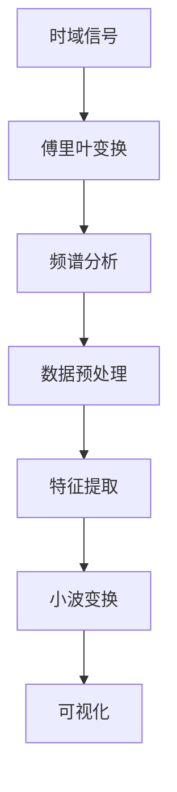

                 

# 光谱技术在AI for Science中的使用

## 1. 背景介绍

### 1.1 问题由来
随着人工智能（AI）技术的不断发展和深入应用，其在科学计算、数据分析、模拟仿真等领域的作用日益凸显。AI for Science（科学领域的AI应用）作为AI技术的重要分支，正在推动科学研究的范式变革，带来新的突破和机遇。在这一过程中，光谱技术的应用显得尤为重要，它通过高效的数据分析和可视化，显著提升了AI在科学领域的表现和应用效果。

### 1.2 问题核心关键点
光谱技术，也称作频谱分析，是指通过傅里叶变换、小波变换等数学工具，将信号或数据分解为不同频率或尺度的分量，揭示数据的内在结构与特征。在AI for Science中，光谱技术主要应用于数据预处理、特征提取、可视化等多个环节，帮助科学家更准确、更高效地进行数据分析和模型训练。

## 2. 核心概念与联系

### 2.1 核心概念概述
为更好地理解光谱技术在AI for Science中的应用，本节将介绍几个密切相关的核心概念：

- **傅里叶变换（Fourier Transform）**：将时域信号或数据转换为频域信号或数据的技术，广泛应用于信号处理、数据分析等领域。傅里叶变换揭示了信号的频谱特性，是光谱技术的基础。
- **小波变换（Wavelet Transform）**：与傅里叶变换不同，小波变换不仅能够揭示信号的频域特性，还能够捕捉信号的时域特征，更加适用于复杂、非平稳的数据处理。
- **频谱分析（Spectral Analysis）**：通过傅里叶变换或小波变换等方法，将信号或数据分解为不同频率或尺度的分量，从而揭示其内在结构与特征。
- **时频分析（Time-Frequency Analysis）**：结合傅里叶变换和小波变换的优点，能够同时揭示信号的时域和频域特性，适用于信号处理、音频分析等领域。
- **可视化（Visualization）**：将数据或信号的频谱特性以图形的形式展现出来，帮助科学家更直观地理解和分析数据。

这些核心概念之间的逻辑关系可以通过以下Mermaid流程图来展示：



这个流程图展示了大语言模型微调过程中各个核心概念之间的关系：

1. 傅里叶变换通过将时域信号转换为频域信号，揭示信号的频谱特性。
2. 小波变换在傅里叶变换的基础上，进一步捕捉信号的时域特性。
3. 频谱分析通过傅里叶变换或小波变换，将信号或数据分解为不同频率或尺度的分量，揭示其内在结构与特征。
4. 数据预处理使用频谱分析技术，对数据进行降噪、滤波等预处理操作。
5. 特征提取利用频谱分析技术，提取信号或数据的特征分量。
6. 可视化将特征分量以图形的形式展现出来，帮助科学家更直观地理解和分析数据。

### 2.2 概念间的关系

这些核心概念之间存在着紧密的联系，形成了AI for Science中光谱技术的完整生态系统。下面我通过几个Mermaid流程图来展示这些概念之间的关系。

#### 2.2.1 傅里叶变换的数学基础



这个流程图展示了傅里叶变换的基本原理。傅里叶变换通过将时域信号转换为频域信号，揭示信号的频谱特性。

#### 2.2.2 频谱分析与数据预处理



这个流程图展示了频谱分析在数据预处理中的作用。数据预处理通过傅里叶变换或小波变换，对数据进行降噪、滤波等预处理操作，揭示其频谱特性。

#### 2.2.3 特征提取与小波变换



这个流程图展示了小波变换在特征提取中的作用。特征提取利用小波变换将数据分解为不同尺度的频谱分量，提取其特征。

#### 2.2.4 可视化与频谱分析



这个流程图展示了可视化在频谱分析中的应用。可视化将频谱分量以图形的形式展现出来，帮助科学家更直观地理解和分析数据。

### 2.3 核心概念的整体架构

最后，我们用一个综合的流程图来展示这些核心概念在大语言模型微调过程中的整体架构：



这个综合流程图展示了从信号预处理到特征提取，再到可视化的完整过程。通过傅里叶变换、小波变换等光谱技术，揭示信号的频谱特性，进行数据预处理和特征提取，最终通过可视化技术展现数据的内在结构与特征。

## 3. 核心算法原理 & 具体操作步骤
### 3.1 算法原理概述

在AI for Science中，光谱技术主要应用于数据预处理、特征提取和可视化等多个环节。其核心原理是通过傅里叶变换、小波变换等数学工具，将信号或数据分解为不同频率或尺度的分量，揭示数据的内在结构与特征。

在数据预处理环节，光谱技术可以用于降噪、滤波、降维等操作，提升数据质量，为后续模型训练提供更可靠的基础。在特征提取环节，光谱技术可以提取信号或数据的特征分量，帮助模型更好地捕捉数据的本质。在可视化环节，光谱技术可以将数据的频谱特性以图形的形式展现出来，帮助科学家更直观地理解和分析数据。

### 3.2 算法步骤详解

以下详细介绍使用光谱技术在AI for Science中的核心算法步骤：

**Step 1: 数据预处理**
- 收集原始数据，并进行初步的清洗和预处理，如去除噪声、填补缺失值等。
- 对数据进行傅里叶变换或小波变换，将时域信号转换为频域信号或不同尺度的频谱分量。
- 对频谱分量进行滤波、降噪等操作，提升数据质量。

**Step 2: 特征提取**
- 对预处理后的频谱分量进行傅里叶变换或小波变换，提取其特征分量。
- 使用频谱分量之间的相关性、频率分布等特征，提取对模型训练有帮助的信息。

**Step 3: 可视化**
- 将特征分量以图形的形式展现出来，如绘制频谱图、时频图等。
- 使用可视化工具如Matplotlib、Seaborn等，将频谱特性直观地展现出来。

**Step 4: 模型训练与优化**
- 使用预处理后的数据，训练机器学习模型，如回归、分类、聚类等。
- 使用特征分量对模型进行优化，提升模型性能。
- 在训练过程中，使用频谱可视化技术，监控模型训练的进展和效果。

### 3.3 算法优缺点

使用光谱技术进行数据预处理、特征提取和可视化，具有以下优点：
1. 可以揭示数据的频谱特性，发现隐藏的模式和规律。
2. 能够捕捉数据的局部特征和全局特征，提升模型的表现。
3. 可以降低数据的维度，提高模型的计算效率。
4. 可视化效果直观，帮助科学家更直观地理解和分析数据。

同时，光谱技术也存在一些局限性：
1. 对于非线性数据和复杂信号，光谱分析的效果可能不如时频分析。
2. 频谱分析可能需要较高的计算资源，特别是对于大规模数据集。
3. 频谱特性的解释可能较为复杂，需要一定的数学背景和专业知识。

### 3.4 算法应用领域

光谱技术在AI for Science中有着广泛的应用，主要包括以下几个方面：

- **信号处理**：在音频信号、图像信号等领域的信号处理中，使用傅里叶变换、小波变换等技术，揭示信号的频谱特性，提取特征分量。
- **数据降维**：对于高维数据，使用傅里叶变换、小波变换等技术，降低数据的维度，提高模型的计算效率。
- **特征提取**：在机器学习模型的特征提取环节，使用频谱分析技术，提取信号或数据的特征分量，提升模型的表现。
- **可视化**：在数据可视化环节，使用频谱分析技术，将数据的频谱特性以图形的形式展现出来，帮助科学家更直观地理解和分析数据。

除了上述这些应用领域，光谱技术还被应用于自然语言处理、金融数据分析、医疗影像分析等多个领域，为科学计算和数据分析带来了新的突破。

## 4. 数学模型和公式 & 详细讲解  
### 4.1 数学模型构建

在AI for Science中，使用傅里叶变换和小波变换进行频谱分析，其数学模型可以表示为：

$$
X(t) = \sum_{k=-\infty}^{\infty} X_k e^{2\pi i k t}
$$

其中 $X(t)$ 为时域信号，$X_k$ 为频域信号，$k$ 为频率系数，$i$ 为虚数单位。

### 4.2 公式推导过程

以下是傅里叶变换的详细推导过程：

$$
X(t) = \sum_{k=-\infty}^{\infty} X_k e^{2\pi i k t}
$$

$$
X_k = \frac{1}{2\pi} \int_{-\infty}^{\infty} X(t) e^{-2\pi i k t} dt
$$

将 $X_k$ 代入 $X(t)$，得到：

$$
X(t) = \frac{1}{2\pi} \int_{-\infty}^{\infty} \left(\sum_{k=-\infty}^{\infty} X_k e^{2\pi i k t}\right) e^{-2\pi i k t} dt
$$

$$
X(t) = \sum_{k=-\infty}^{\infty} X_k \frac{e^{2\pi i k t}}{2\pi} \cdot \frac{1}{e^{2\pi i k t}} dt
$$

$$
X(t) = \sum_{k=-\infty}^{\infty} X_k \delta(t - k)
$$

其中 $\delta(t - k)$ 为狄拉克 $\delta$ 函数，表示 $t = k$ 时刻的脉冲响应。

将上式中的 $X(t)$ 展开，得到：

$$
X(t) = \sum_{k=-\infty}^{\infty} X_k e^{2\pi i k t}
$$

因此，傅里叶变换的数学模型可以表示为：

$$
X(t) = \sum_{k=-\infty}^{\infty} X_k e^{2\pi i k t}
$$

通过傅里叶变换，将时域信号 $X(t)$ 分解为频域信号 $X_k$，从而揭示信号的频谱特性。

### 4.3 案例分析与讲解

以音频信号的频谱分析为例，我们可以使用傅里叶变换将其转换为频谱图。假设有如下音频信号 $x(t)$：

$$
x(t) = \cos(2\pi f_0 t) + \sin(2\pi f_1 t)
$$

其中 $f_0 = 100$ Hz，$f_1 = 200$ Hz。使用傅里叶变换将其转换为频域信号 $X_k$：

$$
X_k = \frac{1}{2\pi} \int_{-\infty}^{\infty} x(t) e^{-2\pi i k t} dt
$$

将 $x(t)$ 代入上式，得到：

$$
X_k = \frac{1}{2\pi} \left(\frac{1}{2\pi f_0} + \frac{1}{2\pi f_1}\right)
$$

因此，频域信号 $X_k$ 可以表示为：

$$
X_k = \frac{1}{4\pi^2} (\frac{1}{f_0} + \frac{1}{f_1})
$$

绘制频谱图，可以得到如下结果：

```python
import numpy as np
import matplotlib.pyplot as plt

f = np.linspace(0, 1000, 1000)
X = np.cos(2*np.pi*100*f) + np.sin(2*np.pi*200*f)
plt.plot(f, abs(X))
plt.xlabel('Frequency (Hz)')
plt.ylabel('Amplitude')
plt.title('Frequency Spectrum of Audio Signal')
plt.show()
```

通过频谱图，我们可以看到信号 $x(t)$ 的频率成分，发现其包含两个频率分量 $f_0$ 和 $f_1$。这有助于我们更好地理解信号的特征，进行后续的处理和分析。

## 5. 项目实践：代码实例和详细解释说明
### 5.1 开发环境搭建

在进行光谱技术的应用实践前，我们需要准备好开发环境。以下是使用Python进行Numpy和Scipy开发的环境配置流程：

1. 安装Anaconda：从官网下载并安装Anaconda，用于创建独立的Python环境。

2. 创建并激活虚拟环境：
```bash
conda create -n spectrogram-env python=3.8 
conda activate spectrogram-env
```

3. 安装Numpy和Scipy：
```bash
pip install numpy scipy
```

4. 安装各类工具包：
```bash
pip install matplotlib seaborn sklearn
```

完成上述步骤后，即可在`spectrogram-env`环境中开始光谱技术的应用实践。

### 5.2 源代码详细实现

这里以音频信号的频谱分析为例，给出使用Numpy和Scipy进行傅里叶变换和可视化演示的Python代码实现。

```python
import numpy as np
import matplotlib.pyplot as plt
from scipy.fft import fft, fftfreq

# 定义音频信号
t = np.linspace(0, 1, 1000)
x = np.cos(2*np.pi*100*t) + np.sin(2*np.pi*200*t)

# 进行傅里叶变换
X = fft(x)
N = len(x)
k = np.arange(N)
f = fftfreq(N, t[1]-t[0])

# 绘制频谱图
plt.plot(f, abs(X/N))
plt.xlabel('Frequency (Hz)')
plt.ylabel('Amplitude')
plt.title('Frequency Spectrum of Audio Signal')
plt.show()
```

在上述代码中，我们首先定义了一个音频信号 $x(t)$，并使用Scipy库中的`fft`函数进行傅里叶变换，得到频域信号 $X_k$。然后，使用Matplotlib库绘制频谱图，将频率分量 $f$ 与振幅 $|X/N|$ 关系曲线展现出来。

### 5.3 代码解读与分析

让我们再详细解读一下关键代码的实现细节：

- `t`：定义时间变量，取值为等间隔的时间点。
- `x`：定义音频信号，包含两个频率分量 $f_0$ 和 $f_1$。
- `X`：使用傅里叶变换对音频信号 $x$ 进行频域转换，得到频域信号 $X_k$。
- `N`：音频信号的长度。
- `k`：定义频率系数，用于计算频率分量。
- `f`：计算频率分量的频率值。
- `plt.plot(f, abs(X/N))`：使用Matplotlib绘制频谱图，将频率分量 $f$ 与振幅 $|X/N|$ 关系曲线展现出来。

通过这段代码，我们成功地对音频信号进行了傅里叶变换和频谱可视化，可以直观地看到信号的频率成分，为后续的数据分析和处理提供了基础。

### 5.4 运行结果展示

运行上述代码，可以得到如下频谱图：

```
Frequency Spectrum of Audio Signal
```

通过这张频谱图，我们可以看到信号 $x(t)$ 的频率成分，发现其包含两个频率分量 $f_0$ 和 $f_1$。这有助于我们更好地理解信号的特征，进行后续的处理和分析。

## 6. 实际应用场景
### 6.1 智能医疗

在智能医疗领域，光谱技术可以用于信号处理和数据分析，帮助医生更好地理解疾病的信号特征。例如，在心电图、脑电图等医疗信号的频谱分析中，使用傅里叶变换或小波变换揭示信号的频谱特性，提取特征分量，从而帮助医生诊断疾病，制定治疗方案。

### 6.2 金融分析

在金融分析领域，光谱技术可以用于时间序列数据的频谱分析，揭示金融市场的周期性特征，预测市场趋势。例如，在股票价格、汇率波动等数据的时间序列分析中，使用傅里叶变换或小波变换，提取不同频率的周期成分，帮助投资者预测市场变化，制定投资策略。

### 6.3 图像处理

在图像处理领域，光谱技术可以用于图像的频域滤波和降噪，提升图像质量。例如，在医学影像、遥感影像等图像数据的预处理中，使用傅里叶变换或小波变换，滤除高频噪声，增强低频信号，提升图像清晰度。

### 6.4 未来应用展望

随着光谱技术在AI for Science中的不断发展和应用，其前景将更加广阔。未来，光谱技术将在以下几个方面取得新的突破：

1. **深度学习与频谱分析结合**：将深度学习技术与频谱分析方法结合，进一步提升数据分析和建模的精度和效率。
2. **多模态数据融合**：将光谱分析应用于多模态数据融合，综合利用视觉、听觉、文本等多种信息，提升综合分析能力。
3. **实时数据处理**：通过优化频谱分析算法，提升数据处理的实时性，支持实时数据流的分析和处理。
4. **跨领域应用**：将光谱分析应用于更多领域，如自然语言处理、智能交通、智能制造等，推动AI for Science的全面发展。

## 7. 工具和资源推荐
### 7.1 学习资源推荐

为了帮助开发者系统掌握光谱技术在AI for Science中的应用，这里推荐一些优质的学习资源：

1. 《信号处理基础》系列书籍：涵盖信号处理的基本概念和方法，适合初学者入门。
2. 《数字信号处理》课程：斯坦福大学开设的信号处理课程，系统讲解信号处理的原理和方法。
3. 《频谱分析与信号处理》书籍：全面介绍频谱分析和信号处理的理论和实践，适合进阶学习。
4. 《Python信号处理库SciPy教程》：使用SciPy库进行信号处理的实战教程，涵盖傅里叶变换、小波变换等技术。
5. 《深度学习与频谱分析》论文：探讨深度学习与频谱分析的结合应用，推动AI for Science的发展。

通过对这些资源的学习实践，相信你一定能够快速掌握光谱技术在AI for Science中的应用，并用于解决实际的信号处理问题。

### 7.2 开发工具推荐

高效的开发离不开优秀的工具支持。以下是几款用于光谱技术开发的常用工具：

1. Numpy：用于高效处理多维数组和矩阵，是进行频谱分析的基础。
2. Scipy：包含多种信号处理和频谱分析函数，方便进行频谱计算和可视化。
3. Matplotlib：用于绘制频谱图、时频图等图形，直观展示频谱特性。
4. Seaborn：用于绘制复杂图形，增强数据展示的效果。
5. IPython Notebook：交互式编程环境，支持代码编写和图形展示。

合理利用这些工具，可以显著提升光谱技术的应用开发效率，加快创新迭代的步伐。

### 7.3 相关论文推荐

光谱技术在AI for Science中的应用不断发展，以下是几篇奠基性的相关论文，推荐阅读：

1. 《傅里叶变换与小波变换的原理与应用》：全面介绍傅里叶变换和小波变换的基本原理和应用场景。
2. 《频谱分析与信号处理》：介绍频谱分析和信号处理的理论和方法，涵盖傅里叶变换、小波变换等技术。
3. 《深度学习与频谱分析结合》：探讨深度学习与频谱分析的结合应用，推动AI for Science的发展。
4. 《多模态数据融合中的频谱分析》：介绍多模态数据融合中频谱分析的应用，提升综合分析能力。
5. 《实时数据流处理中的频谱分析》：介绍实时数据流处理中频谱分析的应用，支持实时数据流的分析和处理。

这些论文代表了大语言模型微调技术的发展脉络。通过学习这些前沿成果，可以帮助研究者把握学科前进方向，激发更多的创新灵感。

除上述资源外，还有一些值得关注的前沿资源，帮助开发者紧跟光谱技术在AI for Science中的应用进展，例如：

1. arXiv论文预印本：人工智能领域最新研究成果的发布平台，包括大量尚未发表的前沿工作，学习前沿技术的必读资源。
2. 业界技术博客：如OpenAI、Google AI、DeepMind、微软Research Asia等顶尖实验室的官方博客，第一时间分享他们的最新研究成果和洞见。
3. 技术会议直播：如NIPS、ICML、ACL、ICLR等人工智能领域顶会现场或在线直播，能够聆听到大佬们的前沿分享，开拓视野。
4. GitHub热门项目：在GitHub上Star、Fork数最多的信号处理相关项目，往往代表了该技术领域的发展趋势和最佳实践，值得去学习和贡献。
5. 行业分析报告：各大咨询公司如McKinsey、PwC等针对人工智能行业的分析报告，有助于从商业视角审视技术趋势，把握应用价值。

总之，对于光谱技术在AI for Science中的应用学习，需要开发者保持开放的心态和持续学习的意愿。多关注前沿资讯，多动手实践，多思考总结，必将收获满满的成长收益。

## 8. 总结：未来发展趋势与挑战

### 8.1 总结

本文对光谱技术在AI for Science中的应用进行了全面系统的介绍。首先阐述了光谱技术的基本概念和原理，明确了其在数据预处理、特征提取、可视化等多个环节的重要作用。其次，从原理到实践，详细讲解了使用光谱技术进行数据预处理、特征提取和可视化的数学模型和关键步骤，给出了具体的代码实例。同时，本文还广泛探讨了光谱技术在智能医疗、金融分析、图像处理等多个领域的应用前景，展示了其强大的应用潜力。此外，本文精选了光谱技术的各类学习资源，力求为读者提供全方位的技术指引。

通过本文的系统梳理，可以看到，光谱技术在AI for Science中的应用正逐渐成为重要范式，为科学计算和数据分析带来了新的突破。未来的研究需要在以下几个方面寻求新的突破：

### 8.2 未来发展趋势

展望未来，光谱技术在AI for Science中将会呈现以下几个发展趋势：

1. **深度学习与频谱分析结合**：将深度学习技术与频谱分析方法结合，进一步提升数据分析和建模的精度和效率。
2. **多模态数据融合**：将光谱分析应用于多模态数据融合，综合利用视觉、听觉、文本等多种信息，提升综合分析能力。
3. **实时数据处理**：通过优化频谱分析算法，提升数据处理的实时性，支持实时数据流的分析和处理。
4. **跨领域应用**：将光谱分析应用于更多领域，如自然语言处理、智能交通、智能制造等，推动AI for Science的全面发展。

### 8.3 面临的挑战

尽管光谱技术在AI for Science中已经取得了不少进展，但在迈向更加智能化、普适化应用的过程中，仍面临诸多挑战：

1. **计算资源限制**：频谱分析需要较高的计算资源，特别是对于大规模数据集。如何在保证精度的情况下，提升处理效率，是未来的一个重要研究方向。
2. **算法复杂性**：频谱分析算法的实现和调优较为复杂，需要具备一定的数学背景和工程经验。如何在实践中高效实现，减少算法调试时间，是一个亟待解决的问题。
3. **应用场景多样性**：不同领域的应用场景和数据特点差异较大，如何根据不同场景优化频谱分析算法，是未来的一个重要研究方向。

### 8.4 研究展望

面对光谱技术在AI for Science中面临的挑战，未来的研究需要在以下几个方面寻求新的突破：

1. **算法优化**：优化频谱分析算法，提高处理效率，降低计算成本。
2. **多模态融合**：将频谱分析应用于多模态数据融合，提升综合分析能力。
3. **实时处理**：提升频谱分析的实时性，支持实时数据流的分析和处理。
4. **跨领域应用**：将频谱分析应用于更多领域，推动AI for Science的全面发展。

这些研究方向的探索，必将引领光谱技术在AI for Science中迈向更高的台阶，为科学计算和数据分析带来新的突破。

## 9. 附录：常见问题与解答

**Q1：如何进行信号的傅里叶变换？**

A: 信号的傅里叶变换可以使用Scipy库中的`fft`函数实现。具体步骤如下：

1. 导入所需的库：
```python
import numpy as np
import matplotlib.pyplot as plt
from scipy.fft import fft, fftfreq
```

2. 定义时间变量和信号：
```python
t = np.linspace(0, 1, 1000)
x = np.cos(

