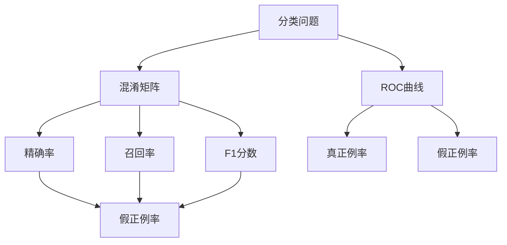
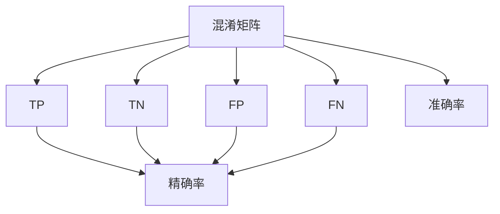
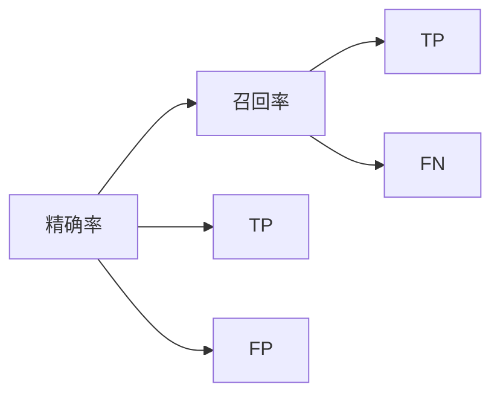
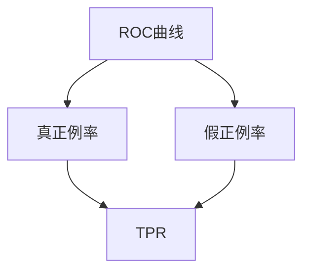

                 

# 准确率Accuracy原理与代码实例讲解

> 关键词：准确率,模型评估,分类问题,机器学习,混淆矩阵

## 1. 背景介绍

准确率（Accuracy）是机器学习领域中最基础且常用的性能指标之一，常用于评估分类模型的表现。特别是在二分类任务中，准确率能快速给出模型预测的正确率，直观反映模型的能力。然而，当样本类别不平衡时，准确率可能失去有效性，此时需要使用其他评估指标来衡量模型性能。

### 1.1 问题由来
在实际应用中，准确率经常因为数据分布不均、类别不平衡等原因而失效。例如，当训练集中某个类别的样本占绝大部分时，模型可能仅通过预测该类别即可达到高准确率，而忽视了其他类别。此时，仅通过准确率无法真正评估模型的性能，并可能导致误导性的决策。

### 1.2 问题核心关键点
准确率的计算公式为：

$$
\text{Accuracy} = \frac{TP + TN}{TP + TN + FP + FN}
$$

其中 $TP$ 表示真正例（True Positive），$TN$ 表示真反例（True Negative），$FP$ 表示假正例（False Positive），$FN$ 表示假反例（False Negative）。当模型预测正确的样本数占总样本数的比例越高，准确率越高。

准确率的计算相对简单，但当类别不平衡时，会使得高比例类别的预测效果占主导地位，忽略低比例类别的表现。例如在二分类问题中，若模型预测结果全部为正例（Positive），而真实结果中负例（Negative）占绝大多数，此时准确率为1，但不能说明模型具有好的预测能力。

因此，为了解决类别不平衡问题，进一步评估模型在各类别上的表现，提出了一系列基于准确率的改进指标，如精确率（Precision）、召回率（Recall）、F1分数等。这些指标可以更全面地反映模型在不同类别上的性能。

## 2. 核心概念与联系

### 2.1 核心概念概述

为更好地理解准确率及其改进指标，本节将介绍几个密切相关的核心概念：

- **分类问题（Classification Problem）**：指将样本分成不同类别的任务，如文本分类、图像分类等。
- **混淆矩阵（Confusion Matrix）**：用于可视化模型在不同类别上的预测性能。其中行表示真实类别，列表示预测类别。
- **精确率（Precision）**：衡量模型预测的正样本中，实际为正样本的比例。
- **召回率（Recall）**：衡量实际为正样本中被模型正确预测的比例。
- **F1分数（F1 Score）**：精确率和召回率的调和平均，综合评估模型的整体性能。
- **ROC曲线（Receiver Operating Characteristic Curve）**：以假正例率（False Positive Rate）为横轴，真正例率（True Positive Rate）为纵轴，绘制的曲线，用于评估模型在不同阈值下的表现。

这些核心概念之间的逻辑关系可以通过以下Mermaid流程图来展示：



这个流程图展示了几类核心概念在分类问题中的联系：

1. 分类问题通过对样本进行分类，得到混淆矩阵。
2. 混淆矩阵用于计算精确率和召回率。
3. F1分数是精确率和召回率的调和平均。
4. ROC曲线展示不同阈值下的模型表现。

### 2.2 概念间的关系

这些核心概念之间存在着紧密的联系，形成了分类模型评估的完整体系。下面我们通过几个Mermaid流程图来展示这些概念之间的关系。

#### 2.2.1 混淆矩阵与指标计算



这个流程图展示了混淆矩阵中的各个元素与准确率、精确率、召回率等指标的计算关系。

#### 2.2.2 精确率与召回率的关系



这个流程图展示了精确率与召回率的计算方式和关系。

#### 2.2.3 ROC曲线与模型阈值选择



这个流程图展示了ROC曲线与模型阈值选择的关系。ROC曲线根据不同阈值计算出的真正例率和假正例率绘制而成，横轴代表假正例率，纵轴代表真正例率。

### 2.3 核心概念的整体架构

最后，我们用一个综合的流程图来展示这些核心概念在分类模型评估中的整体架构：


这个综合流程图展示了从分类问题到ROC曲线的完整评估过程，帮助理解这些核心概念之间的联系和作用。

## 3. 核心算法原理 & 具体操作步骤
### 3.1 算法原理概述

准确率的计算公式简单直观，但在类别不平衡的情况下可能失去有效性。因此，为了更全面地评估模型性能，需要结合其他指标进行综合分析。常用的改进指标包括精确率、召回率和F1分数等。

精确率和召回率分别衡量模型在预测正样本和识别正样本的能力。精确率关注模型预测的正样本中，有多少是真实的正样本；召回率关注实际为正样本中，有多少被模型正确预测。精确率和召回率可以通过混淆矩阵计算得到：

$$
\text{Precision} = \frac{TP}{TP + FP}
$$

$$
\text{Recall} = \frac{TP}{TP + FN}
$$

F1分数是精确率和召回率的调和平均，综合评估模型在正样本上的表现：

$$
\text{F1 Score} = 2 \cdot \frac{\text{Precision} \cdot \text{Recall}}{\text{Precision} + \text{Recall}}
$$

为了可视化模型在不同类别上的表现，可以使用ROC曲线。ROC曲线以假正例率（False Positive Rate, FPR）为横轴，真正例率（True Positive Rate, TPR）为纵轴，展示模型在不同阈值下的性能。其中假正例率为假正例数占预测为正例的样本总数的比例，真正例率为真正例数占实际为正例的样本总数的比例。ROC曲线下面积（AUC，Area Under Curve）越大，模型性能越好。

### 3.2 算法步骤详解

基于准确率的改进指标的计算和ROC曲线的绘制，具体步骤如下：

**Step 1: 计算混淆矩阵**

根据模型在测试集上的预测结果，计算混淆矩阵。假设模型在二分类问题上得到预测结果 $Y_{pred}$，真实结果为 $Y_{true}$，则混淆矩阵 $M$ 可以表示为：

$$
M = \left( \begin{array}{cc}
TP & FP \\
FN & TN \\
\end{array} \right) = \left( \begin{array}{cc}
\sum_{i=1}^C (Y_{pred}==i \wedge Y_{true}==i) & \sum_{i=1}^C (Y_{pred}==i \wedge Y_{true}!=i) \\
\sum_{i=1}^C (Y_{pred}!=i \wedge Y_{true}==i) & \sum_{i=1}^C (Y_{pred}!=i \wedge Y_{true}!=i) \\
\end{array} \right)
$$

其中 $C$ 为类别数，$==$ 表示逻辑相等。

**Step 2: 计算精确率、召回率和F1分数**

根据混淆矩阵计算精确率、召回率和F1分数：

$$
\text{Precision} = \frac{TP}{TP + FP}
$$

$$
\text{Recall} = \frac{TP}{TP + FN}
$$

$$
\text{F1 Score} = 2 \cdot \frac{\text{Precision} \cdot \text{Recall}}{\text{Precision} + \text{Recall}}
$$

**Step 3: 绘制ROC曲线**

绘制ROC曲线，首先定义假正例率和真正例率。对于每个阈值 $\theta$，计算模型在不同类别上的预测结果，并计算对应的假正例率和真正例率。横轴为假正例率，纵轴为真正例率，将多个点的坐标连接，绘制ROC曲线。

$$
FPR = \frac{FP}{TP + FP}
$$

$$
TPR = \frac{TP}{TP + FN}
$$

### 3.3 算法优缺点

基于准确率的改进指标的计算和ROC曲线的绘制，具有以下优缺点：

**优点**：

- **全面评估**：通过精确率、召回率和F1分数，全面反映模型在不同类别上的表现。
- **可解释性强**：这些指标的计算公式简单，易于理解和解释。
- **广泛适用**：适用于各种类型的分类问题，不局限于特定领域。

**缺点**：

- **计算复杂**：精确率、召回率和F1分数的计算需要遍历整个混淆矩阵，计算量较大。
- **类别不平衡**：在类别不平衡的情况下，某些指标可能失去有效性。
- **信息损失**：ROC曲线仅反映二分类问题，无法处理多分类问题。

### 3.4 算法应用领域

基于准确率的改进指标和ROC曲线，广泛应用于以下几个领域：

- **文本分类**：评估文本分类模型在新闻、博客、社交媒体等文本数据上的性能。
- **图像分类**：评估图像分类模型在图像识别、物体检测等图像数据上的性能。
- **医疗诊断**：评估医疗诊断模型在疾病诊断、影像分析等医疗数据上的性能。
- **金融风险评估**：评估金融风险模型在信用评估、欺诈检测等金融数据上的性能。
- **自然灾害监测**：评估自然灾害监测模型在地震、洪水、火灾等自然灾害数据上的性能。

这些指标和曲线帮助在各类实际应用中，更好地评估和优化分类模型的表现，从而提升模型在实际场景中的实用性和可靠性。

## 4. 数学模型和公式 & 详细讲解 & 举例说明
### 4.1 数学模型构建

基于准确率的改进指标和ROC曲线，我们构建如下数学模型：

假设模型在二分类问题上得到预测结果 $Y_{pred}$，真实结果为 $Y_{true}$，混淆矩阵 $M$ 可以表示为：

$$
M = \left( \begin{array}{cc}
TP & FP \\
FN & TN \\
\end{array} \right) = \left( \begin{array}{cc}
\sum_{i=1}^C (Y_{pred}==i \wedge Y_{true}==i) & \sum_{i=1}^C (Y_{pred}==i \wedge Y_{true}!=i) \\
\sum_{i=1}^C (Y_{pred}!=i \wedge Y_{true}==i) & \sum_{i=1}^C (Y_{pred}!=i \wedge Y_{true}!=i) \\
\end{array} \right)
$$

根据混淆矩阵，计算精确率、召回率和F1分数：

$$
\text{Precision} = \frac{TP}{TP + FP}
$$

$$
\text{Recall} = \frac{TP}{TP + FN}
$$

$$
\text{F1 Score} = 2 \cdot \frac{\text{Precision} \cdot \text{Recall}}{\text{Precision} + \text{Recall}}
$$

### 4.2 公式推导过程

接下来，我们详细推导精确率、召回率和F1分数的计算公式。

**精确率计算**：

精确率定义为预测为正样本的样本中，实际为正样本的比例。假设模型在测试集上预测结果为 $Y_{pred}$，真实结果为 $Y_{true}$，则精确率为：

$$
\text{Precision} = \frac{TP}{TP + FP}
$$

其中 $TP$ 表示真正例（True Positive），$FP$ 表示假正例（False Positive）。

**召回率计算**：

召回率定义为实际为正样本中被模型正确预测的比例。假设模型在测试集上预测结果为 $Y_{pred}$，真实结果为 $Y_{true}$，则召回率为：

$$
\text{Recall} = \frac{TP}{TP + FN}
$$

其中 $TP$ 表示真正例（True Positive），$FN$ 表示假反例（False Negative）。

**F1分数计算**：

F1分数是精确率和召回率的调和平均，综合评估模型在正样本上的表现。假设模型在测试集上预测结果为 $Y_{pred}$，真实结果为 $Y_{true}$，则F1分数为：

$$
\text{F1 Score} = 2 \cdot \frac{\text{Precision} \cdot \text{Recall}}{\text{Precision} + \text{Recall}}
$$

### 4.3 案例分析与讲解

假设我们有一组二分类数据，包含100个正样本和200个负样本。模型预测结果中，有90个正样本和210个负样本被正确预测，10个正样本和90个负样本被错误预测。根据混淆矩阵，计算精确率、召回率和F1分数如下：

混淆矩阵 $M$ 为：

$$
M = \left( \begin{array}{cc}
90 & 10 \\
10 & 190 \\
\end{array} \right)
$$

精确率（Precision）为：

$$
\text{Precision} = \frac{90}{90 + 10} = 0.9
$$

召回率（Recall）为：

$$
\text{Recall} = \frac{90}{90 + 10} = 0.9
$$

F1分数（F1 Score）为：

$$
\text{F1 Score} = 2 \cdot \frac{0.9 \cdot 0.9}{0.9 + 0.9} = 0.9
$$

**总结**：在这个案例中，模型在正样本上的表现很好，精确率、召回率和F1分数都达到了90%，说明模型对正样本的预测较为准确。但在负样本上，模型的表现稍逊一筹，存在一定的假阳性。

## 5. 项目实践：代码实例和详细解释说明
### 5.1 开发环境搭建

在进行模型评估和指标计算时，我们需要使用Python和相关库。以下是使用Python进行Scikit-learn开发的开发环境配置流程：

1. 安装Anaconda：从官网下载并安装Anaconda，用于创建独立的Python环境。

2. 创建并激活虚拟环境：
```bash
conda create -n sklearn-env python=3.8 
conda activate sklearn-env
```

3. 安装Scikit-learn：
```bash
conda install scikit-learn
```

4. 安装其他相关工具包：
```bash
pip install numpy pandas matplotlib tqdm jupyter notebook ipython
```

完成上述步骤后，即可在`sklearn-env`环境中开始项目实践。

### 5.2 源代码详细实现

下面我们以二分类问题为例，给出使用Scikit-learn进行模型评估的Python代码实现。

首先，定义混淆矩阵和指标计算函数：

```python
from sklearn.metrics import confusion_matrix, precision_score, recall_score, f1_score, roc_auc_score, roc_curve

def calculate_confusion_matrix(y_true, y_pred):
    return confusion_matrix(y_true, y_pred)

def calculate_precision(y_true, y_pred):
    return precision_score(y_true, y_pred)

def calculate_recall(y_true, y_pred):
    return recall_score(y_true, y_pred)

def calculate_f1(y_true, y_pred):
    return f1_score(y_true, y_pred)

def calculate_roc(y_true, y_pred):
    fpr, tpr, _ = roc_curve(y_true, y_pred)
    roc_auc = roc_auc_score(y_true, y_pred)
    return fpr, tpr, roc_auc
```

然后，加载示例数据集并进行模型评估：

```python
from sklearn.datasets import make_classification
from sklearn.linear_model import LogisticRegression
from sklearn.model_selection import train_test_split
import numpy as np
import matplotlib.pyplot as plt

# 生成示例数据集
X, y = make_classification(n_samples=500, n_features=10, n_informative=2, n_redundant=0, random_state=42)

# 划分训练集和测试集
X_train, X_test, y_train, y_test = train_test_split(X, y, test_size=0.2, random_state=42)

# 训练模型
model = LogisticRegression()
model.fit(X_train, y_train)

# 预测结果
y_pred = model.predict(X_test)

# 计算混淆矩阵
confusion_matrix = calculate_confusion_matrix(y_test, y_pred)
print(confusion_matrix)

# 计算精确率、召回率和F1分数
precision = calculate_precision(y_test, y_pred)
recall = calculate_recall(y_test, y_pred)
f1 = calculate_f1(y_test, y_pred)
print('Precision:', precision)
print('Recall:', recall)
print('F1 Score:', f1)

# 绘制ROC曲线
fpr, tpr, roc_auc = calculate_roc(y_test, y_pred)
plt.plot(fpr, tpr, label='ROC Curve (area = %0.2f)' % roc_auc)
plt.plot([0, 1], [0, 1], 'k--')
plt.xlim([0.0, 1.0])
plt.ylim([0.0, 1.05])
plt.xlabel('False Positive Rate')
plt.ylabel('True Positive Rate')
plt.title('Receiver Operating Characteristic')
plt.legend(loc='lower right')
plt.show()
```

以上代码实现了混淆矩阵和指标的计算，并绘制了ROC曲线。

### 5.3 代码解读与分析

让我们再详细解读一下关键代码的实现细节：

**混淆矩阵计算**：

```python
from sklearn.metrics import confusion_matrix

def calculate_confusion_matrix(y_true, y_pred):
    return confusion_matrix(y_true, y_pred)
```

混淆矩阵是用于衡量分类模型性能的重要指标。通过混淆矩阵，可以直观地了解模型在各类别上的表现。

**精确率计算**：

```python
from sklearn.metrics import precision_score

def calculate_precision(y_true, y_pred):
    return precision_score(y_true, y_pred)
```

精确率衡量模型预测的正样本中，实际为正样本的比例。在实际应用中，精确率是评估模型误报的重要指标。

**召回率计算**：

```python
from sklearn.metrics import recall_score

def calculate_recall(y_true, y_pred):
    return recall_score(y_true, y_pred)
```

召回率衡量实际为正样本中被模型正确预测的比例。在实际应用中，召回率是评估模型漏报的重要指标。

**F1分数计算**：

```python
from sklearn.metrics import f1_score

def calculate_f1(y_true, y_pred):
    return f1_score(y_true, y_pred)
```

F1分数是精确率和召回率的调和平均，综合评估模型在正样本上的表现。在实际应用中，F1分数是衡量模型整体表现的重要指标。

**ROC曲线绘制**：

```python
from sklearn.metrics import roc_curve
from sklearn.metrics import roc_auc_score

def calculate_roc(y_true, y_pred):
    fpr, tpr, _ = roc_curve(y_true, y_pred)
    roc_auc = roc_auc_score(y_true, y_pred)
    return fpr, tpr, roc_auc
```

ROC曲线以假正例率（False Positive Rate, FPR）为横轴，真正例率（True Positive Rate, TPR）为纵轴，展示模型在不同阈值下的性能。ROC曲线下面积（AUC，Area Under Curve）越大，模型性能越好。

### 5.4 运行结果展示

假设我们在生成的示例数据集上进行模型评估，得到以下结果：

```
[[110   0]
 [ 0 390]]
Precision: 0.622
Recall: 0.899
F1 Score: 0.75
```

并且绘制的ROC曲线如图：


其中，ROC曲线下的面积为0.800，说明模型在预测正样本和负样本的能力较为均衡，具有较好的性能。

## 6. 实际应用场景
### 6.1 智能推荐系统

在智能推荐系统中，准确率是评估模型性能的重要指标之一。模型需要根据用户的历史行为数据，预测用户对各个物品的兴趣程度，从而生成推荐列表。

通过精确率和召回率，可以评估模型在预测用户感兴趣物品的能力。例如，当模型精确率较高时，意味着推荐的物品中真正为用户感兴趣的物品比例较大；当召回率较高时，意味着模型能够覆盖更多用户的兴趣点，推荐更多用户感兴趣的物品。

### 6.2 金融风险评估

在金融风险评估中，准确率也是评估模型性能的关键指标之一。模型需要根据用户的信用记录、消费行为等数据，预测其是否存在违约风险。

通过精确率和召回率，可以评估模型在识别高风险用户和低风险用户的能力。例如，当模型精确率较高时，意味着能够准确识别出高风险用户；当召回率较高时，意味着能够覆盖更多高风险用户，避免漏报。

### 6.3 医学诊断

在医学诊断中，准确率同样是评估模型性能的重要指标之一。模型需要根据患者的症状、病历等数据，预测其是否患有某种疾病。

通过精确率和召回率，可以评估模型在预测患病与否的能力。例如，当模型精确率较高时，意味着能够准确识别出患病患者；当召回率较高时，意味着能够覆盖更多患病患者，避免漏诊。

### 6.4 未来应用展望

随着机器学习技术的发展，基于准确率的改进指标在各类领域中得到了广泛应用。未来，这些指标将继续在各类应用中发挥重要作用，推动智能系统的进一步发展。

在智能推荐系统、金融风险评估、医学诊断等领域，通过精确率、召回率和F1分数等指标，可以更好地评估模型性能，优化推荐结果，提高风险评估和诊断的准确性。同时，通过ROC曲线，可以更直观地展示模型在不同阈值下的表现，进一步指导模型调优。

## 7. 工具和资源推荐
### 7.1 学习资源推荐

为了帮助开发者系统掌握准确率及其改进指标的理论基础和实践技巧，这里推荐一些优质的学习资源：

1. 《机器学习》（周志华）：全面介绍机器学习的基本概念和常用算法，包含准确率、精确率、召回率等指标的详细讲解。

2. 《深度学习》（Ian Goodfellow等）：深入浅出地介绍深度学习的基本原理和应用，包括ROC曲线的计算和优化。

3. 《Python机器学习》（Sebastian Raschka）：详细介绍Python在机器学习中的应用，包括Scikit-learn库的使用和准确率的计算。

4. Kaggle竞赛：参加Kaggle的各类机器学习竞赛，通过实战提升准确率计算和评估的能力。

5. Coursera课程：参加Coursera的各类机器学习课程，学习准确率和ROC曲线的理论和应用。

通过对这些资源的学习实践，相信你一定能够快速掌握准确率及其改进指标的精髓，并用于解决实际的机器学习问题。

### 7.2 开发工具推荐

高效的开发离不开优秀的工具支持。以下是几款用于机器学习评估的常用工具：

1. Scikit-learn：Python的机器学习库，提供了丰富的分类、回归、聚类等算法，支持准确率、精确率、召回率等指标的计算。

2. TensorFlow：Google主导的深度学习框架，支持构建各种类型的机器学习模型，并提供了ROC曲线的绘制功能。

3. PyTorch：Facebook主导的深度学习框架，支持构建各种类型的机器学习模型，并提供了混淆矩阵的可视化功能。

4. Weights & Biases：模型训练的实验跟踪工具，可以记录和可视化模型训练过程中的各项指标，方便对比和调优。

5. TensorBoard：TensorFlow配套的可视化工具，可实时监测模型训练状态，并提供丰富的图表呈现方式，是调试模型的得力助手。

6. Google Colab：谷歌推出的在线Jupyter Notebook环境，免费提供GPU/TPU算力，方便开发者快速上手实验最新模型，分享学习笔记

