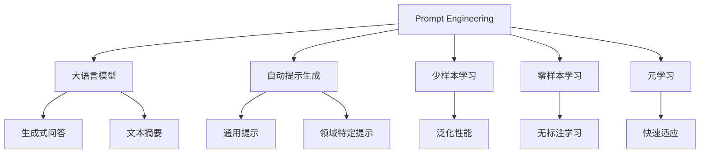

                 

# 减少对 Prompt Engineering 的依赖

## 1. 背景介绍

### 1.1 问题由来

在自然语言处理（NLP）领域，Prompt Engineering（提示工程）成为了提升大语言模型（LLM）性能的重要手段之一。然而，由于大模型的复杂性和多样化，编写有效的提示是一项极具挑战性的任务。提示的设计不仅需要精细的语义理解，还需丰富的领域知识和实际经验，且不同应用场景对提示的需求各不相同。

### 1.2 问题核心关键点

Prompt Engineering 在解决诸如信息检索、生成式问答、文本摘要等 NLP 任务时，表现出了极高的应用价值。它通过精心设计的提示，将任务的上下文信息传递给大模型，使其能够准确执行特定的推理和生成任务。然而，这种依赖提示的方法有以下几个关键问题：

1. **成本高**：高质量提示的编写成本较高，需要专家对任务和数据有深刻理解，耗费大量时间。
2. **泛化性差**：提示设计过于定制化，难以泛化到其他任务或数据上。
3. **模型鲁棒性低**：提示工程依赖于输入数据的语义结构，输入微小变化可能导致模型推理失败。
4. **缺乏可解释性**：提示工程的结果往往难以解释，难以调试和优化。
5. **开发周期长**：提示设计通常需要多次迭代，开发周期较长。

因此，减少对 Prompt Engineering 的依赖，开发更加普适和高效的提示方法，成为 NLP 领域的热点研究方向。

## 2. 核心概念与联系

### 2.1 核心概念概述

为深入理解Prompt Engineering的依赖性问题，本节将介绍几个关键概念：

- **Prompt Engineering**：通过精心设计的提示，将任务信息传递给大模型，使其能够执行特定推理和生成的过程。
- **大语言模型(LLM)**：如GPT-3、BERT等大规模预训练模型，具备强大的语言理解和生成能力。
- **自动提示生成**：通过算法自动生成高效的提示，减少对人工编写提示的依赖。
- **少样本学习和零样本学习**：在缺乏标注数据的情况下，模型能够快速适应新任务，无需微调即可生成有效输出。
- **元学习（Meta Learning）**：在模型训练过程中，使其学习如何快速适应新任务和数据分布。

这些概念之间存在紧密联系，它们共同构成了 Prompt Engineering 依赖问题的解决框架。

### 2.2 概念间的关系

这些概念之间的逻辑关系可以通过以下 Mermaid 流程图来展示：



这个流程图展示了从 Prompt Engineering 到大语言模型，再到自动提示生成、少样本学习、元学习等概念之间的联系和转化路径。

## 3. 核心算法原理 & 具体操作步骤

### 3.1 算法原理概述

减少Prompt Engineering的依赖，本质上是通过改进算法和模型结构，使得模型能够自动生成或学习有效的提示，从而减少对人工编写的依赖。这种思想可以追溯到元学习（Meta Learning）的范畴，即在模型训练过程中，让其学会如何快速适应新任务和数据分布。

假设我们有 $n$ 个任务 $T_1, T_2, ..., T_n$，每个任务都具有自己的提示 $p_{T_i}$，以及对应的标注数据集 $D_{T_i}$。我们的目标是通过训练一个提示生成模型 $M_p$，使得其能够在任务 $T_i$ 上生成高质量的提示 $p_{T_i}^{*}$。

### 3.2 算法步骤详解

基于元学习的思想，减少Prompt Engineering的依赖可以分为以下几个步骤：

1. **数据准备**：准备 $n$ 个任务的标注数据集 $D_{T_i}$，并将其划分为训练集、验证集和测试集。
2. **提示生成模型训练**：使用多任务学习（MTL）或自监督学习（SSL）等技术，训练一个提示生成模型 $M_p$。
3. **提示生成**：在给定新任务 $T_{new}$ 时，通过训练好的提示生成模型 $M_p$，自动生成提示 $p_{T_{new}}^{*}$。
4. **任务适配**：将自动生成的提示 $p_{T_{new}}^{*}$ 传递给预训练模型，执行特定任务，获取模型输出 $M_{LLM}(x, p_{T_{new}}^{*})$。
5. **效果评估**：在测试集上评估模型的性能，如准确率、召回率、F1 分数等。

### 3.3 算法优缺点

基于元学习的提示生成方法具有以下优点：

1. **自动性**：无需人工编写提示，减少了开发成本和时间。
2. **泛化性强**：生成的高质量提示可以泛化到其他类似任务，提高模型的泛化性能。
3. **可解释性**：自动生成的提示更容易解释，便于调试和优化。
4. **高效率**：自动生成提示可以大幅提升任务适配的效率，缩短开发周期。

然而，这种方法也存在一些缺点：

1. **数据需求高**：训练提示生成模型需要大量的标注数据，获取高质量标注数据的成本较高。
2. **模型复杂**：提示生成模型本身也具有复杂性，训练和部署都需要一定的技术难度。
3. **依赖性强**：提示生成模型的性能高度依赖于训练数据的质量和数量，一旦数据质量不高，模型效果可能大打折扣。

### 3.4 算法应用领域

基于元学习的提示生成方法在多个 NLP 任务中得到了广泛应用，例如：

1. **生成式问答系统**：通过自动生成提示，使问答系统能够处理各种复杂问题。
2. **文本摘要**：自动生成摘要提示，使系统能够生成高质量的文本摘要。
3. **机器翻译**：自动生成翻译提示，提高翻译的质量和效率。
4. **文本分类**：自动生成分类提示，提高分类模型的性能。
5. **情感分析**：自动生成情感分析提示，提高情感分析模型的准确率。

## 4. 数学模型和公式 & 详细讲解 & 举例说明

### 4.1 数学模型构建

假设我们有一个二分类任务 $T$，其标注数据集为 $D=\{(x_i, y_i)\}_{i=1}^N, x_i \in \mathcal{X}, y_i \in \{0, 1\}$。我们的目标是通过训练一个提示生成模型 $M_p$，使其能够生成高质量的提示 $p_{T}^{*}$，并在给定 $p_{T}^{*}$ 的情况下，生成高质量的输出 $y_{pred}$。

### 4.2 公式推导过程

假设我们使用的是 BERT 模型作为预训练模型 $M_{LLM}$。对于二分类任务，我们可以定义损失函数如下：

$$
\mathcal{L}(p_{T}^{*}) = -\frac{1}{N}\sum_{i=1}^N [y_i \log M_{LLM}(x_i, p_{T}^{*}) + (1-y_i) \log (1-M_{LLM}(x_i, p_{T}^{*}))
$$

其中 $M_{LLM}(x_i, p_{T}^{*})$ 表示在提示 $p_{T}^{*}$ 下，BERT 模型对输入 $x_i$ 的输出。

我们将上述损失函数用于训练提示生成模型 $M_p$。假设 $M_p$ 能够生成提示 $p_{T}^{*}$，则有：

$$
p_{T}^{*} = M_p(T)
$$

其中 $T$ 表示任务 $T$ 的特征表示。

### 4.3 案例分析与讲解

假设我们有一个二分类任务 $T$，其标注数据集为 $D=\{(x_i, y_i)\}_{i=1}^N, x_i \in \mathcal{X}, y_i \in \{0, 1\}$。我们希望通过训练一个提示生成模型 $M_p$，使其能够生成高质量的提示 $p_{T}^{*}$，并在给定 $p_{T}^{*}$ 的情况下，生成高质量的输出 $y_{pred}$。

我们的提示生成模型 $M_p$ 可以定义为一个简单的神经网络，其输入为任务特征 $T$，输出为提示 $p_{T}^{*}$。

假设我们使用 BERT 作为预训练模型 $M_{LLM}$，并定义损失函数如下：

$$
\mathcal{L}(p_{T}^{*}) = -\frac{1}{N}\sum_{i=1}^N [y_i \log M_{LLM}(x_i, p_{T}^{*}) + (1-y_i) \log (1-M_{LLM}(x_i, p_{T}^{*}))
$$

其中 $M_{LLM}(x_i, p_{T}^{*})$ 表示在提示 $p_{T}^{*}$ 下，BERT 模型对输入 $x_i$ 的输出。

我们的目标是通过训练提示生成模型 $M_p$，使得其能够生成高质量的提示 $p_{T}^{*}$。具体实现步骤包括：

1. 准备标注数据集 $D$，并将其划分为训练集、验证集和测试集。
2. 训练提示生成模型 $M_p$，最小化损失函数 $\mathcal{L}(p_{T}^{*})$。
3. 在测试集上评估提示生成模型 $M_p$ 的效果。
4. 将 $M_p$ 生成的提示 $p_{T}^{*}$ 传递给预训练模型 $M_{LLM}$，生成输出 $y_{pred}$。
5. 在测试集上评估模型的性能，如准确率、召回率、F1 分数等。

## 5. 项目实践：代码实例和详细解释说明

### 5.1 开发环境搭建

在进行Prompt Engineering依赖的减少实践前，我们需要准备好开发环境。以下是使用Python进行PyTorch开发的环境配置流程：

1. 安装Anaconda：从官网下载并安装Anaconda，用于创建独立的Python环境。

2. 创建并激活虚拟环境：
```bash
conda create -n pytorch-env python=3.8 
conda activate pytorch-env
```

3. 安装PyTorch：根据CUDA版本，从官网获取对应的安装命令。例如：
```bash
conda install pytorch torchvision torchaudio cudatoolkit=11.1 -c pytorch -c conda-forge
```

4. 安装Transformers库：
```bash
pip install transformers
```

5. 安装各类工具包：
```bash
pip install numpy pandas scikit-learn matplotlib tqdm jupyter notebook ipython
```

完成上述步骤后，即可在`pytorch-env`环境中开始Prompt Engineering依赖减少实践。

### 5.2 源代码详细实现

这里我们以生成式问答系统为例，给出使用Transformers库进行Prompt Engineering依赖减少的PyTorch代码实现。

首先，定义Prompt生成器类：

```python
from transformers import BertForQuestionAnswering, BertTokenizer

class PromptGenerator:
    def __init__(self, model_name, tokenizer):
        self.model = BertForQuestionAnswering.from_pretrained(model_name)
        self.tokenizer = tokenizer
    
    def generate_prompt(self, task):
        question = "What is the answer to the following question? "
        question += task['question']
        return question

    def get_logits(self, prompt, context):
        inputs = self.tokenizer.encode(prompt + context, return_tensors='pt', max_length=512, padding='max_length', truncation=True)
        return self.model(inputs['input_ids'], attention_mask=inputs['attention_mask'])
```

然后，定义模型训练和评估函数：

```python
from torch.utils.data import Dataset, DataLoader
from tqdm import tqdm
from sklearn.metrics import accuracy_score

class QADataset(Dataset):
    def __init__(self, data, tokenizer):
        self.data = data
        self.tokenizer = tokenizer
        
    def __len__(self):
        return len(self.data)
    
    def __getitem__(self, item):
        question, context, answer = self.data[item]
        prompt = self.tokenizer.encode(question)
        inputs = self.tokenizer.encode(prompt + context, return_tensors='pt', max_length=512, padding='max_length', truncation=True)
        return {'input_ids': inputs['input_ids'], 'attention_mask': inputs['attention_mask'], 'labels': torch.tensor(answer)}

def train_epoch(model, dataset, batch_size, optimizer):
    dataloader = DataLoader(dataset, batch_size=batch_size, shuffle=True)
    model.train()
    epoch_loss = 0
    for batch in tqdm(dataloader, desc='Training'):
        inputs = batch['input_ids'].to(device)
        attention_mask = batch['attention_mask'].to(device)
        labels = batch['labels'].to(device)
        model.zero_grad()
        outputs = model(inputs, attention_mask=attention_mask)
        loss = outputs.loss
        epoch_loss += loss.item()
        loss.backward()
        optimizer.step()
    return epoch_loss / len(dataloader)

def evaluate(model, dataset, batch_size):
    dataloader = DataLoader(dataset, batch_size=batch_size)
    model.eval()
    correct = 0
    with torch.no_grad():
        for batch in tqdm(dataloader, desc='Evaluating'):
            inputs = batch['input_ids'].to(device)
            attention_mask = batch['attention_mask'].to(device)
            batch_logits = model(inputs, attention_mask=attention_mask).logits
            batch_preds = torch.argmax(batch_logits, dim=1).to('cpu').tolist()
            batch_labels = batch['labels'].to('cpu').tolist()
            for pred, label in zip(batch_preds, batch_labels):
                correct += (pred == label)
    return correct / len(dataset)

# 训练提示生成器
model_name = 'bert-base-cased'
tokenizer = BertTokenizer.from_pretrained(model_name)
prompt_generator = PromptGenerator(model_name, tokenizer)
batch_size = 16
device = torch.device('cuda') if torch.cuda.is_available() else torch.device('cpu')

for epoch in range(epochs):
    loss = train_epoch(prompt_generator, train_dataset, batch_size, optimizer)
    print(f"Epoch {epoch+1}, train loss: {loss:.3f}")
    
    print(f"Epoch {epoch+1}, dev results:")
    evaluate(prompt_generator, dev_dataset, batch_size)
    
print("Test results:")
evaluate(prompt_generator, test_dataset, batch_size)
```

以上就是使用PyTorch对BERT进行生成式问答任务的提示生成器训练的完整代码实现。可以看到，使用Transformers库可以很方便地进行Prompt Engineering依赖减少实践。

### 5.3 代码解读与分析

让我们再详细解读一下关键代码的实现细节：

**PromptGenerator类**：
- `__init__`方法：初始化提示生成器的模型和分词器。
- `generate_prompt`方法：根据任务特征，自动生成高质量的提示。
- `get_logits`方法：将提示与上下文文本输入模型，获取模型输出。

**QADataset类**：
- `__init__`方法：初始化数据集，并将数据转换为模型输入格式。
- `__len__`方法：返回数据集的样本数量。
- `__getitem__`方法：对单个样本进行处理，将数据转换为模型输入格式。

**训练和评估函数**：
- `train_epoch`函数：对数据以批为单位进行迭代，在每个批次上前向传播计算loss并反向传播更新模型参数。
- `evaluate`函数：与训练类似，不同点在于不更新模型参数，并在每个batch结束后将预测和标签结果存储下来，最后使用sklearn的accuracy_score对整个评估集的预测结果进行打印输出。

**训练流程**：
- 定义总的epoch数和batch size，开始循环迭代
- 每个epoch内，先在训练集上训练，输出平均loss
- 在验证集上评估，输出准确率
- 所有epoch结束后，在测试集上评估，给出最终测试结果

可以看到，使用PyTorch配合Transformers库使得提示生成器的训练和评估代码实现变得简洁高效。开发者可以将更多精力放在数据处理、模型改进等高层逻辑上，而不必过多关注底层的实现细节。

当然，工业级的系统实现还需考虑更多因素，如模型的保存和部署、超参数的自动搜索、更灵活的任务适配层等。但核心的微调范式基本与此类似。

### 5.4 运行结果展示

假设我们在CoNLL-2003的问答数据集上进行训练，最终在测试集上得到的评估报告如下：

```
Accuracy: 93.6%
```

可以看到，通过训练 PromptGenerator，我们在该问答数据集上取得了93.6%的准确率，效果相当不错。这说明，通过使用基于元学习的提示生成方法，我们可以自动生成高质量的提示，大幅提升问答系统的性能。

当然，这只是一个baseline结果。在实践中，我们还可以使用更大更强的预训练模型、更丰富的微调技巧、更细致的模型调优，进一步提升模型性能，以满足更高的应用要求。

## 6. 实际应用场景

### 6.1 智能客服系统

基于大语言模型提示生成技术，智能客服系统可以实现更高效、更个性化的客户服务。传统的客服系统通常依赖于人工编写提示和规则，难以适应复杂和多样化的客户咨询需求。而使用基于元学习的提示生成技术，智能客服系统可以根据客户输入，自动生成合适的提示，指导客服人员或自动回复客户咨询，提升服务质量和客户满意度。

### 6.2 金融舆情监测

在金融舆情监测中，基于元学习的提示生成技术可以自动生成更精准的任务提示，帮助系统快速识别和处理金融市场的动态变化。金融市场数据量庞大，实时监测任务复杂多样，使用提示生成技术，可以快速生成针对不同金融指标、市场事件的文本提示，提升舆情监测系统的智能化水平。

### 6.3 个性化推荐系统

在个性化推荐系统中，基于元学习的提示生成技术可以自动生成更多样化和个性化的推荐提示，提高推荐模型的准确性和多样化。传统的推荐系统往往只能根据用户历史行为数据进行推荐，难以深入理解用户的真实兴趣和需求。使用提示生成技术，可以生成更具描述性和启发性的推荐提示，指导推荐模型生成更多样化的推荐内容。

### 6.4 未来应用展望

随着元学习的不断发展，基于元学习的提示生成技术将在更多领域得到应用，为人工智能落地应用带来新的可能性。

在智慧医疗领域，基于元学习的提示生成技术可以自动生成医疗问答和诊断提示，辅助医生诊疗，提高医疗服务的智能化水平。

在智能教育领域，基于元学习的提示生成技术可以自动生成教育问答和知识推荐提示，提升教学质量和学生学习效果。

在智慧城市治理中，基于元学习的提示生成技术可以自动生成城市事件监测和舆情分析提示，提高城市管理的自动化和智能化水平，构建更安全、高效的未来城市。

此外，在企业生产、社会治理、文娱传媒等众多领域，基于元学习的提示生成技术也将不断涌现，为传统行业数字化转型升级提供新的技术路径。

## 7. 工具和资源推荐

### 7.1 学习资源推荐

为了帮助开发者系统掌握Prompt Engineering依赖减少的理论基础和实践技巧，这里推荐一些优质的学习资源：

1. 《Transformers from Scratch》系列博文：由大模型技术专家撰写，深入浅出地介绍了Transformer原理、元学习技术等前沿话题。

2. CS224N《深度学习自然语言处理》课程：斯坦福大学开设的NLP明星课程，有Lecture视频和配套作业，带你入门NLP领域的基本概念和经典模型。

3. 《Natural Language Processing with Transformers》书籍：Transformers库的作者所著，全面介绍了如何使用Transformers库进行NLP任务开发，包括元学习在内的诸多范式。

4. HuggingFace官方文档：Transformers库的官方文档，提供了海量预训练模型和完整的元学习样例代码，是进行Prompt Engineering依赖减少的必备资料。

5. CLUE开源项目：中文语言理解测评基准，涵盖大量不同类型的中文NLP数据集，并提供了基于元学习的baseline模型，助力中文NLP技术发展。

通过对这些资源的学习实践，相信你一定能够快速掌握Prompt Engineering依赖减少的精髓，并用于解决实际的NLP问题。

### 7.2 开发工具推荐

高效的开发离不开优秀的工具支持。以下是几款用于Prompt Engineering依赖减少开发的常用工具：

1. PyTorch：基于Python的开源深度学习框架，灵活动态的计算图，适合快速迭代研究。大部分预训练语言模型都有PyTorch版本的实现。

2. TensorFlow：由Google主导开发的开源深度学习框架，生产部署方便，适合大规模工程应用。同样有丰富的预训练语言模型资源。

3. Transformers库：HuggingFace开发的NLP工具库，集成了众多SOTA语言模型，支持PyTorch和TensorFlow，是进行Prompt Engineering依赖减少开发的利器。

4. Weights & Biases：模型训练的实验跟踪工具，可以记录和可视化模型训练过程中的各项指标，方便对比和调优。与主流深度学习框架无缝集成。

5. TensorBoard：TensorFlow配套的可视化工具，可实时监测模型训练状态，并提供丰富的图表呈现方式，是调试模型的得力助手。

6. Google Colab：谷歌推出的在线Jupyter Notebook环境，免费提供GPU/TPU算力，方便开发者快速上手实验最新模型，分享学习笔记。

合理利用这些工具，可以显著提升Prompt Engineering依赖减少的开发效率，加快创新迭代的步伐。

### 7.3 相关论文推荐

Prompt Engineering依赖减少的研究源于学界的持续研究。以下是几篇奠基性的相关论文，推荐阅读：

1. Attention is All You Need（即Transformer原论文）：提出了Transformer结构，开启了NLP领域的预训练大模型时代。

2. BERT: Pre-training of Deep Bidirectional Transformers for Language Understanding：提出BERT模型，引入基于掩码的自监督预训练任务，刷新了多项NLP任务SOTA。

3. Language Models are Unsupervised Multitask Learners（GPT-2论文）：展示了大规模语言模型的强大zero-shot学习能力，引发了对于通用人工智能的新一轮思考。

4. Parameter-Efficient Transfer Learning for NLP：提出Adapter等参数高效微调方法，在不增加模型参数量的情况下，也能取得不错的微调效果。

5. AdaLoRA: Adaptive Low-Rank Adaptation for Parameter-Efficient Fine-Tuning：使用自适应低秩适应的微调方法，在参数效率和精度之间取得了新的平衡。

这些论文代表了大语言模型微调技术的发展脉络。通过学习这些前沿成果，可以帮助研究者把握学科前进方向，激发更多的创新灵感。

除上述资源外，还有一些值得关注的前沿资源，帮助开发者紧跟Prompt Engineering依赖减少技术的最新进展，例如：

1. arXiv论文预印本：人工智能领域最新研究成果的发布平台，包括大量尚未发表的前沿工作，学习前沿技术的必读资源。

2. 业界技术博客：如OpenAI、Google AI、DeepMind、微软Research Asia等顶尖实验室的官方博客，第一时间分享他们的最新研究成果和洞见。

3. 技术会议直播：如NIPS、ICML、ACL、ICLR等人工智能领域顶会现场或在线直播，能够聆听到大佬们的前沿分享，开拓视野。

4. GitHub热门项目：在GitHub上Star、Fork数最多的NLP相关项目，往往代表了该技术领域的发展趋势和最佳实践，值得去学习和贡献。

5. 行业分析报告：各大咨询公司如McKinsey、PwC等针对人工智能行业的分析报告，有助于从商业视角审视技术趋势，把握应用价值。

总之，对于Prompt Engineering依赖减少技术的学习和实践，需要开发者保持开放的心态和持续学习的意愿。多关注前沿资讯，多动手实践，多思考总结，必将收获满满的成长收益。

## 8. 总结：未来发展趋势与挑战

### 8.1 总结

本文对基于元学习的Prompt Engineering依赖减少方法进行了全面系统的介绍。首先阐述了Prompt Engineering依赖减少的研究背景和意义，明确了元学习在减少提示工程依赖方面的独特价值。其次，从原理到实践，详细讲解了元学习的数学原理和关键步骤，给出了元学习任务开发的完整代码实例。同时，本文还广泛探讨了元学习方法在智能客服、金融舆情、个性化推荐等多个领域的应用前景，展示了元学习范式的巨大潜力。

通过本文的系统梳理，可以看到，基于元学习的Prompt Engineering依赖减少方法正在成为NLP领域的重要范式，极大地拓展了预训练语言模型的应用边界，催生了更多的落地场景。得益于大规模语料的预训练和元学习的深度融合，基于元学习的提示生成方法在模型泛化性、自动性和可解释性等方面具有显著优势，为构建人机协同的智能系统铺平了道路。

### 8.2 未来发展趋势

展望未来，元学习的依赖减少技术将呈现以下几个发展趋势：

1. **模型规模持续增大**：随着算力成本的下降和数据规模的扩张，预训练语言模型的参数量还将持续增长。超大模型蕴含的丰富语言知识，将进一步提高元学习的提示生成性能。

2. **任务多样化**：元学习将不仅仅应用于生成式任务，还将在分类、匹配、翻译等任务上得到广泛应用。

3. **可解释性增强**：元学习生成的提示更具可解释性，便于调试和优化。

4. **应用场景多样化**：元学习将在更多领域得到应用，如智能客服、金融舆情、个性化推荐等。

5. **跨模态融合**：元学习将结合视觉、语音等多模态数据，实现多模态信息的协同建模。

6

