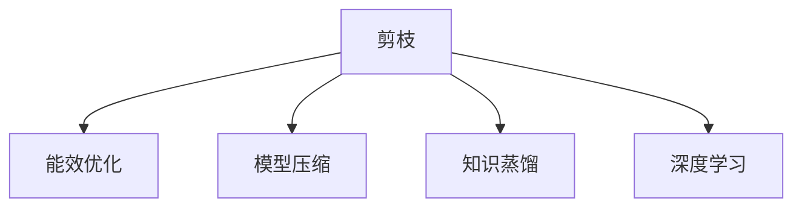
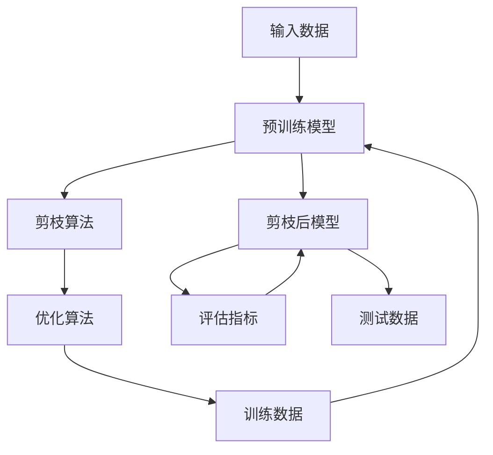
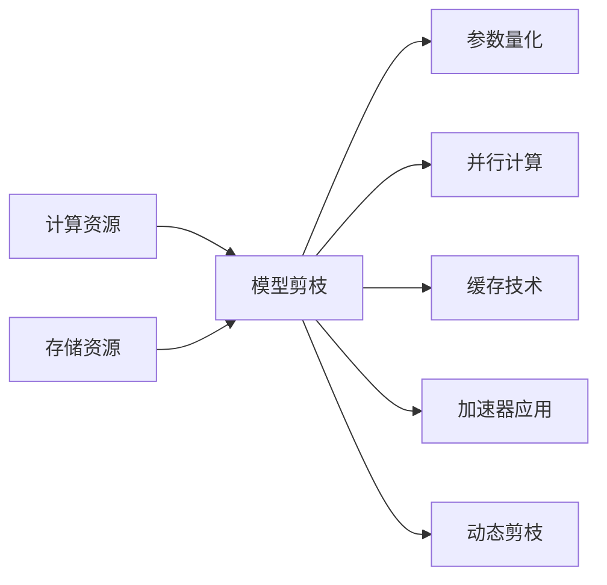
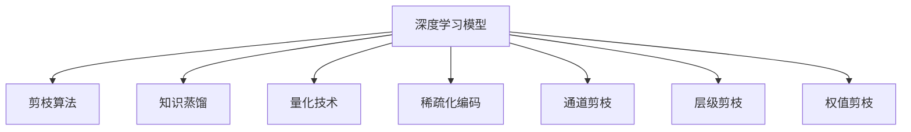

                 

# 剪枝技术在高性能计算中的应用前景

## 1. 背景介绍

### 1.1 问题由来
高性能计算(High Performance Computing, HPC)是现代科学研究、工程设计、商业决策等领域的重要工具。随着人工智能(AI)和深度学习(DL)技术在各个行业的应用，计算密集型任务如深度神经网络训练、图像识别、自然语言处理等变得越来越复杂。在HPC系统中，这类任务通常需要大量计算资源和存储资源，这带来了两个关键问题：

1. **能效挑战**：大规模计算任务耗能巨大，难以在现有数据中心部署。
2. **资源优化**：如何在有限的资源下，尽可能提升计算效率和性能，是一个迫切需要解决的问题。

### 1.2 问题核心关键点
针对这些问题，**剪枝**(Pruning)技术应运而生。剪枝技术是一种在模型训练和优化阶段，主动减少模型复杂度、提升计算效率的方法。它通过移除模型中冗余或不重要的参数、权重或连接，使模型变得更加“精简”，从而提高能效、减少存储需求、加速推理。

剪枝技术被广泛应用于深度学习模型中，特别是在神经网络中。在深度神经网络中，剪枝可以显著减少计算量和存储空间，提高模型推理速度。通过对模型进行剪枝，能够在有限资源下，实现更高效的计算和推理。

### 1.3 问题研究意义
剪枝技术的研究具有重要意义，主要体现在以下几个方面：

1. **提升能效**：通过剪枝减少模型参数，能够降低计算和存储需求，减少能耗，提升系统能效。
2. **加速推理**：剪枝后的模型体积更小，计算更轻，推理速度更快，适用于对实时性要求高的应用场景。
3. **资源优化**：在资源有限的场景下，剪枝技术可以优化模型设计，提高计算效率，满足实际应用需求。
4. **可扩展性**：通过剪枝，可以在不增加资源投入的情况下，提升模型性能，支持大规模并行计算。
5. **降低成本**：通过优化模型结构，减少资源需求，降低硬件和软件成本，提升经济性。

## 2. 核心概念与联系

### 2.1 核心概念概述

为更好地理解剪枝技术在高性能计算中的应用，本节将介绍几个密切相关的核心概念：

- **剪枝**(Pruning)：通过移除模型中冗余或不重要的参数、权重或连接，使模型变得更加“精简”，从而提高计算效率和推理速度。
- **能效优化**(Energy Efficiency Optimization)：通过减少计算量和存储需求，降低系统能耗，提升系统能效。
- **模型压缩**(Model Compression)：通过去除模型中冗余信息，减少模型大小，降低存储和计算需求，加速模型推理。
- **知识蒸馏**(Knowledge Distillation)：通过知识传递，将大模型的知识迁移到小模型中，提高小模型性能。
- **深度学习**(Deep Learning)：一种基于多层神经网络的机器学习方法，通过大量数据训练，实现复杂模式识别和预测。

这些核心概念之间的逻辑关系可以通过以下Mermaid流程图来展示：



这个流程图展示了几大核心概念之间的关系：

1. 剪枝是提升模型能效和性能的关键手段。
2. 模型压缩和知识蒸馏与剪枝密切相关，能够进一步提升模型性能。
3. 深度学习是剪枝技术的应用领域，通过剪枝优化深度学习模型的效率和性能。

### 2.2 概念间的关系

这些核心概念之间存在着紧密的联系，形成了剪枝技术在高性能计算中的完整生态系统。下面通过几个Mermaid流程图来展示这些概念之间的关系。

#### 2.2.1 剪枝的基本流程



这个流程图展示了剪枝的基本流程：

1. 输入数据和预训练模型。
2. 应用剪枝算法对模型进行剪枝。
3. 使用优化算法调整剪枝后的模型参数。
4. 使用训练数据进一步训练剪枝后的模型。
5. 使用测试数据评估模型性能。
6. 循环迭代，逐步优化模型。

#### 2.2.2 能效优化的关键步骤



这个流程图展示了能效优化的关键步骤：

1. 计算资源和存储资源的优化。
2. 模型剪枝，减少参数和连接。
3. 参数量化，减少存储空间和计算需求。
4. 并行计算，利用多核或多机提高计算效率。
5. 缓存技术，提升数据读写速度。
6. 加速器应用，如GPU、TPU等，加速计算过程。
7. 动态剪枝，根据实时负载调整剪枝策略。

#### 2.2.3 模型压缩的常用方法



这个流程图展示了模型压缩的常用方法：

1. 深度学习模型作为基础。
2. 剪枝算法移除冗余参数和连接。
3. 知识蒸馏传递大模型的知识。
4. 量化技术减少数据类型和精度。
5. 稀疏化编码利用稀疏矩阵存储。
6. 通道剪枝去除不重要的通道。
7. 层级剪枝减少不重要的层。
8. 权值剪枝减少不必要的权值。

## 3. 核心算法原理 & 具体操作步骤

### 3.1 算法原理概述

剪枝技术的核心思想是通过减少模型复杂度，提升模型性能和效率。在剪枝过程中，通常需要考虑以下几个关键问题：

1. **剪枝目标**：决定哪些参数或连接可以被剪枝，如权重、偏置、神经元等。
2. **剪枝策略**：如何剪枝才能保证模型性能不下降，如绝对值小、梯度小、稀疏度高等。
3. **剪枝时机**：何时剪枝（训练前/训练中/训练后），以及剪枝的频率。
4. **剪枝算法**：剪枝的具体算法，如阈值剪枝、层级剪枝、动态剪枝等。

剪枝技术在高性能计算中的应用主要包括以下几个关键步骤：

1. **模型初始化**：加载预训练模型，设置初始剪枝策略。
2. **剪枝执行**：根据剪枝策略移除冗余参数和连接。
3. **参数优化**：调整剩余参数，恢复模型性能。
4. **性能评估**：测试剪枝后的模型性能，优化剪枝策略。
5. **模型部署**：将优化后的模型部署到实际应用中。

### 3.2 算法步骤详解

#### 3.2.1 剪枝算法的选择

剪枝算法有多种，每种方法适用于不同的场景和需求。以下是几种常见的剪枝算法及其特点：

1. **绝对值剪枝**(Threshold Pruning)：
   - **原理**：根据参数的绝对值大小，保留绝对值较大的参数，移除绝对值较小的参数。
   - **优缺点**：简单易行，但可能牺牲部分模型性能。
   
2. **梯度剪枝**(Gradient Pruning)：
   - **原理**：根据参数的梯度大小，保留梯度较大的参数，移除梯度较小的参数。
   - **优缺点**：能够提高模型泛化能力，但计算复杂度高。
   
3. **稀疏度剪枝**(Sparsity Pruning)：
   - **原理**：根据模型的稀疏度，保留较稀疏的参数，移除较密集的参数。
   - **优缺点**：提高模型压缩率，但可能降低模型精度。
   
4. **结构剪枝**(Structural Pruning)：
   - **原理**：根据模型结构，移除冗余的神经元、层、通道等。
   - **优缺点**：减少模型复杂度，提高计算效率，但可能需要更多工程调整。

#### 3.2.2 剪枝执行的具体步骤

剪枝执行的具体步骤如下：

1. **初始化剪枝参数**：设置剪枝目标和剪枝策略。
2. **计算剪枝阈值**：根据剪枝目标计算剪枝阈值，如绝对值、梯度等。
3. **剪枝操作**：根据剪枝策略和阈值，执行剪枝操作，移除冗余参数。
4. **参数优化**：调整剩余参数，恢复模型性能。
5. **性能评估**：测试剪枝后的模型性能，优化剪枝策略。
6. **重复执行**：根据性能评估结果，迭代执行剪枝操作。

#### 3.2.3 剪枝优缺点

剪枝技术在高性能计算中有以下优缺点：

- **优点**：
  - **提升能效**：减少计算和存储需求，降低能耗。
  - **加速推理**：减少模型复杂度，提高推理速度。
  - **资源优化**：在有限资源下，优化模型设计。
- **缺点**：
  - **性能损失**：剪枝可能导致模型精度下降。
  - **算法复杂**：剪枝算法的设计和实现可能较为复杂。
  - **过度压缩**：过度压缩可能导致模型失效。

#### 3.2.4 剪枝应用领域

剪枝技术在高性能计算中应用广泛，以下是几个典型的应用场景：

1. **深度学习模型优化**：应用于深度神经网络的剪枝，减少模型参数和计算量。
2. **图像识别**：应用于卷积神经网络(CNN)的剪枝，提高图像识别效率。
3. **自然语言处理**：应用于语言模型的剪枝，提升自然语言处理速度。
4. **推荐系统**：应用于推荐模型的剪枝，减少推荐计算量。
5. **医疗影像分析**：应用于医学影像模型的剪枝，提高影像分析速度。
6. **金融风控**：应用于金融模型的剪枝，提升风险评估效率。

## 4. 数学模型和公式 & 详细讲解 & 举例说明

### 4.1 数学模型构建

剪枝技术在高性能计算中的应用，需要构建数学模型来描述剪枝过程。以下是一个简化版的剪枝数学模型：

假设一个深度学习模型包含 $N$ 个参数 $\theta_1, \theta_2, \ldots, \theta_N$，每个参数的初始值都为 $w_{i,0}$。设剪枝阈值为 $\tau$，对于每个参数 $w_{i}$，如果 $|w_{i}| \leq \tau$，则将其设为0，否则保留原值。

剪枝后的模型参数为 $\hat{\theta} = (\hat{\theta}_1, \hat{\theta}_2, \ldots, \hat{\theta}_N)$，其中 $\hat{\theta}_i$ 为 $w_{i}$ 在剪枝后的值。

### 4.2 公式推导过程

剪枝过程的数学公式可以表示为：

$$
\hat{\theta}_i = \left\{
\begin{aligned}
&0, &|w_{i}| \leq \tau \\
&w_{i}, &|w_{i}| > \tau
\end{aligned}
\right.
$$

在剪枝后，模型参数的数量会减少，模型的计算复杂度也会降低。

### 4.3 案例分析与讲解

下面以卷积神经网络(CNN)的剪枝为例，展示剪枝过程的详细计算步骤：

1. **初始化**：加载预训练的CNN模型，设置剪枝阈值 $\tau$。
2. **计算剪枝阈值**：根据每个卷积核的权重，计算绝对值最大的权重 $w_{\max}$。
3. **剪枝操作**：将所有权重 $w_{i}$ 与 $w_{\max}$ 比较，如果 $|w_{i}| \leq \tau$，则将 $w_{i}$ 设为0。
4. **参数优化**：重新训练剪枝后的模型，调整参数以恢复模型性能。
5. **性能评估**：测试剪枝后的模型性能，如准确率、速度等。

例如，对于一个包含50个卷积核的CNN模型，设剪枝阈值为0.1，则剪枝后只保留绝对值大于0.1的卷积核，减少至15个，模型的计算复杂度显著降低。

## 5. 项目实践：代码实例和详细解释说明

### 5.1 开发环境搭建

在进行剪枝实践前，我们需要准备好开发环境。以下是使用Python进行PyTorch开发的环境配置流程：

1. 安装Anaconda：从官网下载并安装Anaconda，用于创建独立的Python环境。

2. 创建并激活虚拟环境：
```bash
conda create -n pruning-env python=3.8 
conda activate pruning-env
```

3. 安装PyTorch：根据CUDA版本，从官网获取对应的安装命令。例如：
```bash
conda install pytorch torchvision torchaudio cudatoolkit=11.1 -c pytorch -c conda-forge
```

4. 安装TensorFlow：
```bash
conda install tensorflow=2.6
```

5. 安装TensorBoard：
```bash
conda install tensorboard
```

6. 安装剪枝库：
```bash
pip install pruning-pytorch
```

完成上述步骤后，即可在`pruning-env`环境中开始剪枝实践。

### 5.2 源代码详细实现

以下是一个使用PyTorch实现剪枝的示例代码：

```python
import torch
import torch.nn as nn
from pruning import prune_module, prune_model, prune_layer

# 定义模型
class CNN(nn.Module):
    def __init__(self):
        super(CNN, self).__init__()
        self.conv1 = nn.Conv2d(3, 32, kernel_size=3, stride=1, padding=1)
        self.conv2 = nn.Conv2d(32, 64, kernel_size=3, stride=1, padding=1)
        self.pool = nn.MaxPool2d(kernel_size=2, stride=2)
        self.fc1 = nn.Linear(64 * 28 * 28, 128)
        self.fc2 = nn.Linear(128, 10)

    def forward(self, x):
        x = self.pool(torch.relu(self.conv1(x)))
        x = self.pool(torch.relu(self.conv2(x)))
        x = x.view(-1, 64 * 28 * 28)
        x = torch.relu(self.fc1(x))
        x = self.fc2(x)
        return x

# 加载模型
model = CNN()
model.to('cuda')

# 定义剪枝阈值
threshold = 0.1

# 剪枝操作
prune_model(model, threshold)

# 重新训练模型
optimizer = torch.optim.SGD(model.parameters(), lr=0.001)
criterion = nn.CrossEntropyLoss()

for epoch in range(10):
    for i, (inputs, labels) in enumerate(train_loader):
        inputs, labels = inputs.to('cuda'), labels.to('cuda')
        optimizer.zero_grad()
        outputs = model(inputs)
        loss = criterion(outputs, labels)
        loss.backward()
        optimizer.step()

# 测试模型
correct = 0
total = 0

with torch.no_grad():
    for inputs, labels in test_loader:
        inputs, labels = inputs.to('cuda'), labels.to('cuda')
        outputs = model(inputs)
        _, predicted = torch.max(outputs.data, 1)
        total += labels.size(0)
        correct += (predicted == labels).sum().item()

print('Accuracy: {}%'.format(100 * correct / total))
```

### 5.3 代码解读与分析

让我们再详细解读一下关键代码的实现细节：

**定义模型**：
- `CNN`类：定义了一个包含两个卷积层和两个全连接层的卷积神经网络。
- `forward`方法：前向传播计算模型输出。

**加载模型和定义剪枝阈值**：
- `model.to('cuda')`：将模型转移到GPU上进行计算。
- `threshold = 0.1`：定义剪枝阈值，保留绝对值大于0.1的权重。

**剪枝操作**：
- `prune_model(model, threshold)`：使用剪枝库对模型进行剪枝操作。
- `prune_layer`和`prune_module`函数：提供更细粒度的剪枝接口，支持剪枝单个层和多个模块。

**重新训练模型**：
- `optimizer`和`criterion`：定义优化器和损失函数。
- `for`循环：遍历训练集，进行模型前向传播、计算损失、反向传播和优化参数。

**测试模型**：
- `test_loader`：定义测试集数据加载器。
- `predicted`和`labels`：比较模型预测结果和真实标签，计算准确率。

## 6. 实际应用场景

### 6.1 智能视频监控

智能视频监控系统需要实时处理大量的视频数据，对视频帧进行对象检测、行为分析等任务。传统的基于深度学习的对象检测和行为分析模型通常具有较大的计算量和存储需求，难以在大规模视频监控系统中部署。

通过剪枝技术，可以将对象检测和行为分析模型进行优化，减少计算和存储需求，提高系统能效和推理速度。在实际部署中，只需要在剪枝后的模型上进行微调，即可适应具体的视频监控场景。

### 6.2 智能医疗影像分析

医疗影像分析是医学诊断的重要手段，但传统的影像分析模型通常需要大量的计算资源和存储资源，难以在医疗影像系统中大规模应用。

通过剪枝技术，可以将影像分析模型进行优化，减少计算量和存储需求，提升模型推理速度，支持实时影像分析。在实际应用中，可以通过剪枝后的模型对医疗影像进行快速分析和诊断，提高诊断效率和准确性。

### 6.3 智能推荐系统

推荐系统是电商、社交网络等领域的重要应用，但传统的推荐模型通常需要大量的计算资源和存储资源，难以在大规模推荐系统中高效运行。

通过剪枝技术，可以将推荐模型进行优化，减少计算量和存储需求，提升模型推理速度，支持实时推荐。在实际应用中，可以通过剪枝后的模型对用户行为数据进行分析和推荐，提高推荐效果和用户体验。

### 6.4 未来应用展望

随着剪枝技术的不断发展，未来在高性能计算中的应用前景将更加广阔。

1. **更高效的能效优化**：通过剪枝技术，可以将计算资源和存储资源进行优化，提升系统的能效和性能。
2. **更快速的推理速度**：剪枝后的模型体积更小，计算更轻，推理速度更快，适用于对实时性要求高的应用场景。
3. **更灵活的资源配置**：在资源有限的场景下，剪枝技术可以优化模型设计，提高计算效率，支持更灵活的资源配置。
4. **更广泛的模型应用**：剪枝技术可以应用于各种深度学习模型，提升模型的性能和效率。
5. **更深入的模型理解**：通过剪枝技术，可以更深入地理解模型的结构和参数，优化模型设计。

总之，剪枝技术在高性能计算中具有广泛的应用前景，能够显著提升模型的能效、性能和推理速度，满足实际应用的需求。未来，随着剪枝技术的不断发展和应用，将为高性能计算领域带来更多的创新和突破。

## 7. 工具和资源推荐

### 7.1 学习资源推荐

为了帮助开发者系统掌握剪枝技术的高性能计算应用，这里推荐一些优质的学习资源：

1. **《深度学习中的剪枝技术》**：一本详细介绍剪枝技术的书籍，涵盖剪枝原理、方法、应用等多个方面。

2. **《剪枝：深度学习中的参数高效技术》**：一篇综述论文，全面总结了剪枝技术的研究进展和应用效果。

3. **《剪枝算法与实现》**：一本详细讲解剪枝算法的书籍，涵盖剪枝原理、剪枝算法、剪枝工具等。

4. **《深度学习中的能效优化》**：一篇综述论文，总结了深度学习中的能效优化技术，包括剪枝、量化、并行计算等。

5. **《剪枝技术在深度学习中的应用》**：一篇综述论文，总结了剪枝技术在深度学习中的应用效果和改进方法。

通过对这些资源的学习实践，相信你一定能够快速掌握剪枝技术的高性能计算应用，并用于解决实际的计算任务。

### 7.2 开发工具推荐

高效的开发离不开优秀的工具支持。以下是几款用于剪枝技术开发的高性能计算工具：

1. **PyTorch**：基于Python的开源深度学习框架，灵活动态的计算图，适合快速迭代研究。

2. **TensorFlow**：由Google主导开发的开源深度学习框架，生产部署方便，适合大规模工程应用。

3. **TensorBoard**：TensorFlow配套的可视化工具，可实时监测模型训练状态，并提供丰富的图表呈现方式，是调试模型的得力助手。

4. **Pruning-PyTorch**：一个用于剪枝的PyTorch库，提供多种剪枝算法和工具，方便用户进行剪枝操作。

5. **ONNX-RT**：一个支持剪枝优化和推理的深度学习推理框架，支持多种剪枝算法和模型优化技术。

合理利用这些工具，可以显著提升剪枝技术的开发效率，加快创新迭代的步伐。

### 7.3 相关论文推荐

剪枝技术的研究源于学界的持续研究。以下是几篇奠基性的相关论文，推荐阅读：

1. **《深度学习中的剪枝技术》**：一篇综述论文，总结了剪枝技术的研究进展和应用效果。

2. **《剪枝算法与实现》**：一本详细讲解剪枝算法的书籍，涵盖剪枝原理、剪枝算法、剪枝工具等。

3. **《剪枝在深度学习中的应用》**：一篇综述论文，总结了剪枝技术在深度学习中的应用效果和改进方法。

4. **《剪枝与深度学习》**：一篇综述论文，总结了剪枝技术与深度学习的结合应用。

5. **《剪枝与能效优化》**：一篇综述论文，总结了剪枝技术在深度学习中的能效优化应用。

这些论文代表了大语言模型微调技术的发展脉络。通过学习这些前沿成果，可以帮助研究者把握学科前进方向，激发更多的创新灵感。

除上述资源外，还有一些值得关注的前沿资源，帮助开发者紧跟剪枝技术的高性能计算最新进展，例如：

1. **arXiv论文预印本**：人工智能领域最新研究成果的发布平台，包括大量尚未发表的前沿工作，学习前沿技术的必读资源。

2. **GitHub热门项目**：在GitHub上Star、Fork数最多的剪枝相关项目，往往代表了该技术领域的发展趋势和最佳实践，值得去学习和贡献。

3. **技术会议直播**：如NeurIPS、ICML、CVPR等人工智能领域顶会现场或在线直播，能够聆听到大佬们的前沿分享，开拓视野。

4. **技术博客和论坛**：如Towards Data Science、Kaggle等技术博客和论坛，提供丰富的剪枝技术应用案例和心得分享。

## 8. 总结：未来发展趋势与挑战

### 8.1 总结

本文对剪枝技术在高性能计算中的应用进行了全面系统的介绍。首先阐述了剪枝技术的研究背景和意义，明确了剪枝在提升模型能效、加速推理、资源优化等方面的关键作用。其次，从原理到实践，详细讲解了剪枝的数学模型和具体操作步骤，给出了剪枝任务开发的完整代码实例。同时，本文还探讨了剪枝技术在智能监控、医疗影像、推荐系统等领域的实际应用，展示了剪枝技术的高性能计算潜力。

通过本文的系统梳理，可以看到，剪枝技术在提高模型能效和性能、加速推理、优化资源配置等方面具有重要价值。未来，随着剪枝技术的不断发展和优化，将进一步推动高性能计算领域的创新和突破。

### 8.2 未来发展趋势

展望未来，剪枝技术在高性能计算中的应用将呈现以下几个发展趋势：

1. **自动化剪枝**：开发更智能的剪枝算法，能够自动决定剪枝阈值和剪枝策略，提高剪枝效果。
2. **动态剪枝**：在模型运行过程中，根据实时负载动态调整剪枝策略，提升系统效率。
3. **多任务剪枝**：将剪枝技术应用于多个任务，提高系统整体性能和资源利用率。
4. **混合剪枝**：结合不同剪枝方法和技术，综合提升模型性能和效率。
5. **量化剪枝**：结合量化技术，进一步减少存储需求，提升剪枝效果。
6. **

