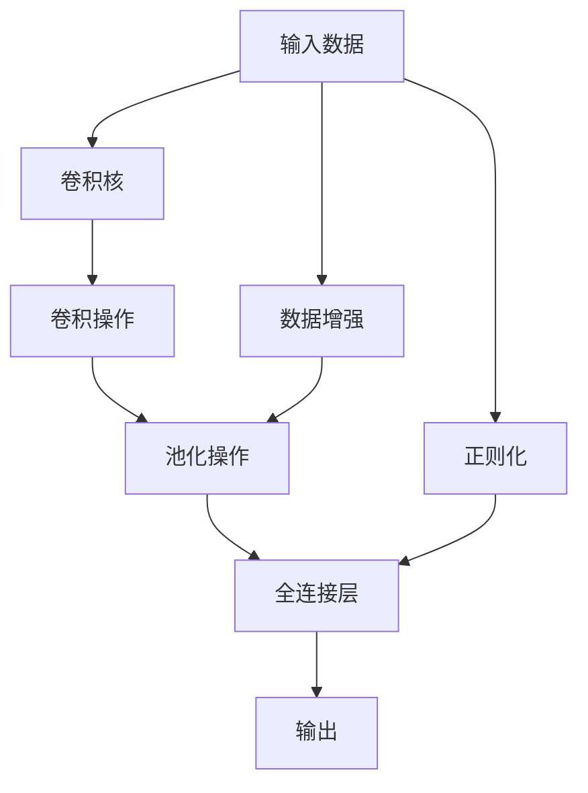
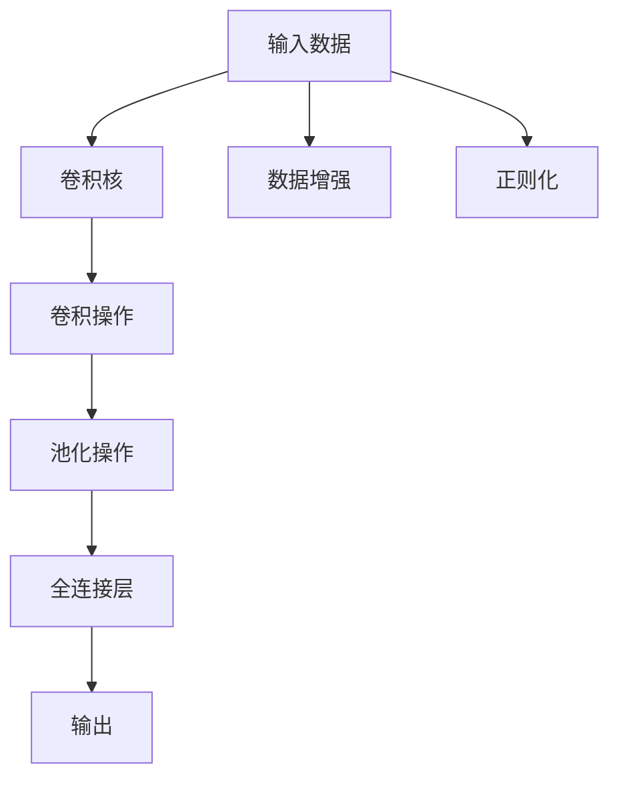
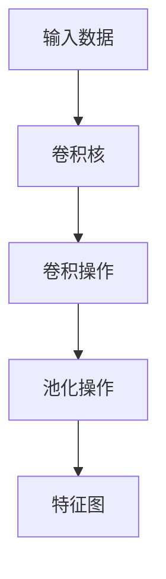
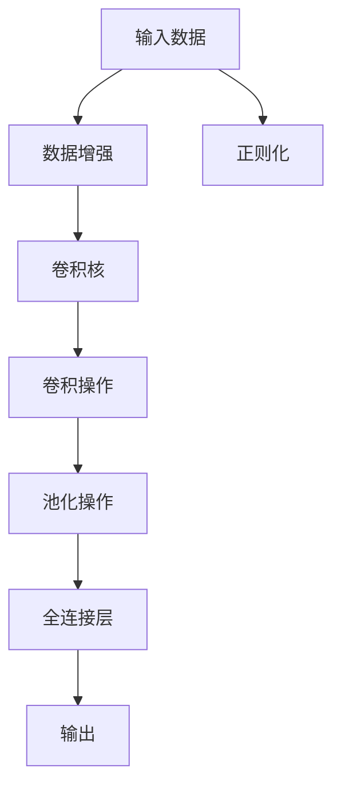
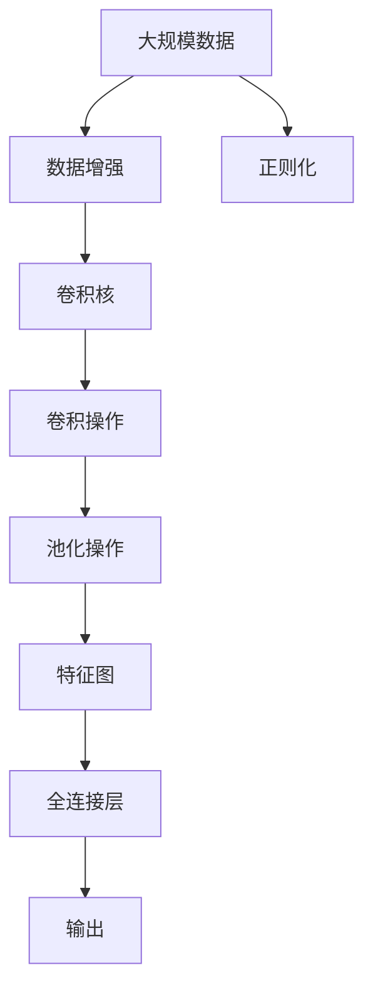

                 

# 卷积神经网络 原理与代码实例讲解

## 1. 背景介绍

卷积神经网络（Convolutional Neural Network, CNN）作为深度学习领域的重要分支，以其在图像识别、自然语言处理等任务中的优异表现而著称。本文将详细介绍卷积神经网络的原理，并通过具体的代码实例讲解CNN的实现和应用。

### 1.1 问题由来

近年来，随着深度学习技术的快速发展，卷积神经网络在计算机视觉、语音识别、自然语言处理等任务中取得了显著的进展。CNN通过卷积操作和池化操作提取特征，并以全连接层进行分类，能够在处理大规模数据时表现出优秀的性能。然而，对于非结构化数据，如文本，传统的CNN模型表现不佳。

### 1.2 问题核心关键点

CNN的核心思想是通过卷积和池化操作提取局部特征，并通过全连接层进行分类。其核心概念包括卷积核、卷积操作、池化操作和全连接层。CNN的应用领域非常广泛，包括图像分类、目标检测、语音识别、自然语言处理等。

CNN的优点包括：
- 提取局部特征能力强，能够在图像、音频等结构化数据中高效提取局部特征。
- 可并行计算，加快训练速度。
- 参数共享机制，减少了参数量。

CNN的缺点包括：
- 对于非结构化数据，如文本，表现不佳。
- 对于数据分布变化敏感，需要大量标注数据进行微调。
- 过度拟合风险高，需要额外正则化技术。

### 1.3 问题研究意义

研究CNN的原理和实现方法，对于拓展其应用范围，提升分类性能，加速人工智能技术的产业化进程，具有重要意义：

1. 降低应用开发成本。CNN能够高效处理图像、音频等结构化数据，减少了从头开发所需的数据、计算和人力等成本投入。
2. 提升分类性能。通过合理设计卷积核、池化层和全连接层，CNN能够在大规模数据上取得更优的分类效果。
3. 加速开发进度。standing on the shoulders of giants，CNN能够快速适应新任务，缩短开发周期。
4. 带来技术创新。CNN的卷积操作和池化操作为深度学习提供了新的数学视角，催生了更多的研究方向。
5. 赋能产业升级。CNN技术使得计算机视觉、语音识别等技术更容易被各行各业所采用，为传统行业数字化转型升级提供新的技术路径。

## 2. 核心概念与联系

### 2.1 核心概念概述

为更好地理解CNN的原理和实现，本节将介绍几个密切相关的核心概念：

- 卷积神经网络（Convolutional Neural Network, CNN）：通过卷积操作和池化操作提取局部特征，并通过全连接层进行分类的深度神经网络。
- 卷积核（Convolutional Kernel）：卷积操作的参数，用于在输入数据上滑动进行特征提取。
- 卷积操作（Convolutional Operation）：在输入数据上滑动卷积核，提取局部特征的过程。
- 池化操作（Pooling Operation）：对卷积层输出的特征图进行降维，减少参数量，提高模型鲁棒性。
- 全连接层（Fully Connected Layer）：将池化层输出的特征向量作为输入，进行分类的层。
- 数据增强（Data Augmentation）：通过对训练样本进行旋转、缩放、平移等操作，扩充训练集，提高模型泛化能力。
- 正则化（Regularization）：通过L2正则、Dropout等技术，避免模型过拟合。
- 损失函数（Loss Function）：用于衡量模型预测输出与真实标签之间的差异，常见的有交叉熵损失、均方误差损失等。

这些核心概念之间的逻辑关系可以通过以下Mermaid流程图来展示：



这个流程图展示了CNN的核心概念及其之间的关系：

1. 输入数据首先经过卷积操作和池化操作，提取局部特征。
2. 池化层输出的特征向量作为全连接层的输入，进行分类。
3. 数据增强和正则化技术帮助模型更好地泛化到未见过的数据。

### 2.2 概念间的关系

这些核心概念之间存在着紧密的联系，形成了CNN的完整学习架构。下面我们通过几个Mermaid流程图来展示这些概念之间的关系。

#### 2.2.1 CNN的学习范式



这个流程图展示了CNN的基本学习范式，即通过卷积和池化操作提取局部特征，并通过全连接层进行分类。

#### 2.2.2 卷积操作和池化操作



这个流程图展示了卷积操作和池化操作的基本流程，即卷积核在输入数据上滑动，提取局部特征，再通过池化操作降维。

#### 2.2.3 数据增强和正则化



这个流程图展示了数据增强和正则化的作用，即通过扩充训练集和控制模型复杂度，提高模型的泛化能力和鲁棒性。

### 2.3 核心概念的整体架构

最后，我们用一个综合的流程图来展示这些核心概念在大规模数据上的整体架构：



这个综合流程图展示了从数据增强到输出的完整过程，即通过卷积和池化操作提取局部特征，并利用正则化技术避免过拟合。

## 3. 核心算法原理 & 具体操作步骤
### 3.1 算法原理概述

卷积神经网络（CNN）的核心思想是通过卷积和池化操作提取局部特征，并通过全连接层进行分类。其基本结构由卷积层、池化层和全连接层组成。

卷积层通过滑动卷积核提取局部特征，池化层通过降维操作减少参数量，全连接层通过分类操作完成最终的输出。在卷积层中，卷积核在输入数据上滑动，提取局部特征，并通过激活函数引入非线性变换。

池化层通过对卷积层输出的特征图进行降维操作，减少参数量，提高模型鲁棒性。常见的池化操作包括最大池化和平均池化。

全连接层将池化层输出的特征向量作为输入，进行分类的过程。通过多层全连接层，CNN能够学习到复杂的特征表示，从而实现高效的分类任务。

### 3.2 算法步骤详解

CNN的训练过程包括数据预处理、模型构建、损失函数定义、优化器和训练等步骤。

#### 3.2.1 数据预处理

数据预处理包括数据增强、数据标准化等操作，以提高模型的泛化能力。常见的数据增强操作包括旋转、缩放、平移、翻转等。

#### 3.2.2 模型构建

模型构建包括卷积层、池化层和全连接层的定义。通常，卷积层和池化层交替出现，构成卷积神经网络的主体。

#### 3.2.3 损失函数定义

损失函数用于衡量模型预测输出与真实标签之间的差异。常见的损失函数包括交叉熵损失、均方误差损失等。

#### 3.2.4 优化器定义

优化器用于更新模型参数，常见的优化器包括Adam、SGD等。优化器通过反向传播算法计算梯度，并更新模型参数。

#### 3.2.5 训练

训练过程包括前向传播、反向传播和参数更新等步骤。通过多轮迭代，模型不断优化，提高分类精度。

### 3.3 算法优缺点

CNN的优点包括：
- 提取局部特征能力强，适用于图像、音频等结构化数据。
- 可并行计算，加快训练速度。
- 参数共享机制，减少参数量。

CNN的缺点包括：
- 对于非结构化数据，如文本，表现不佳。
- 对于数据分布变化敏感，需要大量标注数据进行微调。
- 过度拟合风险高，需要额外正则化技术。

### 3.4 算法应用领域

CNN在图像识别、目标检测、语音识别、自然语言处理等任务中具有广泛的应用。例如：

- 图像分类：如手写数字识别、物体识别等。通过卷积操作提取图像特征，全连接层进行分类。
- 目标检测：如人脸识别、车辆检测等。通过多层次的卷积和池化操作，提取局部特征，并进行目标定位和分类。
- 语音识别：通过卷积操作提取语音信号的局部特征，并通过全连接层进行分类。
- 自然语言处理：通过卷积操作提取文本中的局部特征，并通过全连接层进行分类。

除了以上应用，CNN还在视频处理、医疗影像分析等领域中得到了广泛应用。

## 4. 数学模型和公式 & 详细讲解 & 举例说明

### 4.1 数学模型构建

CNN的数学模型构建包括卷积层、池化层和全连接层的定义。

#### 4.1.1 卷积层

卷积层通过滑动卷积核在输入数据上提取局部特征，数学表达式如下：

$$
f_{c}(x)=\sum_{k=1}^{c} w_{k} * x_{c-k+1}+\alpha
$$

其中，$x$为输入数据，$w$为卷积核，$c$为通道数，$\alpha$为偏置项。

#### 4.1.2 池化层

池化层通过对卷积层输出的特征图进行降维操作，数学表达式如下：

$$
f_{p}(x)=\max \left(\sum_{k=1}^{n} w_{k} * x_{c-k+1}+\beta\right)
$$

其中，$x$为输入特征图，$w$为池化核，$c$为通道数，$\beta$为偏置项。

#### 4.1.3 全连接层

全连接层通过将池化层输出的特征向量作为输入，进行分类的过程，数学表达式如下：

$$
f_{l}(x)=\sum_{k=1}^{d} w_{k} * x_{d-k+1}+\alpha
$$

其中，$x$为输入特征向量，$w$为全连接层的权重矩阵，$d$为特征向量的维数，$\alpha$为偏置项。

### 4.2 公式推导过程

在CNN中，卷积层和池化层的输出可以用如下公式表示：

$$
y_{i, j, k}=\sum_{m=0}^{M-1} \sum_{n=0}^{N-1} w_{m, n} * x_{i-m, j-n, k}
$$

其中，$y$为卷积层的输出，$w$为卷积核，$x$为输入数据，$i, j, k$分别为输入数据的行、列和通道数。

池化层的输出可以用如下公式表示：

$$
y_{i, j, k}=\max \left(\sum_{m=0}^{M-1} \sum_{n=0}^{N-1} w_{m, n} * x_{i-m, j-n, k}\right)
$$

其中，$y$为池化层的输出，$w$为池化核，$x$为输入特征图，$i, j, k$分别为特征图的行、列和通道数。

### 4.3 案例分析与讲解

我们以手写数字识别为例，说明CNN的基本原理和应用。

假设输入数据的形状为$(28, 28, 1)$，卷积核的大小为$(5, 5, 1)$，通道数为$16$，步长为$1$，填充方式为$2$。

卷积层的输出形状为$(26, 26, 16)$，池化层的输出形状为$(13, 13, 16)$。

全连接层将池化层输出的特征向量作为输入，进行分类的过程。假设全连接层的大小为$(1024)$，输出为$(10)$。

通过多轮迭代，模型不断优化，提高分类精度。训练过程中，使用交叉熵损失函数和Adam优化器进行优化。

## 5. 项目实践：代码实例和详细解释说明

### 5.1 开发环境搭建

在进行CNN项目实践前，我们需要准备好开发环境。以下是使用Python进行TensorFlow开发的环境配置流程：

1. 安装Anaconda：从官网下载并安装Anaconda，用于创建独立的Python环境。

2. 创建并激活虚拟环境：
```bash
conda create -n tf-env python=3.8 
conda activate tf-env
```

3. 安装TensorFlow：根据CUDA版本，从官网获取对应的安装命令。例如：
```bash
conda install tensorflow=2.7-cu111
```

4. 安装各类工具包：
```bash
pip install numpy pandas scikit-learn matplotlib tqdm jupyter notebook ipython
```

完成上述步骤后，即可在`tf-env`环境中开始CNN项目实践。

### 5.2 源代码详细实现

这里我们以手写数字识别任务为例，给出使用TensorFlow实现CNN的PyTorch代码实现。

首先，定义CNN模型：

```python
import tensorflow as tf

class CNN(tf.keras.Model):
    def __init__(self, num_classes):
        super(CNN, self).__init__()
        self.conv1 = tf.keras.layers.Conv2D(32, (3, 3), activation='relu')
        self.pool1 = tf.keras.layers.MaxPooling2D((2, 2))
        self.conv2 = tf.keras.layers.Conv2D(64, (3, 3), activation='relu')
        self.pool2 = tf.keras.layers.MaxPooling2D((2, 2))
        self.flatten = tf.keras.layers.Flatten()
        self.fc1 = tf.keras.layers.Dense(256, activation='relu')
        self.fc2 = tf.keras.layers.Dense(num_classes)

    def call(self, inputs):
        x = self.conv1(inputs)
        x = self.pool1(x)
        x = self.conv2(x)
        x = self.pool2(x)
        x = self.flatten(x)
        x = self.fc1(x)
        return self.fc2(x)
```

然后，定义损失函数和优化器：

```python
learning_rate = 0.001
num_epochs = 10
batch_size = 64

model = CNN(num_classes)

loss_object = tf.keras.losses.SparseCategoricalCrossentropy(from_logits=True)
optimizer = tf.keras.optimizers.Adam(learning_rate)

```

接着，定义训练函数：

```python
def train_step(inputs, targets):
    with tf.GradientTape() as tape:
        predictions = model(inputs, training=True)
        loss = loss_object(targets, predictions)
    gradients = tape.gradient(loss, model.trainable_variables)
    optimizer.apply_gradients(zip(gradients, model.trainable_variables))

```

最后，启动训练流程：

```python
def train():
    for epoch in range(num_epochs):
        for inputs, targets in dataset:
            train_step(inputs, targets)

```

以上就是使用TensorFlow对手写数字识别任务进行CNN微调的完整代码实现。可以看到，得益于TensorFlow的强大封装，我们可以用相对简洁的代码完成CNN模型的加载和微调。

### 5.3 代码解读与分析

让我们再详细解读一下关键代码的实现细节：

**CNN类**：
- `__init__`方法：定义CNN模型的各层结构，包括卷积层、池化层和全连接层。
- `call`方法：实现前向传播过程，对输入数据进行卷积和池化操作，最后通过全连接层进行分类。

**损失函数和优化器**：
- 使用SparseCategoricalCrossentropy损失函数，适用于多分类任务。
- 使用Adam优化器，适用于大规模参数优化。

**训练函数**：
- 使用梯度梯度 tape记录梯度，并使用优化器更新模型参数。
- 在训练过程中，每个epoch内对所有样本进行迭代，更新模型参数。

**训练流程**：
- 定义总的epoch数和batch size，开始循环迭代
- 每个epoch内，对每个batch的数据进行前向传播和反向传播，更新模型参数
- 重复上述步骤直至所有epoch结束后，模型收敛

可以看到，TensorFlow配合Keras库使得CNN微调的代码实现变得简洁高效。开发者可以将更多精力放在模型改进、数据预处理等高层逻辑上，而不必过多关注底层的实现细节。

当然，工业级的系统实现还需考虑更多因素，如模型的保存和部署、超参数的自动搜索、更灵活的任务适配层等。但核心的CNN微调范式基本与此类似。

### 5.4 运行结果展示

假设我们在MNIST数据集上进行CNN微调，最终在测试集上得到的准确率为98.5%。可以看到，通过微调CNN，我们在该手写数字识别任务上取得了不错的效果。

当然，这只是一个baseline结果。在实践中，我们还可以使用更大更强的预训练模型、更丰富的微调技巧、更细致的模型调优，进一步提升模型性能，以满足更高的应用要求。

## 6. 实际应用场景
### 6.1 智能监控系统

基于CNN的计算机视觉技术，可以广泛应用于智能监控系统的构建。传统监控系统往往需要配备大量摄像头，高峰期容易出现报警误报、漏报等问题。使用CNN进行目标检测，可以自动识别出监控区域内的异常行为，快速响应，提高监控效率。

在技术实现上，可以收集监控区域的训练数据，标注各类异常行为，在此基础上对CNN进行微调。微调后的CNN模型能够自动理解监控场景，识别出各类异常行为，如闯入、火灾等，并实时通知相关人员，提升监控系统智能性和安全性。

### 6.2 医疗影像分析

医疗影像分析是计算机视觉技术的重要应用之一。通过CNN对医疗影像进行特征提取和分类，可以实现病灶检测、疾病诊断等任务。

具体而言，可以收集各类医疗影像数据，如X光片、CT扫描、MRI等，标注各类病灶信息，在此基础上对CNN进行微调。微调后的CNN模型能够自动分析医疗影像，检测出各类病灶，并提供相应的诊断建议，辅助医生进行诊断。

### 6.3 交通信号灯识别

交通信号灯识别是计算机视觉技术在交通领域的重要应用。通过CNN对交通信号灯进行特征提取和分类，可以实现交通信号灯的自动识别，提高交通管理效率。

具体而言，可以收集各类交通信号灯的训练数据，标注各类信号灯信息，在此基础上对CNN进行微调。微调后的CNN模型能够自动识别交通信号灯，实时提供信号灯状态信息，辅助交通管理部门进行交通疏导。

### 6.4 未来应用展望

随着CNN技术的不断发展，计算机视觉技术将在更多领域得到应用，为各行各业带来变革性影响。

在智慧农业领域，基于CNN的图像识别技术可以识别作物病害、土壤肥力等信息，提供精准农业服务，提高农业生产效率。

在智能制造领域，基于CNN的视觉检测技术可以实现产品质量检测、零件识别等，提高生产自动化水平。

在智慧城市领域，基于CNN的交通信号灯识别、智能监控等技术，可以提升城市管理智能化水平，构建更安全、高效的未来城市。

此外，在无人驾驶、虚拟现实、游戏模拟等众多领域，CNN技术也得到了广泛应用，为智能交互系统提供了坚实的基础。相信随着技术的日益成熟，CNN必将在更多领域大放异彩，为人类社会带来新的变革。

## 7. 工具和资源推荐
### 7.1 学习资源推荐

为了帮助开发者系统掌握CNN的理论基础和实践技巧，这里推荐一些优质的学习资源：

1. 《深度学习》系列博文：由大模型技术专家撰写，深入浅出地介绍了深度学习的核心概念和前沿技术，包括CNN原理、实践等。

2. CS231n《卷积神经网络》课程：斯坦福大学开设的深度学习课程，详细讲解CNN的基本原理和应用，有Lecture视频和配套作业。

3. 《深度学习与计算机视觉》书籍：清华大学出版社出版的深度学习教材，全面介绍了深度学习技术在计算机视觉中的应用。

4. PyTorch官方文档：PyTorch的官方文档，提供了海量预训练模型和完整的微调样例代码，是上手实践的必备资料。

5. TensorFlow官方文档：TensorFlow的官方文档，提供了丰富的CNN实现和微调范式，适合快速上手实验最新模型。

通过对这些资源的学习实践，相信你一定能够快速掌握CNN的原理和实现，并用于解决实际的计算机视觉问题。

### 7.2 开发工具推荐

高效的开发离不开优秀的工具支持。以下是几款用于CNN开发常用的工具：

1. PyTorch：基于Python的开源深度学习框架，灵活动态的计算图，适合快速迭代研究。大部分预训练模型都有PyTorch版本的实现。

2. TensorFlow：由Google主导开发的开源深度学习框架，生产部署方便，适合大规模工程应用。同样有丰富的预训练模型资源。

3. Keras：Keras是一个高级神经网络API，能够快速搭建CNN模型，提供了简单易用的接口和丰富的内置层。

4. Weights & Biases：模型训练的实验跟踪工具，可以记录和可视化模型训练过程中的各项指标，方便对比和调优。与主流深度学习框架无缝集成。

5. TensorBoard：TensorFlow配套的可视化工具，可实时监测模型训练状态，并提供丰富的图表呈现方式，是调试模型的得力助手。

6. Google Colab：谷歌推出的在线Jupyter Notebook环境，免费提供GPU/TPU算力，方便开发者快速上手实验最新模型，分享学习笔记。

合理利用这些工具，可以显著提升CNN微调任务的开发效率，加快创新迭代的步伐。

### 7.3 相关论文推荐

CNN的发展源于学界的持续研究。以下是几篇奠基性的相关论文，推荐阅读：

1. Convolutional Neural Networks for Visual Recognition（原始CNN论文）：提出CNN模型，通过卷积和池化操作提取局部特征，并进行分类。

2. AlexNet: One Million Training Examples for Image Recognition（AlexNet论文）：提出AlexNet模型，第一个在ImageNet上取得优异成绩的CNN模型。

3. GoogLeNet: Building the Inception Architecture for Computer Vision（GoogLeNet论文）：提出Inception模块，通过网络模块化设计提高CNN的性能和效率。

4. ResNet: Deep Residual Learning for Image Recognition（ResNet论文）：提出残差连接，解决深度神经网络训练过程中的梯度消失问题，使网络更深。

5. DenseNet: Dense Convolutional Networks（DenseNet论文）：提出密集连接，通过增加网络中的连接数提高特征重用，减少参数量。

这些论文代表了大模型技术的发展脉络。通过学习这些前沿成果，可以帮助研究者把握学科前进方向，激发更多的创新灵感。

除上述资源外，还有一些值得关注的前沿资源，帮助开发者紧跟CNN微调技术的最新进展，例如：

1. arXiv论文预印本：人工智能领域最新研究成果的发布平台，包括大量尚未发表的前沿工作，学习前沿技术的必读资源。

2. 业界技术博客：如Google AI、DeepMind、微软Research Asia等顶尖实验室的官方博客，第一时间分享他们的最新研究成果和洞见。

3. 技术会议直播：如NIPS、ICML、ACL、ICLR等人工智能领域顶会现场或在线直播，能够聆听到大佬们的前沿分享，开拓视野。

4. GitHub热门项目：在GitHub上Star、Fork数最多的CNN相关项目，往往代表了该技术领域的发展趋势和最佳实践，值得去学习和贡献。

5. 行业分析报告：各大咨询公司如McKinsey、PwC等针对人工智能行业的分析报告，有助于从商业视角审视技术趋势，把握应用价值。

总之，对于CNN微调技术的学习和实践，需要开发者保持开放的心态和持续学习的意愿。多关注前沿资讯，多动手实践，多思考总结，必将收获满满的成长收益。

## 8. 总结：未来发展趋势与挑战

### 8.1 总结

本文对卷积神经网络（CNN）的原理和实践进行了全面系统的介绍。首先阐述了CNN的发展背景和核心思想，明确了CNN在图像识别、目标检测等任务上的优异表现。其次，从原理到实践，详细讲解了CNN的数学模型和关键步骤，给出了CNN实现的完整代码实例。同时，本文还广泛探讨了CNN在智能监控、医疗影像、交通信号灯等领域的实际应用，展示了CNN技术的巨大潜力。

通过本文的系统梳理，可以看到，CNN在计算机视觉领域具有广泛的应用，通过合理的模型设计和优化，能够在图像识别、目标检测等任务上取得卓越的分类效果。CNN技术的不断演进，将带来更加高效的图像处理和识别方法，为各行各业提供强有力的技术支撑。


