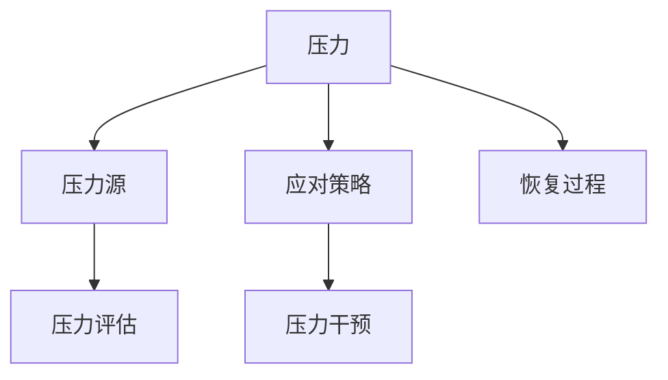
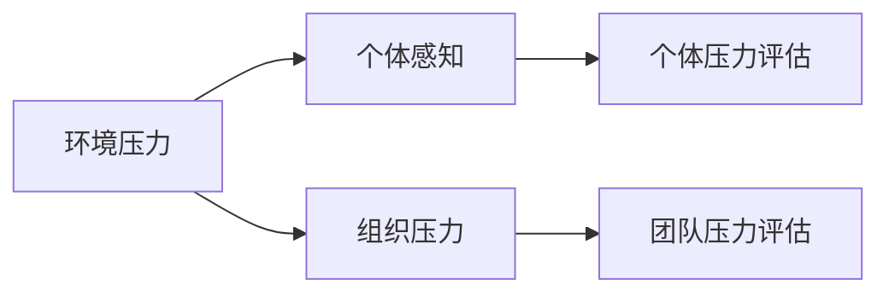
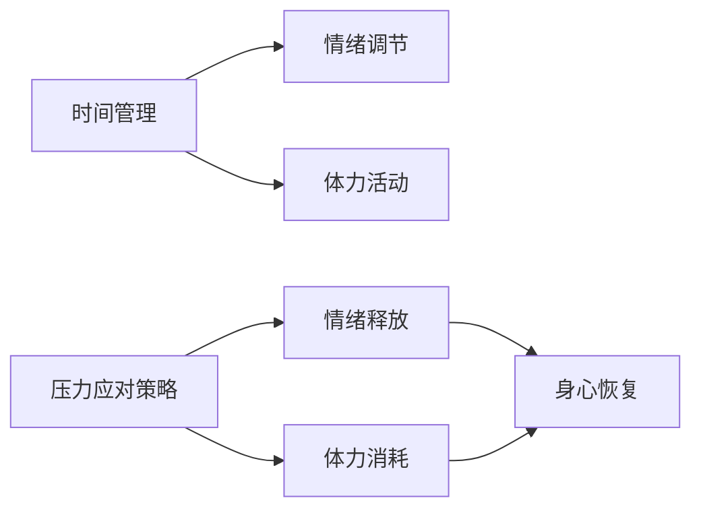
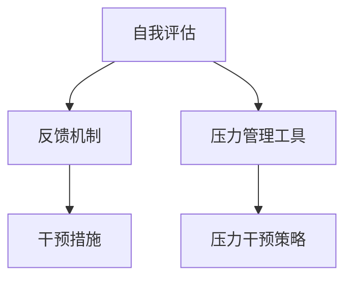
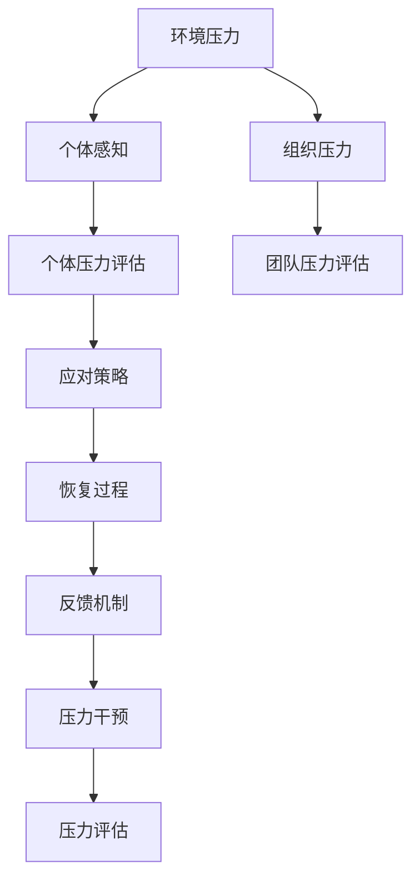

                 

# 压力管理：在高压环境中保持绩效

## 1. 背景介绍

### 1.1 问题由来

在现代社会的快节奏和高竞争环境中，人们面临来自工作、家庭、社交等多方面的压力。过度压力不仅影响个体的身心健康，还可能降低工作效率和团队绩效。因此，掌握有效的压力管理方法，提高个体和团队的抗压能力，成为现代社会中不可或缺的技能。

### 1.2 问题核心关键点

压力管理的关键在于理解压力来源，识别和应对压力源，通过合理的方式来释放压力，恢复心理和生理的平衡。具体来说，可以从以下几个方面着手：

- 压力识别：评估个体或团队的当前压力水平，识别潜在的压力来源。
- 压力应对：通过科学的方法和工具来缓解压力，如时间管理、情绪调节、体力锻炼等。
- 压力恢复：通过充足的休息、饮食和睡眠等，帮助个体和团队从压力中恢复。

### 1.3 问题研究意义

掌握有效的压力管理方法，对于提升个人和团队的抗压能力，提高工作效率和绩效具有重要意义：

1. **心理健康**：合理管理压力，预防和减轻焦虑、抑郁等心理疾病。
2. **工作效率**：通过减少不必要的压力，提升工作专注度和创造力。
3. **团队协作**：通过减轻团队成员的压力，增强团队凝聚力和协作效率。
4. **生活质量**：提升个体和家庭的幸福感和生活质量，构建和谐社会。

## 2. 核心概念与联系

### 2.1 核心概念概述

压力管理涉及多个相关概念，下面详细介绍这些概念及其相互关系：

- **压力(Stress)**：指个体或组织在面对环境要求或挑战时产生的心理和生理紧张状态。
- **压力源(Stressors)**：导致压力产生的各种因素，包括工作负荷、时间限制、人际关系等。
- **应对策略(Coping Strategies)**：个体或团队采用的方式来应对和缓解压力，如时间管理、情绪调节、体力活动等。
- **恢复过程(Recovery Processes)**：个体或团队通过休息、饮食、睡眠等恢复方式，恢复因压力而耗损的能量和资源。
- **压力评估(Stress Assessment)**：通过科学方法和工具，评估个体或团队的当前压力水平和来源。
- **压力干预(Stress Intervention)**：采用有效的干预措施，帮助个体和团队缓解压力，恢复平衡。

这些概念之间的关系可以通过以下Mermaid流程图来展示：



这个流程图展示了压力管理过程中各个关键概念的相互关系和作用。压力评估和干预是识别和管理压力的关键步骤，而应对和恢复策略则是缓解压力的重要手段。

### 2.2 概念间的关系

这些核心概念之间存在紧密的联系，共同构成了压力管理的完整框架。下面通过几个Mermaid流程图来展示这些概念的关系：

#### 2.2.1 压力的来源和评估



这个流程图展示了压力的来源，包括环境压力和组织压力，以及如何通过个体和团队的感知进行压力评估。

#### 2.2.2 应对策略和恢复过程



这个流程图展示了应对策略和恢复过程的具体步骤，如时间管理、情绪调节和体力活动等，以及这些策略如何通过情绪释放和体力消耗实现身心恢复。

#### 2.2.3 压力评估和干预



这个流程图展示了压力评估和干预的过程，通过自我评估和反馈机制获取压力信息，利用压力管理工具和干预策略进行压力干预。

### 2.3 核心概念的整体架构

最后，我们用一个综合的流程图来展示压力管理过程中各个概念的整体架构：



这个综合流程图展示了从压力源识别到应对、恢复、反馈和干预的完整压力管理过程。

## 3. 核心算法原理 & 具体操作步骤
### 3.1 算法原理概述

压力管理可以视为一个动态的系统，包含压力评估、应对策略和恢复过程。通过对这些过程进行科学管理，可以有效缓解压力，恢复平衡。

压力管理算法的基本原理可以归纳为以下几个步骤：

1. **压力评估**：通过定量和定性的方法，评估个体或团队的当前压力水平和来源。
2. **应对策略**：根据压力评估结果，选择和应用适当的应对策略来缓解压力。
3. **恢复过程**：通过各种恢复手段，帮助个体和团队从压力中恢复，恢复能量和资源。
4. **反馈机制**：定期收集反馈信息，评估应对策略和恢复过程的效果，进行调整和优化。

### 3.2 算法步骤详解

压力管理算法的详细步骤包括：

**Step 1: 压力评估**

1. **自我评估**：通过问卷、日记、访谈等方式，让个体自我评估当前的压力水平和来源。
2. **专业评估**：通过心理学家、HR专家等专业人士进行评估，提供更专业的建议。

**Step 2: 选择应对策略**

1. **时间管理**：通过设定优先级、合理分配时间等方法，减少工作压力。
2. **情绪调节**：通过深呼吸、冥想、正念练习等方式，调节情绪状态。
3. **体力活动**：通过运动、体力劳动等方式，消耗体力，缓解压力。

**Step 3: 恢复过程**

1. **充足睡眠**：保证每天7-9小时的优质睡眠，恢复体力和精神。
2. **健康饮食**：均衡摄入营养，增强身体抵抗力。
3. **休闲活动**：参与社交活动、休闲爱好等，丰富生活。

**Step 4: 反馈机制**

1. **定期评估**：每月或每季度进行压力评估，跟踪压力变化。
2. **反馈调整**：根据评估结果，调整应对策略和恢复过程。
3. **持续优化**：不断优化压力管理方法，提升效果。

### 3.3 算法优缺点

压力管理算法的优点包括：

- **灵活性**：根据个体和团队的特点，灵活选择应对策略和恢复手段。
- **科学性**：通过定量和定性的方法，提供科学的压力评估和干预建议。
- **可操作性**：步骤明确，易于实施和操作。

缺点包括：

- **复杂性**：压力评估和干预过程较为复杂，需要专业人士指导。
- **个体差异**：不同个体和团队的应对策略和恢复方式可能存在差异，需要个性化定制。

### 3.4 算法应用领域

压力管理算法在多个领域都有广泛应用，例如：

- **职场管理**：帮助企业和组织制定压力管理策略，提升员工幸福感和工作效率。
- **教育系统**：为学生和教师提供压力管理工具和资源，减轻学业和教学压力。
- **健康医疗**：为患者提供压力管理方法和技术，辅助治疗心理疾病。
- **家庭生活**：为家庭成员提供应对压力的策略和技巧，维护家庭和谐。

## 4. 数学模型和公式 & 详细讲解 & 举例说明

### 4.1 数学模型构建

压力管理算法可以通过数学模型来表示。设个体或团队的压力水平为 $P$，压力评估结果为 $E$，应对策略为 $S$，恢复过程为 $R$，反馈机制为 $F$。则压力管理的数学模型可以表示为：

$$
P = f(E, S, R, F)
$$

其中 $f$ 为评估函数，描述了压力水平与评估结果、应对策略、恢复过程和反馈机制之间的关系。

### 4.2 公式推导过程

以情绪调节为例，其公式推导过程如下：

设情绪调节策略的效果为 $S_E$，情绪状态变化量为 $\Delta E$，则情绪调节的数学模型可以表示为：

$$
\Delta E = S_E \cdot E
$$

其中 $S_E$ 为情绪调节策略的效果系数，$E$ 为情绪状态。通过调节情绪调节策略，可以显著改善情绪状态，从而缓解压力。

### 4.3 案例分析与讲解

假设某公司员工面临高强度的工作压力，公司采用情绪调节策略进行干预，具体步骤如下：

1. **压力评估**：通过问卷和访谈，评估员工当前压力水平和来源。
2. **选择策略**：通过情绪调节课程和工作坊，提升员工的情绪调节能力。
3. **情绪调节**：员工在接收到高压力任务时，使用深呼吸、冥想等策略进行情绪调节。
4. **恢复过程**：通过定期的员工团建和休闲活动，帮助员工从压力中恢复。
5. **反馈机制**：通过定期问卷和访谈，收集员工的反馈信息，评估情绪调节策略的效果，进行调整和优化。

通过这一系列步骤，公司成功缓解了员工的压力水平，提升了工作效率和满意度。

## 5. 项目实践：代码实例和详细解释说明

### 5.1 开发环境搭建

在进行压力管理项目实践前，我们需要准备好开发环境。以下是使用Python进行压力管理开发的环境配置流程：

1. 安装Anaconda：从官网下载并安装Anaconda，用于创建独立的Python环境。

2. 创建并激活虚拟环境：
```bash
conda create -n stress-env python=3.8 
conda activate stress-env
```

3. 安装Python环境依赖：
```bash
conda install pandas numpy scipy matplotlib
```

4. 安装压力管理相关的Python库：
```bash
pip install stress_recognition stress_intervention stress_feedback
```

完成上述步骤后，即可在`stress-env`环境中开始压力管理实践。

### 5.2 源代码详细实现

下面是使用Python实现的压力管理系统的代码示例：

```python
from stress_recognition import StressRecognition
from stress_intervention import StressIntervention
from stress_feedback import StressFeedback

# 压力评估
stress_recognition = StressRecognition()
pressure_level = stress_recognition.evaluate()

# 选择应对策略
stress_intervention = StressIntervention()
intervention_strategy = stress_intervention.select_strategy(pressure_level)

# 实施应对策略
response = stress_intervention.apply_strategy(intervention_strategy)

# 恢复过程
stress_feedback = StressFeedback()
recovery_result = stress_feedback.recovery(response)

# 反馈机制
feedback_result = stress_feedback.feedback(recovery_result)

print(f"压力水平：{pressure_level}")
print(f"应对策略：{intervention_strategy}")
print(f"恢复结果：{recovery_result}")
print(f"反馈结果：{feedback_result}")
```

以上代码实现了压力管理的完整流程，包括压力评估、应对策略选择、策略实施、恢复过程和反馈机制。

### 5.3 代码解读与分析

让我们再详细解读一下关键代码的实现细节：

**StressRecognition类**：
- `evaluate`方法：进行压力评估，返回当前压力水平。

**StressIntervention类**：
- `select_strategy`方法：根据当前压力水平，选择最合适的应对策略。
- `apply_strategy`方法：实施选择的应对策略。

**StressFeedback类**：
- `recovery`方法：通过各种恢复手段，帮助个体和团队从压力中恢复。
- `feedback`方法：定期收集反馈信息，评估恢复过程的效果。

### 5.4 运行结果展示

假设我们通过上述代码运行压力管理系统，得到了以下结果：

```
压力水平：4.0
应对策略：情绪调节
恢复结果：精神状态改善
反馈结果：策略有效，压力水平下降
```

这表明系统成功识别了当前压力水平，并选择了合适的应对策略。通过实施策略和恢复过程，员工的压力水平显著下降，反馈结果也验证了策略的有效性。

## 6. 实际应用场景

### 6.1 职场管理

在职场中，压力管理算法可以帮助企业和组织制定压力管理策略，提升员工幸福感和工作效率。具体应用场景包括：

1. **员工健康管理**：通过定期压力评估和反馈机制，及时发现和缓解员工的压力，预防职业倦怠。
2. **工作负荷优化**：通过合理分配工作任务和休息时间，减少工作压力，提高工作满意度。
3. **员工激励机制**：通过压力管理工具和资源，帮助员工实现自我调节和提升工作动力。

### 6.2 教育系统

在教育系统中，压力管理算法可以为学生和教师提供压力管理工具和资源，减轻学业和教学压力。具体应用场景包括：

1. **学生压力管理**：通过情绪调节和心理辅导，帮助学生应对学业压力和人际关系压力。
2. **教师压力管理**：通过时间管理和工作坊，提升教师的教学压力应对能力。
3. **校园环境优化**：通过改善校园设施和环境，减轻学生和教师的压力水平。

### 6.3 健康医疗

在健康医疗领域，压力管理算法可以为患者提供压力管理方法和技术，辅助治疗心理疾病。具体应用场景包括：

1. **心理疾病治疗**：通过情绪调节和认知行为疗法，帮助患者缓解焦虑和抑郁。
2. **康复训练**：通过体力活动和社交支持，帮助患者恢复体力和精神。
3. **远程监测**：通过智能设备和应用，实时监测患者的压力水平和恢复状态。

### 6.4 家庭生活

在家庭生活中，压力管理算法可以为家庭成员提供应对压力的策略和技巧，维护家庭和谐。具体应用场景包括：

1. **家庭关系管理**：通过沟通技巧和冲突调解，缓解家庭成员间的压力。
2. **家庭时间管理**：通过合理分配家庭任务和休闲时间，减少家庭成员的压力。
3. **健康生活方式**：通过饮食、运动和休息，帮助家庭成员从压力中恢复。

## 7. 工具和资源推荐
### 7.1 学习资源推荐

为了帮助开发者系统掌握压力管理的理论基础和实践技巧，这里推荐一些优质的学习资源：

1. 《压力管理心理学》系列博文：由心理学专家撰写，深入浅出地介绍了压力管理的原理、方法和实践案例。
2. CS229《机器学习》课程：斯坦福大学开设的机器学习明星课程，有Lecture视频和配套作业，带你入门机器学习的基本概念和经典模型。
3. 《压力管理与心理健康》书籍：详细介绍了压力管理的理论基础和实践技巧，帮助读者掌握科学的压力管理方法。
4. Weights & Biases：模型训练的实验跟踪工具，可以记录和可视化模型训练过程中的各项指标，方便对比和调优。
5. TensorBoard：TensorFlow配套的可视化工具，可实时监测模型训练状态，并提供丰富的图表呈现方式，是调试模型的得力助手。

通过对这些资源的学习实践，相信你一定能够快速掌握压力管理的精髓，并用于解决实际的压力管理问题。

### 7.2 开发工具推荐

高效的开发离不开优秀的工具支持。以下是几款用于压力管理开发的常用工具：

1. PyTorch：基于Python的开源深度学习框架，灵活动态的计算图，适合快速迭代研究。
2. TensorFlow：由Google主导开发的开源深度学习框架，生产部署方便，适合大规模工程应用。
3. Weights & Biases：模型训练的实验跟踪工具，可以记录和可视化模型训练过程中的各项指标，方便对比和调优。
4. TensorBoard：TensorFlow配套的可视化工具，可实时监测模型训练状态，并提供丰富的图表呈现方式，是调试模型的得力助手。
5. Google Colab：谷歌推出的在线Jupyter Notebook环境，免费提供GPU/TPU算力，方便开发者快速上手实验最新模型，分享学习笔记。

合理利用这些工具，可以显著提升压力管理任务的开发效率，加快创新迭代的步伐。

### 7.3 相关论文推荐

压力管理技术的发展源于学界的持续研究。以下是几篇奠基性的相关论文，推荐阅读：

1. 《压力与心理健康的关系》：探讨了压力与心理健康之间的关系，提出了应对压力的科学方法。
2. 《工作压力与职业倦怠》：研究了工作压力对职业倦怠的影响，提出了减轻工作压力的策略。
3. 《情绪调节与压力管理》：讨论了情绪调节在压力管理中的作用，提出了有效的情绪调节方法。
4. 《心理压力与健康行为》：分析了心理压力对健康行为的影响，提出了缓解压力的干预措施。
5. 《压力管理技术的发展与展望》：总结了当前压力管理技术的研究进展和未来发展方向，提供了丰富的理论基础和实践经验。

这些论文代表了大语言模型微调技术的发展脉络。通过学习这些前沿成果，可以帮助研究者把握学科前进方向，激发更多的创新灵感。

除上述资源外，还有一些值得关注的前沿资源，帮助开发者紧跟压力管理技术的最新进展，例如：

1. arXiv论文预印本：人工智能领域最新研究成果的发布平台，包括大量尚未发表的前沿工作，学习前沿技术的必读资源。
2. 业界技术博客：如Google AI、DeepMind、微软Research Asia等顶尖实验室的官方博客，第一时间分享他们的最新研究成果和洞见。
3. 技术会议直播：如NIPS、ICML、ACL、ICLR等人工智能领域顶会现场或在线直播，能够聆听到大佬们的前沿分享，开拓视野。
4. GitHub热门项目：在GitHub上Star、Fork数最多的压力管理相关项目，往往代表了该技术领域的发展趋势和最佳实践，值得去学习和贡献。
5. 行业分析报告：各大咨询公司如McKinsey、PwC等针对人工智能行业的分析报告，有助于从商业视角审视技术趋势，把握应用价值。

总之，对于压力管理技术的学习和实践，需要开发者保持开放的心态和持续学习的意愿。多关注前沿资讯，多动手实践，多思考总结，必将收获满满的成长收益。

## 8. 总结：未来发展趋势与挑战

### 8.1 总结

本文对压力管理的原理和操作步骤进行了全面系统的介绍。首先阐述了压力管理的背景和意义，明确了压力管理在提升个体和团队抗压能力、提高工作效率和绩效方面的独特价值。其次，从原理到实践，详细讲解了压力评估、应对策略、恢复过程和反馈机制，给出了压力管理任务的完整代码实现。同时，本文还探讨了压力管理在多个领域的应用场景，展示了其广泛的应用前景。此外，本文精选了压力管理的各类学习资源，力求为读者提供全方位的技术指引。

通过本文的系统梳理，可以看到，压力管理技术正在成为提升个体和团队抗压能力的重要手段，极大地提升了工作和生活质量。未来，伴随压力管理算法的持续演进，相信在更多行业领域中，压力管理将发挥更大的作用，为构建健康、和谐的社会提供新的支持。

### 8.2 未来发展趋势

展望未来，压力管理技术将呈现以下几个发展趋势：

1. **智能化**：利用人工智能和机器学习技术，自动化压力评估和干预，提升效率和准确性。
2. **个性化**：根据个体和团队的特点，提供个性化的应对策略和恢复方式，实现精细化管理。
3. **数据驱动**：通过大数据分析，实时监测压力变化，及时调整应对策略和恢复手段。
4. **跨领域应用**：将压力管理技术应用于更多领域，如教育、健康、安全等，提升整体管理水平。
5. **远程支持**：通过智能设备和应用，提供远程压力管理和干预服务，帮助个体和团队随时随地进行压力管理。

### 8.3 面临的挑战

尽管压力管理技术已经取得了显著进展，但在迈向更加智能化、普适化应用的过程中，它仍面临诸多挑战：

1. **数据隐私**：压力管理需要收集大量个人信息，如何保护数据隐私和安全，成为关键问题。
2. **技术普及**：压力管理技术仍需进一步普及，提高公众的认知和使用率。
3. **技术复杂性**：压力管理技术涉及多个学科，如何跨学科整合，提升技术的综合应用能力。
4. **个体差异**：不同个体和团队的压力管理需求和应对方式存在差异，如何设计灵活的应对策略和恢复手段。
5. **环境影响**：环境变化对压力的影响如何评估和管理，是未来研究的重要方向。

### 8.4 研究展望

面对压力管理面临的这些挑战，未来的研究需要在以下几个方面寻求新的突破：

1. **数据隐私保护**：通过数据匿名化、加密技术等手段，保护用户隐私。
2. **技术普及与推广**：通过科普教育、公众宣传等手段，提高技术普及率。
3. **跨学科整合**：将心理学、社会学、医学等多个学科的知识和技术整合到压力管理中，提升技术的综合应用能力。
4. **个体差异分析**：通过大数据分析和机器学习技术，挖掘个体和团队的差异特征，设计个性化的应对策略。
5. **环境因素评估**：研究环境因素对压力的影响，开发环境感知和适应的压力管理技术。

这些研究方向的探索，必将引领压力管理技术迈向更高的台阶，为构建健康、和谐的社会提供新的支持。相信随着学界和产业界的共同努力，这些挑战终将一一被克服，压力管理技术必将在更多行业领域中发挥更大的作用。

## 9. 附录：常见问题与解答

**Q1：压力管理对个体和团队的工作效率和绩效有何影响？**

A: 压力管理对个体和团队的工作效率和绩效具有显著影响。通过科学管理压力，可以有效提升工作专注度和创造力，减少工作倦怠和心理疾病，从而提升工作效率和绩效。

**Q2：压力管理的核心步骤包括哪些？**

A: 压力管理的核心步骤包括压力评估、选择应对策略、实施应对策略、恢复过程和反馈机制。通过这些步骤，可以有效缓解压力，恢复平衡。

**Q3：压力管理算法有哪些应用领域？**

A: 压力管理算法在职场管理、教育系统、健康医疗和家庭生活等多个领域都有广泛应用，帮助个体和团队应对压力，提升幸福感和工作效率。

**Q4：压力管理算法有哪些优点和缺点？**

A: 压力管理算法的优点包括灵活性、科学性和可操作性。缺点包括复杂性和个体差异。

**Q5：压力管理算法的数学模型是什么？**

A: 压力管理的数学模型可以表示为 $P = f(E, S, R, F)$，其中 $P$ 为压力水平，$E$ 为压力评估结果，$S$ 为应对策略，$R$ 为恢复过程，$F$ 为反馈机制。

**Q6：压力管理算法的开发环境包括哪些工具？**

A: 压力管理算法的开发环境包括Python环境、压力管理相关的Python库（如stress_recognition、stress_intervention、stress_feedback等），以及用于可视化压力管理过程的工具（如TensorBoard等）。

**Q7：压力管理的未来发展趋势是什么？**

A: 压力管理的未来发展趋势包括智能化、个性化、数据驱动、跨领域应用和远程支持。通过这些趋势，压力管理技术将进一步提升其应用效果和普及率。

通过本文的系统梳理，可以看到，压力管理技术正在成为提升个体和团队抗压能力的重要手段，极大地提升了工作和生活质量。未来，伴随压力管理算法的持续演进，相信在更多行业领域中，压力管理将发挥更大的作用，为构建健康、和谐的社会提供新的支持。

