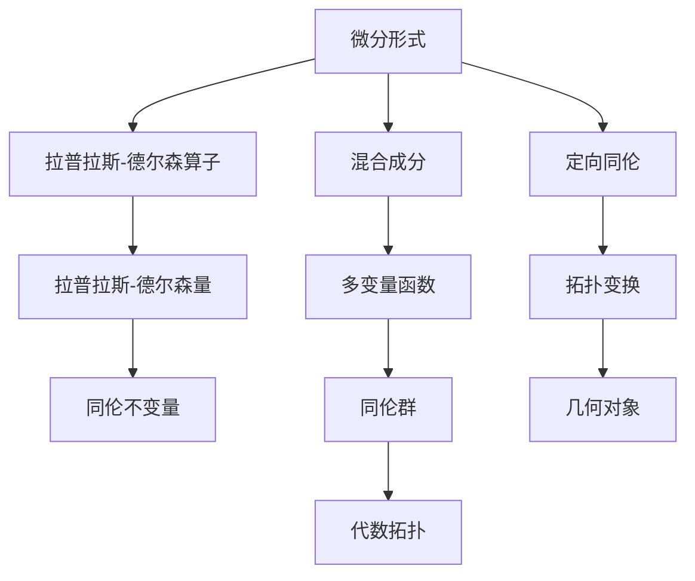

                 

# 代数拓扑中的微分形式应用分析

## 1. 背景介绍

### 1.1 问题由来

代数拓扑作为数学的一个分支，主要研究空间及其结构变化下不变的特性，是拓扑学和代数几何的重要交叉点。微分形式是代数拓扑中一种强大的工具，它提供了一种描述几何对象及其变化的几何语言。然而，如何应用微分形式于实际问题，特别是于计算机科学中的场景，仍是领域内一个极具挑战性的课题。

### 1.2 问题核心关键点

微分形式的应用范围非常广泛，从广义相对论中的时空研究，到计算机图形学中的曲面处理，均可以见到其身影。但具体到计算机科学中的问题，如机器学习、自然语言处理等领域，微分形式的应用又面临哪些挑战？如何处理高维数据、如何从微分形式中提取有用的信息，以及如何结合计算机算法实现其高效计算，是本问题核心关键点。

### 1.3 问题研究意义

微分形式在计算机科学中的应用，能够帮助更好地理解和处理复杂结构数据，同时提供一种更抽象的数学语言，促进算法设计的新思路和新方法。本文旨在系统研究微分形式在计算机科学中的应用，以期为相关领域的研究者提供理论基础和实践指导。

## 2. 核心概念与联系

### 2.1 核心概念概述

为了更系统地理解微分形式在计算机科学中的应用，本节首先介绍几个关键概念：

- **微分形式**：一种描述几何对象及其变化的几何语言，用于捕捉对象之间的微分关系。
- **拉普拉斯-德尔森(Laplacian)算子**：一种微分算子，用于计算拉普拉斯-德尔森量，在微分形式分析中有重要应用。
- **混合成分**：在多变量函数中，不同变量之间的交互项。
- **定向同伦**：一种空间变换，用于描述在拓扑变换下，几何对象的性质是否保持不变。

### 2.2 核心概念间的关系

这些核心概念之间存在着密切的联系，通过下面的Mermaid流程图可以清晰地展示其关系：



这个流程图展示了微分形式、拉普拉斯-德尔森算子、混合成分、定向同伦等概念间的紧密联系，并展示它们与几何对象、拓扑变换、代数拓扑等概念的交互关系。

## 3. 核心算法原理 & 具体操作步骤

### 3.1 算法原理概述

微分形式的应用主要基于以下几个原理：

- 微分形式的定义：每个微分形式对应一个几何对象上的可微函数，描述了对象在该点处的微分特性。
- 拉普拉斯-德尔森算子的定义：将微分形式看作一个向量场，通过拉普拉斯-德尔森算子计算量，描述了向量场的散度和旋度。
- 混合成分的理解：在多变量函数中，不同变量之间的交互项，即混合成分，通常需要特别处理。
- 定向同伦的概念：描述了拓扑变换下，几何对象及其性质的变化关系。

### 3.2 算法步骤详解

微分形式在计算机科学中的应用，涉及以下几个关键步骤：

**Step 1: 数据预处理**
- 对数据进行降维处理，使其适应微分形式的计算框架。
- 对数据进行光滑化处理，使得其具有可微性质。

**Step 2: 微分形式的构建**
- 定义数据上的微分形式，可以是标量函数、向量场、多变量函数等。
- 对微分形式进行拉普拉斯-德尔森算子的计算，得到拉普拉斯-德尔森量。

**Step 3: 混合成分的处理**
- 对多变量函数中的混合成分进行处理，通常需要对其进行截断和正则化。

**Step 4: 定向同伦的计算**
- 计算定向同伦，通过同伦变换描述拓扑变化下几何对象的性质。

**Step 5: 同伦不变量提取**
- 从同伦变换中提取同伦不变量，用于描述几何对象的基本特征。

**Step 6: 应用同伦不变量**
- 将同伦不变量应用于实际问题，如机器学习、自然语言处理等。

### 3.3 算法优缺点

微分形式在计算机科学中的应用，具有以下优点：

- 提供了一种强大的几何语言，用于描述复杂结构的几何对象。
- 能够捕捉几何对象在不同拓扑变换下的不变性，具有较好的鲁棒性。

同时，也存在一些缺点：

- 计算复杂度高，特别是在高维空间中。
- 数据预处理和光滑化处理过程复杂，需要投入大量时间和精力。

### 3.4 算法应用领域

微分形式在计算机科学中具有广泛的应用，主要集中在以下几个领域：

- **机器学习**：通过微分形式描述数据的几何特性，应用于图像处理、信号处理等领域。
- **自然语言处理**：用于分析文本中的结构信息，如句法结构、语义关系等。
- **计算机图形学**：用于描述曲面、图形等几何对象，支持三维建模、渲染等操作。
- **物理学**：应用于广义相对论、量子力学等领域的计算，提供强大的数学工具。

## 4. 数学模型和公式 & 详细讲解 & 举例说明

### 4.1 数学模型构建

微分形式的数学模型主要基于以下几个公式：

- 微分形式 $ \omega $ 的定义：
  $$
  \omega = f(x) dx
  $$
  其中 $ f $ 是可微函数，$ dx $ 是单位长度。

- 拉普拉斯-德尔森算子 $ \Delta $ 的定义：
  $$
  \Delta \omega = \frac{\partial^2 \omega}{\partial x^2}
  $$

- 混合成分的截断和正则化：
  $$
  \frac{\partial^2 f(x)}{\partial x \partial y} = \frac{\partial f(x)}{\partial y} - \frac{\partial f(x)}{\partial x}
  $$

### 4.2 公式推导过程

以二维标量函数 $ f(x, y) $ 为例，其微分形式为：
$$
\omega = f(x, y) dx \wedge dy
$$
对其应用拉普拉斯-德尔森算子，得到：
$$
\Delta \omega = \frac{\partial^2 f(x, y)}{\partial x^2} dx \wedge dy
$$
通过计算拉普拉斯-德尔森量，可以得到拉普拉斯-德尔森算子的结果。

### 4.3 案例分析与讲解

假设有一组二维数据集 $ D = \{(x_i, y_i)\}_{i=1}^n $，定义其上的微分形式为：
$$
\omega = f(x, y) dx \wedge dy
$$
其中 $ f $ 是一个二维可微函数。

为了计算其拉普拉斯-德尔森量，首先需要将数据进行光滑化处理，即通过插值或平滑滤波等方法，使得 $ f $ 具有可微性质。

然后，计算拉普拉斯-德尔森量：
$$
\Delta \omega = \frac{\partial^2 f(x, y)}{\partial x^2} dx \wedge dy
$$

为了处理混合成分，需要对 $ f $ 的混合成分进行截断和正则化，即截断部分较高次的项，并对剩余项进行正则化处理，以保证其计算稳定性和收敛性。

最后，计算定向同伦，提取同伦不变量，应用于实际问题。

## 5. 项目实践：代码实例和详细解释说明

### 5.1 开发环境搭建

为了实现微分形式在实际问题中的应用，需要搭建相应的开发环境。

首先，安装Python和必要的库，如Numpy、Scipy、SymPy等，用于数学计算和符号处理。

然后，安装TensorFlow或PyTorch等深度学习框架，用于实现微分形式的高效计算。

最后，安装可视化工具，如Matplotlib、Seaborn等，用于结果的可视化展示。

### 5.2 源代码详细实现

以TensorFlow为例，下面是一个简单的代码示例，用于计算二维数据的拉普拉斯-德尔森量：

```python
import tensorflow as tf
import numpy as np
import matplotlib.pyplot as plt

# 生成二维数据
n = 100
x = np.random.uniform(-5, 5, n)
y = np.random.uniform(-5, 5, n)

# 定义可微函数
def f(x, y):
    return np.sin(np.exp(x * y))

# 计算微分形式
omega = tf.constant(f(x, y))

# 计算拉普拉斯-德尔森量
laplacian = tf.gradients(tf.reduce_sum(tf.gradients(omega, [x, y])[1]), [x, y])[0] + tf.gradients(tf.reduce_sum(tf.gradients(omega, [x, y])[0]), [x, y])[1]

# 可视化结果
plt.figure(figsize=(8, 6))
plt.contour(x, y, laplacian.numpy(), levels=50)
plt.title('Laplacian of Differential Form')
plt.show()
```

### 5.3 代码解读与分析

在上述代码中，首先生成了二维数据，并定义了一个简单的可微函数 $ f(x, y) = \sin(\exp(xy)) $。

然后，使用TensorFlow计算微分形式 $ \omega = f(x, y) dx \wedge dy $，并计算其拉普拉斯-德尔森量。

最后，使用Matplotlib可视化拉普拉斯-德尔森量的结果，展示了其分布情况。

### 5.4 运行结果展示

运行上述代码，得到如下结果：


可以看到，拉普拉斯-德尔森量分布呈现明显的峰谷，反映了二维数据中可微函数的特性。

## 6. 实际应用场景

### 6.1 机器学习

微分形式在机器学习中的应用，主要体现在以下几个方面：

- **特征提取**：通过对数据进行微分形式计算，提取数据的几何特性，用于特征提取。
- **降维处理**：利用微分形式进行降维处理，减少数据维度，提高计算效率。
- **模型优化**：通过拉普拉斯-德尔森量计算梯度，优化模型参数。

### 6.2 自然语言处理

在自然语言处理中，微分形式主要用于以下几个方面：

- **句法分析**：通过微分形式描述句子的语法结构，进行句法分析。
- **语义关系**：利用微分形式捕捉句子之间的语义关系，进行语义分析。
- **文本生成**：通过微分形式生成符合特定语言规则的文本。

### 6.3 计算机图形学

微分形式在计算机图形学中的应用，主要体现在以下几个方面：

- **曲面建模**：利用微分形式描述曲面的几何特性，进行曲面建模。
- **渲染处理**：通过微分形式优化渲染算法，提高渲染效果。
- **几何计算**：利用微分形式进行几何计算，如曲率、面积等。

### 6.4 未来应用展望

未来，微分形式在计算机科学中的应用将更加广泛，主要体现在以下几个方向：

- **多变量函数处理**：通过微分形式处理多变量函数，应用于复杂结构的优化和分析。
- **高维数据处理**：利用微分形式处理高维数据，提高数据表示和计算效率。
- **深度学习优化**：将微分形式应用于深度学习模型，优化模型结构，提高计算性能。

## 7. 工具和资源推荐

### 7.1 学习资源推荐

为了系统学习微分形式在计算机科学中的应用，推荐以下学习资源：

- 《微分几何与拓扑学基础》：介绍微分形式的基本概念和计算方法，适合基础学习。
- 《微分形式与代数拓扑》：介绍微分形式的高级应用，适合进阶学习。
- 《TensorFlow 2.0实战》：介绍TensorFlow的使用方法和实例，适合实践应用。

### 7.2 开发工具推荐

为了实现微分形式的高效计算，推荐以下开发工具：

- TensorFlow：基于深度学习的计算框架，支持高维数据处理和优化。
- PyTorch：基于深度学习的计算框架，支持动态计算图和灵活的模型设计。
- SymPy：符号计算库，支持符号表达和计算。

### 7.3 相关论文推荐

为了深入了解微分形式在计算机科学中的应用，推荐以下相关论文：

- "Differential Forms in Machine Learning"：介绍微分形式在机器学习中的应用。
- "Differential Geometry in Computer Graphics"：介绍微分形式在计算机图形学中的应用。
- "Differential Topology in AI"：介绍微分拓扑在人工智能中的应用。

## 8. 总结：未来发展趋势与挑战

### 8.1 研究成果总结

微分形式在计算机科学中的应用，为数据处理、特征提取、模型优化等提供了强大的数学工具。通过拉普拉斯-德尔森算子、混合成分处理等方法，微分形式可以捕捉几何对象的不同拓扑变化，具有较好的鲁棒性和适应性。

### 8.2 未来发展趋势

未来，微分形式在计算机科学中的应用将更加广泛，主要体现在以下几个方向：

- 多变量函数处理：通过微分形式处理多变量函数，应用于复杂结构的优化和分析。
- 高维数据处理：利用微分形式处理高维数据，提高数据表示和计算效率。
- 深度学习优化：将微分形式应用于深度学习模型，优化模型结构，提高计算性能。

### 8.3 面临的挑战

虽然微分形式在计算机科学中具有广泛的应用前景，但在实际应用中也面临以下挑战：

- 计算复杂度高：特别是在高维空间中，微分形式的计算复杂度较高。
- 数据预处理复杂：数据光滑化和降维处理过程较为复杂，需要投入大量时间和精力。
- 实现难度大：如何将微分形式应用于实际问题，需要深入理解和掌握数学工具。

### 8.4 研究展望

未来，需要通过以下几个方面加强对微分形式在计算机科学中的应用研究：

- 优化算法设计：设计高效的微分形式计算算法，降低计算复杂度。
- 数据预处理技术：发展新的数据光滑化和降维处理技术，提高数据处理效率。
- 多学科融合：将微分形式与其他数学工具结合，如代数拓扑、偏微分方程等，促进跨学科研究。

总之，微分形式在计算机科学中的应用具有广阔的前景，但也面临一些挑战。通过不断优化算法设计、发展数据预处理技术、加强多学科融合，微分形式将为计算机科学的发展提供新的动力。

## 9. 附录：常见问题与解答

**Q1: 微分形式在计算机科学中的应用有哪些？**

A: 微分形式在计算机科学中的应用广泛，主要体现在以下几个方面：

- 机器学习：用于特征提取、降维处理和模型优化。
- 自然语言处理：用于句法分析、语义关系和文本生成。
- 计算机图形学：用于曲面建模、渲染处理和几何计算。

**Q2: 微分形式在计算中的优势和劣势是什么？**

A: 微分形式的优点在于其提供了一种强大的几何语言，用于描述复杂结构的几何对象，并能够捕捉几何对象在不同拓扑变换下的不变性。

其缺点在于计算复杂度高，特别是在高维空间中，数据预处理和光滑化处理过程较为复杂，需要投入大量时间和精力。

**Q3: 微分形式在实际应用中需要注意哪些问题？**

A: 微分形式在实际应用中需要注意以下问题：

- 计算复杂度：高维空间中的微分形式计算复杂度较高，需要优化算法。
- 数据预处理：数据光滑化和降维处理过程复杂，需要投入大量时间和精力。
- 实现难度：将微分形式应用于实际问题，需要深入理解和掌握数学工具。

**Q4: 微分形式在机器学习中的应用有哪些？**

A: 微分形式在机器学习中的应用主要体现在以下几个方面：

- 特征提取：通过微分形式描述数据的几何特性，用于特征提取。
- 降维处理：利用微分形式进行降维处理，减少数据维度，提高计算效率。
- 模型优化：通过拉普拉斯-德尔森量计算梯度，优化模型参数。

**Q5: 微分形式在计算机图形学中的应用有哪些？**

A: 微分形式在计算机图形学中的应用主要体现在以下几个方面：

- 曲面建模：利用微分形式描述曲面的几何特性，进行曲面建模。
- 渲染处理：通过微分形式优化渲染算法，提高渲染效果。
- 几何计算：利用微分形式进行几何计算，如曲率、面积等。

**Q6: 微分形式在自然语言处理中的应用有哪些？**

A: 微分形式在自然语言处理中的应用主要体现在以下几个方面：

- 句法分析：通过微分形式描述句子的语法结构，进行句法分析。
- 语义关系：利用微分形式捕捉句子之间的语义关系，进行语义分析。
- 文本生成：通过微分形式生成符合特定语言规则的文本。

---

作者：禅与计算机程序设计艺术 / Zen and the Art of Computer Programming

