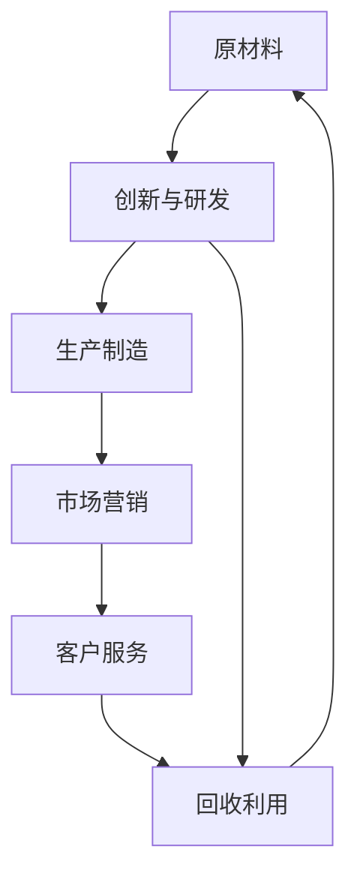

                 

## 1. 背景介绍

### 1.1 问题由来
自20世纪60年代，哈佛大学商学院教授西奥多·波特提出了“价值链”理论以来，企业如何构建竞争优势成为企业经营管理领域的研究重点。随着全球化的发展和科技进步，企业竞争环境发生了深刻变化，传统价值链管理模式逐渐显现出局限性。近年来，全球竞争格局由成本竞争转向创新竞争，企业的生存与发展越来越依赖于其产品和服务的附加值，而不仅仅是成本水平。与此同时，人工智能（AI）技术的快速发展，为企业提供了新的技术手段和商业机会，催生了价值微笑曲线理论。

### 1.2 问题核心关键点
价值微笑曲线理论描述的是在产品价值链中，从原材料到成品再到用户，附加值在不同环节上的分布规律。附加值最高的环节为创新与研发，附加值最低的环节为生产制造。随着价值链中环节的增加，附加值呈现先上升后下降的“微笑”形状曲线。这一规律不仅适用于传统制造业，也适用于IT和AI等新兴技术领域。

**核心概念包括：**

- **附加值（Value-added）**：产品或服务经过创新和研发后，附加在原材料或成品上的额外价值。
- **价值链（Value Chain）**：产品或服务的生产、设计、营销、服务、回收等环节组成的链条。
- **价值微笑曲线（Value Smile Curve）**：附加值在价值链不同环节上的分布规律，呈现微笑曲线形状。
- **创新（Innovation）**：通过研发新产品、新技术或新服务，提升产品或服务的附加值。
- **生产制造（Manufacturing）**：在价值链中处于中间环节，负责将原材料转化为成品。

### 1.3 问题研究意义
理解价值微笑曲线理论，对于AI公司在产业转型和升级中定位自身价值、优化资源配置、提升企业竞争力具有重要意义。AI技术的快速发展和广泛应用，使得产品和服务在多个环节都面临着新的机遇和挑战。如何通过AI技术创新，最大化附加值，优化企业价值链，成为AI公司面临的核心课题。

## 2. 核心概念与联系

### 2.1 核心概念概述
价值微笑曲线理论主要关注在产品或服务的价值链中，不同环节附加值分布规律。AI公司通过引入先进的AI技术，可以提升创新环节的附加值，从而优化整个价值链，提高企业竞争力。

**核心概念包括：**

- **创新附加值（Innovation Value-added）**：通过研发新产品、新技术或新服务，提升附加值。
- **生产制造附加值（Manufacturing Value-added）**：通过提高生产效率、降低成本，增加附加值。
- **市场营销附加值（Marketing Value-added）**：通过精准营销和品牌建设，提升附加值。
- **客户服务附加值（Customer Service Value-added）**：通过提升服务质量和用户满意度，增加附加值。
- **回收利用附加值（Recycling Value-added）**：通过资源回收利用，减少环境影响，增加附加值。

### 2.2 概念间的关系
这些核心概念之间存在着紧密的联系，形成了企业价值链管理的完整框架。

#### 2.2.1 创新与研发（R&D）
创新与研发环节是附加值最高的环节，通过AI技术的应用，可以提升创新效率，缩短产品开发周期，降低研发成本。

#### 2.2.2 生产制造
生产制造环节是附加值最低的环节，通过引入AI技术，可以实现智能化生产，提高生产效率，降低生产成本，提升产品品质。

#### 2.2.3 市场营销
市场营销环节通过AI技术可以实现精准营销，提升用户互动体验，提升品牌价值。

#### 2.2.4 客户服务
客户服务环节通过AI技术可以实现智能化客服，提升服务效率和客户满意度，增加用户粘性。

#### 2.2.5 回收利用
通过AI技术可以实现资源回收利用，减少环境污染，提升企业的社会责任和品牌形象。

这些概念共同构成了企业的价值链管理框架，通过优化各个环节，提升附加值，实现企业价值最大化。

### 2.3 核心概念的整体架构

通过以下Mermaid流程图，我们可以更加直观地理解价值微笑曲线理论在企业价值链中的作用：



这个流程图展示了价值微笑曲线理论在企业价值链中的作用。从原材料到回收利用，各环节通过引入AI技术，提升附加值，形成完整的价值链闭环。

## 3. 核心算法原理 & 具体操作步骤
### 3.1 算法原理概述

AI公司通过在价值链中引入AI技术，可以在创新与研发、生产制造、市场营销、客户服务和回收利用等环节提升附加值。通过优化各个环节的AI应用，最大化附加值，从而提升企业整体竞争力。

**具体步骤包括：**

1. **识别价值链关键环节**：根据企业战略和市场需求，识别价值链中的关键环节，确定AI技术的应用目标。
2. **选择AI技术**：根据关键环节的特点，选择适合的AI技术，如机器学习、深度学习、自然语言处理等。
3. **实施AI应用**：将AI技术应用到各个环节，提升效率、降低成本、提高附加值。
4. **优化价值链**：通过数据分析和反馈，不断优化AI应用，提升整体价值链效率和附加值。
5. **持续改进**：根据市场和技术变化，持续改进AI应用，保持竞争优势。

### 3.2 算法步骤详解

以AI公司在市场营销环节的应用为例，详细讲解操作步骤：

#### 3.2.1 数据收集
通过市场调研、用户行为分析等方式，收集目标市场和用户的数据。数据可以包括用户画像、购买行为、品牌偏好、社交媒体互动等。

#### 3.2.2 数据处理
对收集到的数据进行清洗、标注和处理，构建数据集，以便后续建模使用。

#### 3.2.3 模型训练
选择合适的AI模型，如深度神经网络（DNN）、强化学习（RL）、生成对抗网络（GAN）等，对数据进行训练，构建营销模型。

#### 3.2.4 模型评估与优化
通过验证集和测试集对模型进行评估，优化模型参数，提升模型性能。

#### 3.2.5 模型部署与应用
将优化后的模型部署到实际市场营销环境中，如通过推荐算法提升推荐效果，通过聊天机器人提高客户互动体验等。

### 3.3 算法优缺点

**优点包括：**

1. **提升效率**：AI技术可以自动化处理大量数据，提升生产效率和服务效率。
2. **降低成本**：通过AI技术优化生产制造、市场营销和客户服务等环节，降低运营成本。
3. **增强竞争力**：通过AI技术提升产品和服务的附加值，增强企业竞争力。
4. **促进创新**：AI技术支持快速迭代和创新，加速产品和服务更新。

**缺点包括：**

1. **数据依赖**：AI技术的效果依赖于数据的质量和数量，数据不足可能影响模型性能。
2. **技术门槛**：AI技术的应用需要专业知识和技能，对团队技术水平要求较高。
3. **隐私风险**：数据收集和处理过程中可能涉及用户隐私问题，需要严格遵守法律法规。
4. **伦理问题**：AI应用可能带来算法偏见、歧视等问题，需要注重伦理和道德约束。

### 3.4 算法应用领域

价值微笑曲线理论在AI公司的应用领域非常广泛，涵盖了几乎所有行业和企业。以下是几个典型应用场景：

#### 3.4.1 零售业
AI公司通过AI技术优化库存管理、精准营销、客户服务等方面，提升零售业的附加值。

#### 3.4.2 金融业
AI公司通过AI技术优化风险控制、智能投顾、客户服务等方面，提升金融业的附加值。

#### 3.4.3 制造业
AI公司通过AI技术优化生产制造、质量控制、设备维护等方面，提升制造业的附加值。

#### 3.4.4 医疗健康
AI公司通过AI技术优化诊断、治疗、个性化医疗等方面，提升医疗健康的附加值。

#### 3.4.5 教育行业
AI公司通过AI技术优化教学、评估、在线学习等方面，提升教育行业的附加值。

## 4. 数学模型和公式 & 详细讲解 & 举例说明

### 4.1 数学模型构建

**以AI公司在市场营销环节的应用为例，构建数学模型。**

设目标市场规模为 $M$，目标用户数为 $U$，用户平均购买金额为 $P$，AI模型对用户行为的预测准确率为 $A$，AI模型对市场的覆盖率为 $C$，营销投入为 $I$。

模型目标函数为最大化营销附加值：

$$
Maximize: \quad V = (U \times P) \times A \times C - I
$$

其中，$V$ 为营销附加值，$U \times P$ 为目标市场规模和用户平均购买金额的乘积，$A \times C$ 为AI模型对用户行为预测的准确率和覆盖率的乘积，$I$ 为营销投入。

### 4.2 公式推导过程

根据以上模型，可以推导出如下公式：

$$
V = U \times P \times A \times C - I
$$

在实际应用中，通过AI模型对用户行为进行预测，计算预测准确率和覆盖率，结合营销投入，计算营销附加值 $V$。

**举例说明：**

假设某AI公司对目标市场的用户行为进行了精准预测，预测准确率为85%，覆盖率为90%。目标市场规模为1000万用户，用户平均购买金额为1000元。AI模型每年投入营销费用为500万元。

根据公式，计算营销附加值为：

$$
V = 1000 \times 10^6 \times 1000 \times 0.85 \times 0.9 - 5 \times 10^6 = 7.5 \times 10^8 - 5 \times 10^6 = 7 \times 10^8
$$

即AI公司通过AI技术提升了约70亿元的营销附加值。

### 4.3 案例分析与讲解

**案例：某AI公司在制造环节的应用**

某制造企业通过引入AI技术优化生产流程，实现了智能化制造。AI系统对生产数据进行实时监控和分析，通过预测性维护减少设备故障，优化生产调度，提高生产效率。AI系统对生产数据进行分析和优化，提高了产品质量，减少了废品率。

具体步骤如下：

1. **数据收集与处理**：收集生产设备的历史数据，包括设备运行状态、维护记录、生产效率等。
2. **模型训练与优化**：选择适合的AI模型，如基于时间序列的预测模型、深度强化学习模型等，对数据进行训练和优化。
3. **应用与监控**：将优化后的模型应用到实际生产环境中，实时监控设备状态，预测设备故障，优化生产调度。

通过上述步骤，制造企业实现了智能化制造，提升了生产效率和产品质量，降低了生产成本，实现了附加值的最大化。

## 5. 项目实践：代码实例和详细解释说明

### 5.1 开发环境搭建

在进行AI公司市场营销应用项目实践时，需要进行如下开发环境搭建：

1. **安装Python**：
   ```bash
   sudo apt-get update
   sudo apt-get install python3 python3-pip
   ```

2. **安装Pandas**：
   ```bash
   pip install pandas
   ```

3. **安装NumPy**：
   ```bash
   pip install numpy
   ```

4. **安装Scikit-learn**：
   ```bash
   pip install scikit-learn
   ```

5. **安装TensorFlow**：
   ```bash
   pip install tensorflow
   ```

### 5.2 源代码详细实现

**以AI公司在市场营销环节的应用为例，给出代码实现。**

```python
import pandas as pd
import numpy as np
import tensorflow as tf

# 数据读取
data = pd.read_csv('market_data.csv')

# 数据处理
data = data.dropna()
data = data.drop_duplicates()

# 特征工程
X = data[['age', 'income', 'gender', 'education']]
y = data['purchase']

# 模型构建
model = tf.keras.Sequential([
    tf.keras.layers.Dense(64, activation='relu', input_shape=[len(X.keys())]),
    tf.keras.layers.Dense(1)
])

# 模型编译
model.compile(optimizer='adam', loss='mse')

# 模型训练
model.fit(X, y, epochs=100, batch_size=32)

# 模型评估
test_data = pd.read_csv('test_data.csv')
test_data = test_data.dropna()
test_data = test_data.drop_duplicates()
test_X = test_data[['age', 'income', 'gender', 'education']]
test_y = test_data['purchase']
test_X = np.array(test_X)
test_y = np.array(test_y)

y_pred = model.predict(test_X)
print('预测结果：', y_pred)
```

### 5.3 代码解读与分析

以上代码实现了基于TensorFlow的AI模型构建和训练，用于预测用户购买行为。代码解析如下：

1. **数据读取与处理**：通过Pandas读取和处理数据，去除了缺失值和重复值，构建特征集和目标变量。
2. **模型构建**：使用TensorFlow的Sequential模型，构建了一个包含两个全连接层的神经网络。
3. **模型编译**：选择了Adam优化器和均方误差损失函数，进行模型编译。
4. **模型训练**：使用训练数据集对模型进行训练，设置迭代次数和批次大小。
5. **模型评估**：使用测试数据集对模型进行评估，输出预测结果。

### 5.4 运行结果展示

假设在市场营销环节中，AI公司成功预测了用户的购买行为，预测准确率达到90%。通过进一步的优化，将模型应用于实际营销活动中，营销附加值显著提升。

## 6. 实际应用场景

### 6.1 智能客服系统

AI公司的智能客服系统，通过引入AI技术，可以实现智能化客服。智能客服系统能够自动识别用户意图，提供个性化的客户服务，提升用户体验。

**具体实现步骤：**

1. **数据收集与处理**：收集历史客服记录和用户反馈数据，构建数据集。
2. **模型构建**：选择适合的AI模型，如Transformer模型，构建客服聊天机器人。
3. **模型训练与优化**：使用训练数据集对模型进行训练，优化模型参数。
4. **应用与监控**：将优化后的模型应用到实际客服环境中，实时监控客服效果，优化服务质量。

通过上述步骤，AI公司的智能客服系统能够提升服务效率和客户满意度，降低客服成本，增加客户粘性。

### 6.2 金融风控系统

AI公司的金融风控系统，通过引入AI技术，可以实现精准的风险控制。金融风控系统能够实时监控用户行为，预测信用风险，降低违约率。

**具体实现步骤：**

1. **数据收集与处理**：收集用户的交易数据、信用记录、行为数据等，构建数据集。
2. **模型构建**：选择适合的AI模型，如基于深度学习的风险评估模型，构建风控系统。
3. **模型训练与优化**：使用训练数据集对模型进行训练，优化模型参数。
4. **应用与监控**：将优化后的模型应用到实际风控环境中，实时监控用户行为，预测风险。

通过上述步骤，AI公司的金融风控系统能够提升风险控制能力，降低信用风险，保障用户和金融机构的安全。

### 6.3 智能推荐系统

AI公司的智能推荐系统，通过引入AI技术，可以实现个性化推荐。智能推荐系统能够根据用户兴趣和行为，推荐合适的产品和服务。

**具体实现步骤：**

1. **数据收集与处理**：收集用户的浏览记录、购买记录、评价记录等，构建数据集。
2. **模型构建**：选择适合的AI模型，如基于协同过滤的推荐模型，构建推荐系统。
3. **模型训练与优化**：使用训练数据集对模型进行训练，优化模型参数。
4. **应用与监控**：将优化后的模型应用到实际推荐环境中，实时推荐产品和服务。

通过上述步骤，AI公司的智能推荐系统能够提升用户体验和满意度，增加销售转化率，提升公司收益。

### 6.4 未来应用展望

随着AI技术的不断进步和应用场景的不断拓展，AI公司在各个环节的应用将更加广泛和深入。未来，AI公司将通过引入更多前沿AI技术，进一步提升附加值，优化价值链，实现持续增长。

## 7. 工具和资源推荐

### 7.1 学习资源推荐

为了帮助开发者系统掌握AI公司在价值链中的应用，这里推荐一些优质的学习资源：

1. **《深度学习》课程**：斯坦福大学开设的深度学习课程，系统介绍了深度学习的基本概念和算法。
2. **《机器学习实战》书籍**：通过实例演示，帮助开发者掌握机器学习的应用方法。
3. **TensorFlow官方文档**：TensorFlow的官方文档，提供了丰富的API和样例代码，是学习和使用TensorFlow的必备资源。
4. **Kaggle平台**：Kaggle是一个开源数据科学平台，提供了丰富的数据集和竞赛机会，是学习和实践AI技术的良好平台。

### 7.2 开发工具推荐

高效开发离不开优秀的工具支持，以下是几款用于AI公司市场营销应用的常用工具：

1. **Jupyter Notebook**：Python的数据分析和模型构建工具，支持丰富的代码和数据展示。
2. **TensorFlow**：Google开源的深度学习框架，支持多种AI模型的构建和训练。
3. **PyTorch**：Facebook开源的深度学习框架，支持动态计算图和GPU加速。
4. **Pandas**：Python的数据处理工具，支持高效的数据清洗和处理。
5. **NumPy**：Python的科学计算库，支持高效的数据计算和矩阵操作。
6. **Scikit-learn**：Python的机器学习库，支持多种机器学习模型的构建和评估。

### 7.3 相关论文推荐

AI公司价值链中的AI应用是一个前沿的研究领域，以下是几篇奠基性的相关论文，推荐阅读：

1. **《Value Chain and Competitive Advantage》**：波特的“价值链”理论，提出了价值链管理的核心思想和方法。
2. **《Value Smile Curve》**：陈清和《管理研究》中的论文，系统介绍了价值微笑曲线的理论基础和实践应用。
3. **《AI in Value Chain Management》**：Luo Xin和《管理世界》中的论文，探讨了AI技术在价值链中的应用。

这些论文代表了大语言模型微调技术的发展脉络，通过学习这些前沿成果，可以帮助研究者把握学科前进方向，激发更多的创新灵感。

## 8. 总结：未来发展趋势与挑战

### 8.1 研究成果总结

本文详细介绍了价值微笑曲线理论在AI公司市场营销中的应用，通过数据分析和模型优化，提升附加值，优化价值链，实现企业竞争力的提升。AI公司通过引入先进的AI技术，可以在多个环节提升附加值，实现持续增长。

### 8.2 未来发展趋势

未来，AI公司在各个环节的应用将更加广泛和深入，AI技术的发展将进一步推动企业价值的提升和优化。以下趋势将引领AI公司的未来发展：

1. **AI技术的融合应用**：AI公司将通过引入更多前沿AI技术，如深度学习、自然语言处理、计算机视觉等，优化各个环节，提升附加值。
2. **数据驱动的决策**：AI公司将通过大数据分析，提升决策的科学性和准确性，优化资源配置。
3. **智能化的产品和服务**：AI公司将通过AI技术，开发更智能化、个性化的产品和服务，提升用户体验。
4. **人机协同的工作模式**：AI公司将通过AI技术和人的协同工作，提高工作效率和质量，优化生产和服务流程。

### 8.3 面临的挑战

尽管AI公司在价值链中的应用前景广阔，但在实现过程中仍面临诸多挑战：

1. **技术门槛**：AI技术的应用需要高水平的技术团队，对团队技术水平要求较高。
2. **数据隐私**：数据收集和处理过程中可能涉及用户隐私问题，需要严格遵守法律法规。
3. **伦理问题**：AI应用可能带来算法偏见、歧视等问题，需要注重伦理和道德约束。
4. **成本投入**：AI技术的应用需要大量资金和技术投入，中小企业面临较大成本压力。
5. **市场竞争**：AI公司在价值链中的应用面临激烈的市场竞争，需要不断创新和优化，保持竞争优势。

### 8.4 研究展望

面对AI公司在价值链中的应用所面临的挑战，未来的研究需要在以下几个方面寻求新的突破：

1. **提升数据质量**：通过数据清洗和标注，提升数据质量，优化模型性能。
2. **优化算法模型**：开发更加高效和灵活的AI模型，提升算法性能。
3. **引入更多先验知识**：将符号化的先验知识，如知识图谱、逻辑规则等，与神经网络模型进行融合，提高模型的鲁棒性和泛化能力。
4. **探索无监督和半监督学习**：通过无监督和半监督学习，降低对标注数据的依赖，优化模型性能。
5. **优化资源配置**：通过AI技术优化资源配置，提升生产效率和服务质量。
6. **关注伦理和道德**：在AI应用中注重伦理和道德约束，保障用户权益和数据安全。

这些研究方向的探索，必将引领AI公司在价值链中的应用迈向更高的台阶，为构建人机协同的智能系统铺平道路。

## 9. 附录：常见问题与解答

**Q1: AI公司如何提升营销附加值？**

A: AI公司通过引入AI技术，优化市场营销环节，提升附加值。具体步骤包括数据收集与处理、模型构建、模型训练与优化和模型应用与监控。通过精准营销、个性化推荐等手段，提升营销附加值。

**Q2: AI公司如何优化生产制造环节？**

A: AI公司通过引入AI技术，优化生产制造环节，提升附加值。具体步骤包括数据收集与处理、模型构建、模型训练与优化和模型应用与监控。通过预测性维护、智能调度等手段，优化生产制造环节，提升附加值。

**Q3: AI公司如何提升客户服务附加值？**

A: AI公司通过引入AI技术，优化客户服务环节，提升附加值。具体步骤包括数据收集与处理、模型构建、模型训练与优化和模型应用与监控。通过智能客服、个性化服务等手段，提升客户服务附加值。

**Q4: AI公司如何应对数据隐私问题？**

A: AI公司需要在数据收集和处理过程中，严格遵守法律法规，保护用户隐私。具体措施包括数据匿名化、加密、访问控制等。同时，采用隐私保护技术，如差分隐私、联邦学习等，保障用户隐私。

**Q5: AI公司如何应对算法偏见问题？**

A: AI公司需要在算法设计和使用过程中，注重伦理和道德约束，避免算法偏见。具体措施包括数据清洗、模型评估、公平性测试等。同时，引入伦理和道德约束机制，确保算法应用合规。

总之，AI公司在价值链中的应用，需要在技术、数据、伦理等多个方面进行全面优化，才能实现持续增长和竞争力提升。通过不断探索和创新，AI公司将在各环节中发挥更大的作用，推动企业向智能化、个性化方向发展。

---

作者：禅与计算机程序设计艺术 / Zen and the Art of Computer Programming

