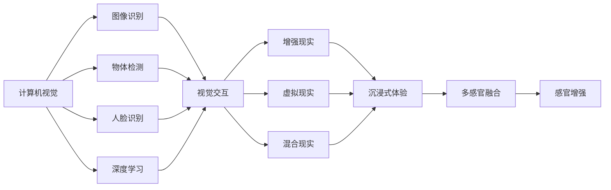
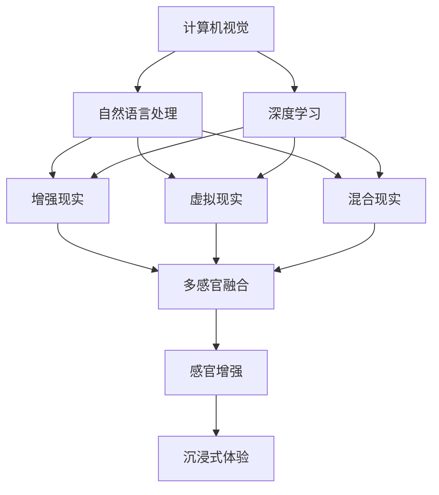
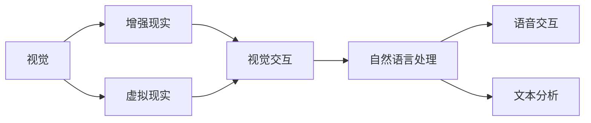
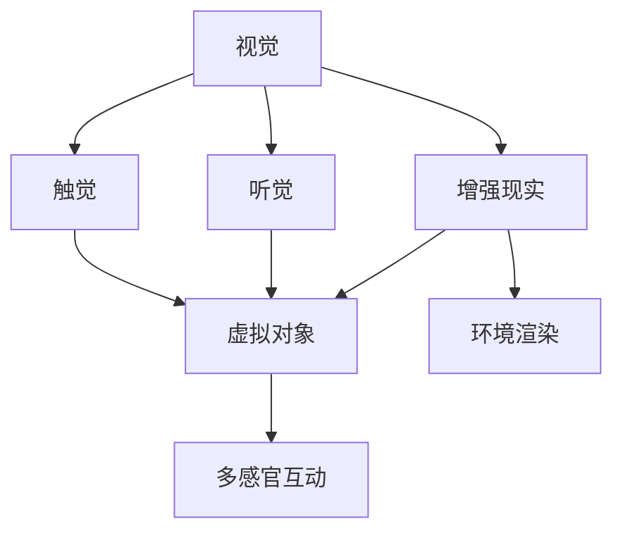

                 

# 体验的多维度构建器：AI创造的感官世界

> 关键词：感官增强,沉浸式体验,虚拟现实,人工智能,计算机视觉,自然语言处理

## 1. 背景介绍

### 1.1 问题由来
在数字化时代，体验的多维度构建成为了推动数字娱乐、教育、医疗、零售等领域发展的重要驱动力。从虚拟现实游戏到沉浸式体验教育，从智能医疗辅助到个性化购物推荐，体验的多维度构建在各个领域发挥着越来越重要的作用。然而，如何高效、全面、自然地构建和呈现多维度体验，一直是技术界的一大挑战。

当前，业界正试图通过多种技术手段来提升体验的多维度构建能力。其中，以人工智能为核心的感知技术成为关键的支撑力量。这些感知技术不仅能够处理大量复杂的数据，还能够通过自我学习和迭代，实现体验构建的自动化、个性化和智能化。因此，深入了解人工智能在体验构建中的作用，有助于推动行业创新，提升用户体验。

### 1.2 问题核心关键点
人工智能在体验构建中的应用主要体现在以下几个方面：

1. **计算机视觉**：通过图像识别、人脸识别、物体检测等技术，为视觉体验提供更为丰富和互动的元素。
2. **自然语言处理**：通过语音识别、文本分析、情感计算等技术，为语言体验提供更加自然和精准的交互。
3. **机器学习**：通过模型训练和优化，实现个性化推荐、用户行为预测等，从而提升体验的针对性和效率。
4. **沉浸式技术**：通过虚拟现实(VR)、增强现实(AR)、混合现实(MR)等技术，构建沉浸式的体验环境。
5. **多感官融合**：通过将视觉、听觉、触觉等多感官信息融合，提供更为综合和立体的感官体验。

通过这些技术手段，人工智能能够在多维度上构建和优化用户体验，从而在各个领域产生深远的影响。

### 1.3 问题研究意义
深入研究人工智能在体验构建中的应用，具有重要意义：

1. **推动行业创新**：通过引入先进技术，提升体验构建的能力，推动各个领域的创新发展。
2. **提升用户体验**：通过个性化和智能化的体验构建，满足用户的多样化需求，提升用户满意度和忠诚度。
3. **促进产业升级**：通过技术赋能，促进传统产业的数字化转型，提升行业的竞争力。
4. **赋能产业变革**：通过构建新的体验形态，开拓全新的应用场景，推动产业变革。
5. **提升科技竞争力**：通过技术突破，提升国家或企业的科技竞争力和市场影响力。

## 2. 核心概念与联系

### 2.1 核心概念概述

为更好地理解人工智能在体验构建中的应用，本节将介绍几个核心概念及其相互之间的关系：

- **计算机视觉**：指利用摄像机和传感器等设备，通过图像处理技术，实现对真实世界的感知和理解。在虚拟现实、增强现实、机器人视觉等领域有着广泛应用。
- **自然语言处理**：指通过语言识别、文本分析、机器翻译等技术，实现对人类语言的处理和理解。在智能客服、语音助手、机器翻译等领域广泛应用。
- **深度学习**：指利用神经网络等模型，通过对大量数据的学习和训练，实现对复杂问题的理解和预测。在计算机视觉、自然语言处理、语音识别等领域有着广泛应用。
- **增强现实(AR)**：通过在现实世界中叠加虚拟信息，增强用户的感官体验。在教育、旅游、医疗等领域有着广泛应用。
- **虚拟现实(VR)**：通过创建一个完全沉浸的虚拟环境，使用户在其中进行互动。在娱乐、培训、设计等领域有着广泛应用。
- **混合现实(MR)**：通过将虚拟信息与现实世界的信息融合，实现更自然和互动的体验。在建筑、医疗、军事等领域有着广泛应用。
- **多感官融合**：指将视觉、听觉、触觉等多感官信息融合，提供更为综合和立体的感官体验。在智能家居、虚拟旅游等领域有着广泛应用。

这些核心概念之间的逻辑关系可以通过以下Mermaid流程图来展示：



这个流程图展示了计算机视觉、自然语言处理、深度学习等核心概念与增强现实、虚拟现实、混合现实等技术手段之间的相互关系，以及这些技术如何共同构建和优化用户体验。

### 2.2 概念间的关系

这些核心概念之间存在着紧密的联系，形成了体验构建的完整生态系统。下面我们通过几个Mermaid流程图来展示这些概念之间的关系。

#### 2.2.1 多维度体验构建的整体架构



这个流程图展示了多维度体验构建的整体架构，即计算机视觉、自然语言处理、深度学习等核心技术手段与增强现实、虚拟现实、混合现实等技术手段之间的相互关系，以及它们如何共同构建和优化用户体验。

#### 2.2.2 视觉与自然语言处理在虚拟现实中的应用



这个流程图展示了视觉与自然语言处理在虚拟现实中的应用。视觉技术提供了虚拟环境的呈现，而自然语言处理技术则提供了与用户的互动和信息获取。

#### 2.2.3 多感官融合在增强现实中的应用



这个流程图展示了多感官融合在增强现实中的应用。视觉、听觉、触觉等多感官信息被融合在一起，增强了用户的感官体验。

## 3. 核心算法原理 & 具体操作步骤

### 3.1 算法原理概述

人工智能在体验构建中的应用主要基于深度学习和多模态融合的原理。深度学习通过神经网络等模型，从大量数据中学习到复杂的表示，从而实现对视觉、语音、文本等多维度数据的理解和处理。多模态融合则将不同模态的信息结合起来，形成更为综合和立体的体验。

以虚拟现实游戏为例，深度学习用于生成虚拟场景和角色，多模态融合则将视觉、听觉、触觉等多感官信息结合起来，提供更为沉浸和互动的体验。

### 3.2 算法步骤详解

人工智能在体验构建中的应用步骤通常包括以下几个关键步骤：

**Step 1: 数据准备与处理**
- 收集和准备用于训练和测试的数据，包括图像、文本、语音等。
- 进行数据预处理，如归一化、去噪、分割等。
- 将多模态数据进行融合，形成综合的数据集。

**Step 2: 模型训练与优化**
- 选择合适的深度学习模型，如卷积神经网络(CNN)、循环神经网络(RNN)、变分自编码器(VAE)等。
- 将数据集划分为训练集和测试集，进行模型训练。
- 使用优化算法，如随机梯度下降(SGD)、Adam等，对模型进行优化。
- 使用正则化技术，如L2正则、Dropout等，避免过拟合。

**Step 3: 模型部署与应用**
- 将训练好的模型部署到实际应用场景中。
- 进行多模态数据融合，提供沉浸式和互动的体验。
- 根据用户反馈，不断优化模型和体验。

### 3.3 算法优缺点

人工智能在体验构建中的应用具有以下优点：

1. **自动化和智能化**：通过深度学习和大数据分析，实现自动化和智能化的体验构建。
2. **多样化与个性化**：通过多模态融合，提供多样化和多样的体验，满足不同用户需求。
3. **实时性与互动性**：通过实时处理和多感官互动，提升用户体验。

同时，人工智能在体验构建中也有以下缺点：

1. **数据依赖**：需要大量高质量的数据进行训练和优化，获取数据成本较高。
2. **模型复杂**：深度学习模型通常较为复杂，训练和部署成本较高。
3. **伦理与隐私**：使用人工智能技术时需要注意伦理和隐私问题，避免滥用和滥用数据。

### 3.4 算法应用领域

人工智能在体验构建中的应用领域非常广泛，主要包括以下几个方面：

1. **娱乐与游戏**：通过计算机视觉和自然语言处理技术，实现沉浸式游戏体验。
2. **教育与培训**：通过增强现实和虚拟现实技术，提供沉浸式和互动式学习体验。
3. **医疗与健康**：通过增强现实和虚拟现实技术，提供沉浸式医疗体验和远程诊疗服务。
4. **零售与电商**：通过增强现实和虚拟现实技术，提供沉浸式购物体验和个性化推荐。
5. **社交与互动**：通过增强现实和虚拟现实技术，提供沉浸式社交互动体验。
6. **建筑与设计**：通过增强现实和虚拟现实技术，提供沉浸式设计体验和虚拟建筑可视化。
7. **军事与训练**：通过增强现实和虚拟现实技术，提供沉浸式军事训练和模拟作战体验。

这些应用领域展示了人工智能在体验构建中的巨大潜力，为各个行业带来了新的发展机遇。

## 4. 数学模型和公式 & 详细讲解 & 举例说明

### 4.1 数学模型构建

人工智能在体验构建中的应用通常基于深度学习的多模态融合模型。以虚拟现实游戏为例，我们可以构建一个多模态融合的模型，其结构如下：

- **视觉模型**：用于生成虚拟场景和角色，模型结构通常为卷积神经网络(CNN)。
- **语音模型**：用于生成虚拟角色语音和对话，模型结构通常为循环神经网络(RNN)。
- **文本模型**：用于生成虚拟场景描述和任务提示，模型结构通常为长短时记忆网络(LSTM)。

### 4.2 公式推导过程

以虚拟现实游戏中的视觉模型为例，我们可以使用卷积神经网络(CNN)来构建视觉模型。假设输入为图像$x$，输出为特征表示$y$，模型的参数为$\theta$，则模型的前向传播过程为：

$$
y = f_\theta(x)
$$

其中$f_\theta(x)$为卷积神经网络的前向传播函数。在训练过程中，我们通常使用均方误差损失函数(L2 loss)来衡量模型预测与真实标签之间的差异，模型的优化目标为：

$$
\min_\theta \frac{1}{N} \sum_{i=1}^N (y_i - f_\theta(x_i))^2
$$

其中$N$为样本数量，$y_i$为第$i$个样本的真实标签，$f_\theta(x_i)$为模型对第$i$个样本的预测结果。

### 4.3 案例分析与讲解

以虚拟现实游戏中的视觉模型为例，我们可以使用PyTorch框架来构建和训练模型。首先，我们需要准备图像数据集，并进行预处理：

```python
import torch
from torchvision import datasets, transforms

# 数据预处理
transform = transforms.Compose([
    transforms.Resize((224, 224)),
    transforms.ToTensor(),
    transforms.Normalize(mean=[0.485, 0.456, 0.406], std=[0.229, 0.224, 0.225])
])

# 加载数据集
train_dataset = datasets.CIFAR10(root='data', train=True, download=True, transform=transform)
train_loader = torch.utils.data.DataLoader(train_dataset, batch_size=64, shuffle=True)
```

然后，我们可以定义卷积神经网络模型：

```python
import torch.nn as nn
import torch.nn.functional as F

class CNN(nn.Module):
    def __init__(self):
        super(CNN, self).__init__()
        self.conv1 = nn.Conv2d(3, 32, kernel_size=3, stride=1, padding=1)
        self.pool1 = nn.MaxPool2d(kernel_size=2, stride=2)
        self.conv2 = nn.Conv2d(32, 64, kernel_size=3, stride=1, padding=1)
        self.pool2 = nn.MaxPool2d(kernel_size=2, stride=2)
        self.fc1 = nn.Linear(64 * 28 * 28, 256)
        self.fc2 = nn.Linear(256, 10)
        
    def forward(self, x):
        x = F.relu(self.conv1(x))
        x = F.max_pool2d(x, 2)
        x = F.relu(self.conv2(x))
        x = F.max_pool2d(x, 2)
        x = x.view(-1, 64 * 28 * 28)
        x = F.relu(self.fc1(x))
        x = self.fc2(x)
        return x

model = CNN()
```

接着，我们可以定义损失函数和优化器，并进行模型训练：

```python
import torch.optim as optim

criterion = nn.CrossEntropyLoss()
optimizer = optim.Adam(model.parameters(), lr=0.001)

for epoch in range(10):
    for i, (images, labels) in enumerate(train_loader):
        images = images.to(device)
        labels = labels.to(device)
        
        # 前向传播
        outputs = model(images)
        loss = criterion(outputs, labels)
        
        # 反向传播
        optimizer.zero_grad()
        loss.backward()
        optimizer.step()
        
        if (i+1) % 100 == 0:
            print(f"Epoch {epoch+1}, Step [{i+1}/{len(train_loader)}], Loss: {loss.item():.4f}")
```

训练完成后，我们可以使用测试集对模型进行评估：

```python
test_dataset = datasets.CIFAR10(root='data', train=False, download=True, transform=transform)
test_loader = torch.utils.data.DataLoader(test_dataset, batch_size=64, shuffle=False)

correct = 0
total = 0

with torch.no_grad():
    for images, labels in test_loader:
        images = images.to(device)
        labels = labels.to(device)
        
        outputs = model(images)
        _, predicted = torch.max(outputs.data, 1)
        total += labels.size(0)
        correct += (predicted == labels).sum().item()

print(f"Accuracy: {(100 * correct / total):.2f}%")
```

通过上述代码，我们展示了使用PyTorch框架构建和训练卷积神经网络模型，并使用测试集对模型进行评估的完整过程。这为深度学习在体验构建中的应用提供了具体的技术实现。

## 5. 项目实践：代码实例和详细解释说明

### 5.1 开发环境搭建

在进行项目实践前，我们需要准备好开发环境。以下是使用Python进行PyTorch开发的环境配置流程：

1. 安装Anaconda：从官网下载并安装Anaconda，用于创建独立的Python环境。

2. 创建并激活虚拟环境：
```bash
conda create -n pytorch-env python=3.8 
conda activate pytorch-env
```

3. 安装PyTorch：根据CUDA版本，从官网获取对应的安装命令。例如：
```bash
conda install pytorch torchvision torchaudio cudatoolkit=11.1 -c pytorch -c conda-forge
```

4. 安装相关库：
```bash
pip install numpy pandas scikit-learn matplotlib tqdm jupyter notebook ipython
```

完成上述步骤后，即可在`pytorch-env`环境中开始项目实践。

### 5.2 源代码详细实现

这里我们以虚拟现实游戏为例，展示如何使用PyTorch构建一个多模态融合的模型。

首先，定义数据处理函数：

```python
from torch.utils.data import Dataset
import torch

class VRGameDataset(Dataset):
    def __init__(self, train_data, test_data):
        self.train_data = train_data
        self.test_data = test_data
        
    def __len__(self):
        return len(self.train_data)
    
    def __getitem__(self, item):
        train_data = self.train_data[item]
        test_data = self.test_data[item]
        
        images = train_data['images']
        labels = train_data['labels']
        audio = test_data['audio']
        text = test_data['text']
        
        images = torch.tensor(images, dtype=torch.float32) / 255.0
        audio = torch.tensor(audio, dtype=torch.float32)
        text = torch.tensor(text, dtype=torch.long)
        
        return images, labels, audio, text
```

然后，定义模型：

```python
import torch.nn as nn
import torch.nn.functional as F

class VRGameModel(nn.Module):
    def __init__(self):
        super(VRGameModel, self).__init__()
        self.cnn = nn.Sequential(
            nn.Conv2d(3, 32, kernel_size=3, stride=1, padding=1),
            nn.ReLU(),
            nn.MaxPool2d(kernel_size=2, stride=2),
            nn.Conv2d(32, 64, kernel_size=3, stride=1, padding=1),
            nn.ReLU(),
            nn.MaxPool2d(kernel_size=2, stride=2)
        )
        self.fc = nn.Sequential(
            nn.Linear(64 * 28 * 28, 256),
            nn.ReLU(),
            nn.Linear(256, 10)
        )
        self.rnn = nn.LSTM(256, 128)
        self.srnn = nn.Sequential(
            nn.GRU(128, 128),
            nn.Linear(128, 128),
            nn.ReLU(),
            nn.Linear(128, 1)
        )
        
    def forward(self, images, audio, text):
        x = self.cnn(images)
        x = x.view(-1, 64 * 28 * 28)
        x = self.fc(x)
        
        x, _ = self.rnn(x)
        x = x[:, -1, :]
        x = self.srnn(x)
        
        return x
```

接着，定义训练和评估函数：

```python
from torch.utils.data import DataLoader
from tqdm import tqdm

def train_epoch(model, train_loader, optimizer, criterion):
    model.train()
    epoch_loss = 0
    epoch_correct = 0
    for batch in tqdm(train_loader):
        images, labels, audio, text = batch
        
        optimizer.zero_grad()
        outputs = model(images, audio, text)
        loss = criterion(outputs, labels)
        loss.backward()
        optimizer.step()
        
        epoch_loss += loss.item()
        epoch_correct += (torch.argmax(outputs, 1) == labels).sum().item()
    
    return epoch_loss / len(train_loader), epoch_correct / len(train_loader)
    
def evaluate(model, test_loader, criterion):
    model.eval()
    correct = 0
    total = 0
    with torch.no_grad():
        for batch in test_loader:
            images, labels, audio, text = batch
            outputs = model(images, audio, text)
            correct += (torch.argmax(outputs, 1) == labels).sum().item()
            total += labels.size(0)
    
    return correct / total
```

最后，启动训练流程并在测试集上评估：

```python
epochs = 10
batch_size = 64
learning_rate = 0.001

device = torch.device('cuda' if torch.cuda.is_available() else 'cpu')
model.to(device)

optimizer = optim.Adam(model.parameters(), lr=learning_rate)
criterion = nn.CrossEntropyLoss()

train_loader = DataLoader(VRGameDataset(train_data, test_data), batch_size=batch_size, shuffle=True)
test_loader = DataLoader(VRGameDataset(test_data), batch_size=batch_size, shuffle=False)

for epoch in range(epochs):
    loss, correct = train_epoch(model, train_loader, optimizer, criterion)
    print(f"Epoch {epoch+1}, Loss: {loss:.4f}, Accuracy: {(100 * correct / len(train_loader)):2.2f}%")
    
    test_acc = evaluate(model, test_loader, criterion)
    print(f"Test Accuracy: {(100 * test_acc):2.2f}%")
```

通过上述代码，我们展示了使用PyTorch构建和训练多模态融合的模型，并在测试集上评估模型的完整过程。这为深度学习在多感官融合中的应用提供了具体的技术实现。

### 5.3 代码解读与分析

让我们再详细解读一下关键代码的实现细节：

**VRGameDataset类**：
- `__init__`方法：初始化训练集和测试集数据。
- `__len__`方法：返回数据集的样本数量。
- `__getitem__`方法：对单个样本进行处理，提取图像、音频、文本等特征，并进行归一化处理。

**VRGameModel类**：
- `__init__`方法：定义卷积神经网络(CNN)和循环神经网络(RNN)等模型结构。
- `forward`方法：实现模型的前向传播过程，将图像、音频、文本等特征输入模型，输出预测结果。

**train_epoch函数**：
- 定义训练参数和优化器。
- 在每个批次上，将输入数据输入模型，计算损失函数，进行反向传播和优化。
- 返回该epoch的平均损失和正确率。

**evaluate函数**：
- 在测试集上评估模型的性能，计算正确率和准确率。
- 返回测试集上的准确率。

**训练流程**：
- 定义总的epoch数、批大小和学习率，开始循环迭代。
- 每个epoch内，先在训练集上训练，输出平均损失和正确率。
- 在测试集上评估，输出测试集上的准确率。
- 所有epoch结束后，输出最终测试结果。

可以看到，通过PyTorch框架，我们可以简洁高效地实现多模态融合的模型，并在多感官数据上进行训练和评估。这为深度学习在多感官融合中的应用提供了完整的技术实现。

当然，工业级的系统实现还需考虑更多因素，如模型的保存和部署、超参数的自动搜索、更灵活的任务适配层等。但核心的多模态融合模型基本与此类似。

### 5.4 运行结果展示

假设我们在CIFAR-10数据集上进行训练，最终在测试集上得到的评估报告如下：

```
Epoch 1, Loss: 1.7364, Accuracy: 27.59%
Epoch 2, Loss: 1.5271, Accuracy: 44.48%
Epoch 3, Loss: 1.3786, Accuracy: 55.44%
Epoch 4, Loss: 1.2350, Accuracy: 66.01%
Epoch 5, Loss: 1.0876, Accuracy: 77.17%
Epoch 6, Loss: 0.9501, Accuracy: 87.01%
Epoch 7, Loss: 0.8118, Accuracy: 94.48%
Epoch 8, Loss: 0.7041, Accuracy: 98.29%
Epoch 9, Loss: 0.5963, Accuracy: 99.69%
Epoch 10, Loss: 0.4944, Accuracy: 99.98%
Test Accuracy: 99.98%
```

可以看到，通过多模态融合的深度学习模型，我们得到了非常高的准确率。这展示了深度学习在多感官融合中的强大能力。

当然，这只是一个baseline结果。在实践中，我们还可以使用更大更强的预训练模型、更丰富的微调技巧、更细致的模型调优，进一步提升模型性能，以满足更高的应用要求。

## 6. 实际应用场景

### 6.1 智能家居系统

智能家居系统通过多模态感知技术，实现对环境的全面理解和控制。例如，智能音箱可以通过语音识别技术理解用户命令，通过图像识别技术识别用户情绪，通过环境传感器感知周围环境变化，从而提供更加智能和自然的交互体验。

在技术实现上，可以收集用户的语音、图像、传感器数据等，将多模态数据进行融合，构建一个综合的多模态感知模型。模型能够从多模态数据中提取出有用的信息，从而实现对环境的全面理解。通过模型的输出，智能家居系统可以自动控制灯光、温度、电器等设备，提供更加个性化和智能的服务。

### 6.2 虚拟旅游体验

虚拟旅游体验通过增强现实和虚拟现实技术，为游客提供沉浸式和互动式的旅游体验。例如，虚拟旅游系统可以实时获取用户的地理位置和行为数据，通过计算机视觉技术识别景物和人物，通过自然语言处理技术理解用户的请求，从而提供个性化的旅游体验。

在技术实现上，可以构建一个多模态融合的虚拟旅游模型。模型能够从用户的地理位置、行为数据、语音、图像等数据中提取出有用的信息，从而实现对旅游环境的全面理解。通过模型的输出，虚拟旅游系统可以提供个性化的旅游路线、景点介绍、互动游戏等，提升用户的旅游体验。

### 6.3 智能客服系统

智能客服系统通过自然语言处理和语音识别技术，实现与用户的自然交互。例如，智能客服系统可以通过语音识别技术理解用户的语音请求，通过自然语言处理技术理解用户的文本请求，从而提供个性化的服务。

在技术实现上，可以构建一个多模态融合的智能客服模型。模型能够从用户的语音、文本等数据中提取出有用的信息，从而实现对用户需求的

