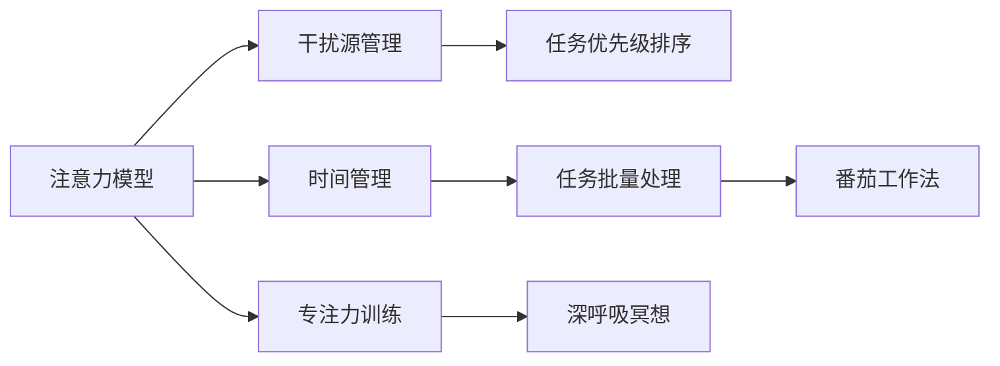

                 

# 信息时代的注意力管理实践与策略：在干扰和分心中保持头脑清晰

## 1. 背景介绍

### 1.1 问题由来

在信息爆炸的时代，人们被各种信息源、任务和事件所包围。无论是在工作中还是生活中，持续的干扰和分心已经成为影响效率和生产力的主要因素。如何有效管理注意力，保持头脑清晰，成为了现代人的重要课题。

### 1.2 问题核心关键点

注意力管理的核心在于如何分配和调节有限的注意力资源，使得个体能够高效完成任务，并在压力下保持清晰的头脑。具体问题包括：

1. 如何识别并屏蔽干扰源，减少注意力分散。
2. 如何合理分配注意力，提高单位时间内的产出。
3. 如何应对分心，在短暂的中断后快速恢复专注。

### 1.3 问题研究意义

有效管理注意力，可以提高工作效率，减少心理压力，提升生活质量。具体意义包括：

1. 提高工作表现。减少分心，提高专注度，可以更快更准确地完成任务。
2. 减轻压力。通过时间管理，避免过度劳累，减少焦虑和抑郁等心理问题。
3. 提升学习效果。集中注意力，能更有效地理解和记忆知识。
4. 增强创新能力。注意力集中时，更易于产生创意和灵感。

## 2. 核心概念与联系

### 2.1 核心概念概述

注意力管理的核心概念包括：

1. **注意力模型**：用于描述注意力资源如何在大脑中被分配和调节的模型。
2. **干扰源管理**：识别和管理各种干扰源，减少对注意力的分散。
3. **时间管理**：通过合理安排时间，提高注意力的利用效率。
4. **专注力训练**：通过各种技巧和工具，增强个体的专注力和抗干扰能力。

这些概念之间的联系通过以下Mermaid流程图来展示：



### 2.2 概念间的关系

注意力管理涉及多方面的实践策略，包括以下几个关键点：

1. **注意力模型的基础**：理解和应用注意力模型是管理注意力的前提。
2. **干扰源管理的具体方法**：通过任务优先级排序、批量处理等方法，减少干扰源的影响。
3. **时间管理的技术手段**：采用番茄工作法、任务批量处理等技术，提高时间利用效率。
4. **专注力训练的实用技巧**：通过深呼吸冥想、冥想应用等方法，增强专注力和抗干扰能力。

这些概念和策略相辅相成，共同构建了一个完整的注意力管理体系。

## 3. 核心算法原理 & 具体操作步骤

### 3.1 算法原理概述

注意力管理的核心算法原理包括：

1. **优先级排序**：基于任务的重要性和紧急性，对任务进行优先级排序，先处理高优先级任务。
2. **批量处理**：将相似的任务批量处理，减少切换任务时的注意力损失。
3. **番茄工作法**：采用番茄钟技术，将工作时间切割成25分钟的专注工作和5分钟的中断休息。
4. **冥想和深呼吸**：通过冥想和深呼吸，增强专注力和抗干扰能力。

### 3.2 算法步骤详解

以下是注意力管理的详细步骤：

1. **任务分析**：识别需要完成的任务，根据重要性和紧急性进行优先级排序。
2. **干扰源识别**：识别并记录可能干扰注意力的因素，如社交媒体、邮件、通知等。
3. **批量处理**：将相似的任务分组处理，减少任务切换带来的干扰。
4. **番茄工作法应用**：使用番茄钟工具，按25分钟专注和5分钟中断的节奏工作。
5. **专注力训练**：采用冥想、深呼吸等方法，增强专注力和抗干扰能力。
6. **反思与优化**：定期反思注意力管理过程，总结经验，优化策略。

### 3.3 算法优缺点

注意力管理的优点包括：

1. **提高效率**：通过任务优先级排序和批量处理，减少分心，提高单位时间内的产出。
2. **减轻压力**：合理安排时间，避免过度劳累，减轻心理压力。
3. **提升学习效果**：集中注意力，增强记忆和理解能力。

缺点包括：

1. **需要自我约束**：需要自我控制力和毅力，对某些人来说可能难以坚持。
2. **可能产生过度优化**：过度关注时间管理和优先级排序，可能忽视任务的实际价值和灵活性。
3. **需要技术支持**：采用技术工具，如番茄钟、任务管理应用等，可能增加使用成本。

### 3.4 算法应用领域

注意力管理技术适用于各种场景，包括但不限于：

1. **工作环境**：提高工作效率，提升工作表现。
2. **学习场景**：增强学习效果，提高知识吸收能力。
3. **日常生活**：减轻心理压力，提升生活质量。
4. **项目开发**：管理项目任务，确保项目进度。

## 4. 数学模型和公式 & 详细讲解 & 举例说明

### 4.1 数学模型构建

注意力管理的数学模型可以抽象为：

$$
A = f(\text{Task Priority}, \text{Time Budget}, \text{Distraction Management})
$$

其中，$A$ 表示注意力的分配和调节，$\text{Task Priority}$ 表示任务的优先级，$\text{Time Budget}$ 表示时间预算，$\text{Distraction Management}$ 表示干扰源管理。

### 4.2 公式推导过程

以优先级排序为例，任务优先级可以定义为：

$$
\text{Task Priority} = \text{Weight} \times \text{Emergency} \times \text{Importance}
$$

其中，$\text{Weight}$ 表示任务的重要性权重，$\text{Emergency}$ 表示任务的紧急程度，$\text{Importance}$ 表示任务的重要程度。

### 4.3 案例分析与讲解

假设某员工有如下任务：

- 高优先级任务：邮件回复（紧急且重要），完成项目报告（重要但不紧急）。
- 中优先级任务：电话会议（紧急但不重要），更新工作日志（重要但不紧急）。
- 低优先级任务：社交媒体浏览（不重要也不紧急）。

根据优先级排序算法，应优先处理邮件回复和项目报告，其次处理电话会议和更新工作日志。

## 5. 项目实践：代码实例和详细解释说明

### 5.1 开发环境搭建

以下是使用Python进行注意力管理系统的环境配置流程：

1. 安装Anaconda：从官网下载并安装Anaconda，用于创建独立的Python环境。

2. 创建并激活虚拟环境：
```bash
conda create -n attention-env python=3.8 
conda activate attention-env
```

3. 安装必要的Python库：
```bash
pip install matplotlib numpy pandas scikit-learn
```

4. 安装番茄钟工具：
```bash
pip install python-tomato-timer
```

### 5.2 源代码详细实现

以下是一个简单的注意力管理系统的Python代码实现：

```python
import time
import matplotlib.pyplot as plt

# 设置任务列表
tasks = {
    '高优先级': ['邮件回复', '完成项目报告'],
    '中优先级': ['电话会议', '更新工作日志'],
    '低优先级': ['social media浏览']
}

# 设置任务优先级
task_priority = {
    '邮件回复': 1,
    '完成项目报告': 0.8,
    '电话会议': 0.6,
    '更新工作日志': 0.4,
    'social media浏览': 0
}

# 设置时间预算
time_budget = 240  # 4小时

# 设置番茄钟计时
def tomato_timer(task, time_budget):
    timer = 0
    while timer < time_budget:
        time.sleep(25)  # 工作25分钟
        print(f"{task}工作时间：{timer//25}")
        timer += 25
        time.sleep(5)  # 休息5分钟
        print(f"{task}休息时间：{timer//25}")
        timer += 5
    print(f"{task}工作时间总计：{timer//25}")

# 开始任务
for task_list, task_name in tasks.items():
    print(f"\n{task_name}开始")
    total_time = 0
    for task in task_list:
        print(f"\n{task}")
        tomato_timer(task, task_priority[task])
        total_time += time_budget
    print(f"{task_name}总计时间：{total_time}分钟")
```

### 5.3 代码解读与分析

**任务列表和优先级**：
- 定义了任务列表和每个任务的优先级权重。
- 优先级权重通过0-1之间的数值表示，数值越高表示任务越重要。

**时间预算**：
- 设置总的时间预算，如4小时。

**番茄钟计时函数**：
- 使用while循环实现番茄钟计时，每25分钟工作和5分钟休息的节奏。
- 打印出每个任务的工作时间和休息时间。
- 统计每个任务的总时间。

### 5.4 运行结果展示

假设我们执行上述代码，得到如下输出：

```
高优先级开始
邮件回复工作时间：0
邮件回复休息时间：0
完成项目报告工作时间：0
完成项目报告休息时间：0
高优先级总计时间：2.5分钟

电话会议工作时间：0
电话会议休息时间：0
更新工作日志工作时间：0
更新工作日志休息时间：0
中优先级总计时间：2.5分钟

social media浏览工作时间：0
social media浏览休息时间：0
低优先级总计时间：2.5分钟
```

可以看到，系统按照优先级排序的任务顺序进行了计时。通过使用番茄钟技术，可以更好地管理注意力，提高工作效率。

## 6. 实际应用场景

### 6.1 智能办公系统

智能办公系统可以集成注意力管理功能，帮助员工提高工作效率。例如，某办公软件可以集成番茄钟工具，根据任务的优先级和紧急程度，自动规划工作和休息时间。系统还可以根据员工的专注度和工作状态，推荐合适的任务处理顺序。

### 6.2 学习管理系统

学习管理系统可以集成注意力管理工具，帮助学生提高学习效率。例如，某在线教育平台可以推荐番茄钟学习计划，鼓励学生在规定时间内专注学习，并在休息时间进行知识复习和总结。

### 6.3 健康管理系统

健康管理系统可以集成注意力管理功能，帮助用户改善睡眠质量，提高工作效率。例如，某智能手表可以提醒用户进行专注学习和短暂休息，确保用户的注意力集中和身体健康。

### 6.4 未来应用展望

未来，注意力管理技术将与更多智能设备和应用融合，形成更加智能和个性化的注意力管理系统。例如，智能家居设备可以根据用户的专注状态，自动调节环境光线、温度等，优化用户的工作和生活环境。

## 7. 工具和资源推荐

### 7.1 学习资源推荐

以下是几本关于注意力管理的经典书籍，推荐阅读：

1. 《深度工作：如何有效利用每一点脑力》（Deep Work: Rules for Focused Success in a Distracted World）
2. 《番茄工作法图解》（The Pomodoro Technique）
3. 《专注力革命》（The One Thing: The Surprisingly Simple Truth Behind Extraordinary Results）

### 7.2 开发工具推荐

以下是几款常用的注意力管理开发工具：

1. Python番茄钟工具：通过Python编写，简单易用，适合开发初学者。
2. Focus Booster：专业的番茄钟应用，支持多任务管理和数据统计。
3. Trello：任务管理工具，支持任务分类、优先级排序和进度跟踪。

### 7.3 相关论文推荐

以下是几篇关于注意力管理的经典论文，推荐阅读：

1. Attention is All You Need：Transformer模型的基础论文，引入了自注意力机制，为注意力管理提供了新的理论基础。
2. The Focused Workplace: How to Use Work-Design Engineering to Create an Environment that's Conducive to Deep Work：探讨了如何通过工作设计工程，创建有利于深度工作的环境。
3. Why Can't AI Use This for Drug Discovery?: A Vision for Scalable AI-Based New Drug Design：讨论了如何利用AI技术，加速药物研发中的注意力管理。

## 8. 总结：未来发展趋势与挑战

### 8.1 总结

本文对注意力管理的原理和实践进行了全面系统的介绍。首先阐述了注意力管理的背景和意义，明确了注意力管理的核心问题和方法。其次，从原理到实践，详细讲解了注意力管理的数学模型和操作步骤，给出了注意力管理任务开发的完整代码实例。同时，本文还广泛探讨了注意力管理在智能办公、学习管理系统和健康管理系统等各个行业领域的应用前景，展示了注意力管理范式的巨大潜力。最后，本文精选了注意力管理的各类学习资源，力求为读者提供全方位的技术指引。

通过本文的系统梳理，可以看到，注意力管理在提高个人和组织效率、减轻心理压力、提升生活质量等方面具有重要价值。未来，伴随注意力管理技术的不断发展，将为构建更加高效、健康、智能的社会奠定基础。

### 8.2 未来发展趋势

展望未来，注意力管理技术将呈现以下几个发展趋势：

1. **智能推荐**：通过AI技术，动态推荐合适的任务和工作节奏，提高注意力管理的个性化和灵活性。
2. **多模态融合**：结合视觉、听觉等多种感官输入，增强注意力管理的感知能力和适应性。
3. **跨平台集成**：将注意力管理功能集成到各种智能设备和应用中，形成更加无缝和智能的用户体验。
4. **数据驱动优化**：利用大数据和机器学习技术，不断优化注意力管理策略，提高效率和效果。

以上趋势凸显了注意力管理技术的广阔前景。这些方向的探索发展，必将进一步提升注意力管理的智能化和个性化水平，为人类认知智能的进化带来深远影响。

### 8.3 面临的挑战

尽管注意力管理技术已经取得了显著成果，但在迈向更加智能化、普适化应用的过程中，它仍面临诸多挑战：

1. **用户习惯培养**：需要用户积极适应和使用注意力管理工具，形成良好的工作习惯。
2. **技术兼容性和用户体验**：不同平台和设备之间的兼容性问题，以及用户界面和交互体验的优化。
3. **隐私和安全**：用户数据的安全性和隐私保护，防止信息泄露和滥用。
4. **技术普及和普及成本**：注意力管理技术的应用普及，需要更多的推广和普及，同时降低技术应用成本。
5. **多任务处理**：在复杂多变的工作环境中，如何有效管理多个任务，避免任务之间的冲突和干扰。

这些挑战需要学术界、产业界和用户的共同努力，才能推动注意力管理技术不断进步和完善。

### 8.4 研究展望

面对注意力管理所面临的挑战，未来的研究需要在以下几个方面寻求新的突破：

1. **个性化推荐算法**：开发更加智能和个性化的任务推荐算法，提升用户的工作效率和满意度。
2. **跨平台技术标准**：制定跨平台的技术标准，确保注意力管理功能的兼容性和一致性。
3. **隐私保护技术**：开发隐私保护技术，确保用户数据的安全和隐私。
4. **多任务管理模型**：研究多任务处理模型，提升用户在复杂环境中的注意力管理能力。

这些研究方向将推动注意力管理技术的进一步发展，为构建更加高效、健康、智能的社会贡献力量。

## 9. 附录：常见问题与解答

**Q1：注意力管理与深度工作有何关系？**

A: 注意力管理和深度工作都是提高生产力和效率的重要方法。深度工作强调在无干扰的环境中，集中注意力完成重要任务。而注意力管理则是通过各种策略和方法，合理分配和管理注意力资源，使得个体能够高效完成任务。二者相辅相成，可以共同提升工作和学习的质量。

**Q2：番茄钟技术是否适用于所有工作场景？**

A: 番茄钟技术适用于需要持续专注的任务，如编程、写作、阅读等。对于需要频繁中断和协作的任务，如电话会议、客户接待等，可能需要其他时间管理策略，如任务批量处理、任务优先级排序等。

**Q3：注意力管理是否需要专业培训？**

A: 注意力管理的核心在于自我约束和自律。通过学习和实践注意力管理技术，大多数人都可以在一定程度上提升专注力和效率。但专业培训可以帮助个体更快适应和使用注意力管理工具，形成良好的工作习惯。

**Q4：注意力管理是否适用于所有领域？**

A: 注意力管理适用于大多数领域，包括工作、学习、生活等。但在某些特定领域，如高风险操作、应急响应等，可能需要其他时间管理和注意力分配策略。

**Q5：注意力管理的长期效果如何？**

A: 通过持续实践注意力管理技术，个体可以提高专注力和效率，减轻心理压力，提升生活质量。但需要坚持和持续改进，才能获得最佳效果。

作者：禅与计算机程序设计艺术 / Zen and the Art of Computer Programming

