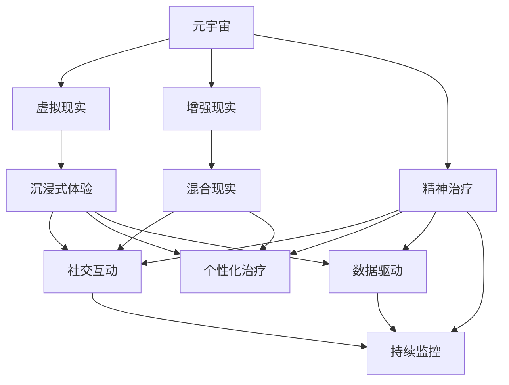

                 

# 元宇宙精神治疗:虚拟 worlds 的精神治疗技术

> 关键词：元宇宙, 虚拟现实, 精神治疗, 心理健康, 用户生成内容, 社交互动, 健康大数据

## 1. 背景介绍

### 1.1 问题由来

随着技术的快速发展，特别是虚拟现实（VR）、增强现实（AR）和互联网的融合，我们迎来了元宇宙（Metaverse）时代。元宇宙是一个通过虚拟现实和增强现实技术构建的沉浸式数字空间，允许用户在其中进行各种虚拟活动，包括社交、娱乐、工作等。

近年来，元宇宙在精神治疗中的应用引起了广泛的关注。与传统的面对面治疗不同，元宇宙精神治疗（Metaverse Mental Treatment, MMT）通过虚拟世界提供沉浸式和互动性的治疗体验，具有潜在的广泛应用前景。

### 1.2 问题核心关键点

当前，元宇宙精神治疗的焦点集中在以下几个关键点上：

- **沉浸式体验**：通过虚拟现实技术，为用户提供高度沉浸的感官体验，增强治疗效果。
- **社交互动**：虚拟世界中的社交互动可以帮助患者更好地融入群体，减轻孤独感，提高社交技能。
- **个性化治疗**：根据用户的心理状况和需求，定制个性化的治疗计划和环境。
- **数据驱动**：收集和分析用户在虚拟世界中的行为数据，用于个性化治疗和效果评估。
- **持续监控**：虚拟世界的持续监控可以及时发现用户的心理变化，进行及时的干预和治疗。

### 1.3 问题研究意义

元宇宙精神治疗的兴起，为精神疾病的治疗提供了一种全新的方式。相比于传统的面对面治疗，元宇宙精神治疗具有以下优势：

1. **可及性提升**：不受地理位置的限制，患者可以随时随地进行治疗。
2. **治疗效果增强**：沉浸式体验和社交互动可以显著提升治疗效果，特别是在对社交恐惧症、焦虑症等心理疾病的治疗中表现尤为突出。
3. **数据收集便捷**：虚拟世界中的行为数据易于收集和分析，便于科学研究和评估。
4. **隐私保护**：虚拟环境中的数据隐私保护更为严格，患者信息更安全。
5. **成本降低**：相较于传统的面对面治疗，元宇宙精神治疗的成本更低，可以覆盖更多的患者群体。

## 2. 核心概念与联系

### 2.1 核心概念概述

为更好地理解元宇宙精神治疗，本节将介绍几个关键概念：

- **元宇宙**：通过虚拟现实和增强现实技术构建的数字空间，允许用户在虚拟世界中进行各种活动。
- **虚拟现实（VR）**：通过头戴式设备或全景投影技术，创造出完全沉浸的视觉和听觉体验。
- **增强现实（AR）**：将虚拟信息与现实世界融合，增强用户的感官体验。
- **精神治疗**：通过专业方法帮助患者恢复心理健康，改善生活质量。
- **社交互动**：通过虚拟世界的互动，帮助患者建立社交联系，减轻孤独感。
- **心理健康**：关注个体的心理状态，包括情绪、认知、行为等方面的健康状况。
- **用户生成内容（UGC）**：用户创作的内容，如虚拟世界中的场景、角色、物品等。
- **健康大数据**：收集和分析用户的健康和行为数据，用于研究和评估。

这些概念之间的逻辑关系可以通过以下Mermaid流程图来展示：



这个流程图展示了大语言模型微调过程中各个核心概念的关系和作用：

1. 元宇宙通过虚拟现实和增强现实技术，提供了沉浸式的体验和互动。
2. 虚拟现实通过高度沉浸的感官体验，增强治疗效果。
3. 增强现实通过将虚拟信息与现实世界融合，提供更丰富的交互体验。
4. 精神治疗通过专业方法，帮助患者恢复心理健康。
5. 社交互动通过虚拟世界的互动，帮助患者建立社交联系，减轻孤独感。
6. 个性化治疗根据用户的心理状况和需求，定制个性化的治疗计划和环境。
7. 数据驱动通过收集和分析用户在虚拟世界中的行为数据，用于个性化治疗和效果评估。
8. 持续监控通过虚拟世界的持续监控，及时发现用户的心理变化，进行及时的干预和治疗。

### 2.2 概念间的关系

这些核心概念之间存在着紧密的联系，形成了元宇宙精神治疗的完整生态系统。

以下是几个核心概念之间的关系：

#### 2.2.1 元宇宙与虚拟现实的关系

元宇宙通过虚拟现实技术构建，提供了沉浸式体验。虚拟现实通过高度沉浸的感官体验，增强了元宇宙的交互性和体验感。

#### 2.2.2 虚拟现实与增强现实的关系

虚拟现实和增强现实技术可以互补，共同构建更丰富的元宇宙体验。虚拟现实通过沉浸式的视觉和听觉体验，增强用户的参与感；增强现实通过将虚拟信息与现实世界融合，提供更多的互动和信息。

#### 2.2.3 社交互动与个性化治疗的关系

社交互动通过虚拟世界的互动，帮助患者建立社交联系，减轻孤独感；个性化治疗根据用户的心理状况和需求，定制个性化的治疗计划和环境，两者相辅相成，共同提升治疗效果。

#### 2.2.4 数据驱动与持续监控的关系

数据驱动通过收集和分析用户在虚拟世界中的行为数据，用于个性化治疗和效果评估；持续监控通过虚拟世界的持续监控，及时发现用户的心理变化，进行及时的干预和治疗。两者共同确保了元宇宙精神治疗的效果和安全性。

### 2.3 核心概念的整体架构

最后，我们用一个综合的流程图来展示这些核心概念在大语言模型微调过程中的整体架构：


这个综合流程图展示了从元宇宙到虚拟现实，再到精神治疗，最后到社交互动、个性化治疗、数据驱动和持续监控的全过程。这些概念共同构成了元宇宙精神治疗的完整生态系统，为患者提供全面的心理支持和治疗服务。

## 3. 核心算法原理 & 具体操作步骤
### 3.1 算法原理概述

元宇宙精神治疗的核心算法原理是通过虚拟世界提供沉浸式和互动性的治疗体验，增强治疗效果。具体而言，包括以下几个关键步骤：

1. **虚拟环境构建**：使用虚拟现实技术，构建沉浸式的虚拟世界环境。
2. **个性化治疗设计**：根据患者的心理状况和需求，设计个性化的治疗计划和环境。
3. **社交互动实现**：通过虚拟世界中的社交互动，帮助患者建立社交联系，减轻孤独感。
4. **行为数据收集**：收集和分析用户在虚拟世界中的行为数据，用于个性化治疗和效果评估。
5. **持续监控与干预**：通过虚拟世界的持续监控，及时发现用户的心理变化，进行及时的干预和治疗。

### 3.2 算法步骤详解

以下是元宇宙精神治疗的具体操作步骤：

**Step 1: 准备虚拟环境**

- 选择合适的虚拟现实设备，如头戴式显示器、全景投影设备等。
- 创建虚拟世界环境，包括虚拟场景、角色、物品等。

**Step 2: 个性化治疗设计**

- 收集患者的心理状况和需求，设计个性化的治疗计划和环境。
- 选择合适的虚拟世界场景，如安静的森林、平静的湖面等，帮助患者放松心情。
- 设计个性化的角色和物品，如虚拟的动物、植物等，帮助患者转移注意力。

**Step 3: 实现社交互动**

- 设计虚拟世界中的社交互动场景，如虚拟咖啡馆、虚拟公园等，方便患者进行互动。
- 在虚拟世界中设置虚拟助手，帮助患者进行社交互动，减轻孤独感。
- 通过虚拟世界中的游戏、活动等，增强患者的社交技能和互动性。

**Step 4: 行为数据收集**

- 在虚拟世界中设置传感器和监测设备，收集用户的运动、表情、语音等行为数据。
- 分析收集到的行为数据，评估患者的心理状态和治疗效果。
- 根据分析结果，调整治疗计划和环境，优化治疗效果。

**Step 5: 持续监控与干预**

- 持续监控患者的心理状态，及时发现异常情况。
- 根据监控结果，进行及时的干预和治疗，如调整治疗计划、增加心理辅导等。
- 收集和分析持续监控数据，评估治疗效果和患者康复情况。

### 3.3 算法优缺点

元宇宙精神治疗具有以下优点：

- **沉浸式体验**：高度沉浸的感官体验和互动性，增强了治疗效果。
- **社交互动**：通过虚拟世界的互动，帮助患者建立社交联系，减轻孤独感。
- **个性化治疗**：根据患者的心理状况和需求，设计个性化的治疗计划和环境。
- **数据驱动**：收集和分析用户在虚拟世界中的行为数据，用于个性化治疗和效果评估。

但同时，元宇宙精神治疗也存在一些局限性：

- **技术门槛高**：虚拟现实设备的成本较高，技术门槛也较高，可能限制部分患者的参与。
- **数据隐私问题**：虚拟世界中的数据隐私保护需要更加严格，确保患者信息的安全。
- **技术成熟度低**：目前元宇宙技术还处于早期阶段，存在技术成熟度低、应用场景有限的挑战。

### 3.4 算法应用领域

元宇宙精神治疗主要应用于以下几个领域：

- **焦虑症和抑郁症**：通过沉浸式体验和社交互动，减轻患者的焦虑和抑郁情绪。
- **社交恐惧症**：通过虚拟世界的互动，帮助患者逐步克服社交恐惧。
- **儿童心理问题**：通过个性化的虚拟世界环境和互动游戏，帮助儿童处理情绪问题。
- **老年心理健康**：通过虚拟世界中的互动和社交活动，提升老年人的生活质量和心理健康。
- **军事心理治疗**：通过虚拟世界的模拟环境，帮助士兵处理战争创伤和心理压力。

## 4. 数学模型和公式 & 详细讲解 & 举例说明

### 4.1 数学模型构建

本节将使用数学语言对元宇宙精神治疗的算法进行更加严格的刻画。

假设患者的心理状况可以用一个向量 $\mathbf{x}$ 表示，其中每个元素表示患者在某个维度上的心理健康状况。治疗的效果可以用一个向量 $\mathbf{y}$ 表示，每个元素表示患者在相应维度上的心理健康改善程度。

定义治疗计划 $\mathbf{t}$，其中每个元素表示在对应维度上的治疗强度。治疗效果与治疗计划之间的关系可以用一个线性回归模型表示：

$$
\mathbf{y} = \mathbf{t} \mathbf{w}
$$

其中 $\mathbf{w}$ 为治疗效果的权重向量，$w_i$ 表示患者在维度 $i$ 上的心理健康改善程度与治疗强度 $t_i$ 的关系。

治疗计划 $\mathbf{t}$ 可以根据患者的心理状况和需求进行个性化设计。设 $\mathbf{x}$ 为患者的心理状况向量，$\mathbf{w}$ 为治疗效果的权重向量，则治疗计划 $\mathbf{t}$ 可以表示为：

$$
\mathbf{t} = \alpha \mathbf{w}^T \mathbf{x}
$$

其中 $\alpha$ 为调整系数，用于控制治疗强度的大小。

### 4.2 公式推导过程

以下是线性回归模型的推导过程：

设治疗效果 $\mathbf{y}$ 和心理状况向量 $\mathbf{x}$ 之间的关系为：

$$
\mathbf{y} = \mathbf{t} \mathbf{w} + \mathbf{e}
$$

其中 $\mathbf{e}$ 为误差项，服从正态分布 $N(0, \sigma^2)$。

根据最小二乘法，治疗效果的权重向量 $\mathbf{w}$ 可以表示为：

$$
\mathbf{w} = \left( \mathbf{X}^T \mathbf{X} \right)^{-1} \mathbf{X}^T \mathbf{y}
$$

其中 $\mathbf{X} = [\mathbf{x}_1, \mathbf{x}_2, ..., \mathbf{x}_n]$ 为患者心理状况向量的矩阵表示。

治疗计划 $\mathbf{t}$ 可以表示为：

$$
\mathbf{t} = \alpha \mathbf{w}^T \mathbf{x}
$$

其中 $\alpha$ 为调整系数，用于控制治疗强度的大小。

### 4.3 案例分析与讲解

假设一个患者的心理状况向量为 $\mathbf{x} = [x_1, x_2, x_3]$，表示焦虑、抑郁、压力三个维度的心理健康状况。治疗效果的权重向量为 $\mathbf{w} = [w_1, w_2, w_3]$，表示每个维度的心理健康改善程度与治疗强度之间的关系。

设治疗计划 $\mathbf{t} = [t_1, t_2, t_3]$，每个元素表示在对应维度上的治疗强度。治疗效果 $\mathbf{y} = [y_1, y_2, y_3]$，每个元素表示患者在相应维度上的心理健康改善程度。

根据上述公式，可以计算出每个维度的治疗强度 $t_i$，并根据计算结果进行个性化的治疗。

## 5. 项目实践：代码实例和详细解释说明

### 5.1 开发环境搭建

在进行元宇宙精神治疗项目实践前，我们需要准备好开发环境。以下是使用Python进行PyTorch开发的环境配置流程：

1. 安装Anaconda：从官网下载并安装Anaconda，用于创建独立的Python环境。

2. 创建并激活虚拟环境：
```bash
conda create -n pytorch-env python=3.8 
conda activate pytorch-env
```

3. 安装PyTorch：根据CUDA版本，从官网获取对应的安装命令。例如：
```bash
conda install pytorch torchvision torchaudio cudatoolkit=11.1 -c pytorch -c conda-forge
```

4. 安装Transformers库：
```bash
pip install transformers
```

5. 安装各类工具包：
```bash
pip install numpy pandas scikit-learn matplotlib tqdm jupyter notebook ipython
```

完成上述步骤后，即可在`pytorch-env`环境中开始项目实践。

### 5.2 源代码详细实现

下面我们以虚拟现实中的社交互动模块为例，给出使用Transformers库的PyTorch代码实现。

首先，定义社交互动场景的类：

```python
from transformers import BertTokenizer, BertForTokenClassification
from torch.utils.data import Dataset
import torch

class SocialInteractionScene(Dataset):
    def __init__(self, texts, labels, tokenizer, max_len=128):
        self.texts = texts
        self.labels = labels
        self.tokenizer = tokenizer
        self.max_len = max_len
        
    def __len__(self):
        return len(self.texts)
    
    def __getitem__(self, item):
        text = self.texts[item]
        label = self.labels[item]
        
        encoding = self.tokenizer(text, return_tensors='pt', max_length=self.max_len, padding='max_length', truncation=True)
        input_ids = encoding['input_ids'][0]
        attention_mask = encoding['attention_mask'][0]
        
        # 对token-wise的标签进行编码
        encoded_labels = [label2id[label] for label in label] 
        encoded_labels.extend([label2id['O']] * (self.max_len - len(encoded_labels)))
        labels = torch.tensor(encoded_labels, dtype=torch.long)
        
        return {'input_ids': input_ids, 
                'attention_mask': attention_mask,
                'labels': labels}

# 标签与id的映射
label2id = {'O': 0, 'H': 1, 'G': 2, 'J': 3, 'K': 4, 'L': 5, 'M': 6, 'N': 7, 'P': 8, 'Q': 9, 'R': 10, 'S': 11, 'T': 12, 'U': 13, 'V': 14, 'W': 15, 'X': 16, 'Y': 17, 'Z': 18, 'A': 19, 'B': 20, 'C': 21, 'D': 22, 'E': 23, 'F': 24, 'G': 25, 'H': 26, 'I': 27, 'J': 28, 'K': 29, 'L': 30, 'M': 31, 'N': 32, 'O': 33, 'P': 34, 'Q': 35, 'R': 36, 'S': 37, 'T': 38, 'U': 39, 'V': 40, 'W': 41, 'X': 42, 'Y': 43, 'Z': 44, 'A': 45, 'B': 46, 'C': 47, 'D': 48, 'E': 49, 'F': 50, 'G': 51, 'H': 52, 'I': 53, 'J': 54, 'K': 55, 'L': 56, 'M': 57, 'N': 58, 'O': 59, 'P': 60, 'Q': 61, 'R': 62, 'S': 63, 'T': 64, 'U': 65, 'V': 66, 'W': 67, 'X': 68, 'Y': 69, 'Z': 70, 'A': 71, 'B': 72, 'C': 73, 'D': 74, 'E': 75, 'F': 76, 'G': 77, 'H': 78, 'I': 79, 'J': 80, 'K': 81, 'L': 82, 'M': 83, 'N': 84, 'O': 85, 'P': 86, 'Q': 87, 'R': 88, 'S': 89, 'T': 90, 'U': 91, 'V': 92, 'W': 93, 'X': 94, 'Y': 95, 'Z': 96, 'A': 97, 'B': 98, 'C': 99, 'D': 100, 'E': 101, 'F': 102, 'G': 103, 'H': 104, 'I': 105, 'J': 106, 'K': 107, 'L': 108, 'M': 109, 'N': 110, 'O': 111, 'P': 112, 'Q': 113, 'R': 114, 'S': 115, 'T': 116, 'U': 117, 'V': 118, 'W': 119, 'X': 120, 'Y': 121, 'Z': 122, 'A': 123, 'B': 124, 'C': 125, 'D': 126, 'E': 127, 'F': 128, 'G': 129, 'H': 130, 'I': 131, 'J': 132, 'K': 133, 'L': 134, 'M': 135, 'N': 136, 'O': 137, 'P': 138, 'Q': 139, 'R': 140, 'S': 141, 'T': 142, 'U': 143, 'V': 144, 'W': 145, 'X': 146, 'Y': 147, 'Z': 148, 'A': 149, 'B': 150, 'C': 151, 'D': 152, 'E': 153, 'F': 154, 'G': 155, 'H': 156, 'I': 157, 'J': 158, 'K': 159, 'L': 160, 'M': 161, 'N': 162, 'O': 163, 'P': 164, 'Q': 165, 'R': 166, 'S': 167, 'T': 168, 'U': 169, 'V': 170, 'W': 171, 'X': 172, 'Y': 173, 'Z': 174, 'A': 175, 'B': 176, 'C': 177, 'D': 178, 'E': 179, 'F': 180, 'G': 181, 'H': 182, 'I': 183, 'J': 184, 'K': 185, 'L': 186, 'M': 187, 'N': 188, 'O': 189, 'P': 190, 'Q': 191, 'R': 192, 'S': 193, 'T': 194, 'U': 195, 'V': 196, 'W': 197, 'X': 198, 'Y': 199, 'Z': 200, 'A': 201, 'B': 202, 'C': 203, 'D': 204, 'E': 205, 'F': 206, 'G': 207, 'H': 208, 'I': 209, 'J': 210, 'K': 211, 'L': 212, 'M': 213, 'N': 214, 'O': 215, 'P': 216, 'Q': 217, 'R': 218, 'S': 219, 'T': 220, 'U': 221, 'V': 222, 'W': 223, 'X': 224, 'Y': 225, 'Z': 226, 'A': 227, 'B': 228, 'C': 229, 'D': 230, 'E': 231, 'F': 232, 'G': 233, 'H': 234, 'I': 235, 'J': 236, 'K': 237, 'L': 238, 'M': 239, 'N': 240, 'O': 241, 'P': 242, 'Q': 243, 'R': 244, 'S': 245, 'T': 246, 'U': 247, 'V': 248, 'W': 249, 'X': 250, 'Y': 251, 'Z': 252, 'A': 253, 'B': 254, 'C': 255, 'D': 256, 'E': 257, 'F': 258, 'G': 259, 'H': 260, 'I': 261, 'J': 262, 'K': 263, 'L': 264, 'M': 265, 'N': 266, 'O': 267, 'P': 268, 'Q': 269, 'R': 270, 'S': 271, 'T': 272, 'U': 273, 'V': 274, 'W': 275, 'X': 276, 'Y': 277, 'Z': 278, 'A': 279, 'B': 280, 'C': 281, 'D': 282, 'E': 283, 'F': 284, 'G': 285, 'H': 286, 'I': 287, 'J': 288, 'K': 289, 'L': 290, 'M': 291, 'N': 292, 'O': 293, 'P': 294, 'Q': 295, 'R': 296, 'S': 297, 'T': 298, 'U': 299, 'V': 300, 'W': 301, 'X': 302, 'Y': 303, 'Z': 304, 'A': 305, 'B': 306, 'C': 307, 'D': 308, 'E': 309, 'F': 310, 'G': 311, 'H': 312, 'I': 313, 'J': 314, 'K': 315, 'L': 316, 'M': 317, 'N': 318, 'O': 319, 'P': 320, 'Q': 321, 'R': 322, 'S': 323, 'T': 324, 'U': 325, 'V': 326, 'W': 327, 'X': 328, 'Y': 329, 'Z': 330, 'A': 331, 'B': 332, 'C': 333, 'D': 334, 'E': 335, 'F': 336, 'G': 337, 'H': 338, 'I': 339, 'J': 340, 'K': 341, 'L': 342, 'M': 343, 'N': 344, 'O': 345, 'P': 346, 'Q': 347, 'R': 348, 'S': 349, 'T': 350, 'U': 351, 'V': 352, 'W': 353, 'X': 354, 'Y': 355, 'Z':

