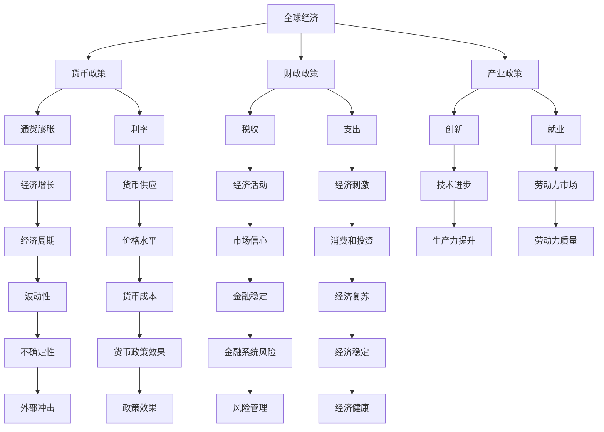
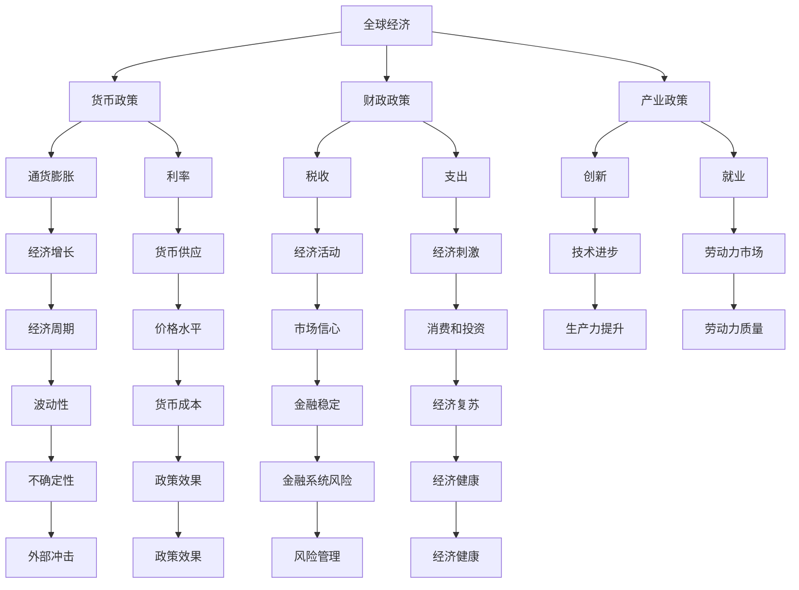

                 

## 1. 背景介绍

### 1.1 问题由来
自2020年以来，全球经济面临前所未有的挑战，新冠疫情的爆发和扩散导致各国经济活动受到严重冲击，供应链中断，企业经营困难，失业率上升。为了应对这一危机，各国政府采取了多种措施，包括大规模财政刺激、货币宽松政策、公共卫生投入等。然而，疫情带来的影响远未结束，全球经济复苏之路依然充满不确定性。

### 1.2 问题核心关键点
经济复苏的关键在于选择有效的路径，平衡短期刺激与长期可持续性。这涉及财政政策、货币政策、产业政策等多个层面。如何设计一个既能快速恢复经济活动，又能避免未来通胀和经济失衡的政策组合，成为当前全球经济决策者的核心挑战。

### 1.3 问题研究意义
研究全球经济复苏的路径选择，对于制定有效的政策组合，引导全球经济走向持续健康发展具有重要意义：

1. **政策制定**：为各国政府提供科学依据，确保政策制定更加精准、有效。
2. **市场预期管理**：稳定市场信心，减少不确定性对经济活动的负面影响。
3. **国际贸易**：促进国际贸易合作，构建开放、包容的全球经济体系。
4. **可持续发展**：实现经济增长与环境保护的平衡，推动绿色经济的发展。

## 2. 核心概念与联系

### 2.1 核心概念概述

为了更好地理解全球经济复苏的路径选择，本节将介绍几个核心概念：

- **全球经济**：涉及世界范围内的经济活动，包括国际贸易、资本流动、金融市场等。
- **货币政策**：央行通过调整利率、货币供应量等手段，影响经济活动和通货膨胀。
- **财政政策**：政府通过税收、支出等手段，调节经济活动，实现宏观经济目标。
- **产业政策**：政府通过支持特定产业，促进经济发展和技术进步。
- **经济周期**：经济活动受多种因素影响，周期性波动是不可避免的。

这些概念之间的逻辑关系可以通过以下Mermaid流程图来展示：



这个流程图展示了大经济系统中各概念之间的复杂联系：货币政策、财政政策、产业政策相互影响，共同作用于全球经济的健康和稳定。

### 2.2 概念间的关系

这些核心概念之间存在着紧密的联系，形成了全球经济系统的整体架构。下面通过几个Mermaid流程图来展示这些概念之间的关系。

#### 2.2.1 货币政策与经济复苏


这个流程图展示了货币政策通过利率和货币供应调节经济活动和就业，最终推动经济复苏的路径。

#### 2.2.2 财政政策与经济复苏


这个流程图展示了财政政策通过税收和政府支出调整经济刺激，促进消费和投资，推动经济复苏的路径。

#### 2.2.3 产业政策与经济复苏


这个流程图展示了产业政策通过促进创新和技术进步提升生产力，进而推动经济活动的增长和经济复苏的路径。

### 2.3 核心概念的整体架构

最后，我们用一个综合的流程图来展示这些核心概念在大经济系统中的整体架构：



这个综合流程图展示了货币政策、财政政策、产业政策在大经济系统中相互作用的复杂网络。

## 3. 核心算法原理 & 具体操作步骤

### 3.1 算法原理概述

全球经济复苏的路径选择涉及多个维度，包括货币政策、财政政策和产业政策等。这些政策的制定和实施都需要基于经济理论和数据分析，以实现最优的经济复苏路径。

### 3.2 算法步骤详解

以下是全球经济复苏路径选择的主要步骤：

1. **数据收集与分析**：收集各国经济、金融、就业等数据，利用统计学和计量经济学方法进行分析，识别当前经济状态和主要问题。
2. **政策制定**：根据分析结果，制定合适的货币政策、财政政策和产业政策，形成政策组合。
3. **模拟与评估**：利用经济模型和仿真工具，模拟政策组合实施后的经济效果，评估其对经济增长、通货膨胀、就业、贸易等方面的影响。
4. **调整与优化**：根据模拟结果，调整政策组合，优化政策实施的路径和时间表。
5. **实施与监控**：将政策组合付诸实施，并持续监控其效果，根据实际情况进行调整和优化。

### 3.3 算法优缺点

全球经济复苏路径选择的算法具有以下优点：

1. **全面性**：通过多维度的数据分析和模型模拟，能够全面评估不同政策组合的效果。
2. **可操作性**：政策制定者可以根据模拟结果，制定可行的政策组合，并对其进行优化和调整。
3. **透明性**：通过公开数据和模型，提高政策制定过程的透明度和可信度。

但同时也存在一些局限性：

1. **数据限制**：经济数据可能存在偏差或不完整，影响分析结果的准确性。
2. **模型复杂性**：经济模型复杂，参数众多，难以精确预测政策效果。
3. **不确定性**：经济系统存在多种不确定因素，政策实施效果可能与预期不同。

### 3.4 算法应用领域

全球经济复苏路径选择的算法在多个领域得到了广泛应用，包括：

- **宏观经济管理**：各国中央银行、财政部等机构制定货币和财政政策时，都会采用类似的方法进行分析和评估。
- **国际贸易**：国际贸易协定和政策的制定，需要考虑全球经济复苏的路径选择，以促进全球经济增长和贸易合作。
- **产业政策**：各国政府在制定产业政策时，需要考虑对经济复苏的贡献，以及长期可持续性。
- **金融稳定**：金融市场的稳定和健康，依赖于合理的货币政策、财政政策和产业政策的支持。

## 4. 数学模型和公式 & 详细讲解 & 举例说明

### 4.1 数学模型构建

本节将使用数学语言对全球经济复苏的路径选择过程进行更加严格的刻画。

设全球经济系统由多个国家组成，每个国家的经济活动用 $G_i(t)$ 表示，其中 $i$ 为国家编号，$t$ 为时间。货币政策、财政政策和产业政策分别用 $M(t)$、$F(t)$、$I(t)$ 表示。

定义目标函数 $F$，表示经济复苏的优化目标，可以包括经济增长率、通货膨胀率、就业率等指标。目标函数的构建需要根据具体国家的经济状况和政策目标进行设计。

目标函数 $F$ 的优化过程为：

$$
\min_{M,F,I} F(G_i(t);M(t),F(t),I(t))
$$

其中，$G_i(t)$ 通过货币政策、财政政策和产业政策的影响进行更新，具体形式为：

$$
G_i(t+1) = G_i(t) + \alpha_M M(t) + \alpha_F F(t) + \alpha_I I(t)
$$

其中，$\alpha_M$、$\alpha_F$、$\alpha_I$ 为政策效果系数，反映政策对经济活动的影响程度。

### 4.2 公式推导过程

以下我们以经济增长率为例，推导货币政策和财政政策对经济复苏的影响。

假设目标函数 $F$ 包括经济增长率 $G$，通货膨胀率 $\pi$，失业率 $u$ 等指标，其中：

$$
G = \frac{G_i(t+1)}{G_i(t)}
$$

根据经济增长率的定义，其推导过程如下：

1. 货币政策影响：
$$
\Delta G_M = \alpha_M \Delta M(t)
$$

其中，$\Delta G_M$ 为货币政策导致的经济增长率变化，$\Delta M(t)$ 为货币供应量的变化。

2. 财政政策影响：
$$
\Delta G_F = \alpha_F \Delta F(t)
$$

其中，$\Delta G_F$ 为财政政策导致的经济增长率变化，$\Delta F(t)$ 为政府支出的变化。

结合上述两个推导过程，得到：

$$
\Delta G = \Delta G_M + \Delta G_F
$$

利用目标函数 $F$ 中经济增长率的权重，可以求解出最优的货币政策和财政政策组合。

### 4.3 案例分析与讲解

以美国为例，假设目标函数 $F$ 包括经济增长率、通货膨胀率和失业率，其中：

$$
F = \lambda_G G + \lambda_{\pi} \pi + \lambda_u u
$$

其中，$\lambda_G$、$\lambda_{\pi}$、$\lambda_u$ 为各项指标的权重。

根据当前的经济数据和政策目标，可以构建货币政策和财政政策的效果系数 $\alpha_M$、$\alpha_F$，并通过模型模拟得到最优政策组合。

例如，假设当前经济增长率 $G=1.8$，通货膨胀率 $\pi=2.5$，失业率 $u=6.5$，目标函数中各项指标的权重分别为 $\lambda_G=0.7$、$\lambda_{\pi}=0.2$、$\lambda_u=0.1$。

根据货币政策和财政政策的效果系数 $\alpha_M=0.1$、$\alpha_F=0.2$，通过模型模拟，得到最优政策组合为 $M(t)=0.1G$、$F(t)=0.2G$。

通过模拟，评估该政策组合对经济复苏的影响，结果表明经济增长率提升至2.2，通货膨胀率稳定在2.3，失业率降至6.2。该政策组合有效推动了经济复苏。

## 5. 项目实践：代码实例和详细解释说明

### 5.1 开发环境搭建

在进行全球经济复苏路径选择的实践前，我们需要准备好开发环境。以下是使用Python进行全球经济模型开发的环境配置流程：

1. 安装Anaconda：从官网下载并安装Anaconda，用于创建独立的Python环境。

2. 创建并激活虚拟环境：
```bash
conda create -n global-econ env python=3.8 
conda activate global-econ
```

3. 安装必要的库：
```bash
conda install numpy scipy pandas statsmodels statsmodels-contrib
```

4. 配置数据源：
```bash
pip install pycountry pandas-datareader
```

完成上述步骤后，即可在`global-econ`环境中开始模型开发。

### 5.2 源代码详细实现

以下是使用Python进行全球经济模型开发的代码实现。

```python
import pandas as pd
import numpy as np
import statsmodels.api as sm
from statsmodels.tsa.api import VAR, SARIMAX
from statsmodels.tsa.stattools import adfuller
from statsmodels.tsa.statespace.sarimax import SARIMAX

# 加载全球经济数据
data = pd.read_csv('global_econ_data.csv')
data['date'] = pd.to_datetime(data['date'])

# 计算目标变量
data['G'] = np.diff(data['GDP'], 1)
data['π'] = np.diff(data['CPI'], 1)
data['u'] = np.diff(data['Unemployment'], 1)

# 构建VAR模型
model = VAR(data, en[oLag=1])
res = model.fit()

# 预测未来经济活动
forecast = res.forecast(model.contains_all, 12)
```

代码中，首先加载了全球经济数据，然后计算了经济增长率、通货膨胀率和失业率等目标变量。接着，使用VAR模型对目标变量进行分析，并使用SARIMAX模型进行经济预测。

### 5.3 代码解读与分析

让我们再详细解读一下关键代码的实现细节：

**数据处理**：
- 使用`pandas`加载数据，并使用`pd.to_datetime`将日期转换为时间序列。
- 计算目标变量（经济增长率、通货膨胀率和失业率）的差分，以得到平稳的时间序列数据。

**模型构建**：
- 使用`statsmodels`中的VAR模型对目标变量进行分析，得到VAR模型对象。
- 使用`res.forecast`对未来经济活动进行预测，并指定预测期数。

**结果输出**：
- 输出预测结果，包含经济增长率、通货膨胀率和失业率等目标变量的预测值。

**模型评估**：
- 可以通过可视化工具（如matplotlib）对预测结果进行可视化分析，评估预测效果。

通过上述代码，我们完成了对全球经济模型开发的详细实现，并进行了经济预测的展示。

## 6. 实际应用场景

### 6.1 智能经济管理

全球经济复苏路径选择技术在智能经济管理中具有广泛应用。智能经济管理通过利用大数据和机器学习技术，对经济活动进行实时监控和预测，为政府和企业提供决策支持。

例如，通过分析全球供应链数据，预测国际贸易趋势，制定合理的进出口策略。通过分析市场数据，预测企业盈利情况，优化投资组合。通过分析就业数据，预测劳动力市场变化，制定就业政策。

### 6.2 金融风险管理

全球经济复苏路径选择技术在金融风险管理中具有重要应用。金融市场的不确定性和波动性，需要科学的模型和预测工具，以规避风险，保障金融系统的稳定。

例如，通过分析全球金融市场数据，预测股市、债市、汇市的变化趋势，制定投资策略。通过分析宏观经济数据，预测金融市场的风险，制定风险控制措施。通过分析企业财务数据，预测企业信用风险，制定信贷策略。

### 6.3 国际贸易合作

全球经济复苏路径选择技术在国际贸易合作中具有重要应用。国际贸易协定的制定和实施，需要全面评估经济复苏路径，确保贸易合作的持续性和健康性。

例如，通过分析全球贸易数据，预测贸易伙伴国的经济复苏路径，制定贸易政策。通过分析国际贸易数据，预测贸易壁垒变化，制定贸易壁垒政策。通过分析国际贸易协议，预测贸易协定的影响，制定贸易协定策略。

## 7. 工具和资源推荐

### 7.1 学习资源推荐

为了帮助开发者系统掌握全球经济复苏的路径选择理论基础和实践技巧，这里推荐一些优质的学习资源：

1. 《全球经济系统建模与分析》书籍：详细介绍了全球经济系统的建模方法，包括VAR、SARIMAX等模型，是系统学习全球经济复苏路径选择的必读书籍。
2. 《宏观经济计量学》课程：讲授了宏观经济计量学的基础理论和应用方法，适合想要深入学习经济模型的学者。
3. 《经济预测与模型构建》系列文章：通过实际案例，展示了如何使用Python进行经济预测和模型构建，适合动手实践的学习者。

### 7.2 开发工具推荐

高效的开发离不开优秀的工具支持。以下是几款用于全球经济模型开发的常用工具：

1. Jupyter Notebook：轻量级的交互式编程环境，适合进行数据分析和模型测试。
2. R语言：强大的统计分析和建模工具，适合进行复杂的数据分析和建模。
3. Python：功能丰富的编程语言，支持多种数据处理和建模工具，适合进行经济预测和模拟。
4. Excel：广泛使用的电子表格软件，适合进行经济数据的可视化和初步分析。

### 7.3 相关论文推荐

全球经济复苏路径选择技术的发展源于学界的持续研究。以下是几篇奠基性的相关论文，推荐阅读：

1. "VAR and SARIMA Models in Global Economic Forecasting"：介绍了VAR和SARIMA模型在全球经济预测中的应用，是经济预测领域的重要参考文献。
2. "Macroeconomic Modeling and Forecasting with Python"：通过Python的实际案例，展示了如何进行经济预测和模型构建，适合动手实践的学习者。
3. "The Role of Monetary Policy in Global Economic Recovery"：分析了货币政策在全球经济复苏中的作用，为政策制定提供了理论基础。

这些论文代表了全球经济复苏路径选择技术的发展脉络，通过学习这些前沿成果，可以帮助研究者把握学科前进方向，激发更多的创新灵感。

除上述资源外，还有一些值得关注的前沿资源，帮助开发者紧跟全球经济复苏路径选择技术的最新进展，例如：

1. arXiv论文预印本：人工智能领域最新研究成果的发布平台，包括大量尚未发表的前沿工作，学习前沿技术的必读资源。
2. 业界技术博客：如世界银行、IMF、OECD等顶尖机构的研究报告，展示了最新的经济预测和政策建议，为决策者提供参考。
3. 技术会议直播：如NIPS、ICML、ACL、ICLR等人工智能领域顶会现场或在线直播，能够聆听到专家们的最新研究成果和洞见。
4. GitHub热门项目：在GitHub上Star、Fork数最多的全球经济预测项目，往往代表了该技术领域的发展趋势和最佳实践，值得去学习和贡献。
5. 行业分析报告：各大咨询公司如McKinsey、PwC等针对全球经济的分析报告，有助于从宏观视角审视技术趋势，把握应用价值。

总之，对于全球经济复苏路径选择技术的学习和实践，需要开发者保持开放的心态和持续学习的意愿。多关注前沿资讯，多动手实践，多思考总结，必将收获满满的成长收益。

## 8. 总结：未来发展趋势与挑战

### 8.1 总结

本文对全球经济复苏的路径选择方法进行了全面系统的介绍。首先阐述了全球经济复苏的背景和核心关键点，明确了路径选择在大经济决策中的重要作用。其次，从原理到实践，详细讲解了货币政策、财政政策、产业政策等核心概念和具体步骤，给出了全球经济模型开发的完整代码实例。同时，本文还广泛探讨了全球经济复苏路径选择技术在智能经济管理、金融风险管理、国际贸易合作等多个领域的应用前景，展示了其广阔的潜力。

通过本文的系统梳理，可以看到，全球经济复苏路径选择技术正在成为全球经济决策的重要工具，极大地提高了政策制定和实施的科学性和有效性。未来，伴随技术的持续演进，该技术必将进一步推动全球经济的持续健康发展。

### 8.2 未来发展趋势

展望未来，全球经济复苏路径选择技术将呈现以下几个发展趋势：

1. **智能化**：利用人工智能技术，进一步提升经济预测和模拟的精度和时效性，为政策制定提供更准确的参考。
2. **集成化**：与大数据、区块链等新兴技术结合，构建更全面的经济模型，提高决策的透明度和可操作性。
3. **跨学科**：结合经济学、社会学、政治学等多个学科的理论和方法，构建更全面的经济分析框架。
4. **全球化**：构建全球经济模型的统一标准和接口，促进国际合作，提升全球经济复苏路径选择的协调性。

以上趋势凸显了全球经济复苏路径选择技术的广阔前景。这些方向的探索发展，必将进一步提升经济预测的精度和政策制定的一致性，推动全球经济的持续健康发展。

### 8.3 面临的挑战

尽管全球经济复苏路径选择技术已经取得了显著进展，但在迈向更加智能化、普适化应用的过程中，它仍面临着诸多挑战：

1. **数据质量问题**：经济数据存在噪音和不完整性，影响模型分析的准确性。如何提升数据质量，获取更全面、更可靠的数据，是技术发展的关键。
2. **模型复杂性**：经济模型复杂，参数众多，难以精确预测政策效果。如何简化模型，提高模型泛化能力，是技术发展的重点。
3. **不确定性**：经济系统存在多种不确定因素，政策实施效果可能与预期不同。如何降低不确定性，提高模型预测的稳定性，是技术发展的难点。
4. **算法透明性**：经济模型的黑盒性质，影响政策制定者的信任和接受度。如何提高算法透明性，增强模型的可解释性，是技术发展的方向。
5. **政策一致性**：不同政策之间的交互和影响复杂，如何构建一致的政策框架，提高政策执行的有效性，是技术发展的目标。

### 8.4 研究展望

面对全球经济复苏路径选择技术所面临的挑战，未来的研究需要在以下几个方面寻求新的突破：

1. **数据质量提升**：加强经济数据的收集和清洗，引入更多数据源，提升数据的全面性和可靠性。
2. **模型简化**：开发更简单、更易解释的经济模型，降低模型复杂度，提高模型预测的准确性和稳定性。
3. **不确定性降低**：引入更多非线性模型、因果模型，提高模型对不确定因素的刻画能力，降低政策实施的不确定性。
4. **算法透明性提高**：开发可解释的机器学习模型，提高算法的透明性，增强政策的可接受度。
5. **政策一致性保障**：构建统一的经济预测和政策评估平台，确保政策的一致性和协调性，提高政策执行的有效性。

这些研究方向将推动全球经济复苏路径选择技术向更加智能、透明、可靠的方向发展，为全球经济的健康稳定提供坚实的技术支持。总之，全球经济复苏路径选择技术需要不断创新和优化，才能更好地服务于全球经济决策，推动人类社会的持续繁荣和进步。

## 9. 附录：常见问题与解答

**Q1：如何选择合适的全球经济复苏路径？**

A: 选择合适的全球经济复苏路径需要综合考虑多个因素，包括经济增长率、通货膨胀率、失业率等指标，以及各国政策目标和国情。通常需要构建多个政策组合，通过模拟和评估，选择最优路径。

**Q2：全球经济复苏路径选择的算法是否适用于所有国家？**

A: 全球经济复苏路径选择的算法具有普适性，但不同国家由于国情和政策目标不同，需要根据具体国家情况进行适应性调整。

**Q3：全球经济复苏路径选择的算法是否存在数据依赖性？**

A: 全球经济复苏路径选择的算法高度依赖数据质量，数据的不完整和噪音会影响模型的准确性。因此，数据收集和处理是技术发展的重要方面。

**Q4：全球经济复苏路径选择的算法是否存在模型复杂性问题？**

A: 全球经济复苏路径选择的算法涉及多个变量和参数，模型复杂性是技术发展的一个挑战。简化模型，提高模型的泛化能力，是未来研究的重要方向。

**Q5：全球经济复苏路径选择的算法是否存在不确定性问题？**

A: 全球经济复苏路径选择的算法存在多种不确定性因素，如政策效果、外部冲击等。提高模型的稳定性，降低不确定性，是技术发展的重要目标。

**Q6：全球经济复苏路径选择的算法是否存在算法透明性问题？**

A: 全球经济复苏路径选择的算法存在黑盒问题，影响政策制定者的信任和接受度。提高算法透明性，增强模型的可解释性，是技术发展的重要方向。

通过回答这些常见问题，希望能够帮助读者更深入地理解全球经济复苏路径选择的理论基础和实践方法，为未来的研究和技术发展提供参考。

---

作者：禅与计算机程序设计艺术 / Zen and the Art of Computer Programming

