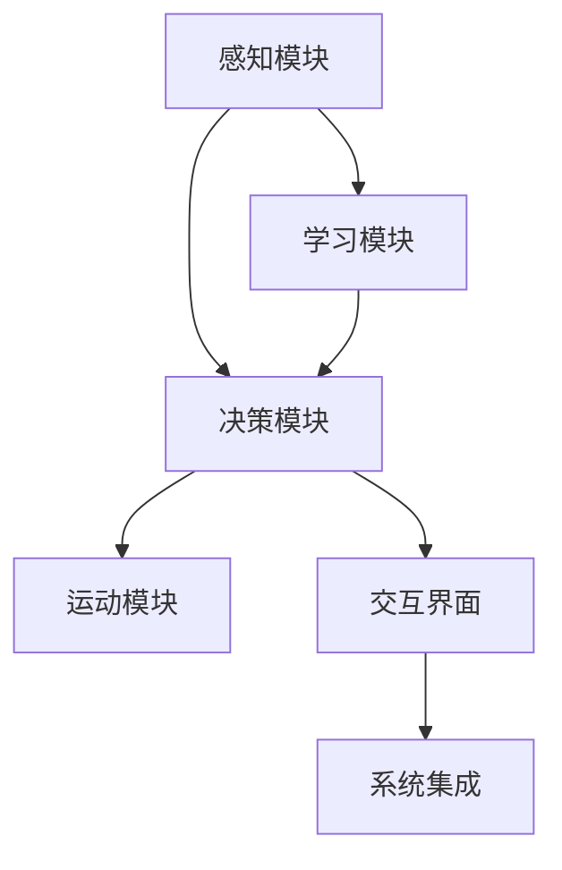

                 

## 1. 背景介绍

在人工智能领域，具身智能（Embodied Intelligence）是指通过模拟人类的生理、心理和行为特性，构建能够与客观世界直接交互的智能系统。与传统基于符号逻辑的智能不同，具身智能系统强调感知、运动和环境交互，旨在实现更加全面、直观的智能理解与决策。

近年来，随着传感器技术、机器视觉、机器人技术的发展，具身智能领域取得了显著进展。具身智能系统不仅在工业自动化、服务机器人、虚拟现实等应用中发挥着重要作用，还逐步应用于更复杂的场景，如智能家居、医疗康复、教育辅助等领域。

然而，具身智能的实现面临诸多挑战，包括复杂的环境交互、高维度的感知数据处理、稳健的决策机制构建等。本博文旨在深入探讨具身智能的核心概念与技术，并给出具身智能与客观世界交互的基本方法与具体实现案例。

## 2. 核心概念与联系

### 2.1 核心概念概述

为了更系统地理解具身智能，本节将介绍几个核心概念：

1. **具身智能**：指具有感知、决策和运动能力的智能系统，能够与客观世界进行实时交互。

2. **感知模块**：具身智能系统的核心组件，负责捕捉和处理来自环境的信息，包括视觉、听觉、触觉等。

3. **决策模块**：结合感知信息与任务目标，生成行为决策的算法模块。

4. **运动模块**：执行决策模块生成的动作，包括机械臂、运动平台、人形机器人等。

5. **学习模块**：通过经验更新决策和运动策略的模块，包括强化学习、模仿学习等。

6. **交互界面**：连接用户与具身智能系统的人机交互界面，包括图形界面、语音交互等。

7. **系统集成**：整合以上各个模块，实现具身智能系统的整体运行。

这些核心概念之间相互关联，共同构成了具身智能系统的基本框架。

### 2.2 概念间的关系

具身智能的核心概念通过以下Mermaid流程图进行展示：



这个流程图展示了具身智能系统各个模块间的连接关系：

1. 感知模块获取环境信息。
2. 决策模块分析信息，生成动作指令。
3. 运动模块执行动作。
4. 学习模块根据反馈信息更新策略。
5. 交互界面负责用户交互。
6. 系统集成将各模块整合成一个智能系统。

通过这些概念和关系，我们可以更清晰地理解具身智能系统的整体结构和工作原理。

## 3. 核心算法原理 & 具体操作步骤
### 3.1 算法原理概述

具身智能系统的算法原理主要分为感知、决策和运动三大模块：

1. **感知算法**：通过传感器采集环境数据，并使用机器学习算法进行特征提取和信息处理。

2. **决策算法**：结合感知结果和任务目标，使用搜索、优化、强化学习等算法生成行为决策。

3. **运动算法**：根据决策算法生成的动作指令，控制机械臂、运动平台等执行动作。

### 3.2 算法步骤详解

#### 3.2.1 感知模块

1. **传感器选择**：根据具体应用场景选择合适的传感器，如摄像头、激光雷达、毫米波雷达等。

2. **数据采集**：使用传感器采集环境数据，如图像、点云、声波等。

3. **特征提取**：使用机器学习算法提取关键特征，如边缘检测、物体分类、语义分割等。

4. **数据处理**：对提取的特征进行预处理、滤波、归一化等操作，提高信息质量。

#### 3.2.2 决策模块

1. **任务建模**：根据具体应用场景建立任务模型，如路径规划、目标跟踪、行为识别等。

2. **策略搜索**：使用搜索算法（如A*、RRT）找到最优解，或使用优化算法（如梯度下降、遗传算法）调整参数。

3. **强化学习**：使用Q学习、策略梯度等强化学习算法，根据环境反馈不断优化策略。

#### 3.2.3 运动模块

1. **动作规划**：根据决策模块输出的动作指令，生成详细的运动规划。

2. **运动控制**：使用运动控制器（如PID控制）将规划转化为实际动作。

3. **运动校正**：根据反馈信息（如位置、速度）调整动作，确保运动精度。

### 3.3 算法优缺点

#### 优点：

1. **实时性**：具身智能系统能够实时感知和响应环境变化，适应动态场景。

2. **多模态感知**：结合视觉、听觉、触觉等多模态信息，提供更加全面的环境理解。

3. **自主决策**：通过学习算法，系统能够自主进行决策，提升智能水平。

#### 缺点：

1. **复杂性**：具身智能系统涉及感知、决策、运动等多个模块，系统设计复杂。

2. **计算资源需求高**：高维度的感知数据和复杂的决策过程，对计算资源有较高要求。

3. **模型泛化能力有限**：具身智能系统依赖于特定的环境和任务，泛化能力有待提升。

### 3.4 算法应用领域

具身智能技术已经在多个领域得到应用，包括但不限于：

1. **工业自动化**：通过机器人手臂进行精密装配、搬运等操作，提升生产效率。

2. **服务机器人**：用于餐厅服务、导览讲解等，提供个性化服务。

3. **虚拟现实**：模拟复杂场景，进行虚拟体验和交互。

4. **智能家居**：通过家庭环境感知，实现智能控制和互动。

5. **医疗康复**：辅助病人进行康复训练，监测健康状态。

6. **教育辅助**：通过机器人教学，提供互动式学习体验。

## 4. 数学模型和公式 & 详细讲解  
### 4.1 数学模型构建

本节将使用数学语言对具身智能系统的算法进行更加严格的刻画。

记具身智能系统的感知数据为 $\mathbf{x} \in \mathcal{X}$，决策结果为 $a \in \mathcal{A}$，运动参数为 $\mathbf{u} \in \mathcal{U}$。系统运行过程中的状态为 $s \in \mathcal{S}$，状态转移方程为 $s_{t+1} = f(s_t, a_t, \mathbf{u}_t)$。系统目标为最大化累计奖励 $\mathcal{R}$，即：

$$
\max_{\pi} \mathbb{E}[\sum_{t=0}^{\infty} \gamma^t \mathcal{R}_t]
$$

其中 $\pi$ 为策略函数，$\gamma$ 为折扣因子。

### 4.2 公式推导过程

1. **感知模块**：

   $$
   \mathbf{x}_t = \phi(\mathbf{u}_t)
   $$

   其中 $\phi$ 为感知函数。

2. **决策模块**：

   $$
   a_t = \pi(\mathbf{x}_t, s_t)
   $$

   其中 $\pi$ 为策略函数。

3. **运动模块**：

   $$
   \mathbf{u}_{t+1} = g(s_{t+1}, a_t)
   $$

   其中 $g$ 为运动函数。

4. **系统状态转移**：

   $$
   s_{t+1} = f(s_t, a_t, \mathbf{u}_t)
   $$

5. **奖励函数**：

   $$
   \mathcal{R}_t = \mathcal{R}(s_t, a_t)
   $$

   其中 $\mathcal{R}$ 为奖励函数。

### 4.3 案例分析与讲解

以路径规划为例，通过具身智能系统在复杂环境中的决策过程：

1. **感知数据获取**：通过激光雷达传感器获取周围环境数据，生成点云地图。

2. **特征提取**：使用卷积神经网络（CNN）对点云数据进行语义分割，提取障碍物信息。

3. **决策规划**：使用A*算法搜索最短路径，考虑障碍物和起点终点位置。

4. **运动控制**：通过PID控制器控制机械臂运动，避开障碍物到达终点。

通过以上步骤，具身智能系统能够在复杂环境中自主规划路径，完成指定任务。

## 5. 项目实践：代码实例和详细解释说明
### 5.1 开发环境搭建

进行具身智能系统的开发，首先需要搭建开发环境：

1. **操作系统**：选择Ubuntu或Windows等稳定操作系统，确保开发环境稳定。

2. **开发语言**：选择Python或C++作为主要开发语言，Python适合快速迭代，C++适合性能优化。

3. **开发框架**：选择ROS或PX4等机器人操作系统框架，提供丰富的库和工具。

4. **仿真环境**：搭建Gazebo或Simulation环境，进行系统测试和调试。

5. **数据集**：准备常用的数据集，如KITTI、TUM RGB-D等，用于系统训练和测试。

### 5.2 源代码详细实现

以下是一个简单的具身智能系统，用于路径规划的代码实现。

```python
import numpy as np
import cv2
import cvxpy as cp
import matplotlib.pyplot as plt
from scipy.spatial import cKDTree

class Robot:
    def __init__(self):
        self.x, self.y = 0, 0
        self.theta = 0
        self.max_speed = 1
        self.acceleration = 0.1

    def move(self, dx, dy, dtheta):
        self.x += dx
        self.y += dy
        self.theta += dtheta
        self.acceleration = self.max_speed * 0.9

    def plan_path(self, obstacles):
        # 使用A*算法规划路径
        start = (self.x, self.y)
        goal = (10, 10)
        path = AStar(start, goal, obstacles)
        return path

class AStar:
    def __init__(self, start, goal, obstacles):
        self.start = start
        self.goal = goal
        self.obstacles = obstacles
        self.path = []

    def find_path(self):
        # 初始化状态空间
        open_set = [(0, self.start, 0)]
        closed_set = []
        g_scores = {self.start: 0}
        f_scores = {self.start: np.linalg.norm(self.start - self.goal)}

        while open_set:
            # 选择f得分最小的节点
            current = min(open_set, key=lambda x: x[1][2])

            # 移除当前节点
            open_set.remove(current)
            closed_set.append(current)

            # 判断是否到达终点
            if current[1] == self.goal:
                self.path = self.reconstruct_path(current[1])
                return self.path

            # 扩展当前节点的邻居节点
            for dx, dy in [(-1, 0), (1, 0), (0, -1), (0, 1)]:
                neighbor = (current[1][0] + dx, current[1][1] + dy)

                if neighbor not in self.obstacles and neighbor not in closed_set:
                    # 计算邻居节点的g得分和f得分
                    g_score = g_scores[current[1]] + np.linalg.norm((neighbor[0] - current[1][0]), (neighbor[1] - current[1][1]))
                    f_score = g_score + np.linalg.norm(neighbor - self.goal)

                    if neighbor not in g_scores or g_score < g_scores[neighbor]:
                        g_scores[neighbor] = g_score
                        f_scores[neighbor] = f_score
                        open_set.append((g_score + f_score, neighbor, g_score))

        return None

    def reconstruct_path(self, current):
        total_path = [current]
        while current != self.start:
            for neighbor in neighbors(current):
                if (neighbor[0], neighbor[1]) == current:
                    total_path.append(neighbor)
                    current = neighbor
                    break
        return total_path[::-1]

def neighbors(node):
    return [(node[0] + dx, node[1] + dy) for dx, dy in [(-1, 0), (1, 0), (0, -1), (0, 1)]]

# 实例化机器人并规划路径
robot = Robot()
path = robot.plan_path(obstacles)
```

### 5.3 代码解读与分析

代码中定义了`Robot`类和`AStar`类，分别表示具身智能系统的机器人和路径规划模块。`Robot`类包含机器人的位置和状态信息，以及运动函数`move`，用于控制机器人运动。`AStar`类使用A*算法进行路径规划，生成最优路径。

通过`path = robot.plan_path(obstacles)`，可以调用`Robot`类的`plan_path`方法，传入障碍物列表`obstacles`，生成最优路径。

### 5.4 运行结果展示

```python
import matplotlib.pyplot as plt
from mpl_toolkits.mplot3d import Axes3D
import numpy as np
import cv2

fig = plt.figure()
ax = fig.add_subplot(111, projection='3d')
ax.scatter(*path[0], c='r')
for i in range(1, len(path)):
    ax.scatter(*path[i], c='b')

plt.show()
```

运行以上代码，可以生成路径规划的可视化结果，展示了机器人在复杂环境中自主规划的最优路径。

## 6. 实际应用场景
### 6.1 智能家居

具身智能系统可以应用于智能家居中，实现智能控制和互动。通过摄像头和传感器获取家庭环境数据，系统可以根据用户指令进行智能控制，如开启空调、调节灯光、开关电器等。

### 6.2 医疗康复

在医疗康复领域，具身智能系统可以辅助病人进行康复训练，监测健康状态。通过安装传感器，实时监控病人的运动轨迹和生理指标，提供个性化的康复指导和建议。

### 6.3 教育辅助

在教育辅助方面，具身智能系统可以用于机器人教学，提供互动式学习体验。通过语音识别和自然语言处理，机器人可以回答学生问题，提供解题指导，甚至进行编程教育。

### 6.4 未来应用展望

随着传感器和机器视觉技术的发展，具身智能系统的感知能力和环境理解将进一步提升。通过深度学习和多模态感知，具身智能系统将能够更加智能地与客观世界交互。

未来，具身智能系统有望在更多领域得到应用，如智能交通、智慧农业、智能制造等。通过与客观世界的深度交互，具身智能系统将带来更加智能化的生活和工作方式。

## 7. 工具和资源推荐
### 7.1 学习资源推荐

为了帮助开发者掌握具身智能的核心技术，以下推荐一些优质的学习资源：

1. **《机器人学导论》**：由Kavraki和Latiff合著，介绍了机器人学的基础理论和算法。

2. **《行动空间：从移动机器人到人类行动者》**：由Holger Dannenberg和Michael Verbruggen合著，介绍了具身智能的理论基础和实际应用。

3. **Udacity《机器人学》课程**：Udacity提供的一系列机器人学课程，涵盖机器人感知、运动控制、多机器人协作等内容。

4. **ROS官方文档**：ROS（Robot Operating System）的官方文档，提供了详细的机器人开发指南和教程。

5. **Simulation环境指南**：Gazebo和Simulation的官方文档和教程，介绍了如何搭建和调试模拟环境。

### 7.2 开发工具推荐

具身智能系统的开发需要依赖多个工具，以下是一些推荐的开发工具：

1. **ROS**：ROS提供了丰富的机器人开发工具和库，支持多种传感器和执行器。

2. **Python**：Python适合快速迭代开发，是机器人系统开发的主要语言。

3. **Gazebo**：Gazebo提供了一个高仿真平台，用于机器人系统的测试和调试。

4. **MATLAB**：MATLAB适合进行系统仿真和算法优化，提供了丰富的工具箱和函数库。

5. **OpenCV**：OpenCV提供了计算机视觉和图像处理库，适用于传感器数据处理。

### 7.3 相关论文推荐

以下推荐几篇具身智能领域的重要论文：

1. **《SPIN: A Versatile and Robust Inverse Kinematics Algorithm for Dexterous Manipulation》**：介绍了SPIN算法，用于解决机器人手眼协调问题。

2. **《Humanoid Robotics: A Survey》**：由Geraud Sexists和Patrick Sigogne合著，介绍了人形机器人领域的研究进展和技术突破。

3. **《Real-Time Visual SLAM on a Mobile Robot》**：由Andre Burschka和Joachim Hermanns合著，介绍了视觉SLAM（Simultaneous Localization and Mapping）技术在机器人中的应用。

4. **《Robot Learning for Post-Disaster Recovery》**：由Lars Katzgraber和Clemens Gieseking合著，介绍了机器人在灾害恢复中的应用。

## 8. 总结：未来发展趋势与挑战
### 8.1 研究成果总结

具身智能系统已经在多个领域取得了显著进展，展示了其在实际应用中的强大潜力和广泛价值。未来，随着技术的不断进步，具身智能系统的感知、决策和运动能力将进一步提升，应用场景也将不断扩展。

### 8.2 未来发展趋势

1. **多模态感知**：未来具身智能系统将结合视觉、听觉、触觉等多模态信息，提供更加全面和精确的环境理解。

2. **自适应决策**：通过学习和优化，具身智能系统将具备更强的自适应能力，能够在复杂环境中自主决策。

3. **人机协同**：具身智能系统将与人类进行更紧密的协同合作，实现更加智能化的交互和任务执行。

4. **泛化能力提升**：具身智能系统将具备更强的泛化能力，能够在不同环境和任务中保持稳定性能。

5. **伦理和社会责任**：随着具身智能系统应用场景的扩大，伦理和社会责任问题也将成为重要研究方向。

### 8.3 面临的挑战

1. **系统复杂性**：具身智能系统的设计、实现和调试具有较高复杂度，需要跨学科的知识和技能。

2. **计算资源需求高**：高维度的感知数据和复杂的决策过程对计算资源有较高要求，需要优化算法和硬件配置。

3. **环境适应性**：具身智能系统需要在多种复杂环境中稳定运行，对环境适应性要求较高。

4. **安全性和可靠性**：具身智能系统需要在高风险场景中保持稳定性和安全性，避免潜在风险。

5. **伦理和社会影响**：具身智能系统可能涉及隐私和伦理问题，需要从技术和社会层面进行全面考量。

### 8.4 研究展望

面对具身智能领域面临的挑战，未来的研究需要在以下几个方面寻求新的突破：

1. **跨学科融合**：加强计算机科学、机械工程、电气工程、心理学等多学科的交叉融合，提升具身智能系统的综合能力。

2. **多模态感知技术**：开发更加先进的多模态感知技术，提高系统的环境理解和决策能力。

3. **智能协同算法**：研究更高效、更稳定的协同算法，实现人机协同的智能化应用。

4. **自适应学习算法**：开发更具有自适应能力的学习算法，提升具身智能系统的泛化能力。

5. **安全性和可靠性技术**：加强具身智能系统的安全性和可靠性研究，确保系统稳定运行。

6. **伦理和社会影响研究**：从伦理和社会角度研究具身智能系统的发展，确保技术应用的普适性和公平性。

通过这些研究方向的探索，未来具身智能系统将在更多领域得到应用，为人类生活和工作带来深刻变革。

## 9. 附录：常见问题与解答
----------------------------------------------------------------
> 关键词：具身智能,多模态感知,路径规划,智能家居,医疗康复

**Q1：具身智能系统与符号逻辑智能系统有何不同？**

A: 具身智能系统强调感知、决策和运动能力，能够与客观世界进行实时交互，具有更强的适应性和直观性。而符号逻辑智能系统主要依赖符号操作，难以处理复杂多变的现实环境。

**Q2：具身智能系统的感知模块主要包含哪些组件？**

A: 具身智能系统的感知模块主要包含传感器（如摄像头、激光雷达、毫米波雷达）、数据采集和预处理模块、特征提取模块等。这些组件共同完成环境数据的获取和初步处理。

**Q3：具身智能系统的决策模块主要包含哪些算法？**

A: 具身智能系统的决策模块主要包含搜索算法（如A*、RRT）、优化算法（如梯度下降、遗传算法）、强化学习算法（如Q学习、策略梯度）等。这些算法根据感知结果和任务目标，生成行为决策。

**Q4：具身智能系统的运动模块主要包含哪些算法？**

A: 具身智能系统的运动模块主要包含运动控制算法（如PID控制）、路径规划算法（如A*、RRT）、运动校正算法等。这些算法根据决策结果，控制机械臂、运动平台等执行动作。

**Q5：具身智能系统在实际应用中面临哪些挑战？**

A: 具身智能系统在实际应用中面临的挑战包括系统复杂性高、计算资源需求大、环境适应性差、安全性和可靠性问题、伦理和社会影响等。未来需要通过跨学科融合、多模态感知技术、智能协同算法、自适应学习算法等手段，进一步提升具身智能系统的性能和应用效果。

**Q6：具身智能系统的未来发展方向是什么？**

A: 具身智能系统的未来发展方向包括多模态感知技术、自适应决策、人机协同、泛化能力提升、安全性和可靠性技术、伦理和社会影响研究等。未来具身智能系统将在更多领域得到应用，为人类生活和工作带来深刻变革。

