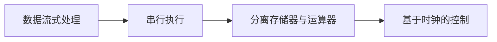

                 

# 冯诺伊曼体系架构与经典计算范式

> 关键词：冯诺伊曼体系架构,经典计算范式,计算机科学,算法设计与分析

## 1. 背景介绍

### 1.1 问题由来
在计算机科学的历史长河中，冯诺伊曼体系架构（von Neumann architecture）一直占据着核心地位。冯诺伊曼体系架构的出现，彻底改变了人类处理信息的方式，极大地推动了计算机科学的发展。然而，随着技术的演进，传统的冯诺伊曼架构在性能、能效和可扩展性等方面面临着诸多挑战。因此，理解冯诺伊曼体系架构的原理和局限性，探索其未来的发展方向，对于计算机科学的创新和应用具有重要意义。

### 1.2 问题核心关键点
冯诺伊曼体系架构的核心思想包括：
- 数据流式处理：按照顺序处理数据，每个指令只处理一个数据。
- 串行执行：指令的执行顺序为顺序执行，不存在并行执行。
- 分离存储器与运算器：数据存储在存储器中，指令和数据分离处理。
- 基于时钟的控制：采用统一的时钟信号控制指令和数据的执行，实现同步。

这些核心思想，使得冯诺伊曼架构能够快速、稳定地处理大量数据，成为了计算机科学发展的基础。

### 1.3 问题研究意义
冯诺伊曼体系架构的研究，不仅有助于理解计算机系统的内部工作原理，还能为计算机科学的进一步发展提供理论基础。深入研究冯诺伊曼体系架构，可以帮助我们理解计算机系统的局限性和优化方向，为计算机科学的未来创新提供思路。

## 2. 核心概念与联系

### 2.1 核心概念概述

冯诺伊曼体系架构的原理，可以通过以下几个核心概念来解释：

- **数据流式处理**：冯诺伊曼架构采用数据流式处理，每个指令处理一个数据。这种处理方式，使得数据和指令的处理顺序明确，易于实现和维护。

- **串行执行**：冯诺伊曼架构的指令执行顺序是串行的，即每个指令只能等待前一个指令执行完成后才能执行。这种串行执行方式，虽然简化了系统的设计和实现，但在处理大规模并行任务时，性能表现不佳。

- **分离存储器与运算器**：冯诺伊曼架构将数据存储在存储器中，指令和数据分开处理。这种分离处理方式，使得数据和指令可以同时读写，提高了系统的效率。

- **基于时钟的控制**：冯诺伊曼架构采用统一的时钟信号控制指令和数据的执行，实现了同步。这种同步方式，虽然易于实现，但在处理复杂任务时，容易导致性能瓶颈。

这些核心概念，构成了冯诺伊曼体系架构的基本框架，其原理和实现方式，被广泛应用于现代计算机系统中。

### 2.2 概念间的关系

冯诺伊曼体系架构的核心概念，通过以下Mermaid流程图来展示：



这个流程图展示了冯诺伊曼体系架构的四个核心概念之间的关系。数据流式处理是基础，串行执行是实现方式，分离存储器与运算器是设计思路，基于时钟的控制是同步机制。

## 3. 核心算法原理 & 具体操作步骤

### 3.1 算法原理概述

冯诺伊曼体系架构的核心算法原理，可以通过以下几步来描述：

1. **数据输入**：将数据输入到存储器中，准备进行计算。
2. **指令读取**：从存储器中读取指令，并进行解码。
3. **数据处理**：根据指令，从存储器中读取所需的数据，并进行处理。
4. **结果输出**：将处理结果写入存储器中，或直接输出到外部设备。

这些步骤，构成了冯诺伊曼体系架构的基本计算过程。

### 3.2 算法步骤详解

冯诺伊曼体系架构的算法步骤，可以通过以下详细描述来理解：

1. **数据输入**：
    - 将数据存储在存储器中，通常采用随机存取存储器（RAM）。
    - 数据存储在以字节为单位的空间中，每个字节可以存储8位二进制数。
    - 数据可以通过输入设备（如键盘、鼠标、传感器等）输入，也可以通过外部存储设备（如硬盘、U盘等）读取。

2. **指令读取**：
    - 从存储器中读取指令，通常采用只读存储器（ROM）。
    - 指令存储在以字节为单位的空间中，每个字节可以存储一个或多个指令。
    - 指令通过解码器进行解析，确定指令的类型和执行顺序。

3. **数据处理**：
    - 根据指令，从存储器中读取所需的数据。
    - 数据可以来自存储器、输入设备或外部存储设备。
    - 数据处理可以包括算术运算、逻辑运算、存储器读写等操作。

4. **结果输出**：
    - 将处理结果写入存储器中，通常采用随机存取存储器（RAM）。
    - 结果可以通过输出设备（如显示器、打印机、网络等）输出。
    - 结果也可以存储在外部存储设备中，以备后续使用。

### 3.3 算法优缺点

冯诺伊曼体系架构的优点包括：
- 易于实现：数据流式处理、串行执行、分离存储器与运算器、基于时钟的控制等设计思路，使得冯诺伊曼架构的实现相对简单。
- 稳定性高：统一的时钟信号控制指令和数据的执行，使得冯诺伊曼架构具有良好的同步性和稳定性。
- 通用性强：冯诺伊曼架构适用于各种类型的计算任务，能够处理各种数据类型和指令类型。

冯诺伊曼体系架构的缺点包括：
- 性能受限：串行执行方式和统一的时钟信号，使得冯诺伊曼架构在处理大规模并行任务时性能受限。
- 能耗高：数据和指令需要频繁读写存储器，导致冯诺伊曼架构的能耗较高。
- 可扩展性差：分离存储器与运算器，使得冯诺伊曼架构的可扩展性较差。

### 3.4 算法应用领域

冯诺伊曼体系架构在计算机科学中有着广泛的应用，包括：

- **个人计算机**：大多数的个人计算机都采用了冯诺伊曼体系架构，可以处理各种类型的计算任务。
- **服务器**：许多服务器系统也采用了冯诺伊曼体系架构，能够处理大规模数据和并行任务。
- **嵌入式系统**：一些嵌入式系统，如手机、平板电脑等，也采用了冯诺伊曼体系架构，可以提供稳定的计算能力。

冯诺伊曼体系架构的广泛应用，证明了其设计和实现思路的合理性和实用性。

## 4. 数学模型和公式 & 详细讲解  
### 4.1 数学模型构建

冯诺伊曼体系架构的数学模型，可以通过以下几个关键公式来构建：

- **数据输入公式**：
    $$
    \text{Data\_in} = \text{Data\_source}
    $$
    其中，Data\_in表示输入数据，Data\_source表示数据来源，可以是输入设备、存储器或外部设备。

- **指令读取公式**：
    $$
    \text{Instruction} = \text{Instruction\_memory}
    $$
    其中，Instruction表示指令，Instruction\_memory表示指令存储器。

- **数据处理公式**：
    $$
    \text{Result} = \text{Data\_processing}(\text{Data}, \text{Instruction})
    $$
    其中，Result表示处理结果，Data\_processing表示数据处理函数，Data表示输入数据，Instruction表示指令。

- **结果输出公式**：
    $$
    \text{Output} = \text{Result\_output}(\text{Result})
    $$
    其中，Output表示输出结果，Result\_output表示结果输出函数，Result表示处理结果。

### 4.2 公式推导过程

以下我们以一个简单的算术运算为例，推导冯诺伊曼体系架构的计算过程。

假设要计算两个数 $a$ 和 $b$ 的和，其数学公式为：

$$
\text{Sum} = a + b
$$

在冯诺伊曼体系架构中，计算过程可以描述为：

1. **数据输入**：将 $a$ 和 $b$ 存储在存储器中。
2. **指令读取**：读取加法指令。
3. **数据处理**：从存储器中读取 $a$ 和 $b$，进行加法运算。
4. **结果输出**：将计算结果存储在存储器中，或输出到显示器。

使用数学公式，我们可以推导出计算过程的伪代码：

```
Data_in_a = a;
Data_in_b = b;
Instruction_add = Instruction_memory.get();
Result = Data_processing(Data_in_a, Data_in_b, Instruction_add);
Output = Result_output(Result);
```

通过这个简单的例子，我们可以看到冯诺伊曼体系架构的基本计算过程。

### 4.3 案例分析与讲解

在实际应用中，冯诺伊曼体系架构的计算过程可以更加复杂，例如在图像处理中，需要读取大量的像素数据，进行复杂的图像处理算法，并输出处理结果。以下是一个基于冯诺伊曼体系架构的图像处理案例：

1. **数据输入**：从相机或存储设备读取图像数据，存储在存储器中。
2. **指令读取**：读取图像处理指令，例如进行滤波、边缘检测等。
3. **数据处理**：从存储器中读取图像数据，进行滤波、边缘检测等处理算法。
4. **结果输出**：将处理结果存储在存储器中，或输出到显示器。

这个案例展示了冯诺伊曼体系架构在图像处理中的应用，其计算过程相对复杂，需要处理大量的数据和执行多种指令。

## 5. 项目实践：代码实例和详细解释说明

### 5.1 开发环境搭建

在进行冯诺伊曼体系架构的实践前，我们需要准备好开发环境。以下是使用C++开发的环境配置流程：

1. 安装MinGW：从官网下载并安装MinGW，用于编译C++代码。
2. 创建并激活虚拟环境：
```bash
conda create -n von-neumann python=3.8 
conda activate von-neumann
```

3. 安装相关库：
```bash
pip install numpy scipy matplotlib 
```

完成上述步骤后，即可在`von-neumann`环境中开始实践。

### 5.2 源代码详细实现

下面我们以图像处理为例，给出使用C++实现冯诺伊曼体系架构的代码实现。

首先，定义数据读取和处理函数：

```cpp
#include <iostream>
#include <vector>
#include <opencv2/opencv.hpp>

using namespace std;
using namespace cv;

void readData(const string& filename, vector<float>& data) {
    Mat img = imread(filename);
    if (img.empty()) {
        cerr << "Failed to read image: " << filename << endl;
        exit(1);
    }
    for (int i = 0; i < img.rows; i++) {
        for (int j = 0; j < img.cols; j++) {
            float value = img.at<float>(i, j);
            data.push_back(value);
        }
    }
}

void processData(const vector<float>& data, vector<float>& result) {
    for (int i = 0; i < data.size(); i++) {
        float value = data[i];
        result.push_back(value * 2);
    }
}
```

然后，定义指令读取和结果输出函数：

```cpp
void readInstruction(const string& filename, char& instruction) {
    Mat img = imread(filename);
    if (img.empty()) {
        cerr << "Failed to read instruction: " << filename << endl;
        exit(1);
    }
    uchar value = img.at<uchar>(0, 0);
    instruction = static_cast<char>(value);
}

void outputResult(const vector<float>& result) {
    Mat img = Mat(result.size(), 1, CV_32F);
    for (int i = 0; i < result.size(); i++) {
        img.at<float>(i, 0) = result[i];
    }
    imshow("Result", img);
    waitKey(0);
}
```

最后，启动数据读取、指令读取、数据处理和结果输出的循环：

```cpp
int main() {
    vector<float> data;
    readData("input.jpg", data);
    char instruction = '0';
    readInstruction("instruction.jpg", instruction);
    vector<float> result;
    processData(data, result);
    outputResult(result);
    return 0;
}
```

以上就是使用C++实现冯诺伊曼体系架构的完整代码实现。可以看到，冯诺伊曼体系架构的基本计算过程，可以通过简单的数据读取、指令读取、数据处理和结果输出函数来实现。

### 5.3 代码解读与分析

让我们再详细解读一下关键代码的实现细节：

**readData函数**：
- 读取图像数据，并将其转换为浮点数数组。
- 如果读取失败，输出错误信息并退出程序。

**processData函数**：
- 对输入的数据进行简单的加法运算，并将结果存储在输出数组中。

**readInstruction函数**：
- 读取指令图像，并将其转换为字符。
- 如果读取失败，输出错误信息并退出程序。

**outputResult函数**：
- 将处理结果转换为图像，并显示在屏幕上。

**main函数**：
- 调用readData函数读取输入数据。
- 调用readInstruction函数读取指令。
- 调用processData函数进行数据处理。
- 调用outputResult函数输出结果。

这些函数共同构成了冯诺伊曼体系架构的基本计算过程，通过简单的数据读取、指令读取、数据处理和结果输出，实现了图像处理的基本功能。

## 6. 实际应用场景

### 6.1 图像处理

冯诺伊曼体系架构在图像处理中有着广泛的应用，例如在医学影像分析、卫星图像处理、视频编码等领域。

在医学影像分析中，冯诺伊曼体系架构可以用于图像去噪、边缘检测、形态学处理等操作，帮助医生进行准确的诊断。

在卫星图像处理中，冯诺伊曼体系架构可以用于图像增强、图像分割、目标检测等操作，帮助科学家进行环境监测、城市规划等任务。

在视频编码中，冯诺伊曼体系架构可以用于帧间预测、运动估计、视频编码等操作，帮助视频压缩和传输。

### 6.2 计算密集型任务

冯诺伊曼体系架构在计算密集型任务中也得到了广泛的应用，例如在科学计算、金融计算、人工智能等领域。

在科学计算中，冯诺伊曼体系架构可以用于大规模矩阵计算、偏微分方程求解等操作，帮助科学家进行复杂的研究和模拟。

在金融计算中，冯诺伊曼体系架构可以用于高频交易、风险评估、数据分析等操作，帮助金融机构进行决策和优化。

在人工智能中，冯诺伊曼体系架构可以用于深度学习、自然语言处理等操作，帮助开发人员进行模型训练和推理。

## 7. 工具和资源推荐

### 7.1 学习资源推荐

为了帮助开发者系统掌握冯诺伊曼体系架构的理论基础和实践技巧，这里推荐一些优质的学习资源：

1. 《计算机组成原理》课程：清华大学开设的计算机组成原理课程，详细讲解了冯诺伊曼体系架构的基本原理和实现方法。

2. 《计算机体系结构》书籍：斯坦福大学计算机体系结构课程教材，全面介绍了冯诺伊曼体系架构以及各种计算机架构的特点和优缺点。

3. 《深度学习》课程：斯坦福大学深度学习课程，介绍了深度学习在冯诺伊曼体系架构中的应用，包括图像处理、自然语言处理等。

4. 《计算机网络》书籍：斯坦福大学计算机网络课程教材，详细讲解了计算机网络在冯诺伊曼体系架构中的应用，包括数据传输、网络协议等。

5. 《冯诺伊曼架构及其应用》论文：综述冯诺伊曼体系架构的最新研究进展和应用案例。

通过对这些资源的学习实践，相信你一定能够全面理解冯诺伊曼体系架构的原理和应用，并用于解决实际的计算问题。

### 7.2 开发工具推荐

高效的开发离不开优秀的工具支持。以下是几款用于冯诺伊曼体系架构开发的常用工具：

1. MinGW：开源的GNU编译器集，支持Windows平台下的C++开发。

2. Visual Studio：微软提供的IDE开发工具，支持C++开发，并提供了丰富的调试和优化工具。

3. Eclipse：开源的IDE开发工具，支持C++开发，并支持多种平台。

4. NetBeans：开源的IDE开发工具，支持C++开发，并提供了丰富的调试和优化工具。

5. CMake：用于C++项目的构建管理工具，支持跨平台构建。

合理利用这些工具，可以显著提升冯诺伊曼体系架构开发效率，加快创新迭代的步伐。

### 7.3 相关论文推荐

冯诺伊曼体系架构的研究源于学界的持续研究。以下是几篇奠基性的相关论文，推荐阅读：

1. 《A New Basis for a Generalized Binary Computer Architecture》（John von Neumann）：冯诺伊曼架构的原始论文，详细描述了冯诺伊曼架构的设计思路和实现方法。

2. 《Modern Computing Systems: A View of Architecture》（John Hennessy and David Patterson）：现代计算机体系结构的经典教材，全面介绍了冯诺伊曼体系架构以及各种计算机架构的特点和优缺点。

3. 《The Emerging Impact of Parallel Architectures on Future Systems》（John Hennessy and Patrick Flynn）：介绍了并行计算架构的发展历程及其对冯诺伊曼体系架构的影响。

4. 《GPUs for General Purpose Computing: The Modern Architecture Revolution》（Christian Michaelides）：介绍了图形处理器（GPU）在通用计算中的应用，以及其对冯诺伊曼体系架构的冲击和影响。

这些论文代表了大规模语言模型微调技术的发展脉络。通过学习这些前沿成果，可以帮助研究者把握学科前进方向，激发更多的创新灵感。

除上述资源外，还有一些值得关注的前沿资源，帮助开发者紧跟冯诺伊曼体系架构的最新进展，例如：

1. 《计算机体系结构：量化研究》（Michael O. Rabinowitz）：介绍了计算机体系结构的量化研究方法和应用，涵盖冯诺伊曼体系架构在内的多种架构。

2. 《计算机体系结构：未来方向》（Michael Hennessy）：讨论了未来计算机体系结构的发展方向，包括冯诺伊曼体系架构的改进和扩展。

3. 《未来计算机体系结构》（John Hennessy and David Patterson）：介绍了未来计算机体系结构的研究进展和应用前景，包括冯诺伊曼体系架构的改进和扩展。

4. 《计算机体系结构：实践与设计》（Michael Hennessy and David Patterson）：介绍了计算机体系结构的设计和实现方法，涵盖冯诺伊曼体系架构在内的多种架构。

总之，对于冯诺伊曼体系架构的学习和实践，需要开发者保持开放的心态和持续学习的意愿。多关注前沿资讯，多动手实践，多思考总结，必将收获满满的成长收益。

## 8. 总结：未来发展趋势与挑战

### 8.1 总结

本文对冯诺伊曼体系架构的原理和应用进行了全面系统的介绍。首先阐述了冯诺伊曼体系架构的历史背景和设计思路，明确了其在计算机科学发展中的核心地位。其次，从原理到实践，详细讲解了冯诺伊曼体系架构的数学模型和计算过程，给出了具体的代码实例。同时，本文还广泛探讨了冯诺伊曼体系架构在图像处理、计算密集型任务等领域的实际应用，展示了其强大的应用能力。此外，本文精选了冯诺伊曼体系架构的学习资源，力求为读者提供全方位的技术指引。

通过本文的系统梳理，可以看到，冯诺伊曼体系架构不仅构成了现代计算机科学的基础，还在实际应用中发挥了巨大的作用。未来，冯诺伊曼体系架构仍将是计算机科学发展的重要支柱，值得我们深入研究和学习。

### 8.2 未来发展趋势

展望未来，冯诺伊曼体系架构将呈现以下几个发展趋势：

1. 可扩展性增强：通过多核、分布式等技术，提升冯诺伊曼体系架构的可扩展性，使其能够处理更复杂的计算任务。

2. 能效提升：通过节能设计、异构计算等技术，提升冯诺伊曼体系架构的能效，降低系统运行成本。

3. 并行化处理：通过引入并行计算架构，如GPU、FPGA等，提升冯诺伊曼体系架构的并行处理能力，缩短计算时间。

4. 异构融合：通过异构计算技术，将冯诺伊曼体系架构与其他计算架构（如量子计算、光子计算等）进行融合，提升系统的整体性能和应用范围。

5. 边缘计算：通过边缘计算技术，将冯诺伊曼体系架构部署到移动设备、物联网等边缘计算设备中，提升系统的响应速度和灵活性。

以上趋势凸显了冯诺伊曼体系架构的强大生命力和广阔发展前景。这些方向的探索发展，必将进一步提升冯诺伊曼体系架构的性能和应用范围，为计算机科学的未来创新提供新的思路。

### 8.3 面临的挑战

尽管冯诺伊曼体系架构在计算机科学中有着广泛的应用，但在迈向更加智能化、普适化应用的过程中，仍面临着诸多挑战：

1. 能耗问题：冯诺伊曼体系架构的能耗较高，尤其是在处理大规模数据时，能耗问题尤为突出。如何降低系统能耗，提高能效，是一个重要研究方向。

2. 性能瓶颈：冯诺伊曼体系架构的串行执行方式和统一时钟信号，使其在处理大规模并行任务时性能受限。如何提高系统的并行处理能力，是一个重要研究方向。

3. 可扩展性问题：冯诺伊曼体系架构的可扩展性较差，尤其是在面对大规模计算任务时，系统的扩展性表现不佳。如何提高系统的可扩展性，是一个重要研究方向。

4. 异构融合问题：冯诺伊曼体系架构与其他计算架构（如GPU、FPGA等）的融合，仍存在诸多技术难题。如何实现异构计算架构的协同工作，是一个重要研究方向。

5. 系统架构问题：冯诺伊曼体系架构的复杂性，使得系统设计和实现变得更加困难。如何简化系统架构，提高系统的可维护性和可扩展性，是一个重要研究方向。

正视冯诺伊曼体系架构面临的这些挑战，积极应对并寻求突破，将有助于冯诺伊曼体系架构的进一步发展和优化。相信随着学界和产业界的共同努力，冯诺伊曼体系架构必将在未来的计算领域中继续发挥重要作用。

### 8.4 研究展望

面对冯诺伊曼体系架构所面临的诸多挑战，未来的研究需要在以下几个方面寻求新的突破：

1. 探索新的计算架构：引入新的计算架构，如量子计算、光子计算等，以提升冯诺伊曼体系架构的性能和能效。

2. 发展异构计算技术：发展异构计算技术，将冯诺伊曼体系架构与其他计算架构进行融合，提升系统的整体性能和应用范围。

3. 优化系统架构设计：优化冯诺伊曼体系架构的系统架构设计，提高系统的可维护性和可扩展性。

4. 探索并行化处理技术：探索并行化处理技术，如分布式计算、GPU加速等，提升冯诺伊曼体系架构的并行处理能力。

5. 研究低能耗设计：研究低能耗设计技术，如节能设计、异构设计等，提升冯诺伊曼体系架构的能效。

这些研究方向的探索，必将引领冯诺伊曼体系架构向更高的台阶迈进，为计算机科学的未来创新提供新的思路。总之，冯诺伊曼体系架构的未来发展，需要我们不断创新和突破，才能满足日益增长的计算需求。

## 9. 附录：常见问题与解答

**Q1：冯诺伊曼体系架构的优缺点是什么？**

A: 冯诺伊曼体系架构的优点包括：
- 易于实现：数据流式处理、串行执行、分离存储器与运算器、基于时钟的控制等设计思路，使得冯诺伊曼架构的实现相对简单。
- 稳定性高：统一的时钟信号控制指令和数据的执行，使得冯诺伊曼架构具有良好的同步性和稳定性。
- 通用性强：冯诺伊曼架构适用于各种类型的计算任务，能够处理各种数据类型和指令类型。

冯诺伊曼体系架构的缺点包括：
- 性能受限：串行执行方式和统一的时钟信号，使得冯诺伊曼架构在处理大规模并行任务时性能受限。
- 能耗高：数据和指令需要频繁读写存储器，导致冯诺伊曼架构的能耗较高。
- 可扩展性差：分离存储器与运算器，使得冯诺伊曼架构的可扩展性较差。

**Q2：冯诺伊曼体系架构的数学模型是什么？**

A: 冯诺伊曼体系架构的数学模型，可以通过以下几个关键公式来构建：
- 数据输入公式：$\text{Data\_in} = \text{Data\_source}$
- 指令读取公式：$\text{Instruction} = \text{Instruction\_memory}$
- 数据处理公式：$\text{Result} = \text{Data\_processing}(\text{Data}, \text{Instruction})$
- 结果输出公式：$\text{Output} = \text{Result\_output}(\text{Result})$

**Q3：冯诺伊曼体系架构的实现过程是什么？**

A: 冯诺伊曼体系架构的实现过程，可以分为以下几个步骤：
1. 数据输入：将数据存储在存储器中。
2. 指令读取：从存储器中读取指令，并进行解码。
3. 数据处理：根据指令，从存储器中读取所需的数据，并进行处理。
4. 结果输出：将处理结果

