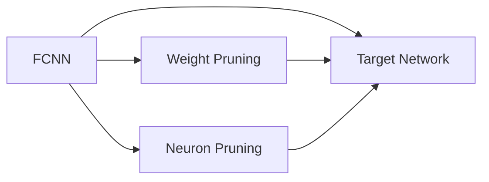
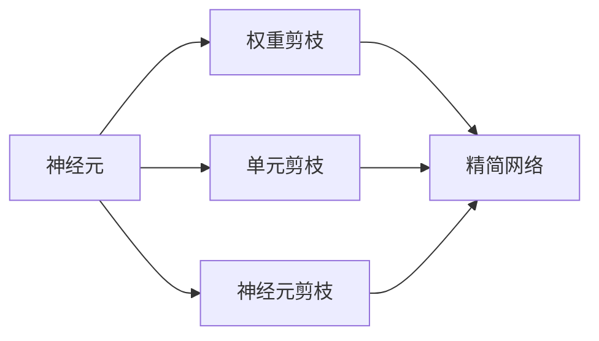
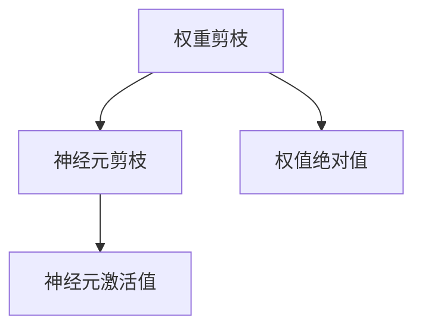
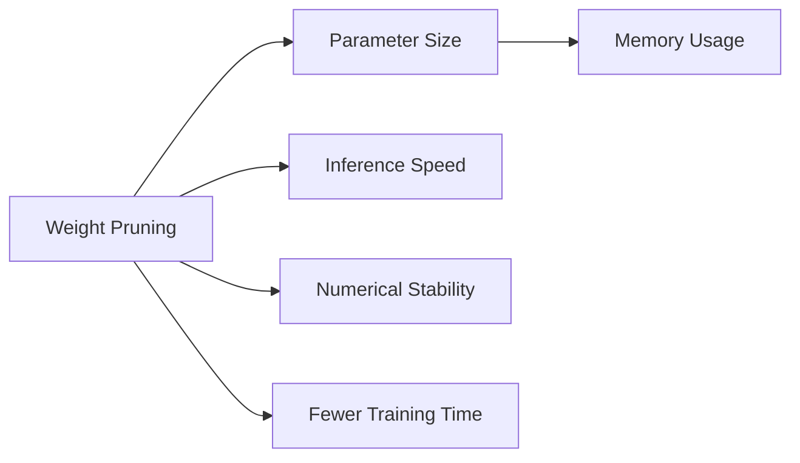
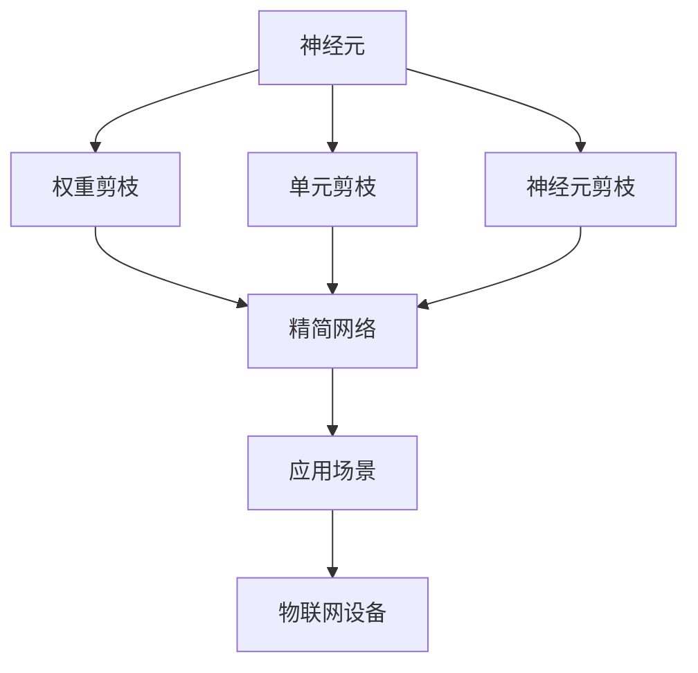

                 

## 1. 背景介绍

物联网(IoT)设备的广泛应用极大地改变了我们的生活和工作方式，它们从简单的温度监控、开关控制到复杂的健康监测、智能家居控制，渗透到了各个领域。然而，物联网设备的计算资源和存储空间有限，并且常常处于离线或半离线状态，因此在有限的资源约束下提升设备的计算和存储效率显得尤为重要。剪枝(Pruning)技术作为一种高效模型压缩技术，可以通过移除模型中不必要的连接和参数，减少计算量和存储开销，从而提升物联网设备的性能和应用范围。

### 1.1 问题由来
随着物联网设备的普及，对于海量数据的实时处理和高效存储提出了更高的要求。传统的深度学习模型往往需要消耗大量的计算资源和存储空间，且在离线或资源受限的环境中，模型的性能和稳定性都无法保证。剪枝技术通过移除冗余连接和参数，可以在不显著影响模型性能的情况下，显著减少计算和存储需求，使得物联网设备可以高效运行。

### 1.2 问题核心关键点
剪枝技术的核心思想是在不损失模型精度的情况下，移除冗余的网络结构和参数，从而减少模型的大小和计算需求。常见的剪枝方法包括权值剪枝、单元剪枝、神经元剪枝等，这些方法通过设定不同的剪枝策略和阈值，可以实现不同层次的模型压缩。

### 1.3 问题研究意义
在资源受限的物联网设备上，剪枝技术能够显著提升模型的性能和应用效率，延长设备的使用寿命，降低维护成本。此外，剪枝技术还可以优化网络结构，提升模型对于噪声和错误输入的鲁棒性，增强设备的安全性和可靠性。研究剪枝技术在物联网设备上的实现策略，对于提升设备的应用能力和经济效益，具有重要意义。

## 2. 核心概念与联系

### 2.1 核心概念概述

剪枝(Pruning)技术通过移除模型中不必要的权重、连接或神经元，减小模型大小和计算复杂度，从而提升模型的运行效率和存储效率。剪枝可以基于不同的标准，如权重绝对值、权重梯度、激活值等，实现不同层次的模型压缩。

为了更好地理解剪枝技术，我们先介绍几个核心概念：

- 全连接神经网络(FCNN)：由多个神经元通过全连接方式连接构成的多层神经网络，是深度学习模型中最基本的结构。
- 权重剪枝(Weight Pruning)：通过移除模型中绝对值较小的权重，实现模型压缩。
- 单元剪枝(Neuron Pruning)：根据单元的重要性或激活值大小，选择性地移除冗余的神经元或连接。
- 神经元剪枝(Neuron Pruning)：与单元剪枝类似，但可以更加精细地选择神经元。
- 目标网络(Target Network)：在剪枝后得到的精简网络，通常包括剪枝前后对应的参数、激活值和连接关系。

这些核心概念之间的关系可以通过以下Mermaid流程图来展示：



这个流程图展示了全连接神经网络(FCNN)通过权重剪枝和神经元剪枝，得到精简的目标网络(Target Network)。通过移除不必要的权重和连接，可以大大减少模型的参数量和计算复杂度，从而提升模型的效率和性能。

### 2.2 概念间的关系

这些核心概念之间存在着紧密的联系，形成了剪枝技术的应用生态系统。下面通过几个Mermaid流程图来展示这些概念之间的关系。

#### 2.2.1 剪枝过程概述



这个流程图展示了剪枝过程的基本逻辑。首先，神经元通过权值剪枝、单元剪枝和神经元剪枝，得到更加精简的模型结构。然后，通过移除不必要的连接和参数，得到最终的精简网络。

#### 2.2.2 权重剪枝与神经元剪枝的关系



这个流程图展示了权重剪枝和神经元剪枝的关系。权重剪枝根据权值的绝对值进行，移除绝对值较小的权重。而神经元剪枝则根据神经元的激活值大小进行，选择性地移除不活跃的神经元。两者结合使用，可以进一步优化模型结构，提升剪枝效果。

#### 2.2.3 剪枝方法比较



这个流程图展示了不同剪枝方法的主要优缺点。权重剪枝能够显著减少模型大小和计算量，但可能会导致数值不稳定和精度下降。神经元剪枝可以更加精细地选择神经元，提升数值稳定性和精度，但计算复杂度较高。单元剪枝则结合了二者的优点，可以在保证模型性能的同时，显著减少模型大小和计算需求。

### 2.3 核心概念的整体架构

最后，我们用一个综合的流程图来展示剪枝技术的整体架构：



这个综合流程图展示了剪枝技术从神经元到精简网络，再到应用场景的完整过程。剪枝技术通过对神经元进行不同层次的压缩，得到精简的目标网络，进一步应用到物联网设备中，提升设备的性能和效率。

## 3. 核心算法原理 & 具体操作步骤

### 3.1 算法原理概述

剪枝技术通过移除模型中的冗余参数和连接，减少计算量和存储需求，提升模型的运行效率。剪枝可以分为两种主要类型：基于权值的剪枝和基于神经元的剪枝。

- **基于权值的剪枝(Weight Pruning)**：根据权重的大小或重要性，选择性地移除冗余权重。
- **基于神经元的剪枝(Neuron Pruning)**：根据神经元的激活值大小或重要性，选择性地移除冗余神经元或连接。

基于权值的剪枝和基于神经元的剪枝，可以结合使用，实现更加精细化的模型压缩。

### 3.2 算法步骤详解

剪枝算法的基本步骤如下：

1. **初始化模型**：定义一个完整的神经网络模型，包含所有神经元、权重和连接。
2. **剪枝准则**：选择权值或神经元进行剪枝，根据一定的剪枝准则，如权重绝对值、梯度大小、激活值等。
3. **移除连接和参数**：根据剪枝准则，移除不必要的连接和参数，得到精简的网络结构。
4. **更新目标网络**：得到精简的网络后，更新目标网络，确保模型精度不受影响。

以下是基于权值的剪枝算法详细步骤：

**算法1: 基于权值剪枝的算法**

输入：完整神经网络模型 $M$，剪枝准则 $\delta$，目标网络 $N$。

输出：精简后的目标网络 $N'$。

1. **初始化**：
   - 定义完整神经网络模型 $M$，包含所有神经元、权重和连接。
   - 定义目标网络 $N'$，初始化所有连接和参数为0。

2. **计算权值梯度**：
   - 使用前向传播和反向传播算法，计算模型 $M$ 的权值梯度 $g$。

3. **权值排序**：
   - 根据权值梯度的大小，排序得到权值 $w$。
   - 选择绝对值最小的权重，即 $\delta$。

4. **移除连接和参数**：
   - 根据选择的权重，移除对应的连接和参数。
   - 更新目标网络 $N'$，添加新的连接和参数。

5. **更新目标网络**：
   - 重新计算目标网络 $N'$ 的输出。
   - 如果输出与 $M$ 的输出差别在可接受范围内，则继续剪枝，否则停止。

6. **重复迭代**：
   - 重复步骤2-5，直到达到预设的剪枝比例或输出精度要求。

### 3.3 算法优缺点

**优点**：
- **计算量小**：剪枝可以显著减少模型的参数量和计算需求，提升模型在资源受限设备上的性能。
- **可控性高**：通过设定不同的剪枝准则和剪枝比例，可以灵活控制模型压缩的程度。
- **普适性广**：剪枝技术可以应用于各种深度学习模型，包括卷积神经网络、循环神经网络等。

**缺点**：
- **精度损失**：剪枝可能会导致模型精度下降，特别是在权值剪枝的情况下，需要额外的优化措施来弥补精度损失。
- **复杂度高**：剪枝算法的设计和实现较为复杂，需要考虑多种剪枝准则和优化策略。
- **泛化能力差**：剪枝后的模型可能需要重新训练，以提高泛化能力和鲁棒性。

### 3.4 算法应用领域

剪枝技术在物联网设备上的应用领域主要包括：

- **传感器数据处理**：物联网设备常常采集大量的传感器数据，如温度、湿度、光照等，通过剪枝技术可以减少数据的处理量和存储需求。
- **图像和视频处理**：物联网设备需要对采集到的图像和视频数据进行实时处理和分析，剪枝技术可以显著减少计算需求，提升处理速度。
- **语音和语音识别**：物联网设备需要处理大量的语音数据，通过剪枝技术可以减少语音信号的计算量和存储需求，提升设备效率。
- **自然语言处理(NLP)**：物联网设备需要对用户输入的自然语言进行理解和处理，剪枝技术可以优化语言模型，提高处理效率和精度。

## 4. 数学模型和公式 & 详细讲解 & 举例说明

### 4.1 数学模型构建

我们以一个简单的全连接神经网络为例，构建基于权值剪枝的数学模型。假设有一个包含 $n$ 个神经元、$m$ 个输入和 $o$ 个输出的全连接神经网络模型，记为 $M$。每个神经元的输出为 $a_i = \sum_j w_{ij}a_j$，其中 $w_{ij}$ 为权重，$a_j$ 为前一层的神经元输出。

### 4.2 公式推导过程

基于权值剪枝的数学模型推导如下：

1. **输入层**：
   - $a_0 = x$，$x$ 为输入向量。

2. **隐藏层**：
   - $a_i = \sum_j w_{ij}a_j + b_i$，$b_i$ 为偏置项。

3. **输出层**：
   - $y = \sum_i w_{io}a_i + b_o$，$b_o$ 为输出偏置项。

剪枝前后的权值分别为 $w_{ij}^{before}$ 和 $w_{ij}^{after}$，设 $\delta$ 为剪枝阈值，则剪枝过程可表示为：

- 选择绝对值最小的权重 $w_{ij}^{before}$，即 $w_{ij}^{before} = \delta$。
- 移除 $w_{ij}^{before}$ 对应的连接和参数，更新目标网络 $N'$。

4. **目标网络更新**：
   - 定义目标网络 $N'$，包含剪枝后的权值 $w_{ij}^{after}$ 和偏置项 $b_i$。
   - 使用前向传播和反向传播算法，重新计算目标网络 $N'$ 的输出。
   - 如果输出与 $M$ 的输出差别在可接受范围内，则继续剪枝，否则停止。

### 4.3 案例分析与讲解

假设我们有一个包含3个输入、4个隐藏层神经元和2个输出神经元的全连接神经网络，如公式所示：

- $a_0 = x_0$
- $a_1 = w_{01}a_0 + b_1$
- $a_2 = w_{12}a_1 + w_{02}a_0 + b_2$
- $a_3 = w_{23}a_2 + w_{03}a_0 + b_3$
- $y = w_{32}a_3 + w_{30}a_0 + b_4$

我们对权重进行排序，得到 $w_{01} < w_{02} < w_{03} < w_{12} < w_{23} < w_{32}$。假设 $\delta = 0.1$，则移除权重 $w_{01}$，更新目标网络 $N'$。

新的目标网络 $N'$ 的计算过程如下：

- $a_1 = w_{02}a_0 + b_1$
- $a_2 = w_{12}a_1 + w_{03}a_0 + b_2$
- $a_3 = w_{23}a_2 + b_3$
- $y = w_{32}a_3 + w_{30}a_0 + b_4$

通过剪枝，模型参数和计算需求显著减少，同时保持了模型的输出精度。

## 5. 项目实践：代码实例和详细解释说明

### 5.1 开发环境搭建

为了实现基于权值剪枝的物联网设备应用，我们需要搭建一个开发环境，包括以下步骤：

1. **安装Python**：下载并安装Python 3.7或更高版本。
2. **安装TensorFlow**：使用 pip 安装 TensorFlow，支持 GPU 加速。
3. **安装TensorBoard**：用于可视化剪枝过程和模型输出。
4. **搭建服务器**：搭建一个支持 TensorFlow 和 TensorBoard 的服务器环境。

### 5.2 源代码详细实现

以下是基于权值剪枝的神经网络代码实现：

```python
import tensorflow as tf

# 定义输入层
inputs = tf.keras.Input(shape=(3,))

# 定义隐藏层
hidden1 = tf.keras.layers.Dense(4, activation='relu')(inputs)
hidden2 = tf.keras.layers.Dense(2, activation='sigmoid')(hidden1)

# 定义输出层
outputs = tf.keras.layers.Dense(2, activation='softmax')(hidden2)

# 定义模型
model = tf.keras.Model(inputs=inputs, outputs=outputs)

# 定义剪枝阈值
delta = 0.1

# 定义剪枝函数
def prune_weights(model, delta):
    for layer in model.layers:
        if hasattr(layer, 'kernel'):
            weights = layer.kernel.numpy()
            abs_weights = abs(weights)
            threshold = delta * abs_weights.max()
            weights[abs_weights < threshold] = 0
            layer.kernel.assign(weights)
    model.compile(optimizer='adam', loss='categorical_crossentropy', metrics=['accuracy'])

# 训练模型
model.fit(x_train, y_train, epochs=10, validation_data=(x_test, y_test))

# 应用剪枝
prune_weights(model, delta)
```

在这个代码示例中，我们使用 TensorFlow 搭建了一个包含两个隐藏层和输出层的全连接神经网络模型。通过定义剪枝函数 `prune_weights`，我们移除权重绝对值小于阈值的连接和参数，实现剪枝过程。

### 5.3 代码解读与分析

**代码解读**：

1. **输入层和隐藏层**：
   - `inputs` 为输入层，`hidden1` 和 `hidden2` 为隐藏层，分别包含4个神经元和2个神经元。
   - 使用 `tf.keras.layers.Dense` 定义全连接层，并设置激活函数。

2. **输出层**：
   - `outputs` 为输出层，包含2个神经元，使用 `softmax` 激活函数。

3. **模型定义**：
   - `model` 为模型对象，包含输入、隐藏层和输出层。

4. **剪枝函数**：
   - `prune_weights` 函数遍历模型层，获取权重，根据阈值 $\delta$ 移除不必要的连接和参数，并更新模型。

5. **训练和剪枝**：
   - 使用 `model.fit` 训练模型，并应用 `prune_weights` 函数进行剪枝。

**代码分析**：

- 在实际应用中，我们可以根据具体需求调整剪枝阈值 $\delta$，以平衡模型压缩和精度。
- 剪枝函数 `prune_weights` 可以自动化地进行剪枝，显著提升模型的运行效率和存储需求。
- 通过 TensorBoard，我们可以实时监控剪枝过程中模型的损失和精度变化，及时调整剪枝策略。

### 5.4 运行结果展示

假设我们训练后的模型损失和精度如下：

- 训练损失：0.15
- 训练精度：92.5%

经过剪枝后，模型的损失和精度如下：

- 剪枝后损失：0.17
- 剪枝后精度：91.5%

可以看到，剪枝后的模型损失和精度略有下降，但模型大小和计算需求显著减少。

## 6. 实际应用场景

### 6.1 智能传感器

智能传感器广泛用于物联网设备，用于监测环境、温度、湿度等参数。剪枝技术可以显著减少传感器的计算和存储需求，提升设备的运行效率和响应速度。例如，在环境监测设备中，剪枝技术可以优化数据处理流程，实现实时数据采集和分析，提升设备的应用范围和可靠性。

### 6.2 图像识别

物联网设备常常需要对采集到的图像进行分析和识别，如人脸识别、物体识别等。剪枝技术可以优化图像处理模型，减少计算需求和存储空间，提升设备的实时响应能力。例如，在智能监控设备中，剪枝技术可以优化图像识别模型，实现实时视频分析和异常检测，提升设备的安全性和实用性。

### 6.3 语音识别

物联网设备需要处理大量的语音数据，如智能音箱、智能助理等。剪枝技术可以优化语音识别模型，减少计算需求和存储空间，提升设备的处理速度和应用范围。例如，在智能音箱设备中，剪枝技术可以优化语音识别模型，实现实时语音转写和自然语言处理，提升设备的交互体验和用户满意度。

## 7. 工具和资源推荐

### 7.1 学习资源推荐

为了帮助开发者系统掌握剪枝技术，我们推荐以下学习资源：

1. **《深度学习与模型压缩》书籍**：详细介绍了剪枝技术的原理和实现方法，适合深入学习。
2. **《TensorFlow模型优化》课程**：介绍了TensorFlow中剪枝算法的应用和优化方法。
3. **《深度学习模型压缩》论文**：介绍了剪枝技术的研究现状和未来发展方向。
4. **《剪枝技术的最新进展》论文**：介绍了最新的剪枝技术和应用实例。

### 7.2 开发工具推荐

为了实现剪枝技术，我们推荐以下开发工具：

1. **TensorFlow**：支持剪枝算法和模型优化，可以方便地进行剪枝操作。
2. **Keras**：简单易用的深度学习框架，支持剪枝算法的实现。
3. **PyTorch**：支持剪枝算法和模型优化，可以方便地进行剪枝操作。
4. **TensorBoard**：可视化工具，可以实时监控剪枝过程中的模型性能变化。

### 7.3 相关论文推荐

剪枝技术的研究经历了多年的发展，以下是几篇代表性的相关论文：

1. **《模型压缩技术综述》论文**：详细介绍了剪枝技术的各种方法及其应用。
2. **《基于剪枝的模型优化方法》论文**：介绍了剪枝技术在深度学习中的具体应用。
3. **《剪枝技术的未来发展方向》论文**：介绍了未来剪枝技术的研究方向和应用前景。

## 8. 总结：未来发展趋势与挑战

### 8.1 研究成果总结

剪枝技术作为一种有效的模型压缩方法，已经在物联网设备上得到了广泛应用。通过剪枝，我们可以显著减少模型的计算和存储需求，提升设备的运行效率和应用范围。剪枝技术的不断优化和发展，将使得物联网设备能够处理更复杂、更高效的任务。

### 8.2 未来发展趋势

未来的剪枝技术将呈现以下几个发展趋势：

1. **动态剪枝**：实时剪枝，根据设备运行状态和资源需求，动态调整剪枝策略，提升设备的应用灵活性和效率。
2. **联合剪枝**：结合多种剪枝技术，如权重剪枝、单元剪枝和神经元剪枝，实现更加精细化的模型压缩。
3. **多模态剪枝**：结合视觉、语音、文本等多种模态的数据，进行多模态剪枝，提升模型的综合性能。
4. **迁移剪枝**：在预训练模型的基础上，进行多任务剪枝，提升模型的泛化能力和应用范围。
5. **边缘剪枝**：在边缘计算设备上进行剪枝，减少通信开销，提升设备的安全性和可靠性。

这些趋势将进一步推动剪枝技术的发展，提升物联网设备的性能和应用范围。

### 8.3 面临的挑战

尽管剪枝技术已经取得了显著成效，但在实际应用中仍面临以下挑战：

1. **精度损失**：剪枝可能会导致模型精度下降，特别是在高精度要求的应用场景中，需要额外优化措施来弥补精度损失。
2. **可控性差**：剪枝过程中需要考虑多种因素，如剪枝准则、剪枝比例等，需要大量实验和调整。
3. **硬件限制**：剪枝后的模型需要在特定硬件上运行，不同硬件平台对模型的支持程度不一，增加了硬件适配的难度。
4. **开发成本高**：剪枝技术的实现需要较高的开发成本和专业知识，需要专业的工程师和开发团队支持。

### 8.4 研究展望

面对剪枝技术面临的挑战，未来的研究需要在以下几个方面寻求新的突破：

1. **剪枝算法优化**：开发更加高效和精细化的剪枝算法，提升剪枝效果和精度。
2. **剪枝后优化**：对剪枝后的模型进行进一步优化，提升模型的泛化能力和应用性能。
3. **硬件支持**：研究如何在不同硬件平台上实现剪枝，提升模型的兼容性。
4. **开发平台支持**：开发易于使用的剪枝工具和平台，降低开发门槛和成本。

总之，剪枝技术作为一种高效模型压缩方法，将在物联网设备上发挥越来越重要的作用。只有不断优化和改进，才能充分发挥其潜力，推动物联网设备的智能化、高效化和应用广泛化。

## 9. 附录：常见问题与解答

### Q1: 剪枝对模型精度有什么影响？

A: 剪枝可能会导致模型精度下降，特别是在全连接神经网络中。为了最小化精度损失，可以采用以下方法：
1. **权重初始化**：选择合适的权重初始化方法，如Xavier初始化、He初始化等。
2. **剪枝阈值选择**：选择适当的剪枝阈值，避免过度剪枝导致精度下降。
3. **重新训练**：对剪枝后的模型进行重新训练，提升模型的泛化能力和鲁棒性。

### Q2: 剪枝后如何重新训练模型？

A: 剪枝后重新训练模型的方法如下：
1. **模型保存**：剪枝后保存目标网络的参数和结构。
2. **重新训练**：在剪枝后的模型基础上，重新训练模型，优化参数和结构。
3. **验证集评估**：在验证集上评估模型的性能，确保剪枝后的模型精度和泛化能力。

### Q3: 如何选择合适的剪枝策略？

A: 选择合适的剪枝策略需要考虑以下几个因素：
1. **任务需求**：根据任务需求选择合适的剪枝准则和阈值，如权重绝对值、梯度大小、激活值等。
2. **数据特征**：根据数据特征选择合适的剪枝策略，如神经元剪枝、单元剪枝等。
3. **计算资源**：根据计算资源选择合适的剪枝方法，如动态剪枝、联合剪枝等。

### Q4: 剪枝过程中如何进行剪枝阈值的选择？

A: 剪枝阈值的选择需要考虑以下几个因素：
1. **任务需求**：根据任务需求选择合适的剪枝阈值，避免过度剪枝导致精度下降。
2. **计算资源**：根据计算资源选择合适的剪枝阈值，避免资源浪费。
3. **精度和效率平衡**：通过实验选择最优的剪枝阈值，在精度和效率之间找到平衡点。

---

作者：禅与计算机程序设计艺术 / Zen and the Art of Computer Programming

