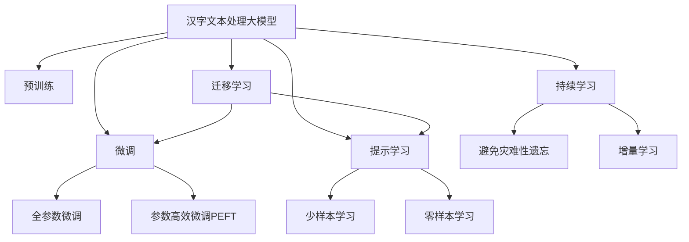
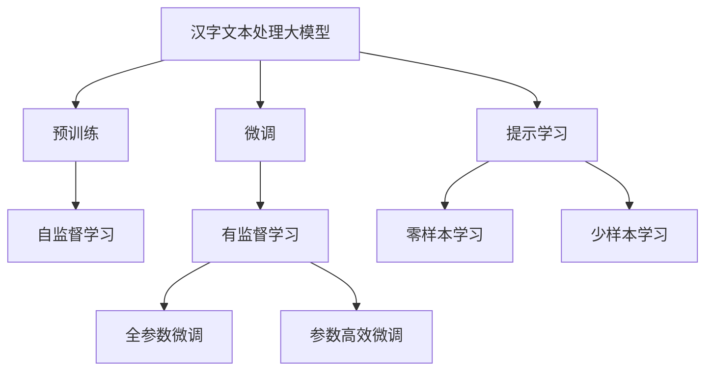
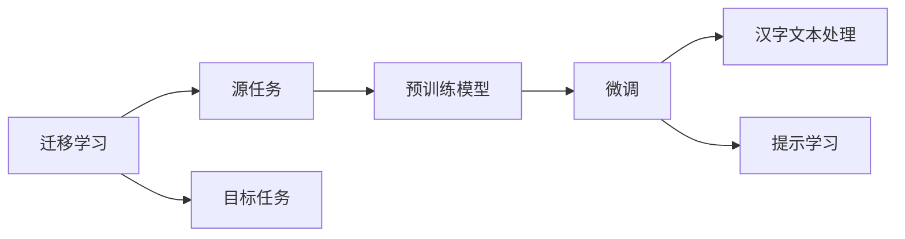
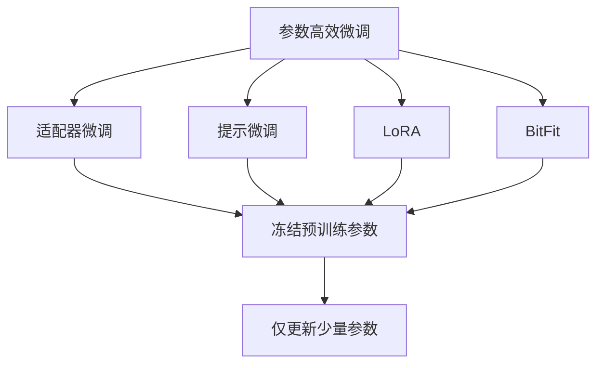
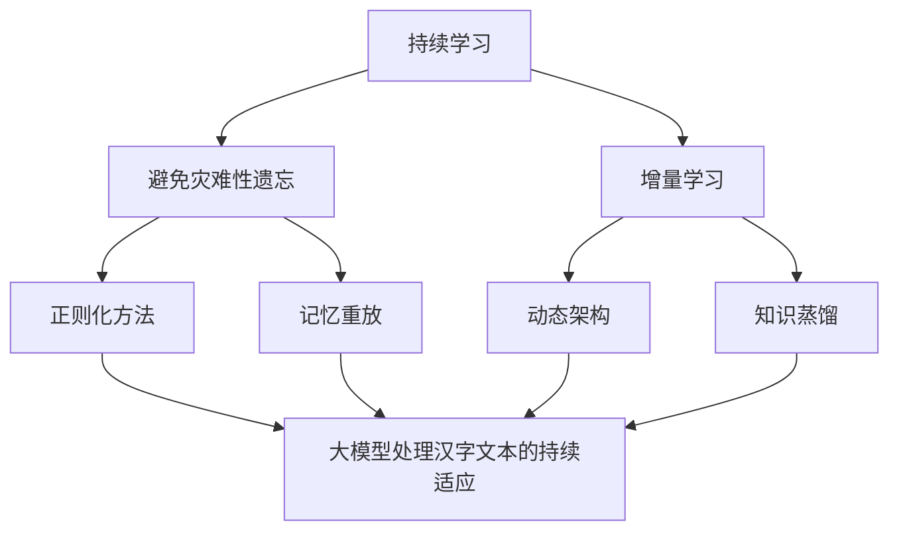
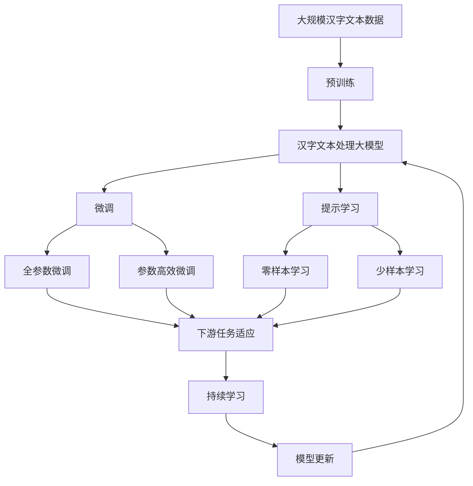

                 

# 从零开始大模型开发与微调：汉字的文本处理

> 关键词：汉字，文本处理，大模型，微调，NLP

## 1. 背景介绍

### 1.1 问题由来
汉字，作为中华文化的重要载体，在处理时面临着不同于拉丁字母文字体系的特殊性。随着数字化、智能化技术的发展，汉字文本处理的需求日益增长。如何将汉字输入、识别、转换等任务交由大模型处理，成为了一个亟待解决的问题。

汉字处理的复杂性在于其形态丰富，字形变化多样，且历史悠久的汉字中包含大量同音字、多音字等，对模型的理解能力提出了更高要求。大模型通过大规模无标签数据的预训练，学习到了丰富的语言特征，并具备了一定的迁移学习能力，可以在微调过程中针对汉字文本处理任务进行优化。

### 1.2 问题核心关键点
汉字文本处理的核心在于实现汉字的输入、识别、转换等操作。大模型微调的目标是，通过输入汉字文本的少量标注数据，优化模型参数，提升汉字处理性能。具体而言，微调的关键点包括：
- 选择合适的预训练模型和微调任务。
- 设计合理的损失函数和优化器。
- 数据预处理和增强技术的应用。
- 模型训练、测试和部署的流程设计。

### 1.3 问题研究意义
汉字文本处理技术的提升，对于推动汉语语言信息化的发展、促进文化传承与交流具有重要意义。具体而言：
1. 提高汉字处理的智能化水平。大模型微调能够大幅提升汉字输入、识别、转换等操作的智能化程度，减少人力成本，提高处理效率。
2. 促进汉语文化的数字化传播。汉字处理的智能化应用，如智能输入、实时翻译、情感分析等，能够显著提升汉语文本的传播效果，促进文化的全球化。
3. 支持文化教育的创新发展。汉字处理技术可以应用于在线教育、语言学习等场景，辅助语言学习，提升教育质量。
4. 推动智能交互系统的应用。大模型微调能够实现汉字输入、识别、转换等功能的智能交互，提升用户的使用体验，拓展应用场景。

## 2. 核心概念与联系

### 2.1 核心概念概述

为更好地理解汉字文本处理大模型微调方法，本节将介绍几个关键概念：

- 大模型：指以Transformer、BERT等架构为基础的预训练语言模型，通过大规模无标签数据训练，学习到丰富的语言知识，具备强大的语言理解和生成能力。
- 预训练：指在大规模无标签数据上，通过自监督学习任务训练通用语言模型的过程。常见的预训练任务包括语言建模、掩码语言模型等。
- 微调(Fine-tuning)：指在预训练模型的基础上，使用汉字文本处理的少量标注数据，通过有监督学习优化模型在特定任务上的性能。
- 迁移学习(Transfer Learning)：指将一个领域学习到的知识，迁移应用到另一个相关领域的学习范式。汉字文本处理的大模型微调即是一种典型的迁移学习方式。
- 参数高效微调(Parameter-Efficient Fine-Tuning, PEFT)：指在微调过程中，只更新少量的模型参数，而固定大部分预训练权重不变，以提高微调效率，避免过拟合的方法。
- 提示学习(Prompt Learning)：通过在输入文本中添加提示模板(Prompt Template)，引导大模型进行特定任务的推理和生成。可以在不更新模型参数的情况下，实现零样本或少样本学习。
- 少样本学习(Few-shot Learning)：指在只有少量标注样本的情况下，模型能够快速适应新任务的学习方法。在大模型中，通常通过在输入中提供少量示例来实现，无需更新模型参数。
- 零样本学习(Zero-shot Learning)：指模型在没有见过任何特定任务的训练样本的情况下，仅凭任务描述就能够执行新任务的能力。大模型通过预训练获得的广泛知识，使其能够理解任务指令并生成相应输出。
- 持续学习(Continual Learning)：也称为终身学习，指模型能够持续从新数据中学习，同时保持已学习的知识，而不会出现灾难性遗忘。这对于保持大模型处理汉字文本的稳定性至关重要。

这些核心概念之间的逻辑关系可以通过以下Mermaid流程图来展示：



这个流程图展示了大模型处理汉字文本的核心概念及其之间的关系：

1. 大模型通过预训练获得基础能力。
2. 微调是对预训练模型进行任务特定的优化，可以分为全参数微调和参数高效微调（PEFT）。
3. 提示学习是一种不更新模型参数的方法，可以实现少样本学习和零样本学习。
4. 迁移学习是连接预训练模型与汉字文本处理任务的桥梁，可以通过微调或提示学习来实现。
5. 持续学习旨在使模型能够不断学习新数据，同时避免遗忘旧知识。

这些核心概念共同构成了汉字文本处理大模型微调的完整生态系统，使其能够在各种场景下发挥强大的语言理解和生成能力。通过理解这些核心概念，我们可以更好地把握汉字文本处理微调过程中各个关键环节的作用和设计思路。

### 2.2 概念间的关系

这些核心概念之间存在着紧密的联系，形成了汉字文本处理大模型微调的完整生态系统。下面我通过几个Mermaid流程图来展示这些概念之间的关系。

#### 2.2.1 大模型处理汉字文本的学习范式



这个流程图展示了大模型处理汉字文本的三个主要学习范式：预训练、微调和提示学习。预训练主要采用自监督学习方法，而微调则是有监督学习的过程。提示学习可以实现零样本和少样本学习，可以在不更新模型参数的情况下，实现汉字文本处理的智能化。

#### 2.2.2 迁移学习与微调的关系



这个流程图展示了迁移学习的基本原理，以及它与微调的关系。迁移学习涉及源任务和目标任务，预训练模型在源任务上学习，然后通过微调适应各种目标任务。汉字文本处理的目标任务可通过微调或提示学习来实现。

#### 2.2.3 参数高效微调方法



这个流程图展示了几种常见的参数高效微调方法，包括适配器微调、提示微调、LoRA和BitFit。这些方法的共同特点是冻结大部分预训练参数，只更新少量参数，从而提高微调效率。

#### 2.2.4 持续学习在大模型中的应用



这个流程图展示了持续学习在大模型处理汉字文本中的应用。持续学习的主要目标是避免灾难性遗忘和实现增量学习。通过正则化方法、记忆重放、动态架构和知识蒸馏等技术，可以使大模型处理汉字文本的过程持续适应新的数据，保持模型的稳定性。

### 2.3 核心概念的整体架构

最后，我们用一个综合的流程图来展示这些核心概念在大模型处理汉字文本微调过程中的整体架构：



这个综合流程图展示了从预训练到微调，再到持续学习的完整过程。汉字文本处理大模型首先在大规模文本数据上进行预训练，然后通过微调（包括全参数微调和参数高效微调）或提示学习（包括零样本和少样本学习）来适应汉字文本处理任务。最后，通过持续学习技术，模型可以不断更新和适应新的汉字文本数据。 通过这些流程图，我们可以更清晰地理解汉字文本处理大模型微调过程中各个核心概念的关系和作用，为后续深入讨论具体的微调方法和技术奠定基础。

## 3. 核心算法原理 & 具体操作步骤
### 3.1 算法原理概述

汉字文本处理大模型的微调，本质上是一个有监督的细粒度迁移学习过程。其核心思想是：将预训练的汉字处理大模型视作一个强大的"特征提取器"，通过在汉字文本处理的少量标注数据上进行有监督学习，优化模型在该任务上的性能。

形式化地，假设预训练模型为 $M_{\theta}$，其中 $\theta$ 为预训练得到的模型参数。给定汉字文本处理的少量标注数据集 $D=\{(x_i, y_i)\}_{i=1}^N$，微调的目标是找到新的模型参数 $\hat{\theta}$，使得：

$$
\hat{\theta}=\mathop{\arg\min}_{\theta} \mathcal{L}(M_{\theta},D)
$$

其中 $\mathcal{L}$ 为针对汉字文本处理任务的损失函数，用于衡量模型预测输出与真实标签之间的差异。常见的损失函数包括交叉熵损失、均方误差损失等。

通过梯度下降等优化算法，微调过程不断更新模型参数 $\theta$，最小化损失函数 $\mathcal{L}$，使得模型输出逼近真实标签。由于 $\theta$ 已经通过预训练获得了较好的初始化，因此即便在汉字文本处理的少量数据集 $D$ 上进行微调，也能较快收敛到理想的模型参数 $\hat{\theta}$。

### 3.2 算法步骤详解

汉字文本处理大模型的微调一般包括以下几个关键步骤：

**Step 1: 准备预训练模型和数据集**
- 选择合适的预训练汉字处理大模型 $M_{\theta}$ 作为初始化参数，如HanLP中的BERT模型。
- 准备汉字文本处理的少量标注数据集 $D$，划分为训练集、验证集和测试集。一般要求标注数据与预训练数据的分布不要差异过大。

**Step 2: 添加任务适配层**
- 根据汉字文本处理任务类型，在预训练模型顶层设计合适的输出层和损失函数。
- 对于分类任务，通常在顶层添加线性分类器和交叉熵损失函数。
- 对于生成任务，通常使用语言模型的解码器输出概率分布，并以负对数似然为损失函数。

**Step 3: 设置微调超参数**
- 选择合适的优化算法及其参数，如 AdamW、SGD 等，设置学习率、批大小、迭代轮数等。
- 设置正则化技术及强度，包括权重衰减、Dropout、Early Stopping等。
- 确定冻结预训练参数的策略，如仅微调顶层，或全部参数都参与微调。

**Step 4: 执行梯度训练**
- 将训练集数据分批次输入模型，前向传播计算损失函数。
- 反向传播计算参数梯度，根据设定的优化算法和学习率更新模型参数。
- 周期性在验证集上评估模型性能，根据性能指标决定是否触发 Early Stopping。
- 重复上述步骤直到满足预设的迭代轮数或 Early Stopping 条件。

**Step 5: 测试和部署**
- 在测试集上评估微调后模型 $M_{\hat{\theta}}$ 的性能，对比微调前后的精度提升。
- 使用微调后的模型对新样本进行推理预测，集成到实际的应用系统中。
- 持续收集新的汉字文本数据，定期重新微调模型，以适应数据分布的变化。

以上是汉字文本处理大模型微调的一般流程。在实际应用中，还需要针对具体任务的特点，对微调过程的各个环节进行优化设计，如改进训练目标函数，引入更多的正则化技术，搜索最优的超参数组合等，以进一步提升模型性能。

### 3.3 算法优缺点

汉字文本处理大模型的微调方法具有以下优点：
1. 简单高效。只需准备少量标注数据，即可对预训练模型进行快速适配，获得较大的性能提升。
2. 通用适用。适用于各种汉字文本处理任务，包括分词、词性标注、命名实体识别等，设计简单的任务适配层即可实现微调。
3. 参数高效。利用参数高效微调技术，在固定大部分预训练参数的情况下，仍可取得不错的提升。
4. 效果显著。在学术界和工业界的诸多任务上，基于微调的方法已经刷新了最先进的性能指标。

同时，该方法也存在一定的局限性：
1. 依赖标注数据。微调的效果很大程度上取决于标注数据的质量和数量，获取高质量标注数据的成本较高。
2. 迁移能力有限。当目标任务与预训练数据的分布差异较大时，微调的性能提升有限。
3. 负面效果传递。预训练模型的固有偏见、有害信息等，可能通过微调传递到下游任务，造成负面影响。
4. 可解释性不足。微调模型的决策过程通常缺乏可解释性，难以对其推理逻辑进行分析和调试。

尽管存在这些局限性，但就目前而言，基于监督学习的微调方法仍是大模型处理汉字文本的最重要范式。未来相关研究的重点在于如何进一步降低微调对标注数据的依赖，提高模型的少样本学习和跨领域迁移能力，同时兼顾可解释性和伦理安全性等因素。

### 3.4 算法应用领域

汉字文本处理大模型的微调方法在NLP领域已经得到了广泛的应用，覆盖了几乎所有常见任务，例如：

- 分词：将汉字文本分割成词语序列。通过微调使模型学习词语边界，识别出文本中的不同词语。
- 词性标注：标注汉字文本中每个词语的词性，如名词、动词等。通过微调使模型学习词语的词性分布。
- 命名实体识别：识别文本中的人名、地名、机构名等特定实体。通过微调使模型掌握实体边界和类型。
- 机器翻译：将一种汉字文本翻译成另一种汉字文本。通过微调使模型学习汉字到汉字的翻译映射。
- 文本摘要：将长汉字文本压缩成简短摘要。通过微调使模型学习抓取要点，生成简明摘要。
- 对话系统：使机器能够与用户自然对话。将对话历史作为上下文，微调模型进行回复生成。

除了上述这些经典任务外，汉字文本处理大模型微调还被创新性地应用到更多场景中，如可控文本生成、常识推理、代码生成、数据增强等，为NLP技术带来了全新的突破。随着预训练模型和微调方法的不断进步，相信NLP技术将在更广阔的应用领域大放异彩。

## 4. 数学模型和公式 & 详细讲解  
### 4.1 数学模型构建

本节将使用数学语言对汉字文本处理大模型微调过程进行更加严格的刻画。

记预训练语言模型为 $M_{\theta}$，其中 $\theta$ 为预训练得到的模型参数。假设微调任务的训练集为 $D=\{(x_i,y_i)\}_{i=1}^N, x_i \in \mathcal{X}, y_i \in \mathcal{Y}$。

定义模型 $M_{\theta}$ 在数据样本 $(x,y)$ 上的损失函数为 $\ell(M_{\theta}(x),y)$，则在数据集 $D$ 上的经验风险为：

$$
\mathcal{L}(\theta) = \frac{1}{N} \sum_{i=1}^N \ell(M_{\theta}(x_i),y_i)
$$

微调的优化目标是最小化经验风险，即找到最优参数：

$$
\theta^* = \mathop{\arg\min}_{\theta} \mathcal{L}(\theta)
$$

在实践中，我们通常使用基于梯度的优化算法（如SGD、Adam等）来近似求解上述最优化问题。设 $\eta$ 为学习率，$\lambda$ 为正则化系数，则参数的更新公式为：

$$
\theta \leftarrow \theta - \eta \nabla_{\theta}\mathcal{L}(\theta) - \eta\lambda\theta
$$

其中 $\nabla_{\theta}\mathcal{L}(\theta)$ 为损失函数对参数 $\theta$ 的梯度，可通过反向传播算法高效计算。

### 4.2 公式推导过程

以下我们以分词任务为例，推导交叉熵损失函数及其梯度的计算公式。

假设模型 $M_{\theta}$ 在输入 $x$ 上的输出为 $\hat{y}=M_{\theta}(x) \in [0,1]$，表示样本属于分词边界分类的概率。真实标签 $y \in \{1,0\}$。则二分类交叉熵损失函数定义为：

$$
\ell(M_{\theta}(x),y) = -[y\log \hat{y} + (1-y)\log (1-\hat{y})]
$$

将其代入经验风险公式，得：

$$
\mathcal{L}(\theta) = -\frac{1}{N}\sum_{i=1}^N [y_i\log M_{\theta}(x_i)+(1-y_i)\log(1-M_{\theta}(x_i))]
$$

根据链式法则，损失函数对参数 $\theta_k$ 的梯度为：

$$
\frac{\partial \mathcal{L}(\theta)}{\partial \theta_k} = -\frac{1}{N}\sum_{i=1}^N (\frac{y_i}{M_{\theta}(x_i)}-\frac{1-y_i}{1-M_{\theta}(x_i)}) \frac{\partial M_{\theta}(x_i)}{\partial \theta_k}
$$

其中 $\frac{\partial M_{\theta}(x_i)}{\partial \theta_k}$ 可进一步递归展开，利用自动微分技术完成计算。

在得到损失函数的梯度后，即可带入参数更新公式，完成模型的迭代优化。重复上述过程直至收敛，最终得到适应汉字文本处理任务的最优模型参数 $\theta^*$。

## 5. 项目实践：代码实例和详细解释说明
### 5.1 开发环境搭建

在进行汉字文本处理大模型微调实践前，我们需要准备好开发环境。以下是使用Python进行PyTorch开发的环境配置流程：

1. 安装Anaconda：从官网下载并安装Anaconda，用于创建独立的Python环境。

2. 创建并激活虚拟环境：
```bash
conda create -n pytorch-env python=3.8 
conda activate pytorch-env
```

3. 安装PyTorch：根据CUDA版本，从官网获取对应的安装命令。例如：
```bash
conda install pytorch torchvision torchaudio cudatoolkit=11.1 -c pytorch -c conda-forge
```

4. 安装Transformers库：
```bash
pip install transformers
```

5. 安装各类工具包：
```bash
pip install numpy pandas scikit-learn matplotlib tqdm jupyter notebook ipython
```

完成上述步骤后，即可在`pytorch-env`环境中开始微调实践。

### 5.2 源代码详细实现

下面我以分词任务为例，给出使用Transformers库对BERT模型进行微调的PyTorch代码实现。

首先，定义分词任务的数据处理函数：

```python
from transformers import BertTokenizer
from torch.utils.data import Dataset
import torch

class ChineseWordSegmentationDataset(Dataset):
    def __init__(self, texts, tags, tokenizer, max_len=128):
        self.texts = texts
        self.tags = tags
        self.tokenizer = tokenizer
        self.max_len = max_len
        
    def __len__(self):
        return len(self.texts)
    
    def __getitem__(self, item):
        text = self.texts[item]
        tags = self.tags[item]
        
        encoding = self.tokenizer(text, return_tensors='pt', max_length=self.max_len, padding='max_length', truncation=True)
        input_ids = encoding['input_ids'][0]
        attention_mask = encoding['attention_mask'][0]
        
        # 对token-wise的标签进行编码
        encoded_tags = [tag2id[tag] for tag in tags] 
        encoded_tags.extend([tag2id['O']] * (self.max_len - len(encoded_tags)))
        labels = torch.tensor(encoded_tags, dtype=torch.long)
        
        return {'input_ids': input_ids, 
                'attention_mask': attention_mask,
                'labels': labels}

# 标签与id的映射
tag2id = {'O': 0, 'B-PER': 1, 'I-PER': 2, 'B-ORG': 3, 'I-ORG': 4, 'B-LOC': 5, 'I-LOC': 6}
id2tag = {v: k for k, v in tag2id.items()}

# 创建dataset
tokenizer = BertTokenizer.from_pretrained('bert-base-cased')

train_dataset = ChineseWordSegmentationDataset(train_texts, train_tags, tokenizer)
dev_dataset = ChineseWordSegmentationDataset(dev_texts, dev_tags, tokenizer)
test_dataset = ChineseWordSegmentationDataset(test_texts, test_tags, tokenizer)
```

然后，定义模型和优化器：

```python
from transformers import BertForTokenClassification, AdamW

model = BertForTokenClassification.from_pretrained('bert-base-cased', num_labels=len(tag2id))

optimizer = AdamW(model.parameters(), lr=2e-5)
```

接着，定义训练和评估函数：

```python
from torch.utils.data import DataLoader
from tqdm import tqdm
from sklearn.metrics import classification_report

device = torch.device('cuda') if torch.cuda.is_available() else torch.device('cpu')
model.to(device)

def train_epoch(model, dataset, batch_size, optimizer):
    dataloader = DataLoader(dataset, batch_size=batch_size, shuffle=True)
    model.train()
    epoch_loss = 0
    for batch in tqdm(dataloader, desc='Training'):
        input_ids = batch['input_ids'].to(device)
        attention_mask = batch['attention_mask'].to(device)
        labels = batch['labels'].to(device)
        model.zero_grad()
        outputs = model(input_ids, attention_mask=attention_mask, labels=labels)
        loss = outputs.loss
        epoch_loss += loss.item()
        loss.backward()
        optimizer.step()
    return epoch_loss / len(dataloader)

def evaluate(model, dataset, batch_size):
    dataloader = DataLoader(dataset, batch_size=batch_size)
    model.eval()
    preds, labels = [], []
    with torch.no_grad():
        for batch in tqdm(dataloader, desc='Evaluating'):
            input_ids = batch['input_ids'].to(device)
            attention_mask = batch['attention_mask'].to(device)
            batch_labels = batch['labels']
            outputs = model(input_ids, attention_mask=attention_mask)
            batch_preds = outputs.logits.argmax(dim=2).to('cpu').tolist()
            batch_labels = batch_labels.to('cpu').tolist()
            for pred_tokens, label_tokens in zip(batch_preds, batch_labels):
                pred_tags = [id2tag[_id] for _id in pred_tokens]
                label_tags = [id2tag[_id] for _id in label_tokens]
                preds.append(pred_tags[:len(label_tokens)])
                labels.append(label_tags)
                
    print(classification_report(labels, preds))
```

最后，启动训练流程并在测试集上评估：

```python
epochs = 5
batch_size = 16

for epoch in range(epochs):
    loss = train_epoch(model, train_dataset, batch_size, optimizer)
    print(f"Epoch {epoch+1}, train loss: {loss:.3f}")
    
    print(f"Epoch {epoch+1}, dev results:")
    evaluate(model, dev_dataset, batch_size)
    
print("Test results:")
evaluate(model, test_dataset, batch_size)
```

以上就是使用PyTorch对BERT进行汉字分词任务微调的完整代码实现。可以看到，得益于Transformers库的强大封装，我们可以用相对简洁的代码完成BERT模型的加载和微调。

### 5.3 代码解读与分析

让我们再详细解读一下关键代码的实现细节：

**ChineseWordSegmentationDataset类**：
- `__init__`方法：初始化文本、标签、分词器等关键组件。
- `__len__`方法：返回数据集的

