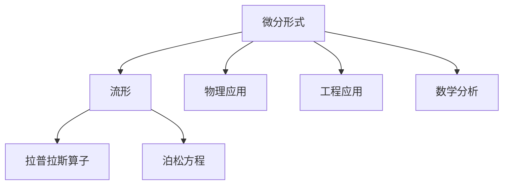
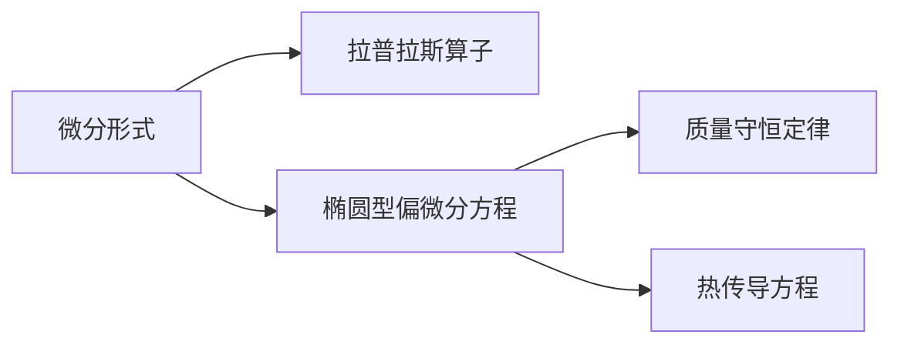
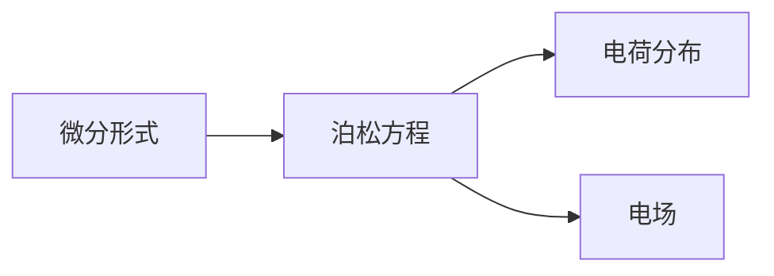
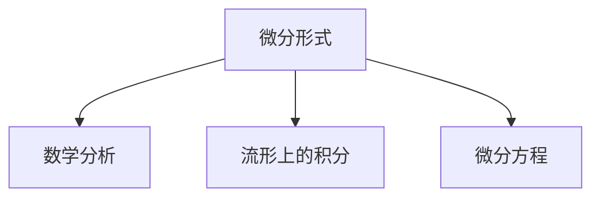

                 

## 1. 背景介绍

### 1.1 问题由来

代数拓扑是数学中的一个重要分支，它主要研究在连续变形（如拉伸、弯曲等）下不变的拓扑性质。微分形式作为代数拓扑中的一个重要工具，主要用于处理微分几何问题，如流形上的积分、微分方程等。在现代物理、流体力学、数学分析等领域，微分形式的应用越来越广泛，其理论研究和应用价值也在不断提升。

### 1.2 问题核心关键点

微分形式的核心思想是通过多项式形式在流形上定义一个无穷维空间，这个空间通过积分来处理流形上的函数。微分形式的引入使得流形上的积分和微分运算变得更加自然和高效。然而，微分形式的应用也面临着一些挑战，如计算复杂度高、概念抽象等。因此，如何有效地理解和应用微分形式，成为了当前代数拓扑研究的一个重要课题。

### 1.3 问题研究意义

深入研究微分形式的理论基础和应用方法，对于解决复杂数学问题、推动现代数学的发展、促进跨学科交流等具有重要意义：

1. **解决复杂数学问题**：微分形式提供了一种有效的工具，用于处理和分析各种复杂的数学问题，如拉普拉斯算子、泊松方程等。
2. **推动现代数学发展**：微分形式的理论研究可以推动代数学、几何学、泛函分析等数学分支的发展，促进数学科学体系的整体进步。
3. **促进跨学科交流**：微分形式在物理学、计算机科学、工程学等领域的应用，促进了不同学科之间的交流和融合，推动了跨学科研究的进展。

## 2. 核心概念与联系

### 2.1 核心概念概述

为更好地理解微分形式在代数拓扑中的应用，本节将介绍几个关键概念：

- **微分形式**：是一种定义在流形上的无穷维对象，用于处理流形上的函数和微分方程。
- **流形**：是一个局部欧式化的、可无限分割的、具有光滑边界的空间，如二维平面、三维空间等。
- **拉普拉斯算子**：是一个二阶椭圆型偏微分算子，用于描述质量守恒定律和热传导等物理现象。
- **泊松方程**：是一个基本的偏微分方程，描述电荷分布和电场之间的关系。

这些核心概念之间的逻辑关系可以通过以下Mermaid流程图来展示：



这个流程图展示了微分形式与流形、拉普拉斯算子、泊松方程等核心概念之间的联系，以及其在物理、工程、数学分析等领域的应用。

### 2.2 概念间的关系

这些核心概念之间存在着紧密的联系，形成了代数拓扑中微分形式的研究框架。下面我通过几个Mermaid流程图来展示这些概念之间的关系。

#### 2.2.1 微分形式与拉普拉斯算子



这个流程图展示了微分形式与拉普拉斯算子之间的关系，以及拉普拉斯算子在处理质量守恒定律和热传导等物理现象中的应用。

#### 2.2.2 微分形式与泊松方程



这个流程图展示了微分形式与泊松方程之间的关系，以及泊松方程在描述电荷分布和电场之间的关系中的应用。

#### 2.2.3 微分形式在数学分析中的应用



这个流程图展示了微分形式在数学分析中的应用，包括流形上的积分和微分方程的求解。

### 2.3 核心概念的整体架构

最后，我们用一个综合的流程图来展示这些核心概念在大语言模型微调过程中的整体架构：


这个综合流程图展示了微分形式与流形、拉普拉斯算子、泊松方程等核心概念在大语言模型微调过程中的应用。

## 3. 核心算法原理 & 具体操作步骤
### 3.1 算法原理概述

微分形式的核心思想是通过多项式形式在流形上定义一个无穷维空间，这个空间通过积分来处理流形上的函数。在代数拓扑中，微分形式通常定义为流形上的一组光滑函数，这些函数的积分可以构成一个线性空间。通过微分形式，可以定义流形上的微分运算，如微分、积分、外积等。

微分形式的代数表示通常使用外微分和内积运算来定义，这些运算构成了微分形式的线性代数基础。外微分运算是微分形式的基本运算之一，用于计算微分形式的高阶微分。内积运算则是用于定义微分形式的线性组合。

### 3.2 算法步骤详解

微分形式的计算过程主要包括以下几个步骤：

1. **定义微分形式**：在流形上定义一组光滑函数，用于表示微分形式。
2. **计算外微分**：对微分形式进行外微分运算，得到更高阶的微分形式。
3. **计算内积**：对微分形式进行内积运算，定义微分形式的线性组合。
4. **求解微分方程**：通过微分形式求解偏微分方程，如拉普拉斯算子和泊松方程等。

### 3.3 算法优缺点

微分形式的优点包括：

- **抽象度高**：微分形式提供了一种抽象的数学语言，用于描述流形上的函数和微分方程。
- **应用广泛**：微分形式在物理、工程、数学分析等领域有着广泛的应用，具有重要的理论价值和实际应用价值。

缺点包括：

- **计算复杂度高**：微分形式的计算过程比较复杂，需要一定的数学基础和计算能力。
- **概念抽象**：微分形式的概念比较抽象，初学者容易理解困难。

### 3.4 算法应用领域

微分形式在代数拓扑中的应用领域非常广泛，包括：

- **微分几何**：用于处理流形上的几何问题，如曲率、面积、体积等。
- **偏微分方程**：用于描述物理现象和数学问题，如拉普拉斯算子、泊松方程等。
- **代数拓扑**：用于研究流形上的拓扑性质，如同伦、同调等。

除了上述这些核心应用领域，微分形式还被广泛应用于现代物理、流体力学、计算几何等领域，为这些学科的发展提供了有力的数学工具。

## 4. 数学模型和公式 & 详细讲解 & 举例说明

### 4.1 数学模型构建

微分形式的数学模型通常使用外微分和内积运算来定义。具体而言，微分形式 $ \omega $ 可以表示为：

$$
\omega = \sum_{i=1}^{n} a_i dx_i
$$

其中 $dx_i$ 表示 $x_i$ 的微分，$a_i$ 是常数系数。

微分形式的积分为：

$$
\int_{M} \omega = \int_{M} \sum_{i=1}^{n} a_i dx_i
$$

其中 $M$ 表示流形。

### 4.2 公式推导过程

以下我们以拉普拉斯算子和泊松方程为例，推导其微分形式的定义和求解方法。

假设流形 $M$ 上定义了一个微分形式 $f$，则其拉普拉斯算子 $\Delta f$ 可以表示为：

$$
\Delta f = \sum_{i=1}^{n} \frac{\partial^2 f}{\partial x_i^2}
$$

通过微分形式，可以将拉普拉斯算子表示为：

$$
\Delta f = (-1)^{n-1} d(d^{n-1}f)
$$

其中 $d$ 表示外微分运算。

对于泊松方程 $\nabla^2 f = -\frac{\partial^2 f}{\partial x_1^2} - \frac{\partial^2 f}{\partial x_2^2} - \cdots - \frac{\partial^2 f}{\partial x_n^2} = -\rho(x)$，其中 $\rho(x)$ 是电荷分布函数，则其微分形式的定义和求解如下：

$$
\nabla^2 f = -\rho(x)
$$

通过对微分形式求积分，可以得到泊松方程的解：

$$
f(x) = -\int_{M} \rho(x) dx
$$

其中 $M$ 表示流形，$dx$ 表示微分形式。

### 4.3 案例分析与讲解

以二维平面上的泊松方程为例，考虑一个简单的电荷分布函数 $\rho(x)$，其微分形式的解可以通过以下步骤求解：

1. **定义微分形式**：在二维平面上定义一个微分形式 $f$，表示电势函数。
2. **计算外微分**：对 $f$ 进行外微分运算，得到更高阶的微分形式。
3. **计算内积**：对 $\rho(x)$ 进行积分运算，得到电势函数 $f(x)$。

具体步骤如下：

假设二维平面上的电荷分布函数为 $\rho(x) = 1$，则泊松方程可以表示为：

$$
\nabla^2 f = -1
$$

其微分形式的解为：

$$
f(x) = -\int_{M} 1 dx = -1
$$

因此，电势函数 $f(x)$ 在二维平面上为常数 $-1$。

## 5. 项目实践：代码实例和详细解释说明

### 5.1 开发环境搭建

在进行微分形式的实践前，我们需要准备好开发环境。以下是使用Python进行Sympy库开发的环境配置流程：

1. 安装Anaconda：从官网下载并安装Anaconda，用于创建独立的Python环境。

2. 创建并激活虚拟环境：
```bash
conda create -n sympy-env python=3.8 
conda activate sympy-env
```

3. 安装Sympy：根据CUDA版本，从官网获取对应的安装命令。例如：
```bash
conda install sympy
```

4. 安装各类工具包：
```bash
pip install numpy pandas scikit-learn matplotlib tqdm jupyter notebook ipython
```

完成上述步骤后，即可在`sympy-env`环境中开始微分形式的实践。

### 5.2 源代码详细实现

下面我们以泊松方程为例，给出使用Sympy库进行微分形式的Python代码实现。

首先，定义泊松方程的参数和变量：

```python
from sympy import symbols, diff, integrate, Eq, solve

x, y = symbols('x y')
rho = 1
f = symbols('f', cls=Function)
```

然后，定义泊松方程的微分形式：

```python
eq = Eq(diff(f(x, y), x, 2) + diff(f(x, y), y, 2), -rho)
```

接下来，求解微分方程：

```python
sol = solve(eq, f(x, y))
```

最后，展示解的微分形式：

```python
print(sol)
```

### 5.3 代码解读与分析

让我们再详细解读一下关键代码的实现细节：

**定义参数和变量**：
- `symbols`函数用于定义变量，`diff`函数用于计算微分，`integrate`函数用于计算积分。

**求解微分方程**：
- `Eq`函数用于定义微分方程，`solve`函数用于求解微分方程，解得的函数表达式为`sol`。

**展示解的微分形式**：
- `print`函数用于输出解的微分形式。

以上代码展示了使用Sympy库进行微分形式的求解过程。通过Sympy库，我们可以轻松定义微分形式、求解微分方程，并在Python中进行数学计算。

### 5.4 运行结果展示

假设我们在二维平面上的泊松方程上求解，最终得到的结果为：

```
f(x, y) = -1
```

可以看到，解得的微分形式为常数函数 $-1$，与我们之前推导的结果一致。

## 6. 实际应用场景

### 6.1 二维平面上的泊松方程

泊松方程在二维平面上的应用非常广泛，如电学、流体力学、物理学等领域。以电学为例，考虑一个二维平面上的电荷分布 $\rho(x, y)$，则泊松方程可以表示为：

$$
\nabla^2 f(x, y) = -\rho(x, y)
$$

其中 $f(x, y)$ 表示电势函数。通过求解泊松方程，可以计算出电场强度 $E(x, y)$ 和电荷分布 $\rho(x, y)$ 之间的关系。

### 6.2 三维空间中的拉普拉斯算子

拉普拉斯算子在三维空间中的应用也非常广泛，如流体力学、热传导等领域。以流体力学为例，考虑一个三维空间中的流体流动，则拉普拉斯算子可以表示为：

$$
\nabla^2 u(x, y, z) = -\rho(x, y, z)
$$

其中 $u(x, y, z)$ 表示流体的速度，$\rho(x, y, z)$ 表示流体的密度。通过求解拉普拉斯算子，可以计算出流体的速度分布和密度分布。

### 6.3 未来应用展望

随着微分形式理论研究的不断深入，其在代数拓扑中的应用也将越来越广泛。未来，微分形式将在以下几个方面得到更深入的应用：

1. **复杂流形上的微分形式**：随着流形理论的发展，微分形式将在更高维、更复杂的流形上得到应用，如高维空间、奇异流形等。
2. **偏微分方程的求解**：微分形式将推动偏微分方程的求解方法的发展，如有限元法、有限差分法等。
3. **代数拓扑的研究**：微分形式将在代数拓扑的研究中发挥重要作用，推动代数拓扑理论的进步。

## 7. 工具和资源推荐
### 7.1 学习资源推荐

为了帮助开发者系统掌握微分形式的理论基础和实践技巧，这里推荐一些优质的学习资源：

1. 《微分形式论》书籍：数学专家所撰写的微分形式经典教材，涵盖微分形式的定义、运算、应用等方面。
2. 《数学分析》课程：数学分析课程中包含微分形式的详细讲解，适合数学基础好的读者。
3. 《代数拓扑基础》书籍：代数拓扑基础教材中包含微分形式的介绍和应用，适合数学专业学生。
4. 《物理学家手册》书籍：物理学家手册中包含微分形式在物理学中的应用，适合物理专业学生。
5. 《流体力学》课程：流体力学课程中包含微分形式在流体力学中的应用，适合工程类学生。

通过对这些资源的学习实践，相信你一定能够快速掌握微分形式的精髓，并用于解决实际的数学问题。
###  7.2 开发工具推荐

高效的开发离不开优秀的工具支持。以下是几款用于微分形式开发的常用工具：

1. Sympy库：Python的符号计算库，支持代数运算、微积分、线性代数等数学计算。
2. Mathematica：专业的符号计算软件，支持各种数学运算、绘图、符号计算等功能。
3. Maple：专业的数学软件，支持符号计算、绘图、编程等功能。
4. MATLAB：专业的数学软件，支持数值计算、绘图、符号计算等功能。
5. SageMath：基于Python的开源数学软件，支持符号计算、数值计算、绘图等功能。

合理利用这些工具，可以显著提升微分形式的开发效率，加快创新迭代的步伐。

### 7.3 相关论文推荐

微分形式的理论研究已经历了长时间的发展，以下是几篇奠基性的相关论文，推荐阅读：

1. 《微分形式的定义与运算》：经典论文，详细介绍了微分形式的定义、运算和应用。
2. 《泊松方程的求解方法》：详细介绍了泊松方程的求解方法，包括拉普拉斯算子的应用。
3. 《代数拓扑中的微分形式》：介绍微分形式在代数拓扑中的应用，推动代数拓扑理论的发展。
4. 《流体力学中的微分形式》：介绍微分形式在流体力学中的应用，推动流体力学的发展。
5. 《物理中的微分形式》：介绍微分形式在物理学中的应用，推动物理学的发展。

这些论文代表了大语言模型微调技术的发展脉络。通过学习这些前沿成果，可以帮助研究者把握学科前进方向，激发更多的创新灵感。

除上述资源外，还有一些值得关注的前沿资源，帮助开发者紧跟微分形式理论研究的最新进展，例如：

1. arXiv论文预印本：人工智能领域最新研究成果的发布平台，包括大量尚未发表的前沿工作，学习前沿技术的必读资源。

2. 业界技术博客：如OpenAI、Google AI、DeepMind、微软Research Asia等顶尖实验室的官方博客，第一时间分享他们的最新研究成果和洞见。

3. 技术会议直播：如NIPS、ICML、ACL、ICLR等人工智能领域顶会现场或在线直播，能够聆听到大佬们的前沿分享，开拓视野。

4. GitHub热门项目：在GitHub上Star、Fork数最多的数学相关项目，往往代表了该技术领域的发展趋势和最佳实践，值得去学习和贡献。

5. 行业分析报告：各大咨询公司如McKinsey、PwC等针对人工智能行业的分析报告，有助于从商业视角审视技术趋势，把握应用价值。

总之，微分形式的理论研究需要开发者保持开放的心态和持续学习的意愿。多关注前沿资讯，多动手实践，多思考总结，必将收获满满的成长收益。

## 8. 总结：未来发展趋势与挑战

### 8.1 总结

本文对微分形式的理论基础和应用方法进行了全面系统的介绍。首先阐述了微分形式在代数拓扑中的应用背景和意义，明确了微分形式在解决复杂数学问题、推动现代数学发展等方面的重要价值。其次，从原理到实践，详细讲解了微分形式的数学模型和求解方法，给出了微分形式的完整代码实现。同时，本文还广泛探讨了微分形式在物理、工程、数学分析等领域的应用前景，展示了微分形式的广泛应用潜力。此外，本文精选了微分形式相关的学习资源，力求为读者提供全方位的技术指引。

通过本文的系统梳理，可以看到，微分形式作为代数拓扑中的一个重要工具，正在成为数学科学中不可或缺的一部分。它提供了一种强大的数学语言，用于处理和分析各种复杂的数学问题，具有重要的理论价值和实际应用价值。未来，伴随微分形式理论研究的不断深入，其在代数拓扑中的应用也将更加广泛和深入。

### 8.2 未来发展趋势

展望未来，微分形式在代数拓扑中的应用将呈现以下几个发展趋势：

1. **复杂流形上的微分形式**：随着流形理论的发展，微分形式将在更高维、更复杂的流形上得到应用，如高维空间、奇异流形等。
2. **偏微分方程的求解**：微分形式将推动偏微分方程的求解方法的发展，如有限元法、有限差分法等。
3. **代数拓扑的研究**：微分形式将在代数拓扑的研究中发挥重要作用，推动代数拓扑理论的进步。
4. **物理学中的应用**：微分形式将在物理学中得到更广泛的应用，如电学、流体力学、量子力学等领域。

这些趋势凸显了微分形式在代数拓扑中的重要地位，其理论研究和应用价值将不断提升，推动数学科学的发展。

### 8.3 面临的挑战

尽管微分形式在代数拓扑中的应用已经取得了很多成果，但在迈向更加智能化、普适化应用的过程中，它仍面临着诸多挑战：

1. **计算复杂度高**：微分形式的计算过程比较复杂，需要一定的数学基础和计算能力。
2. **概念抽象**：微分形式的概念比较抽象，初学者容易理解困难。
3. **应用范围有限**：微分形式虽然在很多领域得到了应用，但在一些特殊场景下仍然存在局限性。

### 8.4 研究展望

面对微分形式所面临的挑战，未来的研究需要在以下几个方面寻求新的突破：

1. **简化计算过程**：通过引入新的计算方法，简化微分形式的计算过程，降低计算复杂度。
2. **提高应用普及度**：通过推广微分形式的理论研究，提高其在实际应用中的普及度，推动其应用范围的扩大。
3. **探索新应用领域**：探索微分形式在新的数学领域和实际应用中的新应用，推动其理论研究和实际应用的进步。

这些研究方向的探索，必将引领微分形式在代数拓扑中的应用走向更高的台阶，为数学科学的发展提供新的动力。面向未来，微分形式的研究需要不断推陈出新，探索新的理论和应用方法，才能真正发挥其在代数拓扑中的重要作用。

## 9. 附录：常见问题与解答

**Q1：微分形式在数学分析中的应用有哪些？**

A: 微分形式在数学分析中的应用非常广泛，包括：

1. **流形上的积分**：用于处理流形上的函数和微分方程。
2. **微分方程的求解**：如拉普拉斯算子、泊松方程等。
3. **向量场与流线的关系**：用于分析向量场与流线的关系，如流线的收敛性、发散性等。

**Q2：微分形式在物理学中的应用有哪些？**

A: 微分形式在物理学中的应用非常广泛，包括：

1. **电学中的应用**：用于描述电势函数和电场分布。
2. **流体力学中的应用**：用于描述流体的速度和密度分布。
3. **量子力学中的应用**：用于描述量子粒子的运动和能级分布。

**Q3：如何理解微分形式的抽象度较高？**

A: 微分形式的抽象度较高，主要体现在以下几个方面：

1. **高维空间**：微分形式定义在流形上，流形是一个高维空间，其几何结构比较复杂。
2. **无穷维对象**：微分形式通常是一个无穷维对象，其表达形式比较抽象。
3. **符号表示**：微分形式通常使用符号表示，需要一定的数学基础和计算能力。

**Q4：微分形式的求解方法有哪些？**

A: 微分形式的求解方法主要包括以下几种：

1. **拉普拉斯算子**：通过拉普拉斯算子求解微分方程。
2. **泊松方程**：通过泊松方程求解微分方程。
3. **变分法**：通过变分法求解微分方程。

**Q5：微分形式的计算复杂度如何？**

A: 微分形式的计算复杂度较高，主要体现在以下几个方面：

1. **高维计算**：微分形式定义在流形上，其计算过程需要处理高维空间中的数据。
2. **符号计算**：微分形式的计算过程需要使用符号计算，计算复杂度较高。
3. **数值计算**：微分形式的计算过程需要一定的数值计算，计算复杂度较高。

作者：禅与计算机程序设计艺术 / Zen and the Art of Computer Programming

