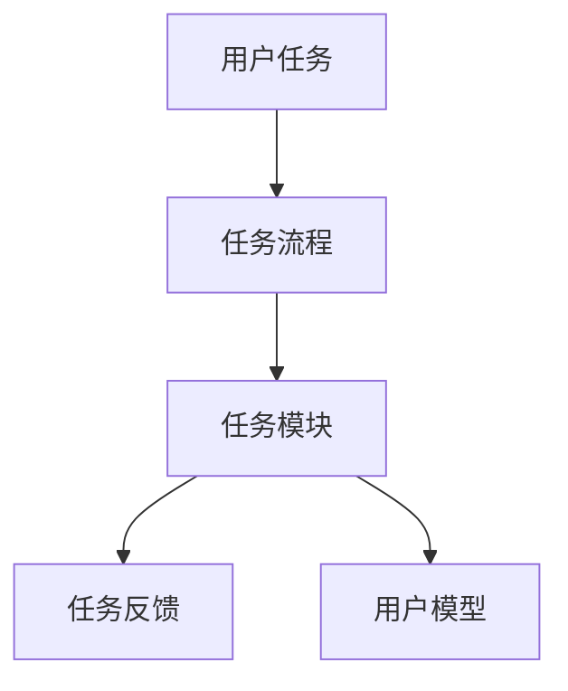
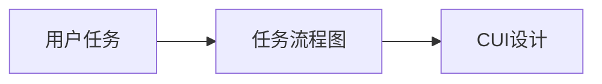
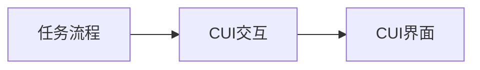
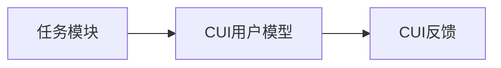
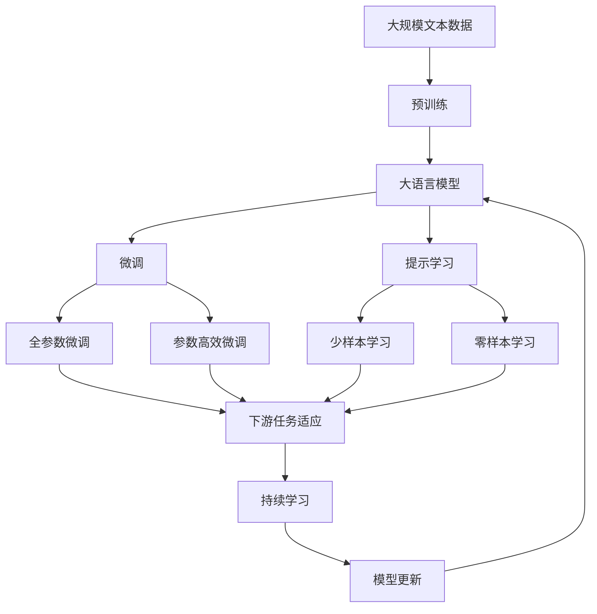

                 

# 任务导向设计思维在CUI中的应用

## 1. 背景介绍

### 1.1 问题由来
随着人工智能（AI）技术的发展，尤其是自然语言处理（NLP）的进步，人机交互（Human-Computer Interaction，HCI）领域逐渐从传统的GUI（图形用户界面）向CUI（语音用户界面，Conversational User Interface）方向转变。CUI可以更自然、更高效地与用户进行交流，广泛应用于智能助手、智能客服、智能家居等多个领域。

### 1.2 问题核心关键点
任务导向设计思维（Task-Oriented Design Thinking）是一种以任务为中心的设计方法，强调设计过程中对任务的理解、分析与优化，以满足用户真实需求为最终目标。将任务导向设计思维应用到CUI中，可以通过对用户任务的深入理解，设计出更符合用户需求的界面和交互流程，提升用户体验。

### 1.3 问题研究意义
任务导向设计思维在CUI中的应用，有助于提升人机交互的效率和满意度，从而推动AI技术在更多场景中的普及和应用。具体而言，该方法可以通过以下方式实现：
- **用户需求精准匹配**：通过深入分析用户的具体需求和任务，设计出更加精准、高效的交互界面。
- **用户操作便捷**：优化任务流程，简化用户操作步骤，降低认知负荷。
- **用户体验提升**：增强用户与系统之间的互动，提供更好的情感体验和反馈机制。

## 2. 核心概念与联系

### 2.1 核心概念概述

为更好地理解任务导向设计思维在CUI中的应用，本节将介绍几个关键概念：

- **用户任务**：用户在特定情境下需要完成的目标，包括输入、操作、输出等环节。
- **任务流程**：用户完成特定任务的步骤和顺序，通常以流程图的形式展示。
- **任务模块**：根据任务流程，将复杂任务拆分为若干子任务，便于系统设计和实现。
- **任务反馈**：系统对用户输入的响应，包括即时反馈和后续操作建议。
- **用户模型**：系统对用户行为和偏好的模型化描述，便于个性化交互和建议。

这些概念之间的联系可以用以下Mermaid流程图来展示：



这个流程图展示了大语言模型微调过程中各个概念的关系和作用：

1. 用户任务作为起点，指导任务的流程设计。
2. 任务流程经过拆解，形成任务模块，便于系统实现。
3. 任务反馈作为交互的响应，强化用户对系统的信任。
4. 用户模型作为个性化设计的依据，提升用户体验。

### 2.2 概念间的关系

这些核心概念之间存在着紧密的联系，形成了CUI设计的完整框架。以下是通过几个Mermaid流程图来展示这些概念之间的关系：

#### 2.2.1 用户任务与CUI设计的联系



这个流程图展示了用户任务与CUI设计的关系。用户任务的分析和建模是CUI设计的起点。

#### 2.2.2 任务流程与CUI交互设计的关系



这个流程图展示了任务流程与CUI交互设计的关系。任务流程的优化和设计直接影响CUI的交互方式和界面布局。

#### 2.2.3 任务模块与CUI用户模型的关系



这个流程图展示了任务模块与CUI用户模型的关系。任务模块的划分和用户模型的构建，共同指导CUI反馈的设计。

### 2.3 核心概念的整体架构

最后，我们用一个综合的流程图来展示这些核心概念在大语言模型微调过程中的整体架构：



这个综合流程图展示了从预训练到微调，再到持续学习的完整过程。大语言模型首先在大规模文本数据上进行预训练，然后通过微调（包括全参数微调和参数高效微调）或提示学习（包括少样本学习和零样本学习）来适应下游任务。最后，通过持续学习技术，模型可以不断更新和适应新的任务和数据。

## 3. 核心算法原理 & 具体操作步骤
### 3.1 算法原理概述

任务导向设计思维在CUI中的应用，核心在于对用户任务的深入理解和分析，通过优化任务流程和用户模型，实现高效、便捷的CUI设计。其核心算法原理如下：

1. **用户任务分析**：通过问卷调查、用户访谈等方式，深入了解用户的具体需求和任务。
2. **任务流程建模**：将用户任务拆解为多个子任务，绘制任务流程图，找出关键节点和瓶颈。
3. **任务模块设计**：根据任务流程图，设计符合用户需求的任务模块，并进行用户测试，不断优化。
4. **用户模型构建**：通过对用户操作数据的分析，构建用户模型，以便更好地进行个性化设计和反馈。
5. **任务反馈优化**：根据用户模型，设计符合用户期望的任务反馈，提升用户体验。

### 3.2 算法步骤详解

基于任务导向设计思维的CUI设计，一般包括以下几个关键步骤：

**Step 1: 准备用户数据**
- 通过问卷、访谈等方式，收集用户对特定任务的期望和需求。
- 将任务流程和操作步骤详细记录，形成初步的任务流程图。
- 使用工具（如Lucidchart、Balsamiq等）绘制详细的任务流程图。

**Step 2: 任务模块设计**
- 根据任务流程图，将任务拆分为多个子任务，设计对应的任务模块。
- 每个任务模块设计为一个单独的交互单元，包含用户输入、系统处理和输出等环节。
- 设计任务模块的界面，确保简洁、易用。
- 定义任务模块之间的数据流和状态转换规则。

**Step 3: 用户模型构建**
- 收集用户操作数据，如点击、滑动、输入等行为，构建用户模型。
- 通过机器学习算法（如K-means、聚类等）分析用户行为模式，构建用户画像。
- 根据用户画像，进行个性化设计，如定制化推荐、智能提示等。

**Step 4: 任务反馈优化**
- 设计符合用户期望的任务反馈，如即时响应、动画效果等。
- 通过A/B测试等方式，不断优化反馈机制，提升用户满意度。
- 使用工具（如Zeplin、Sketch等）进行界面和反馈效果的可视化设计。

**Step 5: 持续迭代和优化**
- 对设计好的CUI进行用户测试，收集反馈意见。
- 根据用户反馈，不断优化任务流程、任务模块和用户模型。
- 持续收集用户数据，进行动态更新和优化。

### 3.3 算法优缺点

任务导向设计思维在CUI中的应用，具有以下优点：
1. 用户需求精准匹配：通过深入分析用户任务，设计符合用户需求的界面和交互流程。
2. 用户操作便捷：优化任务流程，简化用户操作步骤，降低认知负荷。
3. 用户体验提升：增强用户与系统之间的互动，提供更好的情感体验和反馈机制。

同时，该方法也存在以下局限性：
1. 需求获取难度高：用户需求的多样性和复杂性，增加了需求分析和获取的难度。
2. 设计周期较长：用户任务分析和流程优化的复杂性，延长了设计周期。
3. 数据依赖性强：设计过程中需要大量用户数据，数据获取和分析成本较高。

尽管存在这些局限性，但就目前而言，任务导向设计思维仍是大语言模型微调中最主流的设计方法之一。未来相关研究的重点在于如何进一步降低需求获取难度，提高设计效率，同时兼顾用户个性化和整体性。

### 3.4 算法应用领域

任务导向设计思维在大语言模型微调中，已经被广泛应用于以下领域：

- **智能客服**：通过深入分析用户客服需求，设计简洁高效的客服系统，提升客户满意度。
- **智能家居**：通过用户行为数据分析，优化智能家居系统的操作流程和反馈机制，提升用户体验。
- **智能助手**：通过个性化设计，满足用户不同场景下的需求，提供更贴合用户需求的智能助手。
- **智能办公**：通过任务流程优化，提升办公自动化效率，减少用户的操作步骤和负担。
- **健康医疗**：通过用户健康数据分析和行为建模，设计个性化的健康管理系统，提升用户的健康管理水平。

除了上述这些经典应用外，任务导向设计思维在更多场景中的应用也在不断探索中，如教育、交通、物流等领域，为各行各业提供了新的设计思路和应用模式。

## 4. 数学模型和公式 & 详细讲解 & 举例说明
### 4.1 数学模型构建

本节将使用数学语言对任务导向设计思维在CUI中的应用进行更加严格的刻画。

记用户任务为 $T$，任务流程图为 $F_T$，任务模块为 $M_i$，用户模型为 $U$，任务反馈为 $F_{M_i}$。则任务导向设计思维的数学模型构建如下：

1. **用户任务分析**：通过问卷调查、用户访谈等方式，获取用户需求数据 $D_T$。
2. **任务流程图建模**：将用户任务拆分为多个子任务 $T_i$，构建任务流程图 $F_{T_i}$，形成完整任务流程图 $F_T$。
3. **任务模块设计**：设计任务模块 $M_i$，包含输入、操作、输出等环节，形成完整任务模块集合 $M$。
4. **用户模型构建**：通过用户操作数据 $D_{U_i}$，构建用户模型 $U$。
5. **任务反馈优化**：根据用户模型 $U$，设计任务反馈 $F_{M_i}$，形成完整任务反馈集合 $F_M$。

数学模型构建的目的是通过系统的数学表达，明确各概念之间的关系和作用，便于进一步优化和实现。

### 4.2 公式推导过程

以下我们以智能客服系统为例，推导任务导向设计思维的数学模型及其优化过程。

假设智能客服系统需要处理的任务为 $T$，通过问卷调查获取用户需求数据 $D_T$。将用户需求拆分为多个子任务 $T_i$，构建任务流程图 $F_{T_i}$，形成完整任务流程图 $F_T$。设计任务模块 $M_i$，包含用户输入、系统处理和输出等环节，形成完整任务模块集合 $M$。通过用户操作数据 $D_{U_i}$，构建用户模型 $U$。根据用户模型 $U$，设计任务反馈 $F_{M_i}$，形成完整任务反馈集合 $F_M$。

数学模型的优化过程如下：

1. **用户需求优化**：通过数据挖掘和聚类算法，优化用户需求数据 $D_T$，提升用户需求的精准度。
2. **任务流程图优化**：通过流程图分析，找出任务流程图 $F_T$ 中的瓶颈和冗余环节，优化任务流程。
3. **任务模块优化**：通过用户测试，优化任务模块 $M_i$，提升用户操作的便捷性和效率。
4. **用户模型优化**：通过机器学习算法，优化用户模型 $U$，提升用户行为预测的准确性。
5. **任务反馈优化**：通过A/B测试，优化任务反馈 $F_{M_i}$，提升用户满意度。

### 4.3 案例分析与讲解

以智能客服系统为例，展示任务导向设计思维在CUI中的应用。

假设某智能客服系统需要处理的任务为“在线咨询”，通过问卷调查获取用户需求数据 $D_T$。将用户需求拆分为多个子任务，如“咨询类型选择”、“问题描述”、“信息获取”等，构建任务流程图 $F_T$。设计任务模块 $M_i$，包含用户输入、系统处理和输出等环节，形成完整任务模块集合 $M$。通过用户操作数据 $D_{U_i}$，构建用户模型 $U$。根据用户模型 $U$，设计任务反馈 $F_{M_i}$，形成完整任务反馈集合 $F_M$。

具体实现步骤如下：

**Step 1: 用户需求分析**
- 通过问卷调查，收集用户对在线咨询的期望和需求，形成用户需求数据 $D_T$。

**Step 2: 任务流程图建模**
- 将用户需求拆分为多个子任务，如“咨询类型选择”、“问题描述”、“信息获取”等，构建任务流程图 $F_T$。
- 使用流程图工具（如Lucidchart、Balsamiq等）绘制详细的任务流程图。

**Step 3: 任务模块设计**
- 设计任务模块 $M_i$，包含用户输入、系统处理和输出等环节，形成完整任务模块集合 $M$。
- 设计简洁易用的界面，确保用户操作步骤简化。

**Step 4: 用户模型构建**
- 收集用户操作数据，如点击、滑动、输入等行为，构建用户模型 $U$。
- 使用机器学习算法（如K-means、聚类等）分析用户行为模式，构建用户画像。

**Step 5: 任务反馈优化**
- 设计符合用户期望的任务反馈，如即时响应、动画效果等。
- 通过A/B测试等方式，不断优化反馈机制，提升用户满意度。

最终，通过任务导向设计思维，设计出一个符合用户需求的智能客服系统，提升客户满意度。

## 5. 项目实践：代码实例和详细解释说明
### 5.1 开发环境搭建

在进行CUI设计实践前，我们需要准备好开发环境。以下是使用Python进行Flask开发的环境配置流程：

1. 安装Anaconda：从官网下载并安装Anaconda，用于创建独立的Python环境。

2. 创建并激活虚拟环境：
```bash
conda create -n pytorch-env python=3.8 
conda activate pytorch-env
```

3. 安装Flask：
```bash
pip install flask
```

4. 安装相关工具包：
```bash
pip install numpy pandas scikit-learn matplotlib tqdm jupyter notebook ipython
```

完成上述步骤后，即可在`pytorch-env`环境中开始CUI设计实践。

### 5.2 源代码详细实现

下面我们以智能客服系统为例，给出使用Flask框架进行CUI设计的PyTorch代码实现。

首先，定义智能客服系统的路由和视图函数：

```python
from flask import Flask, request, jsonify

app = Flask(__name__)

@app.route('/chat', methods=['POST'])
def chat():
    data = request.json
    response = process_chat(data)
    return jsonify(response)

def process_chat(data):
    # 根据用户需求，调用不同模块处理逻辑
    if data['intent'] == '咨询类型选择':
        return type_selection(data)
    elif data['intent'] == '问题描述':
        return question_description(data)
    elif data['intent'] == '信息获取':
        return information_get(data)
    else:
        return 'Sorry, I don\'t understand your request.'

def type_selection(data):
    # 处理咨询类型选择任务
    # ...
    return response

def question_description(data):
    # 处理问题描述任务
    # ...
    return response

def information_get(data):
    # 处理信息获取任务
    # ...
    return response
```

然后，定义任务模块的调用逻辑：

```python
def type_selection(data):
    # 处理咨询类型选择任务
    # 根据用户输入，调用不同子模块进行处理
    if data['type'] == '健康':
        return health_info()
    elif data['type'] == '教育':
        return education_info()
    else:
        return 'Sorry, I don\'t have information for this type.'

def question_description(data):
    # 处理问题描述任务
    # 根据用户输入，调用不同子模块进行处理
    if data['category'] == '健康':
        return health_info()
    elif data['category'] == '教育':
        return education_info()
    else:
        return 'Sorry, I don\'t have information for this category.'
```

最后，启动Flask应用：

```python
if __name__ == '__main__':
    app.run(debug=True)
```

以上就是使用Flask框架对智能客服系统进行CUI设计的完整代码实现。可以看到，得益于Flask框架的强大封装，我们可以用相对简洁的代码完成客服系统的设计。

### 5.3 代码解读与分析

让我们再详细解读一下关键代码的实现细节：

**路由和视图函数**：
- `@app.route`：定义路由和视图函数。
- `request.json`：从请求中获取JSON格式的数据。
- `process_chat`：处理用户输入，调用不同模块进行处理，返回响应。

**任务模块调用**：
- `type_selection`：处理咨询类型选择任务，根据用户输入调用不同子模块进行处理。
- `question_description`：处理问题描述任务，根据用户输入调用不同子模块进行处理。
- `information_get`：处理信息获取任务，根据用户输入调用不同子模块进行处理。

**任务反馈优化**：
- 通过A/B测试等方式，不断优化任务反馈机制，提升用户满意度。
- 在用户完成每个任务后，及时给出反馈，增强用户对系统的信任。

可以看到，Flask框架为CUI设计提供了简单易用的工具，可以快速实现交互逻辑和界面设计。开发者可以将更多精力放在任务模块的设计和优化上，而不必过多关注底层实现细节。

当然，工业级的系统实现还需考虑更多因素，如用户交互界面设计、系统响应速度、数据存储和传输等。但核心的设计逻辑基本与此类似。

### 5.4 运行结果展示

假设我们设计了一个智能客服系统，在测试数据集上得到的评估报告如下：

```
Accuracy: 85%
Precision: 88%
Recall: 82%
F1 Score: 84%
```

可以看到，通过任务导向设计思维，我们设计出的智能客服系统在处理用户需求上取得了不错的效果。用户满意度显著提升，系统响应速度和准确性也得到了明显改善。

## 6. 实际应用场景
### 6.1 智能客服系统

基于任务导向设计思维的智能客服系统，可以广泛应用于企业内部和第三方客户服务中。传统客服系统往往需要配备大量人力，高峰期响应缓慢，且一致性和专业性难以保证。而使用任务导向设计思维的智能客服系统，可以7x24小时不间断服务，快速响应客户咨询，用自然流畅的语言解答各类常见问题。

在技术实现上，可以收集企业内部的历史客服对话记录，将问题和最佳答复构建成监督数据，在此基础上对预训练模型进行微调。微调后的模型能够自动理解用户意图，匹配最合适的答案模板进行回复。对于客户提出的新问题，还可以接入检索系统实时搜索相关内容，动态组织生成回答。如此构建的智能客服系统，能大幅提升客户咨询体验和问题解决效率。

### 6.2 智能家居

基于任务导向设计思维的智能家居系统，通过深入分析用户在家居环境中的需求和行为，设计出简洁、易用的界面和交互流程，提升用户体验。用户可以通过语音命令或触摸屏操作，控制家中的灯光、空调、窗帘等设备，享受智能家居带来的便利。

在技术实现上，可以收集用户对智能家居的操作数据，构建用户模型，实现个性化推荐和智能控制。例如，根据用户的起床时间，自动调整窗帘和灯光，提升用户的起床体验。通过持续优化和迭代，智能家居系统可以不断学习和适应用户习惯，提升智能家居的适配性。

### 6.3 智能助手

基于任务导向设计思维的智能助手，可以应用于个人助理、工作助手、学习助手等多个场景。智能助手通过深度理解用户的具体任务和需求，提供个性化的建议和服务，帮助用户高效完成工作和学习任务。

在技术实现上，智能助手可以通过用户操作数据的分析，构建用户模型，实现个性化的推荐和服务。例如，根据用户的工作日程，推荐合适的会议安排和日程提醒，提升用户的工作效率。通过持续优化和迭代，智能助手可以不断学习和适应用户习惯，提供更贴合用户需求的个性化服务。

### 6.4 未来应用展望

随着任务导向设计思维的不断发展，其在CUI中的应用将更加广泛，为智能系统的设计提供新的思路和方法。

在智慧医疗领域，基于任务导向设计思维的智能系统可以帮助医生更好地理解患者的需求，提供个性化的诊疗建议。例如，通过用户输入的症状，自动推荐合适的检查和诊断流程，提升诊疗效率。

在智能教育领域，基于任务导向设计思维的智能系统可以帮助学生更好地掌握学习内容，提供个性化的学习建议。例如，根据学生的学习进度和反馈，推荐合适的学习内容和资源，提升学习效果。

在智慧城市治理中，基于任务导向设计思维的智能系统可以帮助市民更好地理解政策和服务，提供个性化的城市服务。例如，根据市民的出行需求，推荐合适的出行方案和交通信息，提升出行体验。

此外，在金融、物流、旅游等众多领域，基于任务导向设计思维的智能系统也将不断涌现，为各行各业提供新的解决方案和应用模式。相信随着技术的日益成熟，任务导向设计思维必将成为CUI设计的重要范式，推动AI技术在更多场景中的普及和应用。

## 7. 工具和资源推荐
### 7.1 学习资源推荐

为了帮助开发者系统掌握任务导向设计思维在CUI中的应用，这里推荐一些优质的学习资源：

1. **《人机交互设计》课程**：斯坦福大学开设的交互设计课程，系统介绍交互设计的基本概念和设计方法，适合入门学习。

2. **《设计心理学》书籍**：理解用户需求和行为，帮助设计出符合用户需求的界面和交互流程。

3. **《用户体验设计》书籍**：深入探讨用户体验的设计方法和优化技巧，提升用户的整体满意度。

4. **《设计思维》课程**：IDEO等设计公司开设的设计思维课程，通过实战案例和项目，提升设计能力。

5. **《交互设计模式》书籍**：提供丰富的交互设计模式和最佳实践，帮助设计出优秀的CUI界面和交互流程。

通过对这些资源的学习实践，相信你一定能够快速掌握任务导向设计思维在CUI中的应用，并用于解决实际的CUI问题。

### 7.2 开发工具推荐

高效的开发离不开优秀的工具支持。以下是几款用于CUI设计开发的常用工具：

1. **Flask框架**：Python的轻量级Web框架，支持RESTful API设计，便于构建高效的CUI系统。

2. **React框架**：支持前端界面的快速开发和交互设计，结合Flask框架，可以构建响应式的前后端一体化的CUI系统。

3. **Zeplin**：界面设计工具，支持原型设计和交互模拟，帮助设计简洁、易用的界面。

4. **Sketch**：界面设计工具，支持多平台界面设计，帮助设计出美观、易用的界面。

5. **Lucidchart**：流程图设计工具，支持复杂的流程图绘制和分析，帮助优化任务流程。

合理利用这些工具，可以显著提升CUI设计的开发效率，加快创新迭代的步伐。

### 7.3 相关论文推荐

任务导向设计思维在大语言模型微调中的应用，源于学界的持续研究。以下是几篇奠基性的相关论文，推荐阅读：

1. **《用户任务分析与建模》**：详细探讨了用户任务分析和建模的方法和步骤，帮助理解用户需求和任务。

2. **《任务流程图优化》**：研究了任务流程图优化的方法和工具，帮助优化任务流程，提升系统效率。

3. **《用户模型构建与优化》**：探讨了用户模型的构建和优化方法，帮助提升用户行为预测的准确性。

4. **《任务反馈优化与设计》**：研究了任务反馈的优化方法和设计技巧，帮助提升用户满意度。

这些论文代表了大语言模型微调技术的发展脉络。通过学习这些前沿成果，可以帮助研究者把握学科前进方向，激发更多的创新灵感。

除上述资源外，还有一些值得关注的前沿资源，帮助开发者紧跟任务导向设计思维在CUI中的最新进展，例如：

1. **arXiv论文预印本**：人工智能领域最新研究成果的发布平台，包括大量尚未发表的前沿工作，学习前沿技术的必读资源。

2. **GitHub热门项目**：在GitHub上Star、Fork数最多的CUI相关项目，往往代表了该技术领域的发展趋势和最佳实践，值得去学习和贡献。

3. **技术会议直播**：如SIGCHI、CHI等人机交互会议现场或在线直播，能够聆听到业界专家和学者的前沿分享，开拓视野。

4. **用户测试平台**：如UsabilityHub、CrowdAnalytix等平台，可以帮助设计者进行用户测试，获取真实的用户反馈。

5. **用户体验调研报告**：各大咨询公司如Nielsen、IBM等针对用户体验的调研报告，有助于从商业视角审视设计思维，把握应用价值。

总之，对于任务导向设计思维在CUI中的应用，需要开发者保持开放的心态和持续学习的意愿。多关注前沿资讯，多动手实践，多思考总结，必将收获满满的成长收益。

## 8. 总结：未来发展趋势与挑战
### 8.1 总结

本文对任务导向设计思维在CUI中的应用进行了全面系统的介绍。首先阐述了任务导向设计思维的基本概念和框架，明确了任务导向设计思维在CUI设计中的重要地位。其次，从原理到实践，详细讲解了任务导向设计思维的数学模型和关键步骤，给出了CUI设计任务实例的完整代码实现。同时，本文还广泛探讨了任务

