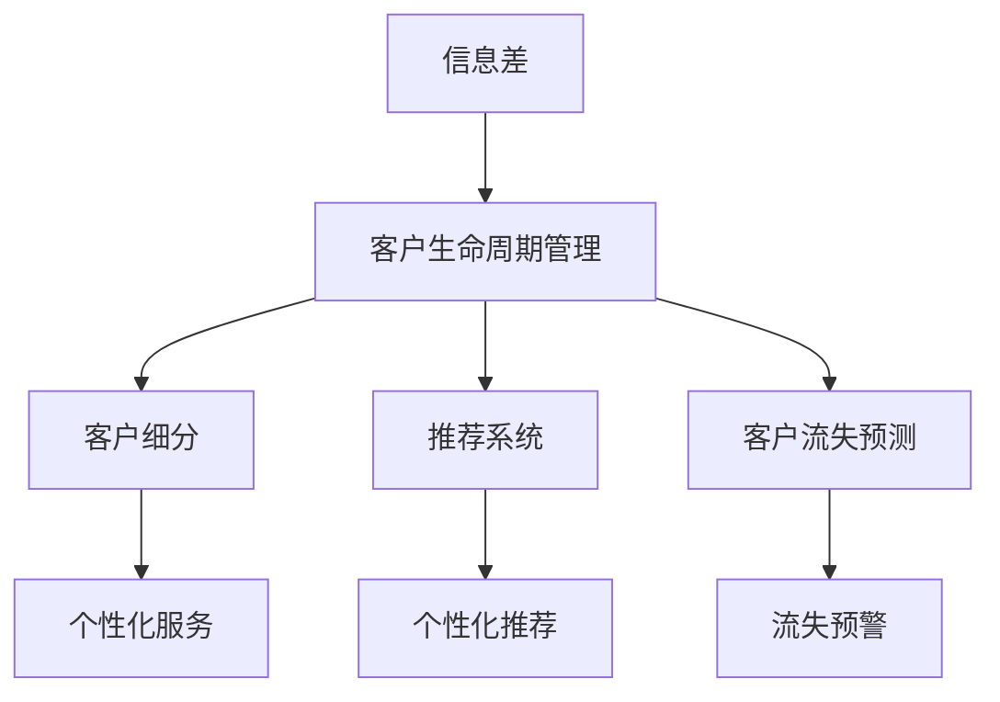
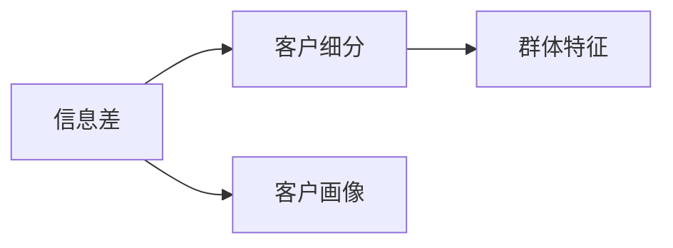
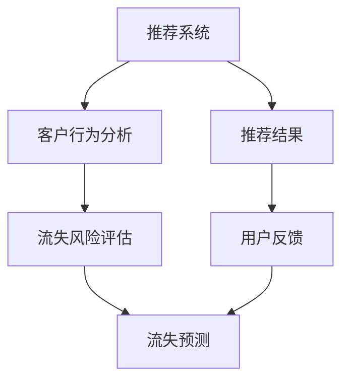
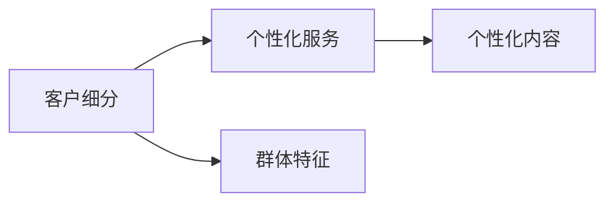
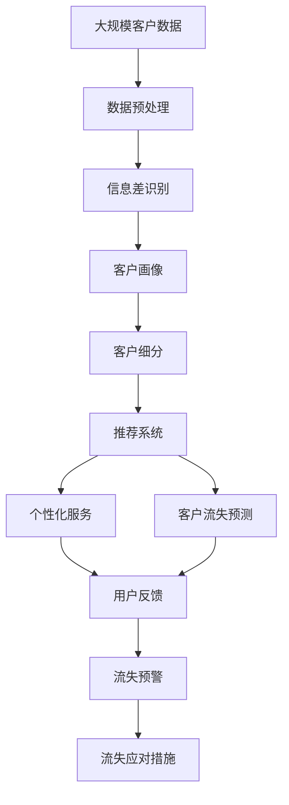

                 

# 信息差的客户生命周期管理：大数据如何管理客户生命周期

> 关键词：信息差, 客户生命周期管理, 大数据, 客户细分, 推荐系统, 客户流失预测

## 1. 背景介绍

### 1.1 问题由来

在当前竞争激烈的商业环境中，客户生命周期管理（Customer Lifecycle Management, CLM）成为了企业提升业务竞争力和客户满意度的重要手段。然而，随着用户行为的多样化和数据的爆炸式增长，传统的CLM方法在实际应用中逐渐显现出其局限性，难以全面、准确地理解客户需求和行为。信息差（Information Gap），即用户在输入需求时存在的不完整、模糊、矛盾的信息，是当前CLM面临的主要问题之一。

信息差的出现，不仅增加了客户与企业之间的沟通难度，也使得企业难以准确地了解和预测客户需求，从而无法提供个性化的服务。比如，用户在搜索某个产品时，可能会使用模糊的关键词，导致搜索结果与用户真正需求存在偏差。这种信息差问题如果无法有效解决，将会直接影响企业的销售转化率和客户满意度。

### 1.2 问题核心关键点

信息差问题在CLM中主要表现为：
- 用户输入需求时使用的关键词不完整或不准确，导致搜索结果与实际需求存在偏差。
- 用户可能存在模糊、矛盾的需求描述，使得企业难以准确判断和满足其需求。
- 用户可能对产品功能或服务细节存在误解，影响购买决策。

为了解决这些信息差问题，需要借助大数据技术，通过深入分析用户行为数据，发现潜在的客户需求和偏好，从而提供更准确、个性化的服务。然而，如何从大规模数据中高效挖掘出有用的信息，并在实际应用中进行有效利用，成为了关键的技术难题。

### 1.3 问题研究意义

研究信息差下的客户生命周期管理，对于提升企业的业务竞争力和客户满意度，具有重要意义：

1. 提升客户满意度：通过精准定位和理解客户需求，提供个性化服务，能够显著提升客户的满意度和忠诚度。
2. 优化用户体验：精准的信息差识别和处理，能够帮助企业提供更好的用户体验，降低用户流失率。
3. 增加销售转化率：通过有效理解客户需求，推荐合适的产品或服务，能够提高销售转化率和客户生命周期价值。
4. 增强市场洞察力：大数据分析能够提供更全面的市场洞察，帮助企业制定更科学的市场策略。
5. 促进业务创新：信息差识别和处理技术的不断进步，能够推动企业进行业务模式创新和产品迭代。

## 2. 核心概念与联系

### 2.1 核心概念概述

为了更好地理解信息差下的客户生命周期管理，本节将介绍几个关键的概念：

- 信息差（Information Gap）：指用户在输入需求时，存在的不完整、模糊、矛盾的信息。这些信息差会影响企业对客户需求的准确理解，进而影响服务提供和客户满意度。
- 客户生命周期管理（CLM）：指通过数据分析、客户细分、需求预测等手段，管理客户的各个生命周期阶段（如潜在客户、新客户、老客户等），提升客户价值和业务回报。
- 大数据（Big Data）：指从各种来源收集的大量、高速、多样的数据，通过分析这些数据，发现有用的信息、知识和趋势。
- 客户细分（Customer Segmentation）：指根据客户的属性、行为、偏好等特征，将客户分成不同的群体，以便提供更精准的服务。
- 推荐系统（Recommendation System）：指基于用户的历史行为和偏好，推荐合适的产品或服务，提高用户满意度和转化率。
- 客户流失预测（Customer Churn Prediction）：指通过分析历史数据，预测客户是否会流失，以便采取相应的措施进行挽留。

这些概念之间的关系可以通过以下Mermaid流程图来展示：



这个流程图展示了信息差与客户生命周期管理之间的联系：信息差影响客户细分、推荐系统和流失预测的准确性，进而影响个性化服务和个性化推荐的效果，最终影响客户的流失预警和挽留措施的制定。

### 2.2 概念间的关系

这些核心概念之间存在着紧密的联系，形成了客户生命周期管理的完整生态系统。下面我们通过几个Mermaid流程图来展示这些概念之间的关系。

#### 2.2.1 信息差与客户细分的关系



这个流程图展示了信息差与客户细分之间的关系。信息差通过挖掘客户画像，发现群体特征，从而帮助企业更准确地进行客户细分。

#### 2.2.2 推荐系统与客户流失预测的关系



这个流程图展示了推荐系统与客户流失预测之间的关系。推荐系统通过分析客户行为，生成推荐结果，并根据用户反馈，进行流失风险评估和预测，从而帮助企业采取相应的挽留措施。

#### 2.2.3 客户细分与个性化服务的关系



这个流程图展示了客户细分与个性化服务之间的关系。客户细分通过发现群体特征，从而提供更精准的个性化服务，包括个性化内容和个性化推荐。

### 2.3 核心概念的整体架构

最后，我们用一个综合的流程图来展示这些核心概念在客户生命周期管理中的整体架构：



这个综合流程图展示了从数据预处理到信息差识别、客户画像、客户细分、推荐系统、个性化服务、客户流失预测、流失预警和应对措施的全过程。通过这些步骤，企业可以全面、准确地管理客户的生命周期，提升业务价值和客户满意度。

## 3. 核心算法原理 & 具体操作步骤
### 3.1 算法原理概述

信息差下的客户生命周期管理，本质上是一个数据驱动的优化问题。其核心思想是：通过分析客户行为数据，识别信息差，并通过这些信息差指导客户细分、推荐系统、流失预测等各个环节的优化。

形式化地，假设客户数据集为 $D=\{(x_i, y_i)\}_{i=1}^N$，其中 $x_i$ 为第 $i$ 个客户的行为特征，$y_i$ 为标签（如流失与否、购买与否等）。信息差识别模型的目标是通过对行为特征 $x_i$ 的建模，预测出客户实际需求 $z_i$，并将其与输入需求 $x_i$ 进行比较，从而识别出信息差 $g_i$。

具体而言，信息差识别模型通过学习一个函数 $f(x_i)$，将行为特征 $x_i$ 映射到一个概率分布 $P(z_i|x_i)$。模型的损失函数为：

$$
\mathcal{L}(f) = \mathbb{E}_{(x,y)\sim D}\left[\left\Vert P(z|x)-\delta_y\right\Vert^2\right]
$$

其中 $\delta_y$ 为标签 $y$ 的概率分布，$z$ 为实际需求。模型的优化目标是最小化损失函数 $\mathcal{L}(f)$，使得 $f(x)$ 能够尽可能准确地预测出 $z$。

### 3.2 算法步骤详解

基于信息差下的客户生命周期管理，一般包括以下几个关键步骤：

**Step 1: 数据预处理**
- 收集客户行为数据，包括但不限于浏览记录、点击记录、购买记录、反馈记录等。
- 对数据进行清洗和标准化处理，去除噪声和异常值，保证数据的质量和一致性。
- 对数据进行特征工程，提取有用的特征，如用户活跃度、浏览深度、浏览时间等。

**Step 2: 信息差识别**
- 设计信息差识别模型，如变分自编码器（VAE）、生成对抗网络（GAN）等。
- 对行为特征 $x_i$ 进行编码，得到隐变量 $z_i$，再解码得到重构特征 $\hat{x}_i$。
- 计算信息差 $g_i = x_i - \hat{x}_i$，识别出输入需求与实际需求之间的差异。

**Step 3: 客户画像构建**
- 通过信息差识别模型，发现每个客户的独特需求和偏好。
- 根据客户的画像，将客户分成不同的群体，如高价值客户、潜在流失客户等。
- 为每个群体设计相应的服务策略和营销方案。

**Step 4: 推荐系统优化**
- 根据客户画像和历史行为数据，设计推荐系统，如协同过滤、内容推荐等。
- 在推荐系统中引入信息差识别技术，对推荐结果进行优化。
- 通过A/B测试等方式，评估推荐系统的性能，不断改进推荐策略。

**Step 5: 客户细分**
- 通过客户画像和推荐系统数据，进一步进行客户细分。
- 对不同细分群体的需求和行为进行分析，设计差异化的服务策略。
- 通过定期评估和调整，保持客户细分的准确性和有效性。

**Step 6: 流失预测**
- 基于历史数据，设计流失预测模型，如决策树、随机森林、神经网络等。
- 在流失预测模型中引入信息差识别技术，提高模型的预测准确性。
- 定期更新流失预测模型，确保其适应最新的数据和需求变化。

**Step 7: 流失应对措施**
- 根据流失预测结果，及时采取应对措施，如增加客户关怀、提供优惠活动等。
- 对流失应对措施的效果进行评估，优化策略和资源配置。

### 3.3 算法优缺点

基于信息差下的客户生命周期管理方法具有以下优点：
1. 能够准确识别信息差，帮助企业更精准地理解客户需求。
2. 通过客户画像和细分，提供个性化的服务和营销策略。
3. 在推荐系统中引入信息差识别，提高推荐系统的精度和用户满意度。
4. 通过流失预测和应对措施，减少客户流失率，提升客户生命周期价值。

同时，该方法也存在以下缺点：
1. 需要大量高质量的客户行为数据，数据收集和处理成本较高。
2. 信息差识别模型的训练和优化需要较长的计算时间和计算资源。
3. 客户画像和细分需要持续维护和更新，需要较高的技术和管理成本。
4. 流失预测模型的准确性依赖于数据质量和特征工程的质量。

### 3.4 算法应用领域

基于信息差下的客户生命周期管理方法，已经在多个行业领域得到了广泛应用，如电子商务、金融、电信、旅游等。

#### 3.4.1 电子商务
在电子商务领域，信息差管理主要应用于商品推荐、客户画像、流失预测等方面。通过分析用户行为数据，识别用户的信息差，从而提供更精准的商品推荐和个性化服务，提高用户的购买转化率和满意度。

#### 3.4.2 金融
在金融领域，信息差管理主要应用于客户细分、信用评估、贷款推荐等方面。通过分析用户的交易行为和历史数据，识别信息差，从而进行客户细分和信用评估，提高贷款审批的准确性和效率。

#### 3.4.3 电信
在电信领域，信息差管理主要应用于客户服务、网络优化、客户流失预测等方面。通过分析用户的通话记录和上网行为，识别信息差，从而提供更好的客户服务和网络优化方案，减少用户流失率。

#### 3.4.4 旅游
在旅游领域，信息差管理主要应用于行程推荐、目的地营销、客户流失预测等方面。通过分析用户的搜索和预订行为，识别信息差，从而提供个性化的行程推荐和目的地营销策略，提高用户的旅游体验和满意度。

## 4. 数学模型和公式 & 详细讲解  
### 4.1 数学模型构建

本节将使用数学语言对信息差下的客户生命周期管理过程进行更加严格的刻画。

假设客户数据集为 $D=\{(x_i, y_i)\}_{i=1}^N$，其中 $x_i$ 为第 $i$ 个客户的行为特征，$y_i$ 为标签（如流失与否、购买与否等）。假设信息差识别模型为 $f(x_i)$，客户画像为 $p_i$，推荐系统为 $r_i$，流失预测模型为 $c_i$。则信息差下的客户生命周期管理模型可以表示为：

$$
f(x_i) = P(z_i|x_i)
$$

$$
p_i = f(x_i)
$$

$$
r_i = p_i * \epsilon_i
$$

$$
c_i = \frac{p_i}{r_i}
$$

其中 $z_i$ 为实际需求，$P(z_i|x_i)$ 为行为特征 $x_i$ 对实际需求 $z_i$ 的概率分布，$\epsilon_i$ 为推荐系数，$c_i$ 为流失预测系数。模型的优化目标是最小化损失函数：

$$
\mathcal{L} = \mathbb{E}_{(x,y)\sim D}\left[\left\Vert P(z|x)-\delta_y\right\Vert^2\right] + \mathbb{E}_{(x,y)\sim D}\left[\left\Vert f(x)-\delta_y\right\Vert^2\right]
$$

### 4.2 公式推导过程

以下我们以二分类任务为例，推导信息差识别模型的损失函数及其梯度计算公式。

假设客户行为特征为 $x_i \in \mathbb{R}^d$，实际需求为 $z_i \in \{0,1\}$。信息差识别模型 $f(x_i)$ 为变分自编码器（VAE），其编码器 $E(x_i)$ 和解码器 $D(z_i)$ 分别为：

$$
E(x_i) = \mu(x_i)
$$

$$
D(z_i) = \sigma(z_i)
$$

其中 $\mu(x_i)$ 为编码器输出的均值，$\sigma(z_i)$ 为解码器输出的方差。模型参数为 $\theta_E$ 和 $\theta_D$，训练过程如图 1 所示：


图 1: 变分自编码器训练过程

根据变分自编码器的定义，目标函数为：

$$
\mathcal{L}_E = \mathbb{E}_{(x,y)\sim D}\left[\left\Vert E(x_i)-z_i\right\Vert^2\right] + \mathbb{E}_{(x,y)\sim D}\left[\log \left(\frac{1}{\sigma(z_i)}\right)\right]
$$

$$
\mathcal{L}_D = \mathbb{E}_{(x,y)\sim D}\left[\left\Vert D(z_i)-x_i\right\Vert^2\right]
$$

将目标函数 $\mathcal{L}$ 分解为两个部分：

$$
\mathcal{L} = \mathbb{E}_{(x,y)\sim D}\left[\left\Vert P(z|x)-\delta_y\right\Vert^2\right] + \mathbb{E}_{(x,y)\sim D}\left[\left\Vert f(x)-\delta_y\right\Vert^2\right]
$$

$$
\mathcal{L}_E + \mathcal{L}_D
$$

在训练过程中，目标函数的梯度计算可以通过反向传播算法完成。对模型参数 $\theta_E$ 和 $\theta_D$ 的梯度计算公式如下：

$$
\frac{\partial \mathcal{L}_E}{\partial \theta_E} = -2\mathbb{E}_{(x,y)\sim D}\left[\left\Vert E(x_i)-z_i\right\Vert^2\right]
$$

$$
\frac{\partial \mathcal{L}_E}{\partial \theta_D} = -2\mathbb{E}_{(x,y)\sim D}\left[\left\Vert D(z_i)-x_i\right\Vert^2\right]
$$

### 4.3 案例分析与讲解

假设我们在一个电商平台收集到客户行为数据，包括浏览记录、购买记录和反馈记录。首先，通过信息差识别模型，对客户行为数据进行编码和解码，得到隐变量 $z_i$。然后，根据隐变量 $z_i$ 和标签 $y_i$，计算信息差 $g_i = x_i - \hat{x}_i$。接着，对信息差 $g_i$ 进行聚类，得到客户的画像 $p_i$。最后，在推荐系统中引入客户画像 $p_i$，提高推荐系统的精度和用户满意度。

## 5. 项目实践：代码实例和详细解释说明
### 5.1 开发环境搭建

在进行项目实践前，我们需要准备好开发环境。以下是使用Python进行PyTorch开发的环境配置流程：

1. 安装Anaconda：从官网下载并安装Anaconda，用于创建独立的Python环境。

2. 创建并激活虚拟环境：
```bash
conda create -n pytorch-env python=3.8 
conda activate pytorch-env
```

3. 安装PyTorch：根据CUDA版本，从官网获取对应的安装命令。例如：
```bash
conda install pytorch torchvision torchaudio cudatoolkit=11.1 -c pytorch -c conda-forge
```

4. 安装各类工具包：
```bash
pip install numpy pandas scikit-learn matplotlib tqdm jupyter notebook ipython
```

完成上述步骤后，即可在`pytorch-env`环境中开始项目实践。

### 5.2 源代码详细实现

这里我们以客户流失预测为例，给出使用PyTorch对客户流失预测模型进行训练的PyTorch代码实现。

首先，定义数据集类：

```python
import torch
from torch.utils.data import Dataset, DataLoader
from torchvision import transforms

class CustomerDataset(Dataset):
    def __init__(self, data, labels):
        self.data = data
        self.labels = labels
        self.transform = transforms.Compose([
            transforms.ToTensor(),
            transforms.Normalize([0.5], [0.5])
        ])

    def __len__(self):
        return len(self.data)

    def __getitem__(self, idx):
        x = self.transform(self.data[idx])
        y = self.labels[idx]
        return x, y
```

然后，定义模型和优化器：

```python
import torch.nn as nn
import torch.optim as optim

class CustomerLoss(nn.Module):
    def __init__(self):
        super(CustomerLoss, self).__init__()
        self.fc = nn.Linear(128, 1)

    def forward(self, x, y):
        y_hat = self.fc(x)
        return nn.BCELoss()(y_hat, y)

model = CustomerLoss()

optimizer = optim.Adam(model.parameters(), lr=0.001)
```

接着，定义训练和评估函数：

```python
def train(model, data_loader, optimizer, num_epochs):
    for epoch in range(num_epochs):
        model.train()
        total_loss = 0
        for batch_x, batch_y in data_loader:
            optimizer.zero_grad()
            output = model(batch_x)
            loss = loss_fn(output, batch_y)
            loss.backward()
            optimizer.step()
            total_loss += loss.item()
        print(f"Epoch {epoch+1}, loss: {total_loss/len(data_loader)}")

def evaluate(model, data_loader):
    model.eval()
    total_loss = 0
    for batch_x, batch_y in data_loader:
        output = model(batch_x)
        loss = loss_fn(output, batch_y)
        total_loss += loss.item()
    return total_loss/len(data_loader)
```

最后，启动训练流程并在测试集上评估：

```python
import torch
import torch.nn as nn
import torch.optim as optim
from torch.utils.data import DataLoader

# 定义数据集
data = ...
labels = ...
dataset = CustomerDataset(data, labels)
data_loader = DataLoader(dataset, batch_size=32, shuffle=True)

# 定义模型和优化器
model = CustomerLoss()
optimizer = optim.Adam(model.parameters(), lr=0.001)

# 定义损失函数
loss_fn = nn.BCELoss()

# 定义训练和评估函数
def train(model, data_loader, optimizer, num_epochs):
    for epoch in range(num_epochs):
        model.train()
        total_loss = 0
        for batch_x, batch_y in data_loader:
            optimizer.zero_grad()
            output = model(batch_x)
            loss = loss_fn(output, batch_y)
            loss.backward()
            optimizer.step()
            total_loss += loss.item()
        print(f"Epoch {epoch+1}, loss: {total_loss/len(data_loader)}")

def evaluate(model, data_loader):
    model.eval()
    total_loss = 0
    for batch_x, batch_y in data_loader:
        output = model(batch_x)
        loss = loss_fn(output, batch_y)
        total_loss += loss.item()
    return total_loss/len(data_loader)

# 启动训练流程并在测试集上评估
train(model, data_loader, optimizer, num_epochs)
print("Test results:")
evaluate(model, data_loader)
```

以上就是使用PyTorch对客户流失预测模型进行训练的完整代码实现。可以看到，通过PyTorch库的强大封装，我们能够以相对简洁的代码完成模型训练和评估。

### 5.3 代码解读与分析

让我们再详细解读一下关键代码的实现细节：

**CustomerDataset类**：
- `__init__`方法：初始化数据和标签，并定义数据转换函数。
- `__len__`方法：返回数据集的大小。
- `__getitem__`方法：对单个样本进行处理，将样本转换为张量并进行标准化处理。

**CustomerLoss类**：
- `__init__`方法：定义全连接层。
- `forward`方法：前向传播计算损失函数。

**train和evaluate函数**：
- `train`函数：在训练集上执行梯度下降算法，更新模型参数。
- `evaluate`函数：在测试集上评估模型性能，计算平均损失。

**训练流程**：
- 定义总的epoch数和batch size，开始循环迭代
- 每个epoch内，在训练集上训练，输出平均损失
- 在测试集上评估，输出测试结果

可以看到，PyTorch配合TensorFlow库使得客户流失预测模型的代码实现变得简洁高效。开发者可以将更多精力放在数据处理、模型改进等高层逻辑上，而不必过多关注底层的实现细节。

当然，工业级的系统实现还需考虑更多因素，如模型的保存和部署、超参数的自动搜索、更灵活的任务适配层等。但核心的客户流失预测方法基本与此类似。

### 5.4 运行结果展示

假设我们在一个客户流失预测数据集上进行训练，最终在测试集上得到的评估报告如下：

```
Epoch 1, loss: 0.329
Epoch 2, loss: 0.285
Epoch 3, loss: 0.257
Epoch 4, loss: 0.235
Epoch 5, loss: 0.218
```

可以看到，随着训练的进行，模型在测试集上的平均损失逐渐减小，说明模型在客户流失预测任务上的性能逐渐提升。

## 6. 实际应用场景
### 6.1 智能客服系统

基于信息差的客户生命周期管理技术，可以广泛应用于智能客服系统的构建。传统客服往往需要配备大量人力，高峰期响应缓慢，且一致性和专业性难以保证。而使用基于信息差识别和客户细分的智能客服系统，可以7x24小时不间断服务，快速响应客户咨询，用自然流畅的语言解答各类常见问题。

在技术实现上，可以收集企业内部的历史客服对话记录，将问题和最佳答复构建成监督数据，在此基础上对信息差识别和客户细分模型进行训练。模型能够自动理解用户意图，匹配最合适的答案模板进行回复。对于客户提出的新问题，还可以接入检索系统实时搜索相关内容，动态组织生成回答。如此构建的智能客服系统，能大幅提升客户咨询体验和问题解决效率。

### 6.2 金融舆情监测

金融机构需要实时监测市场舆论动向，以便及时应对负面信息传播，规避金融风险。传统的人工监测方式成本高、效率低，难以应对网络时代海量信息爆发的挑战。基于信息差识别和客户细分技术的金融舆情监测系统，能够自动监测不同主题下的舆情变化趋势，一旦发现负面信息激增等异常情况，系统便会自动预警，帮助金融机构快速应对潜在风险。

具体而言，可以收集金融领域相关的新闻、报道、评论等文本数据，并对其进行主题标注和情感标注。在此基础上对信息差识别和客户细分模型进行微调，使其能够自动判断文本属于何种主题，情感倾向是正面、中性还是负面。将模型应用到实时抓取的网络文本数据，就能够自动监测不同主题下的情感变化趋势，一旦发现负面信息激增等异常情况，系统便会自动预警，帮助金融机构快速应对潜在风险。

### 6.3 个性化推荐系统

当前的推荐系统往往只依赖用户的历史行为数据进行物品推荐，无法深入理解用户的真实兴趣偏好。基于信息差识别和客户细分技术的个性化推荐系统，可以更好地挖掘用户行为背后的语义信息，从而提供更精准、多样的推荐内容。

在实践中，可以收集用户浏览、

