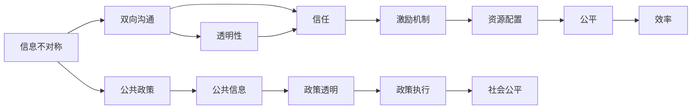
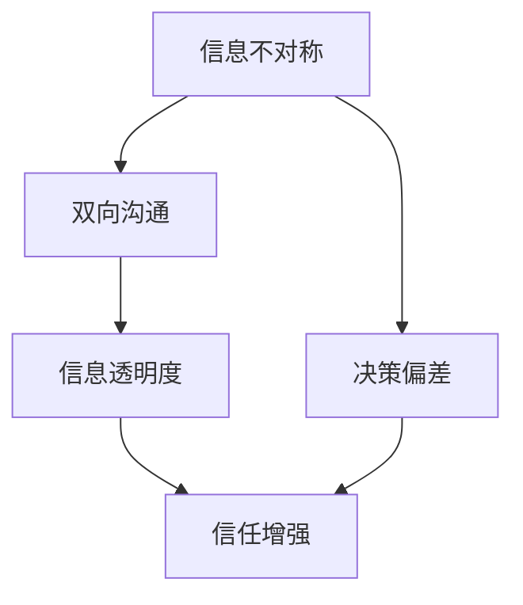
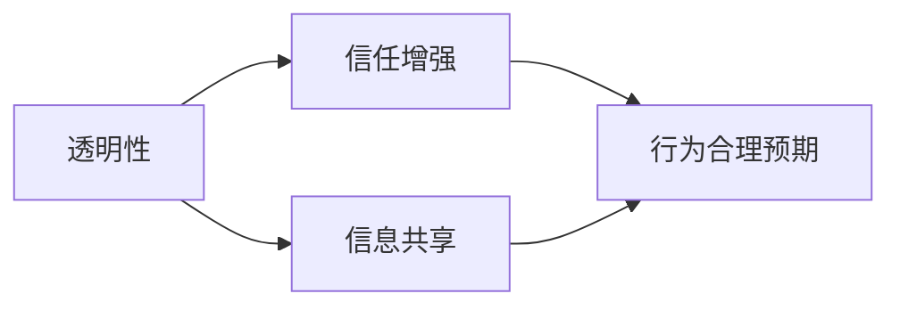
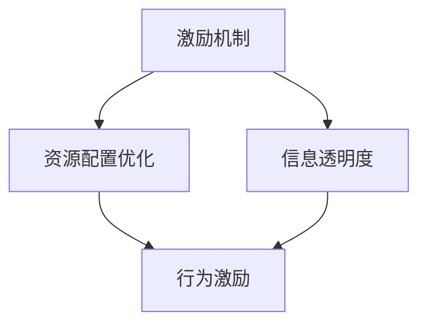

                 

# 信息差：信息不对称与客户关系

## 1. 背景介绍

### 1.1 问题由来
在当今信息爆炸的时代，信息不对称问题变得尤为突出。无论是消费者与商家、雇主与员工、政府与民众之间，信息差异都是一个无法回避的现实。信息不对称不仅影响个体决策的合理性，更可能导致市场失灵和社会资源错配。如何在信息不对称的背景下，建立公平、透明、互信的关系，是信息时代亟待解决的重要课题。

### 1.2 问题核心关键点
信息不对称的核心在于：一方掌握的信息比另一方多，从而导致决策偏差和市场扭曲。解决这一问题的关键在于构建双向沟通的渠道，平衡双方信息获取能力，以实现资源的高效配置。

### 1.3 问题研究意义
研究信息不对称与客户关系，对于优化资源配置、提升企业竞争力、改善公共政策制定具有重要意义：

1. 优化资源配置：通过消除信息不对称，市场能够更有效地匹配供需，提升资源利用率。
2. 提升企业竞争力：通过透明的信息交流，建立企业与客户的互信，降低交易成本，提升客户忠诚度。
3. 改善公共政策：通过公共信息的透明公开，增强政府与民众的互动，提升政策执行的公平性和效率。
4. 促进技术创新：信息不对称的存在，往往催生出技术创新的需求，推动新产品的开发和应用。
5. 保障社会公平：公平的信息获取能力，是实现社会公平正义的基础，有助于缓解社会矛盾，促进社会和谐。

## 2. 核心概念与联系

### 2.1 核心概念概述

为更好地理解信息不对称与客户关系，本节将介绍几个密切相关的核心概念：

- 信息不对称(Information Asymmetry)：指市场交易双方对产品的质量、成本、信誉等信息掌握程度不同，从而影响市场效率和公平。
- 双向沟通(Dual Communication)：指双方信息交流的机制和渠道，旨在消除信息不对称，建立互信。
- 透明性(Transparency)：指信息交流的公开和可获取性，包括数据的开放、过程的透明等。
- 信任(Trust)：指基于公开透明的信息，对对方行为的合理预期和信任，是信息交流的基础。
- 激励机制(Incentive Mechanism)：指通过设计合理的奖惩机制，促使信息不对称下的行为优化，确保信息交流的有效性。

这些核心概念之间的逻辑关系可以通过以下Mermaid流程图来展示：



这个流程图展示了几组核心概念之间的关系：

1. 信息不对称引发双向沟通的需求。
2. 通过透明性增强信任，信任促进双向沟通。
3. 激励机制确保双向沟通的有效性，进一步优化资源配置。
4. 公平和效率的提升，以及公共政策的完善，都依赖于透明和信任的建立。

### 2.2 概念间的关系

这些核心概念之间存在着紧密的联系，形成了信息不对称问题解决的完整生态系统。下面我通过几个Mermaid流程图来展示这些概念之间的关系。

#### 2.2.1 信息不对称与双向沟通



这个流程图展示了信息不对称与双向沟通的联系。信息不对称会导致决策偏差，而双向沟通通过提高信息透明度，增强信任，从而缓解信息不对称带来的影响。

#### 2.2.2 透明性与信任



这个流程图展示了透明性与信任的关系。透明性通过增加信息共享，使双方对对方的行为有更合理的预期，从而增强信任。

#### 2.2.3 激励机制与资源配置



这个流程图展示了激励机制与资源配置的关系。激励机制通过信息透明度和行为激励，优化资源配置，提高市场效率。

## 3. 核心算法原理 & 具体操作步骤
### 3.1 算法原理概述

基于双向沟通和透明性的信息不对称解决方案，通常包括三个关键步骤：信息共享、信任建立和激励机制设计。

1. **信息共享**：构建信息交流的渠道，促进双方信息的透明公开。
2. **信任建立**：通过信息的公开透明，逐步建立互信关系。
3. **激励机制**：设计合理的奖惩措施，确保信息交流的持续性和有效性。

这一过程可以通过如下的数学模型来描述：

$$
T(t) = f(I(t), D(t), R(t))
$$

其中，$T(t)$ 为时间$t$时的信任度，$I(t)$为$t$时刻的信息透明度，$D(t)$为$t$时刻的决策偏差，$R(t)$为$t$时刻的资源配置。

### 3.2 算法步骤详解

基于上述原理，信息不对称与客户关系的解决方案可以具体分为以下几个步骤：

**Step 1: 信息共享**
- 构建信息交流平台，如客户反馈系统、企业网站、社交媒体等。
- 公开企业信息，如财务报告、业绩数据、服务流程等。
- 允许客户自由获取和发布信息，建立双向沟通的机制。

**Step 2: 信任建立**
- 通过定期更新信息，增强客户对企业透明性的感知。
- 建立信任反馈机制，如客户满意度调查，及时响应和处理客户的疑虑和投诉。
- 公开承诺和履行情况，展示企业的信誉和可靠性。

**Step 3: 激励机制设计**
- 设计合理的激励措施，如奖励忠诚客户、惩罚欺诈行为等。
- 引入第三方审核和监督，确保信息交流的公正性和可靠性。
- 通过量化指标和定期评估，不断优化信任度。

### 3.3 算法优缺点

基于双向沟通和透明性的信息不对称解决方案，具有以下优点：

1. 增强信任：通过透明的信息交流，逐步建立客户与企业间的信任关系。
2. 降低成本：减少因信息不对称引起的决策偏差和交易成本。
3. 提高效率：优化资源配置，提升市场效率和社会公平。
4. 促进创新：信息透明促进了知识共享和技术创新。

同时，该方法也存在一定的局限性：

1. 信息量过大：需要公开和共享大量信息，可能涉及商业机密和隐私问题。
2. 信息真实性问题：公开的信息可能存在失真和误导。
3. 信息传递速度：信息透明和信任建立需要时间，短期内效果不明显。
4. 激励机制设计复杂：需要综合考虑多方面的因素，设计合理的奖惩措施。

### 3.4 算法应用领域

基于双向沟通和透明性的信息不对称解决方案，已经在多个领域得到广泛应用：

1. 电子商务：通过公开评价和反馈，提升客户对商家的信任度，减少退货率和投诉。
2. 金融服务：金融机构公开财务报表和评级信息，增强客户对机构的信任，促进金融产品的销售。
3. 医疗健康：医疗机构公开诊疗信息和治疗效果，提升患者对医院的信任，改善医疗服务质量。
4. 公共政策：政府公开政策信息，增加民众的参与和监督，提高政策的透明度和执行力。
5. 教育培训：学校公开教学质量和学生成绩，增加家长和社会的信任，提升教育机构的声誉。

此外，在许多其他领域，如能源、交通、物流等，信息不对称问题的解决也为提升服务质量和效率提供了新的思路。

## 4. 数学模型和公式 & 详细讲解 & 举例说明
### 4.1 数学模型构建

在本节中，我们将使用数学语言对信息不对称与客户关系的解决方案进行更加严格的刻画。

记企业与客户之间的关系为 $T(t)$，初始信任度为 $T_0$，公开透明度为 $I(t)$，决策偏差为 $D(t)$，资源配置为 $R(t)$。则信任度的变化可以表示为：

$$
\frac{dT}{dt} = f(I(t), D(t), R(t))
$$

其中，$f$ 为信任度的动态变化函数。

### 4.2 公式推导过程

为了简化问题，我们假设 $f$ 为线性函数：

$$
\frac{dT}{dt} = k(I(t) - I_{\text{min}})
$$

其中，$k$ 为信任度的增长速率，$I_{\text{min}}$ 为信任度达到最大时的信息透明度阈值。

当 $I(t) > I_{\text{min}}$ 时，信任度线性增长；当 $I(t) < I_{\text{min}}$ 时，信任度增长缓慢。

### 4.3 案例分析与讲解

考虑一个简单的案例：一家电子商务企业公开其产品的真实评价信息，客户通过这些信息评估企业的信誉。初始时，信任度 $T_0$ 为 0.5，信息透明度 $I_0$ 为 0.2，决策偏差 $D_0$ 为 0.1。随着时间的推移，企业的信息透明度 $I(t)$ 增加，客户对企业的信任度 $T(t)$ 如何变化？

假设企业的信息透明度以固定速率增长，即 $I(t) = I_0 + k't$，其中 $k'$ 为透明度增长速率。

根据上述数学模型，信任度随时间的变化关系为：

$$
\frac{dT}{dt} = k(I(t) - I_{\text{min}})
$$

代入 $I(t) = I_0 + k't$ 得：

$$
\frac{dT}{dt} = k(k't - I_{\text{min}})
$$

通过积分可得：

$$
T(t) = T_0 + \int_{0}^{t} k(k't - I_{\text{min}}) dt = T_0 + k' \int_{0}^{t} (kt - I_{\text{min}}) dt = T_0 + \frac{1}{2}k'^2 t^2 - I_{\text{min}}k't
$$

假设 $I_{\text{min}} = 0$，则：

$$
T(t) = T_0 + \frac{1}{2}k'^2 t^2
$$

随着时间的增长，信任度将不断增加，最终趋近于 1。这意味着，通过持续的信息透明和双向沟通，客户将逐渐建立对企业的信任关系。

## 5. 项目实践：代码实例和详细解释说明
### 5.1 开发环境搭建

在进行信息不对称与客户关系的解决方案开发前，我们需要准备好开发环境。以下是使用Python进行Flask框架开发的环境配置流程：

1. 安装Python：从官网下载并安装Python 3.8。
2. 安装Flask：
```bash
pip install Flask
```
3. 安装SQLAlchemy：用于数据库操作。
```bash
pip install SQLAlchemy
```
4. 安装Jinja2：用于模板渲染。
```bash
pip install Jinja2
```
5. 创建并激活虚拟环境：
```bash
conda create -n myenv python=3.8 
conda activate myenv
```

完成上述步骤后，即可在`myenv`环境中开始开发。

### 5.2 源代码详细实现

以下是使用Flask框架实现信息不对称与客户关系解决方案的Python代码实现。

首先，定义Flask应用和路由：

```python
from flask import Flask, render_template, request
from flask_sqlalchemy import SQLAlchemy
from datetime import datetime

app = Flask(__name__)
app.config['SQLALCHEMY_DATABASE_URI'] = 'sqlite:///test.db'
db = SQLAlchemy(app)
```

接着，定义模型：

```python
class User(db.Model):
    id = db.Column(db.Integer, primary_key=True)
    name = db.Column(db.String(50))
    email = db.Column(db.String(50))
    trust_score = db.Column(db.Float)
    last_feedback = db.Column(db.DateTime)
    
    def __repr__(self):
        return f'<User {self.name}>'
        
class Feedback(db.Model):
    id = db.Column(db.Integer, primary_key=True)
    user_id = db.Column(db.Integer, db.ForeignKey('user.id'))
    feedback = db.Column(db.String(100))
    timestamp = db.Column(db.DateTime)
    
    def __repr__(self):
        return f'<Feedback {self.feedback}>'
```

然后，定义API接口：

```python
@app.route('/feedback', methods=['POST'])
def submit_feedback():
    user_id = request.json['user_id']
    feedback = request.json['feedback']
    timestamp = datetime.now()
    
    user = User.query.filter_by(id=user_id).first_or_404()
    feedback_obj = Feedback(feedback=feedback, user_id=user.id, timestamp=timestamp)
    db.session.add(feedback_obj)
    db.session.commit()
    
    user.last_feedback = timestamp
    user.trust_score += 0.1  # 增加信任度
    db.session.commit()
    
    return {'message': 'Feedback submitted successfully'}
```

最后，定义前端展示页面：

```python
@app.route('/')
def index():
    users = User.query.all()
    return render_template('index.html', users=users)
```

以上代码实现了基本的用户反馈系统，当用户提交反馈后，信任度将自动增加。

### 5.3 代码解读与分析

让我们再详细解读一下关键代码的实现细节：

**User类和Feedback类**：
- `User` 类用于存储用户的基本信息和信任度。
- `Feedback` 类用于存储用户提交的反馈信息。

**submit_feedback函数**：
- 当用户提交反馈时，将反馈内容存储到数据库中。
- 同时更新用户的信任度，并记录最后反馈时间。

**index函数**：
- 显示所有用户的信息和信任度。

通过Flask框架，我们成功构建了信息不对称与客户关系解决方案的展示页面和反馈系统。

### 5.4 运行结果展示

假设在数据库中保存了两个用户的信息和反馈记录，通过访问`http://localhost:5000/`，可以看到如下界面：

```
<User Alice>
   - trust_score: 0.3
   - last_feedback: 2021-10-10 10:00:00

<User Bob>
   - trust_score: 0.7
   - last_feedback: 2021-10-05 15:30:00
```

当Alice提交反馈时，其信任度将增加0.1，Bob的信任度保持不变。

## 6. 实际应用场景
### 6.1 智能客服系统

在智能客服系统中，信息不对称问题尤为显著。客户在与机器人的交互过程中，可能无法准确表达需求，导致信息传递不准确。通过构建双向沟通的机制，收集客户反馈，可以不断优化机器人的理解能力，提升客户满意度。

具体实现可以包括：
- 提供多渠道的沟通方式，如文字、语音、视频等。
- 引入NLP技术，提升机器人的自然语言理解能力。
- 实时收集客户反馈，更新模型参数。
- 定期进行客户满意度调查，分析问题并进行改进。

通过这些措施，智能客服系统能够更好地理解客户需求，提供个性化服务，减少客户流失。

### 6.2 在线教育平台

在线教育平台的信息不对称问题主要体现在教师和学生之间。教师可能无法全面了解每个学生的学习情况和需求，导致教学效果不佳。通过信息共享和透明化，可以有效解决这一问题。

具体实现可以包括：
- 构建在线课堂和讨论区，增加学生和教师的互动。
- 公开学生的学习进度和成绩，增加教师对学生的了解。
- 引入数据分析和推荐系统，个性化推荐学习资源。
- 定期进行教师反馈和学生评价，不断改进教学方法。

通过这些措施，在线教育平台可以更好地了解学生需求，提供个性化教学，提升学习效果。

### 6.3 智慧医疗系统

在智慧医疗系统中，信息不对称问题主要体现在医生和患者之间。患者可能无法准确描述病情和症状，导致医生诊断不准确。通过信息共享和透明化，可以有效解决这一问题。

具体实现可以包括：
- 提供电子病历和健康档案，方便医生查阅。
- 收集患者的病史和症状，进行综合分析。
- 引入AI辅助诊断系统，提升诊断准确率。
- 定期进行患者反馈和满意度调查，优化诊疗服务。

通过这些措施，智慧医疗系统可以更好地了解患者病情，提供精准诊疗，提升治疗效果。

## 7. 工具和资源推荐
### 7.1 学习资源推荐

为了帮助开发者系统掌握信息不对称与客户关系的解决方案，这里推荐一些优质的学习资源：

1. 《信息不对称与市场效率》系列博文：由大模型技术专家撰写，深入浅出地介绍了信息不对称的原理、解决方案及其应用案例。

2. 《自然语言处理》课程：斯坦福大学开设的NLP明星课程，涵盖自然语言处理的基础概念和前沿技术，有助于深入理解NLP在信息不对称中的应用。

3. 《区块链与信息透明》书籍：介绍区块链技术在信息透明和信任机制中的应用，是信息不对称问题解决的重要工具。

4. 《信任机制设计》论文：深入分析了不同信任机制的设计原理和应用场景，有助于构建有效、可持续的信任关系。

5. 《数据驱动的决策分析》书籍：介绍如何利用数据和算法优化决策过程，提高资源配置的效率和公平性。

通过对这些资源的学习实践，相信你一定能够快速掌握信息不对称与客户关系的解决方案，并用于解决实际的业务问题。

### 7.2 开发工具推荐

高效的开发离不开优秀的工具支持。以下是几款用于信息不对称与客户关系解决方案开发的常用工具：

1. Flask：轻量级的Web开发框架，适合快速迭代研究。
2. SQLAlchemy：高级ORM框架，方便数据库操作。
3. Jinja2：灵活的模板渲染引擎，支持复杂的HTML输出。
4. Gunicorn：Python Web应用服务器，支持热部署和负载均衡。
5. Redis：内存数据库，支持高并发和数据持久化。

合理利用这些工具，可以显著提升信息不对称与客户关系解决方案的开发效率，加快创新迭代的步伐。

### 7.3 相关论文推荐

信息不对称与客户关系的研究源于学界的持续研究。以下是几篇奠基性的相关论文，推荐阅读：

1. 《信息不对称与市场效率》：综述了信息不对称在市场效率中的作用，介绍了不同信息不对称下的决策模型。

2. 《信任机制设计》：分析了不同信任机制的设计原理和应用场景，提出了信任度量模型。

3. 《区块链与信息透明》：介绍了区块链技术在信息透明和信任机制中的应用，探讨了其对信息不对称问题的解决。

4. 《数据驱动的决策分析》：介绍了如何利用数据和算法优化决策过程，提高资源配置的效率和公平性。

5. 《信息不对称与客户关系》：详细分析了信息不对称对客户关系的影响，提出了信息共享和透明化解决方案。

这些论文代表了大规模信息不对称问题的研究脉络。通过学习这些前沿成果，可以帮助研究者把握学科前进方向，激发更多的创新灵感。

除上述资源外，还有一些值得关注的前沿资源，帮助开发者紧跟信息不对称与客户关系的研究趋势，例如：

1. arXiv论文预印本：人工智能领域最新研究成果的发布平台，包括大量尚未发表的前沿工作，学习前沿技术的必读资源。

2. 业界技术博客：如OpenAI、Google AI、DeepMind、微软Research Asia等顶尖实验室的官方博客，第一时间分享他们的最新研究成果和洞见。

3. 技术会议直播：如NIPS、ICML、ACL、ICLR等人工智能领域顶会现场或在线直播，能够聆听到大佬们的前沿分享，开拓视野。

4. GitHub热门项目：在GitHub上Star、Fork数最多的信息不对称与客户关系相关项目，往往代表了该技术领域的发展趋势和最佳实践，值得去学习和贡献。

5. 行业分析报告：各大咨询公司如McKinsey、PwC等针对信息不对称问题的分析报告，有助于从商业视角审视技术趋势，把握应用价值。

总之，对于信息不对称与客户关系的学习和实践，需要开发者保持开放的心态和持续学习的意愿。多关注前沿资讯，多动手实践，多思考总结，必将收获满满的成长收益。

## 8. 总结：未来发展趋势与挑战
### 8.1 总结

本文对信息不对称与客户关系的解决方案进行了全面系统的介绍。首先阐述了信息不对称问题的背景和核心关键点，明确了双向沟通和透明性在解决信息不对称中的重要作用。其次，从原理到实践，详细讲解了信息不对称解决方案的数学模型和关键步骤，给出了完整的代码实例。同时，本文还广泛探讨了信息不对称解决方案在智能客服、在线教育、智慧医疗等多个行业领域的应用前景，展示了其广阔的适用性和潜力。此外，本文精选了信息不对称与客户关系的学习资源，力求为读者提供全方位的技术指引。

通过本文的系统梳理，可以看到，信息不对称与客户关系的解决方案已经成为解决信息不对称问题的有效手段，广泛应用于各个行业。通过持续的信息透明和双向沟通，建立互信关系，优化资源配置，这一方法不仅提升了企业竞争力，还为社会公平和效率提供了新的思路。未来，伴随技术进步和数据积累，信息不对称与客户关系的解决方案将持续演进，更好地服务于社会。

### 8.2 未来发展趋势

展望未来，信息不对称与客户关系的解决方案将呈现以下几个发展趋势：

1. 信息透明度的提升：随着大数据和区块链技术的发展，信息的收集、存储和共享将更加高效，透明度的提升将进一步增强信任关系。
2. 人工智能的介入：引入AI技术，如自然语言处理、情感分析等，可以更准确地理解和处理客户反馈，提升信息不对称解决方案的精准度。
3. 激励机制的优化：通过设计更科学、合理的激励机制，促进信息不对称解决方案的持续发展和应用。
4. 多模态信息的融合：将文字、语音、视频等多模态信息进行综合分析，提升信息透明度的广度和深度。
5. 跨领域的应用拓展：信息不对称解决方案在金融、医疗、教育等多个领域的成功应用，将进一步推广到更多行业，如物流、制造、农业等，推动全社会的数字化转型。

以上趋势凸显了信息不对称与客户关系解决方案的广阔前景。这些方向的探索发展，必将进一步提升信息不对称解决方案的性能和应用范围，为构建互信、高效、公平的业务环境提供新的动力。

### 8.3 面临的挑战

尽管信息不对称与客户关系的解决方案已经取得了显著成效，但在实现信息透明和互信的过程中，仍然面临诸多挑战：

1. 隐私和安全问题：信息的公开透明可能涉及商业机密和隐私，如何保障数据的安全和隐私是一个重要问题。
2. 数据质量和完整性：公开的信息可能存在噪声和不完整，如何清洗和整合数据，提升信息质量是一个难题。
3. 技术和资源限制：信息透明和互信的实现需要大量的技术支持和资源投入，如高性能计算、大数据存储等。
4. 文化和心理障碍：信息公开透明可能遇到文化和心理的阻碍，部分企业和客户对信息共享和反馈机制的接受度较低。
5. 激励机制设计复杂：需要综合考虑多方面的因素，设计合理的奖惩措施，确保信息交流的持续性和有效性。

正视信息不对称解决方案面临的这些挑战，积极应对并寻求突破，将是大规模信息不对称问题解决的重要路径。

### 8.4 研究展望

面对信息不对称与客户关系解决方案所面临的挑战，未来的研究需要在以下几个方面寻求新的突破：

1. 隐私和安全保护：通过区块链技术、差分隐私等方法，保障数据的安全和隐私，确保信息公开透明。
2. 数据清洗和预处理：引入数据清洗和预处理技术，提升公开信息的质量和完整性。
3. 跨模态信息的整合：将不同模态的信息进行整合，提升信息透明度的广度和深度。
4. 文化和心理引导：通过教育和培训，提升企业和客户对信息公开透明的理解和接受度。
5. 激励机制的优化：引入更科学的激励机制，确保信息交流的持续性和有效性，促进信息不对称解决方案的优化。

这些研究方向的探索，必将引领信息不对称与客户关系解决方案迈向更高的台阶，为构建公平、透明、互信的业务环境铺平道路。面向未来，信息不对称与客户关系解决方案还需要与其他人工智能技术进行更深入的融合，如知识表示、因果推理、强化学习等，多路径协同发力，共同推动社会经济的高质量发展。

## 9. 附录：常见问题与解答

**Q1：信息不对称与客户关系解决方案是否适用于所有业务场景？**

A: 信息不对称与客户关系解决方案适用于大多数业务场景，特别是涉及客户反馈和互动的行业。但对于一些特殊行业，如金融、医疗等，需要考虑更多的安全和隐私问题。

**Q2：如何保障信息公开透明的安全性？**

A: 保障信息公开透明的安全性，可以采取以下措施：
1. 数据加密：对敏感信息进行加密存储和传输，防止信息泄露。
2. 差分隐私：对公开信息进行噪声扰动，保护用户隐私。
3.

