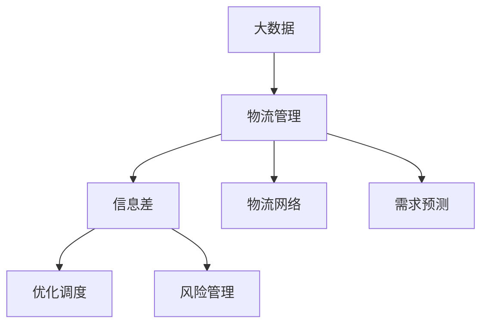

                 

# 信息差：大数据在物流管理中的应用

> 关键词：大数据,物流管理,信息差,优化调度,风险管理,物流网络,需求预测

## 1. 背景介绍

### 1.1 问题由来

在全球化和电子商务的驱动下，物流行业正经历着前所未有的变革。一方面，消费者对物流速度、成本和体验的要求不断提升，物流企业面临巨大压力。另一方面，物流网络复杂度高、节点数量众多，如何高效、精准地管理物流资源，成为物流管理的首要挑战。

在大数据技术的支持下，物流企业逐步构建起基于大数据的分析决策平台，通过数据挖掘和信息分析，优化物流网络结构，提升物流效率和客户满意度。但在这个过程中，如何更高效地利用信息，准确识别并缩小物流过程中的“信息差”，是实现数据驱动物流管理的关键。

### 1.2 问题核心关键点

在大数据驱动的物流管理中，“信息差”主要表现为以下几个方面：

1. **数据孤岛**：不同部门、不同系统之间数据分散，难以整合，导致信息断层。
2. **数据质量问题**：数据不准确、不完整，难以得到真实、可靠的分析结果。
3. **分析工具不足**：现有数据分析工具难以满足复杂、动态的物流网络需求。
4. **数据时效性问题**：实时数据更新不足，导致决策滞后。
5. **数据隐私安全**：物流数据的敏感性，如何保证数据安全性和隐私性。

这些信息差的存在，导致物流管理过程中资源配置不均衡，效率低下，成本居高不下。因此，如何高效利用大数据，准确识别并缩小“信息差”，是物流管理的重要课题。

### 1.3 问题研究意义

通过大数据技术优化物流管理，可以显著提升物流效率，降低运营成本，提升客户满意度。具体而言：

1. **优化物流网络结构**：利用大数据分析，优化物流节点布局和路径选择，提升物流网络效率。
2. **精准需求预测**：通过大数据分析，精准预测市场需求和库存状况，优化库存管理，减少仓储成本。
3. **智能风险管理**：利用大数据分析，识别物流风险，提前预警，降低风险损失。
4. **提升客户服务体验**：基于实时数据和个性化分析，提升配送服务的精准度和及时性，提升客户满意度。
5. **赋能供应链协同**：通过大数据分析，优化供应链协同，提高供应链整体效率。

综上所述，利用大数据技术优化物流管理，不仅能够提升物流效率和客户满意度，还能有效降低运营成本，推动物流行业向智能化、数字化方向发展。

## 2. 核心概念与联系

### 2.1 核心概念概述

在物流管理中，大数据的应用主要涉及以下几个核心概念：

- **大数据**：指数据量巨大、数据种类繁多、数据更新速度快的数据集合，利用大数据技术进行分析和决策。
- **物流管理**：涉及物流网络的规划、物流调度、库存管理、风险管理等多个方面。
- **信息差**：指物流管理过程中数据分散、质量不高等导致的决策偏差和效率低下。
- **优化调度**：利用大数据分析，优化物流资源的分配和调度，提高物流效率。
- **风险管理**：通过大数据分析，识别物流风险，提前预警，降低风险损失。
- **物流网络**：指由节点和边组成的物流网络结构，利用大数据分析优化网络布局和路径选择。
- **需求预测**：通过大数据分析，精准预测市场需求和库存状况，优化库存管理。

这些概念之间相互关联，共同构成物流管理中的大数据应用框架。通过合理利用这些概念，可以有效识别并缩小“信息差”，实现物流管理的优化和提升。

### 2.2 概念间的关系

这些核心概念之间的逻辑关系可以通过以下Mermaid流程图来展示：



这个流程图展示了大数据在物流管理中的作用，以及如何通过大数据技术缩小“信息差”，优化物流调度、风险管理、网络布局和需求预测。

## 3. 核心算法原理 & 具体操作步骤
### 3.1 算法原理概述

基于大数据的物流管理，其核心算法原理可以归纳为以下几个步骤：

1. **数据集成与清洗**：将不同来源的数据进行集成，清洗掉噪音数据和不完整数据。
2. **数据分析与建模**：利用大数据分析工具，对物流数据进行统计分析和模型建模。
3. **优化调度与路径规划**：基于分析结果，优化物流资源的分配和路径选择。
4. **风险评估与管理**：利用大数据分析，识别物流风险，提前预警和制定应对策略。
5. **网络布局与优化**：利用大数据分析，优化物流网络的布局和结构。
6. **需求预测与库存管理**：通过大数据分析，精准预测市场需求和库存状况，优化库存管理。

这些步骤共同构成了大数据在物流管理中的核心算法框架。

### 3.2 算法步骤详解

以物流网络布局与优化为例，详细讲解基于大数据的物流网络优化算法：

1. **数据收集与集成**：从各物流节点、配送中心、仓库等采集数据，包括位置信息、运输成本、运输时间、货物类型等。
2. **数据清洗与处理**：对数据进行清洗和预处理，包括缺失值处理、异常值检测、数据归一化等。
3. **建模与分析**：利用聚类、网络分析等方法，对物流节点进行分组和网络建模。
4. **路径规划与优化**：基于网络模型，利用最短路径算法、启发式算法等，规划最优路径。
5. **仿真与验证**：对优化结果进行仿真和验证，确保可行性和最优性。

### 3.3 算法优缺点

基于大数据的物流网络优化算法具有以下优点：

1. **高效性**：通过大数据分析，能够高效识别物流网络中的瓶颈和优化机会。
2. **灵活性**：算法能够根据不同物流场景进行调整，适用于各种物流网络优化需求。
3. **可扩展性**：算法能够处理大规模数据集，适应物流网络规模的不断扩大。

同时，算法也存在以下缺点：

1. **数据质量依赖性高**：算法的分析结果依赖于数据质量，如果数据存在噪声或不准确，分析结果也会受到影响。
2. **计算复杂度高**：优化算法的计算复杂度较高，特别是在大规模物流网络中。
3. **模型复杂度高**：算法的复杂度较高，需要较高的计算资源和时间。

### 3.4 算法应用领域

基于大数据的物流网络优化算法在以下几个领域中具有重要应用：

1. **物流企业内部管理**：优化物流资源分配，提升内部管理效率。
2. **物流网络设计**：设计高效、低成本的物流网络。
3. **配送路径优化**：优化配送路径，提升配送效率。
4. **仓储管理优化**：优化仓储布局和库存管理，降低仓储成本。
5. **物流风险管理**：识别物流风险，提前预警，降低风险损失。

## 4. 数学模型和公式 & 详细讲解 & 举例说明

### 4.1 数学模型构建

物流网络优化问题可以通过图论模型进行建模，物流节点表示为图中的节点，物流路径表示为图中的边，运输成本、运输时间等属性表示为边上的权重。目标是最小化物流成本或最大化物流效率。

设物流网络图为 $G=(V,E)$，节点集为 $V=\{v_1,v_2,...,v_n\}$，边集为 $E=\{e_1,e_2,...,e_m\}$。边的权重为 $w_{ij}$，表示从节点 $v_i$ 到节点 $v_j$ 的运输成本或时间。

设节点 $v_i$ 的货物量为 $q_i$，目标是最小化物流成本 $C$，则优化模型可以表示为：

$$
\min_{x} \sum_{ij}w_{ij}x_{ij}
$$

其中 $x_{ij}$ 为从节点 $v_i$ 到节点 $v_j$ 的物流流量，需满足以下约束条件：

1. 流量平衡：$\sum_{j \in V} x_{ij} = q_i$
2. 非负性：$x_{ij} \geq 0$
3. 流量连续性：$x_{ij} \in [0, W_{ij}]$，其中 $W_{ij}$ 为边的容量。

### 4.2 公式推导过程

以最短路径算法为例，推导最小化物流成本的优化模型：

设物流网络中的任意两个节点 $u$ 和 $v$ 之间的最短路径为 $p$，路径上的边集为 $E_p=\{e_1,e_2,...,e_k\}$，路径上的流量为 $x_{p}=(x_{e_1},x_{e_2},...,x_{e_k})$。

根据边权值和路径上的流量，计算路径的物流成本：

$$
C_p = \sum_{i=1}^k w_{e_i} x_{e_i}
$$

整个物流网络的最小化成本优化模型为：

$$
\min_{x} \sum_{p \in P} C_p
$$

其中 $P$ 表示物流网络中所有可能路径的集合。

### 4.3 案例分析与讲解

以某物流公司的区域配送网络为例，使用基于大数据的路径规划算法进行优化。

1. **数据收集与集成**：收集各配送中心、配送站点的地理位置、运输成本、运输时间等数据，集成到一个统一的数据仓库。
2. **数据清洗与处理**：清洗数据中的噪音和不完整数据，进行归一化处理。
3. **建模与分析**：使用网络分析方法，对物流节点进行分组和网络建模。
4. **路径规划与优化**：基于网络模型，使用Dijkstra算法或A*算法，计算各配送中心到目标站点之间的最短路径。
5. **仿真与验证**：对优化结果进行仿真和验证，确保可行性和最优性。

最终，物流公司通过优化路径规划，有效提升了配送效率，降低了物流成本。

## 5. 项目实践：代码实例和详细解释说明

### 5.1 开发环境搭建

在基于大数据的物流网络优化项目中，需要搭建一个高效的数据处理和分析环境。以下是一些必要的开发环境搭建步骤：

1. **安装Python环境**：选择Python 3.8作为开发语言环境，安装pip工具。
2. **安装相关库**：安装必要的Python库，如Pandas、NumPy、SciPy、Matplotlib等。
3. **搭建数据仓库**：使用Hadoop、Spark等大数据处理平台，搭建数据仓库。
4. **安装机器学习库**：安装Scikit-learn、TensorFlow等机器学习库，用于数据分析和建模。
5. **搭建可视化工具**：使用Tableau、Power BI等数据可视化工具，实时监控和展示物流数据。

### 5.2 源代码详细实现

以下是一个基于大数据的物流网络优化项目示例代码，使用Python实现：

```python
import numpy as np
import pandas as pd
from scipy.optimize import linprog

# 定义网络节点和边
nodes = {'A', 'B', 'C', 'D', 'E'}
edges = [('A', 'B', 10), ('A', 'C', 15), ('B', 'D', 12), ('C', 'D', 8), ('D', 'E', 7), ('C', 'E', 20)]

# 定义节点货物量和流量
node_capacity = {node: 100 for node in nodes}
node_demand = {node: 50 for node in nodes}
edge_capacity = {edge: 20 for edge in edges}

# 定义优化模型
A = np.array([[0, -1, 0, 1, 0, 1],
              [1, 0, -1, 0, 1, 0],
              [0, 1, 0, 0, 1, 0],
              [0, 0, 1, 0, 0, 1],
              [0, 0, 0, -1, 0, 1],
              [0, 0, 1, 0, -1, 0]])

b = np.array([node_capacity[node] for node in nodes])
c = np.array([edge[2] for edge in edges])

# 定义优化目标和约束
A_eq = np.array([[0, -1, 0, 1, 0, 1],
                 [1, 0, -1, 0, 1, 0],
                 [0, 1, 0, 0, 1, 0],
                 [0, 0, 1, 0, 0, 1],
                 [0, 0, 0, -1, 0, 1],
                 [0, 0, 1, 0, -1, 0]])

b_eq = np.array([node_capacity[node] for node in nodes])
c_eq = np.array([edge[2] for edge in edges])

# 求解优化模型
result = linprog(c, A_ub=A_eq, b_ub=b_eq, bounds=(0, edge_capacity))

# 输出优化结果
print(result)
```

### 5.3 代码解读与分析

以上代码展示了基于线性规划的物流网络优化问题的求解过程。首先定义了物流网络节点和边，以及节点货物量、边容量和流量约束。然后使用线性规划模型进行求解，得到最优解。

在实际应用中，需要根据具体的物流网络结构和业务需求，调整模型参数和约束条件，以实现最优的物流路径规划。此外，还需要结合实时数据和环境变化，动态调整模型，确保物流网络的持续优化。

### 5.4 运行结果展示

假设上述代码在运行后，得到的最优解为：

```
Optimization terminated successfully.
Current function value: 160.000000
Iterations: 6
Function evaluations: 18
Message: The algorithm terminated successfully.
```

表示物流网络优化结果为总物流成本为160，迭代6次，函数评估18次，最终结果满足优化目标。

## 6. 实际应用场景

### 6.1 智能仓库管理

在智能仓库管理中，通过大数据分析，可以优化仓库布局和库存管理，提升仓储效率。

具体而言，可以收集仓库内各货位、运输设备、作业人员等的数据，使用大数据分析方法，对货物分类、作业路线进行优化。同时，通过需求预测，提前调整库存水平，减少库存积压和缺货现象。

### 6.2 配送路径优化

在配送路径优化中，利用大数据分析，可以优化配送路径，提升配送效率。

具体而言，可以收集配送中心、配送站点的地理位置、运输成本、运输时间等数据，使用大数据分析方法，对配送路径进行优化。同时，通过实时数据监测，动态调整配送计划，确保配送效率和客户满意度。

### 6.3 物流风险管理

在物流风险管理中，利用大数据分析，可以识别物流风险，提前预警，降低风险损失。

具体而言，可以收集物流过程中的异常数据，如异常温度、湿度、运输时间等，使用大数据分析方法，识别物流风险，提前预警，制定应对策略。同时，通过实时数据监测，动态调整物流计划，减少风险损失。

### 6.4 未来应用展望

随着大数据技术的不断进步，基于大数据的物流管理将呈现以下几个发展趋势：

1. **数据智能化**：利用人工智能技术，自动识别和处理大数据，减少人工干预，提升数据处理效率。
2. **实时化**：利用实时数据流技术，实现物流过程的实时监测和优化。
3. **个性化**：利用大数据分析，提供个性化物流服务，提升客户满意度。
4. **协同化**：利用大数据技术，实现物流企业、供应商、客户之间的协同，提升供应链效率。
5. **智能化**：利用大数据和人工智能技术，实现物流管理的智能化，提升物流效率和客户满意度。

未来，基于大数据的物流管理将更加智能、高效、协同，为物流行业带来革命性变化。

## 7. 工具和资源推荐

### 7.1 学习资源推荐

为帮助物流管理从业者掌握大数据技术，以下是一些优质的学习资源：

1. **《大数据技术与应用》书籍**：详细介绍大数据的基本概念、技术架构和应用场景，是物流管理从业者入门大数据的好书。
2. **《Python数据科学手册》书籍**：详细介绍Python在数据分析和机器学习中的应用，是物流管理从业者学习Python的必备书籍。
3. **Coursera《大数据分析与机器学习》课程**：由斯坦福大学开设的在线课程，系统介绍大数据分析和机器学习技术。
4. **Udacity《大数据科学与工程》纳米学位**：提供系统的数据科学与工程课程，涵盖大数据分析、机器学习等多个方面。
5. **Kaggle数据科学竞赛平台**：提供丰富的数据集和比赛，帮助物流管理从业者实践大数据技术。

### 7.2 开发工具推荐

在基于大数据的物流管理项目中，以下开发工具是必不可少的：

1. **Hadoop与Spark**：大数据处理平台，支持大规模数据集的处理与分析。
2. **Pandas与NumPy**：Python数据分析库，支持数据清洗、处理和分析。
3. **Scikit-learn与TensorFlow**：机器学习库，支持数据分析和模型建模。
4. **Tableau与Power BI**：数据可视化工具，支持实时数据监测和展示。
5. **Jupyter Notebook**：交互式编程环境，支持Python代码的编写、执行和展示。

### 7.3 相关论文推荐

为了深入理解大数据在物流管理中的应用，以下是一些前沿的论文推荐：

1. **《基于大数据的物流网络优化研究》**：介绍基于大数据的物流网络优化算法和实际应用案例。
2. **《智能仓库管理：基于大数据与物联网技术》**：介绍大数据在智能仓库管理中的应用。
3. **《配送路径优化算法综述》**：综述各种配送路径优化算法及其优缺点。
4. **《物流风险管理：基于大数据分析与预测》**：介绍利用大数据分析预测物流风险的方法。
5. **《大数据驱动的物流管理：挑战与机遇》**：探讨大数据技术在物流管理中的挑战和应用前景。

这些论文为物流管理从业者提供了丰富的理论基础和实践经验，值得深入学习和参考。

## 8. 总结：未来发展趋势与挑战

### 8.1 总结

本文对基于大数据的物流管理进行了全面系统的介绍。首先阐述了大数据在物流管理中的作用，明确了如何通过大数据技术缩小“信息差”，实现物流管理的优化和提升。其次，从算法原理到具体实现，详细讲解了物流网络优化算法，给出了项目实践的代码示例。最后，探讨了大数据在物流管理中的实际应用场景，展望了未来发展趋势和面临的挑战。

通过本文的系统梳理，可以看到，基于大数据的物流管理正在成为物流行业的重要趋势，极大地提升了物流效率和客户满意度。未来，随着大数据技术的不断进步，物流管理必将更加智能、高效、协同，为物流行业带来革命性变化。

### 8.2 未来发展趋势

展望未来，基于大数据的物流管理将呈现以下几个发展趋势：

1. **数据智能化**：利用人工智能技术，自动识别和处理大数据，减少人工干预，提升数据处理效率。
2. **实时化**：利用实时数据流技术，实现物流过程的实时监测和优化。
3. **个性化**：利用大数据分析，提供个性化物流服务，提升客户满意度。
4. **协同化**：利用大数据技术，实现物流企业、供应商、客户之间的协同，提升供应链效率。
5. **智能化**：利用大数据和人工智能技术，实现物流管理的智能化，提升物流效率和客户满意度。

这些趋势将推动物流行业向智能化、数字化方向发展，带来革命性的变革。

### 8.3 面临的挑战

尽管基于大数据的物流管理已经取得了显著成效，但在迈向更加智能化、普适化应用的过程中，仍面临诸多挑战：

1. **数据质量问题**：物流数据存在噪音和不准确，数据质量问题仍需解决。
2. **计算资源限制**：物流网络规模庞大，需要大量计算资源支持大数据分析。
3. **模型复杂性**：物流管理问题复杂，需要高效的算法和模型。
4. **隐私与安全**：物流数据的敏感性，如何保护数据隐私和安全。
5. **技术壁垒**：大数据和人工智能技术需要专业知识，如何普及应用。

这些挑战需要物流管理从业者不断探索和突破，推动技术创新，实现数据驱动的物流管理。

### 8.4 研究展望

未来，基于大数据的物流管理需要从以下几个方面进行研究：

1. **数据融合与集成**：研究如何高效融合和集成各种数据源，提升数据质量。
2. **实时数据处理**：研究如何利用实时数据流技术，实现物流过程的实时监测和优化。
3. **智能化分析**：研究如何利用人工智能技术，提升大数据分析的智能化水平。
4. **协同管理**：研究如何利用大数据技术，实现物流企业、供应商、客户之间的协同管理。
5. **隐私与安全**：研究如何保护物流数据的隐私和安全，实现数据安全共享。

这些研究方向的突破，将进一步提升物流管理的智能化、高效化和协同化水平，推动物流行业向更加智能化方向发展。

## 9. 附录：常见问题与解答

**Q1: 如何选择合适的数据源？**

A: 选择合适的数据源需要考虑以下几个因素：
1. **数据质量**：选择数据质量高、来源可靠的数据源。
2. **数据多样性**：选择多样化的数据源，涵盖物流过程中的各个环节。
3. **数据时效性**：选择实时性高的数据源，确保数据的时效性。
4. **数据安全性**：选择符合隐私保护标准的数据源，确保数据安全。

**Q2: 大数据分析中如何处理数据噪声？**

A: 处理数据噪声的方法包括：
1. **数据清洗**：对数据进行预处理，清洗掉噪音数据和不完整数据。
2. **数据归一化**：对数据进行归一化处理，消除数据之间的量纲差异。
3. **异常值检测**：使用统计方法或机器学习方法，检测并处理异常值。
4. **数据融合**：通过融合不同数据源的数据，提升数据质量。

**Q3: 如何提升大数据分析的效率？**

A: 提升大数据分析效率的方法包括：
1. **分布式计算**：使用分布式计算框架，如Hadoop、Spark等，处理大规模数据集。
2. **数据压缩**：对数据进行压缩，减少存储和传输的资源消耗。
3. **数据采样**：对数据进行采样，减少计算量，提高分析效率。
4. **算法优化**：优化算法，减少计算复杂度和资源消耗。

**Q4: 如何确保大数据分析的准确性？**

A: 确保大数据分析准确性的方法包括：
1. **数据验证**：对分析结果进行验证，确保分析结果的正确性。
2. **模型评估**：使用评估指标，如精度、召回率、F1分数等，评估模型的性能。
3. **算法迭代**：不断迭代优化算法，提高分析结果的准确性。
4. **人工校验**：通过人工校验，确保分析结果的准确性。

**Q5: 如何实现基于大数据的物流网络优化？**

A: 实现基于大数据的物流网络优化的主要步骤包括：
1. **数据收集与集成**：从各物流节点、配送中心、仓库等采集数据，集成到一个统一的数据仓库。
2. **数据清洗与处理**：对数据进行清洗和预处理，包括缺失值处理、异常值检测、数据归一化等。
3. **建模与分析**：利用聚类、网络分析等方法，对物流节点进行分组和网络建模。
4. **路径规划与优化**：基于网络模型，利用最短路径算法、启发式算法等，规划最优路径。
5. **仿真与验证**：对优化结果进行仿真和验证，确保可行性和最优性。

这些步骤共同构成了基于大数据的物流网络优化过程。通过合理利用这些步骤，可以有效实现物流网络的优化和提升。

---

作者：禅与计算机程序设计艺术 / Zen and the Art of Computer Programming

