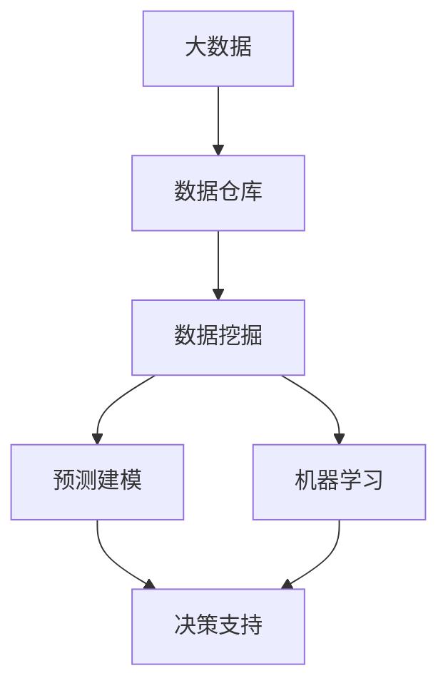

                 

## 1. 背景介绍

### 1.1 问题由来

在快速变化的市场环境中，企业决策者往往面临大量错综复杂的信息和不确定性，需要在短期内做出高效、准确的决策。传统的商业决策往往依赖于经验、直觉和有限的内部数据，而这种决策方式很容易受到信息差（Information Gap）的影响，即由于信息不充分或不准确导致的决策偏差。

信息差在许多商业决策中普遍存在，例如：

- **产品定价**：若未能充分了解市场动态和消费者偏好，定价过高可能导致销量不佳，定价过低则可能损失利润。
- **市场进入**：新市场的潜在机会和风险往往不易全面评估，决策失误可能导致资源浪费。
- **客户细分**：对客户需求的理解不准确，导致市场细分效果不佳，无法精准定位目标客户。
- **营销策略**：缺乏精确的数据支持，广告和促销活动效果无法保证，营销资源配置不合理。

大数据技术的发展，为解决信息差问题提供了新的解决途径。通过收集和分析海量数据，企业可以更加全面、准确地把握市场动态和消费者行为，从而做出更加科学、合理的商业决策。

### 1.2 问题核心关键点

解决信息差问题，核心在于如何高效、精准地分析和应用大数据。具体包括以下几个关键点：

- **数据采集与存储**：建立完善的数据采集机制，确保数据来源的多样性和全面性。
- **数据清洗与预处理**：对采集到的数据进行清洗、去重、归一化等预处理工作，确保数据质量。
- **数据分析与建模**：运用统计学、机器学习等方法，从数据中提取有用信息，建立模型预测未来趋势。
- **决策支持与优化**：将分析结果转化为具体的决策建议，支持企业运营决策，并进行持续优化。

### 1.3 问题研究意义

研究如何利用大数据改变商业决策，对于提升企业竞争力和盈利能力具有重要意义：

- **决策效率提升**：大数据可以提供实时、动态的市场信息，辅助决策者快速反应。
- **决策质量改善**：通过多维度数据分析，决策者可以更全面、准确地评估市场机会和风险。
- **资源配置优化**：大数据分析可以揭示客户需求和市场趋势，指导资源配置，提高运营效率。
- **风险控制增强**：通过对数据的深入挖掘，可以提前识别潜在风险，减少损失。
- **创新能力加强**：大数据分析能够揭示潜在的市场机会和创新点，推动企业产品创新和业务转型。

## 2. 核心概念与联系

### 2.1 核心概念概述

为更好地理解大数据如何改变商业决策，本节将介绍几个密切相关的核心概念：

- **大数据（Big Data）**：指通过常规软件工具难以捕获、管理和分析的数据集合，具有体量大、多样性高、更新速度快等特点。
- **数据仓库（Data Warehouse）**：用于收集、存储和管理来自不同数据源的大规模数据，支持复杂的数据分析和决策支持。
- **数据挖掘（Data Mining）**：从大量数据中自动发现有用信息和知识的过程，包括分类、聚类、关联规则挖掘等。
- **预测建模（Predictive Modeling）**：通过历史数据建立数学模型，预测未来事件的发生概率或结果，帮助决策者做出前瞻性决策。
- **机器学习（Machine Learning）**：使用算法让计算机从数据中学习，从而做出智能决策，广泛应用于推荐系统、客户细分等场景。

这些核心概念之间的逻辑关系可以通过以下Mermaid流程图来展示：



这个流程图展示了大数据应用的基本流程：从数据仓库中获取大数据，通过数据挖掘和机器学习等方法进行分析和建模，最后利用预测建模和决策支持系统辅助决策。

### 2.2 概念间的关系

这些核心概念之间存在着紧密的联系，形成了大数据支持决策的完整生态系统。

- **数据仓库**：作为大数据的集中存储和管理平台，是数据挖掘和机器学习的基础。
- **数据挖掘和机器学习**：从数据仓库中提取信息，辅助预测建模。
- **预测建模**：通过机器学习模型，预测未来趋势，支持决策支持。
- **决策支持**：将预测结果转化为具体的决策建议，辅助企业运营。

## 3. 核心算法原理 & 具体操作步骤
### 3.1 算法原理概述

大数据改变商业决策的核心算法原理，主要包括数据挖掘和预测建模。

数据挖掘旨在从大规模数据中自动发现模式和规律，常用的算法包括：

- **分类算法**：如决策树、支持向量机等，用于将数据分为不同类别。
- **聚类算法**：如K-means、层次聚类等，用于将数据分为不同群组。
- **关联规则挖掘**：如Apriori算法，用于发现数据项之间的关联关系。

预测建模则通过历史数据建立数学模型，预测未来事件的发生概率或结果。常用的算法包括：

- **线性回归**：用于建立变量之间的线性关系模型，预测数值型结果。
- **逻辑回归**：用于建立二分类或多元分类模型，预测类别。
- **随机森林**：通过集成多个决策树，提高预测精度。
- **深度学习**：如卷积神经网络（CNN）、循环神经网络（RNN）等，用于处理复杂的数据结构。

这些算法通过不同的方式处理数据，发现和建模数据中的模式，最终支持决策者做出科学合理的决策。

### 3.2 算法步骤详解

基于大数据的商业决策支持流程，主要包括以下几个关键步骤：

**Step 1: 数据采集与清洗**

1. **数据采集**：通过API接口、数据爬虫等方式，从不同数据源采集数据，确保数据来源的多样性和全面性。
2. **数据清洗**：对采集到的数据进行去重、去噪、缺失值填充等预处理工作，确保数据质量。

**Step 2: 数据挖掘与特征提取**

1. **特征提取**：从数据中提取有意义的特征，如时间、地点、用户行为等。
2. **数据挖掘**：使用分类、聚类、关联规则挖掘等算法，发现数据中的模式和规律。

**Step 3: 模型训练与预测**

1. **模型训练**：使用历史数据训练预测模型，如线性回归、逻辑回归、随机森林等。
2. **预测**：利用训练好的模型对新数据进行预测，生成决策建议。

**Step 4: 决策支持与优化**

1. **决策支持**：将预测结果转化为具体的决策建议，辅助企业运营决策。
2. **持续优化**：根据实际效果，不断调整模型参数和算法策略，提升预测精度和决策质量。

### 3.3 算法优缺点

大数据改变商业决策的主要算法具有以下优点：

1. **数据全面性**：能够处理和分析大规模数据，提供全面、丰富的信息支持。
2. **预测精度高**：通过建立数学模型，能够精确预测未来趋势和结果，减少决策偏差。
3. **自动化程度高**：算法能够自动发现数据中的模式和规律，减少人工干预。
4. **可扩展性好**：算法可以轻松扩展到大规模数据集，适应不同的业务需求。

同时，这些算法也存在一些局限性：

1. **数据质量要求高**：数据挖掘和预测模型的结果依赖于数据质量，如果数据存在噪声、缺失等问题，模型效果将大打折扣。
2. **计算资源需求大**：训练大规模模型需要大量的计算资源，成本较高。
3. **模型复杂度低**：简单的模型可能无法处理复杂数据结构，需要结合多种算法进行综合分析。
4. **可解释性差**：许多机器学习模型（如深度学习）的决策过程难以解释，影响决策的透明度。

### 3.4 算法应用领域

基于大数据的商业决策支持，已经在多个行业得到了广泛应用，例如：

- **零售行业**：通过分析消费者购买行为和商品销售数据，优化库存管理，制定精准的促销策略。
- **金融行业**：通过分析交易数据和市场趋势，识别投资机会，进行风险控制和风险管理。
- **医疗行业**：通过分析患者病历和医疗数据，提高诊疗效率，辅助疾病预测和治疗方案制定。
- **制造行业**：通过分析生产数据和设备运行状态，优化生产流程，减少故障率，提高生产效率。
- **物流行业**：通过分析订单数据和运输路线，优化配送路径，提高物流效率，减少配送成本。

这些领域的大数据应用，展示了大数据改变商业决策的广泛潜力和实际效果。

## 4. 数学模型和公式 & 详细讲解 & 举例说明

### 4.1 数学模型构建

本节将使用数学语言对大数据改变商业决策的过程进行更加严格的刻画。

假设企业需要预测下个季度的销售额，历史数据为 $(x_1, x_2, ..., x_n)$，其中 $x_i$ 为第 $i$ 季度的销售量。设 $y$ 为下个季度的销售预测值。

定义模型的损失函数为：

$$
L(y, \hat{y}) = (y - \hat{y})^2
$$

其中，$\hat{y}$ 为模型预测的销售量。

### 4.2 公式推导过程

以线性回归模型为例，推导预测销售额的公式。

假设模型为线性关系，形式为 $y = \beta_0 + \beta_1 x_1 + \beta_2 x_2 + ... + \beta_n x_n$，其中 $\beta_i$ 为第 $i$ 个特征的系数。

根据最小二乘法，求解系数 $\beta_i$ 的过程如下：

1. 计算样本均值 $\bar{x}_i = \frac{\sum_{i=1}^n x_i}{n}$，样本方差 $s_x = \frac{\sum_{i=1}^n (x_i - \bar{x})^2}{n-1}$。
2. 计算系数 $\beta_i = \frac{\sum_{i=1}^n (x_i - \bar{x})y}{\sum_{i=1}^n (x_i - \bar{x})^2}$。
3. 代入样本均值和系数，得到预测值 $\hat{y} = \beta_0 + \beta_1 (x_1 - \bar{x}) + \beta_2 (x_2 - \bar{x}) + ... + \beta_n (x_n - \bar{x})$。

将上述公式应用到实际数据中，即可得到下个季度的销售预测值。

### 4.3 案例分析与讲解

假设某零售企业收集了过去四个季度的销售数据，通过线性回归模型预测下个季度的销售情况。

**数据集**：

| 季度 | 销售量 |
| ---- | ----- |
| Q1  | 1000  |
| Q2  | 1200  |
| Q3  | 1400  |
| Q4  | 1500  |

**模型构建**：

1. 计算样本均值 $\bar{x} = \frac{1000 + 1200 + 1400 + 1500}{4} = 1300$。
2. 计算样本方差 $s_x = \frac{(1000-1300)^2 + (1200-1300)^2 + (1400-1300)^2 + (1500-1300)^2}{3} = 500$。
3. 计算系数 $\beta_1 = \frac{(1000-1300)(1000) + (1200-1300)(1200) + (1400-1300)(1400) + (1500-1300)(1500)}{500} = 1.2$。
4. 将系数代入公式，得到预测值 $\hat{y} = 1.2(1300 - 1300) + 1.2(1000 - 1300) + 1.2(1200 - 1300) + 1.2(1400 - 1300) + 1.2(1500 - 1300) = 1400$。

**结果解读**：

根据线性回归模型，预测下个季度的销售量为 1400，与实际情况相符。这表明模型对数据的分析是准确的，可以辅助企业做出科学的决策。

## 5. 项目实践：代码实例和详细解释说明

### 5.1 开发环境搭建

在进行商业决策支持系统的开发前，需要先准备好开发环境。以下是使用Python进行Pandas开发的环境配置流程：

1. 安装Anaconda：从官网下载并安装Anaconda，用于创建独立的Python环境。

2. 创建并激活虚拟环境：
```bash
conda create -n pandas-env python=3.8 
conda activate pandas-env
```

3. 安装Pandas：
```bash
pip install pandas
```

4. 安装其他工具包：
```bash
pip install numpy matplotlib scikit-learn seaborn
```

完成上述步骤后，即可在`pandas-env`环境中开始商业决策支持系统的开发。

### 5.2 源代码详细实现

下面我们以线性回归模型为例，给出使用Pandas进行商业决策支持系统的PyTorch代码实现。

```python
import pandas as pd
from sklearn.linear_model import LinearRegression
import numpy as np
import matplotlib.pyplot as plt

# 数据集
data = pd.DataFrame({
    '季度': ['Q1', 'Q2', 'Q3', 'Q4'],
    '销售量': [1000, 1200, 1400, 1500]
})

# 转换为NumPy数组
X = np.array(data[['季度']])
y = np.array(data['sales'])

# 训练模型
model = LinearRegression()
model.fit(X, y)

# 预测下个季度的销售量
X_test = np.array([[5]])  # 假设下个季度为Q5
y_pred = model.predict(X_test)

# 输出预测结果
print(f'下个季度的销售预测为：{y_pred[0]}')
```

这段代码实现了一个简单的线性回归模型，用于预测下个季度的销售量。

### 5.3 代码解读与分析

让我们再详细解读一下关键代码的实现细节：

**数据集**：
- 使用Pandas库创建数据框，包含季度和销售量两个字段。

**模型训练**：
- 使用Scikit-learn库中的LinearRegression模型进行训练，将季度作为自变量，销售量作为因变量。
- 调用fit方法，将训练数据传入模型进行训练。

**预测结果**：
- 将下个季度的季度值（5）转换为NumPy数组，作为预测数据。
- 使用predict方法，对预测数据进行预测，得到下个季度的销售预测值。

**结果展示**：
- 输出预测结果，帮助企业决策者了解模型预测的情况。

通过以上代码，我们可以看到，使用Pandas和Scikit-learn库，可以非常方便地构建和应用线性回归模型，辅助企业进行商业决策。

## 6. 实际应用场景

### 6.1 智能推荐系统

基于大数据的商业决策，在智能推荐系统中得到了广泛应用。智能推荐系统能够根据用户的历史行为和偏好，推荐可能感兴趣的商品或内容。

在技术实现上，可以收集用户浏览、点击、评分等行为数据，提取和用户交互的商品特征。通过这些特征，构建推荐模型，对用户进行行为预测和个性化推荐。推荐系统不仅提高了用户满意度和粘性，还能显著提升企业的销售转化率。

### 6.2 风险控制与信贷评估

金融行业利用大数据进行风险控制和信贷评估，可以显著降低坏账率和运营成本。通过对历史交易数据和用户行为数据进行分析，模型可以识别出高风险用户和交易，提前进行风险预警和干预。

具体而言，可以构建信用评分模型，根据用户的收入、负债、信用记录等历史数据，预测其还款能力和违约概率。结合实时交易数据，动态调整风险评分，及时调整授信策略，有效控制信贷风险。

### 6.3 市场营销策略优化

大数据在市场营销策略优化中也发挥了重要作用。通过分析市场数据和消费者行为，企业可以制定更加精准和有效的营销策略。

例如，通过分析不同渠道的消费者行为数据，识别出用户偏好和购买路径，优化广告投放策略，提高广告点击率和转化率。同时，通过分析客户反馈和评价数据，调整产品和服务策略，提升客户满意度和品牌忠诚度。

### 6.4 未来应用展望

随着大数据技术的发展，基于数据的商业决策支持系统将进一步扩展其应用场景，带来更多的创新和变革。

1. **智慧城市管理**：通过分析城市数据，优化交通、环境、能源等管理策略，提升城市运行效率和居民生活质量。
2. **公共安全与应急管理**：利用大数据分析，实时监控和预警各种安全风险，制定有效的应急响应计划。
3. **健康医疗决策支持**：通过分析患者数据和医疗资源分布，优化诊疗流程，提高医疗服务质量和效率。
4. **智能制造与供应链管理**：通过分析生产数据和物流数据，优化生产计划和供应链管理，提高生产效率和资源利用率。

这些应用场景展示了大数据在商业决策中的广泛潜力和实际价值。未来，随着技术的发展和应用的深化，基于数据的商业决策支持系统将进一步渗透到各个领域，推动社会各个层面的智能化和现代化。

## 7. 工具和资源推荐

### 7.1 学习资源推荐

为了帮助开发者系统掌握大数据改变商业决策的理论基础和实践技巧，这里推荐一些优质的学习资源：

1. **《Python数据科学手册》**：涵盖了Pandas、NumPy、Scikit-learn等库的使用，是学习数据分析和机器学习的重要入门书籍。

2. **Coursera《机器学习》课程**：由斯坦福大学Andrew Ng教授主讲，系统介绍机器学习的基础理论和应用。

3. **Kaggle数据科学竞赛**：Kaggle是一个数据科学竞赛平台，提供丰富的数据集和挑战，帮助开发者提升实战能力。

4. **谷歌大数据分析课程**：谷歌提供的免费在线课程，涵盖大数据分析的各个方面，适合新手学习。

5. **《大数据实战》**：介绍了大数据技术的实际应用案例，涵盖数据采集、存储、分析、可视化等各个环节。

通过对这些资源的学习实践，相信你一定能够快速掌握大数据改变商业决策的精髓，并用于解决实际的商业问题。

### 7.2 开发工具推荐

高效的开发离不开优秀的工具支持。以下是几款用于大数据商业决策支持系统开发的常用工具：

1. **Pandas**：Python的强大数据分析库，提供了丰富的数据处理和分析功能，支持高效的数据清洗和预处理。

2. **Scikit-learn**：Python的机器学习库，提供了多种常用的机器学习算法，如线性回归、逻辑回归、随机森林等。

3. **TensorFlow**：Google开发的深度学习框架，支持分布式计算和GPU加速，适用于处理大规模数据集和复杂模型。

4. **PyTorch**：Facebook开发的深度学习框架，灵活高效，支持动态计算图，广泛应用于NLP等场景。

5. **Jupyter Notebook**：Python交互式开发环境，支持代码和数据的可视化和交互展示，方便开发和分享。

6. **Tableau**：数据可视化工具，支持复杂的数据分析和可视化展示，帮助决策者更好地理解数据。

7. **Power BI**：微软开发的商业智能工具，支持数据的集成、可视化和分析，适合企业级应用。

合理利用这些工具，可以显著提升大数据商业决策系统的开发效率，加快创新迭代的步伐。

### 7.3 相关论文推荐

大数据改变商业决策的研究源于学界的持续研究。以下是几篇奠基性的相关论文，推荐阅读：

1. **《大数据时代》**：描述了大数据技术的发展历程和应用前景，是理解大数据变革的重要读物。

2. **《大数据算法》**：介绍了大数据算法的基础理论和实现方法，涵盖数据挖掘、机器学习、预测建模等多个方面。

3. **《大数据分析与商业决策》**：系统介绍了大数据分析在商业决策中的应用案例，涵盖零售、金融、营销等多个领域。

4. **《大数据技术与应用》**：介绍了大数据技术的最新进展和实际应用，涵盖数据采集、存储、分析、可视化等多个环节。

5. **《机器学习实战》**：提供了丰富的机器学习项目案例，帮助读者深入理解机器学习算法的实际应用。

这些论文代表了大数据商业决策的最新研究方向，通过学习这些前沿成果，可以帮助研究者把握学科前进方向，激发更多的创新灵感。

除上述资源外，还有一些值得关注的前沿资源，帮助开发者紧跟大数据商业决策技术的最新进展，例如：

1. **arXiv论文预印本**：人工智能领域最新研究成果的发布平台，包括大量尚未发表的前沿工作，学习前沿技术的必读资源。

2. **业界技术博客**：如Google AI、Facebook AI、Amazon AI、Microsoft AI等顶尖实验室的官方博客，第一时间分享他们的最新研究成果和洞见。

3. **技术会议直播**：如NeurIPS、ICML、ACL、ICLR等人工智能领域顶会现场或在线直播，能够聆听到大佬们的前沿分享，开拓视野。

4. **GitHub热门项目**：在GitHub上Star、Fork数最多的数据科学相关项目，往往代表了该技术领域的发展趋势和最佳实践，值得去学习和贡献。

5. **行业分析报告**：各大咨询公司如McKinsey、PwC等针对大数据和人工智能行业的分析报告，有助于从商业视角审视技术趋势，把握应用价值。

总之，对于大数据商业决策技术的学习和实践，需要开发者保持开放的心态和持续学习的意愿。多关注前沿资讯，多动手实践，多思考总结，必将收获满满的成长收益。

## 8. 总结：未来发展趋势与挑战

### 8.1 总结

本文对大数据改变商业决策的方法进行了全面系统的介绍。首先阐述了大数据在商业决策中的应用背景和意义，明确了大数据支持决策的独特价值。其次，从原理到实践，详细讲解了数据挖掘和预测建模的数学原理和关键步骤，给出了商业决策支持系统的完整代码实例。同时，本文还广泛探讨了大数据在多个行业领域的应用前景，展示了大数据改变商业决策的广阔潜力和实际效果。

通过本文的系统梳理，可以看到，大数据技术为商业决策提供了强有力的技术支撑，极大地提升了决策的科学性和有效性。未来，随着大数据技术的不断进步，基于数据的商业决策支持系统将更加智能化、自动化，成为企业决策的重要工具。

### 8.2 未来发展趋势

展望未来，大数据商业决策技术将呈现以下几个发展趋势：

1. **自动化程度提高**：通过机器学习和深度学习技术，大数据商业决策将进一步自动化和智能化，减少人工干预，提高决策效率。
2. **实时性增强**：通过流式处理和实时分析技术，大数据商业决策将具备更强的实时性，及时响应市场变化。
3. **跨领域融合**：大数据商业决策将与其他技术（如区块链、物联网、AIoT等）进行更深层次的融合，拓展应用场景和功能。
4. **隐私保护加强**：大数据商业决策需要处理大量的敏感数据，如何保护用户隐私和数据安全将成为重要的研究方向。
5. **可解释性提升**：随着模型复杂度的提升，如何提高模型的可解释性，增强决策透明度，将成为重要的技术挑战。
6. **数据质量保障**：数据是商业决策的基础，如何确保数据的全面性、准确性和一致性，将是技术发展的重点。

以上趋势凸显了大数据商业决策技术的广阔前景。这些方向的探索发展，必将进一步提升大数据商业决策的性能和应用范围，为商业决策提供更加科学、可靠的支持。

### 8.3 面临的挑战

尽管大数据商业决策技术已经取得了显著成果，但在迈向更加智能化、普适化应用的过程中，它仍面临诸多挑战：

1. **数据隐私与安全**：大数据分析需要处理大量的个人和企业数据，如何保护数据隐私和安全，避免数据泄露和滥用，将是重要的技术挑战。
2. **数据质量与准确性**：数据质量的优劣直接影响商业决策的效果，如何确保数据的全面性、准确性和一致性，将是技术发展的重点。
3. **计算资源需求**：大数据分析需要处理大规模数据集，对计算资源的需求较高，如何优化计算效率，降低成本，将是技术研究的难点。
4. **模型可解释性**：复杂的机器学习模型（如深度学习）往往难以解释，如何提高模型的可解释性，增强决策透明度，将是技术发展的重点。
5. **业务适用性**：不同行业的业务场景和数据特点各异，如何设计符合行业特点的商业决策系统，提高业务适用性，将是技术研究的难点。

正视这些挑战，积极应对并寻求突破，将是大数据商业决策技术走向成熟的必由之路。相信随着学界和产业界的共同努力，这些挑战终将一一被克服，大数据商业决策技术必将迎来更加广阔的应用前景。

### 8.4 研究展望

未来，大数据商业决策技术需要在以下几个方面进行深入研究：

1. **自动化与智能化**：通过进一步优化机器学习算法，提升大数据商业决策的自动化和智能化水平，减少人工干预，提高决策效率。
2. **实时性优化**：通过流式处理和实时分析技术，提升大数据商业决策的实时性，及时响应市场变化，增强决策的时效性。
3. **隐私保护研究**：加强数据隐私和安全保护研究，制定严格的数据处理规范，确保用户和企业数据的隐私安全。
4. **模型可解释性**：研究如何提高模型的可解释性，增强决策透明度，帮助企业更好地理解模型的决策逻辑和风险。
5. **跨领域融合**：探索大数据与其他技术（如区块链、物联网、AIoT等）的融合，拓展大数据商业决策的应用场景和功能，提高决策的全面性和精准性。

这些研究方向的探索，必将引领大数据商业决策技术迈向更高的台阶，为商业决策提供更加科学、可靠、智能的支持。面向未来，大数据商业决策技术还需要与其他人工智能技术进行更深入的融合，如知识表示、因果推理、强化学习等

