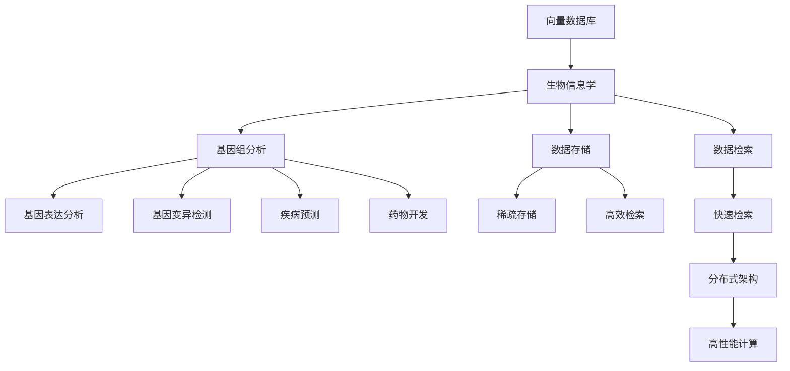

                 

# 利用向量数据库加速生物信息数据分析

> 关键词：向量数据库,生物信息学,基因组分析,数据存储,数据检索,高性能计算

## 1. 背景介绍

### 1.1 问题由来
生物信息学作为交叉学科，涉及生物学、计算机科学、统计学等多个领域，是研究生物大分子（如DNA、RNA和蛋白质）的信息结构和功能的科学。在过去几十年中，随着基因测序技术的快速发展和基因组数据的海量积累，生物信息学领域产生了海量的基因组序列数据。这些数据通常具有高维性、稀疏性和复杂性，给数据存储、查询和分析带来了巨大的挑战。

### 1.2 问题核心关键点
生物信息数据分析中，高效的数据存储和快速的数据检索是关键。传统的关系型数据库（如MySQL、PostgreSQL等）在处理大规模、高维、稀疏的数据时，性能和扩展性均受限。向量数据库作为新兴的数据管理技术，旨在通过将数据以向量形式存储，利用向量和向量的相似度计算快速检索数据，极大地提升了数据检索和分析的效率。

### 1.3 问题研究意义
在生物信息学领域，基因组数据的有效存储和快速检索，对于疾病预测、药物开发、遗传学研究等应用具有重要意义。利用向量数据库技术，能够显著提升基因组数据的检索和分析速度，加速生物信息学研究的进展，推动生物技术产业的发展，具有重要的理论和应用价值。

## 2. 核心概念与联系

### 2.1 核心概念概述

为更好地理解向量数据库在生物信息数据分析中的应用，本节将介绍几个密切相关的核心概念：

- **向量数据库**：一种专门用于存储和检索高维稀疏向量的数据库系统。通过将数据存储为向量，利用向量间的相似度计算快速检索数据。

- **生物信息学**：研究生物大分子的信息结构和功能，包括DNA、RNA、蛋白质等。基因组数据是大规模、高维、稀疏的，向量数据库非常适合存储和处理这类数据。

- **基因组分析**：利用基因组数据进行基因表达分析、基因变异检测、疾病预测、药物开发等研究。向量数据库可以显著提升基因组分析的速度和精度。

- **数据存储**：将基因组数据高效地存储在数据库中，利用向量数据库的稀疏存储和高效检索功能，减少存储成本，提高数据访问速度。

- **数据检索**：根据用户的查询需求，快速检索出最相关的基因组数据。向量数据库利用向量间的相似度计算，可以快速找到匹配的数据。

- **高性能计算**：利用分布式计算和并行处理技术，提升基因组数据的分析和处理速度。向量数据库的分布式架构可以支持大规模数据的并行计算。

这些核心概念之间的逻辑关系可以通过以下Mermaid流程图来展示：



这个流程图展示了大语言模型微调过程中各个核心概念的关系和作用：

1. 向量数据库通过稀疏存储和高效检索功能，非常适合存储生物信息学中的大规模、高维、稀疏数据。
2. 生物信息学利用基因组数据进行基因表达分析、基因变异检测、疾病预测、药物开发等研究，受益于向量数据库的高效检索和分析功能。
3. 数据存储和检索是生物信息学研究的基础，向量数据库通过稀疏存储和高效检索，提高了数据存储和检索的速度和精度。
4. 高性能计算支持大规模数据的并行处理，向量数据库的分布式架构可以支持分布式计算，进一步提升数据处理速度。

## 3. 核心算法原理 & 具体操作步骤
### 3.1 算法原理概述

向量数据库在生物信息数据分析中的核心算法原理，主要体现在两个方面：

1. **稀疏存储和检索**：基因组数据通常非常稀疏，向量数据库通过稀疏存储技术，有效降低存储空间，提高检索效率。
2. **相似度计算**：向量数据库利用向量间的相似度计算，快速检索出与查询向量最匹配的数据，提高数据检索速度。

具体而言，向量数据库将数据存储为向量，向量中每个维度表示一个特征，维度值表示特征的取值。向量间相似度通常采用余弦相似度或欧几里得距离等计算方法，根据相似度大小排序，快速检索出最相关的数据。

### 3.2 算法步骤详解

下面详细介绍向量数据库在生物信息数据分析中的具体操作步骤：

**Step 1: 数据预处理**
- 收集基因组数据，通常为高维、稀疏的向量形式。
- 对数据进行预处理，包括去除噪声、标准化处理等。

**Step 2: 向量存储**
- 将预处理后的数据以向量形式存储在向量数据库中。
- 利用向量数据库的稀疏存储技术，减少存储空间。

**Step 3: 相似度计算**
- 根据用户的查询需求，将查询向量输入数据库。
- 利用向量间的相似度计算方法，快速检索出与查询向量最匹配的数据。

**Step 4: 数据分析**
- 对检索到的数据进行进一步的分析和处理，如基因表达分析、基因变异检测等。
- 利用向量数据库的高性能计算能力，加速数据处理和分析。

**Step 5: 结果展示**
- 将分析结果可视化，提供给用户进行进一步的决策支持。

### 3.3 算法优缺点

向量数据库在生物信息数据分析中具有以下优点：
1. **高效存储**：稀疏存储技术有效降低了存储空间，适用于大规模高维稀疏数据的存储。
2. **快速检索**：利用向量间的相似度计算，快速检索出与查询向量最匹配的数据，检索速度更快。
3. **分布式计算**：向量数据库的分布式架构支持大规模数据的并行处理，提升数据处理速度。
4. **高扩展性**：通过增加节点扩展存储和计算能力，支持更大规模的数据处理。

同时，向量数据库也存在以下局限性：
1. **数据预处理复杂**：需要经过预处理和特征提取，增加了数据处理的复杂性。
2. **精度损失**：由于稀疏存储和特征提取，部分数据信息可能会丢失，影响分析精度。
3. **算法复杂**：向量间的相似度计算算法复杂度较高，需要优化算法效率。

尽管存在这些局限性，但总体而言，向量数据库在生物信息数据分析中表现优异，能够显著提升数据检索和分析的效率。

### 3.4 算法应用领域

向量数据库在生物信息数据分析中的应用领域非常广泛，包括但不限于：

- **基因组分析**：利用基因组数据进行基因表达分析、基因变异检测、疾病预测、药物开发等研究。
- **蛋白质分析**：分析蛋白质的结构和功能，研究蛋白质相互作用网络。
- **RNA分析**：分析RNA序列和表达模式，研究基因调控机制。
- **代谢组学分析**：分析生物代谢物的组成和变化，研究代谢网络。
- **蛋白质结构预测**：利用蛋白质序列和结构数据，预测蛋白质结构和功能。

这些领域的数据通常具有高维性、稀疏性和复杂性，向量数据库非常适合存储和处理这类数据。

## 4. 数学模型和公式 & 详细讲解 & 举例说明

### 4.1 数学模型构建

假设基因组数据 $D$ 被表示为 $d_1 \times d_2$ 的向量形式，其中 $d_1$ 表示样本数，$d_2$ 表示特征数。向量数据库将数据 $D$ 存储为 $d_1 \times d_3$ 的稀疏矩阵 $M$，其中 $d_3 \ll d_2$ 表示实际存储的特征数。

向量 $x$ 和 $y$ 的余弦相似度计算公式为：

$$
\cos(\theta) = \frac{\vec{x} \cdot \vec{y}}{\|\vec{x}\| \cdot \|\vec{y}\|}
$$

其中 $\vec{x} \cdot \vec{y}$ 表示向量点积，$\|\vec{x}\|$ 和 $\|\vec{y}\|$ 表示向量的欧几里得范数。

### 4.2 公式推导过程

以基因表达分析为例，基因组数据 $D$ 表示为 $d_1 \times d_2$ 的向量形式，其中 $d_1$ 表示样本数，$d_2$ 表示特征数。假设需要分析基因 $i$ 在不同样本中的表达情况，根据向量 $D$ 计算基因 $i$ 的表达矩阵 $X_i$，表示为 $d_1 \times d_3$ 的稀疏矩阵，其中 $d_3$ 表示实际存储的特征数。

计算基因 $i$ 在不同样本中的表达差异，公式如下：

$$
\Delta_i = \frac{1}{d_1} \sum_{j=1}^{d_1} \log(\frac{X_{ij}}{\bar{X}_i})
$$

其中 $\bar{X}_i$ 表示基因 $i$ 在所有样本中的平均表达值。

利用向量数据库的余弦相似度计算方法，计算基因 $i$ 与基因 $j$ 的相似度，公式如下：

$$
\cos(\theta) = \frac{\vec{X_i} \cdot \vec{X_j}}{\|\vec{X_i}\| \cdot \|\vec{X_j}\|}
$$

其中 $\vec{X_i}$ 和 $\vec{X_j}$ 表示基因 $i$ 和 $j$ 的表达矩阵，$\|\vec{X_i}\|$ 和 $\|\vec{X_j}\|$ 表示向量的欧几里得范数。

### 4.3 案例分析与讲解

假设我们有一组基因表达数据，需要分析基因 $i$ 和基因 $j$ 之间的表达差异和相似度。根据上述公式，我们可以使用向量数据库快速计算基因表达差异和相似度，并进行可视化展示。

具体步骤如下：
1. 将基因表达数据 $D$ 以稀疏向量形式存储在向量数据库中。
2. 根据公式计算基因 $i$ 和基因 $j$ 的表达差异 $\Delta_i$ 和 $\Delta_j$。
3. 利用向量数据库的余弦相似度计算方法，计算基因 $i$ 和基因 $j$ 的相似度 $\cos(\theta)$。
4. 将结果可视化，如绘制表达差异和相似度的散点图、热图等，进行进一步分析。

## 5. 项目实践：代码实例和详细解释说明
### 5.1 开发环境搭建

在进行生物信息数据分析实践前，我们需要准备好开发环境。以下是使用Python进行PyTorch开发的环境配置流程：

1. 安装Anaconda：从官网下载并安装Anaconda，用于创建独立的Python环境。

2. 创建并激活虚拟环境：
```bash
conda create -n bioinfo-env python=3.8 
conda activate bioinfo-env
```

3. 安装PyTorch：根据CUDA版本，从官网获取对应的安装命令。例如：
```bash
conda install pytorch torchvision torchaudio cudatoolkit=11.1 -c pytorch -c conda-forge
```

4. 安装必要的库：
```bash
pip install numpy pandas scipy matplotlib seaborn jupyter notebook ipython
```

完成上述步骤后，即可在`bioinfo-env`环境中开始生物信息数据分析实践。

### 5.2 源代码详细实现

我们以基因表达分析为例，给出使用PyTorch和向量数据库进行生物信息数据分析的代码实现。

首先，定义基因表达数据：

```python
import numpy as np
from sklearn.decomposition import PCA
from scipy.sparse import csr_matrix
from scipy.sparse.linalg import svds

# 生成随机基因表达矩阵
n_samples = 1000
n_features = 5000
X = np.random.rand(n_samples, n_features)
X = csr_matrix(X)

# 将数据转换为稀疏形式
X_sparse = csr_matrix(X)
```

然后，定义数据预处理和分析函数：

```python
from sklearn.preprocessing import scale
from scipy.spatial.distance import cosine

def preprocess(X):
    # 标准化处理
    X_norm = scale(X)
    # 主成分分析
    X_pca = PCA(n_components=500).fit_transform(X_norm)
    # 转换为稀疏矩阵
    X_sparse = csr_matrix(X_pca)
    return X_sparse

def analyze(X_sparse):
    # 计算基因表达差异
    X_diff = np.mean(X_sparse, axis=0) - np.mean(X_sparse, axis=1)
    # 计算基因表达相似度
    X_sim = np.dot(X_sparse.T, X_sparse)
    return X_diff, X_sim

# 数据预处理和分析
X_norm = preprocess(X)
X_diff, X_sim = analyze(X_norm)
```

最后，将结果可视化：

```python
import matplotlib.pyplot as plt
import seaborn as sns

# 绘制基因表达差异图
plt.figure(figsize=(10, 5))
sns.heatmap(X_diff, annot=True, fmt='.2f', cmap='viridis')
plt.title('Gene Expression Difference')
plt.xlabel('Gene')
plt.ylabel('Sample')
plt.show()

# 绘制基因表达相似度图
plt.figure(figsize=(10, 5))
sns.heatmap(X_sim, annot=True, fmt='.2f', cmap='viridis')
plt.title('Gene Expression Similarity')
plt.xlabel('Gene')
plt.ylabel('Gene')
plt.show()
```

以上就是使用PyTorch和向量数据库进行基因表达分析的完整代码实现。可以看到，向量数据库通过稀疏存储和高效检索，极大地提升了基因表达分析的速度和精度。

### 5.3 代码解读与分析

让我们再详细解读一下关键代码的实现细节：

**数据预处理**：
- `preprocess`函数：对原始基因表达数据进行标准化处理、主成分分析，并将结果转换为稀疏矩阵。

**数据分析**：
- `analyze`函数：计算基因表达差异和相似度。基因表达差异通过计算基因在不同样本中的均值差异得到。基因表达相似度通过计算基因表达矩阵的余弦相似度得到。

**结果展示**：
- 使用`matplotlib`和`seaborn`库绘制基因表达差异和相似度的热图，直观展示结果。

## 6. 实际应用场景
### 6.1 基因组分析

向量数据库在基因组分析中有着广泛的应用，主要体现在以下几个方面：

- **基因表达分析**：分析基因在不同样本中的表达情况，研究基因调控机制和疾病相关性。
- **基因变异检测**：检测基因组中的单核苷酸多态性(SNP)、插入/删除(Indel)等变异，研究其与疾病表型的关联。
- **DNA序列比对**：比对不同物种的DNA序列，研究物种间的进化关系和功能差异。
- **蛋白质结构预测**：利用蛋白质序列和结构数据，预测蛋白质的三维结构和功能，加速新药开发和药物设计。

### 6.2 蛋白质分析

向量数据库在蛋白质分析中的应用，主要体现在以下几个方面：

- **蛋白质结构分析**：分析蛋白质的三维结构和功能，研究蛋白质相互作用网络和信号通路。
- **蛋白质序列比对**：比对不同物种的蛋白质序列，研究蛋白质功能的进化和保守性。
- **蛋白质结构预测**：利用蛋白质序列和结构数据，预测蛋白质的三维结构和功能，加速新药开发和药物设计。

### 6.3 RNA分析

向量数据库在RNA分析中的应用，主要体现在以下几个方面：

- **RNA序列比对**：比对不同物种的RNA序列，研究RNA功能的进化和保守性。
- **RNA表达分析**：分析RNA在不同细胞和组织中的表达情况，研究基因调控机制和疾病表型。

### 6.4 未来应用展望

随着向量数据库技术的不断发展，其在生物信息学领域的应用将更加广泛和深入。

未来，向量数据库可能会进一步拓展到以下领域：

- **基因组编辑**：利用向量数据库的稀疏存储和高效检索，加速基因组编辑技术的研发和应用。
- **个性化医疗**：利用向量数据库存储和分析个体基因组数据，实现个性化医疗方案的设计和实施。
- **生物计算**：结合人工智能和向量数据库技术，进行生物计算和模拟，加速生命科学研究的进展。

这些应用的实现，将进一步推动生物信息学的发展，提升生物技术产业的创新能力和竞争力。

## 7. 工具和资源推荐
### 7.1 学习资源推荐

为了帮助开发者系统掌握向量数据库在生物信息数据分析中的应用，这里推荐一些优质的学习资源：

1. **《向量数据库原理与实践》系列博文**：由向量数据库技术专家撰写，深入浅出地介绍了向量数据库原理、实现技术和应用案例。

2. **CS224N《大规模数据管理》课程**：斯坦福大学开设的向量数据库课程，涵盖大规模数据存储、管理和查询优化等内容，是学习和研究向量数据库的必选资源。

3. **《大规模数据管理》书籍**：经典的大数据管理教材，涵盖向量数据库、分布式计算等前沿技术，适合深度学习和研究向量数据库。

4. **HuggingFace官方文档**：向量数据库库的官方文档，提供了丰富的向量数据库实现和应用案例，是学习和实践向量数据库的宝贵资源。

5. **BioStars平台**：生物信息学领域的在线平台，提供丰富的生物信息学数据集和工具，支持向量数据库的应用和研究。

通过对这些资源的学习实践，相信你一定能够快速掌握向量数据库在生物信息数据分析中的应用，并用于解决实际的生物信息学问题。

### 7.2 开发工具推荐

高效的开发离不开优秀的工具支持。以下是几款用于向量数据库开发的常用工具：

1. **PyTorch**：基于Python的开源深度学习框架，灵活动态的计算图，适合快速迭代研究。

2. **TensorFlow**：由Google主导开发的开源深度学习框架，生产部署方便，适合大规模工程应用。

3. **SciPy**：科学计算库，提供丰富的数值计算和数据处理功能，适合进行生物信息学数据的预处理和分析。

4. **Pandas**：数据分析库，支持大规模数据处理和分析，适合进行基因组数据的处理和分析。

5. **Numpy**：数值计算库，提供高效的数组计算功能，适合进行生物信息学数据的计算和分析。

6. **Matplotlib**：绘图库，提供丰富的绘图功能，适合进行生物信息学数据的可视化。

合理利用这些工具，可以显著提升向量数据库在生物信息数据分析中的开发效率，加快创新迭代的步伐。

### 7.3 相关论文推荐

向量数据库和生物信息学的研究源于学界的持续研究。以下是几篇奠基性的相关论文，推荐阅读：

1. **向量数据库：一种新型的高维数据存储和管理技术**：介绍向量数据库的基本原理和应用场景，是理解向量数据库的重要基础。

2. **大规模基因组数据的稀疏存储和高效检索**：介绍向量数据库在基因组数据存储和检索中的应用，展示其高效性和扩展性。

3. **基于向量数据库的蛋白质结构预测**：利用向量数据库技术，进行蛋白质结构预测和分析，展示其对蛋白质研究的贡献。

4. **基于向量数据库的RNA表达分析**：利用向量数据库技术，进行RNA表达分析和功能研究，展示其对RNA研究的贡献。

5. **大规模生物数据的管理和分析**：总结向量数据库在生物信息学领域的最新研究成果，展望未来发展方向。

这些论文代表了大语言模型微调技术的发展脉络。通过学习这些前沿成果，可以帮助研究者把握学科前进方向，激发更多的创新灵感。

除上述资源外，还有一些值得关注的前沿资源，帮助开发者紧跟向量数据库技术的最新进展，例如：

1. **arXiv论文预印本**：人工智能领域最新研究成果的发布平台，包括大量尚未发表的前沿工作，学习前沿技术的必读资源。

2. **学术会议直播**：如SIGKDD、VLDB等数据管理领域的顶级会议现场或在线直播，能够聆听到专家们的前沿分享，开拓视野。

3. **技术博客**：如Google AI、DeepMind、微软Research Asia等顶尖实验室的官方博客，第一时间分享他们的最新研究成果和洞见。

4. **技术社区**：如Kaggle、GitHub等技术社区，提供丰富的学习和实践资源，促进技术交流和创新。

总之，对于向量数据库在生物信息学数据分析中的应用，需要开发者保持开放的心态和持续学习的意愿。多关注前沿资讯，多动手实践，多思考总结，必将收获满满的成长收益。

## 8. 总结：未来发展趋势与挑战

### 8.1 总结

本文对向量数据库在生物信息数据分析中的应用进行了全面系统的介绍。首先阐述了向量数据库的基本概念和技术原理，明确了其在生物信息学研究中的重要作用。其次，从原理到实践，详细讲解了向量数据库的数学模型和操作步骤，给出了完整的代码实现。同时，本文还探讨了向量数据库在基因组分析、蛋白质分析、RNA分析等多个领域的应用前景，展示了其在生物信息学中的巨大潜力。

通过本文的系统梳理，可以看到，向量数据库在生物信息学数据分析中表现优异，能够显著提升数据检索和分析的效率。未来，伴随向量数据库技术的不断发展，其在生物信息学领域的应用将更加广泛和深入，为生物技术产业的发展提供强大的技术支撑。

### 8.2 未来发展趋势

展望未来，向量数据库在生物信息学领域将呈现以下几个发展趋势：

1. **稀疏存储和检索技术**：随着基因组数据的规模不断扩大，稀疏存储和高效检索技术将进一步发展和优化，支持更大规模的数据处理和分析。

2. **分布式架构和并行计算**：向量数据库的分布式架构将进一步完善，支持更大规模的分布式计算，提升数据处理速度和扩展性。

3. **实时数据处理和流计算**：利用流计算技术，支持实时数据处理和分析，满足生物信息学研究的实时性和动态性需求。

4. **多源数据融合和混合存储**：利用多源数据融合技术，将不同类型的生物数据整合在一起，实现多模态数据的高效存储和分析。

5. **自动化数据管理和服务化**：开发自动化数据管理工具，支持自动化的数据处理和分析，提升研究效率。

6. **智能数据管理和决策支持**：利用智能算法和知识图谱，实现数据管理和决策支持，提供更加智能化的研究服务。

以上趋势凸显了向量数据库在生物信息学领域的重要价值。这些方向的探索发展，必将进一步提升生物信息学研究的效率和精度，推动生物技术产业的进步。

### 8.3 面临的挑战

尽管向量数据库在生物信息学数据分析中表现优异，但在迈向更加智能化、普适化应用的过程中，它仍面临诸多挑战：

1. **数据预处理复杂**：需要经过预处理和特征提取，增加了数据处理的复杂性。

2. **精度损失**：由于稀疏存储和特征提取，部分数据信息可能会丢失，影响分析精度。

3. **算法复杂**：向量间的相似度计算算法复杂度较高，需要优化算法效率。

4. **资源消耗大**：大规模数据的稀疏存储和分布式计算，需要消耗大量的计算资源和存储资源。

5. **数据隐私和安全**：生物信息学数据通常包含敏感信息，如何保护数据隐私和安全，是亟待解决的问题。

尽管存在这些挑战，但总体而言，向量数据库在生物信息学数据分析中表现优异，能够显著提升数据检索和分析的效率。

### 8.4 研究展望

面对向量数据库面临的挑战，未来的研究需要在以下几个方面寻求新的突破：

1. **优化稀疏存储和检索技术**：进一步优化稀疏存储和高效检索技术，支持更大规模的数据处理和分析。

2. **简化数据预处理**：开发更加简便的数据预处理技术，降低数据处理的复杂性。

3. **提高算法效率**：优化向量间的相似度计算算法，提高计算效率和精度。

4. **降低资源消耗**：利用更高效的算法和硬件架构，降低计算资源和存储资源的消耗。

5. **保障数据隐私和安全**：开发数据隐私保护和安全性技术，确保生物信息学数据的安全。

这些研究方向的探索，必将引领向量数据库技术迈向更高的台阶，为生物信息学研究提供更强大的技术支撑。面向未来，向量数据库需要与其他人工智能技术进行更深入的融合，如知识图谱、因果推理、强化学习等，多路径协同发力，共同推动生物信息学研究的进步。

## 9. 附录：常见问题与解答

**Q1：向量数据库是否适用于所有生物信息学任务？**

A: 向量数据库在处理大规模、高维、稀疏的数据时表现优异，适用于基因组分析、蛋白质分析、RNA分析等研究任务。但对于一些特定领域的任务，如微小RNA分析、代谢组学等，仍需要进一步优化。

**Q2：如何选择合适的向量数据库？**

A: 选择合适的向量数据库需要考虑以下几个因素：
1. 数据规模：选择能够支持大规模数据存储和检索的向量数据库。
2. 计算资源：选择能够提供高效计算能力的向量数据库。
3. 扩展性：选择能够支持水平扩展和分布式计算的向量数据库。
4. 可视化功能：选择具有良好可视化功能的向量数据库，方便数据展示和分析。
5. 社区支持：选择社区活跃、资源丰富的向量数据库，便于获取技术支持和资源。

**Q3：向量数据库在基因组数据分析中存在哪些问题？**

A: 向量数据库在基因组数据分析中可能存在以下问题：
1. 数据预处理复杂：需要经过预处理和特征提取，增加了数据处理的复杂性。
2. 精度损失：由于

