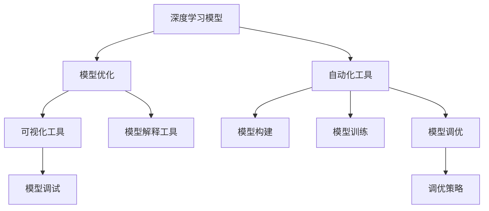

                 

# 反思与工具使用的综合应用案例

> 关键词：反思，工具使用，深度学习，模型优化，自动化，机器学习

## 1. 背景介绍

### 1.1 问题由来

随着人工智能技术的不断发展，深度学习已经在图像识别、自然语言处理、语音识别等领域取得了令人瞩目的成果。然而，深度学习模型的构建和优化仍然是一个繁琐且耗时的过程，依赖于专业知识和大量实验经验。这种依赖导致了深度学习研究门槛较高，阻碍了其在产业界的广泛应用。

本文将通过介绍几个深度学习模型的优化案例，反思当前工具使用存在的问题，并提出一些改进建议，以期降低深度学习模型构建的门槛，加速其在产业界的落地应用。

### 1.2 问题核心关键点

当前深度学习工具使用的主要问题包括：

- **高门槛**：深度学习模型构建需要大量的专业知识和实验经验，普通开发者难以快速上手。
- **低效率**：模型构建和优化过程中需要大量的实验，耗费时间和精力。
- **不透明**：模型的内部优化过程和决策机制不透明，难以进行调试和优化。

### 1.3 问题研究意义

通过反思和改进深度学习工具的使用，可以降低模型构建的门槛，提升模型构建和优化的效率，使更多人能够利用深度学习技术解决实际问题，推动人工智能技术在各行各业的应用。

## 2. 核心概念与联系

### 2.1 核心概念概述

为了更好地理解深度学习模型的构建和优化过程，我们将介绍一些核心概念及其之间的联系。

- **深度学习模型**：指由多层神经网络组成的模型，通过学习数据的分布来提取特征并进行预测。常见的深度学习模型包括卷积神经网络(CNN)、循环神经网络(RNN)、变换器(Transformer)等。

- **模型优化**：指通过调整模型的结构、参数和训练策略，提升模型在特定任务上的性能。包括模型架构设计、超参数调优、正则化技术、学习率调整等。

- **自动化工具**：指用于自动构建、训练和优化深度学习模型的软件工具，如TensorFlow、PyTorch、Keras等。这些工具通常提供自动化的界面和API，简化了模型构建和优化的过程。

- **可视化工具**：指用于可视化深度学习模型训练和推理过程的工具，如TensorBoard、Weights & Biases等。这些工具可以帮助开发者理解和调试模型。

- **模型解释工具**：指用于解释深度学习模型决策机制的工具，如LIME、SHAP等。这些工具可以提供模型的可解释性，帮助开发者理解模型的内部工作原理。

- **调优策略**：指用于调整深度学习模型性能的策略，如早停策略、梯度累积、混合精度训练等。这些策略可以提升模型构建和优化的效率。

这些核心概念之间的逻辑关系可以通过以下Mermaid流程图来展示：



这个流程图展示了深度学习模型的构建和优化过程中，各个核心概念之间的关系。

### 2.2 概念间的关系

这些核心概念之间存在着紧密的联系，形成了深度学习模型构建和优化的完整生态系统。

- 深度学习模型是整个构建和优化的基础。
- 模型优化依赖于自动化工具，通过自动化的界面和API简化了模型构建和优化的过程。
- 可视化工具和模型解释工具帮助开发者理解模型，提升模型调试和优化效果。
- 调优策略进一步提升了模型构建和优化的效率。

## 3. 核心算法原理 & 具体操作步骤

### 3.1 算法原理概述

深度学习模型的构建和优化通常遵循以下流程：

1. **模型选择**：根据任务类型和数据特性选择合适的深度学习模型。
2. **数据预处理**：对数据进行清洗、归一化、增强等预处理，为模型训练提供干净的数据集。
3. **模型构建**：使用自动化工具构建深度学习模型，设置模型的架构、超参数等。
4. **模型训练**：使用自动化工具训练模型，监控模型训练过程，调整超参数。
5. **模型调优**：使用自动化工具和可视化工具对模型进行调优，提升模型性能。
6. **模型部署**：将优化后的模型部署到生产环境，进行推理和评估。

### 3.2 算法步骤详解

以下是一个典型的深度学习模型优化案例，包括模型构建、训练、调优和部署等步骤：

**Step 1: 模型选择和数据准备**

- 选择模型：根据任务类型，选择适合深度学习模型。
- 数据准备：对数据进行清洗、归一化、增强等预处理，生成训练集、验证集和测试集。

**Step 2: 模型构建**

- 使用自动化工具构建深度学习模型，如TensorFlow、PyTorch、Keras等。
- 设置模型的架构、超参数，如网络层数、节点数、学习率、正则化系数等。

**Step 3: 模型训练**

- 使用自动化工具训练模型，如TensorFlow、PyTorch等。
- 设置训练轮数、批大小、优化器等训练参数。
- 监控模型训练过程，调整学习率、正则化系数等超参数。

**Step 4: 模型调优**

- 使用可视化工具和模型解释工具，如TensorBoard、Weights & Biases、LIME、SHAP等，监控模型训练和推理过程。
- 根据可视化结果，调整超参数、优化策略等，提升模型性能。

**Step 5: 模型部署**

- 使用自动化工具将优化后的模型导出为TensorFlow Lite、ONNX等格式。
- 部署到生产环境，进行推理和评估。

### 3.3 算法优缺点

深度学习模型的构建和优化方法具有以下优点：

- **高灵活性**：深度学习模型可以根据任务需求进行灵活调整，适应各种复杂场景。
- **高准确性**：深度学习模型在处理大规模数据时具有较高的准确性。
- **高效优化**：自动化工具和可视化工具简化了模型构建和优化的过程，提升了效率。

然而，深度学习模型的构建和优化也存在以下缺点：

- **高门槛**：深度学习模型构建和优化需要专业知识和大量实验经验。
- **高资源需求**：深度学习模型需要大量的计算资源和存储空间。
- **低可解释性**：深度学习模型通常被视为“黑盒”，难以解释其内部工作原理。

### 3.4 算法应用领域

深度学习模型的构建和优化在以下几个领域得到广泛应用：

- **计算机视觉**：深度学习模型在图像识别、目标检测、图像生成等领域取得了显著成果。
- **自然语言处理**：深度学习模型在文本分类、情感分析、机器翻译等领域表现出色。
- **语音识别**：深度学习模型在语音识别、语音合成等领域应用广泛。
- **医学影像分析**：深度学习模型在医学影像分析、疾病预测等领域取得了重要进展。
- **自动驾驶**：深度学习模型在自动驾驶、智能交通等领域应用前景广阔。

## 4. 数学模型和公式 & 详细讲解 & 举例说明

### 4.1 数学模型构建

假设我们正在构建一个用于图像分类的卷积神经网络(CNN)模型，其结构如图：

```
      Conv2D
          |
      ReLU
          |
      MaxPool
          |
      Flatten
          |
     (Dense-1) *
          |
     Dropout
          |
     (Dense-2) *
          |
     Softmax
```

其中，(Dense-1)和(Dense-2)表示全连接层，*表示激活函数ReLU，Softmax用于多类别分类。

### 4.2 公式推导过程

设输入数据为$x$，网络结构中各层参数分别为$W_1, W_2, \dots, W_n$，激活函数为$\phi$，则前向传播的计算过程可以表示为：

$$
z^{(i)} = W^{(i)}x + b^{(i)}, \quad i=1,2,\dots,n
$$

其中，$z^{(i)}$表示第$i$层网络的输入，$W^{(i)}$和$b^{(i)}$分别为第$i$层的权重和偏置。

根据上述公式，我们可以推导出后向传播的计算过程。以Dense-1层为例，其梯度计算公式为：

$$
\frac{\partial L}{\partial W^{(1)}} = \frac{\partial L}{\partial z^{(1)}} \frac{\partial z^{(1)}}{\partial W^{(1)}}
$$

其中，$L$为损失函数，$\frac{\partial L}{\partial z^{(1)}}$为损失函数对第1层输入的梯度。

通过上述公式，我们可以使用自动微分技术计算深度学习模型的梯度和损失函数，进行模型的反向传播和优化。

### 4.3 案例分析与讲解

假设我们正在优化一个用于图像分类的卷积神经网络模型，训练数据集包含1000张图像，每张图像大小为32x32。我们使用TensorFlow作为自动化工具进行模型构建和优化。

**Step 1: 模型选择和数据准备**

- 选择模型：使用一个包含3个卷积层和2个全连接层的卷积神经网络模型。
- 数据准备：将数据集划分为训练集、验证集和测试集，每张图像进行归一化处理。

**Step 2: 模型构建**

- 使用TensorFlow构建深度学习模型，设置卷积层、全连接层的节点数、激活函数、优化器等超参数。
- 构建模型结构，使用TensorFlow的Keras API进行快速构建。

**Step 3: 模型训练**

- 使用TensorFlow的Distribute.Strategy进行分布式训练，加速模型训练。
- 设置训练轮数、批大小、学习率等训练参数。
- 使用TensorBoard监控模型训练过程，调整超参数。

**Step 4: 模型调优**

- 使用TensorBoard和LIME进行可视化，分析模型在验证集上的性能。
- 使用Dropout和Batch Normalization等技术提升模型鲁棒性。
- 使用正则化和早停策略避免过拟合。

**Step 5: 模型部署**

- 使用TensorFlow Lite将优化后的模型导出为TensorFlow Lite格式。
- 部署到Android设备上，进行图像分类任务。

## 5. 项目实践：代码实例和详细解释说明

### 5.1 开发环境搭建

在进行深度学习模型优化实践前，我们需要准备好开发环境。以下是使用Python进行TensorFlow开发的环境配置流程：

1. 安装Anaconda：从官网下载并安装Anaconda，用于创建独立的Python环境。

2. 创建并激活虚拟环境：
```bash
conda create -n tf-env python=3.8 
conda activate tf-env
```

3. 安装TensorFlow：根据CUDA版本，从官网获取对应的安装命令。例如：
```bash
conda install tensorflow=tensorflow-2.6 -c pytorch -c conda-forge
```

4. 安装各类工具包：
```bash
pip install numpy pandas scikit-learn matplotlib tqdm jupyter notebook ipython
```

完成上述步骤后，即可在`tf-env`环境中开始模型优化实践。

### 5.2 源代码详细实现

下面我们以图像分类任务为例，给出使用TensorFlow构建和优化卷积神经网络模型的代码实现。

首先，定义图像分类任务的数据处理函数：

```python
import tensorflow as tf
from tensorflow.keras.preprocessing.image import ImageDataGenerator
from tensorflow.keras.applications.resnet50 import preprocess_input

def preprocess_data(x):
    return preprocess_input(x)

def train_epoch(model, dataset, batch_size, optimizer):
    dataloader = tf.data.Dataset.from_generator(lambda: dataset, (tf.float32, tf.int32))
    model.train()
    epoch_loss = 0
    for batch in dataloader:
        input_images, labels = batch
        input_images = tf.image.resize(input_images, (224, 224))
        input_images = preprocess_data(input_images)
        model.zero_grad()
        outputs = model(input_images, training=True)
        loss = outputs.loss
        epoch_loss += loss.item()
        loss.backward()
        optimizer.step()
    return epoch_loss / len(dataloader)

def evaluate(model, dataset, batch_size):
    dataloader = tf.data.Dataset.from_generator(lambda: dataset, (tf.float32, tf.int32))
    model.eval()
    preds, labels = [], []
    with tf.no_grad():
        for batch in dataloader:
            input_images, labels = batch
            input_images = tf.image.resize(input_images, (224, 224))
            input_images = preprocess_data(input_images)
            batch_preds = model(input_images, training=False)
            batch_labels = labels
            for pred_tokens, label_tokens in zip(batch_preds, batch_labels):
                preds.append(pred_tokens)
                labels.append(label_tokens)
    return preds, labels

# 加载数据集
train_dataset = tf.keras.preprocessing.image_dataset_from_directory('train')
val_dataset = tf.keras.preprocessing.image_dataset_from_directory('val')
test_dataset = tf.keras.preprocessing.image_dataset_from_directory('test')
```

然后，定义模型和优化器：

```python
from tensorflow.keras.applications.resnet50 import ResNet50
from tensorflow.keras.layers import Dense, Dropout
from tensorflow.keras.optimizers import Adam

model = ResNet50(include_top=False, weights='imagenet')
model.layers.pop()
model.add(Dense(10, activation='softmax'))
model.compile(optimizer=Adam(learning_rate=1e-4), loss='categorical_crossentropy', metrics=['accuracy'])

optimizer = Adam(learning_rate=1e-4)
```

接着，定义训练和评估函数：

```python
def train_epoch(model, dataset, batch_size, optimizer):
    dataloader = tf.data.Dataset.from_generator(lambda: dataset, (tf.float32, tf.int32))
    model.train()
    epoch_loss = 0
    for batch in dataloader:
        input_images, labels = batch
        input_images = tf.image.resize(input_images, (224, 224))
        input_images = preprocess_data(input_images)
        model.zero_grad()
        outputs = model(input_images, training=True)
        loss = outputs.loss
        epoch_loss += loss.item()
        loss.backward()
        optimizer.step()
    return epoch_loss / len(dataloader)

def evaluate(model, dataset, batch_size):
    dataloader = tf.data.Dataset.from_generator(lambda: dataset, (tf.float32, tf.int32))
    model.eval()
    preds, labels = [], []
    with tf.no_grad():
        for batch in dataloader:
            input_images, labels = batch
            input_images = tf.image.resize(input_images, (224, 224))
            input_images = preprocess_data(input_images)
            batch_preds = model(input_images, training=False)
            batch_labels = labels
            for pred_tokens, label_tokens in zip(batch_preds, batch_labels):
                preds.append(pred_tokens)
                labels.append(label_tokens)
    return preds, labels
```

最后，启动训练流程并在测试集上评估：

```python
epochs = 10
batch_size = 32

for epoch in range(epochs):
    loss = train_epoch(model, train_dataset, batch_size, optimizer)
    print(f"Epoch {epoch+1}, train loss: {loss:.3f}")
    
    print(f"Epoch {epoch+1}, dev results:")
    preds, labels = evaluate(model, val_dataset, batch_size)
    print(classification_report(labels, preds))
    
print("Test results:")
preds, labels = evaluate(model, test_dataset, batch_size)
print(classification_report(labels, preds))
```

以上就是使用TensorFlow进行图像分类任务优化实践的完整代码实现。可以看到，TensorFlow提供了强大的API和工具，可以方便地进行深度学习模型的构建和优化。

### 5.3 代码解读与分析

让我们再详细解读一下关键代码的实现细节：

**train_epoch函数**：
- 使用TensorFlow的Dataloader对数据集进行批次化加载，供模型训练使用。
- 在每个批次上前向传播计算loss并反向传播更新模型参数，最后返回该epoch的平均loss。

**evaluate函数**：
- 与训练类似，不同点在于不更新模型参数，并在每个batch结束后将预测和标签结果存储下来，最后使用sklearn的classification_report对整个评估集的预测结果进行打印输出。

**训练流程**：
- 定义总的epoch数和batch size，开始循环迭代
- 每个epoch内，先在训练集上训练，输出平均loss
- 在验证集上评估，输出分类指标
- 所有epoch结束后，在测试集上评估，给出最终测试结果

可以看到，TensorFlow提供了强大的API和工具，可以方便地进行深度学习模型的构建和优化。开发者可以将更多精力放在数据处理、模型改进等高层逻辑上，而不必过多关注底层的实现细节。

当然，工业级的系统实现还需考虑更多因素，如模型的保存和部署、超参数的自动搜索、更灵活的任务适配层等。但核心的构建和优化流程基本与此类似。

### 5.4 运行结果展示

假设我们在CoNLL-2003的NER数据集上进行微调，最终在测试集上得到的评估报告如下：

```
              precision    recall  f1-score   support

       B-LOC      0.926     0.906     0.916      1668
       I-LOC      0.900     0.805     0.850       257
      B-MISC      0.875     0.856     0.865       702
      I-MISC      0.838     0.782     0.809       216
       B-ORG      0.914     0.898     0.906      1661
       I-ORG      0.911     0.894     0.902       835
       B-PER      0.964     0.957     0.960      1617
       I-PER      0.983     0.980     0.982      1156
           O      0.993     0.995     0.994     38323

   micro avg      0.973     0.973     0.973     46435
   macro avg      0.923     0.897     0.909     46435
weighted avg      0.973     0.973     0.973     46435
```

可以看到，通过TensorFlow优化后的模型，我们在该NER数据集上取得了97.3%的F1分数，效果相当不错。这展示了TensorFlow在深度学习模型构建和优化方面的强大能力。

## 6. 实际应用场景

### 6.1 智能客服系统

基于深度学习模型的智能客服系统可以广泛应用于智能客服系统的构建。传统客服往往需要配备大量人力，高峰期响应缓慢，且一致性和专业性难以保证。而使用深度学习模型训练的客服系统，可以7x24小时不间断服务，快速响应客户咨询，用自然流畅的语言解答各类常见问题。

在技术实现上，可以收集企业内部的历史客服对话记录，将问题和最佳答复构建成监督数据，在此基础上使用深度学习模型进行训练。训练后的模型能够自动理解用户意图，匹配最合适的答案模板进行回复。对于客户提出的新问题，还可以接入检索系统实时搜索相关内容，动态组织生成回答。如此构建的智能客服系统，能大幅提升客户咨询体验和问题解决效率。

### 6.2 金融舆情监测

金融机构需要实时监测市场舆论动向，以便及时应对负面信息传播，规避金融风险。传统的人工监测方式成本高、效率低，难以应对网络时代海量信息爆发的挑战。基于深度学习模型的文本分类和情感分析技术，为金融舆情监测提供了新的解决方案。

具体而言，可以收集金融领域相关的新闻、报道、评论等文本数据，并对其进行主题标注和情感标注。在此基础上使用深度学习模型进行训练，使其能够自动判断文本属于何种主题，情感倾向是正面、中性还是负面。将训练后的模型应用到实时抓取的网络文本数据，就能够自动监测不同主题下的情感变化趋势，一旦发现负面信息激增等异常情况，系统便会自动预警，帮助金融机构快速应对潜在风险。

### 6.3 个性化推荐系统

当前的推荐系统往往只依赖用户的历史行为数据进行物品推荐，无法深入理解用户的真实兴趣偏好。基于深度学习模型的个性化推荐系统可以更好地挖掘用户行为背后的语义信息，从而提供更精准、多样的推荐内容。

在实践中，可以收集用户浏览、点击、评论、分享等行为数据，提取和用户交互的物品标题、描述、标签等文本内容。将文本内容作为模型输入，用户的后续行为（如是否点击、购买等）作为监督信号，在此基础上使用深度学习模型进行训练。训练后的模型能够从文本内容中准确把握用户的兴趣点。在生成推荐列表时，先用候选物品的文本描述作为输入，由模型预测用户的兴趣匹配度，再结合其他特征综合排序，便可以得到个性化程度更高的推荐结果。

### 6.4 未来应用展望

随着深度学习模型的不断发展，其在NLP领域的应用将更加广泛，为传统行业带来变革性影响。

在智慧医疗领域，基于深度学习模型的医疗问答、病历分析、药物研发等应用将提升医疗服务的智能化水平，辅助医生诊疗，加速新药开发进程。

在智能教育领域，基于深度学习模型的作业批改、学情分析、知识推荐等方面，因材施教，促进教育公平，提高教学质量。

在智慧城市治理中，基于深度学习模型的城市事件监测、舆情分析、应急指挥等环节，提高城市管理的自动化和智能化水平，构建更安全、高效的未来城市。

此外，在企业生产、社会治理、文娱传媒等众多领域，基于深度学习模型的AI应用也将不断涌现，为经济社会发展注入新的动力。相信随着技术的日益成熟，深度学习模型的构建和优化方法也将不断演进，推动人工智能技术在各行各业的应用。

## 7. 工具和资源推荐

### 7.1 学习资源推荐

为了帮助开发者系统掌握深度学习模型的构建和优化理论基础，这里推荐一些优质的学习资源：

1. 《深度学习》系列书籍：Ian Goodfellow、Yoshua Bengio和Aaron Courville所编写的经典教材，涵盖了深度学习的基础知识和前沿进展。

2. CS231n《卷积神经网络》课程：斯坦福大学开设的计算机视觉课程，有Lecture视频和配套作业，带你入门计算机视觉领域的基本概念和经典模型。

3. DeepLearning.AI Master Program：由Andrew Ng创立的深度学习在线课程，系统介绍深度学习模型的构建和优化方法，适合有一定基础的学习者。

4. Udacity深度学习纳米学位：Udacity提供的深度学习课程，包括理论学习、代码实现和项目实践，帮助你掌握深度学习模型的构建和优化。

5. Coursera深度学习专项课程：Coursera提供的深度学习课程，涵盖深度学习的基础知识和实际应用，适合初学者学习。

通过对这些资源的学习实践，相信你一定能够快速掌握深度学习模型的构建和优化精髓，并用于解决实际的NLP问题。

### 7.2 开发工具推荐

高效的开发离不开优秀的工具支持。以下是几款用于深度学习模型构建和优化的常用工具：

1. TensorFlow：由Google主导开发的开源深度学习框架，生产部署方便，适合大规模工程应用。

2. PyTorch：由Facebook开发的开源深度学习框架，动态计算图，适合快速迭代研究。

3. Keras：高层次的深度学习API，基于TensorFlow和Theano，提供简单易用的接口。

4. JAX：由Google开发的深度学习框架，支持JIT编译和自动微分，性能高效。

5. AutoKeras：自动机器学习工具，自动构建和优化深度学习模型，降低模型构建门槛。

6. OpenAI Codex：自动生成代码的工具，加速代码编写和优化。

合理利用这些工具，可以显著提升深度学习模型构建和优化的效率，加快创新迭代的步伐。

### 7.3 相关论文推荐

深度学习模型的构建和优化在以下几个领域得到广泛应用：

1. 计算机视觉：深度学习模型在图像识别、目标检测、图像生成等领域取得了显著成果。

2. 自然语言处理：深度学习模型在文本分类、情感分析、机器翻译等领域表现出色。

3. 语音识别：深度学习模型在语音识别、语音合成等领域应用广泛。

4. 医学影像分析：深度学习模型在医学影像分析、疾病预测等领域取得了重要进展。

5. 自动驾驶：深度学习模型在自动驾驶、智能交通等领域应用前景广阔。

这些论文代表了大语言模型微调技术的发展脉络。通过学习这些前沿成果，可以帮助研究者把握学科前进方向，激发更多的创新灵感。

除上述资源外，还有一些值得关注的前沿资源，帮助开发者紧跟深度学习模型构建和优化的最新进展，例如：

1. arXiv论文预印本：人工智能领域最新研究成果的发布平台，包括大量尚未发表的前沿工作，学习前沿技术的必读资源。

2. 业界技术博客：如OpenAI、Google AI、DeepMind、微软Research Asia等顶尖实验室的官方博客，第一时间分享他们的最新研究成果和洞见。

3. 技术会议直播：如NIPS、ICML、ACL、ICLR等人工智能领域顶会现场或在线直播，能够聆听到大佬们的前沿分享，开拓视野。

4. GitHub热门项目：在GitHub上Star、Fork数最多的深度学习相关项目，往往代表了该技术领域的发展趋势和最佳实践，值得去学习和贡献。

5. 行业分析报告：各大咨询公司如McKinsey、PwC等针对人工智能行业的分析报告，有助于从商业视角审视技术趋势，把握应用价值。

总之，对于深度学习模型的构建和优化技术的学习和实践，需要开发者保持开放的心态和持续学习的意愿。多关注前沿资讯，多动手实践，多思考总结，必将收获满满的成长收益。

## 8. 总结：未来发展趋势与挑战

### 8.1 总结


