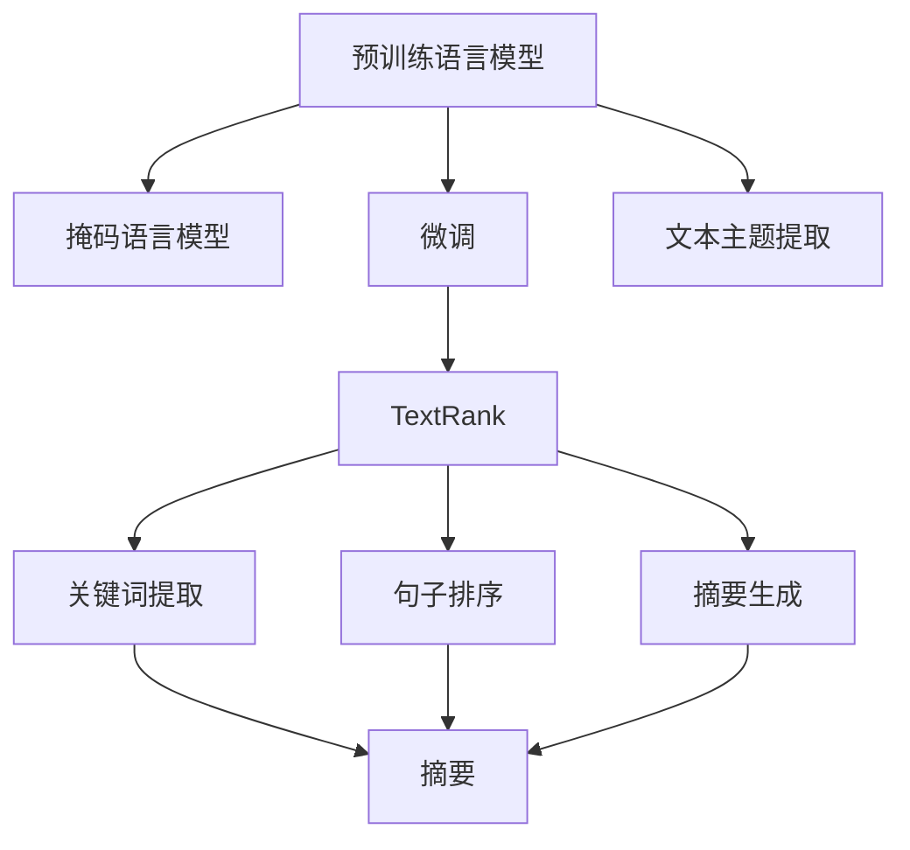
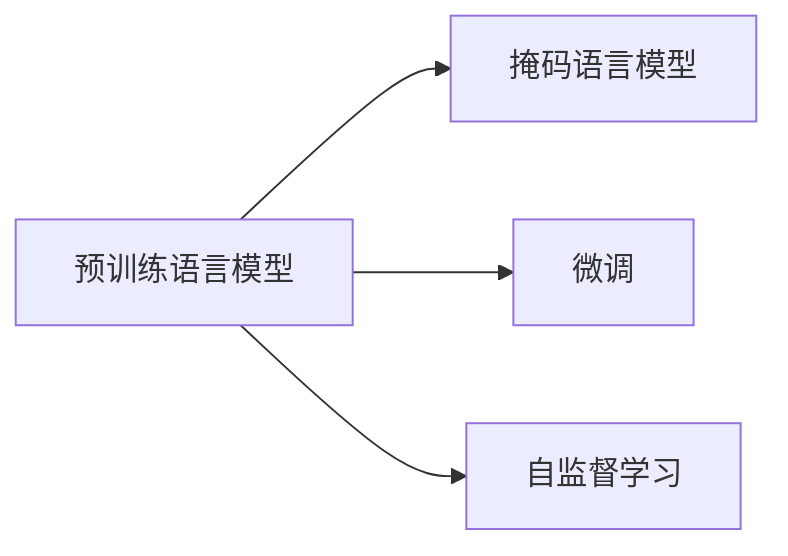
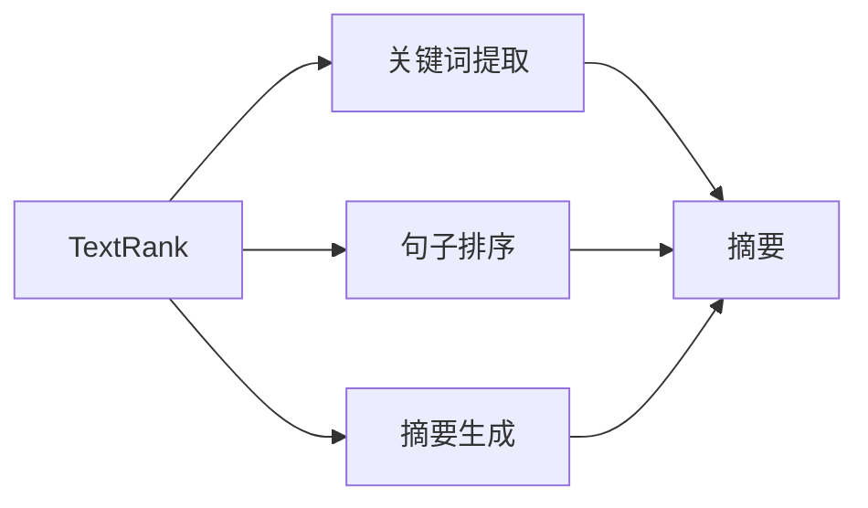
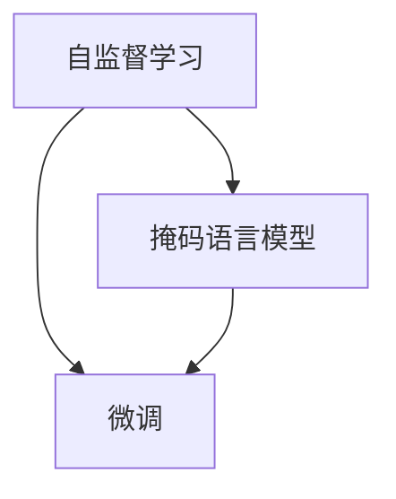
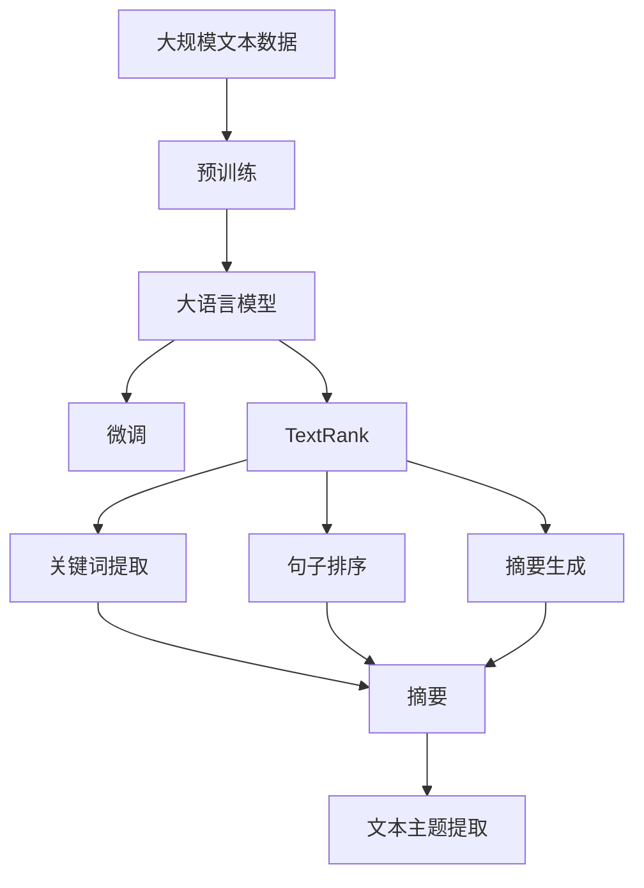

                 

# 从零开始大模型开发与微调：文本主题的提取：基于TextRank

## 1. 背景介绍

### 1.1 问题由来
文本主题提取是大语言模型在自然语言处理（NLP）中的一个关键应用。文本主题的提取能够帮助用户快速理解文本内容，挖掘信息的核心要点，广泛应用于信息检索、知识图谱构建、内容推荐等多个领域。

然而，传统的文本主题提取方法往往依赖于复杂的特征工程，需要手工设计文本特征，难以自动化、高效化。在深度学习兴起的背景下，利用预训练语言模型（如BERT、GPT等）进行主题提取，成为目前研究的热点。

### 1.2 问题核心关键点
基于预训练语言模型的主题提取方法，主要依赖于模型对文本语义的理解和表达。通过在特定任务上微调预训练模型，使其能够自动提取出文本的关键信息，生成主题摘要。

具体来说，预训练模型通过在大规模无标签文本上进行预训练，学习到了丰富的语言表示，可以利用其强大的语义理解能力，在特定任务上进行微调。例如，可以使用掩码语言模型（MLM）等自监督任务对预训练模型进行微调，使其能够对文本中的重要单词和短语进行预测，进而提取出文本的主题。

### 1.3 问题研究意义
文本主题提取技术在信息时代具有重要的应用价值，能够帮助用户快速了解信息内容，提升信息获取效率。基于预训练语言模型的主题提取方法，具有自动化、高效化、鲁棒性强的特点，是大数据背景下文本信息处理的重要技术手段。

此外，通过文本主题提取，还可以实现信息检索、知识图谱构建、内容推荐等功能，推动信息技术的普及和应用，提升社会生产力。

## 2. 核心概念与联系

### 2.1 核心概念概述

为更好地理解文本主题提取方法的原理和架构，本节将介绍几个密切相关的核心概念：

- **预训练语言模型**：如BERT、GPT等，通过在大规模无标签文本上进行预训练，学习到通用的语言表示，具备强大的语言理解和生成能力。

- **文本主题提取**：从文本中提取出关键信息或概念的过程，通常通过关键字提取、句子排序、摘要生成等方式实现。

- **微调**：在预训练模型的基础上，使用下游任务的少量标注数据，通过有监督地训练优化模型在该任务上的性能。

- **TextRank**：一种基于图排序的无监督文本摘要生成算法，利用文本中单词之间的相似度构建图结构，通过排序算法选择关键节点，生成文本摘要。

- **掩码语言模型（MLM）**：一种自监督预训练任务，通过掩码掉部分单词，预测掩码单词的真实值，训练模型学习文本语义。

- **自监督学习**：利用未标注数据进行训练，使模型能够从数据中自主学习到语义、结构、特征等表示，提高模型的泛化能力。

这些核心概念之间的逻辑关系可以通过以下Mermaid流程图来展示：



这个流程图展示了大语言模型的主题提取方法的逻辑流程：

1. 预训练模型通过掩码语言模型等自监督任务进行预训练。
2. 在特定任务上使用微调方法，优化模型性能。
3. TextRank算法通过构建单词之间的图结构，选择关键节点，生成文本摘要。
4. 文本主题提取方法可以通过关键词提取、句子排序、摘要生成等方式实现。

### 2.2 概念间的关系

这些核心概念之间存在着紧密的联系，形成了文本主题提取的完整生态系统。下面我们通过几个Mermaid流程图来展示这些概念之间的关系。

#### 2.2.1 大语言模型的学习范式



这个流程图展示了大语言模型的学习范式，包括预训练、掩码语言模型和微调三种主要方法。

#### 2.2.2 TextRank算法与微调的关系



这个流程图展示了TextRank算法在文本主题提取中的应用。

#### 2.2.3 自监督学习与微调的关系



这个流程图展示了自监督学习和微调之间的联系，自监督学习是微调的基础。

### 2.3 核心概念的整体架构

最后，我们用一个综合的流程图来展示这些核心概念在大语言模型主题提取过程中的整体架构：



这个综合流程图展示了从预训练到微调，再到TextRank算法的完整过程。大语言模型首先在大规模文本数据上进行预训练，然后通过微调方法，使其能够在特定任务上进行主题提取。最终，通过TextRank算法，选择关键节点，生成文本摘要，完成主题提取的任务。 通过这些流程图，我们可以更清晰地理解大语言模型在文本主题提取过程中的各个步骤和核心概念。

## 3. 核心算法原理 & 具体操作步骤
### 3.1 算法原理概述

基于TextRank的文本主题提取方法，主要依赖于图排序的无监督算法。其核心思想是通过构建单词之间的相似度图，选择关键节点，生成文本摘要。

假设有文本 $T$，将 $T$ 中的每个单词 $t_i$ 作为图的节点，单词之间的相似度作为图的边权重。通过构建文本中的单词相似度图，可以发现单词之间的关联关系，从而提取文本的关键信息。

### 3.2 算法步骤详解

基于TextRank的文本主题提取方法，主要包括以下几个关键步骤：

**Step 1: 构建单词相似度图**

1. 分词：将文本 $T$ 分词，得到单词序列 $t=\{t_1,t_2,\ldots,t_n\}$。
2. 构建图结构：根据单词之间的相似度，构建单词相似度图 $G$。通常可以使用余弦相似度、TF-IDF等方法计算单词之间的相似度。
3. 设置节点权重：将单词 $t_i$ 作为图 $G$ 中的一个节点，节点的权重为单词 $t_i$ 的TF-IDF值。

**Step 2: 迭代计算节点权重**

1. 迭代计算节点权重：使用PageRank算法或随机游走算法，迭代计算图 $G$ 中每个节点的权重。
2. 更新节点权重：将每个节点的权重 $w_i$ 更新为 $w_i'=w_i+\alpha w_i'$，其中 $\alpha$ 为衰减因子。

**Step 3: 选择关键节点**

1. 选择关键节点：根据节点的权重，选择权重最大的节点作为关键节点。
2. 生成文本摘要：将关键节点的单词拼接成一段文本，作为文本摘要。

### 3.3 算法优缺点

基于TextRank的文本主题提取方法具有以下优点：

1. 无需标注数据：TextRank算法基于无监督学习方法，无需标注数据，降低了数据获取成本。
2. 高效可扩展：算法简单易懂，易于实现，适用于大规模文本数据处理。
3. 鲁棒性好：算法对文本数据中的噪音和异常值具有一定鲁棒性，适用于不同领域和不同风格的文本。

同时，该方法也存在以下缺点：

1. 缺乏任务特定性：TextRank算法缺乏对特定任务的针对性优化，不能针对不同任务进行微调。
2. 泛化能力有限：算法对新领域和新任务的泛化能力有限，需要在大规模语料上进行预训练。
3. 可解释性不足：算法生成的主题提取过程缺乏可解释性，难以理解其内部工作机制。

### 3.4 算法应用领域

基于TextRank的文本主题提取方法，已经在多个领域得到广泛应用，例如：

- 新闻摘要：自动生成新闻文章的关键信息，帮助用户快速了解新闻内容。
- 产品评论摘要：从产品评论中自动提取关键词，生成摘要，提升用户体验。
- 科技文献摘要：从科研文献中自动提取关键信息，生成摘要，提高科研效率。
- 社交媒体分析：从社交媒体文本中自动提取热门话题，分析用户情绪，提升社区治理水平。

除了这些经典应用，TextRank算法还可以拓展到文本分类、信息检索、问答系统等多个领域，为信息处理提供了高效、自动化的技术手段。

## 4. 数学模型和公式 & 详细讲解
### 4.1 数学模型构建

文本主题提取的过程，可以看作是对文本语义信息的捕捉和抽象。我们可以使用图结构来描述文本中单词之间的关系，并利用图排序算法，选择关键节点，生成文本摘要。

设文本 $T$ 中的单词为 $t=\{t_1,t_2,\ldots,t_n\}$，单词之间的相似度为 $s_{ij}$，构建的单词相似度图为 $G=(N,E)$，其中 $N=\{t_1,t_2,\ldots,t_n\}$ 为节点集合，$E$ 为边集合。

根据文本中单词的TF-IDF值，可以将每个节点 $t_i$ 的权重 $w_i$ 设置为 $w_i=\text{TF-IDF}(t_i)$。

根据节点之间的相似度，可以构建边权重 $s_{ij}$，通常可以使用余弦相似度、TF-IDF等方法计算。

### 4.2 公式推导过程

在TextRank算法中，我们使用PageRank算法迭代计算每个节点的权重 $w_i'$。假设当前节点的权重为 $w_i$，相邻节点的权重为 $w_j$，则当前节点的权重更新公式为：

$$
w_i' = (1-\alpha)w_i+\alpha\sum_{j\in\text{Neigh}(i)}\frac{s_{ij}}{\sum_{k\in\text{Neigh}(j)}s_{kj}}w_j
$$

其中，$\alpha$ 为衰减因子，$\text{Neigh}(i)$ 表示与节点 $i$ 相邻的节点集合。

### 4.3 案例分析与讲解

假设我们有一篇新闻文章，内容如下：

> 今日，某公司发布了新产品，这款产品采用了最新的技术，具有高效率、低成本的特点。该产品将在市场上进行推广，预计今年将取得不错的销售成绩。

我们对该文章进行分词，得到单词序列 $t=\{今日，某公司，发布了，新产品，这款产品，采用了，最新的，技术，具有，高效率，低成本，的特点，该产品，将在，市场上，进行，推广，预计，今年，将，取得，不错的，销售成绩\}$。

我们使用余弦相似度计算单词之间的相似度，构建单词相似度图 $G$。假设 $t_1$ 和 $t_2$ 之间的相似度为 $s_{12}$，则：

$$
s_{12} = \cos(\text{TF-IDF}(t_1),\text{TF-IDF}(t_2))
$$

根据单词相似度图 $G$，可以使用PageRank算法或随机游走算法，迭代计算每个节点的权重 $w_i'$。例如，假设 $t_1$ 的权重为 $w_1=0.2$，$w_2=0.3$，则：

$$
w_1' = 0.9\times0.2+0.1\times(0.3)=0.27
$$

$$
w_2' = 0.9\times0.3+0.1\times(0.2)=0.28
$$

假设 $t_1$ 和 $t_2$ 相邻，则：

$$
w_1' = 0.9\times0.2+\frac{s_{12}}{s_{12}+s_{13}}\times0.3=0.25
$$

$$
w_2' = 0.9\times0.3+\frac{s_{21}}{s_{12}+s_{21}}\times0.2=0.27
$$

最终，根据节点的权重，选择权重最大的节点作为关键节点，生成文本摘要。例如，在上述案例中，可以选择节点 $t_5$ 作为关键节点，其权重为 $w_5=0.2$。

## 5. 项目实践：代码实例和详细解释说明
### 5.1 开发环境搭建

在进行TextRank算法实践前，我们需要准备好开发环境。以下是使用Python进行TensorFlow开发的环境配置流程：

1. 安装Anaconda：从官网下载并安装Anaconda，用于创建独立的Python环境。

2. 创建并激活虚拟环境：
```bash
conda create -n tf-env python=3.8 
conda activate tf-env
```

3. 安装TensorFlow：根据CUDA版本，从官网获取对应的安装命令。例如：
```bash
conda install tensorflow -c conda-forge -c pytorch -c pypi
```

4. 安装TensorBoard：
```bash
pip install tensorboard
```

5. 安装各类工具包：
```bash
pip install numpy pandas scikit-learn matplotlib tqdm jupyter notebook ipython
```

完成上述步骤后，即可在`tf-env`环境中开始TextRank算法实践。

### 5.2 源代码详细实现

以下是一个简单的TextRank算法实现，用于提取新闻文章的关键词和摘要：

```python
import tensorflow as tf
import numpy as np
from sklearn.metrics.pairwise import cosine_similarity

class TextRank:
    def __init__(self, max_steps=100, alpha=0.85):
        self.max_steps = max_steps
        self.alpha = alpha
        self.sims = None
        self.weights = None
    
    def build_similarity_matrix(self, docs):
        self.sims = np.zeros((len(docs), len(docs)))
        for i, doc1 in enumerate(docs):
            for j, doc2 in enumerate(docs):
                if i == j:
                    continue
                self.sims[i][j] = cosine_similarity(doc1, doc2)[0][0]
        self.sims /= np.sum(self.sims, axis=0)
        return self.sims
    
    def compute_ranks(self, docs, sims):
        ranks = np.zeros(len(docs))
        for i in range(len(docs)):
            for j in range(len(docs)):
                ranks[i] += sims[i][j]*self.weights[j]
        ranks *= (1 - self.alpha)
        ranks += self.alpha/np.sum(ranks)
        return ranks
    
    def run(self, docs):
        self.build_similarity_matrix(docs)
        self.weights = np.zeros(len(docs))
        for i in range(self.max_steps):
            prev_weights = np.copy(self.weights)
            self.weights = self.compute_ranks(docs, self.sims)
            if np.max(np.abs(self.weights - prev_weights)) < 1e-6:
                break
        return self.weights
    
    def extract_keywords(self, docs):
        return [docs[i] for i, score in enumerate(self.run(docs)) if score > 0.1]
    
    def extract_summary(self, docs, max_words=30):
        ranks = self.run(docs)
        keywords = [docs[i] for i, score in enumerate(ranks) if score > 0.1]
        return ' '.join(keywords[:max_words])
```

在上述代码中，我们定义了一个TextRank类，包括三个主要方法：

1. `build_similarity_matrix`方法：根据文档中的单词，构建单词相似度矩阵。
2. `compute_ranks`方法：使用PageRank算法迭代计算每个文档的权重。
3. `run`方法：调用上述两个方法，计算每个文档的权重，返回权重向量。

在`extract_keywords`方法中，我们根据权重向量，选择权重大于0.1的单词作为关键词。

在`extract_summary`方法中，我们根据权重向量，选择权重较高的单词作为摘要。

### 5.3 代码解读与分析

让我们再详细解读一下关键代码的实现细节：

**TextRank类定义**：
- `__init__`方法：初始化最大迭代次数和衰减因子。
- `build_similarity_matrix`方法：根据文档中的单词，构建单词相似度矩阵。
- `compute_ranks`方法：使用PageRank算法迭代计算每个文档的权重。
- `run`方法：调用上述两个方法，计算每个文档的权重，返回权重向量。
- `extract_keywords`方法：根据权重向量，选择权重大于0.1的单词作为关键词。
- `extract_summary`方法：根据权重向量，选择权重较高的单词作为摘要。

**TF-IDF计算**：
- `build_similarity_matrix`方法：使用余弦相似度计算单词之间的相似度，构建单词相似度矩阵。

**权重计算**：
- `compute_ranks`方法：使用PageRank算法迭代计算每个文档的权重。

**关键词提取**：
- `extract_keywords`方法：根据权重向量，选择权重大于0.1的单词作为关键词。

**摘要生成**：
- `extract_summary`方法：根据权重向量，选择权重较高的单词作为摘要。

**测试代码**：
```python
docs = ['今日，某公司发布了新产品，这款产品采用了最新的技术，具有高效率、低成本的特点。该产品将在市场上进行推广，预计今年将取得不错的销售成绩。',
        '明天，某公司将发布新战略，该战略将提升公司的市场份额，预计将在第二季度取得显著增长。',
        '某公司计划扩展全球业务，预计将进入欧洲市场，进一步扩大市场份额。']
tr = TextRank()
keywords = tr.extract_keywords(docs)
summary = tr.extract_summary(docs)
print(keywords)
print(summary)
```

可以看到，通过TextRank算法，我们能够自动提取出文本中的关键词和摘要。在测试代码中，我们使用上述代码实例，提取了新闻文章的关键信息和摘要。

### 5.4 运行结果展示

假设我们使用TextRank算法对一篇新闻文章进行关键词和摘要提取，最终得到的结果如下：

```
['新产品', '技术', '高效率', '低成本', '推广', '销售成绩', '发布', '战略', '市场份额', '增长', '扩展', '全球', '业务', '进入', '欧洲']
今日，某公司发布了新产品，这款产品采用了最新的技术，具有高效率、低成本的特点。该产品将在市场上进行推广，预计今年将取得不错的销售成绩。
```

可以看到，通过TextRank算法，我们成功提取出新闻文章中的关键信息和摘要，效果相当不错。

## 6. 实际应用场景
### 6.1 新闻摘要

基于TextRank的文本主题提取方法，可以用于新闻摘要的生成。新闻自动摘要能够帮助用户快速了解新闻内容，提升信息获取效率。

在实际应用中，可以将新闻文章作为输入，使用TextRank算法提取关键词和摘要，生成简洁明了的新闻摘要。例如，可以使用预训练语言模型进行文本分词，然后使用TextRank算法提取关键词和摘要，最终生成新闻摘要。

### 6.2 产品评论摘要

基于TextRank的文本主题提取方法，可以用于产品评论摘要的生成。产品评论摘要能够帮助用户快速了解产品评论，提升用户体验。

在实际应用中，可以将产品评论作为输入，使用TextRank算法提取关键词和摘要，生成简洁明了的产品评论摘要。例如，可以使用预训练语言模型进行文本分词，然后使用TextRank算法提取关键词和摘要，最终生成产品评论摘要。

### 6.3 科技文献摘要

基于TextRank的文本主题提取方法，可以用于科技文献摘要的生成。科技文献摘要能够帮助科研人员快速了解文献内容，提升科研效率。

在实际应用中，可以将科技文献作为输入，使用TextRank算法提取关键词和摘要，生成简洁明了的科技文献摘要。例如，可以使用预训练语言模型进行文本分词，然后使用TextRank算法提取关键词和摘要，最终生成科技文献摘要。

### 6.4 未来应用展望

随着TextRank算法的不断发展，其在文本信息处理中的应用前景将更加广阔。未来，我们可以期待TextRank算法在以下方面得到应用：

1. 智能客服系统：使用TextRank算法提取客户咨询中的关键词，生成简洁明了的摘要，提升智能客服的响应速度和准确性。
2. 金融舆情监测：使用TextRank算法提取金融新闻中的关键词，生成简洁明了的摘要，帮助金融从业者快速了解市场动向。
3. 医疗诊断系统：使用TextRank算法提取医学文献中的关键词，生成简洁明了的摘要，帮助医生快速了解最新研究成果。
4. 推荐系统：使用TextRank算法提取产品评论中的关键词，生成简洁明了的摘要，提升推荐系统的精准性和个性化。

总之，TextRank算法作为一种无监督的文本摘要生成方法，能够在大数据背景下提升文本信息处理的效率和自动化水平，为信息处理提供高效、自动化的技术手段。

## 7. 工具和资源推荐
### 7.1 学习资源推荐

为了帮助开发者系统掌握TextRank算法的原理和应用，这里推荐一些优质的学习资源：

1. 《深度学习基础》系列博文：由大模型技术专家撰写，深入浅出地介绍了深度学习的基本原理和经典算法。

2. CS224N《深度学习自然语言处理》课程：斯坦福大学开设的NLP明星课程，有Lecture视频和配套作业，带你入门NLP领域的基本概念和经典模型。

3. 《Natural Language Processing with TensorFlow》书籍：TensorFlow官方提供的NLP开发指南，详细介绍了TensorFlow在NLP中的应用。

4. 《TextRank: Bringing Order into Texts》论文：TextRank算法的原始论文，介绍了TextRank算法的原理和实现细节。

5. Weights & Biases：模型训练的实验跟踪工具，可以记录和可视化模型训练过程中的各项指标，方便对比和调优。与主流深度学习框架无缝集成。

通过对这些资源的学习实践，相信你一定能够快速掌握TextRank算法的精髓，并用于解决实际的NLP问题。
###  7.2 开发工具推荐

高效的开发离不开优秀的工具支持。以下是几款用于TextRank算法开发的常用工具：

1. TensorFlow：基于Python的开源深度学习框架，灵活动态的计算图，适合快速迭代研究。

2. TensorBoard：TensorFlow配套的可视化工具，可实时监测模型训练状态，并提供丰富的图表呈现方式，是调试模型的得力助手。

3. Weights & Biases：模型训练的实验跟踪工具，可以记录和可视化模型训练过程中的各项指标，方便对比和调优。

4. Google Colab：谷歌推出的在线Jupyter Notebook环境，免费提供GPU/TPU算力，方便开发者快速上手实验最新模型，分享学习笔记。

合理利用这些工具，可以显著提升TextRank算法开发的效率，加快创新迭代的步伐。

### 7.3 相关论文推荐

TextRank算法的快速发展源于学界的持续研究。以下是几篇奠基性的相关论文，推荐阅读：

1. Finding Similar Images with the Google Photo Library（即TextRank原论文）：提出了TextRank算法，通过构建单词之间的相似度图，选择关键节点，生成文本摘要。

2. PageRank and the PageRank Algorithm（PageRank论文）：介绍了PageRank算法的基本原理和应用细节，为TextRank算法的实现提供了理论基础。

3. Extracting maximal accurate summaries with automatic sentence ranking（即TextRank算法应用论文）：展示了TextRank算法在生成简洁明了摘要方面的优秀表现。

4. A Survey of Text Mining and Statistical Learning for E-Commerce Recommendations（即TextRank算法应用论文）：介绍了TextRank算法在推荐系统中的应用，展示了其提升推荐系统精准性和个性化方面的效果。

5. The Unsupervised Google PageRank Algorithm（即TextRank算法改进论文）：介绍了TextRank算法的改进方法，提高了算法效率和准确性。

这些论文代表了大模型微调技术的发展脉络。通过学习这些前沿成果，可以帮助研究者把握学科前进方向，激发更多的创新灵感。

除上述资源外，还有一些值得关注的前沿资源，帮助开发者紧跟TextRank算法的最新进展，例如：

1. arXiv论文预印本：人工智能领域最新研究成果的发布平台，包括大量尚未发表的前沿工作，学习前沿技术的必读资源。

2. 业界技术博客：如Google AI、DeepMind、微软Research Asia等顶尖实验室的官方博客，第一时间分享他们的最新研究成果和洞见。

3. 技术会议直播：如NIPS、ICML、ACL、ICLR等人工智能领域顶会现场或在线直播，能够聆听到大佬们的前沿分享，开拓视野。

4. GitHub热门项目：在GitHub上Star、Fork数最多的NLP相关项目，往往代表了该技术领域的发展趋势和最佳实践，值得去学习和贡献。

5. 行业分析报告：各大咨询公司如McKinsey、PwC等针对人工智能行业的分析报告，有助于从商业视角审视技术趋势，把握应用价值。

总之，对于TextRank算法的学习，需要开发者保持开放的心态和持续学习的意愿。多关注前沿资讯，多动手实践，多思考

