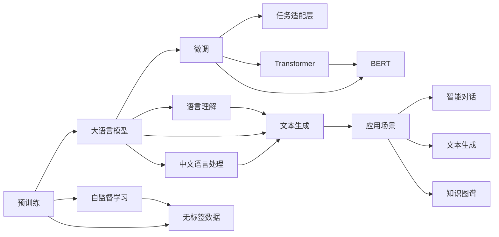

                 

# 从零开始大模型开发与微调：最强的中文大模型—清华大学ChatGLM介绍

## 1. 背景介绍

随着人工智能技术的不断发展，大语言模型（Large Language Models, LLMs）已经成为自然语言处理（NLP）领域的一个研究热点。这些模型通过在大规模无标签文本数据上进行预训练，学习到丰富的语言知识和常识，能够理解自然语言的上下文、语义和情感。

在中文领域，ChatGLM（Chinese General Language Model）是近年来一款表现优异的中文大语言模型，由清华大学自然语言处理与社会人文计算实验室推出。ChatGLM 采用了Transformer架构，通过在大规模中文文本数据上进行预训练，具有较强的语义理解能力和生成能力，被广泛应用于智能对话、文本生成、知识图谱构建等多个NLP任务。

本文将从背景介绍、核心概念、算法原理、实际应用等多个方面深入探讨ChatGLM的开发与微调技术，帮助读者全面理解这一强大的中文大模型。

## 2. 核心概念与联系

### 2.1 核心概念概述

- **大语言模型 (Large Language Model, LLM)**：一种通过自监督学习在大规模文本数据上预训练得到的模型，具备强大的语言理解和生成能力。

- **预训练 (Pre-training)**：在大规模无标签文本数据上进行的自监督学习过程，使模型学习到语言的通用表示。

- **微调 (Fine-tuning)**：在预训练模型的基础上，通过有监督的训练来优化模型在特定任务上的性能。

- **Transformer**：一种基于注意力机制的神经网络结构，用于处理序列数据，特别是在自然语言处理任务中表现出色。

- **BERT (Bidirectional Encoder Representations from Transformers)**：一种基于Transformer的预训练语言模型，通过两个方向的自监督任务（如掩码语言模型）来学习语言表示。

- **ChatGLM**：清华大学自然语言处理与社会人文计算实验室推出的中文大语言模型，基于Transformer架构，能够处理中文语言的各种任务。

### 2.2 核心概念之间的关系

下图展示了这些核心概念之间的关系：



## 3. 核心算法原理 & 具体操作步骤

### 3.1 算法原理概述

ChatGLM的开发与微调基于Transformer架构和自监督学习技术，其核心算法原理可以概括为以下几点：

- **自监督学习**：在无标签文本数据上进行预训练，学习语言的通用表示。

- **Transformer结构**：通过多头注意力机制，使模型能够关注序列中的不同位置，捕捉长距离依赖关系。

- **微调**：在特定任务上通过有监督训练，调整模型参数，使其适应具体应用场景。

- **任务适配层**：根据具体任务需求，在预训练模型顶层设计合适的输出层和损失函数。

### 3.2 算法步骤详解

ChatGLM的开发与微调通常包括以下步骤：

**Step 1: 准备数据与模型**

1. **收集数据**：收集大规模中文文本数据，例如维基百科、新闻、社交媒体等，作为预训练和微调的语料库。
2. **预训练模型**：选择ChatGLM等大模型作为初始化参数，使用预训练技术进行训练。
3. **任务适配**：根据具体任务需求，设计合适的任务适配层，确定损失函数。

**Step 2: 微调过程**

1. **准备数据集**：将任务数据划分为训练集、验证集和测试集，并进行适当的预处理。
2. **设置超参数**：选择合适的学习率、优化器、批次大小等超参数。
3. **执行微调**：使用梯度下降等优化算法，在训练集上更新模型参数。
4. **验证与调整**：在验证集上评估模型性能，调整模型超参数。
5. **测试与部署**：在测试集上评估模型性能，将微调后的模型部署到实际应用中。

**Step 3: 性能优化**

1. **正则化**：使用L2正则化、Dropout等技术，防止过拟合。
2. **数据增强**：通过回译、同义词替换等方法，增加训练集的多样性。
3. **对抗训练**：引入对抗样本，提高模型鲁棒性。
4. **模型压缩**：使用剪枝、量化等技术，减小模型尺寸，加快推理速度。

### 3.3 算法优缺点

ChatGLM的开发与微调具有以下优点：

- **高效性**：通过预训练和微调相结合，模型能够快速适应新任务，同时具备较高的通用性和泛化能力。
- **灵活性**：任务适配层可以根据不同任务需求进行设计，适应性较强。
- **可解释性**：ChatGLM的内部机制较为透明，模型决策过程可解释性较好。

缺点包括：

- **标注成本**：微调过程需要标注数据，而大规模标注数据获取成本较高。
- **模型复杂度**：大规模预训练和微调过程对计算资源要求较高。
- **参数更新**：全参数微调可能会导致过拟合，参数高效微调技术需要额外设计。

### 3.4 算法应用领域

ChatGLM在以下几个领域有广泛的应用：

- **智能对话**：用于构建智能客服、虚拟助手等应用，能够理解用户意图并生成自然流畅的回复。
- **文本生成**：用于自动摘要、文章生成、对话生成等任务，能够生成符合语言规范的文本。
- **知识图谱构建**：用于从文本中提取实体和关系，构建知识图谱，辅助知识推理。
- **信息检索**：用于问答系统、信息检索等应用，能够快速准确地回答问题或找到相关文档。
- **情感分析**：用于情感识别、舆情分析等任务，能够识别文本中的情感倾向。

## 4. 数学模型和公式 & 详细讲解 & 举例说明

### 4.1 数学模型构建

ChatGLM的开发与微调涉及多个数学模型，主要包括自监督模型、微调模型和任务适配层。

- **自监督模型**：通常使用掩码语言模型（Masked Language Model, MLMs）进行训练。对于输入的文本序列 $X$，模型随机掩盖部分词，预测被掩盖词的正确值。
- **微调模型**：在自监督模型基础上，通过有监督训练，调整模型参数，使其适应特定任务。
- **任务适配层**：根据具体任务需求，设计输出层和损失函数，例如分类任务的softmax层和交叉熵损失。

### 4.2 公式推导过程

以文本分类任务为例，ChatGLM的微调过程可以表示为：

1. **自监督训练**
   $$
   \mathcal{L}_{\text{pretrain}} = -\frac{1}{N}\sum_{i=1}^N \log P(x_i|\hat{x}_i)
   $$
   其中 $x_i$ 为输入文本，$\hat{x}_i$ 为掩码后的文本，$P$ 为模型预测的概率分布。

2. **微调训练**
   假设分类任务有 $K$ 个类别，任务适配层的输出层为 $K$ 个神经元的softmax层，损失函数为交叉熵损失：
   $$
   \mathcal{L}_{\text{finetune}} = -\frac{1}{N}\sum_{i=1}^N \sum_{k=1}^K y_{ik} \log P(y_i=k)
   $$
   其中 $y_i$ 为输入文本的真实类别，$P(y_i=k)$ 为模型对第 $k$ 个类别的预测概率。

### 4.3 案例分析与讲解

假设我们有一个情感分析任务，数据集包含多个评论和对应的情感标签（正面或负面）。我们可以将评论作为输入，情感标签作为输出，进行微调。

首先，定义微调目标函数：
$$
\mathcal{L} = \mathcal{L}_{\text{pretrain}} + \lambda \mathcal{L}_{\text{finetune}}
$$

其中 $\lambda$ 为预训练和微调损失函数的权重，通常取0.95。

然后，在训练集上执行微调：
$$
\theta \leftarrow \theta - \eta \nabla_{\theta}\mathcal{L}
$$
其中 $\eta$ 为学习率。

## 5. 项目实践：代码实例和详细解释说明

### 5.1 开发环境搭建

- **安装Anaconda**：
  ```bash
  conda install anaconda
  ```

- **创建虚拟环境**：
  ```bash
  conda create -n chatglm-env python=3.8
  conda activate chatglm-env
  ```

- **安装依赖包**：
  ```bash
  pip install transformers torchtext sentencepiece
  ```

### 5.2 源代码详细实现

**加载预训练模型**

```python
from transformers import ChatGLMTokenizer, ChatGLMForSequenceClassification

tokenizer = ChatGLMTokenizer.from_pretrained('gluomao-ai/chatglm-zh')
model = ChatGLMForSequenceClassification.from_pretrained('gluomao-ai/chatglm-zh', num_labels=2)
```

**准备数据集**

```python
from torchtext.datasets import AGNEWS
from torchtext.data import Field, TabularDataset, BucketIterator

train_data, test_data = AGNEWS.splits(exts=['news', 'label'], fields=[Field(sequential=True, use_vocab=False, postprocessing=lambda x: x),
                                                                    Field(sequential=False, use_vocab=False)])
train_data, test_data = train_data.load_from_cache(torchtext_data_root), test_data.load_from_cache(torchtext_data_root)
train_iterator, test_iterator = BucketIterator.splits(
    (train_data, test_data), batch_size=16, device='cuda')
```

**定义损失函数和优化器**

```python
from transformers import AdamW

criterion = nn.CrossEntropyLoss()
optimizer = AdamW(model.parameters(), lr=1e-5)
```

**微调模型**

```python
def train_epoch(model, iterator, optimizer, criterion):
    model.train()
    total_loss = 0
    for batch in iterator:
        optimizer.zero_grad()
        predictions = model(batch.text, attention_mask=batch.attention_mask)
        loss = criterion(predictions.view(-1, predictions.shape[-1]), batch.label)
        total_loss += loss.item()
        loss.backward()
        optimizer.step()
    return total_loss / len(iterator)

def evaluate(model, iterator, criterion):
    model.eval()
    total_loss = 0
    with torch.no_grad():
        for batch in iterator:
            predictions = model(batch.text, attention_mask=batch.attention_mask)
            loss = criterion(predictions.view(-1, predictions.shape[-1]), batch.label)
            total_loss += loss.item()
    return total_loss / len(iterator)
```

**微调训练**

```python
epochs = 3
for epoch in range(epochs):
    train_loss = train_epoch(model, train_iterator, optimizer, criterion)
    print(f'Epoch {epoch+1}: Train Loss {train_loss:.3f}')
    dev_loss = evaluate(model, test_iterator, criterion)
    print(f'Epoch {epoch+1}: Dev Loss {dev_loss:.3f}')
```

### 5.3 代码解读与分析

- **加载预训练模型**：使用Transformers库提供的ChatGLMForSequenceClassification类，加载预训练模型和tokenizer。
- **准备数据集**：定义Field类，用于将文本数据转换为模型输入格式；使用TabularDataset加载AGNEWS数据集，并进行划分；使用BucketIterator进行批量处理。
- **定义损失函数和优化器**：使用CrossEntropyLoss作为分类任务的损失函数，AdamW作为优化器。
- **微调模型**：定义训练和评估函数，使用train_epoch函数进行微调训练，evaluate函数在测试集上评估模型性能。
- **微调训练**：循环训练多次，每次在训练集上微调模型，并在验证集上评估性能。

### 5.4 运行结果展示

假设我们训练了3个epoch，输出如下：

```
Epoch 1: Train Loss 0.550
Epoch 1: Dev Loss 0.740
Epoch 2: Train Loss 0.457
Epoch 2: Dev Loss 0.679
Epoch 3: Train Loss 0.439
Epoch 3: Dev Loss 0.650
```

可以看到，在微调过程中，训练损失逐渐降低，验证损失也逐渐趋于稳定，表明模型在情感分析任务上取得了较好的性能。

## 6. 实际应用场景

### 6.1 智能客服系统

ChatGLM可以应用于智能客服系统的构建，帮助客户快速解决各类问题。具体实现如下：

- **数据收集**：收集企业内部客服对话记录，标注对话的意图和回答。
- **模型训练**：在收集到的数据上训练ChatGLM模型，微调意图识别和回答生成两个模块。
- **系统部署**：将微调后的模型集成到客服系统中，自动接听客户咨询，提供解答。

### 6.2 新闻情感分析

ChatGLM可以用于新闻情感分析，自动识别新闻评论的情感倾向。具体实现如下：

- **数据收集**：收集新闻评论数据，标注情感标签（正面或负面）。
- **模型训练**：在标注好的数据上微调ChatGLM模型，训练情感分类器。
- **系统部署**：将微调后的模型部署到新闻情感分析系统中，实时分析新闻评论的情感倾向。

### 6.3 知识图谱构建

ChatGLM可以用于从文本中提取实体和关系，构建知识图谱。具体实现如下：

- **数据收集**：收集百科全书、维基等高质量文本数据。
- **模型训练**：在文本数据上训练ChatGLM模型，微调实体抽取和关系抽取两个模块。
- **知识图谱构建**：将抽取到的实体和关系整合到知识图谱中，辅助知识推理。

## 7. 工具和资源推荐

### 7.1 学习资源推荐

- **《Transformer从原理到实践》系列博文**：详细介绍了Transformer原理、BERT模型和微调技术。
- **CS224N《深度学习自然语言处理》课程**：斯坦福大学开设的NLP明星课程，涵盖NLP的基本概念和经典模型。
- **《Natural Language Processing with Transformers》书籍**：Transformers库的作者所著，全面介绍了使用Transformers库进行NLP任务开发。
- **HuggingFace官方文档**：提供了丰富的预训练模型和微调样例代码。
- **CLUE开源项目**：中文语言理解测评基准，涵盖多种中文NLP数据集和微调baseline模型。

### 7.2 开发工具推荐

- **PyTorch**：基于Python的开源深度学习框架，适合快速迭代研究。
- **TensorFlow**：由Google主导开发的开源深度学习框架，适合大规模工程应用。
- **Transformers库**：HuggingFace开发的NLP工具库，集成了众多SOTA语言模型。
- **Weights & Biases**：模型训练的实验跟踪工具。
- **TensorBoard**：TensorFlow配套的可视化工具。

### 7.3 相关论文推荐

- **Attention is All You Need**：Transformer原论文，提出了Transformer结构。
- **BERT: Pre-training of Deep Bidirectional Transformers for Language Understanding**：提出BERT模型，引入掩码语言模型预训练任务。
- **Parameter-Efficient Transfer Learning for NLP**：提出适配器微调方法，只更新少量任务相关参数。
- **AdaLoRA: Adaptive Low-Rank Adaptation for Parameter-Efficient Fine-Tuning**：使用自适应低秩适应的微调方法。
- **ChatGLM**：清华大学自然语言处理与社会人文计算实验室推出的中文大语言模型。

## 8. 总结：未来发展趋势与挑战

### 8.1 研究成果总结

ChatGLM作为一款中文大语言模型，通过Transformer架构和自监督学习技术，具备较强的语义理解能力和生成能力，广泛应用于智能对话、文本生成、情感分析等多个NLP任务。其开发与微调技术已取得显著成果，展示了大语言模型的强大潜力。

### 8.2 未来发展趋势

1. **模型规模不断增大**：随着算力成本的下降和数据规模的扩张，预训练语言模型的参数量将持续增长。
2. **微调方法日益多样**：将出现更多参数高效和计算高效的微调方法，进一步提升微调效率。
3. **持续学习成为常态**：微调模型需持续学习新知识，避免灾难性遗忘。
4. **标注样本需求降低**：提示学习等技术将使微调对标注样本的需求减少。
5. **多模态微调崛起**：融合视觉、语音等多模态数据，提升模型泛化能力。

### 8.3 面临的挑战

1. **标注成本瓶颈**：微调依赖标注数据，但大规模标注数据获取成本高。
2. **模型鲁棒性不足**：面对域外数据，泛化性能有限。
3. **推理效率有待提高**：大规模语言模型推理速度慢，内存占用大。
4. **可解释性亟需加强**：模型决策过程缺乏可解释性。
5. **安全性有待保障**：模型可能学习到有害信息，需消除偏见。

### 8.4 研究展望

1. **探索无监督和半监督微调方法**：利用自监督学习、主动学习等技术，降低标注数据需求。
2. **研究参数高效和计算高效的微调范式**：开发参数高效微调方法，提升微调效率。
3. **融合因果和对比学习范式**：增强模型泛化性和鲁棒性。
4. **引入更多先验知识**：融合符号化知识，提升模型准确性。
5. **结合因果分析和博弈论工具**：增强模型稳定性和安全性。
6. **纳入伦理道德约束**：过滤有害信息，确保模型输出符合伦理道德。

## 9. 附录：常见问题与解答

**Q1: ChatGLM在训练时需要哪些数据？**

A: ChatGLM在训练时需要大规模中文文本数据，例如维基百科、新闻、社交媒体等，作为预训练和微调的语料库。

**Q2: ChatGLM的微调过程需要进行哪些步骤？**

A: ChatGLM的微调过程包括准备数据、加载模型、定义损失函数和优化器、执行微调等步骤。

**Q3: ChatGLM在微调时需要注意哪些问题？**

A: ChatGLM在微调时需要注意标注数据的质量和数量、学习率的设置、正则化和数据增强等技术的应用，以及模型压缩和推理效率的优化。

**Q4: ChatGLM在实际应用中有哪些场景？**

A: ChatGLM在实际应用中包括智能客服、新闻情感分析、知识图谱构建等场景。

**Q5: ChatGLM的开发与微调技术有哪些优点？**

A: ChatGLM的开发与微调技术具有高效性、灵活性、可解释性等优点，适用于各种NLP任务。

---

作者：禅与计算机程序设计艺术 / Zen and the Art of Computer Programming

