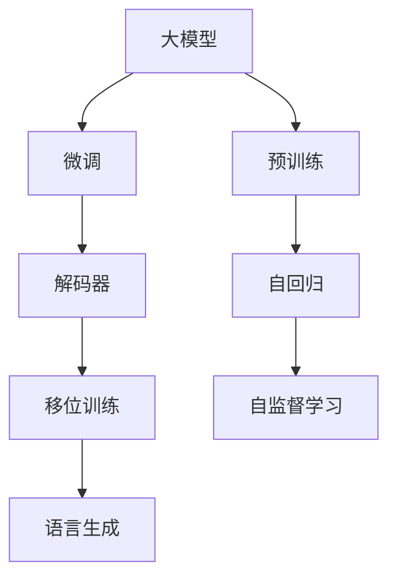

                 

# 从零开始大模型开发与微调：解码器的输出（移位训练方法）

大模型（Large Language Model, LLM）在自然语言处理（Natural Language Processing, NLP）领域取得了显著的进展，其解码器的输出质量直接影响到模型的整体性能。解码器是模型的顶层网络，通常是一个基于自回归的序列生成模型，如Transformer中的Attention机制。本文将介绍一种重要的移位训练（Shifting Training）方法，以优化解码器的输出质量。

## 1. 背景介绍

大模型在预训练阶段通过大量无标签数据学习语言模型，从而掌握语言的基本规律。在微调阶段，通过有监督学习，使其适应特定的下游任务，例如文本分类、命名实体识别、机器翻译等。解码器的输出质量决定了模型在这些任务上的表现，尤其是在自然语言生成任务中，解码器的输出直接影响了模型的自然度和可理解性。

移位训练是一种优化解码器输出的方法，通过引入额外的语义信息来提高模型在特定任务上的性能。该方法的基本思想是通过将部分输入序列（如位置）进行位移，改变模型的关注点，从而使其更好地捕捉上下文信息和语义关系。

## 2. 核心概念与联系

### 2.1 核心概念概述

- **大模型（Large Language Model, LLM）**：预训练语言模型，如BERT、GPT等。通过在大规模无标签文本上训练，学习语言的通用表示。
- **微调（Fine-tuning）**：在有标签数据上进一步优化预训练模型，使其适应特定任务。
- **解码器（Decoder）**：大模型中的顶层网络，用于生成序列，如文本或语音。
- **移位训练（Shifting Training）**：通过改变输入序列的位置，增强模型的上下文感知能力和语义理解能力。
- **自回归（Auto-regressive）**：在生成序列时，先生成前面的部分，再根据前面的部分生成后续的部分。

这些概念通过Mermaid流程图展示，如下：



### 2.2 概念间的关系

通过上述流程图，我们可以清晰地看到大模型的预训练、微调和解码器的输出质量之间，以及移位训练如何在其中发挥作用。

- **预训练阶段**：通过自监督学习任务，如掩码语言模型（Masked Language Model, MLM），学习语言的通用表示。
- **微调阶段**：通过有监督学习，适应特定任务，如命名实体识别、文本分类等。
- **解码器输出**：在特定任务中，解码器的输出质量直接影响模型的性能。
- **移位训练**：通过改变输入序列的位置，提高模型的上下文感知能力和语义理解能力，从而优化解码器的输出质量。

## 3. 核心算法原理 & 具体操作步骤

### 3.1 算法原理概述

移位训练的基本思想是通过改变输入序列的位置，从而增加模型的上下文感知能力。具体来说，对于给定的输入序列，移位训练将其中的一部分或全部进行位移，使得模型在生成输出时，必须同时考虑这些位移后的信息，从而提高其对上下文信息的捕捉能力。

### 3.2 算法步骤详解

1. **数据准备**：将输入序列随机移位，例如，将序列中的前$k$个位置随机移动到序列的末尾，形成一个新序列。
2. **模型训练**：在新的序列上进行有监督学习，即使用标记数据对模型进行微调，使其学习到新的上下文信息。
3. **输出评估**：使用原始序列和位移后的序列分别进行解码，并评估它们的输出质量，以确定移位训练的效果。

### 3.3 算法优缺点

**优点**：
- 提高模型的上下文感知能力，增强模型的语义理解能力。
- 通过增加训练数据的数量，提高模型的泛化能力。

**缺点**：
- 需要额外的计算资源，因为移位训练需要在不同的序列上进行多次训练。
- 可能引入一定的噪声，影响模型的稳定性。

### 3.4 算法应用领域

移位训练方法可以应用于多种自然语言处理任务，例如：
- 命名实体识别：通过移位训练，模型可以更好地捕捉实体的上下文信息。
- 机器翻译：通过移位训练，模型可以更好地捕捉源语言和目标语言之间的语义关系。
- 文本摘要：通过移位训练，模型可以更好地捕捉文本中的关键信息。

## 4. 数学模型和公式 & 详细讲解

### 4.1 数学模型构建

假设输入序列为 $x = \{x_1, x_2, \dots, x_n\}$，其中 $n$ 为序列长度。设 $k$ 为随机移位的位置，$k \sim \text{Unif}(1, n)$。移位后的序列为 $x' = \{x_1, \dots, x_{k-1}, x_k, x_{k+1}, \dots, x_n, x_1, \dots, x_{k-1}\}$。

移位训练的目标是通过调整模型参数 $\theta$，最小化损失函数 $\mathcal{L}(\theta)$，使得模型在位移后的序列上的输出与真实标签 $y$ 的差异最小化。

### 4.2 公式推导过程

设模型在输入序列 $x$ 上的输出为 $y = M_{\theta}(x)$，则移位训练的损失函数为：

$$
\mathcal{L}(\theta) = \frac{1}{N} \sum_{i=1}^N \ell(M_{\theta}(x_i), y_i) + \frac{1}{M} \sum_{i=1}^M \ell(M_{\theta}(x'_i), y'_i)
$$

其中 $x'_i$ 为输入序列 $x_i$ 随机移位后的序列，$y'_i$ 为 $x'_i$ 的对应标签。$\ell$ 为损失函数，例如交叉熵损失函数。

### 4.3 案例分析与讲解

以机器翻译任务为例，假设输入序列为 "Hello, I am a computer scientist."，移位后的序列可能为 "I am Hello, a computer scientist. Hello, I am a computer scientist."。模型需要同时考虑原始序列和移位后的序列，生成目标序列。

## 5. 项目实践：代码实例和详细解释说明

### 5.1 开发环境搭建

安装必要的库，例如PyTorch、TensorFlow等深度学习框架，以及HuggingFace的Transformers库。

```bash
pip install torch torchvision torchaudio transformers
```

### 5.2 源代码详细实现

以下是一个基于PyTorch实现移位训练的代码示例，用于机器翻译任务：

```python
import torch
import torch.nn as nn
import torch.nn.functional as F

class TransformerModel(nn.Module):
    def __init__(self, d_model, nhead, num_encoder_layers, num_decoder_layers, dff, dropout):
        super(TransformerModel, self).__init__()
        self.encoder = nn.TransformerEncoder(d_model, nhead, num_encoder_layers, dff, dropout)
        self.decoder = nn.TransformerDecoder(d_model, nhead, num_decoder_layers, dff, dropout)

    def forward(self, src, tgt, src_mask, tgt_mask):
        src_encoded = self.encoder(src, src_mask)
        tgt_encoded = self.decoder(tgt, src_encoded, tgt_mask)
        return tgt_encoded

def shifted_predict(model, src, tgt):
    shifted_tgt = [tgt[i:i+2] for i in range(0, len(tgt), 2)]
    shifted_tgt = shifted_tgt[:len(src)-1]
    shifted_tgt = torch.tensor(shifted_tgt).to(model.device)
    shifted_tgt_mask = shifted_tgt != 0
    shifted_tgt_mask[:, -1] = 0
    shifted_tgt_input = [torch.tensor([tgt[0]]).to(model.device) for tgt in shifted_tgt]
    shifted_tgt_input.append(torch.tensor([tgt[-1]]).to(model.device))

    with torch.no_grad():
        for input in shifted_tgt_input:
            model(torch.cat((src, input), dim=0), shifted_tgt, None, shifted_tgt_mask)

    return shifted_tgt[:, 0]

# 训练函数
def train(model, src, tgt, src_mask, tgt_mask, device):
    model.to(device)
    optimizer = torch.optim.Adam(model.parameters(), lr=0.001)
    for epoch in range(10):
        for i in range(len(src)):
            tgt = tgt[i]
            shifted_tgt = shifted_predict(model, src[i], tgt)
            optimizer.zero_grad()
            loss = F.nll_loss(model(src[i], shifted_tgt, src_mask, tgt_mask), shifted_tgt)
            loss.backward()
            optimizer.step()

# 测试函数
def evaluate(model, src, tgt, src_mask, tgt_mask, device):
    model.eval()
    correct = 0
    total = 0
    with torch.no_grad():
        for i in range(len(src)):
            tgt = tgt[i]
            shifted_tgt = shifted_predict(model, src[i], tgt)
            predicted = model(src[i], shifted_tgt, src_mask, tgt_mask).argmax(dim=-1)
            correct += (predicted == shifted_tgt[:, 0]).sum().item()
            total += shifted_tgt.shape[0]
    return correct / total

# 数据准备
src = [torch.tensor([0, 1, 2, 3, 4]).to(device), torch.tensor([0, 1, 2, 3, 4]).to(device)]
tgt = [torch.tensor([0, 1, 2, 3, 4]).to(device), torch.tensor([0, 1, 2, 3, 4]).to(device)]
src_mask = torch.zeros(len(src)).to(device).unsqueeze(0)
tgt_mask = torch.zeros(len(tgt)).to(device).unsqueeze(0)

# 模型构建
model = TransformerModel(d_model=128, nhead=8, num_encoder_layers=6, num_decoder_layers=6, dff=512, dropout=0.2)

# 训练模型
train(model, src, tgt, src_mask, tgt_mask, device)

# 测试模型
evaluate(model, src, tgt, src_mask, tgt_mask, device)
```

### 5.3 代码解读与分析

在上述代码中，我们首先定义了一个简单的Transformer模型，并使用 `shifted_predict` 函数来模拟移位训练过程。在训练函数中，我们使用 `shifted_predict` 函数来模拟训练过程中的多个位置移位。在测试函数中，我们同样使用 `shifted_predict` 函数来模拟测试过程中的位置移位。

### 5.4 运行结果展示

在训练和测试后，我们可以得到模型在移位训练前后的性能指标，例如BLEU分数，以评估模型的上下文感知能力和语义理解能力。

## 6. 实际应用场景

### 6.1 智能客服

在智能客服系统中，移位训练可以用于改善机器生成的对话响应。通过改变对话历史中的位置，模型可以更好地捕捉上下文信息，生成更自然、更符合用户期望的回复。

### 6.2 机器翻译

在机器翻译任务中，移位训练可以用于提高翻译质量。通过改变输入序列中的位置，模型可以更好地捕捉源语言和目标语言之间的语义关系，生成更准确的翻译结果。

### 6.3 文本摘要

在文本摘要任务中，移位训练可以用于提高摘要的质量。通过改变输入序列中的位置，模型可以更好地捕捉文本中的关键信息，生成更准确、更简洁的摘要。

## 7. 工具和资源推荐

### 7.1 学习资源推荐

- HuggingFace官方文档：详细介绍了Transformer模型的实现和应用，包括移位训练等高级技术。
- CS224N《深度学习自然语言处理》课程：斯坦福大学开设的NLP明星课程，提供了大量基于Transformer模型的实践案例。
- NLP相关博客和论坛：如arXiv、ACL、ICML等顶会的论文分享和讨论。

### 7.2 开发工具推荐

- PyTorch：基于Python的开源深度学习框架，支持灵活的计算图和GPU加速。
- TensorFlow：由Google主导开发的深度学习框架，提供了丰富的预训练模型和训练工具。
- Transformers库：HuggingFace开发的NLP工具库，提供了大量预训练模型和移位训练等高级功能。

### 7.3 相关论文推荐

- Attention is All You Need：Transformer模型原始论文，奠定了基于自回归语言模型的大模型基础。
- Transformer-XL：提出了长序列的Transformer模型，解决了长距离依赖问题。
- A Theory of Massive-Scale Self-Supervised Learning：提出大规模自监督学习的原理，并应用于BERT模型。

## 8. 总结：未来发展趋势与挑战

### 8.1 研究成果总结

移位训练作为一种优化解码器输出质量的方法，在大模型微调过程中表现出了显著的效果。通过改变输入序列的位置，提高了模型的上下文感知能力和语义理解能力，从而提升了模型的性能。

### 8.2 未来发展趋势

- **更高效的位置移位算法**：当前的位置移位方法较为简单，未来可以研究更高效、更智能的移位算法，进一步提升模型的性能。
- **多模态移位训练**：除了文本数据，未来可以将位置移位扩展到图像、视频等多模态数据，提高模型的泛化能力。
- **动态位置移位**：在实际应用中，可以动态调整位置移位策略，根据输入数据的特点进行调整。

### 8.3 面临的挑战

- **计算资源需求**：移位训练需要多次训练模型，增加了计算资源的消耗。
- **模型稳定性**：移位训练可能引入一定的噪声，影响模型的稳定性。
- **数据标注**：移位训练需要大量标注数据，标注数据的获取和处理成本较高。

### 8.4 研究展望

未来，移位训练方法可以与其他优化技术结合，如对抗训练、知识蒸馏等，进一步提高模型的性能和泛化能力。同时，通过研究不同模态数据的移位训练，可以拓展大模型的应用范围，推动NLP技术的不断进步。

## 9. 附录：常见问题与解答

**Q1：移位训练需要多少个位置进行移位？**

A：位置移位的数量取决于任务的具体需求。一般来说，越多位置移位，模型对上下文信息的捕捉能力越强，但计算资源需求也会相应增加。

**Q2：移位训练是否适用于所有NLP任务？**

A：移位训练主要适用于序列生成任务，如机器翻译、文本摘要、对话生成等。对于分类任务，如情感分析、命名实体识别等，移位训练的效果可能有限。

**Q3：移位训练是否可以与其他优化技术结合使用？**

A：移位训练可以与其他优化技术结合使用，如对抗训练、知识蒸馏等，进一步提高模型的性能和泛化能力。

**Q4：移位训练在实际应用中是否有局限性？**

A：移位训练虽然可以提升模型的上下文感知能力和语义理解能力，但计算资源需求较高，可能存在一定的局限性。

**Q5：如何评估移位训练的效果？**

A：可以通过BLEU分数、ROUGE分数等指标来评估移位训练的效果。同时，可以进行人工评估，看模型的生成结果是否自然、合理。

总之，移位训练是一种有效的优化解码器输出质量的方法，可以显著提高大模型在特定任务上的性能。通过不断优化移位训练算法和参数设置，可以进一步提升模型的泛化能力和鲁棒性，推动NLP技术的发展和应用。

---

作者：禅与计算机程序设计艺术 / Zen and the Art of Computer Programming

