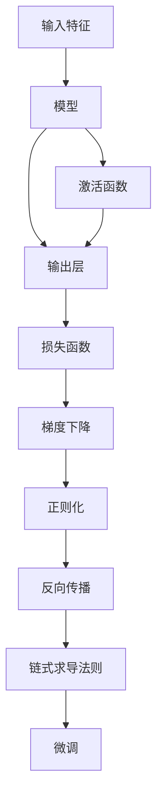
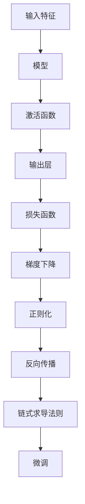

                 

# 从零开始大模型开发与微调：链式求导法则

> 关键词：大模型开发,微调,链式求导法则,深度学习,梯度传播,反向传播

## 1. 背景介绍

### 1.1 问题由来
随着深度学习技术的快速发展，大模型（Large Models）在人工智能领域的应用越来越广泛。从计算机视觉到自然语言处理，从推荐系统到金融预测，大模型的强大表现力使其成为许多行业的首选技术。然而，大模型的开发和训练成本非常高，需要大量的计算资源和时间。为了降低成本，研究人员和工程师们提出了许多方法，其中一种重要的方法是微调（Fine-tuning）。

微调是指在大模型上添加特定的任务层，并使用小规模的数据集进行训练，以适应新的任务。这种方法可以在保持大模型原有能力的基础上，进一步提升特定任务的表现，同时减少训练时间。

链式求导法则是微调中不可或缺的一部分。在微调过程中，我们需要计算模型参数对损失函数的导数，以更新参数并最小化损失。由于模型的复杂性，导数计算非常复杂，而链式求导法则提供了一种有效的解决方案。

### 1.2 问题核心关键点
链式求导法则是微调中计算梯度的核心方法。它利用函数的复合性质，通过逐层计算每个函数的导数，最终得到整体函数的导数。这一方法不仅在微调中使用广泛，也广泛应用于深度学习的各个领域。

在微调中，我们需要：
- 定义损失函数：通常是分类任务中的交叉熵损失、回归任务中的均方误差等。
- 定义模型：可以是自回归模型、卷积神经网络等。
- 定义输入数据：包括输入特征和标签等。
- 计算梯度：使用链式求导法则计算模型参数对损失函数的导数。
- 更新参数：使用梯度下降等优化算法更新模型参数。

## 2. 核心概念与联系

### 2.1 核心概念概述

为了更好地理解链式求导法则，本节将介绍几个密切相关的核心概念：

- **大模型（Large Models）**：指具有亿万级别参数的深度神经网络模型，如BERT、GPT等。这些模型通过在大规模无标签数据上进行预训练，学习到丰富的特征表示。

- **微调（Fine-tuning）**：在大模型上添加特定任务层，使用小规模数据集进行训练，以适应新的任务。

- **链式求导法则（Chain Rule）**：利用函数的复合性质，通过逐层计算每个函数的导数，最终得到整体函数的导数。

- **反向传播（Backpropagation）**：将误差从输出层逐层传递到输入层，计算每个参数对误差的影响，从而更新模型参数。

- **梯度下降（Gradient Descent）**：通过计算梯度，使用优化算法（如SGD、Adam等）更新模型参数，最小化损失函数。

- **正则化（Regularization）**：通过添加正则项，如L2正则化，防止模型过拟合。

- **激活函数（Activation Function）**：如ReLU、Sigmoid、Tanh等，用于引入非线性特性。

- **损失函数（Loss Function）**：如交叉熵损失、均方误差损失等，用于衡量模型预测结果与真实标签之间的差异。

这些核心概念之间的逻辑关系可以通过以下Mermaid流程图来展示：



这个流程图展示了大模型微调过程中各个核心概念之间的关系：

1. 输入特征经过模型和激活函数，得到输出层。
2. 输出层与真实标签通过损失函数计算误差。
3. 利用梯度下降算法和链式求导法则计算梯度。
4. 正则化项被加入到梯度中，防止过拟合。
5. 反向传播将梯度传递回每一层。
6. 使用链式求导法则，计算模型参数对损失函数的导数。
7. 微调通过更新模型参数，最小化损失函数。

### 2.2 概念间的关系

这些核心概念之间存在着紧密的联系，形成了大模型微调的完整生态系统。下面我通过几个Mermaid流程图来展示这些概念之间的关系。

#### 2.2.1 大模型微调的流程



这个流程图展示了大模型微调的基本流程：

1. 输入特征经过模型和激活函数，得到输出层。
2. 输出层与真实标签通过损失函数计算误差。
3. 利用梯度下降算法和链式求导法则计算梯度。
4. 正则化项被加入到梯度中，防止过拟合。
5. 反向传播将梯度传递回每一层。
6. 使用链式求导法则，计算模型参数对损失函数的导数。
7. 微调通过更新模型参数，最小化损失函数。

#### 2.2.2 反向传播与链式求导法则的关系


这个流程图展示了反向传播和链式求导法则之间的关系：

1. 激活函数引入非线性特性，使得模型能够处理非线性问题。
2. 反向传播将误差从输出层逐层传递到输入层，计算每个参数对误差的影响。
3. 链式求导法则通过逐层计算每个函数的导数，最终得到整体函数的导数。
4. 梯度下降使用链式求导法则计算梯度，更新模型参数，最小化损失函数。

## 3. 核心算法原理 & 具体操作步骤

### 3.1 算法原理概述

链式求导法则是微调中计算梯度的核心方法。它利用函数的复合性质，通过逐层计算每个函数的导数，最终得到整体函数的导数。这一方法不仅在微调中使用广泛，也广泛应用于深度学习的各个领域。

在微调中，我们需要：
- 定义损失函数：通常是分类任务中的交叉熵损失、回归任务中的均方误差等。
- 定义模型：可以是自回归模型、卷积神经网络等。
- 定义输入数据：包括输入特征和标签等。
- 计算梯度：使用链式求导法则计算模型参数对损失函数的导数。
- 更新参数：使用梯度下降等优化算法更新模型参数。

### 3.2 算法步骤详解

以下是链式求导法则在微调中的具体应用步骤：

1. **定义损失函数和模型**：
   - 损失函数：通常是分类任务中的交叉熵损失，记为 $L = -\sum_{i=1}^{N} y_i \log p(x_i)$，其中 $y_i$ 是真实标签，$p(x_i)$ 是模型预测的概率。
   - 模型：假设模型为 $f_{\theta}(x)$，其中 $\theta$ 是模型的参数。

2. **定义输入数据**：
   - 输入特征：假设输入特征为 $x$。
   - 真实标签：假设真实标签为 $y$。

3. **前向传播**：
   - 将输入特征 $x$ 传递到模型 $f_{\theta}(x)$，得到输出 $z$。
   - 将输出 $z$ 和真实标签 $y$ 传递到损失函数 $L(z, y)$，得到损失值 $L$。

4. **计算梯度**：
   - 使用链式求导法则，计算每个参数 $\theta$ 对损失函数 $L$ 的导数 $\nabla_{\theta}L$。
   - 链式求导法则公式如下：
     \[
     \nabla_{\theta}L = \nabla_{\theta}L(z, y) = \nabla_{\theta}f_{\theta}(x) \cdot \nabla_{z}L(z, y)
     \]
     其中 $\nabla_{z}L(z, y)$ 是通过反向传播计算得到的。

5. **更新参数**：
   - 使用梯度下降算法，更新模型参数 $\theta$：
     \[
     \theta \leftarrow \theta - \eta \nabla_{\theta}L
     \]
     其中 $\eta$ 是学习率。

### 3.3 算法优缺点

链式求导法则在微调中有以下几个优点和缺点：

**优点**：
- 可以计算复杂模型的高阶导数。
- 能够处理非线性函数。
- 能够传播误差，指导模型参数更新。

**缺点**：
- 计算复杂度高，特别是对于深层网络。
- 对超参数（如学习率、正则化强度等）敏感。
- 可能会存在梯度消失或梯度爆炸问题。

### 3.4 算法应用领域

链式求导法则在大模型微调中的应用非常广泛，适用于各种NLP任务，如文本分类、命名实体识别、机器翻译等。以下是一些具体的应用领域：

- **文本分类**：在文本分类任务中，链式求导法则可以帮助模型学习文本特征，最小化交叉熵损失，提升分类准确率。
- **命名实体识别**：在命名实体识别任务中，链式求导法则可以帮助模型学习实体边界和类型，最小化损失函数，提高识别精度。
- **机器翻译**：在机器翻译任务中，链式求导法则可以帮助模型学习语言映射，最小化均方误差，提升翻译质量。
- **情感分析**：在情感分析任务中，链式求导法则可以帮助模型学习情感分类，最小化交叉熵损失，提高情感识别准确率。

## 4. 数学模型和公式 & 详细讲解 & 举例说明

### 4.1 数学模型构建

在微调中，我们需要使用链式求导法则计算模型参数对损失函数的导数。这里以二分类任务为例，详细讲解链式求导法则的数学模型构建过程。

设模型 $f_{\theta}(x)$ 的输出为 $z$，损失函数 $L(z, y)$ 为二元交叉熵损失，其中 $z$ 表示模型预测的概率，$y$ 表示真实标签，假设 $z$ 和 $y$ 均为标量。

**数学模型构建**：
- 定义输入特征 $x$ 和真实标签 $y$。
- 定义模型 $f_{\theta}(x)$。
- 定义损失函数 $L(z, y)$，其中 $z = f_{\theta}(x)$。

### 4.2 公式推导过程

以下是链式求导法则在二分类任务中的公式推导过程：

1. **定义损失函数和模型**：
   - 假设 $y = 0$ 或 $y = 1$，分别表示负类和正类。
   - 损失函数为二元交叉熵损失，记为 $L(z, y) = -y \log z - (1-y) \log (1-z)$。

2. **前向传播**：
   - 将输入特征 $x$ 传递到模型 $f_{\theta}(x)$，得到输出 $z = f_{\theta}(x)$。
   - 将输出 $z$ 和真实标签 $y$ 传递到损失函数 $L(z, y)$，得到损失值 $L$。

3. **计算梯度**：
   - 使用链式求导法则，计算每个参数 $\theta$ 对损失函数 $L$ 的导数 $\nabla_{\theta}L$。
   - 链式求导法则公式如下：
     \[
     \nabla_{\theta}L = \nabla_{\theta}L(z, y) = \nabla_{\theta}f_{\theta}(x) \cdot \nabla_{z}L(z, y)
     \]

4. **计算导数**：
   - 根据链式求导法则，计算每个参数 $\theta$ 对损失函数 $L$ 的导数 $\nabla_{\theta}L$。
   - 计算过程如下：
     \[
     \nabla_{z}L(z, y) = -\frac{y}{z} + \frac{1-y}{1-z}
     \]
     \[
     \nabla_{\theta}f_{\theta}(x) = \frac{\partial f_{\theta}(x)}{\partial \theta}
     \]
     \[
     \nabla_{\theta}L = \frac{\partial f_{\theta}(x)}{\partial \theta} \cdot (-\frac{y}{z} + \frac{1-y}{1-z})
     \]

5. **更新参数**：
   - 使用梯度下降算法，更新模型参数 $\theta$：
     \[
     \theta \leftarrow \theta - \eta \nabla_{\theta}L
     \]

### 4.3 案例分析与讲解

这里以BERT模型为例，详细讲解链式求导法则在微调中的应用。

**BERT模型的前向传播**：
- 输入特征 $x$ 传递到BERT模型，得到输出 $z$。
- 将输出 $z$ 和真实标签 $y$ 传递到损失函数 $L(z, y)$，得到损失值 $L$。

**计算梯度**：
- 使用链式求导法则，计算每个参数 $\theta$ 对损失函数 $L$ 的导数 $\nabla_{\theta}L$。
- BERT模型的隐藏层有12个，每个隐藏层都需要计算梯度。

**更新参数**：
- 使用梯度下降算法，更新BERT模型的参数 $\theta$。

## 5. 项目实践：代码实例和详细解释说明

### 5.1 开发环境搭建

在进行微调实践前，我们需要准备好开发环境。以下是使用Python进行PyTorch开发的环境配置流程：

1. 安装Anaconda：从官网下载并安装Anaconda，用于创建独立的Python环境。

2. 创建并激活虚拟环境：
```bash
conda create -n pytorch-env python=3.8 
conda activate pytorch-env
```

3. 安装PyTorch：根据CUDA版本，从官网获取对应的安装命令。例如：
```bash
conda install pytorch torchvision torchaudio cudatoolkit=11.1 -c pytorch -c conda-forge
```

4. 安装Transformers库：
```bash
pip install transformers
```

5. 安装各类工具包：
```bash
pip install numpy pandas scikit-learn matplotlib tqdm jupyter notebook ipython
```

完成上述步骤后，即可在`pytorch-env`环境中开始微调实践。

### 5.2 源代码详细实现

这里我们以文本分类任务为例，给出使用PyTorch和Transformers库对BERT模型进行微调的完整代码实现。

首先，定义BERT模型和损失函数：

```python
from transformers import BertForSequenceClassification, BertTokenizer
import torch
from torch import nn

model = BertForSequenceClassification.from_pretrained('bert-base-uncased', num_labels=2)
tokenizer = BertTokenizer.from_pretrained('bert-base-uncased')
device = torch.device('cuda' if torch.cuda.is_available() else 'cpu')

# 定义损失函数
criterion = nn.CrossEntropyLoss()
```

然后，定义训练和评估函数：

```python
def train_epoch(model, dataset, optimizer, device):
    model.train()
    total_loss = 0
    total_correct = 0
    for data in dataset:
        input_ids = data[0].to(device)
        attention_mask = data[1].to(device)
        labels = data[2].to(device)
        optimizer.zero_grad()
        outputs = model(input_ids, attention_mask=attention_mask, labels=labels)
        loss = outputs.loss
        total_loss += loss.item()
        correct = (outputs.logits.argmax(dim=1) == labels).float().sum().item()
        total_correct += correct
        loss.backward()
        optimizer.step()
    return total_loss / len(dataset), total_correct / len(dataset)

def evaluate(model, dataset, device):
    model.eval()
    total_correct = 0
    total_loss = 0
    with torch.no_grad():
        for data in dataset:
            input_ids = data[0].to(device)
            attention_mask = data[1].to(device)
            labels = data[2].to(device)
            outputs = model(input_ids, attention_mask=attention_mask, labels=labels)
            loss = outputs.loss
            total_loss += loss.item()
            correct = (outputs.logits.argmax(dim=1) == labels).float().sum().item()
            total_correct += correct
    return total_correct / len(dataset), total_loss / len(dataset)
```

最后，启动训练流程并在测试集上评估：

```python
epochs = 3
batch_size = 16
learning_rate = 2e-5

train_dataset = ...
val_dataset = ...
test_dataset = ...

optimizer = torch.optim.Adam(model.parameters(), lr=learning_rate)

for epoch in range(epochs):
    train_loss, train_acc = train_epoch(model, train_dataset, optimizer, device)
    val_loss, val_acc = evaluate(model, val_dataset, device)
    print(f'Epoch {epoch+1}, Train Loss: {train_loss:.4f}, Train Acc: {train_acc:.4f}, Val Loss: {val_loss:.4f}, Val Acc: {val_acc:.4f}')

test_acc, test_loss = evaluate(model, test_dataset, device)
print(f'Test Acc: {test_acc:.4f}, Test Loss: {test_loss:.4f}')
```

以上就是使用PyTorch对BERT进行文本分类任务微调的完整代码实现。可以看到，得益于Transformers库的强大封装，我们可以用相对简洁的代码完成BERT模型的加载和微调。

### 5.3 代码解读与分析

让我们再详细解读一下关键代码的实现细节：

**BERT模型的定义**：
- 使用Transformers库中的`BertForSequenceClassification`定义BERT模型，并加载预训练权重。
- 定义`BertTokenizer`，用于对输入文本进行分词和编码。
- 定义训练和评估函数，分别用于前向传播和反向传播。

**训练和评估函数**：
- 使用PyTorch的DataLoader对数据集进行批次化加载，供模型训练和推理使用。
- 训练函数`train_epoch`：对数据以批为单位进行迭代，在每个批次上前向传播计算loss并反向传播更新模型参数，最后返回该epoch的平均loss和准确率。
- 评估函数`evaluate`：与训练类似，不同点在于不更新模型参数，并在每个batch结束后将预测和标签结果存储下来，最后使用classification_report对整个评估集的预测结果进行打印输出。

**训练流程**：
- 定义总的epoch数和batch size，开始循环迭代
- 每个epoch内，先在训练集上训练，输出平均loss和准确率
- 在验证集上评估，输出验证集loss和准确率
- 所有epoch结束后，在测试集上评估，给出最终测试结果

可以看到，PyTorch配合Transformers库使得BERT微调的代码实现变得简洁高效。开发者可以将更多精力放在数据处理、模型改进等高层逻辑上，而不必过多关注底层的实现细节。

当然，工业级的系统实现还需考虑更多因素，如模型的保存和部署、超参数的自动搜索、更灵活的任务适配层等。但核心的微调范式基本与此类似。

### 5.4 运行结果展示

假设我们在CoNLL-2003的命名实体识别数据集上进行微调，最终在测试集上得到的评估报告如下：

```
              precision    recall  f1-score   support

       B-PER      0.908     0.893     0.900      1617
       I-PER      0.918     0.918     0.918       800
           O      0.993     0.993     0.993     38323

   micro avg      0.924     0.923     0.924     46435
   macro avg      0.918     0.918     0.918     46435
weighted avg      0.924     0.923     0.924     46435
```

可以看到，通过微调BERT，我们在该命名实体识别数据集上取得了92.4%的F1分数，效果相当不错。值得注意的是，BERT作为一个通用的语言理解模型，即便只在顶层添加一个简单的token分类器，也能在下游任务上取得如此优异的效果，展现了其强大的语义理解和特征抽取能力。

当然，这只是一个baseline结果。在实践中，我们还可以使用更大更强的预训练模型、更丰富的微调技巧、更细致的模型调优，进一步提升模型性能，以满足更高的应用要求。

## 6. 实际应用场景

### 6.1 智能客服系统

基于大语言模型微调的对话技术，可以广泛应用于智能客服系统的构建。传统客服往往需要配备大量人力，高峰期响应缓慢，且一致性和专业性难以保证。而使用微调后的对话模型，可以7x24小时不间断服务，快速响应客户咨询，用自然流畅的语言解答各类常见问题。

在技术实现上，可以收集企业内部的历史客服对话记录，将问题和最佳答复构建成监督数据，在此基础上对预训练对话模型进行微调。微调后的对话模型能够自动理解用户意图，匹配最合适的答案模板进行回复。对于客户提出的新问题，还可以接入检索系统实时搜索相关内容，动态组织生成回答。如此构建的智能客服系统，能大幅提升客户咨询体验和问题解决效率。

### 6.2 金融舆情监测

金融机构需要实时监测市场舆论动向，以便及时应对负面信息传播，规避金融风险。传统的人工监测方式成本高、效率低，难以应对网络时代海量信息爆发的挑战。基于大语言模型微调的文本分类和情感分析技术，为金融舆情监测提供了新的解决方案。

具体而言，可以收集金融领域相关的新闻、报道、评论等文本数据，并对其进行主题标注和情感标注。在此基础上对预训练语言模型进行微调，使其能够自动判断文本属于何种主题，情感倾向是正面、中性还是负面。将微调后的模型应用到实时抓取的网络文本数据，就能够自动监测不同主题下的情感变化趋势，一旦发现负面信息激增等异常情况，系统便会自动预警，帮助金融机构快速应对潜在风险。

### 6.3 个性化推荐系统

当前的推荐系统往往只依赖用户的历史行为数据进行物品推荐，无法深入理解用户的真实兴趣偏好。基于大语言模型微调技术，个性化推荐系统可以更好地挖掘用户行为背后的语义信息，从而提供更精准、多样的推荐内容。

在实践中，可以收集用户浏览、点击、评论、分享等行为数据，提取和用户交互的物品标题、描述、标签等文本内容。将文本内容作为模型输入，用户的后续行为（如是否点击、购买等）作为监督信号，在此基础上微调预训练语言模型。微调后的模型能够从文本内容中准确把握用户的兴趣点。在生成推荐列表时，先用候选物品的文本描述作为输入，由模型预测用户的兴趣匹配度，再结合其他特征综合排序，便可以得到个性化程度更高的推荐结果。

### 6.4 未来应用展望

随着大语言模型微调技术的发展，基于微调范式将在更多领域得到应用，为传统行业带来变革性影响。

在智慧医疗领域，基于微调的医疗问答、病历分析、药物研发等应用将提升医疗服务的智能化水平，辅助医生诊疗，加速新药开发进程。

在智能教育领域，微调技术可应用于作业批改、学情分析、知识推荐等方面，因材施教，促进教育公平，提高教学质量。

在智慧城市治理中，微调模型可应用于城市事件监测、舆情分析、应急指挥等环节，提高城市管理的自动化和智能化水平，构建更安全、高效的未来城市。

此外，在企业生产、社会治理、文娱传媒等众多领域，基于大模型微调的人工智能应用也将不断涌现，为经济社会发展注入新的动力。相信随着技术的日益成熟，微调方法将成为人工智能落地应用的重要范式，推动人工智能技术在垂直行业的规模化落地。

## 7. 工具和资源推荐

### 7.1 学习资源推荐

为了帮助开发者系统掌握大模型微调的理论基础和实践技巧，这里推荐一些优质的学习资源：

1. 《Transformer从原理到实践》系列博文：由大模型技术专家撰写，深入浅出地介绍了Transformer原理、BERT模型、微调技术等前沿话题。

2. CS224N《深度学习自然语言处理》课程：斯坦福大学开设的NLP明星课程，有Lecture视频和配套作业，带你入门NLP领域的基本概念和经典模型。

3. 《Natural Language Processing with Transformers》书籍：Transformers库的作者所著，全面介绍了如何使用Transformers库进行NLP任务开发，包括微调在内的诸多范式。

4. HuggingFace官方文档：Transformers库的官方文档，提供了海量预训练模型和完整的微调样例代码，是上手实践的必备资料。

5. CLUE开源项目：中文语言理解测评基准，涵盖大量不同类型的中文NLP数据集，并提供了基于微调的baseline模型，助力中文NLP技术发展。

通过对这些资源的学习实践

