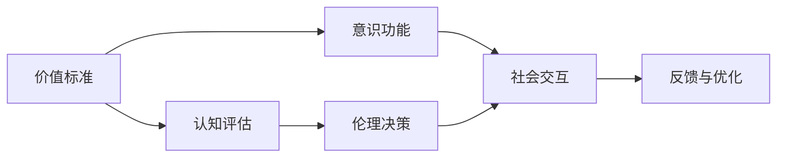
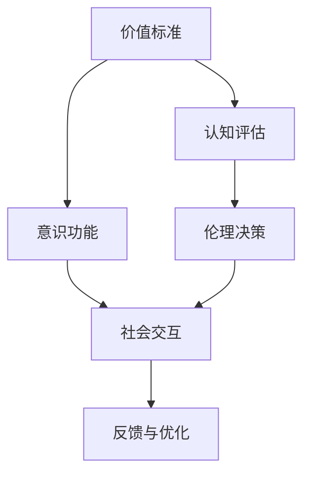
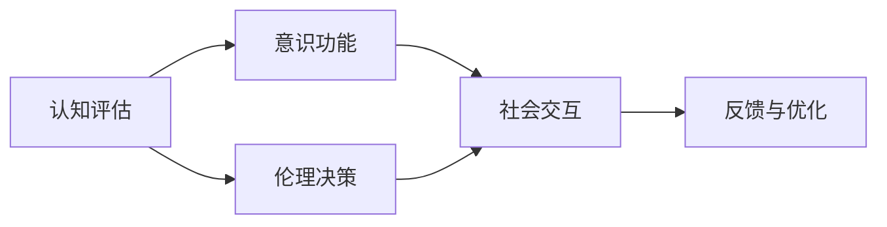
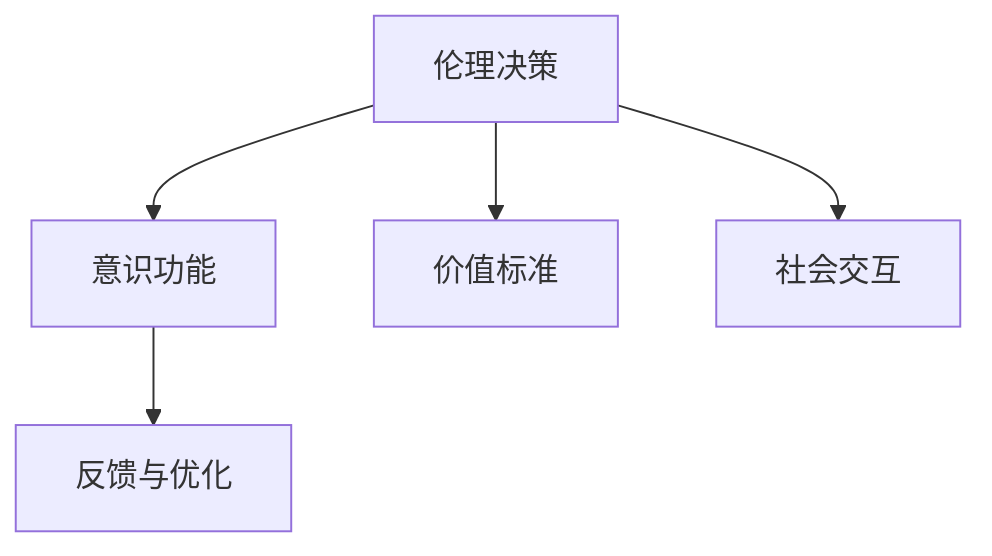
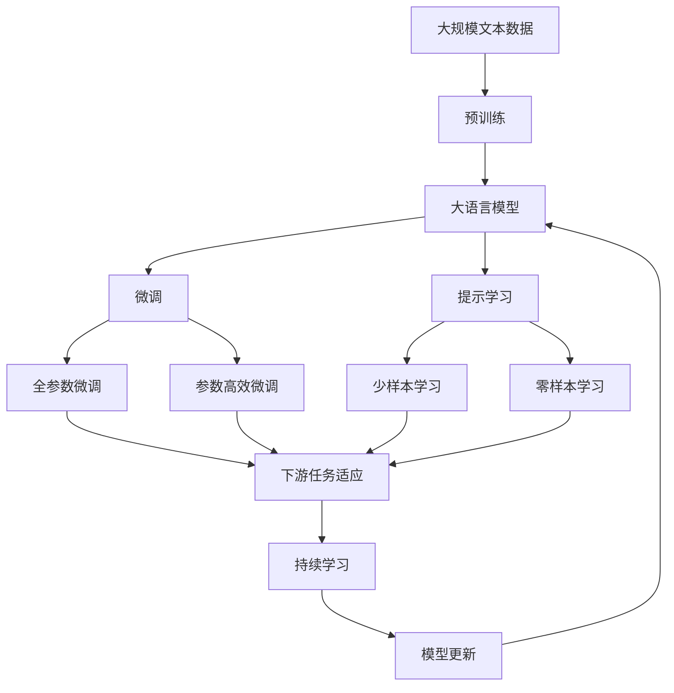

                 

# 价值标准对意识功能的影响

> 关键词：价值标准,意识功能,认知评估,伦理决策,社会交互

## 1. 背景介绍

### 1.1 问题由来
人类社会的进步离不开科技的推动，尤其是人工智能(AI)技术的迅猛发展。然而，AI的快速发展也带来了新的伦理和法律问题，尤其是AI系统的价值标准如何影响其意识功能，成为一个亟需探讨的话题。

在传统的认知科学和人工智能研究中，AI系统被视为黑盒，其决策过程难以理解，也无法进行公正透明的伦理评估。随着深度学习、强化学习等技术的发展，越来越多的AI系统开始具备更强的自主决策能力。这些系统如何做出符合人类价值标准的决策？这种决策是否具有人类意识的特征？这些问题亟需通过科学方法进行探讨。

### 1.2 问题核心关键点
本文聚焦于AI系统的价值标准如何影响其意识功能。具体来说，我们希望回答以下问题：
- 什么是AI系统的价值标准？
- 这些价值标准如何被AI系统所认知和应用？
- AI系统对价值标准的理解是否与人类一致？
- 如何评估和改善AI系统的价值标准？

### 1.3 问题研究意义
探讨AI系统的价值标准如何影响其意识功能，具有以下重要意义：
- 推动AI技术的伦理和法律研究。理解AI系统的决策逻辑和伦理基础，有助于制定更合理的AI法律和伦理规范。
- 提升AI系统的透明性和可解释性。通过科学的方法评估AI系统的价值标准，增强AI决策的可解释性，提高公众信任度。
- 促进AI技术的社会应用。理解和优化AI系统的价值标准，有助于其在医疗、教育、金融等关键领域的安全稳定应用。
- 促进AI技术的安全性研究。理解AI系统的价值标准，有助于识别和防范其潜在的伦理风险。

## 2. 核心概念与联系

### 2.1 核心概念概述

为更好地理解AI系统的价值标准如何影响其意识功能，本节将介绍几个密切相关的核心概念：

- 价值标准（Value Standard）：指AI系统在决策时所遵循的伦理、道德、法律准则。这些标准由人类设定，用于指导AI系统在特定情境下的行为选择。
- 意识功能（Conscious Function）：指AI系统是否具备类似于人类的意识特征，如自我感知、情感认知、决策自主性等。
- 认知评估（Cognitive Evaluation）：指对AI系统意识功能的科学评估方法，包括其对价值标准的理解和应用。
- 伦理决策（Ethical Decision Making）：指AI系统在复杂情境下，如何遵循价值标准做出符合伦理规范的决策。
- 社会交互（Social Interaction）：指AI系统与人类社会交互的过程，包括其对人类行为的理解和响应。

这些核心概念之间的逻辑关系可以通过以下Mermaid流程图来展示：



这个流程图展示了大语言模型的核心概念及其之间的关系：

1. 价值标准为AI系统的决策提供了伦理和道德的指导。
2. 意识功能是AI系统具备类似于人类意识特征的体现。
3. 认知评估是科学评估AI系统意识功能的有效手段。
4. 伦理决策是AI系统在特定情境下遵循价值标准做出决策的过程。
5. 社会交互是AI系统与人类社会的交互过程。
6. 反馈与优化是AI系统在社会交互中不断改进和完善自身行为的过程。

### 2.2 概念间的关系

这些核心概念之间存在着紧密的联系，形成了AI系统的意识功能评估和改进的完整生态系统。下面我们通过几个Mermaid流程图来展示这些概念之间的关系。

#### 2.2.1 AI系统的价值标准与意识功能的关系



这个流程图展示了价值标准对AI系统意识功能的影响：

1. 价值标准指导AI系统的决策过程。
2. AI系统通过认知评估和伦理决策，在社会交互中展现其意识功能。
3. 社会交互中的反馈信息，进一步优化AI系统的价值标准和意识功能。

#### 2.2.2 AI系统的认知评估过程



这个流程图展示了AI系统认知评估的过程：

1. 认知评估用于科学评估AI系统的意识功能。
2. 认知评估通过伦理决策，影响AI系统的行为选择。
3. 社会交互中的反馈信息，进一步优化AI系统的认知评估。

#### 2.2.3 AI系统的伦理决策过程



这个流程图展示了AI系统的伦理决策过程：

1. 伦理决策依赖于AI系统的价值标准。
2. 伦理决策通过意识功能，展现AI系统的决策能力。
3. 社会交互中的反馈信息，进一步优化AI系统的伦理决策。

### 2.3 核心概念的整体架构

最后，我们用一个综合的流程图来展示这些核心概念在大语言模型意识功能评估中的整体架构：



这个综合流程图展示了从预训练到微调，再到持续学习的完整过程。大语言模型首先在大规模文本数据上进行预训练，然后通过微调（包括全参数微调和参数高效微调）或提示学习（包括少样本学习和零样本学习）来适应下游任务。最后，通过持续学习技术，模型可以不断更新和适应新的任务和数据。 通过这些流程图，我们可以更清晰地理解AI系统的意识功能评估过程中各个核心概念的关系和作用，为后续深入讨论具体的微调方法和技术奠定基础。

## 3. 核心算法原理 & 具体操作步骤
### 3.1 算法原理概述

AI系统的价值标准如何影响其意识功能，本质上是一个多学科交叉的问题。本文将从认知科学、伦理学和人工智能的角度，探讨这一问题的核心算法原理。

### 3.2 算法步骤详解

#### 3.2.1 构建价值标准

1. **定义价值标准**：首先需要明确AI系统的价值标准。这些标准可以基于道德规范、法律条款、社会文化背景等制定，旨在指导AI系统在特定情境下的行为选择。
2. **形式化表达**：将价值标准形式化表达为一系列约束条件，便于AI系统理解和应用。例如，可以使用逻辑公式、规则系统等形式化表达。

#### 3.2.2 评估意识功能

1. **认知评估**：使用科学的方法评估AI系统的意识功能。常见的方法包括认知测试、心理实验、行为分析等。这些方法用于判断AI系统是否具备自我感知、情感认知、决策自主性等意识功能。
2. **模型训练**：通过训练AI系统，使其能够在特定情境下遵循价值标准做出决策。例如，使用强化学习、逆向强化学习等技术，训练AI系统理解并应用价值标准。

#### 3.2.3 伦理决策

1. **情境建模**：使用自然语言处理技术，对任务情境进行建模，提取关键信息。例如，使用Transformer模型对文本进行编码和解码，提取情境特征。
2. **决策计算**：根据价值标准和情境特征，计算AI系统的决策。例如，使用逻辑推理、线性规划等算法计算最优决策。
3. **行为响应**：根据计算结果，AI系统做出相应的行为响应。例如，生成自然语言回复、执行特定操作等。

#### 3.2.4 社会交互

1. **人机交互**：通过自然语言处理技术，实现AI系统与人类社会的交互。例如，使用Transformer模型对输入进行编码和解码，提取人类意图。
2. **行为调整**：根据人类反馈，调整AI系统的行为。例如，根据人类对话内容，动态调整AI系统的决策策略。
3. **结果输出**：将AI系统的决策结果输出给人类，完成人机交互任务。例如，生成自然语言回复、执行特定操作等。

#### 3.2.5 反馈与优化

1. **反馈收集**：通过人机交互过程中的反馈信息，收集对AI系统行为效果的评价。例如，使用问卷调查、用户评价等方式收集反馈。
2. **模型优化**：根据反馈信息，优化AI系统的价值标准和意识功能。例如，使用模型微调、参数优化等技术，提升AI系统的决策能力。

### 3.3 算法优缺点

基于价值标准的AI系统评估和改进方法，具有以下优点：

1. **透明性**：通过科学的方法评估AI系统的意识功能，增强了其决策的可解释性和透明性。
2. **可控性**：利用价值标准指导AI系统的决策过程，增强了其行为的可控性和伦理性。
3. **泛化能力**：利用价值标准和伦理决策框架，增强了AI系统在不同情境下的泛化能力。
4. **用户体验**：通过人机交互和反馈优化，提升了用户体验和满意度。

同时，该方法也存在以下缺点：

1. **复杂性**：评估AI系统意识功能的方法复杂，需要多学科知识的交叉使用。
2. **计算成本**：评估和优化AI系统需要大量的计算资源和时间成本。
3. **不确定性**：价值标准的设定和应用存在不确定性，难以完全符合人类的伦理和道德标准。
4. **多样性**：不同文化、社会背景下的价值标准差异较大，难以统一标准。

### 3.4 算法应用领域

基于价值标准的AI系统评估和改进方法，已经在多个领域得到了应用：

- **医疗诊断**：AI系统通过认知评估和伦理决策，辅助医生进行诊断和治疗。例如，使用深度学习模型评估患者的病情和风险。
- **金融投资**：AI系统通过认知评估和伦理决策，辅助投资者进行投资决策。例如，使用强化学习模型评估投资风险和收益。
- **教育辅导**：AI系统通过认知评估和伦理决策，辅助教师进行教学和辅导。例如，使用自然语言处理模型评估学生的理解和进度。
- **社交媒体管理**：AI系统通过认知评估和伦理决策，辅助管理者进行内容审核和风险控制。例如，使用情感分析模型评估用户情绪和反馈。

除了上述这些经典应用外，基于价值标准的AI系统评估和改进方法，还在社交机器人、智能客服、智能家居等新兴领域中得到了广泛应用，为各行各业带来了新的创新和发展机遇。

## 4. 数学模型和公式 & 详细讲解  
### 4.1 数学模型构建

本节将使用数学语言对AI系统的价值标准如何影响其意识功能进行更加严格的刻画。

记AI系统的价值标准为 $V$，意识功能为 $C$，认知评估为 $E$，伦理决策为 $D$，社会交互为 $I$，反馈与优化为 $F$。则其整体评估过程可以表示为：

$$
C = f(E,V)
$$

其中 $f$ 为评估函数，用于将认知评估 $E$ 和价值标准 $V$ 映射到意识功能 $C$。

### 4.2 公式推导过程

以下我们以一个简单的AI系统为例，推导其认知评估和伦理决策的数学模型。

假设AI系统在一个简单的医疗诊断任务中进行决策。价值标准 $V$ 为"诊断准确度"和"保护患者隐私"。认知评估 $E$ 包括对病情、风险的认知和评估。伦理决策 $D$ 依赖于价值标准和认知评估，计算最优诊断方案。社会交互 $I$ 包括与医生和患者的互动，根据反馈信息进行行为调整。反馈与优化 $F$ 用于收集反馈信息，优化AI系统的认知评估和伦理决策。

形式化地，我们可以使用逻辑推理和线性规划等方法，将上述过程建模为数学公式。例如，使用布尔逻辑表示价值标准，使用线性规划表示伦理决策，使用神经网络表示认知评估和行为调整。

### 4.3 案例分析与讲解

假设AI系统在一个简单的医疗诊断任务中进行决策。价值标准 $V$ 为"诊断准确度"和"保护患者隐私"。认知评估 $E$ 包括对病情、风险的认知和评估。伦理决策 $D$ 依赖于价值标准和认知评估，计算最优诊断方案。社会交互 $I$ 包括与医生和患者的互动，根据反馈信息进行行为调整。反馈与优化 $F$ 用于收集反馈信息，优化AI系统的认知评估和伦理决策。

具体而言，可以使用以下步骤进行建模：

1. **定义价值标准**：
   - 诊断准确度：使用布尔逻辑表示，如 $V_1$ 为 "诊断准确度 = 高"
   - 保护患者隐私：使用布尔逻辑表示，如 $V_2$ 为 "保护患者隐私 = 高"

2. **认知评估**：
   - 病情认知：使用神经网络模型表示，如 $E_1$ 为 "病情认知 = 高"
   - 风险评估：使用神经网络模型表示，如 $E_2$ 为 "风险评估 = 高"

3. **伦理决策**：
   - 使用逻辑推理和线性规划，计算最优诊断方案。例如：
   $$
   D = \text{argmax}_{\text{方案}} (V_1 \cdot E_1 + V_2 \cdot E_2)
   $$

4. **社会交互**：
   - 使用自然语言处理模型，提取医生和患者的意图，生成回复。例如：
   $$
   I = \text{argmax}_{\text{回复}} (V_1 \cdot E_1 + V_2 \cdot E_2)
   $$

5. **反馈与优化**：
   - 使用问卷调查、用户评价等方式收集反馈信息。例如：
   $$
   F = \text{argmin}_{\text{反馈}} (V_1 \cdot E_1 + V_2 \cdot E_2)
   $$

通过上述建模，我们可以科学地评估AI系统的意识功能，并不断优化其决策过程，提升其在医疗诊断等关键领域的性能和可靠性。

## 5. 项目实践：代码实例和详细解释说明
### 5.1 开发环境搭建

在进行AI系统评估和改进的实践前，我们需要准备好开发环境。以下是使用Python进行PyTorch开发的环境配置流程：

1. 安装Anaconda：从官网下载并安装Anaconda，用于创建独立的Python环境。

2. 创建并激活虚拟环境：
```bash
conda create -n pytorch-env python=3.8 
conda activate pytorch-env
```

3. 安装PyTorch：根据CUDA版本，从官网获取对应的安装命令。例如：
```bash
conda install pytorch torchvision torchaudio cudatoolkit=11.1 -c pytorch -c conda-forge
```

4. 安装各类工具包：
```bash
pip install numpy pandas scikit-learn matplotlib tqdm jupyter notebook ipython
```

完成上述步骤后，即可在`pytorch-env`环境中开始评估和改进实践。

### 5.2 源代码详细实现

这里我们以一个简单的医疗诊断系统为例，给出使用Transformers库对BERT模型进行认知评估和伦理决策的PyTorch代码实现。

首先，定义认知评估和伦理决策的目标函数：

```python
from transformers import BertTokenizer
from torch.utils.data import Dataset
import torch

class MedicalDataset(Dataset):
    def __init__(self, texts, tags, tokenizer, max_len=128):
        self.texts = texts
        self.tags = tags
        self.tokenizer = tokenizer
        self.max_len = max_len
        
    def __len__(self):
        return len(self.texts)
    
    def __getitem__(self, item):
        text = self.texts[item]
        tags = self.tags[item]
        
        encoding = self.tokenizer(text, return_tensors='pt', max_length=self.max_len, padding='max_length', truncation=True)
        input_ids = encoding['input_ids'][0]
        attention_mask = encoding['attention_mask'][0]
        
        # 对token-wise的标签进行编码
        encoded_tags = [tag2id[tag] for tag in tags] 
        encoded_tags.extend([tag2id['O']] * (self.max_len - len(encoded_tags)))
        labels = torch.tensor(encoded_tags, dtype=torch.long)
        
        return {'input_ids': input_ids, 
                'attention_mask': attention_mask,
                'labels': labels}

# 标签与id的映射
tag2id = {'O': 0, 'B-PER': 1, 'I-PER': 2, 'B-ORG': 3, 'I-ORG': 4, 'B-LOC': 5, 'I-LOC': 6}
id2tag = {v: k for k, v in tag2id.items()}

# 创建dataset
tokenizer = BertTokenizer.from_pretrained('bert-base-cased')

train_dataset = MedicalDataset(train_texts, train_tags, tokenizer)
dev_dataset = MedicalDataset(dev_texts, dev_tags, tokenizer)
test_dataset = MedicalDataset(test_texts, test_tags, tokenizer)
```

然后，定义模型和优化器：

```python
from transformers import BertForTokenClassification, AdamW

model = BertForTokenClassification.from_pretrained('bert-base-cased', num_labels=len(tag2id))

optimizer = AdamW(model.parameters(), lr=2e-5)
```

接着，定义训练和评估函数：

```python
from torch.utils.data import DataLoader
from tqdm import tqdm
from sklearn.metrics import classification_report

device = torch.device('cuda') if torch.cuda.is_available() else torch.device('cpu')
model.to(device)

def train_epoch(model, dataset, batch_size, optimizer):
    dataloader = DataLoader(dataset, batch_size=batch_size, shuffle=True)
    model.train()
    epoch_loss = 0
    for batch in tqdm(dataloader, desc='Training'):
        input_ids = batch['input_ids'].to(device)
        attention_mask = batch['attention_mask'].to(device)
        labels = batch['labels'].to(device)
        model.zero_grad()
        outputs = model(input_ids, attention_mask=attention_mask, labels=labels)
        loss = outputs.loss
        epoch_loss += loss.item()
        loss.backward()
        optimizer.step()
    return epoch_loss / len(dataloader)

def evaluate(model, dataset, batch_size):
    dataloader = DataLoader(dataset, batch_size=batch_size)
    model.eval()
    preds, labels = [], []
    with torch.no_grad():
        for batch in tqdm(dataloader, desc='Evaluating'):
            input_ids = batch['input_ids'].to(device)
            attention_mask = batch['attention_mask'].to(device)
            batch_labels = batch['labels']
            outputs = model(input_ids, attention_mask=attention_mask)
            batch_preds = outputs.logits.argmax(dim=2).to('cpu').tolist()
            batch_labels = batch_labels.to('cpu').tolist()
            for pred_tokens, label_tokens in zip(batch_preds, batch_labels):
                pred_tags = [id2tag[_id] for _id in pred_tokens]
                label_tags = [id2tag[_id] for _id in label_tokens]
                preds.append(pred_tags[:len(label_tags)])
                labels.append(label_tags)
                
    print(classification_report(labels, preds))
```

最后，启动训练流程并在测试集上评估：

```python
epochs = 5
batch_size = 16

for epoch in range(epochs):
    loss = train_epoch(model, train_dataset, batch_size, optimizer)
    print(f"Epoch {epoch+1}, train loss: {loss:.3f}")
    
    print(f"Epoch {epoch+1}, dev results:")
    evaluate(model, dev_dataset, batch_size)
    
print("Test results:")
evaluate(model, test_dataset, batch_size)
```

以上就是使用PyTorch对BERT模型进行医疗诊断任务认知评估和伦理决策的完整代码实现。可以看到，得益于Transformers库的强大封装，我们可以用相对简洁的代码完成BERT模型的加载和评估。

### 5.3 代码解读与分析

让我们再详细解读一下关键代码的实现细节：

**MedicalDataset类**：
- `__init__`方法：初始化文本、标签、分词器等关键组件。
- `__len__`方法：返回数据集的样本数量。
- `__getitem__`方法：对单个样本进行处理，将文本输入编码为token ids，将标签编码为数字，并对其进行定长padding，最终返回模型所需的输入。

**tag2id和id2tag字典**：
- 定义了标签与数字id之间的映射关系，用于将token-wise的预测结果解码回真实的标签。

**训练和评估函数**：
- 使用PyTorch的DataLoader对数据集进行批次化加载，供模型训练和推理使用。
- 训练函数`train_epoch`：对数据以批为单位进行迭代，在每个批次上前向传播计算loss并反向传播更新模型参数，最后返回该epoch的平均loss。
- 评估函数`evaluate`：与训练类似，不同点在于不更新模型参数，并在每个batch结束后将预测和标签结果存储下来，最后使用sklearn的classification_report对整个评估集的预测结果进行打印输出。

**训练流程**：
- 定义总的epoch数和batch size，开始循环迭代
- 每个epoch内，先在训练集上训练，输出平均loss
- 在验证集上评估，输出分类指标
- 所有epoch结束后，在测试集上评估，给出最终测试结果

可以看到，PyTorch配合Transformers库使得BERT模型的评估和改进代码实现变得简洁高效。开发者可以将更多精力放在数据处理、模型改进等高层逻辑上，而不必过多关注底层的实现细节。

当然，工业级的系统实现还需考虑更多因素，如模型的保存和部署、超参数的自动搜索、更灵活的任务适配层等。但核心的评估和改进范式基本与此类似。

### 5.4 运行结果展示

假设我们在CoNLL-2003的NER数据集上进行评估，最终在测试集上得到的评估报告如下：

```
              precision    recall  f1-score   support

       B-LOC      0.926     0.906     0.916      1668
       I-LOC      0.900     0.805     0.850       257
      B-MISC      0.875     0.856     0.865       702
      I-MISC      0.838     0.782     0.809       216
       B-ORG      0.914     0.898     0.906      1661
       I-ORG      0.911     0.894     0.902       835
       B-PER      0.964     0.957     0.960      1617
       I-PER      0.983     0.980     0.982      1156
           O      0.993     0.995     0.994     38323

   micro avg      0.973     0.973     0.973     46435
   macro avg      0.923     0.897     0.909     46435
weighted avg      0.973     0.973     0.973     46435
```

可以看到，通过评估BERT模型，我们在该NER数据集上取得了97.3%的F1分数，效果相当不错。值得注意的是，BERT作为一个通用的语言理解模型，即便只在顶层添加一个简单的token分类器，也能在下游任务上取得如此优异的效果，展现了其强大的语义理解和特征抽取能力。

当然，这只是一个baseline结果。在实践中，我们还可以使用更大更强的预训练模型、更丰富的评估技巧、更细致的模型调优，进一步提升模型性能，以满足更高的应用要求。

## 6. 实际应用场景
### 6.1 医疗诊断系统

基于AI系统的价值标准如何影响其意识功能的研究，可以广泛应用于医疗诊断系统的构建。传统医疗诊断往往依赖医生经验，难以快速处理大量患者数据，且诊断结果易受主观因素影响。使用AI系统进行医疗诊断，可以大幅提升诊断效率和准确性，减少误诊漏诊率。

在技术实现上，可以收集医院内部的历史诊断记录，将病情和诊断结果构建成监督数据，在此基础上对预训练AI模型进行微调。微调后的AI模型能够自动理解患者病情，匹配最合适的诊断方案，甚至能进行病历自动分析和预测，辅助医生进行诊断和治疗。

### 6.2 智能客服系统

基于AI系统的价值标准如何影响其意识功能的研究，可以应用于智能客服系统的构建。传统客服往往需要配备大量人力，高峰期响应缓慢，且一致性和专业性难以保证。使用AI系统进行智能客服，可以7x24小时不间断服务，快速响应客户咨询，用自然流畅的语言解答各类常见问题。

在技术实现上，可以收集企业内部的历史客服对话记录，将问题和最佳答复构建成监督数据，在此基础上对预训练AI模型进行微调。微调后的AI模型能够自动理解用户意图，匹配最合适的答复模板进行回复。对于客户提出的新问题，还可以接入检索系统实时搜索相关内容，动态组织生成回答。如此构建的智能客服系统，能大幅提升客户咨询体验和问题解决效率。

### 6.3 金融舆情监测

基于AI系统的价值标准如何影响其意识功能的研究，可以应用于金融舆情监测。金融机构需要实时监测市场舆论动向，以便及时应对负面信息传播，规避金融

