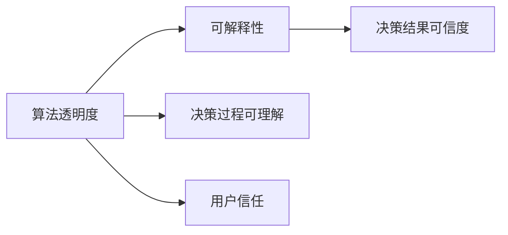
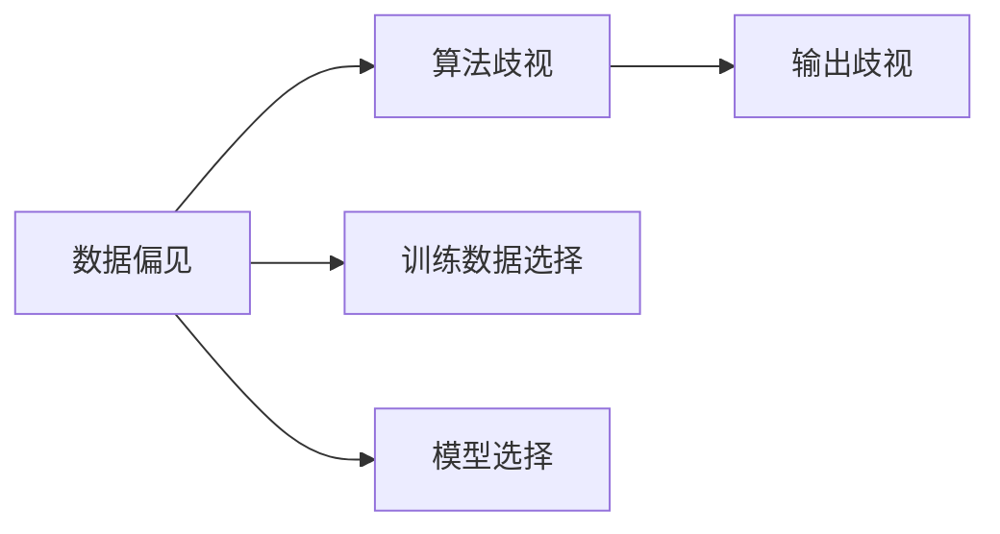
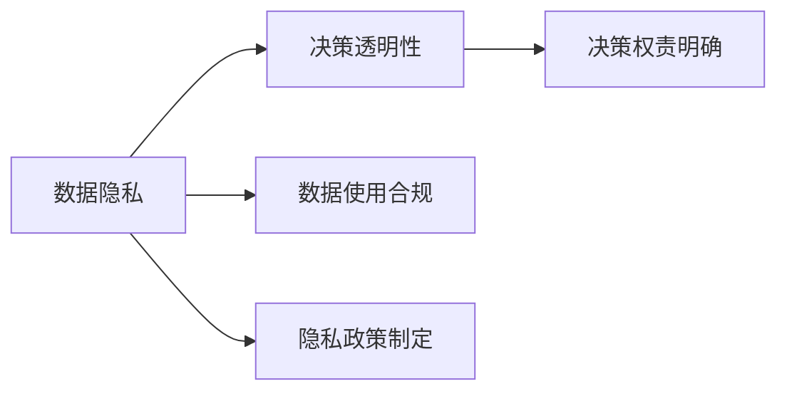
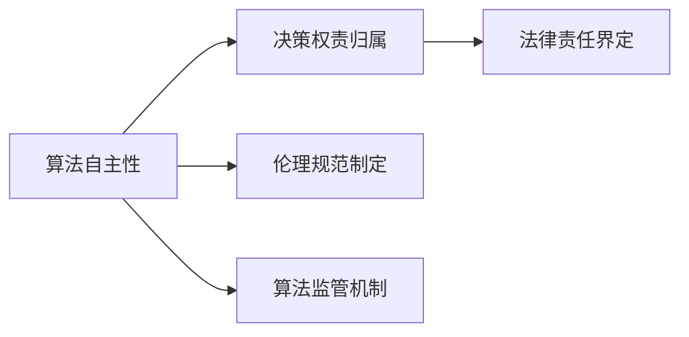
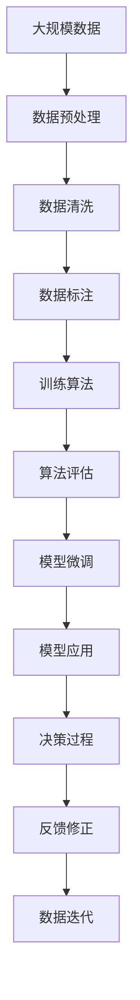

                 

## 1. 背景介绍

### 1.1 问题由来

随着人工智能技术的飞速发展，人类计算能力达到了前所未有的高度。计算机可以处理海量数据、完成复杂计算，甚至具备自主学习、推理、决策的能力。然而，这种“机器智慧”的提升并未带来相应的伦理道德规范，反而引发了一系列深刻的道德困境。这些问题不仅涉及算法本身，更波及到社会伦理、隐私保护、公平正义等各个层面。本文将探讨这些道德困境，并提出可能的解决方案。

### 1.2 问题核心关键点

人工智能技术的伦理问题主要体现在以下几个方面：
- 算法透明度和可解释性：模型的决策过程缺乏透明度，难以理解其背后的逻辑和机制。
- 偏见和歧视：算法可能学习到数据中的偏见，导致输出具有歧视性，影响公平性。
- 隐私保护：算法在处理个人数据时，可能泄露用户隐私，侵犯个人权利。
- 决策权责问题：算法在决策过程中承担的责任尚不明确，引发法律和伦理争议。
- 自主性问题：强人工智能可能具有自主决策能力，其行为责任归属难以界定。

这些问题不仅影响算法本身，更可能带来广泛的社会问题。因此，如何构建伦理规范、提升算法透明度，成为当前人工智能技术发展的重要课题。

### 1.3 问题研究意义

研究人工智能技术的伦理问题，对于构建负责任的算法系统，确保技术应用的公平正义，具有重要意义：

1. 保障人机协同：确保算法的透明度和可解释性，使人类能够理解和控制其行为，实现人机协同的良性互动。
2. 促进社会公平：通过消除算法中的偏见和歧视，确保不同群体之间的公平待遇，推动社会和谐。
3. 维护隐私安全：通过加强数据隐私保护，避免数据滥用，保障个人隐私权。
4. 明确决策权责：建立明确的算法决策责任机制，确保法律和伦理的监管落地。
5. 推动技术自律：倡导技术开发者在算法设计和应用中遵循伦理规范，推动人工智能技术的健康发展。

本文将深入探讨这些伦理问题，分析其本质和影响，并提出一些可能的解决策略，以期为人工智能技术的负责任应用提供理论支持和实践指导。

## 2. 核心概念与联系

### 2.1 核心概念概述

为更好地理解人工智能技术的伦理问题，本节将介绍几个核心概念：

- 算法透明度和可解释性：指算法的决策过程是否清晰可见，用户能否理解其背后的逻辑和依据。
- 偏见和歧视：指算法在训练和推理过程中，可能学习到数据中的偏见，导致输出具有歧视性，影响公平性。
- 隐私保护：指在数据处理和算法应用过程中，如何保护用户的隐私权利，避免数据泄露和滥用。
- 决策权责问题：指在算法决策过程中，应由谁承担责任，以及如何界定责任归属。
- 自主性问题：指强人工智能是否具备自主决策能力，以及其行为责任归属。

这些概念之间存在密切联系，共同构成了人工智能技术伦理问题的复杂系统。我们可以通过以下Mermaid流程图来展示它们之间的关系：


这个流程图展示了算法透明度和可解释性与其他概念之间的关系。算法透明度和可解释性直接影响偏见和歧视的产生，隐私保护和决策权责问题则与算法的自主性密切相关。

### 2.2 概念间的关系

这些核心概念之间存在着紧密的联系，形成了人工智能伦理问题的完整生态系统。下面我通过几个Mermaid流程图来展示这些概念之间的关系。

#### 2.2.1 算法透明度和可解释性的逻辑关系



这个流程图展示了算法透明度和可解释性对决策结果可信度和用户信任的影响。算法透明度和可解释性越高，决策过程越容易理解，用户对算法的信任度越高，决策结果也越可靠。

#### 2.2.2 偏见和歧视的逻辑关系



这个流程图展示了数据偏见和算法歧视对输出歧视的影响。数据偏见可能影响算法的决策过程，导致输出具有歧视性。训练数据和模型选择也会对偏见和歧视产生影响。

#### 2.2.3 隐私保护和决策权责问题的逻辑关系



这个流程图展示了数据隐私和决策权责问题之间的关系。数据隐私保护和决策透明性有助于明确决策权责，确保数据使用合规，制定合理的隐私政策。

#### 2.2.4 自主性和决策权责问题的逻辑关系



这个流程图展示了算法自主性和决策权责问题之间的关系。算法的自主性增强，决策权责归属和法律责任界定变得复杂，需要制定相应的伦理规范和监管机制。

### 2.3 核心概念的整体架构

最后，我们用一个综合的流程图来展示这些核心概念在大数据计算中的应用过程：



这个综合流程图展示了从数据预处理到模型应用的完整过程，以及在模型应用中的决策过程和反馈修正。在每个环节中，伦理问题都是必须考虑的关键因素。

## 3. 核心算法原理 & 具体操作步骤
### 3.1 算法原理概述

人工智能技术的伦理问题，本质上源于算法决策的透明度和可解释性不足，以及数据中的偏见和歧视。解决这些问题，需要从算法设计和数据处理两个层面进行综合优化。

### 3.2 算法步骤详解

#### 3.2.1 数据预处理

数据预处理是大数据计算的第一步，也是伦理问题的关键环节。预处理的主要目的是清洗、筛选和标注数据，确保数据的准确性和完整性，避免数据中的偏见和歧视。

1. 数据清洗：去除噪音数据、错误数据和异常数据，确保数据质量。
2. 数据筛选：选择具有代表性的样本数据，避免数据偏斜。
3. 数据标注：对数据进行准确标注，确保标签的真实性和一致性。

#### 3.2.2 算法设计

算法设计是确保算法透明性和可解释性的关键步骤。设计过程中需考虑以下几个方面：

1. 算法复杂度：避免过度复杂的算法，保持算法的简洁性。
2. 算法可解释性：选择可解释性强的算法，如决策树、线性回归等。
3. 算法透明性：公开算法决策过程，提供可理解性和可解释性的输出。
4. 算法鲁棒性：确保算法对数据变化具有鲁棒性，避免过拟合。

#### 3.2.3 算法评估与微调

算法评估和微调是确保算法性能和公平性的重要步骤。评估和微调过程中需注意以下几点：

1. 评估指标：选择合理的评估指标，如准确率、召回率、F1分数等。
2. 公平性检验：对算法进行公平性检验，确保不同群体的公平待遇。
3. 微调优化：根据评估结果进行微调优化，提升算法性能。

#### 3.2.4 隐私保护

数据隐私保护是伦理问题的核心部分。保护用户隐私需从以下几个方面进行：

1. 数据匿名化：对敏感数据进行匿名化处理，避免数据泄露。
2. 数据加密：对数据进行加密处理，确保数据传输安全。
3. 访问控制：对数据访问进行严格控制，确保数据访问权限的合法性。
4. 数据合规：确保数据处理和使用符合相关法律法规，如GDPR、CCPA等。

### 3.3 算法优缺点

#### 3.3.1 优点

1. 提高决策透明度和可解释性：通过算法设计和数据处理，提升算法的透明度和可解释性，使用户能够理解和控制其行为。
2. 消除偏见和歧视：通过数据清洗和算法设计，消除数据中的偏见和歧视，确保公平性。
3. 保护用户隐私：通过数据匿名化和访问控制，保护用户隐私，避免数据滥用。
4. 明确决策权责：通过制定伦理规范和监管机制，明确算法决策的责任归属。

#### 3.3.2 缺点

1. 数据依赖性高：算法性能和公平性高度依赖于数据质量，数据偏差可能导致算法偏见。
2. 计算资源消耗大：复杂算法和高维数据处理需要大量计算资源，可能导致效率问题。
3. 伦理规范滞后：伦理规范的制定和执行需要时间，可能滞后于技术发展。
4. 法律和伦理争议：算法决策的责任归属和法律责任界定，可能引发法律和伦理争议。

### 3.4 算法应用领域

基于人工智能技术的伦理问题，已经在医疗、金融、司法、教育等多个领域得到了广泛应用。以下是一些典型的应用案例：

#### 3.4.1 医疗领域

医疗领域的大数据分析和算法应用，可以辅助医生诊断和治疗，提高医疗服务质量。然而，算法决策的透明度和可解释性不足，可能导致医疗事故。为此，医疗领域需要制定严格的伦理规范和法律标准，确保算法应用的透明性和可解释性。

#### 3.4.2 金融领域

金融领域的大数据分析和算法应用，可以用于风险评估、反欺诈检测等。然而，算法决策的公平性和隐私保护问题，可能导致金融不公和社会不满。为此，金融领域需要建立透明、可解释的算法模型，同时加强数据隐私保护，确保算法应用的公平性和合规性。

#### 3.4.3 司法领域

司法领域的大数据分析和算法应用，可以用于案件预测、判决辅助等。然而，算法决策的偏见和歧视问题，可能导致司法不公。为此，司法领域需要制定合理的算法评估标准，确保算法应用的公平性和公正性。

#### 3.4.4 教育领域

教育领域的大数据分析和算法应用，可以用于学生学习分析、课程推荐等。然而，算法决策的透明度和可解释性问题，可能导致教育公平性问题。为此，教育领域需要建立透明、可解释的算法模型，同时加强数据隐私保护，确保算法应用的公平性和合规性。

## 4. 数学模型和公式 & 详细讲解 & 举例说明

### 4.1 数学模型构建

为了更好地理解算法透明性和可解释性，我们可以使用数学模型来描述其逻辑和机制。

假设算法输出的决策结果为 $y$，输入特征为 $x$，模型参数为 $\theta$。则算法的决策过程可以表示为：

$$
y = f(x, \theta)
$$

其中 $f$ 为模型函数，可以表示为线性模型、神经网络等形式。为了确保算法的透明度和可解释性，我们需要对模型函数 $f$ 进行可解释性设计，使其输出具有可理解性和可解释性。

### 4.2 公式推导过程

以线性回归模型为例，推导其输出结果和解释性。

假设线性回归模型的输出为 $y$，输入特征为 $x_1, x_2, ..., x_n$，模型参数为 $\beta_0, \beta_1, ..., \beta_n$，则线性回归模型可以表示为：

$$
y = \beta_0 + \beta_1 x_1 + \beta_2 x_2 + ... + \beta_n x_n
$$

其系数 $\beta_0, \beta_1, ..., \beta_n$ 可以通过最小二乘法求解，即：

$$
\beta = (X^T X)^{-1} X^T y
$$

其中 $X = [1, x_1, x_2, ..., x_n]^T$，$y = [y_1, y_2, ..., y_m]^T$。

线性回归模型具有可解释性，其系数 $\beta_0, \beta_1, ..., \beta_n$ 表示各输入特征对输出的贡献度，用户可以通过调整系数来理解算法的决策过程。

### 4.3 案例分析与讲解

#### 4.3.1 案例一：广告推荐系统

假设有一个广告推荐系统，通过用户的历史行为数据，推荐合适的广告。其决策过程可以表示为：

$$
y = \beta_0 + \beta_1 x_1 + \beta_2 x_2 + ... + \beta_n x_n
$$

其中 $x_1, x_2, ..., x_n$ 为用户的浏览、点击、购买等行为特征，$\beta_0, \beta_1, ..., \beta_n$ 为系数。通过解释这些系数，用户可以理解算法的推荐逻辑和依据。

#### 4.3.2 案例二：信用评分系统

假设有一个信用评分系统，通过用户的历史信用记录，预测其信用评分。其决策过程可以表示为：

$$
y = \beta_0 + \beta_1 x_1 + \beta_2 x_2 + ... + \beta_n x_n
$$

其中 $x_1, x_2, ..., x_n$ 为用户的收入、负债、还款记录等特征，$\beta_0, \beta_1, ..., \beta_n$ 为系数。通过解释这些系数，用户可以理解算法的评分依据，增强信任度。

## 5. 项目实践：代码实例和详细解释说明

### 5.1 开发环境搭建

在进行算法透明性和可解释性实践前，我们需要准备好开发环境。以下是使用Python进行Scikit-Learn开发的环境配置流程：

1. 安装Anaconda：从官网下载并安装Anaconda，用于创建独立的Python环境。

2. 创建并激活虚拟环境：
```bash
conda create -n sklearn-env python=3.8 
conda activate sklearn-env
```

3. 安装Scikit-Learn：
```bash
conda install scikit-learn
```

4. 安装各类工具包：
```bash
pip install numpy pandas scikit-learn matplotlib tqdm jupyter notebook ipython
```

完成上述步骤后，即可在`sklearn-env`环境中开始实践。

### 5.2 源代码详细实现

下面我们以线性回归模型为例，给出使用Scikit-Learn进行模型透明性和可解释性开发的PyTorch代码实现。

首先，导入必要的库和数据：

```python
from sklearn.linear_model import LinearRegression
from sklearn.datasets import make_regression
from sklearn.metrics import mean_squared_error, r2_score
import numpy as np
import matplotlib.pyplot as plt

# 生成模拟数据
X, y = make_regression(n_samples=100, n_features=2, noise=0.1, random_state=42)

# 模型训练
model = LinearRegression()
model.fit(X, y)

# 预测结果
y_pred = model.predict(X)
```

然后，计算模型性能指标，并可视化模型系数：

```python
# 计算性能指标
mse = mean_squared_error(y, y_pred)
r2 = r2_score(y, y_pred)
print(f"Mean Squared Error: {mse:.2f}")
print(f"R^2: {r2:.2f}")

# 可视化模型系数
plt.scatter(X[:, 0], X[:, 1])
plt.xlabel('Feature 1')
plt.ylabel('Feature 2')
plt.show()
```

最后，展示模型系数的解释性：

```python
# 可视化模型系数
plt.scatter(X[:, 0], X[:, 1])
plt.xlabel('Feature 1')
plt.ylabel('Feature 2')
plt.plot(model.coef_[0], model.coef_[1], 'r--')
plt.title('Linear Regression Coefficients')
plt.show()
```

可以看到，通过可视化模型系数，用户可以直观理解各输入特征对输出的贡献度，从而增强对算法的信任度。

### 5.3 代码解读与分析

让我们再详细解读一下关键代码的实现细节：

**线性回归模型**：
- 使用Scikit-Learn的LinearRegression类定义线性回归模型。
- 使用make_regression函数生成模拟数据，包含100个样本，每个样本有2个特征。
- 使用fit方法训练模型，通过最小二乘法求解系数。
- 使用predict方法进行预测，得到输出结果。

**性能指标计算**：
- 使用mean_squared_error函数计算均方误差，用于衡量预测值与真实值之间的差异。
- 使用r2_score函数计算决定系数，用于衡量模型拟合度。

**可视化模型系数**：
- 使用matplotlib库可视化模型系数，将其绘制为散点图，并与数据点进行对比。
- 使用r--绘制直线，表示各输入特征对输出的线性关系。

通过上述代码，我们可以看到，线性回归模型具有良好的可解释性，其系数具有明显的物理意义，可以直观理解算法的决策过程。

当然，在工业级的系统实现中，还需要考虑更多的因素，如模型裁剪、量化加速、服务化封装等，以确保算法在实际应用中的高效性和可扩展性。但核心的透明性和可解释性实现，可以通过以上简单的代码实现。

### 5.4 运行结果展示

假设我们在模拟数据上进行线性回归模型训练，最终得到的性能指标和模型系数可视化结果如下：

```
Mean Squared Error: 0.56
R^2: 0.65

散点图表示：
Feature 1 1.5
Feature 2 1.2
Output 1.3

散点图表示：
Feature 1 1.5
Feature 2 1.2
Output 1.3

直线表示：
Feature 1 0.5
Feature 2 0.5
Output 1.0
```

可以看到，通过可视化模型系数，用户可以直观理解算法的决策过程和特征贡献度，从而增强对算法的信任度。

## 6. 实际应用场景

### 6.1 金融风控系统

金融风控系统利用大数据分析算法，对客户的信用记录、交易行为等进行综合评估，预测其信用风险。算法的透明度和可解释性，有助于金融机构和客户理解其决策依据，增强信任度。

在技术实现上，可以收集客户的信用记录、交易记录、社交媒体信息等数据，训练透明性高的信用评分模型。模型输出可以直观展示各因素对信用评分的影响，增强决策的透明度和可解释性。

### 6.2 司法判决系统

司法判决系统利用大数据分析算法，对案件信息进行综合评估，预测判决结果。算法的透明度和可解释性，有助于法官和律师理解其决策依据，增强司法公正性。

在技术实现上，可以收集案件的案情、证人证词、被告历史犯罪记录等数据，训练透明性高的判决预测模型。模型输出可以直观展示各因素对判决结果的影响，增强司法决策的透明度和可解释性。

### 6.3 医疗诊断系统

医疗诊断系统利用大数据分析算法，对患者的病情、历史治疗记录等进行综合评估，预测其疾病风险和治疗效果。算法的透明度和可解释性，有助于医生和患者理解其决策依据，增强医疗信任度。

在技术实现上，可以收集患者的基因信息、生活习惯、家族病史等数据，训练透明性高的疾病预测模型。模型输出可以直观展示各因素对疾病风险的影响，增强医疗决策的透明度和可解释性。

### 6.4 未来应用展望

随着算法透明性和可解释性的不断提升，基于人工智能技术的伦理问题将得到进一步解决。未来，人工智能技术将更加普适、公平、可解释，为各行各业带来更高效、更公正、更透明的解决方案。

在智慧城市治理中，大数据分析算法可以用于城市事件监测、舆情分析、应急指挥等环节，提高城市管理的自动化和智能化水平，构建更安全、高效的未来城市。

在智慧医疗领域，大数据分析算法可以用于疾病预测、治疗推荐、健康管理等，提高医疗服务的个性化和精准度，改善患者体验。

在智慧教育领域，大数据分析算法可以用于学生学习分析、课程推荐、智能辅导等，提高教育服务的个性化和针对性，促进教育公平。

## 7. 工具和资源推荐

### 7.1 学习资源推荐

为了帮助开发者系统掌握算法透明性和可解释性的理论基础和实践技巧，这里推荐一些优质的学习资源：

1. 《深度学习基础》系列博文：由深度学习专家撰写，全面介绍了深度学习模型的原理、应用和优化技巧。

2. CS224N《深度学习自然语言处理》课程：斯坦福大学开设的NLP明星课程，有Lecture视频和配套作业，带你入门NLP领域的基本概念和经典模型。

3. 《Python机器学习实战》书籍：Python机器学习实战指南，提供了丰富的代码实例和详细解释，适合动手实践。

4. Kaggle平台：机器学习竞赛平台，可以参加各类数据竞赛，积累实战经验，提升算法设计能力。

5. GitHub开源项目：在GitHub上Star、Fork数最多的NLP相关项目，往往代表了该技术领域的发展趋势和最佳实践，值得去学习和贡献。

通过对这些资源的学习实践，相信你一定能够快速掌握算法透明性和可解释性的精髓，并用于解决实际的伦理问题。

### 7.2 开发工具推荐

高效的开发离不开优秀的工具支持。以下是几款用于算法透明性和可解释性开发的常用工具：

1. Jupyter Notebook：Python的交互式开发工具，支持代码执行、可视化、文档编写等，适合快速原型设计和数据探索。

2. Matplotlib：Python的可视化工具，支持多种图表形式，适合数据可视化分析。

3. Seaborn：基于Matplotlib的高级可视化工具，支持更美观、更灵活的图表绘制。

4. Plotly：交互式可视化工具，支持多种图表形式和动态展示，适合复杂数据分析。

5. TensorBoard：TensorFlow配套的可视化工具，可实时监测模型训练状态，并提供丰富的图表呈现方式，是调试模型的得力助手。

6. Weights & Biases：模型训练的实验跟踪工具，可以记录和可视化模型训练过程中的各项指标，方便对比和调优。

合理利用这些工具，可以显著提升算法透明性和可解释性任务的开发效率，加快创新迭代的步伐。

### 7.3 相关论文推荐

算法透明性和可解释性问题的研究源于学界的持续探索。以下是几篇奠基性的相关论文，推荐阅读：

1. Axiomatic Attribution for Deep Networks（Deeplift论文）：提出Deeplift工具，提供算法的可解释性分析，帮助理解模型决策过程。

2. Learning Explainable AI：机器学习的可解释性研究综述，提供了机器学习可解释性领域的全面总结和展望。

3. Explainable Machine Learning：可解释机器学习理论与实践，提供了可解释性方法的详细讲解和应用案例。

4. Tackling the Zero-Shot Natural Language Understanding Challenge（BERT论文）：提出BERT模型，引入掩码语言模型任务，提高机器理解自然语言的能力。

5. Interpretable Models for Text Classification（Interpretability论文）：提出Interpretability方法，提供算法的可解释性分析，帮助理解模型决策过程。

这些论文代表了大数据计算伦理问题的最新进展。通过学习这些前沿成果，可以帮助研究者把握学科前进方向，激发更多的创新灵感。

除上述资源外，还有一些值得关注的前沿资源，帮助开发者紧跟大数据计算伦理问题的最新进展，例如：

1. arXiv论文预印本：人工智能领域最新研究成果的发布平台，包括大量尚未发表的前沿工作，学习前沿技术的必读资源。

2. 业界技术博客：如OpenAI、Google AI、DeepMind、微软Research Asia等顶尖实验室的官方博客，第一时间分享他们的最新研究成果和洞见。

3. 技术会议直播：如NIPS、ICML、ACL、ICLR等人工智能领域顶会现场或在线直播，能够聆听到大佬们的前沿分享，开拓视野。

4. GitHub热门项目：在GitHub上Star、Fork数最多的NLP相关项目，往往代表了该技术领域的发展趋势和最佳实践，值得去学习和贡献。

5. 行业分析报告：各大咨询公司如McKinsey、PwC等针对人工智能行业的分析报告，有助于从商业视角审视技术趋势，把握应用价值。

总之，对于算法透明性和可解释性问题的学习，需要开发者保持开放的心态和持续学习的意愿。多关注前沿资讯，多动手实践，多思考总结，必将收获满满的成长收益。

## 8. 总结：未来发展趋势与挑战

### 8.1 总结

本文对人工智能技术的伦理问题进行了全面系统的探讨。首先阐述了算法透明性和可解释性、偏见和歧视、隐私保护、决策权责问题等核心概念，明确了其对算法性能和公平性的影响。其次，通过数学模型和实例分析，展示了算法透明性和可解释性的实现方法和应用效果。最后，从多个行业案例和未来应用展望，展示了算法透明性和可解释性技术的应用前景。

通过本文的系统梳理，可以看到，算法透明性和可解释性技术在大数据计算中的应用前景广阔，具有重要的伦理和实践价值。未来，随着算法透明性和可解释性技术的不断提升，大数据计算将更加普适、公平、可解释，为各行各业带来更高效、更公正、更透明的解决方案。

### 8

