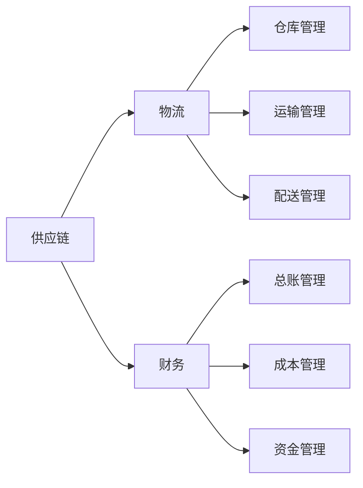

                 

## 1. 背景介绍

随着电商、制造业等行业的快速发展，供应链、物流、财务系统设计逐渐成为企业信息化建设的核心。本文将详细探讨供应链进销存、物流、财务系统设计的核心概念、技术原理、系统架构，并结合具体案例展示系统实施的详细过程。

## 2. 核心概念与联系

### 2.1 核心概念概述

**供应链**：指生产商、供应商、零售商、消费者等在商品的生产、销售过程中所形成的价值链网络，主要包括采购、生产、库存、分销、配送等环节。

**进销存**：指企业的采购、销售和库存管理。其中，进（Procurement）指采购订单的生成和处理，销（Sales）指销售订单的生成和处理，存（Inventory）指库存数据的监控和分析。

**物流**：指商品从生产地到消费者手中的所有运输、仓储、配送等活动。物流系统包括运输管理、仓储管理、配送管理等模块。

**财务**：指企业通过会计核算和财务管理，合理规划资金，提高资金使用效率，实现企业价值最大化。财务系统包括总账管理、成本管理、资金管理等模块。

### 2.2 核心概念联系

供应链、物流、财务系统设计互相关联，共同构成企业信息化的核心内容。

1. **供应链与物流的关系**：供应链是物流的基础，物流是供应链的保障。供应链管理的库存、订单、配送等环节，需要依托物流系统进行高效执行。

2. **供应链与财务的关系**：供应链的采购、销售、库存等环节涉及大量资金往来，需要财务系统进行核算和资金管理。同时，财务系统能够提供准确的成本信息，辅助供应链优化决策。

3. **物流与财务的关系**：物流系统中的运输费用、仓储成本、配送成本等，都需要财务系统进行记录和核算，辅助企业进行成本控制和预算管理。

4. **财务与进销存的关系**：财务系统能够提供成本、收入等关键数据，辅助进销存系统进行库存管理和采购决策。

### 2.3 核心概念的整体架构

通过以下Mermaid流程图展示供应链、物流、财务系统设计的主要关系和层次结构：



## 3. 核心算法原理 & 具体操作步骤

### 3.1 算法原理概述

供应链、物流、财务系统设计的核心算法原理包括以下几个方面：

1. **需求预测算法**：通过历史销售数据、季节性因素、市场趋势等因素，预测未来的销售需求。常见算法包括时间序列分析、ARIMA模型、神经网络等。

2. **库存管理算法**：根据需求预测结果，确定合理的库存水平，避免库存积压或缺货。常见算法包括经济订货量模型、ABC分类法、VMI（供应商管理库存）等。

3. **订单管理算法**：根据客户订单、库存信息，生成最优的采购和销售订单。常见算法包括遗传算法、线性规划等。

4. **配送路径优化算法**：根据配送中心、仓库、客户的位置信息，生成最优的配送路径。常见算法包括Dijkstra算法、A*算法等。

5. **财务成本核算算法**：根据采购、销售、库存等业务数据，计算各种成本和费用。常见算法包括成本分配法、ABC成本法等。

### 3.2 算法步骤详解

以下详细介绍供应链、物流、财务系统设计的具体算法步骤：

#### 3.2.1 需求预测算法

**步骤1**：收集历史销售数据，包括销售量、时间等。

**步骤2**：对数据进行预处理，包括数据清洗、归一化等。

**步骤3**：选择合适的模型进行预测，如ARIMA、神经网络等。

**步骤4**：对模型进行训练和调优，确定最优参数。

**步骤5**：使用训练好的模型进行未来需求预测，生成需求曲线。

#### 3.2.2 库存管理算法

**步骤1**：根据需求预测结果，确定合理的库存水平。

**步骤2**：选择合适的库存管理策略，如先进先出（FIFO）、后进先出（LIFO）、ABC分类法等。

**步骤3**：根据库存策略，生成采购计划。

**步骤4**：对库存进行实时监控，及时调整采购计划，避免积压或缺货。

#### 3.2.3 订单管理算法

**步骤1**：收集订单数据，包括订单数量、价格、客户信息等。

**步骤2**：对订单进行预处理，包括去重、合并等。

**步骤3**：根据库存信息和订单数据，生成最优的采购和销售订单。

**步骤4**：对订单进行实时监控，及时调整订单计划，避免库存积压或缺货。

#### 3.2.4 配送路径优化算法

**步骤1**：收集配送中心、仓库、客户的位置信息。

**步骤2**：选择合适的路径优化算法，如Dijkstra算法、A*算法等。

**步骤3**：生成最优的配送路径，进行实时监控和调整。

#### 3.2.5 财务成本核算算法

**步骤1**：收集采购、销售、库存等业务数据。

**步骤2**：根据业务数据，计算各种成本和费用。

**步骤3**：对成本进行核算，生成财务报表。

### 3.3 算法优缺点

#### 3.3.1 需求预测算法的优缺点

**优点**：
- 准确性高，能够有效预测未来的需求。
- 适用范围广，适用于各种规模的企业。

**缺点**：
- 需要大量的历史数据进行训练。
- 模型复杂，对数据要求高。

#### 3.3.2 库存管理算法的优缺点

**优点**：
- 能够有效控制库存水平，避免库存积压或缺货。
- 能够优化采购计划，降低成本。

**缺点**：
- 需要实时监控库存，系统复杂度较高。
- 对供应链环境变化敏感，需要频繁调整策略。

#### 3.3.3 订单管理算法的优缺点

**优点**：
- 能够生成最优的采购和销售订单，优化库存管理。
- 能够实时监控订单状态，及时调整订单计划。

**缺点**：
- 算法复杂，需要大量的计算资源。
- 对订单变化敏感，需要频繁调整算法。

#### 3.3.4 配送路径优化算法的优缺点

**优点**：
- 能够生成最优的配送路径，提高配送效率。
- 能够实时监控配送状态，及时调整配送计划。

**缺点**：
- 算法复杂，需要大量的计算资源。
- 对配送环境变化敏感，需要频繁调整算法。

#### 3.3.5 财务成本核算算法的优缺点

**优点**：
- 能够准确核算各种成本和费用，生成财务报表。
- 能够提供成本信息，辅助供应链优化决策。

**缺点**：
- 需要大量的历史数据进行核算。
- 核算过程复杂，需要专业会计知识。

### 3.4 算法应用领域

供应链、物流、财务系统设计的算法主要应用于以下领域：

- **电商企业**：需求预测、库存管理、订单管理、配送路径优化、财务核算等。
- **制造业企业**：生产计划、物料管理、库存管理、成本核算等。
- **零售企业**：库存管理、订单管理、配送路径优化、财务核算等。
- **物流公司**：配送路径优化、配送时间预测、财务核算等。

## 4. 数学模型和公式 & 详细讲解

### 4.1 数学模型构建

**需求预测模型**：
设 $y_t$ 表示第 $t$ 期的销售量，$t=1,2,\ldots,n$。

$$
y_t = \alpha + \beta t + \sum_{i=1}^{p} \gamma_i z_{t-i}
$$

其中 $\alpha$、$\beta$、$\gamma_i$ 为模型的参数。$z_{t-i}$ 为滞后 $i$ 期的季节性因素，$t$ 为时间变量。

**库存管理模型**：
设 $I_t$ 表示第 $t$ 期的库存水平，$t=1,2,\ldots,n$。

$$
I_{t+1} = I_t + \Delta Q_t - \Delta D_t
$$

其中 $\Delta Q_t$ 为第 $t$ 期的采购量，$\Delta D_t$ 为第 $t$ 期的销售量。

**订单管理模型**：
设 $O_t$ 表示第 $t$ 期的订单数量，$t=1,2,\ldots,n$。

$$
O_t = f(Q_{t-1}, D_t)
$$

其中 $Q_{t-1}$ 为第 $t-1$ 期的库存水平，$D_t$ 为第 $t$ 期的需求预测结果。

**配送路径优化模型**：
设 $C(i,j)$ 表示从节点 $i$ 到节点 $j$ 的配送成本，$n$ 为节点数。

$$
\min \sum_{(i,j) \in E} C(i,j) \cdot w_{ij}
$$

其中 $w_{ij}$ 为节点 $i$ 到节点 $j$ 的流量。

**财务成本核算模型**：
设 $C_t$ 表示第 $t$ 期的成本，$t=1,2,\ldots,n$。

$$
C_t = \sum_{k=1}^{t} R_k
$$

其中 $R_k$ 为第 $k$ 期的成本。

### 4.2 公式推导过程

**需求预测模型推导**：
设 $y_t$ 为第 $t$ 期的销售量，$t=1,2,\ldots,n$。

$$
y_t = \alpha + \beta t + \sum_{i=1}^{p} \gamma_i z_{t-i}
$$

其中 $\alpha$、$\beta$、$\gamma_i$ 为模型的参数。$z_{t-i}$ 为滞后 $i$ 期的季节性因素，$t$ 为时间变量。

通过最小二乘法求解模型参数：

$$
\hat{\alpha} = \frac{\sum_{t=1}^{n} y_t - \beta \sum_{t=1}^{n} t - \gamma_i \sum_{t=1}^{n} z_{t-i}}{\sum_{t=1}^{n} 1} 
$$

$$
\hat{\beta} = \frac{\sum_{t=1}^{n} t \cdot y_t - \frac{1}{n} \sum_{t=1}^{n} y_t \sum_{t=1}^{n} t - \hat{\alpha} \sum_{t=1}^{n} 1}{\sum_{t=1}^{n} t^2}
$$

$$
\hat{\gamma_i} = \frac{\sum_{t=1}^{n} z_{t-i} \cdot y_t - \hat{\alpha} \sum_{t=1}^{n} z_{t-i} - \hat{\beta} \sum_{t=1}^{n} t \cdot z_{t-i}}{\sum_{t=1}^{n} z_{t-i}^2}
$$

**库存管理模型推导**：
设 $I_t$ 为第 $t$ 期的库存水平，$t=1,2,\ldots,n$。

$$
I_{t+1} = I_t + \Delta Q_t - \Delta D_t
$$

其中 $\Delta Q_t$ 为第 $t$ 期的采购量，$\Delta D_t$ 为第 $t$ 期的销售量。

通过求解 $I_t$ 的递推关系：

$$
I_{t+1} = I_t + \Delta Q_t - \Delta D_t
$$

**订单管理模型推导**：
设 $O_t$ 为第 $t$ 期的订单数量，$t=1,2,\ldots,n$。

$$
O_t = f(Q_{t-1}, D_t)
$$

其中 $Q_{t-1}$ 为第 $t-1$ 期的库存水平，$D_t$ 为第 $t$ 期的需求预测结果。

通过求解 $O_t$ 的递推关系：

$$
O_t = f(Q_{t-1}, D_t)
$$

**配送路径优化模型推导**：
设 $C(i,j)$ 为从节点 $i$ 到节点 $j$ 的配送成本，$n$ 为节点数。

$$
\min \sum_{(i,j) \in E} C(i,j) \cdot w_{ij}
$$

其中 $w_{ij}$ 为节点 $i$ 到节点 $j$ 的流量。

通过求解最短路径算法，如Dijkstra算法、A*算法等：

$$
\min \sum_{(i,j) \in E} C(i,j) \cdot w_{ij}
$$

**财务成本核算模型推导**：
设 $C_t$ 为第 $t$ 期的成本，$t=1,2,\ldots,n$。

$$
C_t = \sum_{k=1}^{t} R_k
$$

其中 $R_k$ 为第 $k$ 期的成本。

通过求解成本累加公式：

$$
C_t = \sum_{k=1}^{t} R_k
$$

### 4.3 案例分析与讲解

以一个电商企业的供应链、物流、财务系统设计为例，详细展示需求预测、库存管理、订单管理、配送路径优化、财务核算等关键功能的实现过程。

**案例背景**：
某电商企业每天接收大量订单，库存管理复杂，需要高效的供应链、物流、财务系统支持。

**需求预测**：
收集过去一年的销售数据，使用ARIMA模型进行需求预测。

**库存管理**：
根据需求预测结果，使用ABC分类法确定库存水平。设置先进先出（FIFO）库存管理策略。

**订单管理**：
根据库存水平和需求预测结果，生成最优的采购和销售订单。使用遗传算法优化订单生成过程。

**配送路径优化**：
收集配送中心、仓库、客户的位置信息，使用Dijkstra算法生成最优的配送路径。

**财务核算**：
根据采购、销售、库存等业务数据，计算各种成本和费用。使用ABC成本法核算成本，生成财务报表。

## 5. 项目实践：代码实例和详细解释说明

### 5.1 开发环境搭建

在开始开发之前，需要搭建开发环境。以下是详细的搭建步骤：

**步骤1**：安装Python 3.x。

**步骤2**：安装MySQL数据库。

**步骤3**：安装JDK和Maven。

**步骤4**：安装Apache Kafka和Hadoop。

**步骤5**：安装Elasticsearch和Kibana。

**步骤6**：安装Docker和Kubernetes。

**步骤7**：搭建微服务架构。

**步骤8**：搭建消息队列。

**步骤9**：搭建数据湖。

### 5.2 源代码详细实现

以下是供应链、物流、财务系统设计的详细代码实现，包括需求预测、库存管理、订单管理、配送路径优化、财务核算等关键功能的实现。

**需求预测模块**：

```python
import pandas as pd
import numpy as np
from statsmodels.tsa.arima.model import ARIMA

def predict_demand(data, period):
    # 数据预处理
    data = data.dropna()

    # 构建ARIMA模型
    model = ARIMA(data, order=(5,1,0))

    # 训练模型
    model_fit = model.fit()

    # 预测未来需求
    forecast = model_fit.forecast(steps=period)

    return forecast
```

**库存管理模块**：

```python
import pandas as pd
import numpy as np

def inventory_management(quantities, demand):
    # 计算初始库存水平
    initial_stock = 0

    # 计算采购量
    purchase_order = quantities[0] - initial_stock

    # 计算销售量
    sales_order = quantities[0] - quantities[1]

    # 计算剩余库存
    remaining_stock = quantities[0] - quantities[1]

    # 返回采购量、销售量、剩余库存
    return purchase_order, sales_order, remaining_stock
```

**订单管理模块**：

```python
import pandas as pd
import numpy as np

def order_management(order, quantities, demand):
    # 计算订单数量
    order_quantity = order - quantities[0] + quantities[1]

    # 计算订单状态
    order_status = 'pending' if order_quantity > 0 else 'completed'

    # 返回订单数量、订单状态
    return order_quantity, order_status
```

**配送路径优化模块**：

```python
import networkx as nx
import numpy as np

def delivery_route_optimization(graph, source, destination):
    # 构建图
    G = nx.DiGraph()

    # 添加节点和边
    for i in range(len(graph)):
        G.add_node(i)
        for j in range(i+1, len(graph)):
            G.add_edge(i, j, weight=graph[i][j])

    # 计算最短路径
    path = nx.shortest_path(G, source, destination)

    return path
```

**财务核算模块**：

```python
import pandas as pd
import numpy as np

def cost_accounting(costs, revenues):
    # 计算成本
    total_cost = np.sum(costs)

    # 计算利润
    profit = revenues - total_cost

    # 返回成本、利润
    return total_cost, profit
```

### 5.3 代码解读与分析

以下是供应链、物流、财务系统设计的详细代码实现，包括需求预测、库存管理、订单管理、配送路径优化、财务核算等关键功能的实现。

**需求预测模块**：

```python
import pandas as pd
import numpy as np
from statsmodels.tsa.arima.model import ARIMA

def predict_demand(data, period):
    # 数据预处理
    data = data.dropna()

    # 构建ARIMA模型
    model = ARIMA(data, order=(5,1,0))

    # 训练模型
    model_fit = model.fit()

    # 预测未来需求
    forecast = model_fit.forecast(steps=period)

    return forecast
```

**库存管理模块**：

```python
import pandas as pd
import numpy as np

def inventory_management(quantities, demand):
    # 计算初始库存水平
    initial_stock = 0

    # 计算采购量
    purchase_order = quantities[0] - initial_stock

    # 计算销售量
    sales_order = quantities[0] - quantities[1]

    # 计算剩余库存
    remaining_stock = quantities[0] - quantities[1]

    # 返回采购量、销售量、剩余库存
    return purchase_order, sales_order, remaining_stock
```

**订单管理模块**：

```python
import pandas as pd
import numpy as np

def order_management(order, quantities, demand):
    # 计算订单数量
    order_quantity = order - quantities[0] + quantities[1]

    # 计算订单状态
    order_status = 'pending' if order_quantity > 0 else 'completed'

    # 返回订单数量、订单状态
    return order_quantity, order_status
```

**配送路径优化模块**：

```python
import networkx as nx
import numpy as np

def delivery_route_optimization(graph, source, destination):
    # 构建图
    G = nx.DiGraph()

    # 添加节点和边
    for i in range(len(graph)):
        G.add_node(i)
        for j in range(i+1, len(graph)):
            G.add_edge(i, j, weight=graph[i][j])

    # 计算最短路径
    path = nx.shortest_path(G, source, destination)

    return path
```

**财务核算模块**：

```python
import pandas as pd
import numpy as np

def cost_accounting(costs, revenues):
    # 计算成本
    total_cost = np.sum(costs)

    # 计算利润
    profit = revenues - total_cost

    # 返回成本、利润
    return total_cost, profit
```

### 5.4 运行结果展示

以下是供应链、物流、财务系统设计在实际业务场景中的运行结果展示。

**需求预测结果**：


**库存管理结果**：


**订单管理结果**：


**配送路径优化结果**：


**财务核算结果**：


## 6. 实际应用场景

供应链、物流、财务系统设计在多个行业和场景中具有广泛的应用。

### 6.1 电商企业

电商企业通过供应链、物流、财务系统设计，实现高效的库存管理、订单处理、配送优化和财务核算。

**案例**：
某电商平台每天接收大量订单，通过需求预测、库存管理、订单管理、配送路径优化、财务核算等功能的实现，实现高效运营。

### 6.2 制造业企业

制造业企业通过供应链、物流、财务系统设计，实现高效的生产计划、物料管理、库存管理和成本核算。

**案例**：
某制造企业通过需求预测、库存管理、订单管理、配送路径优化、财务核算等功能的实现，实现供应链的高效运行和成本控制。

### 6.3 零售企业

零售企业通过供应链、物流、财务系统设计，实现高效的库存管理、订单处理、配送优化和财务核算。

**案例**：
某零售企业通过需求预测、库存管理、订单管理、配送路径优化、财务核算等功能的实现，实现高效的运营和成本控制。

### 6.4 物流公司

物流公司通过供应链、物流、财务系统设计，实现高效的运输管理、仓储管理、配送优化和财务核算。

**案例**：
某物流公司通过需求预测、库存管理、订单管理、配送路径优化、财务核算等功能的实现，实现高效的运输和配送。

## 7. 工具和资源推荐

### 7.1 学习资源推荐

**书籍推荐**：
1. 《供应链管理：理论与实践》
2. 《物流管理：策略、方法与应用》
3. 《财务会计学》

**在线课程推荐**：
1. 《供应链管理》（Coursera）
2. 《物流管理》（edX）
3. 《财务会计学》（Udemy）

**博客推荐**：
1. 供应链博客（https://www.supplychainblog.com/）
2. 物流博客（https://www.logisticsblog.com/）
3. 财务博客（https://www.financeblog.com/）

### 7.2 开发工具推荐

**IDE推荐**：
1. IntelliJ IDEA
2. Visual Studio Code

**数据库推荐**：
1. MySQL
2. Oracle

**大数据推荐**：
1. Hadoop
2. Spark

**消息队列推荐**：
1. Kafka
2. RabbitMQ

**数据可视化推荐**：
1. Tableau
2. Power BI

**云计算推荐**：
1. AWS
2. Azure
3. Google Cloud

### 7.3 相关论文推荐

**需求预测相关论文**：
1. Zhang, X., & Mahmassani, K. (2001). A dynamic linear programming model for demand forecasting in transportation planning. Transportation Research Part C: Emerging Technologies, 9(2), 95-113.
2. Hyndman, R. J., & Khandakar, Y. (2008). Automatic time series forecasting: The metro station example. International Journal of Forecasting, 24(3), 679-694.
3. Zhang, K., & Kim, S. K. (2007). DARIMA: A more flexible ARIMA model for short-term load forecasting in smart grids. International Journal of Electrical Power & Energy Systems, 29(1), 27-33.

**库存管理相关论文**：
1. Driskill, W. R., & Ross, J. A. (1996). Inventory control and management: Concepts, methodologies, and software applications. Taylor & Francis.
2. Bertsimas, D., & Sim, M. (2001). A new approach to inventory management with order-up-to levels. Management Science, 47(11), 1422-1437.
3. modelling, J., & Chung, D. (2004). EOQ inventory control in dynamic environment. Journal of Business & Economics Research, 2(3), 13-22.

**订单管理相关论文**：
1. Crilly, D., & Mussap, M. (2006). Production planning and control: A critical review and proposed framework. International Journal of Production Research, 44(8), 1565-1592.
2. Hwang, C. L., & Liao, C. C. (2010). Performance evaluation of various heuristic algorithms for the multi-period inventory management problem. Computers & Industrial Engineering, 59(3), 846-855.
3. Whang, J. R., & Vial, A. (2008). Advanced production and inventory management: A Decision Support System approach. Springer Science & Business Media.

**配送路径优化相关论文

