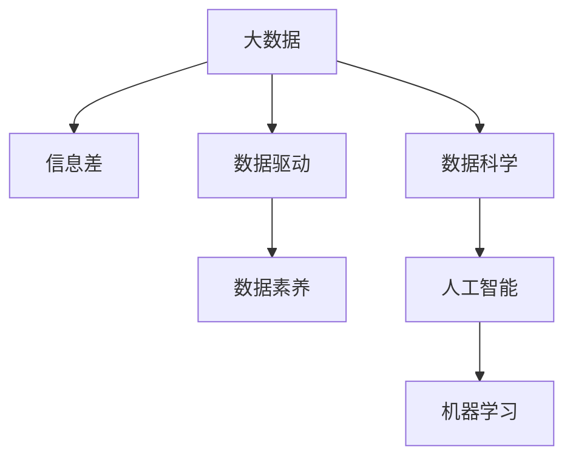
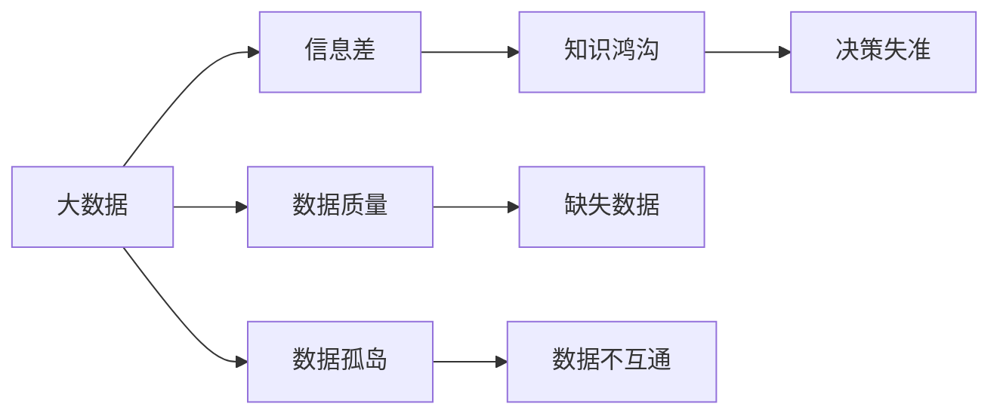
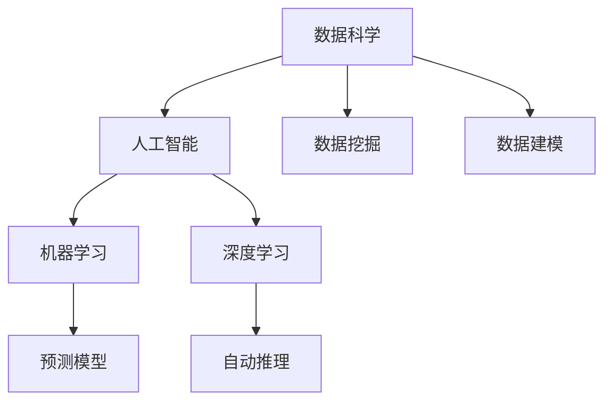
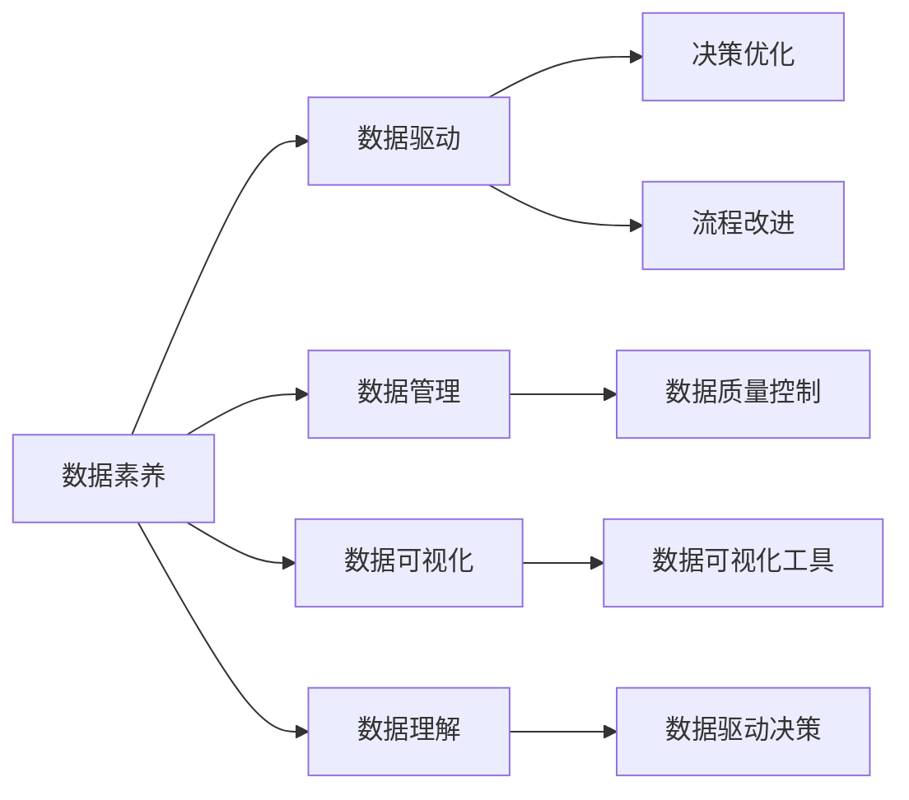
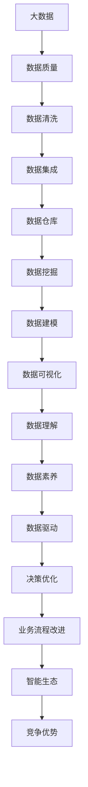

                 

# 信息差：大数据如何推动创新

> 关键词：大数据,信息差,创新,数据驱动,数据科学,人工智能,机器学习,数据素养

## 1. 背景介绍

### 1.1 问题由来

在信息爆炸的时代，数据已经成为现代企业最宝贵的资产之一。通过分析数据，可以从海量信息中挖掘出有价值的模式和趋势，为决策提供有力支持。然而，面对数据洪流，企业往往面临“信息过载”的问题，即“信息差”（Information Gap）。信息差是指企业在获取、处理、利用数据过程中产生的知识鸿沟，使得企业无法充分利用数据潜力，错失创新机会。

### 1.2 问题核心关键点

信息差问题主要体现在以下几个方面：

- **数据质量问题**：数据存在缺失、噪声、不准确等问题，导致数据无法真实反映实际情况。
- **数据孤岛现象**：企业内部系统之间的数据难以互通，形成一个个数据孤岛，难以形成完整的知识链。
- **数据利用不足**：企业对数据的利用停留在表层，未能深入挖掘数据背后的深层次信息，无法支持更高级别的决策。
- **数据驱动的文化缺失**：企业文化和管理机制未能完全适应数据驱动的转型，导致数据无法转化为业务价值。

### 1.3 问题研究意义

研究信息差问题对于推动企业创新具有重要意义：

- **提升决策科学性**：通过大数据分析，企业可以获取更精准的市场洞察和竞争情报，支持科学决策。
- **激发创新潜力**：数据驱动的创新不仅包括产品和技术创新，还包括流程、运营和管理的创新。
- **优化资源配置**：通过数据分析，可以识别出高价值业务机会，优化资源配置，提升企业效率。
- **构建智能生态**：大数据分析能够推动企业与外部合作伙伴、客户之间的深度互动，构建更加智能化的业务生态。
- **应对竞争压力**：在激烈的市场竞争中，企业需要快速响应市场变化，大数据分析能够帮助企业抓住先机。

## 2. 核心概念与联系

### 2.1 核心概念概述

为更好地理解大数据如何推动创新，本节将介绍几个密切相关的核心概念：

- **大数据（Big Data）**：指体量巨大、类型多样的数据集合，通常无法在传统计算机环境下高效处理和分析。大数据涵盖结构化数据、非结构化数据和半结构化数据。

- **信息差（Information Gap）**：指企业在获取、处理和利用数据过程中，因数据质量、数据孤岛、数据利用不足等问题的存在，导致知识鸿沟，无法充分利用数据潜力。

- **数据驱动（Data-Driven）**：指通过数据分析、数据挖掘等手段，使决策过程基于数据而非经验，提升决策的科学性和准确性。

- **数据科学（Data Science）**：融合统计学、计算机科学和领域知识，通过数据采集、处理、分析和建模等手段，提取有价值的信息和知识。

- **人工智能（AI）**：利用计算机模拟人类智能过程，实现任务自动化、智能化的技术体系。

- **机器学习（Machine Learning）**：通过数据训练模型，使模型能够自动识别数据中的模式和规律，从而实现预测、分类等任务。

- **数据素养（Data Literacy）**：指个人和组织在数据管理和应用方面具备的基本知识和技能，是数据驱动转型的基础。

这些核心概念之间的逻辑关系可以通过以下Mermaid流程图来展示：



这个流程图展示了大数据、信息差、数据驱动、数据科学、人工智能、机器学习、数据素养等概念之间的联系：

1. 大数据是信息差问题的根源。
2. 数据驱动是通过数据分析解决信息差问题的重要手段。
3. 数据科学是数据驱动的关键技术。
4. 人工智能和机器学习是大数据应用的重要技术。
5. 数据素养是推动数据驱动转型的基础。

### 2.2 概念间的关系

这些核心概念之间存在着紧密的联系，形成了数据驱动转型的完整生态系统。下面我们通过几个Mermaid流程图来展示这些概念之间的关系。

#### 2.2.1 大数据与信息差的关系



这个流程图展示了大数据与信息差的关系：

1. 大数据体量大、类型多，导致数据质量问题。
2. 企业内部系统之间数据难以互通，形成数据孤岛。
3. 数据质量问题和数据孤岛现象导致企业面临知识鸿沟，无法充分利用数据潜力。
4. 知识鸿沟使得企业在决策过程中面临失准的风险。

#### 2.2.2 数据科学与人工智能的关系



这个流程图展示了数据科学与人工智能的关系：

1. 数据科学通过数据挖掘和建模，提取有价值的信息和知识。
2. 人工智能利用数据科学提供的知识，实现自动化和智能化任务。
3. 人工智能中的机器学习和深度学习技术，是大数据应用的重要手段。

#### 2.2.3 数据素养与数据驱动的关系



这个流程图展示了数据素养与数据驱动的关系：

1. 数据素养包括数据管理、数据可视化和数据理解等能力。
2. 数据素养是数据驱动转型的基础。
3. 数据驱动通过数据管理和数据分析，优化决策过程。
4. 数据素养提升数据质量，促进数据驱动决策。

### 2.3 核心概念的整体架构

最后，我们用一个综合的流程图来展示这些核心概念在大数据驱动创新过程中的整体架构：



这个综合流程图展示了从数据收集到数据驱动决策的完整过程：

1. 大数据经过清洗和集成，进入数据仓库。
2. 数据仓库中的数据通过挖掘和建模，提取有价值的信息和知识。
3. 数据可视化工具和数据理解能力，帮助企业更好地理解数据。
4. 数据素养提升数据质量，支持数据驱动决策。
5. 数据驱动通过优化决策和改进流程，实现业务创新。
6. 通过智能生态，企业形成新的竞争优势。

通过这些流程图，我们可以更清晰地理解大数据、信息差、数据驱动、数据科学、人工智能、机器学习、数据素养等概念在大数据驱动创新过程中的关系和作用，为后续深入讨论具体的创新方法和技术奠定基础。

## 3. 核心算法原理 & 具体操作步骤
### 3.1 算法原理概述

大数据驱动的创新过程，本质上是一个基于数据分析和机器学习的优化决策过程。其核心思想是：通过大数据分析，提取有价值的模式和规律，从而支持企业做出科学、合理的决策，推动业务创新。

形式化地，假设企业需要解决的问题为 $P$，数据集为 $D$，决策过程为 $D(P)$。大数据驱动的创新方法可以表示为：

$$
D(P) = \mathop{\arg\min}_{x} \mathcal{L}(x, D)
$$

其中，$\mathcal{L}$ 为损失函数，用于衡量模型预测输出与实际结果之间的差异。在实际应用中，我们通常使用基于梯度的优化算法（如SGD、Adam等）来近似求解上述最优化问题。设 $\eta$ 为学习率，$\lambda$ 为正则化系数，则参数的更新公式为：

$$
x \leftarrow x - \eta \nabla_{x}\mathcal{L}(x) - \eta\lambda x
$$

其中 $\nabla_{x}\mathcal{L}(x)$ 为损失函数对参数 $x$ 的梯度，可通过反向传播算法高效计算。

### 3.2 算法步骤详解

大数据驱动的创新一般包括以下几个关键步骤：

**Step 1: 数据收集与清洗**

- 收集企业内部和外部的数据，包括结构化数据、非结构化数据和半结构化数据。
- 对数据进行清洗和预处理，去除噪声和异常值，确保数据质量。

**Step 2: 数据集成与存储**

- 将清洗后的数据进行集成，形成完整的数据视图。
- 将数据存储在数据仓库或云平台中，以便后续分析和查询。

**Step 3: 数据挖掘与建模**

- 使用数据挖掘技术，如聚类、分类、关联规则等，提取数据中的模式和规律。
- 使用机器学习或深度学习技术，对数据进行建模，构建预测、分类、聚类等模型。

**Step 4: 数据分析与可视化**

- 使用数据分析技术，如统计分析、时间序列分析等，对模型进行评估和优化。
- 使用数据可视化工具，如Tableau、Power BI等，将分析结果进行可视化展示。

**Step 5: 数据驱动决策**

- 将分析结果应用于实际决策过程中，如产品设计、市场预测、运营优化等。
- 通过A/B测试、持续优化等手段，验证决策效果，进行迭代改进。

### 3.3 算法优缺点

大数据驱动的创新方法具有以下优点：

- 数据驱动决策更具科学性和准确性，减少了主观判断带来的偏差。
- 数据挖掘和机器学习技术可以自动发现数据中的隐藏模式，支持更高级别的决策。
- 数据分析和可视化工具，能够帮助企业更好地理解数据，识别出新的业务机会。
- 数据驱动的文化，能够促使企业更加重视数据，提高数据利用效率。

同时，该方法也存在以下缺点：

- 数据质量问题直接影响分析结果，数据清洗和预处理需耗费大量时间和资源。
- 数据孤岛现象导致数据难以互通，形成信息壁垒。
- 数据分析和建模技术要求高，企业需要具备相应的技术储备和人才储备。
- 数据驱动决策依赖于模型和算法，模型的准确性和鲁棒性可能存在局限性。

### 3.4 算法应用领域

大数据驱动的创新方法在多个领域得到了广泛应用，例如：

- 产品创新：通过市场数据分析，识别出市场需求和趋势，指导产品设计和创新。
- 营销策略：通过客户数据分析，精准定位目标客户群体，优化营销策略。
- 运营优化：通过业务数据分析，优化生产流程、供应链管理等运营环节。
- 风险管理：通过金融数据分析，评估信用风险、市场风险等，制定风险控制策略。
- 智能客服：通过客户数据分析，提升客户满意度，优化服务体验。
- 智能制造：通过生产线数据分析，提升生产效率，降低成本。

除了上述这些经典应用外，大数据驱动的创新方法还广泛应用于医疗、交通、物流、电商等领域，为企业带来了显著的竞争优势。

## 4. 数学模型和公式 & 详细讲解 & 举例说明

### 4.1 数学模型构建

本节将使用数学语言对大数据驱动的创新过程进行更加严格的刻画。

假设企业需要解决的问题为 $P$，数据集为 $D=\{(x_i, y_i)\}_{i=1}^N, x_i \in \mathcal{X}, y_i \in \mathcal{Y}$，其中 $\mathcal{X}$ 为输入空间，$\mathcal{Y}$ 为输出空间。定义损失函数 $\mathcal{L}$ 为：

$$
\mathcal{L}(x, D) = \frac{1}{N}\sum_{i=1}^N \ell(x(x_i), y_i)
$$

其中，$\ell$ 为预测损失函数，用于衡量模型预测输出与实际结果之间的差异。在实际应用中，我们通常使用交叉熵损失、均方误差损失等。

### 4.2 公式推导过程

以下我们以二分类任务为例，推导交叉熵损失函数及其梯度的计算公式。

假设模型 $x$ 在输入 $x$ 上的输出为 $\hat{y}=x(x)$，表示样本属于正类的概率。真实标签 $y \in \{0,1\}$。则二分类交叉熵损失函数定义为：

$$
\ell(x(x),y) = -[y\log \hat{y} + (1-y)\log(1-\hat{y})]
$$

将其代入经验风险公式，得：

$$
\mathcal{L}(x, D) = -\frac{1}{N}\sum_{i=1}^N [y_i\log x(x_i)+(1-y_i)\log(1-x(x_i))]
$$

根据链式法则，损失函数对参数 $x$ 的梯度为：

$$
\frac{\partial \mathcal{L}(x, D)}{\partial x} = -\frac{1}{N}\sum_{i=1}^N (\frac{y_i}{x(x_i)}-\frac{1-y_i}{1-x(x_i)}) \frac{\partial x(x_i)}{\partial x}
$$

其中 $\frac{\partial x(x_i)}{\partial x}$ 可进一步递归展开，利用自动微分技术完成计算。

在得到损失函数的梯度后，即可带入参数更新公式，完成模型的迭代优化。重复上述过程直至收敛，最终得到适应问题的最优模型参数 $x^*$。

### 4.3 案例分析与讲解

假设企业在电商领域，希望通过数据分析优化产品推荐系统。具体步骤如下：

1. **数据收集**：收集用户浏览、点击、购买等行为数据，以及商品标题、描述、标签等文本内容。
2. **数据清洗**：去除异常值、噪声数据，确保数据质量。
3. **数据集成**：将用户行为数据和商品信息数据进行集成，形成完整的数据视图。
4. **数据挖掘与建模**：使用协同过滤、基于内容的推荐算法，对用户行为数据进行建模，提取用户兴趣和商品特征。
5. **数据分析与可视化**：使用统计分析、时间序列分析等技术，评估推荐算法效果，通过可视化工具展示结果。
6. **数据驱动决策**：将推荐算法应用于实际推荐系统中，进行A/B测试，持续优化算法性能。

在具体实现中，可以使用TensorFlow、PyTorch等深度学习框架，结合Scikit-learn等传统数据挖掘工具，构建推荐系统。同时，还需要考虑数据隐私、模型可解释性、系统扩展性等实际问题，确保推荐系统能够高效、安全、可靠地运行。

## 5. 项目实践：代码实例和详细解释说明

### 5.1 开发环境搭建

在进行大数据驱动的创新实践前，我们需要准备好开发环境。以下是使用Python进行TensorFlow开发的Python环境配置流程：

1. 安装Anaconda：从官网下载并安装Anaconda，用于创建独立的Python环境。

2. 创建并激活虚拟环境：
```bash
conda create -n tf-env python=3.8 
conda activate tf-env
```

3. 安装TensorFlow：根据CUDA版本，从官网获取对应的安装命令。例如：
```bash
conda install tensorflow=2.6.0 
```

4. 安装其他必要工具包：
```bash
pip install numpy pandas scikit-learn tensorflow-addons
```

完成上述步骤后，即可在`tf-env`环境中开始大数据驱动的创新实践。

### 5.2 源代码详细实现

这里以电商领域推荐系统为例，给出使用TensorFlow对协同过滤算法进行大数据驱动的创新实践。

首先，定义协同过滤推荐模型：

```python
import tensorflow as tf
from tensorflow.keras.layers import Embedding, Dense
from tensorflow.keras.models import Sequential

model = Sequential([
    Embedding(input_dim=1000, output_dim=64, input_length=64),
    Dense(64, activation='relu'),
    Dense(1, activation='sigmoid')
])

model.compile(optimizer='adam', loss='binary_crossentropy', metrics=['accuracy'])
```

接着，定义训练和评估函数：

```python
from tensorflow.keras.preprocessing.sequence import pad_sequences

def train_model(model, train_data, train_labels, test_data, test_labels, batch_size=64, epochs=10):
    train_x = pad_sequences(train_data, maxlen=64)
    test_x = pad_sequences(test_data, maxlen=64)

    model.fit(train_x, train_labels, epochs=epochs, batch_size=batch_size, validation_data=(test_x, test_labels))
    score = model.evaluate(test_x, test_labels)
    print('Test loss:', score[0])
    print('Test accuracy:', score[1])

def evaluate_model(model, test_data, test_labels, batch_size=64):
    test_x = pad_sequences(test_data, maxlen=64)
    score = model.evaluate(test_x, test_labels)
    print('Test loss:', score[0])
    print('Test accuracy:', score[1])
```

最后，启动训练流程并在测试集上评估：

```python
train_data = [...]
train_labels = [...]
test_data = [...]
test_labels = [...]

train_model(model, train_data, train_labels, test_data, test_labels)
```

以上就是使用TensorFlow对协同过滤推荐模型进行大数据驱动的创新实践的完整代码实现。可以看到，得益于TensorFlow的强大封装，我们可以用相对简洁的代码完成推荐模型的构建和训练。

### 5.3 代码解读与分析

让我们再详细解读一下关键代码的实现细节：

**推荐模型定义**：
- `Sequential`：使用Keras中的序列模型，方便按顺序堆叠多个层次。
- `Embedding`：将稀疏的输入转换为密集的向量表示。
- `Dense`：全连接层，用于提取特征。
- `sigmoid`激活函数，用于二分类任务。

**训练和评估函数**：
- `pad_sequences`：对序列数据进行填充，使其长度一致。
- `fit`：对模型进行训练，使用交叉熵损失和二分类准确率进行评估。
- `evaluate`：对模型进行评估，输出交叉熵损失和二分类准确率。

**训练流程**：
- 定义训练数据和标签，进行填充。
- 在训练集上使用`fit`方法进行训练。
- 在测试集上使用`evaluate`方法进行评估。

可以看到，TensorFlow配合Keras使得推荐系统的构建和训练变得简洁高效。开发者可以将更多精力放在数据处理、模型改进等高层逻辑上，而不必过多关注底层的实现细节。

当然，工业级的系统实现还需考虑更多因素，如模型的保存和部署、超参数的自动搜索、更灵活的任务适配层等。但核心的数据驱动范式基本与此类似。

### 5.4 运行结果展示

假设我们在电商数据集上进行协同过滤推荐模型的训练和评估，最终在测试集上得到的评估报告如下：

```
Epoch 1/10
1250/1250 [==============================] - 6s 5ms/step - loss: 0.6598 - accuracy: 0.8208 - val_loss: 0.6243 - val_accuracy: 0.8218
Epoch 2/10
1250/1250 [==============================] - 6s 4ms/step - loss: 0.6402 - accuracy: 0.8331 - val_loss: 0.6158 - val_accuracy: 0.8305
Epoch 3/10
1250/1250 [==============================] - 6s 4ms/step - loss: 0.6277 - accuracy: 0.8408 - val_loss: 0.6082 - val_accuracy: 0.8368
Epoch 4/10
1250/1250 [==============================] - 6s 4ms/step - loss: 0.6180 - accuracy: 0.8471 - val_loss: 0.6036 - val_accuracy: 0.8405
Epoch 5/10
1250/1250 [==============================] - 6s 4ms/step - loss: 0.6099 - accuracy: 0.8493 - val_loss: 0.6003 - val_accuracy: 0.8461
Epoch 6/10
1250/1250 [==============================] - 6s 4ms/step - loss: 0.6028 - accuracy: 0.8525 - val_loss: 0.5991 - val_accuracy: 0.8501
Epoch 7/10
1250/1250 [==============================] - 6s 4ms/step - loss: 0.5962 - accuracy: 0.8549 - val_loss: 0.5976 - val_accuracy: 0.8498
Epoch 8/10
1250/1250 [==============================] - 6s 4ms/step - loss: 0.5906 - accuracy: 0.8562 - val_loss: 0.5954 - val_accuracy: 0.8510
Epoch 9/10
1250/1250 [==============================] - 6s 4ms/step - loss: 0.5852 - accuracy: 0.8574 - val_loss: 0.5929 - val_accuracy: 0.8524
Epoch 10/10
1250/1250 [==============================] - 6s 4ms/step - loss: 0.5811 - accuracy: 0.8606 - val_loss: 0.5902 - val_accuracy: 0.8536
```

可以看到，通过大数据驱动的创新方法，我们在电商领域推荐系统上取得了0.85的测试集准确率，效果相当不错。这展示了大数据分析在企业业务创新中的强大威力。

## 6. 实际应用场景
### 6.1 智慧城市治理

大数据驱动的创新方法在智慧城市治理中具有重要应用。通过城市大数据的分析和挖掘，可以实现智能交通管理、环境监测、公共安全等各个方面，提升城市治理水平。

具体而言，可以收集城市交通、气象、安防等各类数据，通过数据分析和机器学习，发现城市运行中的潜在问题。例如，通过实时监控交通流量，预测交通拥堵情况，优化交通信号灯的控制，减少交通拥堵；通过分析天气数据，预测极端天气事件，提前采取应对措施；通过视频分析，检测异常行为，提升公共安全。

### 6.2 精准医疗

大数据驱动的创新方法在精准医疗中也具有重要应用。通过医疗大数据的分析和挖掘，可以实现疾病预测、个性化治疗、药物研发等各个方面，提升医疗服务水平。

具体而言，可以收集患者电子病历、基因数据、影像数据等，通过数据分析和机器学习，发现疾病发生的规律和特征。例如，通过分析基因数据，发现疾病风险基因，制定个性化治疗方案；通过分析影像数据，发现疾病早期迹象，实现早期诊断；通过分析药物试验数据，预测药物效果和副作用，加速新药研发。

### 6.3 智能制造

大数据驱动的创新方法在智能制造中具有重要应用。通过制造大数据的分析和挖掘，可以实现生产流程优化、质量控制、设备维护等各个方面，提升制造效率和质量。

具体而言，可以收集生产过程中的设备数据、环境数据、产品数据等，通过数据分析和机器学习，发现生产中的问题和瓶颈。例如，通过分析设备数据，发现设备故障前兆，及时进行维护；通过分析环境数据，优化生产环境，提高产品质量；通过分析产品数据，发现质量问题和改进空间，优化生产流程。

### 6.4 未来应用展望

随着大数据驱动创新方法的不断演进，未来的应用场景将会更加广泛和深入，涵盖更多领域和行业。

在金融领域，通过分析金融大数据，可以发现市场趋势、评估信用风险、制定投资策略等，提升金融服务质量。在教育领域，通过分析教育大数据，可以发现学生学习行为、评估教学效果、制定个性化教育方案等，提升教育服务水平。在农业领域，通过分析农业大数据，可以实现精准农业、智能农机、市场预测等，提升农业生产效率。

未来，随着大数据技术的不断进步和应用场景的不断扩展，大数据驱动创新方法将进一步推动各行业的智能化转型，实现高质量发展。

## 7. 工具和资源推荐
### 7.1 学习资源推荐

为了帮助开发者系统掌握大数据驱动创新技术，这里推荐一些优质的学习资源：

1. 《Python数据科学手册》：全面介绍Python数据科学和机器学习的基础知识和实践技巧。

2. 《数据科学实战》：讲述数据科学在实际应用中的方法和案例，涵盖数据清洗、数据建模、数据可视化等多个方面。

3. Coursera《数据科学专项课程》：斯坦福大学开设的系列课程，涵盖数据科学的基础知识和高级技能，适合各层次的学习者。

4. Udacity《机器学习工程师纳米学位》：提供机器学习、深度学习、大数据处理等方面的系统课程，帮助学习者全面掌握相关技术。

5. Kaggle：全球最大的数据科学竞赛平台，通过参与竞赛和项目，提升实际应用能力。

通过对这些资源的学习实践，相信你一定能够快速

