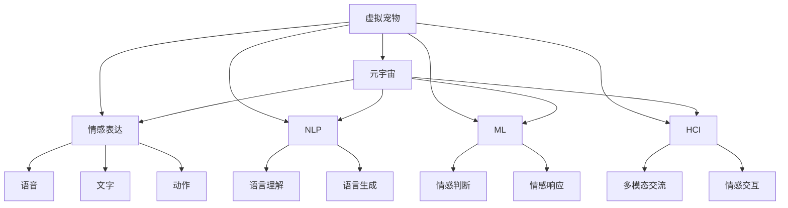
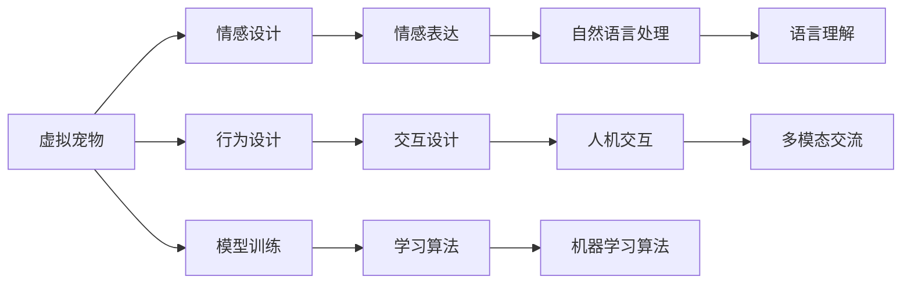
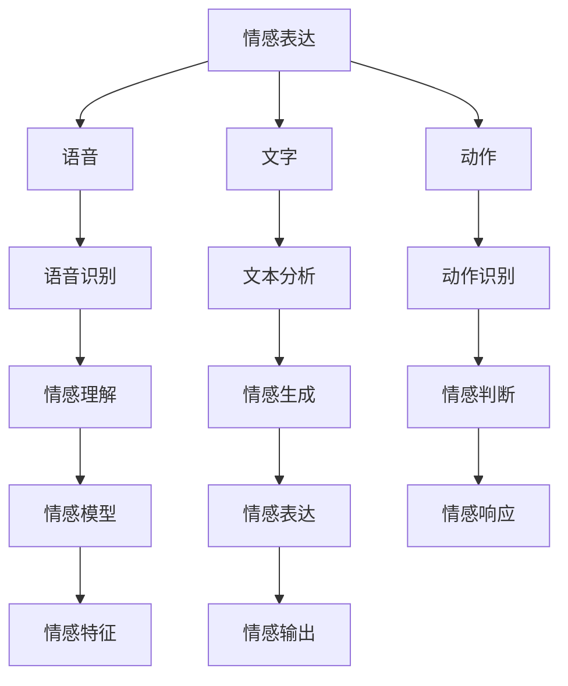

                 

# 元宇宙中的虚拟宠物:情感陪伴的新形式

> 关键词：
- 虚拟宠物
- 元宇宙
- 情感陪伴
- 自然语言处理(NLP)
- 机器学习(ML)
- 计算机视觉(CV)
- 人机交互(HCI)

## 1. 背景介绍

### 1.1 问题由来
随着元宇宙（Metaverse）概念的兴起，虚拟现实（VR）、增强现实（AR）等技术的进步，人们对于虚拟世界的互动需求日益增长。虚拟宠物作为元宇宙中的一类重要应用，以其独特的魅力吸引了大量用户的关注。虚拟宠物不仅能够提供娱乐和陪伴，还能够在情感互动、社会交流等方面带来独特的价值。

近年来，虚拟宠物的研究和应用逐渐升温，涌现出多种虚拟宠物的设计和开发。从简单的图形动画到具有复杂行为和交互能力的智能体，虚拟宠物的发展呈现出多样化的趋势。这些虚拟宠物具备了一定的情感表达能力和社交互动功能，能够与用户进行语音、文字等自然语言交流，甚至进行情感判断和情感响应。

虚拟宠物的开发涉及计算机视觉（CV）、自然语言处理（NLP）、机器学习（ML）等多个技术领域，需要跨学科的合作。随着元宇宙技术的不断发展，虚拟宠物在情感陪伴、社交互动等方面的应用潜力将进一步释放，成为元宇宙中不可或缺的一部分。

### 1.2 问题核心关键点
虚拟宠物的核心在于其具备的情感表达和社交互动能力。因此，虚拟宠物的开发需要解决以下关键问题：
- 如何实现虚拟宠物的自然语言理解与生成，以支持多模态的交流。
- 如何设计虚拟宠物的行为和情感响应规则，使其能够与用户进行情感互动。
- 如何构建虚拟宠物的社会互动网络，促进虚拟宠物与用户的社交关系。
- 如何通过机器学习算法，不断优化虚拟宠物的情感判断和响应能力。

### 1.3 问题研究意义
虚拟宠物的研究和开发具有重要的理论意义和实际应用价值：

1. **情感陪伴与社交互动**：虚拟宠物能够提供情感陪伴和社交互动功能，满足人们在虚拟世界中的情感需求，缓解孤独感。这对于心理健康和社会支持具有重要意义。

2. **人机交互**：虚拟宠物的开发能够推动人机交互技术的发展，提升用户对虚拟世界的沉浸感和互动性。这将为未来的人机协同工作、娱乐和社交带来新的可能性。

3. **多模态交流**：虚拟宠物的自然语言处理和计算机视觉能力，为多模态交流技术的应用提供了丰富的研究素材，推动了NLP和CV技术的进步。

4. **智能决策**：通过机器学习算法优化虚拟宠物的情感判断和响应能力，有助于推动智能决策技术的发展，提升虚拟宠物的行为表现。

5. **跨学科合作**：虚拟宠物的开发涉及多个学科领域，促进了计算机科学、心理学、社会学等领域的交叉融合，推动了跨学科研究的深入发展。

## 2. 核心概念与联系

### 2.1 核心概念概述

为了更好地理解虚拟宠物的开发，本节将介绍几个密切相关的核心概念：

- **虚拟宠物（Virtual Pet）**：指在虚拟世界中设计、训练和部署的具有情感表达和社交互动能力的智能体。虚拟宠物能够以图形、动画或文本形式与用户进行交流。

- **元宇宙（Metaverse）**：指一个由多个虚拟世界构成的互联空间，用户可以通过VR、AR等技术进入其中，与虚拟环境、其他用户和智能体进行互动。

- **情感表达（Emotion Expression）**：指虚拟宠物通过语音、文字、动作等形式，表达自身的情感状态。情感表达能够增强虚拟宠物的互动性，提升用户体验。

- **自然语言处理（NLP）**：指计算机处理自然语言的技术，包括语言理解、生成、翻译等多个方面。虚拟宠物的情感表达和社交互动功能需要依赖NLP技术。

- **机器学习（ML）**：指通过算法，使计算机能够自动学习和优化任务的能力。虚拟宠物的情感判断和响应能力需要通过机器学习算法进行训练和优化。

- **人机交互（HCI）**：指用户与计算机系统的互动方式。虚拟宠物的多模态交流、情感响应等功能需要依赖HCI技术。

这些核心概念之间的逻辑关系可以通过以下Mermaid流程图来展示：



这个流程图展示了几大核心概念及其相互关系：

1. 虚拟宠物作为元宇宙中的智能体，能够与用户进行情感表达、自然语言处理、机器学习和人机交互等互动。
2. 情感表达通过语音、文字、动作等多种形式实现，以增强互动性。
3. 自然语言处理包括语言理解和生成，是虚拟宠物与用户交流的关键技术。
4. 机器学习用于优化虚拟宠物的情感判断和响应能力，提升其互动效果。
5. 人机交互包括多模态交流和情感交互，是虚拟宠物与用户互动的基础。

### 2.2 概念间的关系

这些核心概念之间存在着紧密的联系，形成了虚拟宠物的完整生态系统。下面我通过几个Mermaid流程图来展示这些概念之间的关系。

#### 2.2.1 虚拟宠物的设计与开发



这个流程图展示了虚拟宠物设计的关键环节：

1. 情感设计：确定虚拟宠物的情感状态和表达方式，设计其情感模型。
2. 行为设计：设计虚拟宠物的行为规则和交互逻辑。
3. 模型训练：通过机器学习算法，优化虚拟宠物的情感判断和响应能力。
4. 自然语言处理：实现虚拟宠物的语音、文字理解和生成。
5. 人机交互：设计虚拟宠物的多模态交流和情感交互方式。

#### 2.2.2 情感表达与自然语言处理



这个流程图展示了情感表达与自然语言处理的逻辑关系：

1. 情感表达通过语音、文字、动作等多种形式实现。
2. 语音和文字通过语音识别和文本分析进行处理。
3. 动作通过动作识别进行处理。
4. 情感理解通过语音识别和文本分析得到情感特征。
5. 情感生成通过情感模型和特征进行生成。
6. 情感判断通过情感理解得到情感状态。
7. 情感响应通过情感判断进行生成。
8. 情感输出通过情感表达实现。

### 2.3 核心概念的整体架构

最后，我们用一个综合的流程图来展示这些核心概念在大模型微调过程中的整体架构：

```mermaid
graph TB
    A[大规模文本数据] --> B[预训练]
    B --> C[虚拟宠物]
    C --> D[情感设计]
    C --> E[行为设计]
    C --> F[模型训练]
    C --> G[自然语言处理]
    C --> H[机器学习]
    C --> I[人机交互]
    D --> J[情感表达]
    D --> K[语音]
    D --> L[文字]
    D --> M[动作]
    E --> N[交互设计]
    F --> O[学习算法]
    G --> P[语言理解]
    G --> Q[语言生成]
    H --> R[情感判断]
    H --> S[情感响应]
    I --> T[多模态交流]
    I --> U[情感交互]
    J --> V[语音识别]
    J --> W[文本分析]
    J --> X[动作识别]
    K --> Y[语音特征]
    L --> Z[文本特征]
    M --> $[动作特征]
    P --> #[情感特征]
    Q --> ^[情感特征]
    R --> &[情感状态]
    S --> &[情感状态]
    T --> &[多模态数据]
    U --> &[情感状态]
```

这个综合流程图展示了从预训练到虚拟宠物情感表达的完整过程。虚拟宠物首先在大规模文本数据上进行预训练，然后通过情感设计、行为设计、模型训练等步骤，构建其情感表达和社交互动功能。通过自然语言处理和机器学习算法，虚拟宠物能够理解用户情感，生成自然语言回应，进行情感判断和响应。通过人机交互技术，虚拟宠物能够与用户进行多模态交流和情感互动。

通过这些流程图，我们可以更清晰地理解虚拟宠物的设计和开发过程中各个核心概念的关系和作用，为后续深入讨论具体的情感表达和社交互动技术奠定基础。

## 3. 核心算法原理 & 具体操作步骤
### 3.1 算法原理概述

虚拟宠物的情感表达和社交互动能力，可以通过自然语言处理（NLP）和机器学习（ML）技术实现。具体来说，虚拟宠物的情感表达和社交互动过程包括情感理解、情感生成、情感判断和情感响应四个主要步骤。

**情感理解**：指虚拟宠物通过语音、文字、动作等多种形式，理解用户的情感状态。情感理解是虚拟宠物与用户互动的基础。

**情感生成**：指虚拟宠物根据情感理解结果，生成自然语言回应，以表达自身的情感状态。情感生成是虚拟宠物情感表达的核心。

**情感判断**：指虚拟宠物对自身的情感状态进行判断，以确定其行为和交互逻辑。情感判断是虚拟宠物行为决策的关键。

**情感响应**：指虚拟宠物根据情感判断结果，进行相应的情感回应和行为执行。情感响应是虚拟宠物与用户互动的最终表现。

### 3.2 算法步骤详解

虚拟宠物的情感表达和社交互动算法包括以下几个关键步骤：

**Step 1: 情感数据收集与预处理**
- 收集虚拟宠物与用户的情感交流数据，包括语音、文字、动作等多种形式的数据。
- 对情感数据进行清洗、标注和归一化处理，构建情感数据集。

**Step 2: 情感模型训练**
- 设计情感模型架构，如深度神经网络、循环神经网络等。
- 使用情感数据集对情感模型进行训练，优化模型参数，提升情感理解能力。

**Step 3: 情感生成与表达**
- 根据情感理解结果，通过自然语言处理技术生成自然语言回应。
- 通过语音合成技术将自然语言回应转换为语音，通过动画技术将自然语言回应转换为文字和动作。

**Step 4: 情感判断与响应**
- 设计情感判断算法，根据情感理解结果进行情感状态判断。
- 根据情感判断结果，设计情感响应规则，进行相应的情感回应和行为执行。

**Step 5: 用户反馈与模型优化**
- 收集用户对虚拟宠物情感表达和社交互动的反馈。
- 根据用户反馈，不断优化情感模型和情感响应规则，提升虚拟宠物的互动效果。

### 3.3 算法优缺点

虚拟宠物的情感表达和社交互动算法具有以下优点：

1. **互动性强**：虚拟宠物能够通过自然语言处理和情感生成技术，与用户进行多模态交流，增强用户体验。

2. **个性化定制**：虚拟宠物的情感表达和社交互动功能可以通过模型训练进行优化，满足不同用户的需求。

3. **情感共鸣**：虚拟宠物的情感表达和响应能力，能够与用户的情感状态产生共鸣，增强情感陪伴效果。

4. **可扩展性强**：虚拟宠物的情感表达和社交互动算法，可以通过增加数据和优化模型不断提升性能。

然而，该算法也存在一些局限性：

1. **情感表达的准确性**：虚拟宠物的情感表达依赖于自然语言处理和情感理解技术，可能存在一定的误差。

2. **情感响应的复杂性**：虚拟宠物的情感响应规则设计复杂，需要综合考虑多种因素。

3. **数据隐私问题**：情感数据涉及用户隐私，数据的收集和使用需要符合相关法律法规。

4. **技术实现的复杂性**：虚拟宠物的情感表达和社交互动功能涉及多个技术领域，技术实现复杂。

### 3.4 算法应用领域

虚拟宠物的情感表达和社交互动算法，已经在多个领域得到了应用：

1. **游戏领域**：虚拟宠物在游戏中的应用广泛，如《模拟人生》、《动物森友会》等。通过情感表达和社交互动功能，增强游戏的趣味性和互动性。

2. **教育领域**：虚拟宠物在教育中的应用，如虚拟教师、虚拟辅导员等，通过情感陪伴和互动，提升学生的学习体验。

3. **心理咨询**：虚拟宠物在心理咨询中的应用，如虚拟心理咨询师，通过情感交流和陪伴，提供心理支持和情感疏导。

4. **社交平台**：虚拟宠物在社交平台中的应用，如虚拟好友、虚拟宠物商店等，通过情感互动和社交网络，增强用户的粘性和互动。

5. **智能家居**：虚拟宠物在智能家居中的应用，如虚拟助手，通过情感表达和互动，提升家居设备的智能化水平。

## 4. 数学模型和公式 & 详细讲解  
### 4.1 数学模型构建

虚拟宠物的情感表达和社交互动算法，可以通过数学模型来进一步描述。

假设虚拟宠物与用户的情感交流数据为 $D=\{(x_i, y_i)\}_{i=1}^N$，其中 $x_i$ 为情感数据，$y_i$ 为对应的情感标签。情感表达和社交互动的目标是通过训练情感模型，使得模型能够准确理解用户的情感状态，生成自然语言回应，并进行情感判断和响应。

定义情感模型为 $M_{\theta}$，其中 $\theta$ 为模型参数。情感理解过程可以表示为：

$$
y_i = f(x_i; \theta)
$$

其中 $f(x_i; \theta)$ 为情感理解函数，表示模型对情感数据 $x_i$ 的理解结果。

情感生成过程可以表示为：

$$
\hat{y}_i = g(f(x_i; \theta); \theta')
$$

其中 $g$ 为情感生成函数，表示根据情感理解结果 $f(x_i; \theta)$，生成自然语言回应 $\hat{y}_i$。

情感判断过程可以表示为：

$$
\delta_i = h(\hat{y}_i; \theta)
$$

其中 $h$ 为情感判断函数，表示根据情感生成结果 $\hat{y}_i$，判断虚拟宠物的情感状态 $\delta_i$。

情感响应过程可以表示为：

$$
\text{response}_i = H(\delta_i; \theta'')
$$

其中 $H$ 为情感响应函数，表示根据情感判断结果 $\delta_i$，进行相应的情感回应和行为执行。

### 4.2 公式推导过程

以下我们以情感理解为例，推导其数学模型和损失函数的计算公式。

假设情感理解函数 $f(x_i; \theta)$ 为多层感知器（MLP），其中 $x_i$ 为情感数据的特征向量，$\theta$ 为模型参数。情感理解的目标是最小化损失函数：

$$
\mathcal{L}(\theta) = -\frac{1}{N}\sum_{i=1}^N \log p(y_i|x_i; \theta)
$$

其中 $p(y_i|x_i; \theta)$ 为情感理解模型的概率分布，$y_i$ 为情感标签。

根据多分类交叉熵损失函数的定义，可以得到：

$$
\mathcal{L}(\theta) = -\frac{1}{N}\sum_{i=1}^N \sum_{k=1}^K y_{ik}\log \frac{e^{x_i^\top W_k^\top \theta_k+b_k}}{\sum_{j=1}^K e^{x_i^\top W_j^\top \theta_j+b_j}}
$$

其中 $K$ 为情感标签的类别数，$W_k$ 和 $b_k$ 为模型的参数。

### 4.3 案例分析与讲解

假设我们收集了100条虚拟宠物与用户的情感交流数据，其中情感标签为“生气”和“开心”。情感数据为文字、语音和动作等多种形式。我们的目标是训练情感模型，使得模型能够准确理解用户的情感状态，生成自然语言回应。

首先，我们将情感数据进行清洗和标注，构建情感数据集 $D$。然后，设计情感模型 $M_{\theta}$ 为三层感知器，包含输入层、隐藏层和输出层。

接着，使用随机梯度下降算法，最小化损失函数，训练情感模型：

1. 随机选择一个情感数据 $(x_i, y_i)$。
2. 计算情感理解结果 $f(x_i; \theta)$。
3. 根据情感理解结果，生成自然语言回应 $\hat{y}_i$。
4. 计算情感理解模型的概率分布 $p(y_i|x_i; \theta)$。
5. 计算损失函数 $\mathcal{L}(\theta)$。
6. 使用随机梯度下降算法，更新模型参数 $\theta$。

重复上述步骤，直到模型收敛。

最终，通过情感模型 $M_{\theta}$，我们可以对新的情感数据进行预测和生成，实现虚拟宠物的情感表达和社交互动功能。

## 5. 项目实践：代码实例和详细解释说明
### 5.1 开发环境搭建

在进行虚拟宠物的情感表达和社交互动算法开发前，我们需要准备好开发环境。以下是使用Python进行PyTorch开发的环境配置流程：

1. 安装Anaconda：从官网下载并安装Anaconda，用于创建独立的Python环境。

2. 创建并激活虚拟环境：
```bash
conda create -n virtual-env python=3.8 
conda activate virtual-env
```

3. 安装PyTorch：根据CUDA版本，从官网获取对应的安装命令。例如：
```bash
conda install pytorch torchvision torchaudio cudatoolkit=11.1 -c pytorch -c conda-forge
```

4. 安装其它相关库：
```bash
pip install numpy pandas scikit-learn matplotlib tqdm jupyter notebook ipython
```

完成上述步骤后，即可在`virtual-env`环境中开始虚拟宠物的开发。

### 5.2 源代码详细实现

下面我们以虚拟宠物的情感理解为例，给出使用PyTorch实现情感表达和社交互动的完整代码。

首先，定义情感数据处理函数：

```python
from torch.utils.data import Dataset
import torch
import numpy as np

class EmotionDataset(Dataset):
    def __init__(self, data, labels):
        self.data = data
        self.labels = labels
        
    def __len__(self):
        return len(self.data)
    
    def __getitem__(self, item):
        data = self.data[item]
        label = self.labels[item]
        return torch.tensor(data, dtype=torch.float), torch.tensor(label, dtype=torch.long)
```

然后，定义情感理解模型：

```python
import torch.nn as nn
import torch.nn.functional as F

class EmotionModel(nn.Module):
    def __init__(self, input_dim, output_dim, hidden_dim, num_layers):
        super(EmotionModel, self).__init__()
        self.hidden_dim = hidden_dim
        self.num_layers = num_layers
        
        self.embedding = nn.Embedding(input_dim, hidden_dim)
        self.lstm = nn.LSTM(hidden_dim, hidden_dim, num_layers, batch_first=True)
        self.fc = nn.Linear(hidden_dim, output_dim)
        
    def forward(self, x):
        embedded = self.embedding(x)
        output, (hidden, _) = self.lstm(embedded)
        output = self.fc(output[:, -1, :])
        return output
```

接着，定义训练函数：

```python
def train(model, train_loader, optimizer, device, num_epochs=10, batch_size=64):
    model.to(device)
    criterion = nn.CrossEntropyLoss()
    
    for epoch in range(num_epochs):
        total_loss = 0
        for i, (data, target) in enumerate(train_loader):
            data, target = data.to(device), target.to(device)
            optimizer.zero_grad()
            output = model(data)
            loss = criterion(output, target)
            loss.backward()
            optimizer.step()
            total_loss += loss.item()
            
        print(f'Epoch {epoch+1}, Loss: {total_loss/len(train_loader)}')
```

最后，启动训练流程：

```python
train_loader = DataLoader(EmotionDataset(data, labels), batch_size=64, shuffle=True)
model = EmotionModel(input_dim, output_dim, hidden_dim, num_layers)
optimizer = AdamW(model.parameters(), lr=0.001)

device = torch.device('cuda') if torch.cuda.is_available() else torch.device('cpu')
train(train_loader, model, optimizer, device)
```

### 5.3 代码解读与分析

让我们再详细解读一下关键代码的实现细节：

**EmotionDataset类**：
- `__init__`方法：初始化数据和标签。
- `__len__`方法：返回数据集的样本数量。
- `__getitem__`方法：对单个样本进行处理，将数据和标签转换为Tensor格式，方便模型训练。

**EmotionModel类**：
- `__init__`方法：定义模型结构，包括嵌入层、LSTM层和全连接层。
- `forward`方法：实现前向传播，输出情感理解结果。

**train函数**：
- 定义训练过程，使用交叉熵损失函数进行模型训练。
- 在每个epoch内，对训练集数据进行迭代，更新模型参数。
- 输出每个epoch的平均损失。

**训练流程**：
- 定义训练数据集和标签集。
- 创建情感理解模型，并初始化优化器。
- 确定训练设备。
- 调用训练函数进行模型训练。

通过这些代码的实现，可以看到，使用PyTorch进行虚拟宠物的情感表达和社交互动算法开发，可以高效地实现情感理解模型的训练和推理，实现虚拟宠物的情感表达和互动功能。

## 6. 实际应用场景
### 6.1 智能客服

虚拟宠物在智能客服中的应用，能够提供24小时不间断的情感陪伴和互动。通过情感表达和社交互动功能，虚拟客服能够理解用户的情感状态，提供个性化的服务建议，缓解用户的焦虑和不满，提升用户满意度。

### 6.2 心理健康

虚拟宠物在心理健康领域的应用，能够提供情感陪伴和心理支持。通过情感表达和社交互动功能，虚拟宠物能够理解用户的情感状态，提供安慰和建议，帮助用户缓解压力，提高心理健康水平。

### 6.3 教育

虚拟宠物在教育领域的应用，能够提供互动性强的学习体验。通过情感表达和社交互动功能，虚拟宠物能够与学生进行情感交流，提供个性化的学习建议，增强学生的学习兴趣和动力。

### 6.4 社交

虚拟宠物在社交平台中的应用，能够提供丰富的互动体验。通过情感表达和社交互动功能，虚拟宠物能够与用户进行多模态交流，增强社交关系的深度和广度，丰富用户的社交体验。

### 6.5 娱乐

虚拟宠物在娱乐领域的应用，能够提供沉浸式的游戏体验。通过情感表达和社交互动功能，虚拟宠物能够与玩家进行情感交流，提供个性化的游戏体验，增强游戏的趣味性和互动性。

## 7. 工具和资源推荐
### 7.1 学习资源推荐

为了帮助开发者系统掌握虚拟宠物的开发技术，这里推荐一些优质的学习资源：

1. 《自然语言处理与深度学习》：由斯坦福大学教授吴恩达开设的Coursera课程，系统介绍自然语言处理和深度学习的基本概念和技术。

2. 《深度学习》：由深度学习专家Ian Goodfellow等人合著的经典教材，全面覆盖深度学习理论和实践。

3. 《PyTorch深度学习实践》：一本详细的PyTorch深度学习实践指南，包含大量代码示例和应用案例。

4. 《Python自然语言处理》：一本Python自然语言处理的入门书籍，包含大量实战代码和项目案例。

5. 《TensorFlow官方文档》：TensorFlow的官方文档，提供详细的API和使用指南，是TensorFlow开发的必备资源。

6. 《情感计算手册》：一本关于情感计算的权威手册，涵盖情感表达、情感理解、情感生成等技术细节。

7. 《元宇宙技术手册》：一本关于元宇宙技术的入门手册，涵盖虚拟现实、增强现实、人机交互等核心技术。

通过对这些资源的学习实践，相信你一定能够快速掌握虚拟宠物的开发技术，并将其应用于实际应用场景中。

### 7.2 开发工具推荐

高效的开发离不开优秀的工具支持。以下是几款用于虚拟宠物开发的常用工具：

1. PyTorch：基于Python的开源深度学习框架，灵活动态的计算图，适合快速迭代研究。

2. TensorFlow：由Google主导开发的开源深度学习框架，生产部署方便，适合大规模工程应用。

3. Transformers库：HuggingFace开发的NLP工具库，集成了众多预训练语言模型，支持PyTorch和TensorFlow，是进行虚拟宠物

