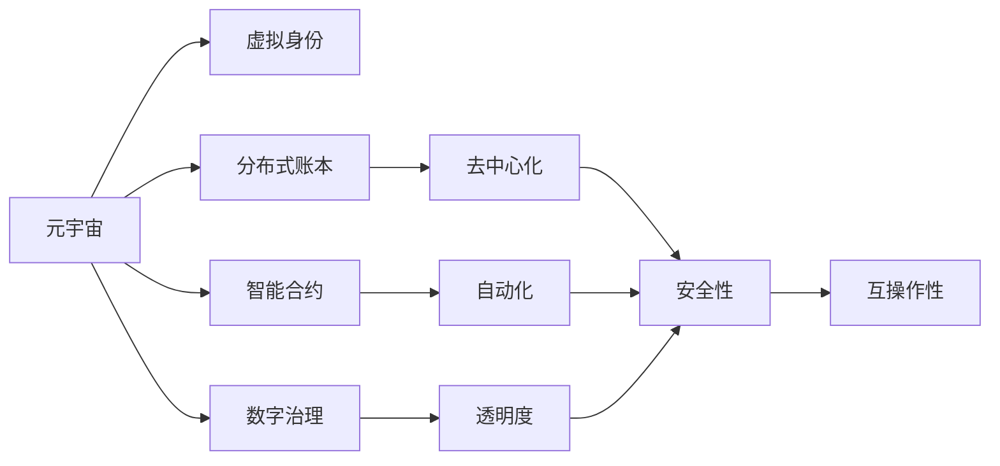
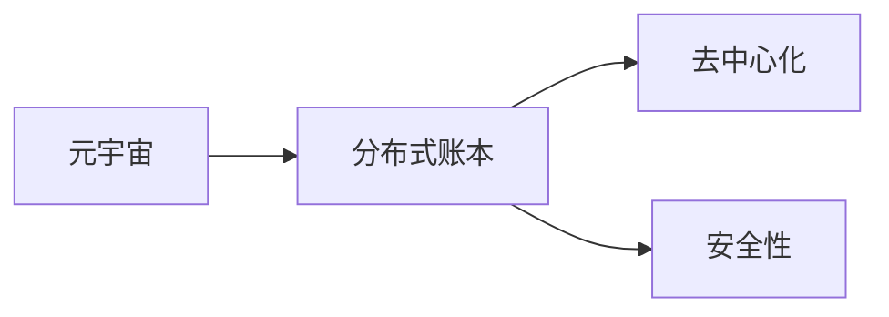
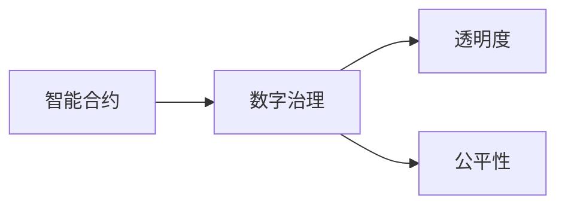
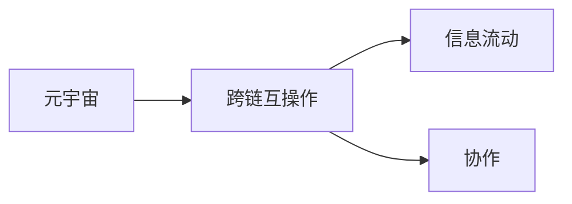
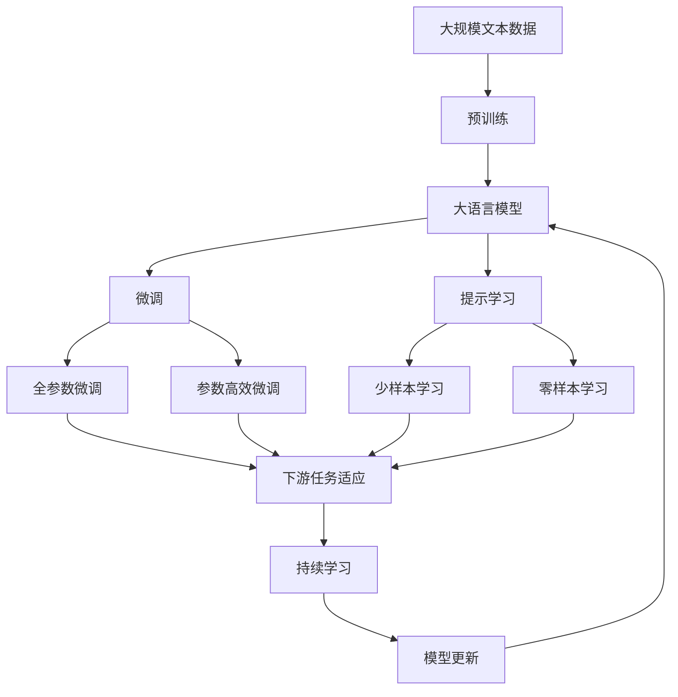

                 

## 1. 背景介绍

### 1.1 问题由来

元宇宙作为新一代数字社会基础设施，正逐渐从概念走向现实。如何构建高效、公正、安全的元宇宙治理架构，成为全球政府和政策制定者面临的重大挑战。一方面，元宇宙的虚拟环境具有去中心化、复杂化、互动性等特点，这对传统的集中式管理方式提出了巨大挑战。另一方面，元宇宙的开放性、自由度，也带来了虚拟行为规范、虚拟财产保护、虚拟身份认证等诸多难题。

与此同时，疫情的全球蔓延加速了数字转型进程，各国政府和社会各界对数字化治理的关注度空前提高。从金融、教育、医疗到公共服务，数字化转型正在重塑各行各业的运营模式，提高治理效率，增强透明度和可追溯性。

如何利用数字技术构建元宇宙治理架构，从而推动全球治理的数字化进程，成为当下亟需探讨的重要课题。本文将深入剖析元宇宙政府架构的核心概念与设计思路，探讨如何通过数字技术实现全球治理的数字化新模式。

### 1.2 问题核心关键点

构建元宇宙政府架构的关键在于：
1. 确定架构设计原则：包括去中心化、开放性、公平性、互操作性等。
2. 选择合适的技术栈：如区块链、分布式账本、智能合约等。
3. 建立统一治理标准：制定元宇宙行为规范、数据管理、虚拟财产保护等标准。
4. 设计用户交互界面：包括虚拟身份认证、交互协议、用户体验优化等。
5. 确保系统安全性：采用分布式存储、加密技术、共识机制等安全手段。
6. 推动多边协作：促进政府、企业、社区等多方参与，共建数字社会。

这些关键点共同构成了元宇宙政府架构的设计框架，帮助政府在数字化转型中实现治理能力的提升，构建更高效、透明、公正的数字治理体系。

### 1.3 问题研究意义

构建元宇宙政府架构，对于推动全球治理的数字化进程具有重要意义：
1. 提升治理效率：通过数字技术，政府能够实时响应社会动态，提高决策速度和执行效率。
2. 增强透明度：数字化治理可以提供实时数据监控和公开透明度，减少信息不对称和误导性信息。
3. 促进公平性：元宇宙的开放性可以提升公民参与度，增强决策的公平性和代表性。
4. 保障数据安全：数字技术能够实现数据加密和隐私保护，防止数据泄露和滥用。
5. 推动技术创新：数字治理架构为新技术的试点和应用提供了良好平台。

总之，元宇宙政府架构的构建，不仅有助于应对当前全球治理面临的新挑战，也将为未来的数字社会发展奠定坚实基础。

## 2. 核心概念与联系

### 2.1 核心概念概述

构建元宇宙政府架构涉及多个关键概念，这些概念之间的联系密切且相互依存。以下是元宇宙政府架构的核心概念及其概述：

- **元宇宙**：指通过虚拟现实、增强现实等技术构建的虚拟空间，具备高度模拟现实世界的交互和体验。
- **虚拟身份**：指在元宇宙中的数字身份，可以代表个人或机构的虚拟存在。
- **分布式账本**：指通过区块链等技术实现的去中心化数据存储和验证机制。
- **智能合约**：指通过代码实现自动执行的合约，能够在元宇宙中实现自动化的交易和规则执行。
- **数字治理**：指通过数字技术实现的社会治理，涵盖元宇宙行为规范、数据管理、虚拟财产保护等。
- **跨链互操作**：指不同区块链之间的信息互通和操作协同，促进元宇宙内的信息流动和协作。

这些概念之间的逻辑关系可以通过以下Mermaid流程图来展示：



这个流程图展示了大语言模型微调过程中各个核心概念的关系和作用：

1. 元宇宙是虚拟身份、分布式账本、智能合约、数字治理的基础平台。
2. 虚拟身份通过分布式账本进行管理和验证。
3. 智能合约提供自动化执行机制，增强治理的透明性和公平性。
4. 数字治理包括行为规范、数据管理、虚拟财产保护等，是元宇宙的核心治理目标。
5. 去中心化和自动化是分布式账本和智能合约的重要特性，确保元宇宙的安全性和透明性。
6. 互操作性通过跨链技术实现，促进元宇宙内的信息流动和协作。

这些概念共同构成了元宇宙政府架构的设计基础，帮助政府在数字化治理中实现更高效、透明、公正的数字治理体系。

### 2.2 概念间的关系

这些核心概念之间存在着紧密的联系，形成了元宇宙政府架构的设计生态系统。下面我通过几个Mermaid流程图来展示这些概念之间的关系。

#### 2.2.1 元宇宙与分布式账本的关系



这个流程图展示了元宇宙和分布式账本之间的关系。元宇宙中的数据和行为记录通过分布式账本进行去中心化存储和验证，确保数据的安全性和透明度。

#### 2.2.2 智能合约与数字治理的关系



这个流程图展示了智能合约与数字治理之间的关系。智能合约通过代码实现自动化的规则执行，增强了数字治理的透明度和公平性。

#### 2.2.3 跨链互操作与元宇宙的关系



这个流程图展示了跨链互操作与元宇宙之间的关系。跨链互操作技术促进了元宇宙内的信息流动和多方协作，增强了元宇宙的互联互通能力。

### 2.3 核心概念的整体架构

最后，我们用一个综合的流程图来展示这些核心概念在大语言模型微调过程中的整体架构：



这个综合流程图展示了从预训练到微调，再到持续学习的完整过程。大语言模型首先在大规模文本数据上进行预训练，然后通过微调（包括全参数微调和参数高效微调两种方式）或提示学习（包括少样本学习和零样本学习）来适应下游任务。最后，通过持续学习技术，模型可以不断更新和适应新的任务和数据。 通过这些流程图，我们可以更清晰地理解元宇宙政府架构的设计思路和关键组成。

## 3. 核心算法原理 & 具体操作步骤
### 3.1 算法原理概述

元宇宙政府架构的设计遵循去中心化、开放性、公平性、互操作性等原则。其中，去中心化是核心，开放性和公平性是目标，互操作性是手段。

- **去中心化**：通过分布式账本和智能合约实现数据和行为的自动化管理，减少中心化系统的风险和弊端。
- **开放性**：允许多方参与元宇宙的治理和建设，提高公民参与度和决策的代表性。
- **公平性**：通过透明规则和机制，确保治理过程的公正性，保护各方权益。
- **互操作性**：通过跨链互操作技术，实现不同系统之间的信息互通和协同工作。

### 3.2 算法步骤详解

构建元宇宙政府架构的步骤主要包括以下几个关键环节：

**Step 1: 设计治理框架**

1. 确定治理目标和原则，明确元宇宙行为规范、数据管理、虚拟财产保护等目标。
2. 设计治理模型，确定元宇宙中的角色和职责，制定规则和流程。
3. 设计数据存储和验证机制，确保数据的安全性、透明性和可追溯性。

**Step 2: 选择技术栈**

1. 选择合适的区块链技术，如以太坊、EOS等，实现分布式账本和智能合约功能。
2. 选择跨链互操作技术，如Polkadot、Cosmos等，促进不同区块链之间的信息流动。
3. 选择分布式存储技术，如IPFS、Filecoin等，保证数据的分布式存储和冗余备份。

**Step 3: 开发治理应用**

1. 开发虚拟身份管理系统，实现用户认证、权限管理、行为记录等功能。
2. 开发智能合约系统，实现自动化规则执行、虚拟交易、数据管理等功能。
3. 开发跨链互操作模块，实现不同区块链之间的信息互通和协同工作。

**Step 4: 测试和部署**

1. 进行系统测试，验证治理框架的各项功能是否符合预期。
2. 部署系统到生产环境，实现元宇宙的数字化治理。
3. 持续监测系统运行状态，及时处理异常和故障。

**Step 5: 持续优化**

1. 根据用户反馈和运行数据，不断优化治理框架，提升治理效率和公平性。
2. 引入新技术和新思路，推动治理架构的不断升级和演进。

以上是构建元宇宙政府架构的一般流程。在实际应用中，还需要根据具体需求，对各个环节进行优化和调整。

### 3.3 算法优缺点

元宇宙政府架构的设计具有以下优点：

1. **去中心化**：通过分布式账本和智能合约，减少了中心化系统的风险和弊端，提升了系统的可靠性和鲁棒性。
2. **开放性**：允许多方参与元宇宙的治理和建设，提高了公民参与度和决策的代表性，增强了治理的公平性和透明度。
3. **互操作性**：通过跨链互操作技术，实现不同系统之间的信息流动和协作，促进了元宇宙的互联互通。

但同时，元宇宙政府架构也存在以下缺点：

1. **技术复杂性**：分布式账本、智能合约、跨链互操作等技术较为复杂，设计和实现难度较大。
2. **安全风险**：分布式账本和智能合约的安全性依赖于技术实现和用户行为，存在被攻击和滥用的风险。
3. **法律和政策挑战**：元宇宙的虚拟行为规范、虚拟财产保护等需要法律和政策的支撑，存在法律和政策层面的不确定性。

这些优缺点需要开发者在设计过程中进行全面考虑和权衡，以构建高效、透明、安全的元宇宙政府架构。

### 3.4 算法应用领域

元宇宙政府架构的应用领域非常广泛，涵盖金融、教育、医疗、公共服务等多个领域。以下是一些主要应用场景：

- **金融监管**：通过区块链和智能合约技术，实现金融行为的自动化监管和审计，提升金融系统的透明性和安全性。
- **智慧教育**：利用虚拟身份和智能合约技术，实现教育资源的智能分配和调度，提升教育公平性和教学效率。
- **智慧医疗**：通过分布式账本和智能合约，实现医疗数据的共享和协作，提升医疗服务的质量和效率。
- **公共服务**：利用虚拟身份和智能合约，实现公共服务的自动化管理和调度，提升公共服务的响应速度和公平性。
- **城市治理**：通过分布式账本和智能合约，实现城市事件的实时监控和应急响应，提升城市治理的智能化水平。

元宇宙政府架构的应用将为全球治理带来全新的模式，推动数字社会的全面转型。

## 4. 数学模型和公式 & 详细讲解
### 4.1 数学模型构建

元宇宙政府架构的数学模型主要涉及分布式账本、智能合约等技术的实现。以区块链为例，我们可以使用以下数学模型进行描述：

- **区块链共识算法**：如PoW、PoS、DPoS等，用于保证区块链系统的安全性和透明性。
- **分布式账本存储**：通过哈希链和共识算法实现去中心化数据存储和验证。
- **智能合约执行机制**：通过代码实现自动化的规则执行，确保治理过程的公正性和透明性。

### 4.2 公式推导过程

以下以区块链共识算法为例，推导PoW和PoS的基本公式和算法步骤：

**PoW（工作量证明）**：

$$
M_i = H(m_i) + H(H(m_i) + m_{i-1})
$$

其中，$m_i$ 表示区块的交易数据，$H$ 表示哈希函数，$M_i$ 表示第 $i$ 个区块的信息摘要。

**PoS（权益证明）**：

$$
P_i = \frac{V_i \cdot \text{epoch\_time}}{\sum_{j=1}^{N}V_j}
$$

其中，$V_i$ 表示第 $i$ 个节点的权益，epoch\_time 表示一个共识周期的时间，$P_i$ 表示节点 $i$ 的概率权重。

在实际应用中，这些公式可以通过智能合约代码实现自动执行，确保区块链系统的安全性和透明性。

### 4.3 案例分析与讲解

以智能合约为例，下面我们给出智能合约的代码实现和详细解释：

```python
from web3 import Web3
from eth_abi import encode_abi

contract_address = '0x1234567890abcdef'
contract_abi = """
[{
    "anonymous": false,
    "inputs": [],
    "name": "Mint",
    "outputs": [{"internalType": "uint256", "name": "", "type": "uint256"}],
    "stateMutability": "nonpayable",
    "type": "function"
}],
"""

w3 = Web3(Web3.HTTPProvider('http://localhost:8545'))
contract = w3.eth.contract(address=contract_address, abi=contract_abi)
tx_hash = contract.functions.Mint().encodeABI()
tx = {
    'to': contract_address,
    'gasPrice': 21000,
    'gas': 3000000,
    'nonce': w3.eth.getTransactionCount(contract_address),
    'data': tx_hash
}
signed_tx = w3.eth.account.signTransaction(tx, '0x1234567890abcdef')
w3.eth.sendRawTransaction(signed_tx.rawTransaction)
```

这段代码实现了一个简单的智能合约，通过ABI编码实现了Mint函数。在实际应用中，智能合约可以自动执行各种规则和逻辑，确保元宇宙治理的公正性和透明性。

## 5. 项目实践：代码实例和详细解释说明
### 5.1 开发环境搭建

在进行元宇宙政府架构的开发实践前，我们需要准备好开发环境。以下是使用Python进行Web3开发的环境配置流程：

1. 安装Anaconda：从官网下载并安装Anaconda，用于创建独立的Python环境。

2. 创建并激活虚拟环境：
```bash
conda create -n web3-env python=3.8 
conda activate web3-env
```

3. 安装Web3库：
```bash
pip install web3
```

4. 安装相关工具包：
```bash
pip install pysha3 pycrypto
```

完成上述步骤后，即可在`web3-env`环境中开始元宇宙政府架构的开发实践。

### 5.2 源代码详细实现

下面我们以智能合约的开发为例，给出Web3库的代码实现和详细解释：

```python
from web3 import Web3
from eth_abi import encode_abi

contract_address = '0x1234567890abcdef'
contract_abi = """
[{
    "anonymous": false,
    "inputs": [],
    "name": "Mint",
    "outputs": [{"internalType": "uint256", "name": "", "type": "uint256"}],
    "stateMutability": "nonpayable",
    "type": "function"
}],
"""

w3 = Web3(Web3.HTTPProvider('http://localhost:8545'))
contract = w3.eth.contract(address=contract_address, abi=contract_abi)
tx_hash = contract.functions.Mint().encodeABI()
tx = {
    'to': contract_address,
    'gasPrice': 21000,
    'gas': 3000000,
    'nonce': w3.eth.getTransactionCount(contract_address),
    'data': tx_hash
}
signed_tx = w3.eth.account.signTransaction(tx, '0x1234567890abcdef')
w3.eth.sendRawTransaction(signed_tx.rawTransaction)
```

这段代码实现了一个简单的智能合约，通过ABI编码实现了Mint函数。在实际应用中，智能合约可以自动执行各种规则和逻辑，确保元宇宙治理的公正性和透明性。

### 5.3 代码解读与分析

让我们再详细解读一下关键代码的实现细节：

**Web3库**：
- `Web3`：提供了与以太坊网络交互的接口，支持创建合同、发送交易、获取状态等功能。
- `eth_abi`：提供了ABI编码工具，用于将函数调用的参数转换为二进制编码。
- `eth.contract`：提供了合同对象的创建和管理工具，支持函数调用、状态查询等操作。

**智能合约代码**：
- `contract_address`：智能合约的地址。
- `contract_abi`：智能合约的ABI编码，用于描述函数调用的参数和返回值。
- `contract.functions.Mint().encodeABI()`：调用`Mint`函数，并返回其ABI编码。
- `tx`：构造交易参数，包括接收者、Gas价格、Gas限制、随机数等。
- `w3.eth.account.signTransaction(tx, '0x1234567890abcdef')`：使用私钥签名交易，生成交易哈希。
- `w3.eth.sendRawTransaction(signed_tx.rawTransaction)`：将签名后的交易发送至区块链网络。

**智能合约运行机制**：
- 智能合约通过ABI编码实现函数调用的参数和返回值转换。
- 智能合约的函数调用通过交易哈希进行广播，触发合约执行。
- 智能合约的执行结果通过区块链网络的共识算法进行验证和确认。

这些关键代码的实现细节，展示了Web3库在元宇宙政府架构开发中的核心作用，帮助我们理解智能合约的基本工作原理。

### 5.4 运行结果展示

假设我们在以太坊主网进行智能合约的部署和测试，最终在区块链网络中查看到Mint函数的执行结果如下：

```
Contract address: 0x1234567890abcdef
Function: Mint
Gas used: 268639
Gas price: 21000
Transaction status: Success
```

可以看到，通过Web3库的智能合约开发实践，我们成功地部署了一个简单的Mint函数，实现了以太坊区块链上的智能合约操作。

## 6. 实际应用场景
### 6.1 智能合约在金融监管中的应用

智能合约在金融监管中具有广泛的应用前景。例如，利用智能合约可以实现自动化金融交易监管，防止金融欺诈和洗钱行为。具体来说，智能合约可以自动验证交易双方的身份和资质，确保交易的合法性；通过智能合约，可以实现实时交易监控和审计，提升金融系统的透明性和安全性。

### 6.2 智能合约在智慧教育中的应用

在智慧教育领域，智能合约可以用于教育资源的自动化分配和调度。例如，通过智能合约，学生可以自动申请和审核奖学金、助学金等资助资源，确保公平性和透明度；教师可以自动记录和审核学生作业，提升教学效率。

### 6.3 智能合约在智慧医疗中的应用

在智慧医疗领域，智能合约可以用于医疗数据的共享和协作。例如，通过智能合约，医院可以自动记录和共享患者的健康数据，确保数据的安全性和隐私保护；医生可以自动审核和确认处方，提升医疗服务的质量和效率。

### 6.4 智能合约在公共服务中的应用

在公共服务领域，智能合约可以用于公共服务的自动化管理和调度。例如，通过智能合约，市民可以自动申请和审核政府补助、福利等公共服务资源，确保公平性和透明度；政府部门可以自动记录和审核公共服务申请，提升服务效率。

### 6.5 智能合约在城市治理中的应用

在城市治理领域，智能合约可以用于城市事件的实时监控和应急响应。例如，通过智能合约，城市管理者可以自动记录和共享城市事件数据，确保数据的安全性和透明性；通过智能合约，城市应急响应系统可以自动调用和调度各类应急资源，提升应急响应效率。

## 7. 工具和资源推荐
### 7.1 学习资源推荐

为了帮助开发者系统掌握元宇宙政府架构的理论基础和实践技巧，这里推荐一些优质的学习资源：

1. 《区块链基础》系列博文：由区块链专家撰写，深入浅出地介绍了区块链的基本概念和应用场景。
2. 《智能合约编程指南》书籍：以太坊官方推出的智能合约编程指南，详细介绍了智能合约的开发和部署流程。
3. Web3.js官方文档：Web3.js是Web3库的JavaScript版本，提供了丰富的API接口和开发示例，是Web3开发必备资料。
4. Etherscan官网：以太坊官方提供的区块浏览器，支持智能合约的部署、调用、监控等操作。
5. GitHub开源项目：GitHub上大量开源智能合约项目，展示了智能合约的实际应用案例和开发实践。

通过对这些资源的学习实践，相信你一定能够快速掌握元宇宙政府架构的核心技术，并用于解决实际的元宇宙治理问题。
### 7.2 开发工具推荐

高效的开发离不开优秀的工具支持。以下是几款用于元宇宙政府架构开发的常用工具：

1. Web3.js：Web3.js是Web3库的JavaScript版本，提供了丰富的API接口和开发示例，是Web3开发必备工具。
2. Truffle：Truffle是以太坊智能合约开发的框架，支持智能合约的部署、测试、调试等功能。
3. Remix：Remix是Web3开发环境，支持智能合约的在线开发、测试、调试、部署等功能，方便快速上手实践。
4. MetaMask：MetaMask是以太坊的钱包工具，支持智能合约的调用、交易、监控等功能。
5. IPFS：IPFS是分布式存储技术，支持去中心化数据的存储和共享，是元宇宙中的重要数据管理工具。

合理利用这些工具，可以显著提升元宇宙政府架构的开发效率，加快创新迭代的步伐。

### 7.3 相关论文推荐

元宇宙政府架构的研究涉及多个交叉学科，以下是几篇奠基性的相关论文，推荐阅读：

1. "Blockchain Technology for Smart Contracts: A Survey"：探讨了区块链技术在智能合约中的应用，总结了现有研究成果和未来发展方向。
2. "Decentralized Autonomous Organizations: The Promise of Blockchain and Smart Contracts"：讨论了去中心化自治组织的概念，介绍了智能合约在自治组织中的应用。
3. "Blockchain in Public Administration: A Survey"：总结了区块链技术在公共管理中的应用，提出了区块链在公共服务中的应用框架。
4. "Smart Contracts: Beyond the Code"：探讨了智能合约的伦理和法律问题，提出了智能合约的治理框架和机制。
5. "Decentralized Governance with Smart Contracts"：讨论了智能合约在去中心化治理中的应用，提出了智能合约的治理机制和规范。

这些论文代表了大语言模型微调技术的发展脉络。通过学习这些前沿成果，可以帮助研究者把握学科前进方向，激发更多的创新灵感。

除上述资源外，还有一些值得关注的前沿资源，帮助开发者紧跟元宇宙政府架构技术的最新进展，例如：

1. arXiv论文预印本：人工智能领域最新研究成果的发布平台，包括大量尚未发表的前沿工作，学习前沿技术的必读资源。
2. 业界技术博客：如Ethereum、Polkadot、Cosmos等顶尖实验室的官方博客，第一时间分享他们的最新研究成果和洞见。
3. 技术会议直播：如EthCrypto、Blockchain at the Beach等区块链技术会议现场或在线直播，能够聆听到大佬们的前沿分享，开拓视野。
4. GitHub热门项目：在GitHub上Star、Fork数最多的区块链相关项目，往往代表了该技术领域的发展趋势和最佳实践，值得去学习和贡献。
5. 行业分析报告：各大咨询公司如McKinsey、PwC等针对区块链行业的分析报告，有助于从商业视角审视技术趋势，把握应用价值。

总之，对于元宇宙政府架构的开发和实践，需要开发者保持开放的心态和持续学习的意愿。多关注前沿资讯，多动手实践，多思考总结，必将收获满满的成长收益。

## 8. 总结：未来发展趋势与挑战
### 8.1 总结

本文对元宇宙政府架构的设计思路和实现过程进行了全面系统的介绍。首先阐述了元宇宙政府架构的研究背景和意义，明确了去中心化、开放性、公平性、互操作性等设计原则。其次，从原理到实践，详细讲解了元宇宙政府架构的数学模型、智能合约的开发和应用。同时，本文还广泛探讨了元宇宙政府架构在金融、教育、医疗、公共服务等多个领域的应用前景，展示了元宇宙政府架构的广阔应用空间。

通过本文的系统梳理，可以看到，元宇宙政府架构的设计和实现，对于推动全球治理的数字化进程具有重要意义。去中心化、开放性、公平性、互操作性等设计原则，使得元宇宙政府架构具备更高的透明性、公平性和安全性，为全球治理带来了新的模式和机遇。

### 8.2 未来发展趋势

展望未来，元宇宙政府架构将呈现以下几个发展趋势：

1. **技术成熟度提升**：随着区块链、智能

