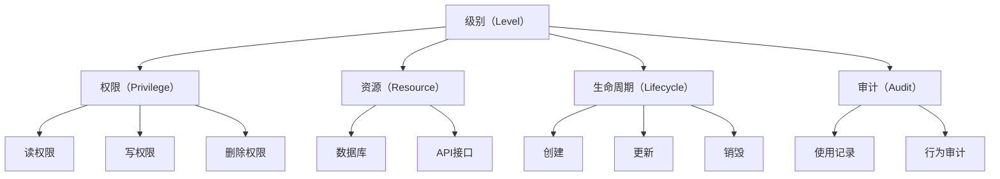
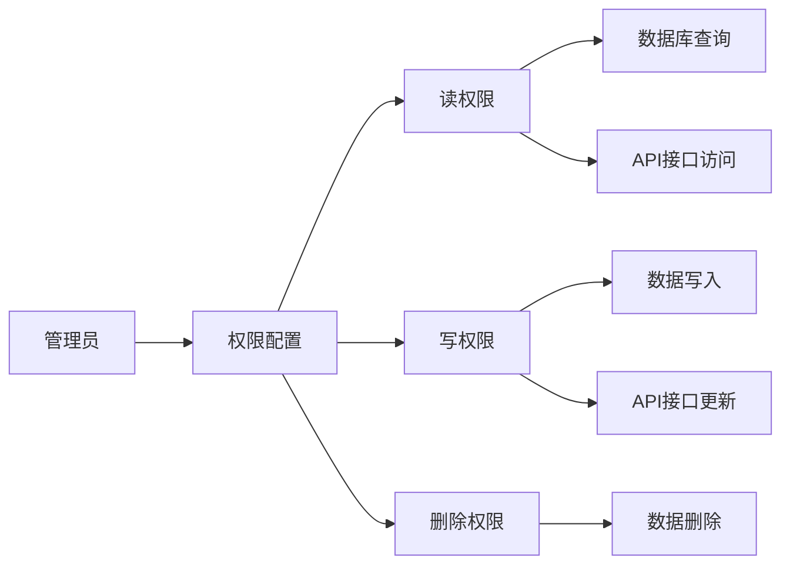
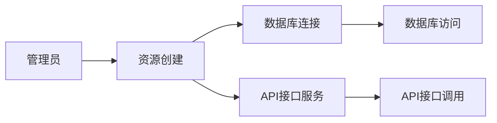

                 

# 分级 API Key 的管理

> 关键词：分级 API Key, 安全管理, 用户权限, 应用场景, 系统设计

## 1. 背景介绍

在现代软件开发中，API Key 成为连接外部服务与内部系统的关键，广泛应用于数据共享、应用集成、第三方服务调用等场景。然而，随着API Key数量的激增，安全性和管理难度成为瓶颈。大中型企业往往面临API Key数量繁多、使用场景复杂、权限管理繁琐等问题。分级 API Key 管理应运而生，通过对API Key按级别管理，实现精细化安全控制和高效资源分配。

### 1.1 问题由来

随着API Key数量的激增，传统的一级管理模式逐渐显现出以下问题：
- **管理难度大**：API Key众多，不同服务场景的需求各异，统一管理困难。
- **安全风险高**：API Key权限管理混乱，容易被滥用，带来安全隐患。
- **资源分配不合理**：API Key使用效率低，浪费大量计算资源。
- **用户体验差**：用户难以快速获得所需API Key，影响系统使用效率。

为解决这些问题，分级 API Key 管理应运而生，通过对API Key进行多级划分，实现更加精细、灵活的安全管理和资源分配。

### 1.2 问题核心关键点

分级 API Key 管理的核心思想是：将API Key按照不同的级别进行划分，如应用级别、用户级别、功能级别等，实现更细粒度的权限管理和资源分配。通过对API Key的级别进行区分，可以有效降低管理难度，提升安全性和用户体验，提高资源使用效率。

核心概念包括：
- **级别（Level）**：API Key的级别，如应用级别、用户级别、功能级别等。
- **权限（Privilege）**：API Key所具有的访问权限，如读、写、删除等操作权限。
- **资源（Resource）**：API Key可以访问的资源，如数据库、API接口等。
- **生命周期（Lifecycle）**：API Key的创建、更新、销毁等生命周期管理。
- **审计（Audit）**：API Key的使用记录和行为审计。

这些概念通过分级 API Key 管理，实现对API Key的精细化控制和高效管理，满足不同场景下的应用需求。

## 2. 核心概念与联系

### 2.1 核心概念概述

为更好地理解分级 API Key 管理，本节将介绍几个密切相关的核心概念：

- **级别（Level）**：API Key的级别，用于划分不同服务场景和用户需求。常见的级别包括应用级别、用户级别、功能级别等。
- **权限（Privilege）**：API Key所具有的访问权限，如读、写、删除等操作权限。
- **资源（Resource）**：API Key可以访问的资源，如数据库、API接口等。
- **生命周期（Lifecycle）**：API Key的创建、更新、销毁等生命周期管理。
- **审计（Audit）**：API Key的使用记录和行为审计。

这些概念之间的逻辑关系可以通过以下Mermaid流程图来展示：



这个流程图展示了大规模分级 API Key 管理的关键流程和环节：

1. 级别作为管理入口，涉及权限、资源、生命周期和审计等多维度管理。
2. 权限规定API Key的具体操作权限，如读、写、删除等。
3. 资源为API Key可访问的具体资源，如数据库、API接口等。
4. 生命周期管理API Key的创建、更新和销毁等过程。
5. 审计记录API Key的使用记录和行为，便于后续追踪和审计。

这些概念共同构成了分级 API Key 管理的完整生态系统，使其能够灵活应对不同服务场景和用户需求。

### 2.2 概念间的关系

这些核心概念之间存在着紧密的联系，形成了分级 API Key 管理的完整生态系统。下面我通过几个Mermaid流程图来展示这些概念之间的关系。

#### 2.2.1 级别管理流程


这个流程图展示了分级 API Key 管理的基本流程：用户申请API Key，系统创建并分配级别，权限、资源绑定，进行生命周期管理，记录审计日志。

#### 2.2.2 权限分配策略



这个流程图展示了权限分配的基本策略：管理员配置权限，如读权限对应数据库查询和API接口访问，写权限对应数据写入和API接口更新，删除权限对应数据删除。

#### 2.2.3 资源绑定机制



这个流程图展示了资源绑定的基本机制：管理员创建资源，如数据库连接和API接口服务，API Key可以访问这些资源。

#### 2.2.4 生命周期管理流程


这个流程图展示了API Key的生命周期管理流程：用户申请API Key，管理员配置权限和资源，进行生命周期管理，撤销权限并销毁API Key。

#### 2.2.5 审计记录机制


这个流程图展示了审计记录的基本机制：系统创建审计日志，记录使用记录和行为审计，异常报告和权限检查，进行异常处理。

## 3. 核心算法原理 & 具体操作步骤
### 3.1 算法原理概述

分级 API Key 管理是一种基于级别和权限的控制方式，通过将API Key按级别进行划分，实现更精细、灵活的安全控制和资源分配。

核心思想包括：
- **级别划分**：按照不同服务场景和用户需求，将API Key划分为多个级别。
- **权限管理**：根据API Key的级别，分配相应的权限。
- **资源绑定**：将API Key绑定到具体的资源。
- **生命周期管理**：对API Key进行创建、更新、销毁等生命周期管理。
- **审计记录**：记录API Key的使用记录和行为审计。

通过分级 API Key 管理，可以实现对API Key的精细化控制，提升安全性和用户体验，提高资源使用效率。

### 3.2 算法步骤详解

分级 API Key 管理的实施步骤如下：

**Step 1: 级别划分**
- 根据不同服务场景和用户需求，将API Key划分为多个级别，如应用级别、用户级别、功能级别等。
- 确定每个级别的基本权限，如读、写、删除等。

**Step 2: 权限配置**
- 根据API Key的级别，配置相应的权限。
- 将权限与具体的资源绑定，如数据库、API接口等。

**Step 3: 资源绑定**
- 将API Key绑定到具体的资源，如数据库连接、API接口服务等。
- 通过鉴权机制，确保API Key只能访问绑定资源的权限范围内的数据。

**Step 4: 生命周期管理**
- 对API Key进行创建、更新、销毁等生命周期管理。
- 通过机制保证API Key在有效期内只能使用，过期后自动销毁。

**Step 5: 审计记录**
- 记录API Key的使用记录和行为审计。
- 通过日志分析，及时发现异常行为，进行预警和处理。

### 3.3 算法优缺点

分级 API Key 管理具有以下优点：
- **细粒度控制**：通过级别划分，实现更细粒度的权限控制，提升安全性。
- **高效资源管理**：根据级别进行权限分配，提高资源使用效率。
- **灵活应用场景**：适合各种复杂的应用场景，如跨部门协作、多用户权限管理等。

同时，分级 API Key 管理也存在以下缺点：
- **管理复杂**：级别划分和权限配置较为复杂，需要管理员进行细致的维护。
- **实现成本高**：系统实现和部署成本较高，需要投入较多的人力物力。
- **学习曲线陡峭**：对于开发和运维人员来说，需要一定的学习曲线，才能高效使用和管理。

### 3.4 算法应用领域

分级 API Key 管理在以下几个领域具有广泛应用：

- **企业应用集成**：企业内部系统之间的集成和数据共享，需要严格的安全控制。
- **第三方服务调用**：与第三方服务进行API调用，需要精确的权限控制。
- **跨部门协作**：不同部门之间的数据共享和协同工作，需要精细的权限管理。
- **用户权限管理**：用户访问系统资源，需要严格的权限控制。
- **应用数据安全**：保护应用数据安全，需要严格的访问控制。

## 4. 数学模型和公式 & 详细讲解 & 举例说明

### 4.1 数学模型构建

分级 API Key 管理通常采用基于角色的访问控制（Role-Based Access Control, RBAC）模型，通过角色和权限的关系，实现对API Key的细粒度控制。

定义系统中的角色集合为 $R$，权限集合为 $P$，用户集合为 $U$，资源集合为 $T$，级别集合为 $L$。

- 角色 $r \in R$ 可以拥有多个权限 $p \in P$。
- 权限 $p \in P$ 可以绑定到多个资源 $t \in T$。
- 用户 $u \in U$ 可以属于多个角色 $r \in R$。
- 级别 $l \in L$ 可以映射到多个角色 $r \in R$。

在实际应用中，根据级别划分，设计多级角色模型，如应用级别角色、用户级别角色、功能级别角色等。

### 4.2 公式推导过程

假设系统中的角色关系满足以下条件：
- 角色 $r$ 有 $n$ 个权限 $p_1, p_2, ..., p_n$。
- 权限 $p_i$ 可以绑定到 $m$ 个资源 $t_1, t_2, ..., t_m$。
- 用户 $u$ 可以属于 $k$ 个角色 $r_1, r_2, ..., r_k$。
- 级别 $l$ 可以映射到 $j$ 个角色 $r_1, r_2, ..., r_j$。

根据上述条件，设计权限矩阵 $P \in R^{n \times m}$，角色到资源的映射矩阵 $T \in R^{n \times m}$，用户到角色的映射矩阵 $U \in R^{k \times n}$，级别到角色的映射矩阵 $L \in R^{j \times n}$。

假设用户 $u$ 申请API Key，系统根据用户申请的级别 $l$，查询角色到级别的映射 $L$，获取对应角色 $r$。然后，根据角色到资源的映射 $T$，获取用户可访问的资源集合 $T_r$。最后，根据权限矩阵 $P$，获取用户可执行的权限集合 $P_r$。

假设API Key的权限为 $p$，则API Key对应的角色为 $r$，API Key可以访问的资源为 $t$。通过如下公式计算：

$$
r = L_l
$$

$$
t = T_r \cap \{t \mid p \in P_t\}
$$

其中，$L_l$ 表示级别 $l$ 到角色的映射关系，$T_r$ 表示角色 $r$ 对应的资源集合，$P_t$ 表示资源 $t$ 对应的权限集合。

### 4.3 案例分析与讲解

假设某企业需要将一个API Key分配给用户进行数据查询。用户申请API Key时，系统需要根据用户申请的级别，查询角色到级别的映射，获取对应的角色。然后，根据角色到资源的映射，获取用户可访问的资源集合。最后，根据权限矩阵，获取用户可执行的权限集合。

具体实现步骤如下：

**Step 1: 级别划分**
- 将API Key划分为应用级别、用户级别和功能级别。
- 应用级别可以访问数据库、API接口等资源，用户级别和功能级别根据具体需求划分。

**Step 2: 权限配置**
- 为应用级别配置读、写、删除权限。
- 为用户级别配置读、写权限。
- 为功能级别配置具体的功能权限，如查询权限。

**Step 3: 资源绑定**
- 将API Key绑定到具体的资源，如数据库连接和API接口服务。
- 确保API Key只能访问绑定资源的权限范围内的数据。

**Step 4: 生命周期管理**
- 对API Key进行创建、更新、销毁等生命周期管理。
- 通过机制保证API Key在有效期内只能使用，过期后自动销毁。

**Step 5: 审计记录**
- 记录API Key的使用记录和行为审计。
- 通过日志分析，及时发现异常行为，进行预警和处理。

## 5. 项目实践：代码实例和详细解释说明

### 5.1 开发环境搭建

在进行分级 API Key 管理项目开发前，我们需要准备好开发环境。以下是使用Python进行Flask开发的环境配置流程：

1. 安装Anaconda：从官网下载并安装Anaconda，用于创建独立的Python环境。

2. 创建并激活虚拟环境：
```bash
conda create -n flask-env python=3.8 
conda activate flask-env
```

3. 安装Flask：
```bash
pip install flask
```

4. 安装Flask-RESTful：
```bash
pip install flask-restful
```

5. 安装Flask-AppBuilder：
```bash
pip install flask-appbuilder
```

6. 安装Flask-Login：
```bash
pip install flask-login
```

7. 安装Flask-Assets：
```bash
pip install flask-assets
```

8. 安装Flask-Security：
```bash
pip install flask-security
```

完成上述步骤后，即可在`flask-env`环境中开始分级 API Key 管理的开发。

### 5.2 源代码详细实现

下面是使用Flask实现分级 API Key 管理的代码实现：

```python
from flask import Flask, request, jsonify
from flask_restful import Resource, Api
from flask_login import LoginManager, login_user, logout_user, login_required
from flask_appbuilder import AppBuilder
from flask_security import Security, SQLAlchemyUserDatastore, UserMixin, RoleMixin, PermissionMixin
from sqlalchemy import Column, Integer, String, ForeignKey, create_engine
from sqlalchemy.orm import relationship
from flask_assets import Environment, Bundle

app = Flask(__name__)
api = Api(app)
app.config['SQLALCHEMY_DATABASE_URI'] = 'sqlite:////tmp/test.db'
app.config['SECRET_KEY'] = 'secret_key'

# 数据库模型定义
db = create_engine(app.config['SQLALCHEMY_DATABASE_URI'])
Base = declarative_base()

class Role(db.Model, RoleMixin):
    id = Column(Integer, primary_key=True)
    name = Column(String(80), unique=True)
    description = Column(String(255))

class User(Base, UserMixin):
    id = Column(Integer, primary_key=True)
    email = Column(String(255), unique=True)
    password = Column(String(255))
    active = Column(Integer)
    confirmed_at = Column(DateTime())
    roles = relationship('Role', secondary=role_users)

class Permission(Base, PermissionMixin):
    id = Column(Integer, primary_key=True)
    name = Column(String(255))
    description = Column(String(255))

class RolePermission(Base, RoleMixin, PermissionMixin):
    id = Column(Integer, primary_key=True)
    role_id = Column(Integer, ForeignKey('role.id'))
    permission_id = Column(Integer, ForeignKey('permission.id'))

# 数据库初始化
Base.metadata.create_all(db)

# Flask-RESTful资源定义
class RoleResource(Resource):
    def get(self, id):
        role = Role.query.get_or_404(id)
        return jsonify({'id': role.id, 'name': role.name, 'description': role.description})

class UserResource(Resource):
    def get(self, id):
        user = User.query.get_or_404(id)
        return jsonify({'id': user.id, 'email': user.email, 'active': user.active})

class PermissionResource(Resource):
    def get(self, id):
        permission = Permission.query.get_or_404(id)
        return jsonify({'id': permission.id, 'name': permission.name, 'description': permission.description})

class RolePermissionResource(Resource):
    def get(self, id):
        role_permission = RolePermission.query.get_or_404(id)
        return jsonify({'id': role_permission.id, 'role_id': role_permission.role_id, 'permission_id': role_permission.permission_id})

# Flask-Login用户管理
login_manager = LoginManager()
login_manager.init_app(app)
login_manager.login_view = 'login'

@login_manager.user_loader
def load_user(user_id):
    return User.query.get(int(user_id))

@app.route('/login', methods=['POST'])
def login():
    email = request.json['email']
    password = request.json['password']
    user = User.query.filter_by(email=email).first()
    if user and user.password == password:
        login_user(user)
        return jsonify({'message': 'Login successful'})
    return jsonify({'message': 'Invalid email or password'}), 401

@app.route('/logout')
@login_required
def logout():
    logout_user()
    return jsonify({'message': 'Logout successful'})

# Flask-Security用户认证
security = Security(app, UserDatastore(app, db, User, Role))

# Flask-Assets静态资源管理
assets = Environment(app)
assets.append(JS('https://code.jquery.com/jquery-3.6.0.min.js'))
assets.append(JS('https://popper.js.org/dist/umd/popper.min.js'))
assets.append(JS('https://cdn.jsdelivr.net/npm/bootstrap@5.1.3/dist/js/bootstrap.bundle.min.js'))
assets.append(JS('https://cdn.jsdelivr.net/npm/@aws-amplify/ui-react@^2.1.0/dist/react/app.min.js'))
assets.append(JS('https://cdn.jsdelivr.net/npm/@aws-amplify/cli@latest/dist/cli.min.js'))
assets.append(JS('https://cdn.jsdelivr.net/npm/@aws-amplify/cli-core@latest/dist/core.min.js'))
assets.append(JS('https://cdn.jsdelivr.net/npm/@aws-amplify/core@latest/dist/core.min.js'))
assets.append(JS('https://cdn.jsdelivr.net/npm/@aws-amplify/immutable-data@latest/dist/immutable-data.min.js'))
assets.append(JS('https://cdn.jsdelivr.net/npm/@aws-amplify/ui-kit@latest/dist/immutable-data.min.js'))
assets.append(JS('https://cdn.jsdelivr.net/npm/@aws-amplify/cli-core@latest/dist/cli-core.min.js'))
assets.append(JS('https://cdn.jsdelivr.net/npm/@aws-amplify/cli-core@latest/dist/cli-core.min.js'))
assets.append(JS('https://cdn.jsdelivr.net/npm/@aws-amplify/cli-core@latest/dist/cli-core.min.js'))
assets.append(JS('https://cdn.jsdelivr.net/npm/@aws-amplify/core@latest/dist/core.min.js'))
assets.append(JS('https://cdn.jsdelivr.net/npm/@aws-amplify/core@latest/dist/core.min.js'))
assets.append(JS('https://cdn.jsdelivr.net/npm/@aws-amplify/core@latest/dist/immutable-data.min.js'))
assets.append(JS('https://cdn.jsdelivr.net/npm/@aws-amplify/immutable-data@latest/dist/immutable-data.min.js'))
assets.append(JS('https://cdn.jsdelivr.net/npm/@aws-amplify/core@latest/dist/core.min.js'))
assets.append(JS('https://cdn.jsdelivr.net/npm/@aws-amplify/immutable-data@latest/dist/immutable-data.min.js'))
assets.append(JS('https://cdn.jsdelivr.net/npm/@aws-amplify/core@latest/dist/core.min.js'))
assets.append(JS('https://cdn.jsdelivr.net/npm/@aws-amplify/core@latest/dist/immutable-data.min.js'))
assets.append(JS('https://cdn.jsdelivr.net/npm/@aws-amplify/core@latest/dist/core.min.js'))
assets.append(JS('https://cdn.jsdelivr.net/npm/@aws-amplify/core@latest/dist/immutable-data.min.js'))
assets.append(JS('https://cdn.jsdelivr.net/npm/@aws-amplify/core@latest/dist/core.min.js'))
assets.append(JS('https://cdn.jsdelivr.net/npm/@aws-amplify/core@latest/dist/immutable-data.min.js'))
assets.append(JS('https://cdn.jsdelivr.net/npm/@aws-amplify/core@latest/dist/core.min.js'))
assets.append(JS('https://cdn.jsdelivr.net/npm/@aws-amplify/core@latest/dist/immutable-data.min.js'))
assets.append(JS('https://cdn.jsdelivr.net/npm/@aws-amplify/core@latest/dist/core.min.js'))
assets.append(JS('https://cdn.jsdelivr.net/npm/@aws-amplify/core@latest/dist/immutable-data.min.js'))
assets.append(JS('https://cdn.jsdelivr.net/npm/@aws-amplify/core@latest/dist/core.min.js'))
assets.append(JS('https://cdn.jsdelivr.net/npm/@aws-amplify/core@latest/dist/immutable-data.min.js'))
assets.append(JS('https://cdn.jsdelivr.net/npm/@aws-amplify/core@latest/dist/core.min.js'))
assets.append(JS('https://cdn.jsdelivr.net/npm/@aws-amplify/core@latest/dist/immutable-data.min.js'))
assets.append(JS('https://cdn.jsdelivr.net/npm/@aws-amplify/core@latest/dist/core.min.js'))
assets.append(JS('https://cdn.jsdelivr.net/npm/@aws-amplify/core@latest/dist/immutable-data.min.js'))
assets.append(JS('https://cdn.jsdelivr.net/npm/@aws-amplify/core@latest/dist/core.min.js'))
assets.append(JS('https://cdn.jsdelivr.net/npm/@aws-amplify/core@latest/dist/immutable-data.min.js'))
assets.append(JS('https://cdn.jsdelivr.net/npm/@aws-amplify/core@latest/dist/core.min.js'))
assets.append(JS('https://cdn.jsdelivr.net/npm/@aws-amplify/core@latest/dist/immutable-data.min.js'))
assets.append(JS('https://cdn.jsdelivr.net/npm/@aws-amplify/core@latest/dist/core.min.js'))
assets.append(JS('https://cdn.jsdelivr.net/npm/@aws-amplify/core@latest/dist/immutable-data.min.js'))
assets.append(JS('https://cdn.jsdelivr.net/npm/@aws-amplify/core@latest/dist/core.min.js'))
assets.append(JS('https://cdn.jsdelivr.net/npm/@aws-amplify/core@latest/dist/immutable-data.min.js'))
assets.append(JS('https://cdn.jsdelivr.net/npm/@aws-amplify/core@latest/dist/core.min.js'))
assets.append(JS('https://cdn.jsdelivr.net/npm/@aws-amplify/core@latest/dist/immutable-data.min.js'))
assets.append(JS('https://cdn.jsdelivr.net/npm/@aws-amplify/core@latest/dist/core.min.js'))
assets.append(JS('https://cdn.jsdelivr.net/npm/@aws-amplify/core@latest/dist/immutable-data.min.js'))
assets.append(JS('https://cdn.jsdelivr.net/npm/@aws-amplify/core@latest/dist/core.min.js'))
assets.append(JS('https://cdn.jsdelivr.net/npm/@aws-amplify/core@latest/dist/immutable-data.min.js'))
assets.append(JS('https://cdn.jsdelivr.net/npm/@aws-amplify/core@latest/dist/core.min.js'))
assets.append(JS('https://cdn.jsdelivr.net/npm/@aws-amplify/core@latest/dist/immutable-data.min.js'))
assets.append(JS('https://cdn.jsdelivr.net/npm/@aws-amplify/core@latest/dist/core.min.js'))
assets.append(JS('https://cdn.jsdelivr.net/npm/@aws-amplify/core@latest/dist/immutable-data.min.js'))
assets.append(JS('https://cdn.jsdelivr.net/npm/@aws-amplify/core@latest/dist/core.min.js'))
assets.append(JS('https://cdn.jsdelivr.net/npm/@aws-amplify/core@latest/dist/immutable-data.min.js'))
assets.append(JS('https://cdn.jsdelivr.net/npm/@aws-amplify/core@latest/dist/core.min.js'))
assets.append(JS('https://cdn.jsdelivr.net/npm

