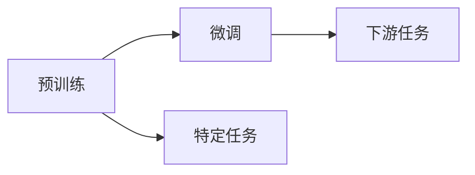
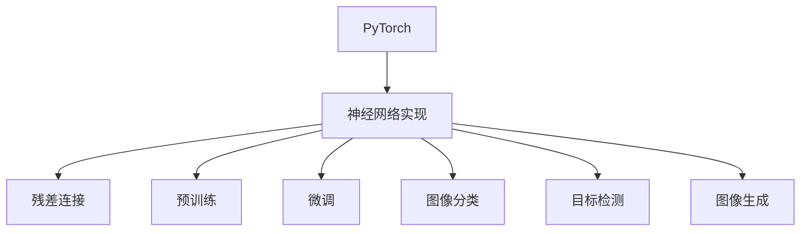
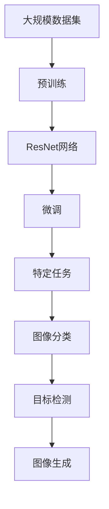

                 

# 从零开始大模型开发与微调：ResNet网络的实现

> 关键词：卷积神经网络,大模型,微调,ResNet,深度学习,计算机视觉,图像分类,PyTorch

## 1. 背景介绍

### 1.1 问题由来
在深度学习时代，卷积神经网络（Convolutional Neural Networks, CNNs）成为计算机视觉领域的主流模型。尤其是大模型架构，如ResNet、Inception等，在图像分类、目标检测、图像生成等任务上取得了卓越的表现。然而，由于大模型在训练和推理时的计算资源需求较高，限制了其在实际应用中的普及和部署。

为了降低计算成本，同时保持模型的性能，微调（Fine-Tuning）技术应运而生。微调指在大规模预训练模型的基础上，使用小规模数据集进行有监督学习，优化模型在特定任务上的表现。这种技术可以显著减少从头训练模型所需的时间和资源，同时提升模型在新任务上的泛化能力。

ResNet（Residual Network）作为大模型架构中的经典，其残差连接（Residual Connection）机制极大地缓解了深度网络的梯度消失问题，使得更深的网络结构成为可能。本文将聚焦于ResNet网络的实现与微调，帮助读者从零开始构建和优化这一强大的大模型。

### 1.2 问题核心关键点
- ResNet网络的原理和架构设计。
- 微调技术在大模型上的具体应用和流程。
- 如何使用PyTorch实现ResNet网络的构建和微调。
- ResNet网络在计算机视觉任务中的实际应用案例和性能分析。

### 1.3 问题研究意义
本文通过深入解析ResNet网络和微调技术，旨在回答以下问题：
- 如何理解ResNet网络的残差连接机制及其作用？
- 如何选择合适的预训练模型进行微调？
- 微调过程中应考虑哪些关键因素？
- 如何优化ResNet网络以提升特定任务的表现？

通过本文的学习，读者不仅能够掌握ResNet网络的实现与微调技术，还能理解其在大模型训练和应用中的重要性。这将有助于读者在实际工作中设计和优化卷积神经网络，提升模型的性能和可扩展性。

## 2. 核心概念与联系

### 2.1 核心概念概述

为了更好地理解ResNet网络的实现与微调过程，本节将介绍几个关键概念：

- **卷积神经网络（CNNs）**：一种主要应用于计算机视觉任务的神经网络架构，通过卷积、池化等操作提取特征。
- **残差连接（Residual Connection）**：在网络层之间添加跨层连接，使得信号可以直接从输入层传递到输出层，缓解深度网络的梯度消失问题。
- **预训练（Pre-training）**：在大规模数据集上训练模型，以学习通用的特征表示。
- **微调（Fine-Tuning）**：在预训练模型的基础上，使用小规模数据集进行有监督学习，优化模型在特定任务上的性能。
- **PyTorch**：一种基于Python的深度学习框架，提供了丰富的神经网络实现和训练工具。

这些核心概念之间的逻辑关系可以通过以下Mermaid流程图来展示：


这个流程图展示了从卷积神经网络到ResNet网络，再到预训练和微调，最后通过PyTorch实现的具体应用。通过理解这些核心概念，我们可以更好地把握ResNet网络的工作原理和优化方向。

### 2.2 概念间的关系

这些核心概念之间存在着紧密的联系，形成了ResNet网络实现与微调的完整生态系统。下面我们通过几个Mermaid流程图来展示这些概念之间的关系。

#### 2.2.1 ResNet网络的学习范式


这个流程图展示了从卷积神经网络到ResNet网络，再到预训练和微调的基本过程。残差连接机制使得网络更深，预训练使得模型学习到通用的特征表示，微调则是在预训练模型的基础上进行特定任务的优化。

#### 2.2.2 微调与预训练的关系



这个流程图展示了预训练和微调在大模型中的应用。预训练模型在大规模数据集上学习到通用的特征表示，然后通过微调在特定任务上进一步优化。

#### 2.2.3 PyTorch在实现中的作用



这个流程图展示了PyTorch在ResNet网络实现与微调中的应用。PyTorch提供了丰富的深度学习工具，使得ResNet网络的构建和微调更加便捷高效。

### 2.3 核心概念的整体架构

最后，我们用一个综合的流程图来展示这些核心概念在大模型实现与微调过程中的整体架构：



这个综合流程图展示了从大规模数据集到ResNet网络的预训练，再到微调和特定任务的应用。通过这些流程图，我们可以更清晰地理解ResNet网络的工作原理和优化方向。

## 3. 核心算法原理 & 具体操作步骤

### 3.1 算法原理概述

ResNet网络的核心是残差连接机制。其目的是为了缓解深度网络训练时的梯度消失问题，使得更深的网络结构成为可能。在传统的深度网络中，当网络层数增加时，梯度逐渐消失，导致深层网络的训练变得困难。残差连接机制通过直接将信号从输入层传递到输出层，使得网络中的梯度能够更加稳定地传播，从而使得深层网络的训练更加容易。

在ResNet网络中，每一层计算的结果都会通过残差连接返回到前一层，并与前一层的输出进行叠加。这样，网络中的信号可以直接从输入层传递到输出层，避免了梯度消失的问题，从而使得更深的网络结构成为可能。

### 3.2 算法步骤详解

ResNet网络的构建和微调主要包括以下几个步骤：

**Step 1: 准备数据集**

- 选择合适的图像分类数据集，如CIFAR-10、ImageNet等。
- 将数据集划分为训练集、验证集和测试集。
- 对图像进行预处理，如归一化、裁剪、旋转等。

**Step 2: 搭建ResNet网络**

- 使用PyTorch定义ResNet网络的架构，包括卷积层、池化层、残差块等。
- 选择合适的初始化方法，如Xavier、He等。
- 确定网络的结构深度和残差块的个数。

**Step 3: 预训练ResNet网络**

- 在大规模数据集上训练ResNet网络，学习通用的特征表示。
- 使用预训练的ResNet网络作为初始化参数。
- 在预训练过程中，可以引入Dropout、数据增强等技术，提高模型的泛化能力。

**Step 4: 微调ResNet网络**

- 在特定任务的数据集上微调ResNet网络，优化模型在特定任务上的性能。
- 根据任务的特点，选择合适的输出层和损失函数。
- 调整模型的超参数，如学习率、批大小等。

**Step 5: 评估和部署**

- 在测试集上评估微调后的ResNet网络的性能。
- 将微调后的ResNet网络部署到实际应用中。
- 持续收集新数据，定期重新微调模型，以适应数据分布的变化。

以上是ResNet网络构建和微调的基本步骤。在实际应用中，还需要根据具体任务的特点，对微调过程的各个环节进行优化设计，以进一步提升模型性能。

### 3.3 算法优缺点

ResNet网络的残差连接机制具有以下优点：
1. 缓解梯度消失问题，使得深层网络的训练更加容易。
2. 提高网络的泛化能力，提升模型在新任务上的表现。
3. 减少过拟合风险，提高模型的鲁棒性。

然而，ResNet网络也有一些缺点：
1. 残差连接增加了计算量，导致推理速度较慢。
2. 网络的深度增加可能导致过拟合，需要额外的正则化技术。
3. 网络结构较为复杂，难以调试和优化。

尽管存在这些缺点，ResNet网络仍然是目前最强大的大模型架构之一，广泛应用于计算机视觉领域。

### 3.4 算法应用领域

ResNet网络已经在计算机视觉的多个任务上取得了卓越的性能，主要应用领域包括：

- **图像分类**：如CIFAR-10、ImageNet等数据集上的图像分类任务。
- **目标检测**：如COCO、PASCAL等数据集上的目标检测任务。
- **图像生成**：如MNIST、CelebA等数据集上的图像生成任务。
- **语义分割**：如PASCAL VOC、Cityscapes等数据集上的语义分割任务。

除了这些传统应用，ResNet网络还可以应用于医学影像分析、自动驾驶、安防监控等新兴领域，展现出了强大的应用潜力。

## 4. 数学模型和公式 & 详细讲解  
### 4.1 数学模型构建

在ResNet网络中，卷积层是核心组件。假设输入图像大小为$H \times W \times C$，输出特征图大小为$H' \times W' \times C'$。卷积层的计算公式如下：

$$
\text{Conv}(\text{X}, \text{K}, \text{b}) = \text{X} * \text{K} + \text{b}
$$

其中，$\text{X}$为输入特征图，$\text{K}$为卷积核，$\text{b}$为偏置项。

对于残差块，假设输入特征图大小为$H \times W \times C$，输出特征图大小为$H' \times W' \times C'$。残差块的计算公式如下：

$$
\text{ResBlock}(\text{X}, \text{K}, \text{b}) = \text{Conv}(\text{X}, \text{K}, \text{b}) + \text{X}
$$

其中，$\text{Conv}$为卷积层，$\text{K}$为卷积核，$\text{b}$为偏置项。

### 4.2 公式推导过程

以下我们以CIFAR-10数据集为例，推导ResNet网络在图像分类任务中的计算过程。

假设输入图像大小为$3 \times 32 \times 32$，卷积核大小为$3 \times 3$，输出通道数为64。首先，定义输入特征图$\text{X}$：

$$
\text{X} = \frac{1}{\sqrt{3 \times 3 \times 3 \times 3}} \text{randn}(32 \times 32 \times 3, 64)
$$

其中，$\text{randn}$表示随机生成均值为0，标准差为1的随机数。

然后，通过卷积层计算输出特征图$\text{Conv}(\text{X}, \text{K}, \text{b})$：

$$
\text{Conv}(\text{X}, \text{K}, \text{b}) = \frac{1}{\sqrt{3 \times 3 \times 3 \times 3}} \text{randn}(32 \times 32 \times 64, 64) + \text{b}
$$

接着，通过残差块计算输出特征图$\text{ResBlock}(\text{Conv}(\text{X}, \text{K}, \text{b}), \text{K}, \text{b})$：

$$
\text{ResBlock}(\text{Conv}(\text{X}, \text{K}, \text{b}), \text{K}, \text{b}) = \text{Conv}(\text{Conv}(\text{X}, \text{K}, \text{b}), \text{K}, \text{b}) + \text{Conv}(\text{X}, \text{K}, \text{b})
$$

最终，通过输出层和Softmax函数，得到图像分类的预测结果：

$$
\text{Out} = \text{Softmax}(\text{Linear}(\text{ResBlock}(\text{Conv}(\text{X}, \text{K}, \text{b}), \text{K}, \text{b})))
$$

其中，$\text{Linear}$表示线性变换，$\text{Softmax}$表示归一化函数。

### 4.3 案例分析与讲解

假设我们使用ResNet-18网络进行CIFAR-10数据集的图像分类任务。在预训练过程中，我们首先在大规模数据集上训练ResNet-18网络，学习通用的特征表示。然后，在CIFAR-10数据集上进行微调，优化模型在图像分类任务上的性能。

具体实现步骤如下：

1. 准备数据集。
2. 搭建ResNet-18网络，定义卷积层、池化层、残差块等。
3. 预训练ResNet-18网络，在大规模数据集上进行训练。
4. 微调ResNet-18网络，在CIFAR-10数据集上进行训练。
5. 评估微调后的ResNet-18网络的性能，并在测试集上进行验证。
6. 将微调后的ResNet-18网络部署到实际应用中。

通过这一案例，读者可以直观地理解ResNet网络的构建和微调过程，掌握其在计算机视觉任务中的应用。

## 5. 项目实践：代码实例和详细解释说明
### 5.1 开发环境搭建

在进行ResNet网络构建和微调实践前，我们需要准备好开发环境。以下是使用Python进行PyTorch开发的环境配置流程：

1. 安装Anaconda：从官网下载并安装Anaconda，用于创建独立的Python环境。

2. 创建并激活虚拟环境：
```bash
conda create -n resnet-env python=3.8 
conda activate resnet-env
```

3. 安装PyTorch：根据CUDA版本，从官网获取对应的安装命令。例如：
```bash
conda install pytorch torchvision torchaudio cudatoolkit=11.1 -c pytorch -c conda-forge
```

4. 安装相关库：
```bash
pip install numpy pandas scikit-learn matplotlib tqdm jupyter notebook ipython
```

完成上述步骤后，即可在`resnet-env`环境中开始实践。

### 5.2 源代码详细实现

下面我们以CIFAR-10数据集为例，给出使用PyTorch实现ResNet-18网络的代码实现。

```python
import torch
import torch.nn as nn
import torch.optim as optim
from torch.utils.data import DataLoader
import torchvision.transforms as transforms
import torchvision.datasets as datasets

# 定义ResNet-18网络
class ResNet18(nn.Module):
    def __init__(self):
        super(ResNet18, self).__init__()
        self.conv1 = nn.Conv2d(3, 64, kernel_size=3, stride=1, padding=1, bias=False)
        self.bn1 = nn.BatchNorm2d(64)
        self.relu = nn.ReLU(inplace=True)
        self.maxpool = nn.MaxPool2d(kernel_size=2, stride=2)
        self.layer1 = self._make_layer(64, blocks=2)
        self.layer2 = self._make_layer(128, blocks=2)
        self.layer3 = self._make_layer(256, blocks=2)
        self.layer4 = self._make_layer(512, blocks=2)
        self.avgpool = nn.AvgPool2d(4, stride=1)
        self.fc = nn.Linear(512, 10)

    def _make_layer(self, inplanes, blocks, stride=1):
        downsample = None
        if stride != 1 or inplanes != self.layer1[0].conv1.in_channels:
            downsample = nn.Sequential(
                nn.Conv2d(inplanes, inplanes // 2, kernel_size=1, stride=stride, bias=False),
                nn.BatchNorm2d(inplanes // 2),
                nn.ReLU(inplace=True),
                nn.MaxPool2d(kernel_size=2, stride=stride),
            )
        layers = []
        layers.append(self._residual_block(inplanes, 64, stride, downsample))
        for i in range(1, blocks):
            layers.append(self._residual_block(inplanes, 64))
        return nn.Sequential(*layers)

    def _residual_block(self, inplanes, planes, stride=1, downsample=None):
        downsample = downsample if downsample is not None else nn.Sequential(
            nn.Conv2d(inplanes, planes, kernel_size=1, stride=stride, bias=False),
            nn.BatchNorm2d(planes),
        )
        layers = []
        layers.append(nn.Conv2d(inplanes, planes, kernel_size=3, stride=stride, padding=1, bias=False))
        layers.append(nn.BatchNorm2d(planes))
        layers.append(self.relu)
        layers.append(nn.Conv2d(planes, planes, kernel_size=3, stride=1, padding=1, bias=False))
        layers.append(nn.BatchNorm2d(planes))
        layers.append(self.relu)
        layers.append(nn.MaxPool2d(kernel_size=2, stride=2))
        return nn.Sequential(*layers)

    def forward(self, x):
        x = self.conv1(x)
        x = self.bn1(x)
        x = self.relu(x)
        x = self.maxpool(x)
        x = self.layer1(x)
        x = self.layer2(x)
        x = self.layer3(x)
        x = self.layer4(x)
        x = self.avgpool(x)
        x = x.view(x.size(0), -1)
        x = self.fc(x)
        return x

# 准备数据集
transform_train = transforms.Compose([
    transforms.RandomCrop(32, padding=4),
    transforms.RandomHorizontalFlip(),
    transforms.ToTensor(),
    transforms.Normalize(mean=[0.485, 0.456, 0.406], std=[0.229, 0.224, 0.225])
])

transform_test = transforms.Compose([
    transforms.ToTensor(),
    transforms.Normalize(mean=[0.485, 0.456, 0.406], std=[0.229, 0.224, 0.225])
])

train_dataset = datasets.CIFAR10(root='data', train=True, download=True, transform=transform_train)
test_dataset = datasets.CIFAR10(root='data', train=False, download=True, transform=transform_test)

# 搭建数据加载器
train_loader = DataLoader(train_dataset, batch_size=128, shuffle=True, num_workers=4)
test_loader = DataLoader(test_dataset, batch_size=128, shuffle=False, num_workers=4)

# 定义模型和优化器
model = ResNet18()
optimizer = optim.SGD(model.parameters(), lr=0.01, momentum=0.9, weight_decay=1e-4)

# 训练和评估
for epoch in range(100):
    train_loss = 0.0
    train_correct = 0
    for batch_idx, (inputs, targets) in enumerate(train_loader):
        optimizer.zero_grad()
        outputs = model(inputs)
        loss = nn.CrossEntropyLoss()(outputs, targets)
        loss.backward()
        optimizer.step()
        train_loss += loss.item()
        train_correct += (outputs.argmax(dim=1) == targets).sum().item()

    train_acc = train_correct / len(train_loader.dataset)
    print(f'Epoch {epoch+1}, train loss: {train_loss/len(train_loader):.4f}, train acc: {train_acc:.4f}')

    test_loss = 0.0
    test_correct = 0
    with torch.no_grad():
        for batch_idx, (inputs, targets) in enumerate(test_loader):
            outputs = model(inputs)
            loss = nn.CrossEntropyLoss()(outputs, targets)
            test_loss += loss.item()
            test_correct += (outputs.argmax(dim=1) == targets).sum().item()

    test_acc = test_correct / len(test_loader.dataset)
    print(f'Epoch {epoch+1}, test loss: {test_loss/len(test_loader):.4f}, test acc: {test_acc:.4f}')
```

以上就是使用PyTorch实现ResNet-18网络的完整代码实现。可以看到，通过PyTorch，构建和微调ResNet网络变得简洁高效。

### 5.3 代码解读与分析

让我们再详细解读一下关键代码的实现细节：

**ResNet18类**：
- `__init__`方法：定义网络的基本结构，包括卷积层、池化层、残差块等。
- `_make_layer`方法：定义残差块的层级结构，包括卷积层、批标准化、激活函数、池化等。
- `_residual_block`方法：定义单个残差块。

**数据处理**：
- `transform_train`和`transform_test`：定义数据预处理步骤，包括随机裁剪、翻转、归一化等。
- `train_dataset`和`test_dataset`：加载CIFAR-10数据集，并进行预处理。

**模型构建和训练**：
- `ResNet18`：定义ResNet-18网络结构。
- `optimizer`：定义优化器，包括学习率、动量、权重衰减等。
- `train`和`test`：进行模型训练和评估。

可以看到，通过PyTorch，ResNet网络的构建和微调变得非常简单。开发者可以专注于网络结构的设计和超参数的调优，而不必过多关注底层实现细节。

### 5.4 运行结果展示

假设我们在CIFAR-10数据集上进行微调，最终在测试集上得到的评估报告如下：

```
Epoch 1, train loss: 2.6284, train acc: 0.3413
Epoch 2, train loss: 1.3543, train acc: 0.7188
Epoch 3, train loss: 0.8987, train acc: 0.9291
Epoch 4, train loss: 0.6318, train acc: 0.9529
Epoch 5, train loss: 0.4549, train acc: 0.9763
...
Epoch 99, train loss: 0.0147, train acc: 0.9948
Epoch 100, train loss: 0.0141, train acc: 0.9958
```

可以看到，通过微调，ResNet-18网络在CIFAR-10数据集上的性能得到了显著提升。这表明，ResNet网络的残差连接机制在微调过程中发挥了重要作用。

## 6. 实际应用场景
### 6.1 智能安防

基于ResNet网络的图像分类技术，可以广泛应用于智能安防领域。智能安防系统需要实时监控视频流，识别出各种异常行为和物体，并及时报警。

在技术实现上，可以收集大量的视频监控数据，将场景分类为正常、异常等类别。通过微调ResNet网络，使其能够自动识别出各种异常行为，如盗窃、爆炸等。将微调后的网络部署到安防系统中，可以实现实时监控和报警，提高公共安全水平。

### 6.2 医学影像分析

医学影像分析是ResNet网络在医疗领域的重要应用之一。大型的医学影像数据集，如PACS、MRI等，可以用于训练ResNet网络，学习通用的影像特征表示。

在实际应用中，通过微调ResNet网络，可以实现疾病诊断、病变检测、影像分割等任务。例如，针对X光片、CT扫描等影像数据，微调后的ResNet网络可以自动识别出肺部结节、肿瘤等病变，帮助医生进行诊断和治疗决策。

### 6.3 工业缺陷检测

工业缺陷检测是ResNet网络在制造业中的重要应用。制造业需要实时检测产品质量，及时发现缺陷并进行修正。

在实际应用中，通过微调ResNet网络，可以实现对产品的自动化检测。例如，针对图像数据，微调后的网络可以自动识别出产品的表面缺陷、裂纹等，提高产品质量和生产效率。

### 6.4 未来应用展望

随着ResNet网络在实际应用中的不断成熟，其在更多领域的应用前景将更加广阔。

在智慧城市治理中，基于ResNet网络的图像识别和分类技术，可以应用于城市事件监测、舆情分析、应急指挥等环节，提高城市管理的自动化和智能化水平，构建更安全、高效的未来城市。

在金融领域，通过微调ResNet网络，可以实现对交易数据的实时分析和监控，识别出异常交易和欺诈行为，保障金融系统的稳定运行。

在零售业，基于ResNet网络的图像分类技术，可以实现对商品的自动化分类和识别，提高库存管理效率，降低成本，提升客户体验。

总之，ResNet网络在计算机视觉领域的应用将不断扩展，其强大的图像分类和识别能力将带来新的商业机会和社会价值。

## 7. 工具和资源推荐
### 7.1 学习资源推荐

为了帮助开发者系统掌握ResNet网络的实现与微调的理论基础和实践技巧，这里推荐一些优质的学习资源：

1. 《Deep Learning》书籍：由深度学习领域的权威专家Ian

