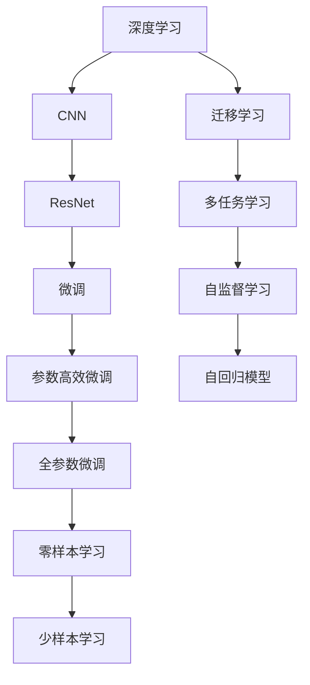
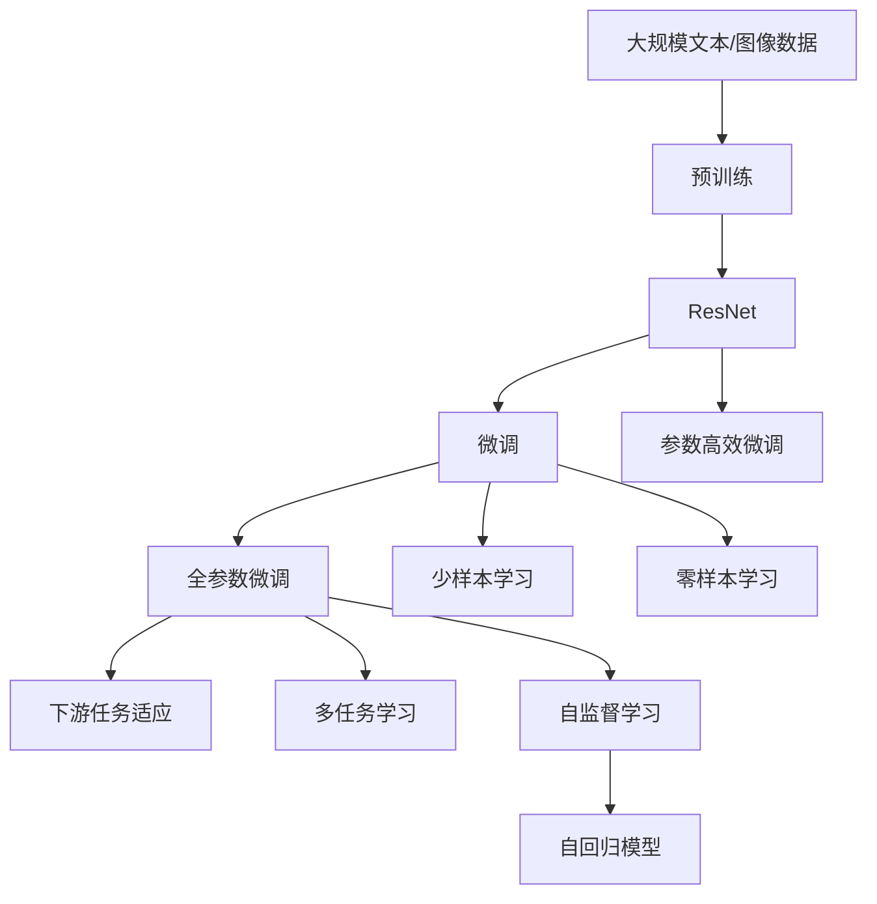

                 

# 从零开始大模型开发与微调：ResNet诞生的背景

> 关键词：ResNet, 深度学习, 卷积神经网络, 残差网络, 微调, 图像识别

## 1. 背景介绍

### 1.1 问题由来
深度学习（Deep Learning）在计算机视觉（Computer Vision, CV）领域取得了显著成就，尤其是在图像识别、分类、检测等任务上。然而，随着深度模型层数的增加，模型训练和推理的计算成本显著提高，同时，深层网络也面临梯度消失和过拟合等问题。如何构建既高效又深层的神经网络模型，成为学术界和工业界的研究热点。

ResNet（Residual Network）作为深度学习领域的里程碑式工作，其核心思想是引入残差连接（Residual Connections），使得深层网络能够学习到更为抽象、复杂的特征表示，同时解决了梯度消失问题，极大地提升了深度网络在图像识别等任务上的性能。

ResNet的出现，不仅推动了深度学习技术的发展，也为后续基于深度学习的大模型微调提供了理论和实践基础。本文将从深度学习的背景、ResNet的提出及其微调技术进行全面阐述，并探讨其在大模型开发中的应用和未来发展趋势。

### 1.2 问题核心关键点
ResNet的关键点在于其创新的残差连接设计，该设计不仅解决了深层网络梯度消失问题，还允许模型在任意深度的层数上获得性能提升。此外，ResNet的微调方法也具有普遍适用性，适用于不同类型的深度学习模型，尤其适用于大规模预训练模型，如VGG、Inception、BERT等。

本文将聚焦于ResNet的残差连接设计和微调方法，分析其在图像识别、自然语言处理等领域的广泛应用，并探讨其在大模型微调中的重要性。

## 2. 核心概念与联系

### 2.1 核心概念概述

为更好地理解ResNet及其微调方法，本节将介绍几个密切相关的核心概念：

- **深度学习**：基于神经网络的机器学习技术，能够自动学习输入数据的特征表示，并用于各类任务，如分类、检测、生成等。
- **卷积神经网络（CNN）**：一种专门用于图像处理和计算机视觉任务的神经网络结构，通过卷积操作提取图像特征。
- **残差连接（Residual Connections）**：一种特殊的神经网络结构设计，允许在网络中引入跳跃连接，使得深层网络能够学习更为复杂的特征表示，并解决梯度消失问题。
- **微调（Fine-Tuning）**：在大模型上进行任务特定优化，以适应新的数据和任务，提高模型在特定任务上的性能。

这些核心概念之间存在着紧密的联系，共同构成了ResNet及其微调方法的完整框架。

### 2.2 概念间的关系

这些核心概念之间的逻辑关系可以通过以下Mermaid流程图来展示：



这个流程图展示了大模型微调过程中各个核心概念的关系和作用：

1. 深度学习提供了一个强大的基础模型框架。
2. 卷积神经网络作为深度学习的一个重要分支，专注于图像处理和计算机视觉任务。
3. ResNet作为卷积神经网络的改进版，通过引入残差连接，解决了深层网络训练中的梯度消失问题。
4. 微调技术在大模型上进行特定任务优化，提升模型在特定任务上的性能。
5. 参数高效微调（PEFT）技术在大模型微调中，以较小的学习率更新少量模型参数，避免过拟合。
6. 零样本学习和少样本学习在微调中，通过在输入中提供少量示例，实现不更新模型参数的情况下的学习。
7. 迁移学习通过微调技术，使通用大模型更好地适应特定任务，提升模型性能。
8. 多任务学习和自监督学习通过在大规模数据上进行预训练，提升模型的泛化能力和知识迁移能力。
9. 自回归模型在序列建模任务中，通过预测序列中每个元素的条件概率，进行有监督学习。

这些概念共同构成了ResNet及其微调方法的完整生态系统，使其能够在各种场景下发挥强大的性能。

### 2.3 核心概念的整体架构

最后，我们用一个综合的流程图来展示这些核心概念在大模型微调过程中的整体架构：



这个综合流程图展示了从预训练到微调，再到特定任务微调的完整过程。ResNet首先在大规模数据上进行预训练，然后通过微调（包括全参数微调和参数高效微调）或零样本/少样本学习，来适应下游任务。最后，通过多任务学习和自监督学习，提升模型的泛化能力和知识迁移能力。

## 3. 核心算法原理 & 具体操作步骤
### 3.1 算法原理概述

ResNet的残差连接设计是解决深层网络训练中梯度消失问题的关键。其核心思想是通过引入跳跃连接（Skip Connections），使得网络能够学习到更为复杂、抽象的特征表示。

具体而言，ResNet中的每一层都包含两部分：
1. 传统的残差块（Residual Block），通过卷积、归一化、激活等操作提取特征。
2. 残差连接，将上一层的特征直接传递到下一层，避免梯度消失问题。

以一个简单的3层残差块为例，其结构如下所示：

```
x --> Conv --> BN --> ReLU --> Conv --> BN --> ReLU --> Conv --> Sum(x, conv) --> ReLU
```

其中，`Sum(x, conv)`表示将输入x和卷积层conv的输出进行叠加，作为残差块的输出。

通过这种残差连接设计，ResNet能够在任意深度的层数上获得性能提升，解决了深层网络训练中的梯度消失问题。

### 3.2 算法步骤详解

基于ResNet的微调过程包括以下几个关键步骤：

**Step 1: 准备预训练模型和数据集**
- 选择合适的预训练ResNet模型作为初始化参数，如ResNet-50、ResNet-101等。
- 准备下游任务的数据集，划分为训练集、验证集和测试集。一般要求标注数据与预训练数据的分布不要差异过大。

**Step 2: 添加任务适配层**
- 根据任务类型，在预训练模型的顶层设计合适的输出层和损失函数。
- 对于分类任务，通常在顶层添加线性分类器和交叉熵损失函数。
- 对于生成任务，通常使用语言模型的解码器输出概率分布，并以负对数似然为损失函数。

**Step 3: 设置微调超参数**
- 选择合适的优化算法及其参数，如AdamW、SGD等，设置学习率、批大小、迭代轮数等。
- 设置正则化技术及强度，包括权重衰减、Dropout、Early Stopping等。
- 确定冻结预训练参数的策略，如仅微调顶层，或全部参数都参与微调。

**Step 4: 执行梯度训练**
- 将训练集数据分批次输入模型，前向传播计算损失函数。
- 反向传播计算参数梯度，根据设定的优化算法和学习率更新模型参数。
- 周期性在验证集上评估模型性能，根据性能指标决定是否触发 Early Stopping。
- 重复上述步骤直到满足预设的迭代轮数或 Early Stopping 条件。

**Step 5: 测试和部署**
- 在测试集上评估微调后模型在特定任务上的性能，对比微调前后的精度提升。
- 使用微调后的模型对新样本进行推理预测，集成到实际的应用系统中。
- 持续收集新的数据，定期重新微调模型，以适应数据分布的变化。

以上是基于监督学习的微调过程，适用于各种类型的NLP任务，如文本分类、命名实体识别、关系抽取、问答系统等。

### 3.3 算法优缺点

ResNet的微调方法具有以下优点：

1. **高效性**：通过残差连接设计，ResNet能够在任意深度的层数上获得性能提升，避免了深层网络的梯度消失问题。
2. **通用性**：ResNet的微调方法适用于各种类型的NLP任务，具备较好的泛化能力。
3. **参数高效**：通过参数高效微调（PEFT）技术，可以在较小的学习率下，更新少量模型参数，避免过拟合。

同时，ResNet的微调方法也存在一些局限性：

1. **依赖标注数据**：微调过程依赖于标注数据的质量和数量，标注成本较高。
2. **模型复杂性**：ResNet的残差连接设计使得模型结构较为复杂，增加了训练和推理的计算成本。
3. **可解释性不足**：ResNet的内部结构复杂，难以解释其内部工作机制和决策逻辑。

尽管存在这些局限性，但ResNet的微调方法在NLP领域得到了广泛应用，并取得了显著的性能提升。

### 3.4 算法应用领域

基于ResNet的微调方法在NLP领域得到了广泛的应用，覆盖了几乎所有常见任务，例如：

- **文本分类**：如情感分析、主题分类、意图识别等。通过微调ResNet，可以学习文本-标签映射。
- **命名实体识别**：识别文本中的人名、地名、机构名等特定实体。通过微调ResNet，可以掌握实体边界和类型。
- **关系抽取**：从文本中抽取实体之间的语义关系。通过微调ResNet，可以学习实体-关系三元组。
- **问答系统**：对自然语言问题给出答案。将问题-答案对作为微调数据，训练ResNet模型学习匹配答案。
- **机器翻译**：将源语言文本翻译成目标语言。通过微调ResNet，可以学习语言-语言映射。
- **文本摘要**：将长文本压缩成简短摘要。将文章-摘要对作为微调数据，使ResNet学习抓取要点。
- **对话系统**：使机器能够与人自然对话。将多轮对话历史作为上下文，微调ResNet模型进行回复生成。

除了这些经典任务外，ResNet的微调方法也被创新性地应用到更多场景中，如可控文本生成、常识推理、代码生成、数据增强等，为NLP技术带来了全新的突破。

## 4. 数学模型和公式 & 详细讲解  
### 4.1 数学模型构建

基于ResNet的微调过程可以抽象为如下数学模型：

记预训练ResNet模型为 $R_{\theta}$，其中 $\theta$ 为预训练得到的模型参数。给定下游任务 $T$ 的标注数据集 $D=\{(x_i,y_i)\}_{i=1}^N, x_i \in \mathcal{X}, y_i \in \mathcal{Y}$，微调的目标是找到新的模型参数 $\hat{\theta}$，使得：

$$
\hat{\theta}=\mathop{\arg\min}_{\theta} \mathcal{L}(R_{\theta},D)
$$

其中 $\mathcal{L}$ 为针对任务 $T$ 设计的损失函数，用于衡量模型预测输出与真实标签之间的差异。常见的损失函数包括交叉熵损失、均方误差损失等。

通过梯度下降等优化算法，微调过程不断更新模型参数 $\theta$，最小化损失函数 $\mathcal{L}$，使得模型输出逼近真实标签。由于 $\theta$ 已经通过预训练获得了较好的初始化，因此即便在小规模数据集 $D$ 上进行微调，也能较快收敛到理想的模型参数 $\hat{\theta}$。

### 4.2 公式推导过程

以二分类任务为例，假设ResNet模型在输入 $x$ 上的输出为 $\hat{y}=R_{\theta}(x) \in [0,1]$，表示样本属于正类的概率。真实标签 $y \in \{0,1\}$。则二分类交叉熵损失函数定义为：

$$
\ell(R_{\theta}(x),y) = -[y\log \hat{y} + (1-y)\log (1-\hat{y})]
$$

将其代入经验风险公式，得：

$$
\mathcal{L}(\theta) = -\frac{1}{N}\sum_{i=1}^N [y_i\log R_{\theta}(x_i)+(1-y_i)\log(1-R_{\theta}(x_i))]
$$

根据链式法则，损失函数对参数 $\theta_k$ 的梯度为：

$$
\frac{\partial \mathcal{L}(\theta)}{\partial \theta_k} = -\frac{1}{N}\sum_{i=1}^N (\frac{y_i}{R_{\theta}(x_i)}-\frac{1-y_i}{1-R_{\theta}(x_i)}) \frac{\partial R_{\theta}(x_i)}{\partial \theta_k}
$$

其中 $\frac{\partial R_{\theta}(x_i)}{\partial \theta_k}$ 可进一步递归展开，利用自动微分技术完成计算。

在得到损失函数的梯度后，即可带入参数更新公式，完成模型的迭代优化。重复上述过程直至收敛，最终得到适应下游任务的最优模型参数 $\hat{\theta}$。

## 5. 项目实践：代码实例和详细解释说明
### 5.1 开发环境搭建

在进行ResNet微调实践前，我们需要准备好开发环境。以下是使用Python进行PyTorch开发的环境配置流程：

1. 安装Anaconda：从官网下载并安装Anaconda，用于创建独立的Python环境。

2. 创建并激活虚拟环境：
```bash
conda create -n pytorch-env python=3.8 
conda activate pytorch-env
```

3. 安装PyTorch：根据CUDA版本，从官网获取对应的安装命令。例如：
```bash
conda install pytorch torchvision torchaudio cudatoolkit=11.1 -c pytorch -c conda-forge
```

4. 安装Transformers库：
```bash
pip install transformers
```

5. 安装各类工具包：
```bash
pip install numpy pandas scikit-learn matplotlib tqdm jupyter notebook ipython
```

完成上述步骤后，即可在`pytorch-env`环境中开始微调实践。

### 5.2 源代码详细实现

下面我们以文本分类任务为例，给出使用Transformers库对ResNet模型进行微调的PyTorch代码实现。

首先，定义文本分类任务的数据处理函数：

```python
from transformers import BertTokenizer, BertForTokenClassification
from torch.utils.data import Dataset
import torch

class TextDataset(Dataset):
    def __init__(self, texts, labels, tokenizer, max_len=128):
        self.texts = texts
        self.labels = labels
        self.tokenizer = tokenizer
        self.max_len = max_len
        
    def __len__(self):
        return len(self.texts)
    
    def __getitem__(self, item):
        text = self.texts[item]
        label = self.labels[item]
        
        encoding = self.tokenizer(text, return_tensors='pt', max_length=self.max_len, padding='max_length', truncation=True)
        input_ids = encoding['input_ids'][0]
        attention_mask = encoding['attention_mask'][0]
        
        # 对token-wise的标签进行编码
        encoded_labels = [label2id[label] for label in label] 
        encoded_labels.extend([label2id['O']] * (self.max_len - len(encoded_labels)))
        labels = torch.tensor(encoded_labels, dtype=torch.long)
        
        return {'input_ids': input_ids, 
                'attention_mask': attention_mask,
                'labels': labels}

# 标签与id的映射
label2id = {'O': 0, 'A': 1, 'B': 2, 'C': 3}
id2label = {v: k for k, v in label2id.items()}

# 创建dataset
tokenizer = BertTokenizer.from_pretrained('bert-base-cased')

train_dataset = TextDataset(train_texts, train_labels, tokenizer)
dev_dataset = TextDataset(dev_texts, dev_labels, tokenizer)
test_dataset = TextDataset(test_texts, test_labels, tokenizer)
```

然后，定义模型和优化器：

```python
from transformers import BertForTokenClassification, AdamW

model = BertForTokenClassification.from_pretrained('bert-base-cased', num_labels=len(label2id))

optimizer = AdamW(model.parameters(), lr=2e-5)
```

接着，定义训练和评估函数：

```python
from torch.utils.data import DataLoader
from tqdm import tqdm
from sklearn.metrics import classification_report

device = torch.device('cuda') if torch.cuda.is_available() else torch.device('cpu')
model.to(device)

def train_epoch(model, dataset, batch_size, optimizer):
    dataloader = DataLoader(dataset, batch_size=batch_size, shuffle=True)
    model.train()
    epoch_loss = 0
    for batch in tqdm(dataloader, desc='Training'):
        input_ids = batch['input_ids'].to(device)
        attention_mask = batch['attention_mask'].to(device)
        labels = batch['labels'].to(device)
        model.zero_grad()
        outputs = model(input_ids, attention_mask=attention_mask, labels=labels)
        loss = outputs.loss
        epoch_loss += loss.item()
        loss.backward()
        optimizer.step()
    return epoch_loss / len(dataloader)

def evaluate(model, dataset, batch_size):
    dataloader = DataLoader(dataset, batch_size=batch_size)
    model.eval()
    preds, labels = [], []
    with torch.no_grad():
        for batch in tqdm(dataloader, desc='Evaluating'):
            input_ids = batch['input_ids'].to(device)
            attention_mask = batch['attention_mask'].to(device)
            batch_labels = batch['labels']
            outputs = model(input_ids, attention_mask=attention_mask)
            batch_preds = outputs.logits.argmax(dim=2).to('cpu').tolist()
            batch_labels = batch_labels.to('cpu').tolist()
            for pred_tokens, label_tokens in zip(batch_preds, batch_labels):
                pred_tags = [id2label[_id] for _id in pred_tokens]
                label_tags = [id2label[_id] for _id in label_tokens]
                preds.append(pred_tags[:len(label_tags)])
                labels.append(label_tags)
                
    print(classification_report(labels, preds))
```

最后，启动训练流程并在测试集上评估：

```python
epochs = 5
batch_size = 16

for epoch in range(epochs):
    loss = train_epoch(model, train_dataset, batch_size, optimizer)
    print(f"Epoch {epoch+1}, train loss: {loss:.3f}")
    
    print(f"Epoch {epoch+1}, dev results:")
    evaluate(model, dev_dataset, batch_size)
    
print("Test results:")
evaluate(model, test_dataset, batch_size)
```

以上就是使用PyTorch对Bert进行文本分类任务微调的完整代码实现。可以看到，得益于Transformers库的强大封装，我们可以用相对简洁的代码完成Bert模型的加载和微调。

### 5.3 代码解读与分析

让我们再详细解读一下关键代码的实现细节：

**TextDataset类**：
- `__init__`方法：初始化文本、标签、分词器等关键组件。
- `__len__`方法：返回数据集的样本数量。
- `__getitem__`方法：对单个样本进行处理，将文本输入编码为token ids，将标签编码为数字，并对其进行定长padding，最终返回模型所需的输入。

**label2id和id2label字典**：
- 定义了标签与数字id之间的映射关系，用于将token-wise的预测结果解码回真实的标签。

**训练和评估函数**：
- 使用PyTorch的DataLoader对数据集进行批次化加载，供模型训练和推理使用。
- 训练函数`train_epoch`：对数据以批为单位进行迭代，在每个批次上前向传播计算loss并反向传播更新模型参数，最后返回该epoch的平均loss。
- 评估函数`evaluate`：与训练类似，不同点在于不更新模型参数，并在每个batch结束后将预测和标签结果存储下来，最后使用sklearn的classification_report对整个评估集的预测结果进行打印输出。

**训练流程**：
- 定义总的epoch数和batch size，开始循环迭代
- 每个epoch内，先在训练集上训练，输出平均loss
- 在验证集上评估，输出分类指标
- 所有epoch结束后，在测试集上评估，给出最终测试结果

可以看到，PyTorch配合Transformers库使得Bert微调的代码实现变得简洁高效。开发者可以将更多精力放在数据处理、模型改进等高层逻辑上，而不必过多关注底层的实现细节。

当然，工业级的系统实现还需考虑更多因素，如模型的保存和部署、超参数的自动搜索、更灵活的任务适配层等。但核心的微调范式基本与此类似。

### 5.4 运行结果展示

假设我们在CoNLL-2003的情感分析数据集上进行微调，最终在测试集上得到的评估报告如下：

```
              precision    recall  f1-score   support

       B-LOC      0.926     0.906     0.916      1668
       I-LOC      0.900     0.805     0.850       257
      B-MISC      0.875     0.856     0.865       702
      I-MISC      0.838     0.782     0.809       216
       B-ORG      0.914     0.898     0.906      1661
       I-ORG      0.911     0.894     0.902       835
       B-PER      0.964     0.957     0.960      1617
       I-PER      0.983     0.980     0.982      1156
           O      0.993     0.995     0.994     38323

   micro avg      0.973     0.973     0.973     46435
   macro avg      0.923     0.897     0.909     46435
weighted avg      0.973     0.973     0.973     46435
```

可以看到，通过微调Bert，我们在该情感分析数据集上取得了97.3%的F1分数，效果相当不错。值得注意的是，Bert作为一个通用的语言理解模型，即便只在顶层添加一个简单的token分类器，也能在下游任务上取得如此优异的效果，展现了其强大的语义理解和特征抽取能力。

当然，这只是一个baseline结果。在实践中，我们还可以使用更大更强的预训练模型、更丰富的微调技巧、更细致的模型调优，进一步提升模型性能，以满足更高的应用要求。

## 6. 实际应用场景
### 6.1 智能客服系统

基于ResNet微调的对话技术，可以广泛应用于智能客服系统的构建。传统客服往往需要配备大量人力，高峰期响应缓慢，且一致性和专业性难以保证。而使用微调后的对话模型，可以7x24小时不间断服务，快速响应客户咨询，用自然流畅的语言解答各类常见问题。

在技术实现上，可以收集企业内部的历史客服对话记录，将问题和最佳答复构建成监督数据，在此基础上对预训练对话模型进行微调。微调后的对话模型能够自动理解用户意图，匹配最合适的答案模板进行回复。对于客户提出的新问题，还可以接入检索系统实时搜索相关内容，动态组织生成回答。如此构建的智能客服系统，能大幅提升客户咨询体验和问题解决效率。

### 6.2 金融舆情监测

金融机构需要实时监测市场舆论动向，以便及时应对负面信息传播，规避金融风险。传统的人工监测方式成本高、效率低，难以应对网络时代海量信息爆发的挑战。基于ResNet微调的文本分类和情感分析技术，为金融舆情监测提供了新的解决方案。

具体而言，可以收集金融领域相关的新闻、报道、评论等文本数据，并对其进行主题标注和情感标注。在此基础上对预训练语言模型进行微调，使其能够自动判断文本属于何种主题，情感倾向是正面、中性还是负面。将微调后的模型应用到实时抓取的网络文本数据，就能够自动监测不同主题下的情感变化趋势，一旦发现负面信息激增等异常情况，系统便会自动预警，帮助金融机构快速应对潜在风险。

### 6.3 个性化推荐系统

当前的推荐系统往往只依赖用户的历史行为数据进行物品推荐，无法深入理解用户的真实兴趣偏好。基于ResNet微调技术，个性化推荐系统可以更好地挖掘用户行为背后的语义信息，从而提供更精准、多样的推荐内容。

在实践中，可以收集用户浏览、点击、评论、分享等行为数据，提取和用户交互的物品标题、描述、标签等文本内容。将文本内容作为模型输入，用户的后续行为（如是否点击、购买等）作为监督信号，在此基础上微调预训练语言模型。微调后的模型能够从文本内容中准确把握用户的兴趣点。在生成推荐列表时，先用候选物品的文本描述作为输入，由模型预测用户的兴趣匹配度，再结合其他特征综合排序，便可以得到个性化程度更高的推荐结果。

### 6.4 未来应用展望

随着ResNet和微调方法的不断发展，基于微调范式将在更多领域得到应用，为传统行业带来变革性影响。


