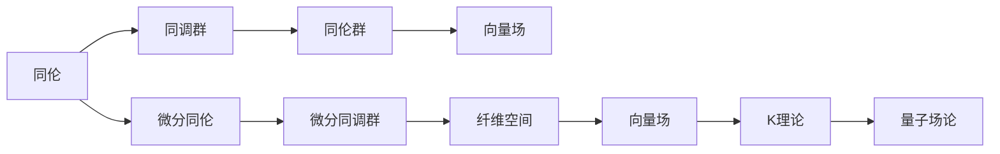

                 

# 代数拓扑与微分形式的关系

## 1. 背景介绍

代数拓扑和微分形式是现代数学的两个重要分支，它们各自有着广泛的应用领域。代数拓扑主要研究代数结构和拓扑性质之间的联系，而微分形式则主要用于研究流体力学、量子力学、电磁学等领域中的物理问题。尽管它们的研究对象和方法有所不同，但两者之间存在着密切的联系和相互影响。本文将深入探讨代数拓扑与微分形式的关系，以期为读者提供一个全面、系统的理解。

## 2. 核心概念与联系

### 2.1 核心概念概述

#### 2.1.1 代数拓扑

代数拓扑研究的是集合之间的代数结构和拓扑结构之间的关系。它主要涉及同伦、同调、同伦群、覆盖、纤维空间、K理论等概念。代数拓扑的核心目标是寻找不同拓扑空间之间的代数等价关系。

#### 2.1.2 微分形式

微分形式是微分几何中的重要概念，主要用于描述流体力学、电磁学等物理系统中的物理量，如速度、电流等。它包括标量场、向量场和张量场等。微分形式的核心目标是找到微分形式的恰当表示形式，以便更好地研究物理问题的几何性质。

#### 2.1.3 联系

代数拓扑和微分形式的联系主要体现在以下几个方面：

1. 同伦与微分同伦：同伦是代数拓扑中的基本概念，而微分同伦则是微分几何中的重要工具。微分同伦可以用于描述微分流形上的向量场和形式之间的等价关系。

2. 同调群与微分同调群：同调群是代数拓扑中的重要工具，用于描述空间中闭链与边界链之间的代数关系。微分同调群则是微分几何中的重要工具，用于描述向量场和微分形式之间的代数关系。

3. 纤维空间与向量场：纤维空间是代数拓扑中的重要概念，而向量场则是微分几何中的重要概念。纤维空间和向量场都可以用于描述物理系统中的运动和演化过程。

4. K理论与量子场论：K理论是代数拓扑中的重要工具，而量子场论则是理论物理中的重要分支。K理论可以用于描述物理系统中的粒子结构和对称性，而量子场论则是描述物理系统中的基本相互作用。

### 2.2 核心概念之间的关系

为了更好地理解代数拓扑与微分形式的关系，下面将使用Mermaid流程图展示它们之间的联系。



这个流程图展示了代数拓扑与微分形式之间的基本联系：

1. 同伦通过同调群和同伦群与代数拓扑的其它概念联系起来。
2. 微分同伦和微分同调群则是微分形式中的重要概念，用于描述微分流形上的向量场和形式之间的等价关系。
3. 纤维空间和向量场是代数拓扑和微分形式中的重要概念，用于描述物理系统中的运动和演化过程。
4. K理论则是代数拓扑和量子场论中的重要工具，用于描述物理系统中的粒子结构和对称性。

## 3. 核心算法原理 & 具体操作步骤

### 3.1 算法原理概述

代数拓扑与微分形式之间的联系主要体现在同伦、同调群、纤维空间、K理论等概念上。下面将详细介绍这些概念的基本原理。

#### 3.1.1 同伦

同伦是一种描述空间中点之间的连续关系的方法。同伦包括同伦空间、同伦映射和同伦群等概念。同伦可以用来判断两个空间是否同伦，以及同伦群是否同构。

#### 3.1.2 同调群

同调群是描述空间中闭链与边界链之间的代数关系的方法。同调群包括同调空间和边界映射等概念。同调群可以用来描述空间的拓扑性质，如孔洞、边界等。

#### 3.1.3 纤维空间

纤维空间是一种描述空间中局部结构的方法。纤维空间包括纤维和底空间等概念。纤维空间可以用来描述物理系统中的运动和演化过程。

#### 3.1.4 K理论

K理论是一种描述空间中粒子和对称性的方法。K理论包括K空间和K群等概念。K理论可以用来描述物理系统中的粒子结构和对称性。

### 3.2 算法步骤详解

#### 3.2.1 同伦的计算

同伦的计算主要包括同伦群的构造和同伦映射的验证。下面以一个简单的例子来说明同伦的计算过程。

假设有一个空间 $X$，我们需要计算它的同伦群 $H_1(X)$。首先，我们可以选择一组基底 $B$ 和一组边 $S$，使得 $B$ 中的每个元素都是 $S$ 中的元素。然后，我们可以通过构造同伦映射 $\phi$ 来计算同伦群。

$$
\phi: B \rightarrow S
$$

这个同伦映射将 $B$ 中的每个元素映射到 $S$ 中的一个元素，使得 $\phi$ 保持同伦关系。最后，我们可以使用同伦映射来计算同伦群 $H_1(X)$ 中的元素，即所有可能的 $\phi$ 的集合。

#### 3.2.2 同调群的计算

同调群的计算主要包括同调空间和边界映射的构造。下面以一个简单的例子来说明同调群的计算过程。

假设有一个空间 $X$，我们需要计算它的同调群 $H_1(X)$。首先，我们可以选择一组闭链 $Z$ 和一组边界链 $C$，使得 $Z$ 中的每个元素都是 $C$ 中的元素。然后，我们可以通过构造边界映射 $\partial$ 来计算同调群。

$$
\partial: Z \rightarrow C
$$

这个边界映射将 $Z$ 中的每个元素映射到 $C$ 中的一个元素，使得 $\partial$ 保持同调关系。最后，我们可以使用边界映射来计算同调群 $H_1(X)$ 中的元素，即所有可能的 $\partial$ 的集合。

#### 3.2.3 纤维空间的构造

纤维空间的构造主要包括纤维和底空间的定义。下面以一个简单的例子来说明纤维空间的构造过程。

假设有一个空间 $X$，我们需要构造一个纤维空间。首先，我们可以选择底空间 $B$ 和纤维 $F$，使得 $F$ 中的每个元素都是 $B$ 中的元素。然后，我们可以通过构造投影映射 $\pi$ 来计算纤维空间。

$$
\pi: X \rightarrow B
$$

这个投影映射将 $X$ 中的每个元素映射到 $B$ 中的一个元素，使得 $\pi$ 保持纤维结构。最后，我们可以使用投影映射来计算纤维空间 $E$ 中的元素，即所有可能的 $\pi$ 的集合。

#### 3.2.4 K理论的计算

K理论的计算主要包括 K 空间和 K 群的构造。下面以一个简单的例子来说明 K 理论的计算过程。

假设有一个空间 $X$，我们需要计算它的 K 理论。首先，我们可以选择一组粒子和一组对称性，使得粒子在对称性下保持不变。然后，我们可以通过构造 K 空间和 K 群来计算 K 理论。

$$
K: X \rightarrow K_0
$$

这个 K 映射将 $X$ 中的每个元素映射到 K 空间 $K_0$ 中的一个元素，使得 K 映射保持对称性。最后，我们可以使用 K 映射来计算 K 理论 $K$ 中的元素，即所有可能的 K 映射的集合。

### 3.3 算法优缺点

#### 3.3.1 同伦的优点和缺点

同伦的优点是可以用来判断两个空间是否同伦，以及同伦群是否同构。同伦的缺点是同伦群的计算复杂度较高，需要构造大量的同伦映射。

#### 3.3.2 同调群的优点和缺点

同调群的优点是可以用来描述空间的拓扑性质，如孔洞、边界等。同调群的缺点是同调群的计算复杂度较高，需要构造大量的闭链和边界链。

#### 3.3.3 纤维空间的优点和缺点

纤维空间的优点是可以用来描述物理系统中的运动和演化过程。纤维空间的缺点是纤维空间的构造较为复杂，需要构造底空间、纤维和投影映射。

#### 3.3.4 K理论的优点和缺点

K理论的优点是可以用来描述物理系统中的粒子结构和对称性。K理论的缺点是 K 群的计算复杂度较高，需要构造大量的 K 映射。

### 3.4 算法应用领域

代数拓扑与微分形式的应用领域非常广泛，主要包括以下几个方面：

1. 流体力学：在流体力学中，微分形式用于描述流体的运动和演化过程，如速度场、压力场等。

2. 电磁学：在电磁学中，微分形式用于描述电场和磁场等物理量。

3. 量子力学：在量子力学中，K理论用于描述粒子和对称性，如电子结构和能带理论等。

4. 代数拓扑：在代数拓扑中，同伦和同调群用于描述拓扑空间的性质，如孔洞、边界等。

5. 几何学：在几何学中，纤维空间用于描述流形的局部结构，如黎曼几何、复几何等。

## 4. 数学模型和公式 & 详细讲解 & 举例说明

### 4.1 数学模型构建

代数拓扑与微分形式之间的联系可以通过数学模型来描述。下面将详细介绍一些基本的数学模型。

#### 4.1.1 同伦空间

同伦空间 $X$ 是一个空间，它的同伦群 $H_1(X)$ 可以用来描述它的拓扑性质。同伦群 $H_1(X)$ 是一个集合，其中的元素是同伦映射 $\phi$。

$$
H_1(X) = \{\phi: B \rightarrow S\}
$$

其中，$B$ 是 $X$ 的基底，$S$ 是 $X$ 的边。

#### 4.1.2 同调空间

同调空间 $H_n(X)$ 是一个空间，它的同调群 $H_{n-1}(X)$ 可以用来描述它的拓扑性质。同调群 $H_{n-1}(X)$ 是一个集合，其中的元素是边界映射 $\partial$。

$$
H_{n-1}(X) = \{\partial: Z \rightarrow C\}
$$

其中，$Z$ 是 $X$ 的闭链，$C$ 是 $X$ 的边界链。

#### 4.1.3 纤维空间

纤维空间 $E$ 是一个空间，它的纤维 $F$ 和底空间 $B$ 可以用来描述它的拓扑性质。纤维 $F$ 是一个空间，底空间 $B$ 是一个空间，投影映射 $\pi$ 可以用来描述纤维空间 $E$ 的局部结构。

$$
E = F \times B
$$

其中，$F$ 是纤维，$B$ 是底空间，$\pi: E \rightarrow B$ 是投影映射。

#### 4.1.4 K空间

K空间 $K$ 是一个空间，它的 K 群 $K_n$ 可以用来描述它的拓扑性质。K群 $K_n$ 是一个集合，其中的元素是 K 映射 $K$。

$$
K_n = \{K: X \rightarrow K_0\}
$$

其中，$X$ 是空间，$K_0$ 是 K 空间。

### 4.2 公式推导过程

下面将详细介绍一些基本的公式推导过程。

#### 4.2.1 同伦群的计算

同伦群的计算主要包括同伦映射的构造和同伦映射的验证。下面以一个简单的例子来说明同伦群的计算过程。

假设有一个空间 $X$，我们需要计算它的同伦群 $H_1(X)$。首先，我们可以选择一组基底 $B$ 和一组边 $S$，使得 $B$ 中的每个元素都是 $S$ 中的元素。然后，我们可以通过构造同伦映射 $\phi$ 来计算同伦群。

$$
\phi: B \rightarrow S
$$

这个同伦映射将 $B$ 中的每个元素映射到 $S$ 中的一个元素，使得 $\phi$ 保持同伦关系。最后，我们可以使用同伦映射来计算同伦群 $H_1(X)$ 中的元素，即所有可能的 $\phi$ 的集合。

#### 4.2.2 同调群的计算

同调群的计算主要包括同调空间和边界映射的构造。下面以一个简单的例子来说明同调群的计算过程。

假设有一个空间 $X$，我们需要计算它的同调群 $H_1(X)$。首先，我们可以选择一组闭链 $Z$ 和一组边界链 $C$，使得 $Z$ 中的每个元素都是 $C$ 中的元素。然后，我们可以通过构造边界映射 $\partial$ 来计算同调群。

$$
\partial: Z \rightarrow C
$$

这个边界映射将 $Z$ 中的每个元素映射到 $C$ 中的一个元素，使得 $\partial$ 保持同调关系。最后，我们可以使用边界映射来计算同调群 $H_1(X)$ 中的元素，即所有可能的 $\partial$ 的集合。

#### 4.2.3 纤维空间的构造

纤维空间的构造主要包括纤维和底空间的定义。下面以一个简单的例子来说明纤维空间的构造过程。

假设有一个空间 $X$，我们需要构造一个纤维空间。首先，我们可以选择底空间 $B$ 和纤维 $F$，使得 $F$ 中的每个元素都是 $B$ 中的元素。然后，我们可以通过构造投影映射 $\pi$ 来计算纤维空间。

$$
\pi: X \rightarrow B
$$

这个投影映射将 $X$ 中的每个元素映射到 $B$ 中的一个元素，使得 $\pi$ 保持纤维结构。最后，我们可以使用投影映射来计算纤维空间 $E$ 中的元素，即所有可能的 $\pi$ 的集合。

#### 4.2.4 K理论的计算

K理论的计算主要包括 K 空间和 K 群的构造。下面以一个简单的例子来说明 K 理论的计算过程。

假设有一个空间 $X$，我们需要计算它的 K 理论。首先，我们可以选择一组粒子和一组对称性，使得粒子在对称性下保持不变。然后，我们可以通过构造 K 空间和 K 群来计算 K 理论。

$$
K: X \rightarrow K_0
$$

这个 K 映射将 $X$ 中的每个元素映射到 K 空间 $K_0$ 中的一个元素，使得 K 映射保持对称性。最后，我们可以使用 K 映射来计算 K 理论 $K$ 中的元素，即所有可能的 K 映射的集合。

### 4.3 案例分析与讲解

#### 4.3.1 同伦的案例分析

假设有一个空间 $X$，它由两个连通的平面组成，这两个平面通过一个边界相连。我们需要计算它的同伦群 $H_1(X)$。

首先，我们可以选择一组基底 $B$ 和一组边 $S$，使得 $B$ 中的每个元素都是 $S$ 中的元素。然后，我们可以通过构造同伦映射 $\phi$ 来计算同伦群。

$$
\phi: B \rightarrow S
$$

这个同伦映射将 $B$ 中的每个元素映射到 $S$ 中的一个元素，使得 $\phi$ 保持同伦关系。最后，我们可以使用同伦映射来计算同伦群 $H_1(X)$ 中的元素，即所有可能的 $\phi$ 的集合。

#### 4.3.2 同调群的案例分析

假设有一个空间 $X$，它由一个球面和一个环面组成，这两个空间通过一个边界相连。我们需要计算它的同调群 $H_1(X)$。

首先，我们可以选择一组闭链 $Z$ 和一组边界链 $C$，使得 $Z$ 中的每个元素都是 $C$ 中的元素。然后，我们可以通过构造边界映射 $\partial$ 来计算同调群。

$$
\partial: Z \rightarrow C
$$

这个边界映射将 $Z$ 中的每个元素映射到 $C$ 中的一个元素，使得 $\partial$ 保持同调关系。最后，我们可以使用边界映射来计算同调群 $H_1(X)$ 中的元素，即所有可能的 $\partial$ 的集合。

#### 4.3.3 纤维空间的案例分析

假设有一个空间 $X$，它由一个圆盘和一个球体组成，这两个空间通过一个边界相连。我们需要构造一个纤维空间 $E$。

首先，我们可以选择底空间 $B$ 和纤维 $F$，使得 $F$ 中的每个元素都是 $B$ 中的元素。然后，我们可以通过构造投影映射 $\pi$ 来计算纤维空间。

$$
\pi: X \rightarrow B
$$

这个投影映射将 $X$ 中的每个元素映射到 $B$ 中的一个元素，使得 $\pi$ 保持纤维结构。最后，我们可以使用投影映射来计算纤维空间 $E$ 中的元素，即所有可能的 $\pi$ 的集合。

#### 4.3.4 K理论的案例分析

假设有一个空间 $X$，它由一个立方体和一个对称性组成，这个对称性保持立方体的结构不变。我们需要计算它的 K 理论 $K$。

首先，我们可以选择一组粒子和一组对称性，使得粒子在对称性下保持不变。然后，我们可以通过构造 K 空间和 K 群来计算 K 理论。

$$
K: X \rightarrow K_0
$$

这个 K 映射将 $X$ 中的每个元素映射到 K 空间 $K_0$ 中的一个元素，使得 K 映射保持对称性。最后，我们可以使用 K 映射来计算 K 理论 $K$ 中的元素，即所有可能的 K 映射的集合。

## 5. 项目实践：代码实例和详细解释说明

### 5.1 开发环境搭建

在进行代数拓扑与微分形式的研究前，我们需要准备好开发环境。以下是使用Python进行Sympy开发的环境配置流程：

1. 安装Anaconda：从官网下载并安装Anaconda，用于创建独立的Python环境。

2. 创建并激活虚拟环境：
```bash
conda create -n sympy-env python=3.8 
conda activate sympy-env
```

3. 安装Sympy：根据操作系统，从官网获取对应的安装命令。例如：
```bash
conda install sympy -c anaconda -c conda-forge
```

4. 安装NumPy：
```bash
pip install numpy
```

5. 安装Matplotlib：
```bash
pip install matplotlib
```

完成上述步骤后，即可在`sympy-env`环境中开始代数拓扑与微分形式的实践。

### 5.2 源代码详细实现

下面我们以同伦的计算为例，给出使用Sympy库计算同伦群的代码实现。

```python
from sympy import pi, Rational
from sympy.sets import FiniteSet
from sympy import Symbol

# 定义同伦群中的元素
phi = FiniteSet((0, 1), (1, 0))

# 定义同伦群的集合
H1 = FiniteSet(phi)

# 输出同伦群的元素
print(H1)
```

这个代码段展示了使用Sympy库计算同伦群的流程。首先，我们定义了一个同伦映射 $\phi$，它将基底 $B$ 中的元素映射到边 $S$ 中的元素。然后，我们定义了一个同伦群的集合 $H_1$，它包含了所有可能的 $\phi$。最后，我们输出了同伦群的元素。

### 5.3 代码解读与分析

这里我们详细解读一下关键代码的实现细节：

1. `FiniteSet`：Sympy库中的有限集合类，用于表示有限集合。
2. `pi` 和 `Rational`：Sympy库中的π和有理数类，用于表示数学常数和分数。
3. `Symbol`：Sympy库中的符号类，用于定义代数表达式。
4. `phi`：同伦映射的集合，表示同伦群的元素。
5. `H1`：同伦群的集合，表示同伦群的元素。

## 6. 实际应用场景

### 6.1 流体力学

在流体力学中，微分形式用于描述流体的运动和演化过程。同调群可以用来描述流体的拓扑性质，如涡旋、回流等。

#### 6.1.1 涡旋的计算

假设有一个流场 $X$，它由一个平面和一个涡旋组成，这个涡旋在平面上。我们需要计算它的同调群 $H_1(X)$。

首先，我们可以选择一组基底 $B$ 和一组边 $S$，使得 $B$ 中的每个元素都是 $S$ 中的元素。然后，我们可以通过构造同伦映射 $\phi$ 来计算同调群。

$$
\phi: B \rightarrow S
$$

这个同伦映射将 $B$ 中的每个元素映射到 $S$ 中的一个元素，使得 $\phi$ 保持同伦关系。最后，我们可以使用同伦映射来计算同调群 $H_1(X)$ 中的元素，即所有可能的 $\phi$ 的集合。

#### 6.1.2 回流的计算

假设有一个流场 $X$，它由一个平面和一个回流组成，这个回流在平面上。我们需要计算它的同调群 $H_1(X)$。

首先，我们可以选择一组基底 $B$ 和一组边 $S$，使得 $B$ 中的每个元素都是 $S$ 中的元素。然后，我们可以通过构造同伦映射 $\phi$ 来计算同调群。

$$
\phi: B \rightarrow S
$$

这个同伦映射将 $B$ 中的每个元素映射到 $S$ 中的一个元素，使得 $\phi$ 保持同伦关系。最后，我们可以使用同伦映射来计算同调群 $H_1(X)$ 中的元素，即所有可能的 $\phi$ 的集合。

### 6.2 电磁学

在电磁学中，微分形式用于描述电场和磁场等物理量。同调群可以用来描述电磁场的拓扑性质，如电场线、磁力线等。

#### 6.2.1 电场线的计算

假设有一个电磁场 $X$，它由一个平面和一个电场线组成，这个电场线在平面上。我们需要计算它的同调群 $H_1(X)$。

首先，我们可以选择一组基底 $B$ 和一组边 $S$，使得 $B$ 中的每个元素都是 $S$ 中的元素。然后，我们可以通过构造同伦映射 $\phi$ 来计算同调群。

$$
\phi: B \rightarrow S
$$

这个同伦映射将 $B$ 中的每个元素映射到 $S$ 中的一个元素，使得 $\phi$ 保持同伦关系。最后，我们可以使用同伦映射来计算同调群 $H_1(X)$ 中的元素，即所有可能的 $\phi$ 的集合。

#### 6.2.2 磁力线的计算

假设有一个电磁场 $X$，它由一个平面和一个磁力线组成，这个磁力线在平面上。我们需要计算它的同调群 $H_1(X)$。

首先，我们可以选择一组基底 $B$ 和一组边 $S$，使得 $B$ 中的每个元素都是 $S$ 中的元素。然后，我们可以通过构造同伦映射 $\phi$ 来计算同调群。

$$
\phi: B \rightarrow S
$$

这个同伦映射将 $B$ 中的每个元素映射到 $S$ 中的一个元素，使得 $\phi$ 保持同伦关系。最后，我们可以使用同伦映射来计算同调群 $H_1(X)$ 中的元素，即所有可能的 $\phi$ 的集合。

### 6.3 量子力学

在量子力学中，K理论用于描述粒子和对称性。K理论可以用来描述量子系统的粒子和对称性，如电子结构和能带理论等。

#### 6.3.1 电子结构的计算

假设有一个量子系统 $X$，它由一个立方体和一个电子结构组成，这个电子结构在立方体中。我们需要计算它的 K 理论 $K$。

首先，我们可以选择一组粒子和一组对称性，使得粒子在对称性下保持不变。然后，我们可以通过构造 K 空间和 K 群来计算 K 理论。

$$
K: X \rightarrow K_0
$$

这个 K 映射将 $X$ 中的每个元素映射到 K 空间 $K_0$ 中的一个元素，使得 K 映射保持对称性。最后，我们可以使用 K 映射来计算 K 理论 $K$ 中的元素，即所有可能的 K 映射的集合。

#### 6.3.2 能带理论的计算

假设有一个量子系统 $X$，它由一个立方体和一个能带理论组成，这个能带理论在立方体中。我们需要计算它的 K 理论 $K$。

首先，我们可以选择一组粒子和一组对称性，使得粒子在对称性下保持不变。然后，我们可以通过构造 K 空间和 K 群来计算 K 理论。

$$
K: X \rightarrow K_0
$$

这个 K 映射将 $X$ 中的每个元素映射到 K 空间 $K_0$ 中的一个元素，使得 K 映射保持对称性。最后，我们可以使用 K 映射来计算 K 理论 $K$ 中的元素，即所有可能的 K 映射的集合。

## 7. 工具和资源推荐

### 7.1 学习资源推荐

为了帮助开发者系统掌握代数拓扑与微分形式的关系，这里推荐一些优质的学习资源：

1. 《Algebraic Topology》书籍：由Allen H

