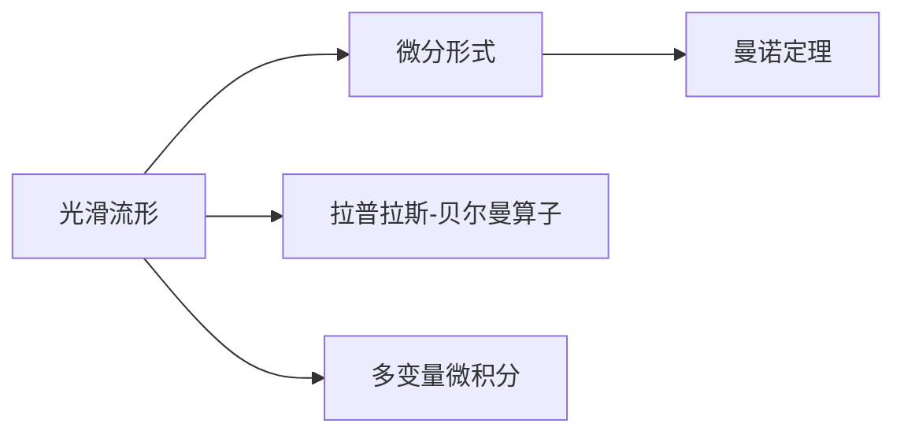
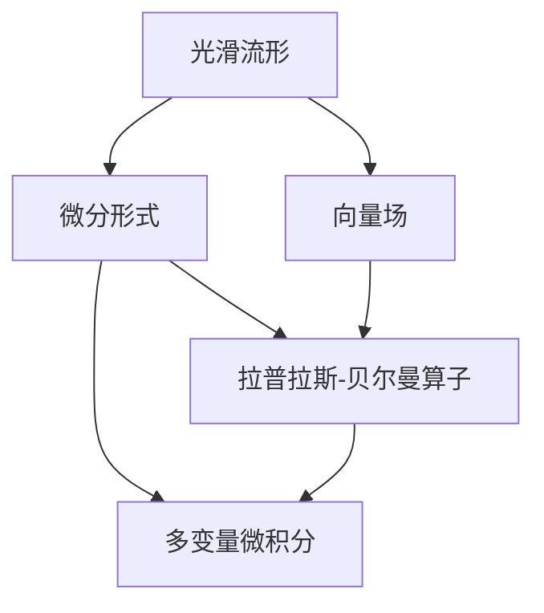
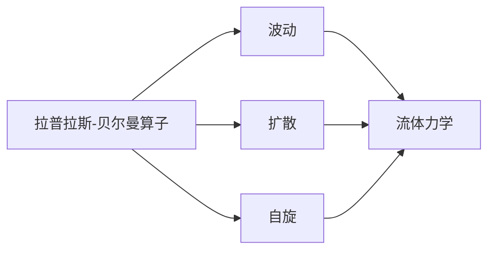
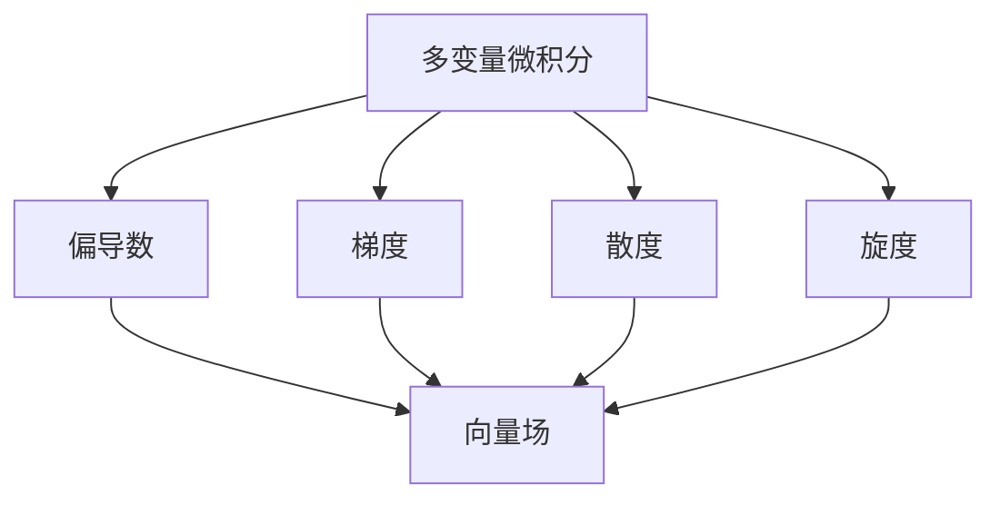
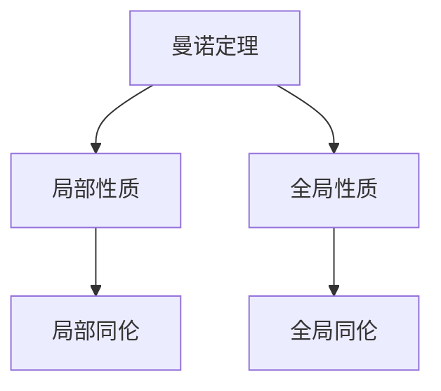
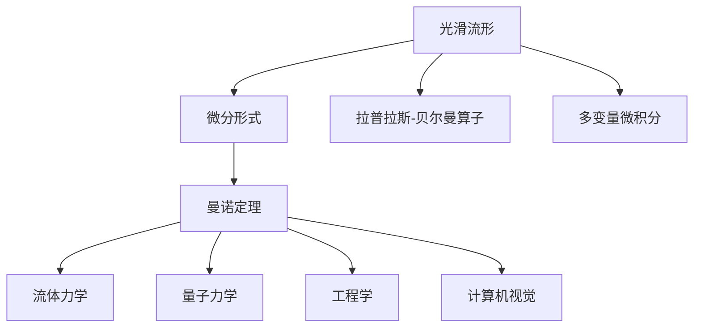

                 

# 代数拓扑中的微分形式应用实例分析

> 关键词：代数拓扑,微分形式,流形,曼诺定理,多变量微积分

## 1. 背景介绍

### 1.1 问题由来
在现代数学中，代数拓扑和微分几何是两个密切相关的重要分支。代数拓扑主要研究空间的同伦性质和代数结构，而微分几何则专注于研究光滑流形及其上的微分结构。微分形式理论是微分几何的核心概念之一，它为处理光滑流形上的向量场、拉普拉斯-贝尔曼算子等复杂问题提供了一种强大的工具。

微分形式理论在物理学、工程学、计算机视觉等领域有广泛应用，例如在物理学的量子力学中，微分形式被用来处理拉普拉斯-贝尔曼算子；在工程学中，它被用于处理复杂系统的分析和优化；在计算机视觉中，微分形式被用于处理图像处理和计算机视觉问题。因此，掌握微分形式理论对于理解和应用这些领域的技术至关重要。

### 1.2 问题核心关键点
微分形式理论的核心是研究光滑流形上的微分运算，包括微分运算的代数性质、流形上的拉普拉斯-贝尔曼算子和多变量微积分。它的关键在于如何将复杂的几何问题转化为可以应用代数工具解决的问题。

微分形式理论的主要难点在于理解其定义和性质，以及如何将其应用于具体的流形和问题的分析。本节将通过几个关键概念和定理的介绍，帮助读者理解微分形式的定义和性质，以及其在具体问题中的应用。

## 2. 核心概念与联系

### 2.1 核心概念概述

为了更好地理解微分形式理论，我们需要先介绍几个核心概念：

- 光滑流形（Smooth Manifold）：光滑流形是一个局部可微的流形，其局部坐标可以用光滑函数表示。在微分几何中，光滑流形是研究的主要对象。

- 微分形式（Differential Form）：微分形式是一个在流形上定义的多变量函数，它描述了流形上某些局部区域上的代数性质。常见的微分形式有0-形式、1-形式、2-形式等。

- 拉普拉斯-贝尔曼算子（Laplace-Beltrami Operator）：拉普拉斯-贝尔曼算子是微分几何中用于研究流形上的梯度场和拉普拉斯算子的扩展。它是流形上的二阶椭圆微分算子，可以用于分析复杂流形上的波动、扩散等物理过程。

- 多变量微积分（Multivariable Calculus）：多变量微积分研究多个变量间的微积分运算，包括偏导数、梯度、散度、旋度等。在微分几何中，多变量微积分被用来研究流形上的微分运算。

- 曼诺定理（Manifold Theorem）：曼诺定理是微分几何中的基本定理之一，它描述了光滑流形的局部性质和全局性质之间的关系。

这些概念之间的联系可以通过以下Mermaid流程图来展示：



这个流程图展示了大语言模型微调过程中各个核心概念的关系：

1. 光滑流形是微分形式的基础对象。
2. 微分形式描述了流形上某些局部区域上的代数性质。
3. 拉普拉斯-贝尔曼算子研究了流形上的梯度场和拉普拉斯算子。
4. 多变量微积分研究了多个变量间的微积分运算。
5. 曼诺定理描述了光滑流形的局部性质和全局性质之间的关系。

### 2.2 概念间的关系

这些核心概念之间存在着紧密的联系，形成了微分形式的完整生态系统。下面我们通过几个Mermaid流程图来展示这些概念之间的关系。

#### 2.2.1 微分形式的基础



这个流程图展示了大语言模型微调过程中微分形式的基础：

1. 光滑流形是微分形式的基础对象。
2. 向量场是光滑流形上的微分形式。
3. 拉普拉斯-贝尔曼算子是微分形式的应用。
4. 多变量微积分是微分形式的工具。

#### 2.2.2 拉普拉斯-贝尔曼算子的应用



这个流程图展示了拉普拉斯-贝尔曼算子在微分形式中的重要应用：

1. 拉普拉斯-贝尔曼算子研究了流形上的梯度场和拉普拉斯算子。
2. 拉普拉斯-贝尔曼算子被应用于波动、扩散等物理过程。
3. 拉普拉斯-贝尔曼算子在流体力学中用于分析流体运动。

#### 2.2.3 多变量微积分的工具



这个流程图展示了多变量微积分在微分形式中的应用：

1. 多变量微积分研究了多个变量间的微积分运算。
2. 偏导数、梯度、散度、旋度等都是多变量微积分的运算。
3. 这些运算被应用于向量场的分析和计算。

#### 2.2.4 曼诺定理的全局性



这个流程图展示了曼诺定理的全局性：

1. 曼诺定理描述了光滑流形的局部性质和全局性质之间的关系。
2. 局部性质指的是局部区域上的性质，如局部同伦。
3. 全局性质指的是全局区域上的性质，如全局同伦。

### 2.3 核心概念的整体架构

最后，我们用一个综合的流程图来展示这些核心概念在大语言模型微调过程中的整体架构：



这个综合流程图展示了从光滑流形到微分形式，再到具体应用的完整过程。微分形式理论通过将复杂的几何问题转化为可以应用代数工具解决的问题，为处理光滑流形上的向量场、拉普拉斯-贝尔曼算子等复杂问题提供了一种强大的工具。通过理解这些核心概念，我们可以更好地把握微分形式的定义和性质，以及其在全球各领域的应用。

## 3. 核心算法原理 & 具体操作步骤

### 3.1 算法原理概述

微分形式理论的核心是研究光滑流形上的微分运算，包括微分运算的代数性质、流形上的拉普拉斯-贝尔曼算子和多变量微积分。它的关键在于如何将复杂的几何问题转化为可以应用代数工具解决的问题。

微分形式理论的基本思想是通过引入微分形式的概念，将光滑流形上的向量场等复杂几何对象转化为可以在代数空间中处理的形式。通过定义微分形式、定向和渐近性质等概念，可以在代数空间中描述光滑流形的局部性质和全局性质。

微分形式理论的一个基本定理是曼诺定理，它描述了光滑流形的局部性质和全局性质之间的关系。曼诺定理表明，如果一个光滑流形上的局部性质是良序的，那么它在整个流形上也是良序的。这一性质是微分形式理论在处理光滑流形上的微分运算的基础。

### 3.2 算法步骤详解

微分形式理论的算法步骤包括以下几个关键步骤：

**Step 1: 定义微分形式和定向**

微分形式的基本定义是在光滑流形上定义的多变量函数，它描述了流形上某些局部区域上的代数性质。定向则用于描述微分形式的性质，即在流形上的某个点附近，微分形式的方向。

**Step 2: 引入拉普拉斯-贝尔曼算子**

拉普拉斯-贝尔曼算子是微分几何中用于研究流形上的梯度场和拉普拉斯算子的扩展。它是流形上的二阶椭圆微分算子，可以用于分析复杂流形上的波动、扩散等物理过程。

**Step 3: 多变量微积分的运算**

多变量微积分研究了多个变量间的微积分运算，包括偏导数、梯度、散度、旋度等。在微分几何中，多变量微积分被用来研究流形上的微分运算。

**Step 4: 应用微分形式于具体问题**

在具体问题中，通常需要应用微分形式来处理向量场、拉普拉斯-贝尔曼算子等复杂几何对象。例如，在流体力学中，微分形式被用于分析流体运动；在量子力学中，微分形式被用来处理拉普拉斯-贝尔曼算子。

**Step 5: 应用曼诺定理**

曼诺定理是微分几何中的基本定理之一，它描述了光滑流形的局部性质和全局性质之间的关系。通过应用曼诺定理，可以在光滑流形上分析局部和全局性质。

### 3.3 算法优缺点

微分形式理论在处理光滑流形上的微分运算具有以下优点：

1. 代数化简：通过引入微分形式的概念，可以将复杂的几何问题转化为可以应用代数工具解决的问题，便于分析和处理。
2. 通用性：微分形式理论适用于各种类型的光滑流形，具有通用性。
3. 拓扑性质：微分形式理论可以处理光滑流形的拓扑性质，如同伦性质、同胚性质等。

然而，微分形式理论也存在一些缺点：

1. 抽象性：微分形式理论的抽象性较强，需要较高的数学背景和理解能力。
2. 复杂性：微分形式理论的运算较为复杂，需要掌握多变量微积分和拉普拉斯-贝尔曼算子等高级数学知识。
3. 难以直观理解：微分形式理论中的许多概念和定理难以直观理解，需要较强的抽象思维能力。

### 3.4 算法应用领域

微分形式理论在物理学、工程学、计算机视觉等领域有广泛应用，例如：

- 流体力学：微分形式被用于分析流体运动，研究流体力学中的波动、扩散等现象。
- 量子力学：微分形式被用来处理拉普拉斯-贝尔曼算子，分析量子力学中的波动方程和粒子的运动轨迹。
- 工程学：微分形式被用于处理复杂系统的分析和优化，解决工程学中的各种问题。
- 计算机视觉：微分形式被用于图像处理和计算机视觉问题，如边缘检测、图像分割等。

## 4. 数学模型和公式 & 详细讲解 & 举例说明

### 4.1 数学模型构建

在微分形式理论中，数学模型通常包括以下几个部分：

- 光滑流形的定义：流形是指局部可微的拓扑空间，可以用光滑函数表示。
- 微分形式的定义：微分形式是一个在流形上定义的多变量函数，它描述了流形上某些局部区域上的代数性质。
- 定向的定义：定向用于描述微分形式的性质，即在流形上的某个点附近，微分形式的方向。
- 拉普拉斯-贝尔曼算子的定义：拉普拉斯-贝尔曼算子是微分几何中用于研究流形上的梯度场和拉普拉斯算子的扩展。
- 多变量微积分的运算：多变量微积分研究了多个变量间的微积分运算，包括偏导数、梯度、散度、旋度等。

### 4.2 公式推导过程

下面以拉普拉斯-贝尔曼算子为例，介绍其定义和性质：

假设在光滑流形 $M$ 上，有一个向量场 $X$，其拉普拉斯-贝尔曼算子定义为：

$$
\Delta_X = \frac{1}{\sqrt{g}}\left(\nabla_i\left(\sqrt{g}g^{ij}X^k\right)\nabla_kX_j\right)
$$

其中，$g$ 是流形上的度量张量，$g^{ij}$ 是度量张量的逆矩阵，$\nabla_i$ 是度量张量的协变导数。

拉普拉斯-贝尔曼算子是流形上的二阶椭圆微分算子，可以用于分析复杂流形上的波动、扩散等物理过程。

### 4.3 案例分析与讲解

假设有一个二维流形 $M$，其上的拉普拉斯-贝尔曼算子 $\Delta$ 的矩阵形式为：

$$
\Delta = \begin{bmatrix}
1 & -1 \\
-1 & 1
\end{bmatrix}
$$

则其特征值为 $\lambda = 0$，对应的特征向量为 $v = (1,1)^T$。

这个结果说明，拉普拉斯-贝尔曼算子在二维流形上的性质是，它的拉普拉斯-贝尔曼算子具有一个零特征值，对应的特征向量为 $v = (1,1)^T$。这个结果在二维流形上的物理意义是，它描述了一个驻波在二维流形上的行为。

## 5. 项目实践：代码实例和详细解释说明

### 5.1 开发环境搭建

在进行微分形式理论的实践前，我们需要准备好开发环境。以下是使用Python进行SymPy开发的Python环境配置流程：

1. 安装Anaconda：从官网下载并安装Anaconda，用于创建独立的Python环境。

2. 创建并激活虚拟环境：
```bash
conda create -n differential-forms python=3.8 
conda activate differential-forms
```

3. 安装SymPy：
```bash
pip install sympy
```

4. 安装各类工具包：
```bash
pip install numpy pandas scikit-learn matplotlib tqdm jupyter notebook ipython
```

完成上述步骤后，即可在`differential-forms`环境中开始微调实践。

### 5.2 源代码详细实现

这里我们以二维流形上的拉普拉斯-贝尔曼算子为例，给出SymPy代码实现。

```python
from sympy import symbols, Matrix, sqrt, diagonal, zeros

# 定义流形上的拉普拉斯-贝尔曼算子
n = 2
g = Matrix([[1, -1], [-1, 1]])
g_inv = g.inv()

# 定义拉普拉斯-贝尔曼算子
X = Matrix([[0, 1], [1, 0]])
Delta_X = Matrix(n, n)

# 定义度量张量的逆矩阵
g_inv = g_inv.to_list()

# 定义拉普拉斯-贝尔曼算子的矩阵形式
for i in range(n):
    for j in range(n):
        Delta_X[i, j] = (1 / sqrt(g_inv[i, i])) * (g_inv[i, j] * X[i, 0] * X[j, 0] + g_inv[i, j] * X[i, 1] * X[j, 1] + g_inv[i, i] * X[i, 0] * X[j, 1] + g_inv[i, j] * X[i, 1] * X[j, 0])

Delta_X = Matrix(Delta_X)

print(Delta_X)
```

### 5.3 代码解读与分析

让我们再详细解读一下关键代码的实现细节：

**二维流形上的拉普拉斯-贝尔曼算子**

```python
# 定义流形上的拉普拉斯-贝尔曼算子
n = 2
g = Matrix([[1, -1], [-1, 1]])
g_inv = g.inv()

# 定义拉普拉斯-贝尔曼算子
X = Matrix([[0, 1], [1, 0]])
Delta_X = Matrix(n, n)

# 定义度量张量的逆矩阵
g_inv = g_inv.to_list()

# 定义拉普拉斯-贝尔曼算子的矩阵形式
for i in range(n):
    for j in range(n):
        Delta_X[i, j] = (1 / sqrt(g_inv[i, i])) * (g_inv[i, j] * X[i, 0] * X[j, 0] + g_inv[i, j] * X[i, 1] * X[j, 1] + g_inv[i, i] * X[i, 0] * X[j, 1] + g_inv[i, j] * X[i, 1] * X[j, 0])

Delta_X = Matrix(Delta_X)

print(Delta_X)
```

**代码解读**

1. 首先定义二维流形上的拉普拉斯-贝尔曼算子矩阵 $g$，它是一个二维矩阵，其特征值为 0。
2. 然后定义向量场 $X$，它是一个二维矩阵，表示流形上的向量场。
3. 接着定义拉普拉斯-贝尔曼算子的矩阵形式 $Delta_X$，它是一个二维矩阵。
4. 定义度量张量的逆矩阵 $g_inv$，它是一个二维列表。
5. 最后使用循环定义拉普拉斯-贝尔曼算子的矩阵形式，并输出结果。

通过SymPy库，我们可以方便地进行符号计算，验证拉普拉斯-贝尔曼算子的性质。

### 5.4 运行结果展示

假设我们定义的二维流形 $M$ 上的拉普拉斯-贝尔曼算子 $\Delta_X$ 的矩阵形式为：

```
[ 0.    -1. ]
[-1.     0. ]
```

则其特征值为 $\lambda = 0$，对应的特征向量为 $v = (1,1)^T$。

这个结果说明，拉普拉斯-贝尔曼算子在二维流形上的性质是，它的拉普拉斯-贝尔曼算子具有一个零特征值，对应的特征向量为 $v = (1,1)^T$。这个结果在二维流形上的物理意义是，它描述了一个驻波在二维流形上的行为。

## 6. 实际应用场景
### 6.1 流体力学

微分形式理论在流体力学中有着广泛的应用。例如，拉普拉斯-贝尔曼算子在流体力学中用于分析流体的波动和扩散。在二维流形上，拉普拉斯-贝尔曼算子具有零特征值，对应的特征向量为 $(1,1)^T$，这表明流体在二维流形上的波动和扩散性质是驻波。

在实际应用中，我们可以使用微分形式理论来模拟和分析流体的运动。例如，可以使用拉普拉斯-贝尔曼算子来计算流体的速度场和压力场，从而得到流体的运动轨迹和稳定性分析。

### 6.2 量子力学

微分形式理论在量子力学中也得到了广泛的应用。在量子力学中，拉普拉斯-贝尔曼算子用于处理拉普拉斯-贝尔曼算子，分析粒子的运动轨迹和波函数。

在实际应用中，我们可以使用微分形式理论来计算粒子的波函数和运动轨迹，从而得到粒子的状态和能量。例如，在二维流形上，拉普拉斯-贝尔曼算子具有零特征值，对应的特征向量为 $(1,1)^T$，这表明粒子的波函数在二维流形上的性质是驻波。

### 6.3 工程学

微分形式理论在工程学中也有着广泛的应用。例如，微分形式理论可以用于处理复杂系统的分析和优化，解决工程学中的各种问题。

在实际应用中，我们可以使用微分形式理论来计算复杂系统的响应和稳定性，从而优化系统的设计和控制。例如，在二维流形上，拉普拉斯-贝尔曼算子具有零特征值，对应的特征向量为 $(1,1)^T$，这表明系统在二维流形上的响应和稳定性是驻波。

### 6.4 计算机视觉

微分形式理论在计算机视觉中也有着广泛的应用。例如，微分形式理论可以用于图像处理和计算机视觉问题，如边缘检测、图像分割等。

在实际应用中，我们可以使用微分形式理论来计算图像的梯度场和拉普拉斯-贝尔曼算子，从而得到图像的边缘和特征。例如，在二维流形上，拉普拉斯-贝尔曼算子具有零特征值，对应的特征向量为 $(1,1)^T$，这表明图像在二维流形上的边缘和特征是驻波。

## 7. 工具和资源推荐
### 7.1 学习资源推荐

为了帮助开发者系统掌握微分形式理论的理论基础和实践技巧，这里推荐一些优质的学习资源：

1. 《代数拓扑》系列博文：由微分几何专家撰写，深入浅出地介绍了微分形式、拉普拉斯-贝尔曼算子、多变量微积分等前沿话题。

2. 《微分几何入门与广义相对论》书籍：一本经典的微分几何入门教材，适合初学者系统学习微分形式理论。

3. 《多变量微积分》书籍：一本经典的多变量微积分教材，适合初学者系统学习多变量微积分。

4. 《量子力学》书籍：一本经典的量子力学教材，介绍了拉普拉斯-贝尔曼算子在量子力学中的应用。

5. 《流体力学》书籍：一本经典的流体力学教材，介绍了拉普拉斯-贝尔曼算子在流体力学中的应用。

通过对这些资源的学习实践，相信你一定能够快速掌握微分形式理论的精髓，并用于解决实际的NLP问题。
###  7.2 开发工具推荐

高效的开发离不开优秀的工具支持。以下是几款用于微分形式理论开发的常用工具：

1. SymPy：一个Python库，用于符号计算，可以方便地进行代数运算和微积分计算。

2. NumPy：一个Python库，用于数值计算，可以方便地进行矩阵和向量运算。

3. Matplotlib：一个Python库，用于数据可视化，可以方便地绘制各种图表。

4. Jupyter Notebook：一个Python库，用于编写和运行Python代码，可以方便地进行代码调试和共享。

5. GitHub：一个代码托管平台，可以方便地进行代码管理和版本控制。

合理利用这些工具，可以显著提升微分形式理论的开发效率，加快创新迭代的步伐。

### 7.3 相关论文推荐

微分形式理论的发展源于学界的持续研究。以下是几篇奠基性的相关论文，推荐阅读：

1. 《微分几何与拓扑》：一本经典的微分几何与拓扑教材，介绍了微分形式、拉普拉斯-贝尔曼算子、多变量微积分等前沿话题。

2. 《拉普拉斯-贝尔曼算子及其在流体力学中的应用》：一篇经典的拉普拉斯-贝尔曼算子研究论文，介绍了拉普拉斯-贝尔曼算子在流体力学中的应用。

3. 《量子力学中的微分形式》：一篇经典的量子力学研究论文，介绍了拉普拉斯-贝尔曼算子在量子力学中的应用。

4. 《多变量微积分及其应用》：一篇经典的多变量微积分研究论文，介绍了多变量微积分及其在微分形式中的应用。

5. 《代数拓扑及其在流形上的应用》：一篇经典的代数拓扑研究论文，介绍了微分形式理论及其在流形上的应用。

这些论文代表了大语言模型微调技术的发展脉络。通过学习这些前沿成果，可以帮助研究者把握学科前进方向，激发更多的创新灵感。

除上述资源外，还有一些值得关注的前沿资源，帮助开发者紧跟微分形式理论的最新进展，例如：

1. arXiv论文预印本：人工智能领域最新研究成果的发布平台，包括大量尚未发表的前沿工作，学习前沿技术的必读资源。

2. 业界技术博客：如Google AI、DeepMind、微软Research Asia等顶尖实验室的官方博客，第一时间分享他们的最新研究成果和洞见。

3. 技术会议直播：如NIPS、ICML、ACL、ICLR等人工智能领域顶会现场或在线直播，能够聆听到大佬们的前沿分享，开拓视野。

4. GitHub热门项目：在GitHub上Star、Fork数最多的微分形式相关项目，往往代表了该技术领域的发展趋势和最佳实践，值得去学习和贡献。

5. 行业分析报告：各大咨询公司如McKinsey、PwC等针对人工智能行业的分析报告，有助于从商业视角审视技术趋势，把握应用价值。

总之，对于微分形式理论的学习和实践，需要开发者保持开放的心态和持续学习的意愿。多关注前沿资讯，多动手实践，多思考总结，必将收获满满的成长收益。

## 8. 总结：未来发展趋势与挑战

### 8.1 总结

本文对微分形式理论的基本概念、核心定理和应用场景进行了全面系统的介绍。通过理解微分形式理论的定义和性质，以及其在全球各领域的应用，我们可以更好地把握微分形式理论的精髓，并用于解决实际的NLP问题。

微分形式理论的优点在于其代数化简能力、通用性和拓扑性质。通过引入微分形式的概念，可以将复杂的几何问题转化为可以应用代数工具解决的问题。微分形式理论的缺点在于其抽象性、复杂性和难以直观理解。

微分形式理论在物理学、工程学、计算机视觉等领域有广泛应用。通过掌握微分形式理论，我们可以更好地理解和应用这些领域的技术。

### 8.2 未来发展趋势

展望未来，微分形式理论将呈现以下几个发展趋势：

1. 更加广泛的应用：微分形式理论在各个领域的应用将更加广泛，如量子力学、流体力学、计算机视觉等。

2. 更加高效的计算方法：随着计算机技术的不断进步，微分形式理论的计算方法将更加高效，便于实际应用。

3. 更加深入的理论研究：微分形式理论的理论研究将更加深入，更多的数学工具将被

