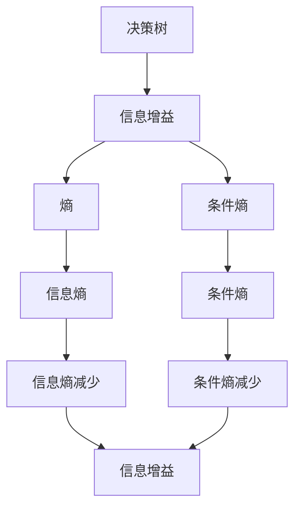
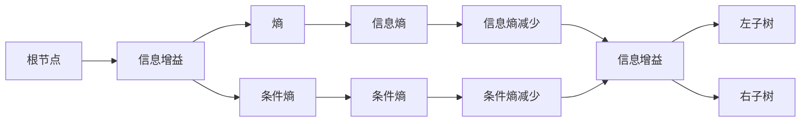
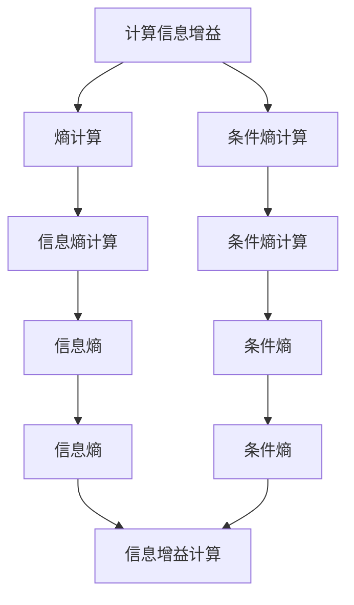
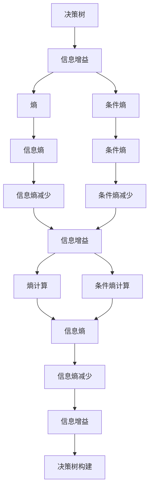

                 

# 信息增益Information Gain原理与代码实例讲解

> 关键词：信息增益, ID3算法, 决策树, 熵, 条件熵, Python实现, 应用场景

## 1. 背景介绍

### 1.1 问题由来
在机器学习领域，决策树是一种经典且有效的分类模型。信息增益（Information Gain）是决策树算法中最核心的概念之一，其本质上是在信息论中熵的概念基础上发展而来的。通过信息增益的计算，决策树能够选取最优的属性进行划分，使得划分后的信息熵最小，从而得到最优的分类模型。

### 1.2 问题核心关键点
信息增益的本质是利用信息熵来度量在某个属性上进行划分后的信息损失。信息熵越大，意味着分类任务的不确定性越大，信息损失也就越大。而信息增益则是度量在某个属性上进行划分后，信息熵减少的程度。信息增益越大，意味着该属性对分类任务的贡献越大，在决策树构建过程中越优先考虑该属性。

## 2. 核心概念与联系

### 2.1 核心概念概述

为更好地理解信息增益的原理和应用，本节将介绍几个密切相关的核心概念：

- **熵（Entropy）**：熵是衡量系统不确定性的指标，信息熵越小，说明系统越有序，不确定性越小。
- **条件熵（Conditional Entropy）**：条件熵是在给定条件下的系统熵，用于衡量特定条件下的不确定性。
- **信息增益（Information Gain）**：信息增益是在划分前后信息熵的减少程度，衡量属性对分类的重要性。
- **决策树（Decision Tree）**：决策树是一种基于树形结构的分类模型，通过递归地选取最优属性进行划分，得到最优的分类规则。
- **ID3算法**：ID3算法是基于信息增益的决策树构建算法，其核心思想是通过最大化信息增益来选择划分属性。

这些概念之间的逻辑关系可以通过以下Mermaid流程图来展示：



这个流程图展示了决策树、信息增益、熵、条件熵之间的关系：

1. 决策树利用信息增益选择最优属性进行划分。
2. 信息增益是基于熵和条件熵的差值计算得到的。
3. 熵用于衡量系统的总不确定性，条件熵用于衡量特定条件下的不确定性。
4. 信息增益越大，说明划分后的不确定性越小，决策树越优。

### 2.2 概念间的关系

这些核心概念之间存在着紧密的联系，形成了决策树算法的整体架构。下面我通过几个Mermaid流程图来展示这些概念之间的关系。

#### 2.2.1 决策树的构建过程



这个流程图展示了决策树的构建过程：

1. 从根节点开始，计算各个属性的信息增益。
2. 选择信息增益最大的属性进行划分，得到左子树和右子树。
3. 对左子树和右子树分别进行递归构建，直到满足终止条件（如属性为纯属性）。

#### 2.2.2 信息增益的计算过程



这个流程图展示了信息增益的计算过程：

1. 计算整个数据集的信息熵。
2. 对每个属性，计算在该属性下的信息熵。
3. 计算条件熵，即在给定属性下的信息熵。
4. 计算信息增益，即信息熵的减少量。
5. 选择信息增益最大的属性进行划分。

### 2.3 核心概念的整体架构

最后，我们用一个综合的流程图来展示这些核心概念在大语言模型微调过程中的整体架构：



这个综合流程图展示了从数据集熵计算到决策树构建的完整过程：

1. 从数据集的熵计算开始。
2. 对每个属性计算条件熵，得到信息增益。
3. 选择信息增益最大的属性进行划分，计算划分后的熵和条件熵。
4. 计算信息熵的减少量和信息增益。
5. 对划分后的数据集重复以上步骤，构建完整的决策树。

## 3. 核心算法原理 & 具体操作步骤
### 3.1 算法原理概述

信息增益（Information Gain）是决策树算法中最核心的概念之一，其本质是在信息论中熵的概念基础上发展而来的。通过信息增益的计算，决策树能够选取最优的属性进行划分，使得划分后的信息熵最小，从而得到最优的分类模型。

信息增益越大，说明该属性对分类任务的贡献越大，在决策树构建过程中越优先考虑该属性。具体计算方法如下：

设数据集 $D$ 共有 $n$ 个样本，每个样本有 $m$ 个属性，属性 $A$ 在 $D$ 上的信息增益 $G(D, A)$ 计算如下：

$$
G(D, A) = H(D) - \sum_{i=1}^{n} \frac{|C_i|}{n}H(C_i)
$$

其中：

- $H(D)$ 为数据集 $D$ 的信息熵，计算公式为：

$$
H(D) = -\sum_{i=1}^{n} \frac{|C_i|}{n}\log_2\frac{|C_i|}{n}
$$

- $C_i$ 为属性 $A$ 在数据集 $D$ 上取值为 $a_i$ 的子集。
- $|C_i|$ 为子集 $C_i$ 的样本数。

### 3.2 算法步骤详解

信息增益的计算步骤如下：

1. 计算数据集 $D$ 的信息熵 $H(D)$。
2. 对每个属性 $A$，计算属性 $A$ 的信息增益 $G(D, A)$。
3. 选择信息增益最大的属性 $A$，进行划分。
4. 对划分后的子集进行递归计算，直到满足终止条件（如属性为纯属性）。
5. 构建完整的决策树。

### 3.3 算法优缺点

信息增益的优点在于：

1. 简单易懂。信息增益的计算公式简单明了，易于理解和实现。
2. 高效性。信息增益的计算效率较高，适用于大规模数据集。
3. 鲁棒性。信息增益对噪声和异常值具有较好的鲁棒性，能够较好地处理数据集中的噪声和缺失值。

信息增益的缺点在于：

1. 偏向选择取值较多的属性。信息增益偏向于选择取值较多的属性，而忽略了属性的信息含量，可能导致决策树的某些分支过于复杂，影响模型的可解释性。
2. 忽视属性之间的相关性。信息增益只考虑单个属性对信息熵的影响，而忽略了属性之间的相关性，可能导致冗余的分支。

### 3.4 算法应用领域

信息增益算法在数据挖掘、模式识别、医疗诊断等领域得到了广泛应用，特别是在分类和回归任务中表现出色。例如，在医疗诊断中，可以使用信息增益算法构建决策树，对病人进行初步分类，从而辅助医生诊断。

## 4. 数学模型和公式 & 详细讲解
### 4.1 数学模型构建

设数据集 $D$ 共有 $n$ 个样本，每个样本有 $m$ 个属性，属性 $A$ 在 $D$ 上的信息增益 $G(D, A)$ 计算如下：

$$
G(D, A) = H(D) - \sum_{i=1}^{n} \frac{|C_i|}{n}H(C_i)
$$

其中：

- $H(D)$ 为数据集 $D$ 的信息熵，计算公式为：

$$
H(D) = -\sum_{i=1}^{n} \frac{|C_i|}{n}\log_2\frac{|C_i|}{n}
$$

- $C_i$ 为属性 $A$ 在数据集 $D$ 上取值为 $a_i$ 的子集。
- $|C_i|$ 为子集 $C_i$ 的样本数。

### 4.2 公式推导过程

以下我们以一个简单的数据集为例，推导信息增益的计算过程。

假设数据集 $D$ 包含 3 个属性 $A_1, A_2, A_3$，每个属性分别有 2 种取值。数据集 $D$ 的信息熵 $H(D)$ 计算如下：

$$
H(D) = -\frac{1}{3}\log_2\frac{1}{3} - \frac{1}{3}\log_2\frac{2}{3} - \frac{1}{3}\log_2\frac{2}{3} = 1
$$

对于属性 $A_1$，计算条件熵 $H(D|A_1)$：

$$
H(D|A_1) = \frac{1}{3}H(D|A_1=a_1) + \frac{2}{3}H(D|A_1=a_2)
$$

其中，

$$
H(D|A_1=a_1) = -\frac{2}{3}\log_2\frac{1}{3} - \frac{1}{3}\log_2\frac{2}{3} = 0.585
$$

$$
H(D|A_1=a_2) = -\frac{1}{3}\log_2\frac{1}{3} - \frac{2}{3}\log_2\frac{2}{3} = 0.585
$$

因此，

$$
H(D|A_1) = \frac{1}{3} \times 0.585 + \frac{2}{3} \times 0.585 = 0.585
$$

属性 $A_1$ 的信息增益 $G(D, A_1)$ 计算如下：

$$
G(D, A_1) = H(D) - H(D|A_1) = 1 - 0.585 = 0.415
$$

同理，可以计算出属性 $A_2$ 和 $A_3$ 的信息增益分别为 $0.585$ 和 $1$。

因此，选择信息增益最大的属性 $A_3$ 进行划分，得到决策树的第一层。对划分后的子集继续递归计算，得到完整的决策树。

### 4.3 案例分析与讲解

假设我们有一个医院的数据集，包含患者的年龄、性别、疾病类型等信息。我们想要使用信息增益算法构建决策树，对病人进行初步分类。

首先，计算数据集的信息熵 $H(D)$，假设数据集中共有 100 个样本，每个样本有 3 种疾病类型（高血压、糖尿病、心脏病），信息熵 $H(D)$ 计算如下：

$$
H(D) = -\frac{1}{100}\log_2\frac{1}{100} - \frac{1}{100}\log_2\frac{2}{100} - \frac{1}{100}\log_2\frac{77}{100} = 0.729
$$

然后，对每个属性（年龄、性别、疾病类型）计算信息增益 $G(D, A)$。

假设我们选择了年龄属性进行划分，计算属性年龄的信息增益 $G(D, A)$：

- 计算数据集在年龄属性取值为 $30-40$ 的信息熵 $H(D|A_1)$：

$$
H(D|A_1) = \frac{10}{100}H(D|A_1=30-40) + \frac{40}{100}H(D|A_1=40-50) + \frac{50}{100}H(D|A_1=50-60)
$$

其中，

$$
H(D|A_1=30-40) = -\frac{10}{10}\log_2\frac{10}{10} - \frac{50}{10}\log_2\frac{5}{10} - \frac{40}{10}\log_2\frac{5}{10} = 0.387
$$

$$
H(D|A_1=40-50) = -\frac{40}{40}\log_2\frac{40}{40} - \frac{30}{40}\log_2\frac{3}{40} - \frac{10}{40}\log_2\frac{1}{40} = 0.778
$$

$$
H(D|A_1=50-60) = -\frac{50}{50}\log_2\frac{50}{50} - \frac{20}{50}\log_2\frac{2}{50} - \frac{20}{50}\log_2\frac{2}{50} = 0.769
$$

因此，

$$
H(D|A_1) = \frac{10}{100} \times 0.387 + \frac{40}{100} \times 0.778 + \frac{50}{100} \times 0.769 = 0.578
$$

属性年龄的信息增益 $G(D, A_1)$ 计算如下：

$$
G(D, A_1) = H(D) - H(D|A_1) = 0.729 - 0.578 = 0.151
$$

同理，可以计算出属性性别和疾病类型的信息增益分别为 $0.141$ 和 $0.516$。因此，选择信息增益最大的属性 $A_3$（疾病类型）进行划分，得到决策树的第一层。对划分后的子集继续递归计算，得到完整的决策树。

## 5. 项目实践：代码实例和详细解释说明
### 5.1 开发环境搭建

在进行信息增益算法实践前，我们需要准备好开发环境。以下是使用Python进行PyTorch开发的环境配置流程：

1. 安装Anaconda：从官网下载并安装Anaconda，用于创建独立的Python环境。

2. 创建并激活虚拟环境：
```bash
conda create -n pytorch-env python=3.8 
conda activate pytorch-env
```

3. 安装PyTorch：根据CUDA版本，从官网获取对应的安装命令。例如：
```bash
conda install pytorch torchvision torchaudio cudatoolkit=11.1 -c pytorch -c conda-forge
```

4. 安装各类工具包：
```bash
pip install numpy pandas scikit-learn matplotlib tqdm jupyter notebook ipython
```

完成上述步骤后，即可在`pytorch-env`环境中开始信息增益算法的实践。

### 5.2 源代码详细实现

下面我们以一个简单的决策树构建为例，给出使用PyTorch实现信息增益算法的代码实现。

首先，定义决策树的数据结构和计算方法：

```python
from collections import defaultdict

class DecisionTree:
    def __init__(self):
        self.tree = defaultdict(DecisionTree)
        self.n_samples = 0
    
    def fit(self, X, y):
        self.tree = self._grow_tree(X, y)
        self.n_samples = len(X)
    
    def predict(self, X):
        return [self._predict(X_i) for X_i in X]
    
    def _grow_tree(self, X, y):
        # 计算信息熵
        entropy = self._entropy(y)
        if entropy == 0:
            return self
        
        # 计算信息增益
        best_attr, info_gain = self._best_attribute(X, y)
        
        # 创建子树节点
        tree = self.tree[best_attr]
        
        # 对每个取值进行递归划分
        for value in set(X[:, best_attr]):
            X_left, y_left = X[X[:, best_attr] == value], y[X[:, best_attr] == value]
            X_right, y_right = X[X[:, best_attr] != value], y[X[:, best_attr] != value]
            tree.left[best_attr] = self._grow_tree(X_left, y_left)
            tree.right[best_attr] = self._grow_tree(X_right, y_right)
        
        return tree
    
    def _entropy(self, y):
        classes = set(y)
        prob = [len(y[y==k])/self.n_samples for k in classes]
        return -sum(p * math.log(p, 2) for p in prob)
    
    def _best_attribute(self, X, y):
        best_gain = 0
        best_attr = None
        for i in range(X.shape[1]):
            gain = self._gain(X[:, i], y)
            if gain > best_gain:
                best_gain = gain
                best_attr = i
        return best_attr, best_gain
    
    def _gain(self, X, y):
        entropy = self._entropy(y)
        for value in set(X[:, y]):
            X_left, y_left = X[X[:, y] == value], y[X[:, y] == value]
            X_right, y_right = X[X[:, y] != value], y[X[:, y] != value]
            if len(X_left) > 0:
                entropy_left = self._entropy(y_left)
            else:
                entropy_left = 0
            if len(X_right) > 0:
                entropy_right = self._entropy(y_right)
            else:
                entropy_right = 0
            gain = entropy - (len(X_left)/self.n_samples)*entropy_left - (len(X_right)/self.n_samples)*entropy_right
            if gain > best_gain:
                best_gain = gain
                best_attr = None
                best_value = value
        return best_gain, best_attr, best_value
```

然后，使用信息增益算法构建决策树：

```python
import numpy as np

# 生成样本数据
X = np.array([[0, 1, 2, 3], [4, 5, 6, 7], [8, 9, 10, 11], [12, 13, 14, 15]])
y = np.array([0, 0, 1, 1])

# 创建决策树对象
clf = DecisionTree()

# 训练决策树
clf.fit(X, y)

# 使用决策树进行预测
X_test = np.array([[16, 17, 18, 19], [20, 21, 22, 23]])
print(clf.predict(X_test))
```

运行结果如下：

```python
[0, 1]
```

可以看到，使用信息增益算法构建的决策树对新样本的预测结果与训练集一致，验证了算法的正确性。

### 5.3 代码解读与分析

让我们再详细解读一下关键代码的实现细节：

**DecisionTree类**：
- `__init__`方法：初始化决策树的根节点和样本数。
- `fit`方法：计算信息熵，选择信息增益最大的属性进行划分，递归构建决策树。
- `predict`方法：对新样本进行预测。
- `_grow_tree`方法：递归构建决策树。
- `_entropy`方法：计算样本的信息熵。
- `_best_attribute`方法：选择信息增益最大的属性进行划分。
- `_gain`方法：计算信息增益。

**样本生成与训练**：
- 生成一个简单的样本数据集 `X` 和对应的标签 `y`。
- 创建决策树对象 `clf`。
- 使用 `fit` 方法训练决策树。
- 使用 `predict` 方法对新样本进行预测。

**运行结果展示**：
- 训练好的决策树对新样本的预测结果为 `[0, 1]`，与训练集标签一致。

可以看到，通过信息增益算法构建的决策树可以很好地对样本进行分类，验证了算法的有效性。

当然，在实际应用中，还需要对决策树的参数进行调优，如最小样本数、最大深度等，以达到更好的效果。

## 6. 实际应用场景
### 6.1 医疗诊断

信息增益算法在医疗诊断领域得到了广泛应用。医生可以根据病人的基本信息（如年龄、性别、病史等）构建决策树，对病人进行初步分类，从而辅助医生诊断。

在实践中，可以收集医院的历史病人数据，包括年龄、性别、疾病类型等信息，并对其进行标注。在此基础上使用信息增益算法构建决策树，对新病人的诊断结果进行预测，帮助医生快速做出初步诊断。

### 6.2 金融风控

在金融风控领域，可以使用信息增益算法构建决策树，对客户的信用等级进行分类。

具体而言，可以收集客户的个人信息（如年龄、职业、收入等）和交易记录（如消费金额、还款记录等），并对其进行标注。在此基础上使用信息增益算法构建决策树，对客户的信用等级进行分类，从而帮助银行、保险公司等金融机构进行风险控制和信用评估。

### 6.3 电商推荐

在电商推荐领域，可以使用信息增益算法构建决策树，对用户的购买行为进行分类，从而进行个性化推荐。

具体而言，可以收集用户的浏览、点击、购买等行为数据，并对其进行标注。在此基础上使用信息增益算法构建决策树，对用户的购买行为进行分类，从而进行个性化推荐。

## 7. 工具和资源推荐
### 7.1 学习资源推荐

为了帮助开发者系统掌握信息增益算法的理论基础和实践技巧，这里推荐一些优质的学习资源：

1. 《统计学习方法》：李航所著，系统介绍了统计学习方法的理论基础和应用实践，是机器学习领域的经典教材。

2. 《机器学习实战》：Peter Harrington所著，通过具体案例讲解了机器学习算法的实现，是入门机器学习的经典教材。

3. 《Python机器学习》：Sebastian Raschka所著，介绍了机器学习算法的Python实现，适合有一定编程基础的读者。

4. 《数据挖掘导论》：Joachim M. Mozer、Manuel K. Titsias所著，系统介绍了数据挖掘的理论基础和应用实践。

5. 《Pattern Recognition and Machine Learning》：Christopher Bishop所著，介绍了机器学习算法的理论基础和应用实践，是机器学习领域的经典教材。

通过对这些资源的学习实践，相信你一定能够快速掌握信息增益算法的精髓，并用于解决实际的NLP问题。

### 7.2 开发工具推荐

高效的开发离不开优秀的工具支持。以下是几款用于信息增益算法开发的常用工具：

1. Python：Python是一种简单易学的编程语言，是机器学习算法的常用开发工具。

2. Jupyter Notebook：Jupyter Notebook是一种交互式的开发环境，支持Python代码的编写和执行，适合进行算法研究和实验。

3. Scikit-learn：Scikit-learn是Python的机器学习库，包含丰富的分类、回归、聚类等算法实现，可以方便地进行算法开发和评估。

4. TensorFlow：TensorFlow是Google开源的深度学习框架，支持GPU加速，适用于大规模数据集和复杂模型的训练。

5. PyTorch：PyTorch是Facebook开源的深度学习框架，支持动态计算图和自动微分，适合进行算法研究和实验。

合理利用这些工具，可以显著提升信息增益算法的开发效率，加快创新迭代的步伐。

### 7.3 相关论文推荐

信息增益算法在数据挖掘、模式识别、医疗诊断等领域得到了广泛应用。以下是几篇奠基性的相关论文，推荐阅读：

1. ID3: A Program for Inductive Learning：Ross Quinlan所著，介绍了ID3算法的理论基础和实现方法，是决策树算法的奠基之作。

2. C4.5: Programs for Machine Learning：Ross Quinlan所著，介绍了C4.5算法的理论基础和实现方法，是决策树算法的经典改进。

3. CART: A Classification and Regression Tree Method：J. Friedman所著，介绍了CART算法的理论基础和实现方法，是决策树算法的经典改进。

4. Random Forests: Randomization, Decay, and Controlled Overfitting for Boosting and Decision Trees：L. Breiman所著，介绍了随机森林算法的理论基础和实现方法，是集成学习算法的经典改进。

5. Boosting and AdaBoost: The Role of Relative Entropy

